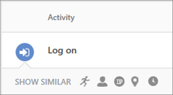

# Políticas de detecção de anomalias no Office 365 Cloud App SecurityAnomaly detection policies in Office 365 Cloud App Security

Gerenciamento de segurança avançada do Office 365 agora é segurança de aplicativo de nuvem do Office 365.Office 365 Advanced Security Management is now Office 365 Cloud App Security.
  
|Avaliação \* *\>*\*\*\*\*\*Evaluation\*\* \>\*\*|Planejamento \* *\>*\*\*\*\*\*Planning\*\* \>\*\*|Implantação \* *\>*\*\*\*\*\*Deployment\*\* \>\*\*|Utilização \* \* \*\*\*\*\*Utilization\*\*\*\*|
|:-----|:-----|:-----|:-----|
|[Comece a avaliarStart evaluating](office-365-cas-overview.md)   |[Começar a planejarStart planning](get-ready-for-office-365-cas.md)   |Você está aqui!You are here!    [Próxima etapaNext step](integrate-your-siem-server-with-office-365-cas.md)   |[Iniciar a utilizaçãoStart utilizing](utilization-activities-for-ocas.md)   |
   
Começando com a [versão de segurança de aplicativo do Microsoft Cloud 116](new-in-office-365-cas-2018.md#office-365-cloud-app-security-release-116), segurança de aplicativo de nuvem do Office 365 inclui várias anomalia predefinidos detecção diretivas ("pronto") que incluem o usuário e análise de comportamento de entidade (UEBA) e máquina aprendizagem (ML).Beginning with [Microsoft Cloud App Security release 116](new-in-office-365-cas-2018.md#office-365-cloud-app-security-release-116), Office 365 Cloud App Security includes several predefined anomaly detection policies ("out of the box") that include user and entity behavioral analytics (UEBA) and machine learning (ML).
  

  
Essas políticas de detecção de anomalia fornecem resultados imediatos, fornecendo detecções imediatas, direcionamento vários problemas de comportamentos entre os usuários e as máquinas e dispositivos conectados à sua rede. Além disso, as novas políticas exponham mais dados do mecanismo de detecção de segurança de aplicativo de nuvem para ajudá-lo a acelerar o processo de investigação e conter ameaças em andamento.These anomaly detection policies provide immediate results by providing immediate detections, targeting numerous behavioral anomalies across your users and the machines and devices connected to your network. In addition, the new policies expose more data from the Cloud App Security detection engine to help you speed up the investigation process and contain ongoing threats.
  
Como um administrador global do Office 365 ou um administrador de segurança, você pode examinar e, se necessário, revise as diretivas padrão que estão disponíveis com a segurança de aplicativo de nuvem do Office 365.As an Office 365 global administrator or security administrator, you can review, and if necessary, revise the default policies that are available with Office 365 Cloud App Security.
  
 > [!IMPORTANT]
> Não há um período inicial de aprendizado de sete (7) dias durante os quais os alertas de comportamento anômalos não são disparados. O algoritmo de detecção de anomalia é otimizado para reduzir o número de alertas falsos.There is an initial learning period of seven (7) days during which anomalous behavior alerts are not triggered. The anomaly detection algorithm is optimized to reduce the number of false positive alerts. 
  
## Antes de começarBefore you begin

Verifique se:Make sure that:
  
- Sua organização tem [Segurança de aplicativo de nuvem do Office 365](office-365-cas-overview.md)e o serviço está [ativado](turn-on-office-365-cas.md).Your organization has [Office 365 Cloud App Security](office-365-cas-overview.md), and the service is [turned on](turn-on-office-365-cas.md).
    
- [Log de auditoria](turn-audit-log-search-on-or-off.md) está ativado para o seu ambiente do Office 365.[Audit logging](turn-audit-log-search-on-or-off.md) is turned on for your Office 365 environment. 
    
- Você é um administrador global ou administrador de segurança para o Office 365.You are a global administrator or security administrator for Office 365.
    
## Exibir suas políticas de detecção de anomaliaView your anomaly detection policies

1. Como administrador global ou administrador de segurança, vá para o portal de segurança de aplicativo de nuvem ([https://portal.cloudappsecurity.com](https://portal.cloudappsecurity.com)) e entrar.As a global administrator or security administrator, go to the Cloud App Security portal ([https://portal.cloudappsecurity.com](https://portal.cloudappsecurity.com)) and sign in. Isso leva você para a página de diretivas de segurança de aplicativo de nuvem do Office 365.This takes you to the Office 365 Cloud App Security Policies page.
    
2. Na lista **tipo** , escolha a **política de detecção de anomalia**.In the **TYPE** list, choose **Anomaly detection policy**. Padrão da sua organização (ou existente) diretivas de detecção de anomalia são exibidas.Your organization's default (or existing) anomaly detection policies are displayed. 
  
3. Selecione uma política para analisar ou editar suas configurações.Select a policy to review or edit its settings.
    
4. Selecione **Atualizar** para salvar as alterações.Choose **Update** to save your changes. 
    
## Saiba mais sobre políticas de detecção de anomaliaLearn more about anomaly detection policies

Políticas de detecção de anomalia são automaticamente habilitadas; Entretanto, a segurança de aplicativo de nuvem do Office 365 tem um período inicial de aprendizado de sete dias durante os quais anomalia nem todos os alertas de detecção são geradas. Depois disso, cada sessão é comparada à atividade, quando os usuários estavam ativos, endereços IP, dispositivos, etc. detectadas do mês anterior e a pontuação de risco dessas atividades. Essas detecções fazem parte do mecanismo de detecção de anomalia heurística que seu ambiente de perfis e dispara alertas com relação uma linha de base que foi conhecidas a atividade da sua organização. Essas detecções também aproveitam os algoritmos de aprendizado de máquina projetados para os usuários e os padrões de log para reduzir os falsos positivos de perfil.Anomaly detection policies are automatically enabled; however, Office 365 Cloud App Security has an initial learning period of seven days during which not all anomaly detection alerts are raised. After that, each session is compared to the activity, when users were active, IP addresses, devices, etc. detected over the past month and the risk score of these activities. These detections are part of the heuristic anomaly detection engine that profiles your environment and triggers alerts with respect to a baseline that was learned on your organization's activity. These detections also leverage machine learning algorithms designed to profile the users and log-in patterns to reduce false positives.
  
Problemas são detectados, verificando a atividade do usuário. O risco é avaliado examinando a mais de 30 indicadores de risco diferentes, agrupados em vários fatores de risco, como endereço IP riscado, falhas de login, atividade de admin, contas inativas, local, impossíveis viagens, dispositivo e agente do usuário e taxa de atividade.Anomalies are detected by scanning user activity. The risk is evaluated by looking at over 30 different risk indicators, grouped into multiple risk factors, such as risky IP address, login failures, admin activity, inactive accounts, location, impossible travel, device and user agent, and activity rate.
  
Alertas de segurança com base nos resultados da política, são acionados. Segurança de aplicativo de nuvem do Office 365 procura em cada sessão do usuário no Office 365 e avisa sempre que acontece algo diferente da linha de base da sua organização ou de atividade de um usuário regular.Based on the policy results, security alerts are triggered. Office 365 Cloud App Security looks at every user session in Office 365, and alerts you whenever something happens that is different from the baseline of your organization or from a user's regular activity.
  
A tabela a seguir descreve as políticas de detecção de anomalia padrão, o que fazer e como eles funcionam.The following table describes the default anomaly detection policies, what they do, and how they work.
  
|**Nome de política de detecção de anomalia****Anomaly detection policy name**|**Como funciona****How it works**|
|:-----|:-----|
|Impossível viagensImpossible travel    |Identifica as duas atividades do usuário (é uma única ou várias sessões) provenientes de geograficamente distantes locais dentro de um período de tempo menor que o tempo ela teria levado o usuário passe da primeiro local para a segunda, indicando que um diferentes usuário está usando as mesmas credenciais. Esta detecção aproveita uma máquina aprendizagem algoritmo que ignora óbvios "falsos positivos" sua contribuição para a condição de viagens impossíveis, como VPNs e locais regularmente usados por outros usuários na organização. A detecção tem um período inicial de aprendizado de sete dias durante os quais ele aprende padrão da atividade de um novo usuário.Identifies two user activities (is a single or multiple sessions) originating from geographically distant locations within a time period shorter than the time it would have taken the user to travel from the first location to the second, indicating that a different user is using the same credentials. This detection leverages a machine learning algorithm that ignores obvious "false positives" contributing to the impossible travel condition, such as VPNs and locations regularly used by other users in the organization. The detection has an initial learning period of seven days during which it learns a new user's activity pattern.    |
|Atividade de país não frequentesActivity from infrequent country    |Considera antigas atividade locais para determinar o novos e não frequentes locais. O mecanismo de detecção de anomalia armazena informações sobre locais anteriores utilizado pelos usuários na organização. Um alerta é acionado quando ocorre uma atividade de um local que não foi recentemente ou nunca visitado pelo usuário ou por qualquer usuário na organização.Considers past activity locations to determine new and infrequent locations. The anomaly detection engine stores information about previous locations used by users in the organization. An alert is triggered when an activity occurs from a location that was not recently or never visited by the user or by any user in the organization.    |
|Atividade de endereços IP anônimosActivity from anonymous IP addresses    |Identifica que usuários estavam ativos a partir de um endereço IP que tenha sido identificado como um endereço IP de proxy anônimo. Esses proxies são usados por pessoas que deseja ocultar o endereço IP do seu dispositivo e podem ser usadas para fins maliciosos. Esta detecção aproveita uma máquina aprendizagem algoritmo que reduz "falsos positivos", como endereços IP de forma incorreta marcados que são amplamente usados pelos usuários na organização.Identifies that users were active from an IP address that has been identified as an anonymous proxy IP address. These proxies are used by people who want to hide their device's IP address, and may be used for malicious intent. This detection leverages a machine learning algorithm that reduces "false positives", such as mis-tagged IP addresses that are widely used by users in the organization.    |
|Atividade de endereços IP suspeitosActivity from suspicious IP addresses    |Identifica que usuários estavam ativos a partir de um endereço IP que tenha sido identificado como riscado pelo Microsoft Threat Intelligence. Esses endereços IP envolvidos nas atividades mal-intencionado, como Botnet C&amp;C e pode indicar conta comprometida. Esta detecção aproveita uma máquina aprendizagem algoritmo que reduz "falsos positivos", como endereços IP de forma incorreta marcados que são amplamente usados pelos usuários na organização.Identifies that users were active from an IP address that has been identified as risky by Microsoft Threat Intelligence. These IP addresses are involved in malicious activities, such as Botnet C&amp;C, and may indicate compromised account. This detection leverages a machine learning algorithm that reduces "false positives", such as mis-tagged IP addresses that are widely used by users in the organization.    |
|Atividades incomuns (por usuário)Unusual activities (by user)    | Identifica os usuários que executam atividades incomuns, tais como:Identifies users who perform unusual activities, such as:     – Múltiplos downloads de arquivo--Multiple file downloads     -- Atividades de compartilhamento de arquivo--File sharing activities     -- Arquivo atividades de exclusão--File deletion activities     – Atividades representação--Impersonation activities     – Atividades administrativas--Administrative activities     Essas políticas procuram a atividades dentro de uma única sessão com relação a linha de base aprendida, o que pode indicar em uma tentativa de violação. Essas detecções aproveitar uma máquina algoritmo que perfis os usuários fazem logon no padrão de aprendizado e reduz os falsos positivos. Essas detecções fazem parte do mecanismo de detecção de anomalia heurística que seu ambiente de perfis e dispara alertas com relação uma linha de base que foi conhecidas a atividade da sua organização.These policies look for activities within a single session with respect to the baseline learned, which could indicate on a breach attempt. These detections leverage a machine learning algorithm that profiles the users log on pattern and reduces false positives. These detections are part of the heuristic anomaly detection engine that profiles your environment and triggers alerts with respect to a baseline that was learned on your organization's activity.    |
|Várias tentativas de login com falhaMultiple failed login attempts    |Identifica os usuários que falharam várias tentativas de logon em uma única sessão com relação a linha de base aprendida, que poderia indicar em uma tentativa de violação.Identifies users that failed multiple login attempts in a single session with respect to the baseline learned, which could indicate on a breach attempt.    |
   
## Alertas de detecção de anomalia triagemTriage anomaly detection alerts

À medida que chegam alertas, você pode triagem esses alertas rapidamente e determinar quais devem lidar com pela primeira vez. Ter o contexto de um alerta permite que você consulte panorama e determine se algo mal-intencionado está acontecendo na verdade. Use o procedimento a seguir para dar início a explorando um alerta:As alerts come in, you can triage those alerts quickly and determine which ones to handle first. Having context for an alert enables you to see the bigger picture and determine whether something malicious is indeed happening. Use the following procedure to get started exploring an alert:
  
1. Como administrador global ou administrador de segurança, vá para o portal de segurança de aplicativo de nuvem ([https://portal.cloudappsecurity.com](https://portal.cloudappsecurity.com)) e entrar.As a global administrator or security administrator, go to the Cloud App Security portal ([https://portal.cloudappsecurity.com](https://portal.cloudappsecurity.com)) and sign in. 
    
2. Escolha **alertas** para exibir os alertas.Choose **Alerts** to view your alerts. 
    
3. Para obter o contexto de um alerta, siga estas etapas:To get context for an alert, follow these steps:
    
4. Escolha **investigar** \> **log da atividade**.Choose **Investigate** \> **Activity log**.
    
5. Selecione um item, como um usuário ou o endereço IP. Isso abre o dinheiro ideias relevantes.Select an item, such as a user or IP address. This opens the relevant insights drawer. 
  
6. No dinheiro ideias relevantes, clique em um comando disponível, como um ícone na seção **Mostrar SEMELHANTE** .In the relevant insights drawer, click an available command, such as an icon in the **SHOW SIMILAR** section.  
  
7. Obtém ideias sobre o item selecionado ao continuar a explorar os detalhes de item.Gain insight about the selected item by continuing to explore details for that item.
    
Um alerta em vários logins com falha de fato ser suspeito e pode indicar um ataque de força bruta potencial. No entanto, um alerta tal também pode ser um erro de configuração de aplicativo, fazendo com que o alerta para ser um positivo true benigno. Se você vir um alerta de logons falhou múltiplo com atividades suspeitas adicionais, há uma probabilidade maior que uma conta for comprometida. Por exemplo, suponha que um alerta de login falhou múltiplo é seguido por atividade de um endereço IP TOR e viagens impossíveis de atividade, ambos os indicadores fortes de comprometimento. Você ainda pode ver que o mesmo usuário realizada uma atividade de download em massa, que é geralmente um indicador do invasor executando exfiltration de dados. Ele do coisas como o que você pode explorar na segurança do aplicativo de nuvem do Office 365 visualizar e triagem os alertas e agir onde for necessário.An alert on multiple failed logins might indeed be suspicious, and can indicate a potential brute-force attack. However, such an alert can also be an application misconfiguration, causing the alert to be a benign true positive. If you see a multiple-failed-logins alert with additional suspicious activities, then there is a higher probability that an account is compromised. For example, suppose that a multiple-failed-login alert is followed by activity from a TOR IP address and impossible travel activity, both strong indicators of compromise. You might even see that the same user performed a mass download activity, which is often an indicator of the attacker performing exfiltration of data. It's things like that that you can explore in Office 365 Cloud App Security to view and triage your alerts, and take action where needed.
  
## Próximas etapasNext steps

- [Integrar seu servidor SIEMIntegrate your SIEM server](integrate-your-siem-server-with-office-365-cas.md)
    
- [Revise e agir em alertasReview and take action on alerts](review-office-365-cas-alerts.md)
    
- [Seus endereços IP para simplificar o gerenciamento de grupoGroup your IP addresses to simplify management](group-your-ip-addresses-in-ocas.md)
    

