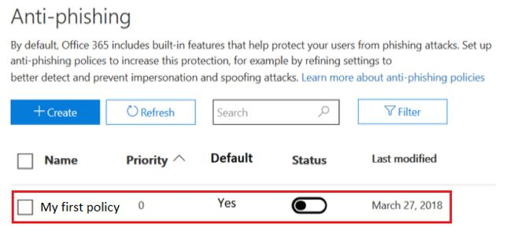
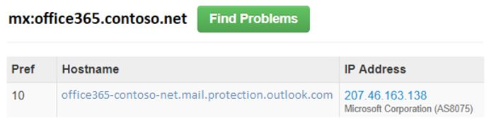

# <a name="anti-spoofing-protection-in-office-365"></a><span data-ttu-id="c2d7b-105">Proteção antifalsificação no Office 365</span><span class="sxs-lookup"><span data-stu-id="c2d7b-105">Anti-spoofing protection in Office 365</span></span>

<span data-ttu-id="c2d7b-p102">Este artigo descreve como Office 365 reduz contra ataques de phishing que usa falsificado domínios do remetente, ou seja, os domínios que são falsificados. Ele realiza isso analisando as mensagens e bloqueando aqueles que não podem ser autenticados usando os métodos de autenticação de email padrão, nem outras técnicas de reputação do remetente. Essa alteração está sendo implementada para reduzir o número de ataques de phishing, os clientes estão expostos a.</span><span class="sxs-lookup"><span data-stu-id="c2d7b-p102">This article describes how Office 365 mitigates against phishing attacks that uses forged sender domains, that is, domains that are spoofed. It accomplishes this by analyzing the messages and blocking the ones that cannot be authenticated using standard email authentication methods, nor other sender reputation techniques. This change is being implemented to reduce the number of phishing attacks customers are exposed to.</span></span>
  
<span data-ttu-id="c2d7b-109">Este artigo também descreve por que essa alteração está sendo feita, como os clientes podem se preparar para que essa alteração, como visualizar mensagens que serão afetadas, como a ser relatado nas mensagens, como reduzir os falsos positivos, bem como os remetentes à Microsoft devem se preparar para isso Altere.</span><span class="sxs-lookup"><span data-stu-id="c2d7b-109">This article also describes why this change is being made, how customers can prepare for this change, how to view messages that will be affected, how to report on messages, how to mitigate false positives, as well as how senders to Microsoft should prepare for this change.</span></span>
  
<span data-ttu-id="c2d7b-p103">A tecnologia da Microsoft antifalsificação inicialmente foi implantada para suas organizações que tinham uma assinatura do Office 365 Enterprise E5 ou comprou o complemento de proteção de ameaça avançadas (ATP) do Office 365 da assinatura deles. A partir de outubro de 2018, podemos estendi a proteção para as organizações que possuem o Exchange Online Protection (EOP) também. Além disso, por causa da maneira que todos nossos filtros Saiba uns dos outros, Outlook.com usuários também podem ser afetados.</span><span class="sxs-lookup"><span data-stu-id="c2d7b-p103">Microsoft's anti-spoofing technology was initially deployed to its organizations that had an Office 365 Enterprise E5 subscription or had purchased the Office 365 Advanced Threat Protection (ATP) add-on for their subscription. As of October, 2018 we've extended the protection to organizations that have Exchange Online Protection (EOP) as well. Additionally, because of the way all of our filters learn from each other, Outlook.com users may also be affected.</span></span>
  
## <a name="how-spoofing-is-used-in-phishing-attacks"></a><span data-ttu-id="c2d7b-113">Como a falsificação é usada nos ataques de phishing</span><span class="sxs-lookup"><span data-stu-id="c2d7b-113">How spoofing is used in phishing attacks</span></span>

<span data-ttu-id="c2d7b-p104">Quando se trata de proteger seus usuários, o Microsoft leva a ameaça de phishing sério. Uma das técnicas a remetentes de spam e phishers normalmente usam é a falsificação, que é quando o remetente é falsificado e uma mensagem parece ter vindo de alguém ou em algum lugar que não seja a origem real. Essa técnica é frequentemente usada em campanhas de phishing criadas para obter as credenciais do usuário. A tecnologia da Microsoft contra falsificação especificamente examina a falsificação do ' de: cabeçalho ' que é um nome que aparece em um cliente de email como o Outlook. Quando a Microsoft tem alta confiabilidade que From: cabeçalho é falsificado, ela identifica a mensagem como um falso.</span><span class="sxs-lookup"><span data-stu-id="c2d7b-p104">When it comes to protecting its users, Microsoft takes the threat of phishing seriously. One of the techniques that spammers and phishers commonly use is spoofing, which is when the sender is forged, and a message appears to originate from someone or somewhere other than the actual source. This technique is often used in phishing campaigns designed to obtain user credentials. Microsoft's Anti-spoof technology specifically examines forgery of the 'From: header' which is the one that shows up in an email client like Outlook. When Microsoft has high confidence that the From: header is spoofed, it identifies the message as a spoof.</span></span>
  
<span data-ttu-id="c2d7b-119">Falsificação de mensagens tem duas implicações negativas para usuários da vida real:</span><span class="sxs-lookup"><span data-stu-id="c2d7b-119">Spoofing messages have two negative implications for real life users:</span></span>
  
### <a name="1-spoofed-messages-deceive-users"></a><span data-ttu-id="c2d7b-120">1. falsificadas mensagens levando usuários</span><span class="sxs-lookup"><span data-stu-id="c2d7b-120">1. Spoofed messages deceive users</span></span>
  
<span data-ttu-id="c2d7b-p105">Primeiro, uma mensagem falsificada pode fazer o usuário clicar em um link e abandonada suas credenciais, baixando malware ou responder uma mensagem com conteúdo confidencial (o último é conhecido como comprometimento de Email comercial). Por exemplo, este é uma mensagem de phishing com um remetente falsificado da msoutlook94@service.outlook.com:</span><span class="sxs-lookup"><span data-stu-id="c2d7b-p105">First, a spoofed message may trick a user into clicking a link and giving up their credentials, downloading malware, or replying to a message with sensitive content (the latter of which is known as Business Email Compromise). For example, the following is a phishing message with a spoofed sender of msoutlook94@service.outlook.com:</span></span>
  

  
<span data-ttu-id="c2d7b-p106">Acima na verdade não provém da service.outlook.com, mas em vez disso, foi falsificadas pelo phisher torná-lo a aparência que tinha. Ele está tentando fazer o usuário clicar no link dentro da mensagem.</span><span class="sxs-lookup"><span data-stu-id="c2d7b-p106">The above did not actually come from service.outlook.com, but instead was spoofed by the phisher to make it look like it did. It is attempting to trick a user into clicking the link within the message.</span></span>
  
<span data-ttu-id="c2d7b-126">O próximo exemplo é falsificação contoso.com:</span><span class="sxs-lookup"><span data-stu-id="c2d7b-126">The next example is spoofing contoso.com:</span></span>
  

  
<span data-ttu-id="c2d7b-p107">A mensagem parece legítima, mas é na verdade um falso. Essa mensagem de phishing é um tipo de comprometimento de Email de negócios que é uma subcategoria de phishing.</span><span class="sxs-lookup"><span data-stu-id="c2d7b-p107">The message looks legitimate, but in fact is a spoof. This phishing message is a type of Business Email Compromise which is a subcategory of phishing.</span></span>
    
### <a name="2-users-confuse-real-messages-for-fake-ones"></a><span data-ttu-id="c2d7b-130">2. usuários confunda mensagens reais para aqueles falsas</span><span class="sxs-lookup"><span data-stu-id="c2d7b-130">2. Users confuse real messages for fake ones</span></span>
  
<span data-ttu-id="c2d7b-p108">Segunda, falsificadas mensagens criar incerteza para usuários que saber sobre mensagens de phishing, mas não pode determinar a diferença entre uma mensagem real e um falsificados. Por exemplo, este é um exemplo de uma senha real redefinido a partir do endereço de email do Microsoft Security conta:</span><span class="sxs-lookup"><span data-stu-id="c2d7b-p108">Second, spoofed messages create uncertainty for users who know about phishing messages but cannot tell the difference between a real message and spoofed one. For example, the following is an example of an actual password reset from the Microsoft Security account email address:</span></span>
  

  
<span data-ttu-id="c2d7b-p109">A mensagem acima provém da Microsoft, mas ao mesmo tempo, os usuários são usados para obtenção de mensagens de phishing que pode fazer com que um usuário clicar em um link e abandonada suas credenciais, baixando malware ou responder a uma mensagem com conteúdo confidencial. Como é difícil dizer a diferença entre uma redefinição de senha real e um falso, muitos usuários ignoram essas mensagens, indicá-las como spam ou desnecessariamente indicá as mensagens de volta para a Microsoft como golpes de phishing perdidas.</span><span class="sxs-lookup"><span data-stu-id="c2d7b-p109">The above message did come from Microsoft, but at the same time, users are used to getting phishing messages that may trick a user into clicking a link and giving up their credentials, downloading malware, or replying to a message with sensitive content. Because it is difficult to tell the difference between a real password reset and a fake one, many users ignore these messages, report them as spam, or unnecessarily report the messages back to Microsoft as missed phishing scams.</span></span>
    
<span data-ttu-id="c2d7b-p110">Para interromper a falsificação, o setor de filtragem de email desenvolveu protocolos de autenticação de email como [SPF](https://docs.microsoft.com/office365/SecurityCompliance/set-up-spf-in-office-365-to-help-prevent-spoofing), [DKIM](https://docs.microsoft.com/office365/SecurityCompliance/use-dkim-to-validate-outbound-email)e [DMARC](https://docs.microsoft.com/office365/SecurityCompliance/use-dmarc-to-validate-email). DMARC impede a falsificação examinando o remetente da mensagem - aquele que o usuário vê em seu cliente de email (nos exemplos acima, isto é service.outlook.com, outlook.com e accountprotection.microsoft.com) - com o domínio que transmita SPF ou DKIM. Ou seja, o domínio que o usuário vê tiverem sido autenticado e, portanto, não falsificado. Para obter uma discussão mais completa, consulte a seção "*Noções básicas sobre por que a autenticação de email nem sempre é suficiente para interromper a falsificação"* posteriormente contidas neste documento.</span><span class="sxs-lookup"><span data-stu-id="c2d7b-p110">To stop spoofing, the email filtering industry has developed email authentication protocols such as [SPF](https://docs.microsoft.com/office365/SecurityCompliance/set-up-spf-in-office-365-to-help-prevent-spoofing), [DKIM](https://docs.microsoft.com/office365/SecurityCompliance/use-dkim-to-validate-outbound-email), and [DMARC](https://docs.microsoft.com/office365/SecurityCompliance/use-dmarc-to-validate-email). DMARC prevents spoofing examining a message's sender - the one that the user sees in their email client (in the examples above, this is service.outlook.com, outlook.com, and accountprotection.microsoft.com) - with the domain that passed SPF or DKIM. That is, the domain that the user sees has been authenticated and is therefore not spoofed. For a more complete discussion, see the section "*Understanding why email authentication is not always enough to stop spoofing"*  later on in this document.</span></span> 
  
<span data-ttu-id="c2d7b-p111">No entanto, o problema é que a autenticação de email registros são opcionais, não é necessário. Portanto, enquanto os domínios com políticas de autenticação forte like microsoft.com e skype.com estão protegidos contra falsificação, domínios que publicar as políticas de autenticação mais fracas ou nenhuma diretiva nisso, são alvos de sendo falsificado. A partir de março de 2018, somente 9% dos domínios das empresas da Fortune 500 publicar as políticas de autenticação de alta segurança de email. O restante 91% pode ser falsificado pelo phisher e, a menos que o filtro de email detecta-lo usando a diretiva de outra, pode ser entregue a um usuário final e levando-las:</span><span class="sxs-lookup"><span data-stu-id="c2d7b-p111">However, the problem is that email authentication records are optional, not required. Therefore, while domains with strong authentication policies like microsoft.com and skype.com are protected from spoofing, domains that publish weaker authentication policies, or no policy at all, are targets for being spoofed.As of March 2018, only 9% of domains of companies in the Fortune 500 publish strong email authentication policies. The remaining 91% may be spoofed by a phisher, and unless the email filter detects it using another policy, may be delivered to an end user and deceive them:</span></span>
  

  
<span data-ttu-id="c2d7b-144">A proporção de empresas de pequeno a médio porte que não estão na Fortune 500 que publicar as políticas de autenticação forte email é menor e menor ainda para domínios que estão fora da América do Norte e Europa Ocidental.</span><span class="sxs-lookup"><span data-stu-id="c2d7b-144">The proportion of small-to-medium sized companies that are not in the Fortune 500 that publish strong email authentication policies is smaller, and smaller still for domains that are outside of North America and western Europe.</span></span>
  
<span data-ttu-id="c2d7b-145">Este é um grande problema porque enquanto as empresas podem não estar cientes de como funciona a autenticação de email, phishers entender e tirar proveito da falta de-lo.</span><span class="sxs-lookup"><span data-stu-id="c2d7b-145">This is a big problem because while enterprises may not be aware of how email authentication works, phishers do understand and take advantage of the lack of it.</span></span>
  
<span data-ttu-id="c2d7b-146">Para obter informações sobre como configurar o SPF, DKIM e DMARC, consulte a seção "*os clientes do Office 365"* mais adiante neste documento.</span><span class="sxs-lookup"><span data-stu-id="c2d7b-146">For information on setting up SPF, DKIM, and DMARC, see the section "*Customers of Office 365"*  later on in this document.</span></span> 
  
## <a name="stopping-spoofing-with-implicit-email-authentication"></a><span data-ttu-id="c2d7b-147">Parando falsificação com a autenticação de email implícita</span><span class="sxs-lookup"><span data-stu-id="c2d7b-147">Stopping spoofing with implicit email authentication</span></span>

<span data-ttu-id="c2d7b-p112">Porque phishing phishing e lança tal um problema e devido a adoção limitada de políticas de autenticação forte email, o Microsoft continua a investir em recursos, para proteger seus clientes. Portanto, Microsoft está se movendo com antecedência com a *autenticação de email implícita* - se um domínio não autenticados, Microsoft irá tratá-lo como se tivesse publicado registros de autenticação de e-mail e tratá-lo adequadamente, se ele não passa.</span><span class="sxs-lookup"><span data-stu-id="c2d7b-p112">Because phishing and spear phishing is such a problem, and because of the limited adoption of strong email authentication policies, Microsoft continues to invest in capabilities to protect its customers. Therefore, Microsoft is moving ahead with  *implicit email authentication* - if a domain doesn't authenticate, Microsoft will treat it as if it had published email authentication records and treat it accordingly if it doesn't pass.</span></span> 
  
<span data-ttu-id="c2d7b-p113">Para realizar isso, a Microsoft criou inúmeras extensões para a autenticação de email regular incluindo reputação do remetente, histórico de remetente/destinatário, análise de comportamento e outras técnicas avançadas. Uma mensagem enviada de um domínio que não publica autenticação de email será marcada como falso, a menos que ele contém outros sinaliza para indicar que ela está legítima.</span><span class="sxs-lookup"><span data-stu-id="c2d7b-p113">To accomplish this, Microsoft has built numerous extensions to regular email authentication including sender reputation, sender/recipient history, behavioral analysis, and other advanced techniques. A message sent from a domain that doesn't publish email authentication will be marked as spoof unless it contains other signals to indicate that it is legitimate.</span></span>
  
<span data-ttu-id="c2d7b-152">Fazendo isso, end, os usuários podem ter confiança que não tenha sido falsificado um email enviado a ele, remetentes podem ter certo que ninguém está representando o seu domínio e os clientes do Office 365 podem oferecer proteção ainda melhor como proteção de representação.</span><span class="sxs-lookup"><span data-stu-id="c2d7b-152">By doing this, end users can have confidence that an email sent to them has not been spoofed, senders can be confident that nobody is impersonating their domain, and customers of Office 365 can offer even better protection such as Impersonation protection.</span></span>
  
<span data-ttu-id="c2d7b-153">Para ver o lançamento de geral da Microsoft, consulte [A Sea de Phish parte 2 - Enhanced Antifalsificação no Office 365](https://techcommunity.microsoft.com/t5/Security-Privacy-and-Compliance/Schooling-A-Sea-of-Phish-Part-2-Enhanced-Anti-spoofing/ba-p/176209).</span><span class="sxs-lookup"><span data-stu-id="c2d7b-153">To see Microsoft's general announcement, see [A Sea of Phish Part 2 - Enhanced Anti-spoofing in Office 365](https://techcommunity.microsoft.com/t5/Security-Privacy-and-Compliance/Schooling-A-Sea-of-Phish-Part-2-Enhanced-Anti-spoofing/ba-p/176209).</span></span>
  
## <a name="identifying-that-a-message-is-classified-as-spoofed"></a><span data-ttu-id="c2d7b-154">Identificação que uma mensagem é classificada como falsificado</span><span class="sxs-lookup"><span data-stu-id="c2d7b-154">Identifying that a message is classified as spoofed</span></span>

### <a name="composite-authentication"></a><span data-ttu-id="c2d7b-155">Autenticação de composição</span><span class="sxs-lookup"><span data-stu-id="c2d7b-155">Composite authentication</span></span>

<span data-ttu-id="c2d7b-p114">Embora SPF, DKIM e DMARC sejam úteis tudo sozinhos, elas não se comunicar suficiente status de autenticação no caso de uma mensagem não possui autenticação explícita registros. Portanto, a Microsoft desenvolveu um algoritmo que combina os sinais de vários em um único valor chamado autenticação composição ou compauth para short. Os clientes no Office 365 têm valores compauth cortados no cabeçalho de *Autenticação resultados* nos cabeçalhos da mensagem.</span><span class="sxs-lookup"><span data-stu-id="c2d7b-p114">While SPF, DKIM, and DMARC are all useful by themselves, they don't communicate enough authentication status in the event a message has no explicit authentication records. Therefore, Microsoft has developed an algorithm that combines multiple signals into a single value called Composite Authentication, or compauth for short. Customers in Office 365 have compauth values stamped into the *Authentication-Results* header in the message headers.</span></span> 
  
```
Authentication-Results:
  compauth=<fail|pass|softpass|none> reason=<yyy>

```

|<span data-ttu-id="c2d7b-159">**Resultado de CompAuth**</span><span class="sxs-lookup"><span data-stu-id="c2d7b-159">**CompAuth result**</span></span>|<span data-ttu-id="c2d7b-160">**Descrição**</span><span class="sxs-lookup"><span data-stu-id="c2d7b-160">**Description**</span></span>|
|:-----|:-----|
|<span data-ttu-id="c2d7b-161">falhar</span><span class="sxs-lookup"><span data-stu-id="c2d7b-161">fail</span></span>|<span data-ttu-id="c2d7b-162">Mensagem falhou explícitas de autenticação (Enviar domínio publicado registros explicitamente no DNS) ou autenticação implícita (envio domínio não publicou registros no DNS, para o Office 365 interpolados o resultado como se tivesse publicado registros).</span><span class="sxs-lookup"><span data-stu-id="c2d7b-162">Message failed explicit authentication (sending domain published records explicitly in DNS) or implicit authentication (sending domain did not publish records in DNS, so Office 365 interpolated the result as if it had published records).</span></span>|
|<span data-ttu-id="c2d7b-163">passar</span><span class="sxs-lookup"><span data-stu-id="c2d7b-163">pass</span></span>|<span data-ttu-id="c2d7b-164">Mensagem passada explícitas de autenticação (mensagem passado DMARC ou [Adivinhar recomendadas passadas DMARC](https://blogs.msdn.microsoft.com/tzink/2015/05/06/what-is-dmarc-bestguesspass-in-office-365)) ou autenticação implícita com alta confiabilidade (enviando o domínio não publicar os registros de autenticação de e-mail, mas o Office 365 tem sinais de back-end forte para indicar que a mensagem é provável legítimo).</span><span class="sxs-lookup"><span data-stu-id="c2d7b-164">Message passed explicit authentication (message passed DMARC, or [Best Guess Passed DMARC](https://blogs.msdn.microsoft.com/tzink/2015/05/06/what-is-dmarc-bestguesspass-in-office-365)) or implicit authentication with high confidence (sending domain does not publish email authentication records, but Office 365 has strong backend signals to indicate the message is likely legitimate).</span></span>|
|<span data-ttu-id="c2d7b-165">softpass</span><span class="sxs-lookup"><span data-stu-id="c2d7b-165">softpass</span></span>|<span data-ttu-id="c2d7b-166">Mensagem passada autenticação implícita com confiança baixa e médio (enviando o domínio não publicar a autenticação de email, mas o Office 365 tem sinais de back-end para indicar a mensagem é legítima, mas a intensidade do sinal é mais fraca).</span><span class="sxs-lookup"><span data-stu-id="c2d7b-166">Message passed implicit authentication with low-to-medium confidence (sending domain does not publish email authentication, but Office 365 has backend signals to indicate the message is legitimate but the strength of the signal is weaker).</span></span>|
|<span data-ttu-id="c2d7b-167">nenhum</span><span class="sxs-lookup"><span data-stu-id="c2d7b-167">none</span></span>|<span data-ttu-id="c2d7b-168">Mensagem não autenticou (ou autenticar, mas não alinha), mas não são aplicada devido a reputação do remetente ou outros fatores de autenticação composta.</span><span class="sxs-lookup"><span data-stu-id="c2d7b-168">Message did not authenticate (or it did authenticate but did not align), but composite authentication not applied due to sender reputation or other factors.</span></span>|
   
|||
|:-----|:-----|
|<span data-ttu-id="c2d7b-169">**Motivo**</span><span class="sxs-lookup"><span data-stu-id="c2d7b-169">**Reason**</span></span>|<span data-ttu-id="c2d7b-170">**Descrição**</span><span class="sxs-lookup"><span data-stu-id="c2d7b-170">**Description**</span></span>|
|<span data-ttu-id="c2d7b-171">0XX</span><span class="sxs-lookup"><span data-stu-id="c2d7b-171">0xx</span></span>|<span data-ttu-id="c2d7b-172">Mensagem de falha na autenticação composta.</span><span class="sxs-lookup"><span data-stu-id="c2d7b-172">Message failed composite authentication.</span></span><br/><span data-ttu-id="c2d7b-173">**000** significa que a mensagem falhou DMARC com uma ação de rejeição ou quarentena.</span><span class="sxs-lookup"><span data-stu-id="c2d7b-173">**000** means the message failed DMARC with an action of reject or quarantine.</span></span>  <br/><span data-ttu-id="c2d7b-p115">**001** significa que a mensagem de falha na autenticação de email implícita. Isso significa que o domínio de envio não tinha registros de autenticação de e-mail publicados ou se eles fizeram, que tinham uma política de falha mais fraca (fail suave de SPF ou neutro, política DMARC de p = none).</span><span class="sxs-lookup"><span data-stu-id="c2d7b-p115">**001** means the message failed implicit email authentication. This means that the sending domain did not have email authentication records published, or if they did, they had a weaker failure policy (SPF soft fail or neutral, DMARC policy of p=none).  </span></span><br/><span data-ttu-id="c2d7b-176">**002** significa que a organização possui uma política para o par de remetente/domínio proibido explicitamente enviem email falsificado, essa configuração é definir manualmente por um administrador.</span><span class="sxs-lookup"><span data-stu-id="c2d7b-176">**002** means the organization has a policy for the sender/domain pair that is explicitly prohibited from sending spoofed email, this setting is manually set by an administrator.</span></span>  <br/><span data-ttu-id="c2d7b-177">**010** significa a mensagem falhou DMARC com uma ação de rejeição ou quarentena e o domínio de envio é um dos domínios aceitos da sua organização (Isso é parte de auto-to-self ou interna da organização, falsificação).</span><span class="sxs-lookup"><span data-stu-id="c2d7b-177">**010** means the message failed DMARC with an action of reject or quarantine, and the sending domain is one of your organization's accepted-domains (this is part of self-to-self, or intra-org, spoofing).</span></span>  <br/><span data-ttu-id="c2d7b-178">**011** significa que a mensagem de falha na autenticação de email implícita, e o domínio de envio é um dos domínios aceitos de sua organização (Isso é parte de auto-to-self ou interna da organização, falsificação).</span><span class="sxs-lookup"><span data-stu-id="c2d7b-178">**011** means the message failed implicit email authentication, and the sending domain is one of your organization's accepted domains (this is part of self-to-self, or intra-org, spoofing).</span></span>|
|<span data-ttu-id="c2d7b-179">Todos os outros códigos (1xx, 2xx, 3xx, 4xx, 5xx)</span><span class="sxs-lookup"><span data-stu-id="c2d7b-179">All other codes (1xx, 2xx, 3xx, 4xx, 5xx)</span></span>|<span data-ttu-id="c2d7b-180">Corresponde à diversos códigos internos para o motivo pelo qual uma mensagem passadas autenticação implícita ou não tinha nenhuma autenticação, mas nenhuma ação foi aplicada.</span><span class="sxs-lookup"><span data-stu-id="c2d7b-180">Corresponds to various internal codes for why a message passed implicit authentication, or had no authentication but no action was applied.</span></span>|
   
<span data-ttu-id="c2d7b-181">Examinando os cabeçalhos de uma mensagem, um administrador ou até mesmo um usuário final pode determinar como o Office 365 chega na conclusão que o remetente pode ser falsificado.</span><span class="sxs-lookup"><span data-stu-id="c2d7b-181">By looking at the headers of a message, an administrator or even an end user can determine how Office 365 arrives at the conclusion that the sender may be spoofed.</span></span>
  
### <a name="differentiating-between-different-types-of-spoofing"></a><span data-ttu-id="c2d7b-182">Distinguir entre tipos diferentes de falsificação</span><span class="sxs-lookup"><span data-stu-id="c2d7b-182">Differentiating between different types of spoofing</span></span>

<span data-ttu-id="c2d7b-183">Microsoft faz distinção entre dois tipos diferentes de falsificação de mensagens:</span><span class="sxs-lookup"><span data-stu-id="c2d7b-183">Microsoft differentiates between two different types of spoofing messages:</span></span>
  
 <span data-ttu-id="c2d7b-184">**Falsificação de interna da organização**</span><span class="sxs-lookup"><span data-stu-id="c2d7b-184">**Intra-org spoofing**</span></span>
  
<span data-ttu-id="c2d7b-185">Também conhecido como falsificação self-to-self, isso ocorre quando o domínio no campo From: endereço são os mesmos, ou se alinha com, o domínio do destinatário (quando o domínio do destinatário é um dos [Domínios aceitos](https://technet.microsoft.com/en-us/library/jj945194%28v=exchg.150%29.aspx)de sua organização); ou, quando o domínio no campo From: endereço é parte da mesma organização.</span><span class="sxs-lookup"><span data-stu-id="c2d7b-185">Also known as self-to-self spoofing, this occurs when the domain in the From: address is the same as, or aligns with, the recipient domain (when recipient domain is one of your organization's [Accepted Domains](https://technet.microsoft.com/en-us/library/jj945194%28v=exchg.150%29.aspx)); or, when the domain in the From: address is part of the same organization.</span></span>
  
<span data-ttu-id="c2d7b-p116">Por exemplo, o seguinte tem remetente e destinatário do mesmo domínio (contoso.com). Espaços são inseridos no endereço de email para evitar a coleta de spambot nesta página):</span><span class="sxs-lookup"><span data-stu-id="c2d7b-p116">For example, the following has sender and recipient from the same domain (contoso.com). Spaces are inserted into the email address to prevent spambot harvesting on this page):</span></span>
  
<span data-ttu-id="c2d7b-188">De: remetente @ contoso.com</span><span class="sxs-lookup"><span data-stu-id="c2d7b-188">From: sender @ contoso.com</span></span>
  
<span data-ttu-id="c2d7b-189">Para: destinatário @ contoso.com</span><span class="sxs-lookup"><span data-stu-id="c2d7b-189">To: recipient @ contoso.com</span></span>
  
<span data-ttu-id="c2d7b-190">O exemplo a seguir possui os domínios de remetente e destinatário alinhando com o domínio organizacional (fabrikam.com):</span><span class="sxs-lookup"><span data-stu-id="c2d7b-190">The following has the sender and recipient domains aligning with the organizational domain (fabrikam.com):</span></span>
  
<span data-ttu-id="c2d7b-191">De: remetente @ foo.fabrikam.com</span><span class="sxs-lookup"><span data-stu-id="c2d7b-191">From: sender @ foo.fabrikam.com</span></span>
  
<span data-ttu-id="c2d7b-192">Para: destinatário @ bar.fabrikam.com</span><span class="sxs-lookup"><span data-stu-id="c2d7b-192">To: recipient @ bar.fabrikam.com</span></span>
  
<span data-ttu-id="c2d7b-193">Os seguintes domínios de remetente e destinatário são diferentes (microsoft.com e bing.com), mas eles pertencem à mesma organização (ou seja, ambos fazem parte de domínios aceitos da organização):</span><span class="sxs-lookup"><span data-stu-id="c2d7b-193">The following sender and recipient domains are different (microsoft.com and bing.com), but they belong to the same organization (that is, both are part of the organization's Accepted Domains):</span></span>
  
<span data-ttu-id="c2d7b-194">De: remetente @ microsoft.com</span><span class="sxs-lookup"><span data-stu-id="c2d7b-194">From: sender @ microsoft.com</span></span>
  
<span data-ttu-id="c2d7b-195">Para: destinatário @ bing.com</span><span class="sxs-lookup"><span data-stu-id="c2d7b-195">To: recipient @ bing.com</span></span>
  
<span data-ttu-id="c2d7b-196">Mensagens que falham interna da organização falsificação contêm os seguintes valores nos cabeçalhos:</span><span class="sxs-lookup"><span data-stu-id="c2d7b-196">Messages that fail intra-org spoofing contain the following values in the headers:</span></span>
  
<span data-ttu-id="c2d7b-197">X-Forefront-Antispam-Report: … CAT:SPM/HSPM/PHSH; … SFTY:9.11</span><span class="sxs-lookup"><span data-stu-id="c2d7b-197">X-Forefront-Antispam-Report: ...CAT:SPM/HSPM/PHSH;...SFTY:9.11</span></span>
  
<span data-ttu-id="c2d7b-198">O gato está a categoria da mensagem e ela normalmente é marcada como SPM (spam), mas ocasionalmente podem ser HSPM (spam de alta confiabilidade) ou de PHISHING (phishing) dependendo das quais outros tipos de padrões ocorrer na mensagem.</span><span class="sxs-lookup"><span data-stu-id="c2d7b-198">The CAT is the category of the message, and it is normally stamped as SPM (spam), but occasionally may be HSPM (high confidence spam) or PHISH (phishing) depending upon what other types of patterns occur in the message.</span></span>
  
<span data-ttu-id="c2d7b-199">O SFTY é o nível de segurança da mensagem, os meios de dígito (9) primeiro a mensagem é phishing e segundo conjunto de dígitos após o ponto (11) significa que ele é falsificação interna da organização.</span><span class="sxs-lookup"><span data-stu-id="c2d7b-199">The SFTY is the safety level of the message, the first digit (9) means the message is phishing, and second set of digits after the dot (11) means it is intra-org spoofing.</span></span>
  
<span data-ttu-id="c2d7b-200">Não há nenhum código de razão específica para autenticação composto de falsificação, interna da organização que receberá o carimbo / posteriormente no 2018 (cronograma ainda não foi definida).</span><span class="sxs-lookup"><span data-stu-id="c2d7b-200">There is no specific reason code for Composite Authentication for intra-org spoofing, that will be stamped later in 2018 (timeline not yet defined).</span></span>
  
 <span data-ttu-id="c2d7b-201">**Falsificação entre domínios**</span><span class="sxs-lookup"><span data-stu-id="c2d7b-201">**Cross-domain spoofing**</span></span>
  
<span data-ttu-id="c2d7b-p117">Isso ocorre quando o domínio de envio no campo From: endereço é um domínio externo para a organização de recebimento. Mensagens que falham autenticação composto devido a falsificação entre domínios contêm os seguintes valores nos cabeçalhos:</span><span class="sxs-lookup"><span data-stu-id="c2d7b-p117">This occurs when the sending domain in the From: address is an external domain to the receiving organization. Messages that fail Composite Authentication due to cross-domain spoofing contain the following values in the headers:</span></span>
  
<span data-ttu-id="c2d7b-p118">Resultados de autenticação: … compauth = fail motivo = 000/001</span><span class="sxs-lookup"><span data-stu-id="c2d7b-p118">Authentication-Results: … compauth=fail reason=000/001</span></span>
  
<span data-ttu-id="c2d7b-206">X-Forefront-Antispam-Report: … CAT:SPOOF; … SFTY:9.22</span><span class="sxs-lookup"><span data-stu-id="c2d7b-206">X-Forefront-Antispam-Report: ...CAT:SPOOF;...SFTY:9.22</span></span>
  
<span data-ttu-id="c2d7b-207">Em ambos os casos, a seguinte dica safety vermelho é marcada na mensagem ou um equivalente que é personalizado para o idioma do destinatário da caixa de correio:</span><span class="sxs-lookup"><span data-stu-id="c2d7b-207">In both cases, the following red safety tip is stamped in the message, or an equivalent that is customized to the recipient mailbox's language:</span></span>
  

  
<span data-ttu-id="c2d7b-209">É apenas examinando From: de endereços e saber qual é o seu email do destinatário ou por inspecionando os cabeçalhos de email que você pode diferenciar entre interna da organização e entre domínios falsificação.</span><span class="sxs-lookup"><span data-stu-id="c2d7b-209">It's only by looking at the From: address and knowing what your recipient email is, or by inspecting the email headers, that you can differentiate between intra-org and cross-domain spoofing.</span></span>
  
## <a name="how-customers-of-office-365-can-prepare-themselves-for-the-new-anti-spoofing-protection"></a><span data-ttu-id="c2d7b-210">Como os clientes do Office 365 podem preparar sozinhos para a nova proteção antifalsificação</span><span class="sxs-lookup"><span data-stu-id="c2d7b-210">How customers of Office 365 can prepare themselves for the new anti-spoofing protection</span></span>

### <a name="information-for-administrators"></a><span data-ttu-id="c2d7b-211">Informações para administradores</span><span class="sxs-lookup"><span data-stu-id="c2d7b-211">Information for administrators</span></span>

<span data-ttu-id="c2d7b-212">Como administrador de uma organização no Office 365, existem várias partes importantes de informações que você deve estar ciente.</span><span class="sxs-lookup"><span data-stu-id="c2d7b-212">As an administrator of an organization in Office 365, there are several key pieces of information you should be aware of.</span></span>
  
### <a name="understanding-why-email-authentication-is-not-always-enough-to-stop-spoofing"></a><span data-ttu-id="c2d7b-213">Noções básicas sobre por que a autenticação de email nem sempre é suficiente para interromper a falsificação</span><span class="sxs-lookup"><span data-stu-id="c2d7b-213">Understanding why email authentication is not always enough to stop spoofing</span></span>

<span data-ttu-id="c2d7b-p119">A nova proteção antifalsificação depende da autenticação de email (SPF, DKIM e DMARC) não marcar uma mensagem como falsificação. Um exemplo comum é quando um domínio de envio nunca tiver publicado registros SPF. Se não houver nenhum registro SPF ou eles estão configurados incorretamente, uma mensagem enviada será marcada como falsificado, a menos que a Microsoft possui inteligência de dados de back-end que diz que a mensagem é legítima.</span><span class="sxs-lookup"><span data-stu-id="c2d7b-p119">The new anti-spoofing protection relies on email authentication (SPF, DKIM, and DMARC) to not mark a message as spoofing. A common example is when a sending domain has never published SPF records. If there are no SPF records or they are incorrectly set up, a sent message will be marked as spoofed unless Microsoft has back-end intelligence that says the message is legitimate.</span></span>
  
<span data-ttu-id="c2d7b-217">Por exemplo, antes da antifalsificação que está sendo implantado, uma mensagem pode ter sido parecidas com as seguintes com nenhum registro SPF, nenhum registro de verificação e nenhum registro DMARC:</span><span class="sxs-lookup"><span data-stu-id="c2d7b-217">For example, prior to anti-spoofing being deployed, a message may have looked like the following with no SPF record, no DKIM record, and no DMARC record:</span></span> 
  
```
Authentication-Results: spf=none (sender IP is 1.2.3.4)
  smtp.mailfrom=example.com; contoso.com; dkim=none
  (message not signed) header.d=none; contoso.com; dmarc=none
  action=none header.from=example.com;
From: sender @ example.com
To: receiver @ contoso.com
```
<span data-ttu-id="c2d7b-218">Após antifalsificação, se você tiver o Office 365 Enterprise E5, EOP ou ATP, o valor de compauth é marcado:</span><span class="sxs-lookup"><span data-stu-id="c2d7b-218">After anti-spoofing, if you have Office 365 Enterprise E5, EOP, or ATP, the compauth value is stamped:</span></span>
  
```
Authentication-Results: spf=none (sender IP is 1.2.3.4)
  smtp.mailfrom=example.com; contoso.com; dkim=none
  (message not signed) header.d=none; contoso.com; dmarc=none
  action=none header.from=example.com; compauth=fail reason=001
From: sender @ example.com
To: receiver @ contoso.com

```

<span data-ttu-id="c2d7b-219">Se example.com fixo isso, configurando um registro SPF, mas não é um registro de verificação, isso seria passar na autenticação composta porque o domínio que passado SPF alinhado com o domínio no campo From: endereço:</span><span class="sxs-lookup"><span data-stu-id="c2d7b-219">If example.com fixed this by setting up an SPF record but not a DKIM record, this would pass composite authentication because the domain that passed SPF aligned with the domain in the From: address:</span></span> 
  
```
Authentication-Results: spf=pass (sender IP is 1.2.3.4)
  smtp.mailfrom=example.com; contoso.com; dkim=none
  (message not signed) header.d=none; contoso.com; dmarc=bestguesspass
  action=none header.from=example.com; compauth=pass reason=109
From: sender @ example.com
To: receiver @ contoso.com
```

<span data-ttu-id="c2d7b-220">Ou, se eles configurarem um registro de verificação, mas não um registro SPF, isso também seria passar na autenticação composta porque o domínio em que a assinatura de verificação que passado alinhado com o domínio no campo From: endereço:</span><span class="sxs-lookup"><span data-stu-id="c2d7b-220">Or, if they set up a DKIM record but not an SPF record, this would also pass composite authentication because the domain in the DKIM-Signature that passed aligned with the domain in the From: address:</span></span> 
  
```
Authentication-Results: spf=none (sender IP is 1.2.3.4)
  smtp.mailfrom=example.com; contoso.com; dkim=pass
  (signature was verified) header.d=outbound.example.com;
  contoso.com; dmarc=bestguesspass action=none
  header.from=example.com; compauth=pass reason=109
From: sender @ example.com
To: receiver @ contoso.com
```

<span data-ttu-id="c2d7b-p120">No entanto, um phisher pode também configurar SPF e DKIM e assinar uma mensagem com seu próprio domínio, mas especificar um domínio diferente no campo From: endereço. Nem SPF nem DKIM requer o domínio para alinhar com o domínio no campo From: endereço, portanto, a menos que example.com publicado registros DMARC, isso não pode ser marcado como um falso usando DMARC:</span><span class="sxs-lookup"><span data-stu-id="c2d7b-p120">However, a phisher may also set up SPF and DKIM and sign the message with their own domain, but specify a different domain in the From: address. Neither SPF nor DKIM requires the domain to align with the domain in the From: address, so unless example.com published DMARC records, this would not be marked as a spoof using DMARC:</span></span> 
  
```
Authentication-Results: spf=pass (sender IP is 5.6.7.8)
  smtp.mailfrom=maliciousDomain.com; contoso.com; dkim=pass
  (signature was verified) header.d=maliciousDomain.com;
  contoso.com; dmarc=none action=none header.from=example.com;
From: sender @ example.com
To: receiver @ contoso.com
```

<span data-ttu-id="c2d7b-223">No cliente de email (Outlook, Outlook na web, ou qualquer outro cliente de email), somente From: domínio é exibido, não o domínio em SPF ou DKIM e que pode levar o usuário a pensar a mensagem tiver vindo de example.com, mas na verdade vêm da maliciousDomain.com .</span><span class="sxs-lookup"><span data-stu-id="c2d7b-223">In the email client (Outlook, Outlook on the web, or any other email client), only the From: domain is displayed, not the domain in the SPF or DKIM, and that can mislead the user into thinking the message came from example.com, but actually came from maliciousDomain.com.</span></span>
  

  
<span data-ttu-id="c2d7b-p121">Por esse motivo, o Office 365 exige que o domínio no campo From: endereço se alinha com o domínio em que a assinatura SPF ou DKIM, e se ele não estiver, contém alguns outros sinais internos que indica que a mensagem é legítima. Caso contrário, a mensagem seria um fail compauth.</span><span class="sxs-lookup"><span data-stu-id="c2d7b-p121">For that reason, Office 365 requires that the domain in the From: address aligns with the domain in the SPF or DKIM signature, and if it doesn't, contains some other internal signals that indicates that the message is legitimate. Otherwise, the message would be a compauth fail.</span></span> 
  
```
Authentication-Results: spf=none (sender IP is 5.6.7.8)
  smtp.mailfrom=maliciousDomain.com; contoso.com; dkim=pass
  (signature was verified) header.d=maliciousDomain.com;
  contoso.com; dmarc=none action=none header.from=contoso.com;
  compauth=fail reason=001
From: sender@contoso.com
To: someone@example.com
```

<span data-ttu-id="c2d7b-p122">Assim, Office 365 antifalsificação protege contra domínios sem autenticação e os domínios que configurar a autenticação, mas incompatibilidade em relação ao domínio no campo From: endereços como isto é aquele que o usuário vê e acredita que são o remetente da mensagem. Isso é verdadeiro dois domínios externos à sua organização, bem como os domínios na sua organização.</span><span class="sxs-lookup"><span data-stu-id="c2d7b-p122">Thus, Office 365 anti-spoofing protects against domains with no authentication, and against domains who set up authentication but mismatch against the domain in the From: address as that is the one that the user sees and believes is the sender of the message. This is true both of domains external to your organization, as well as domains within your organization.</span></span>
  
<span data-ttu-id="c2d7b-229">Portanto, se você precisar receber uma mensagem que falhou na autenticação composta e marcada como falsificado, mesmo que a mensagem passou SPF e DKIM, é porque o domínio que passado SPF e DKIM não estão alinhados com o domínio no campo From: endereço.</span><span class="sxs-lookup"><span data-stu-id="c2d7b-229">Therefore, if you ever receive a message that failed composite authentication and is marked as spoofed, even though the message passed SPF and DKIM, it's because the domain that passed SPF and DKIM are not aligned with the domain in the From: address.</span></span>
  
### <a name="understanding-changes-in-how-spoofed-emails-are-treated"></a><span data-ttu-id="c2d7b-230">Compreensão das mudanças em emails falsificados como é tratado</span><span class="sxs-lookup"><span data-stu-id="c2d7b-230">Understanding changes in how spoofed emails are treated</span></span>

<span data-ttu-id="c2d7b-p123">Atualmente, todas as organizações no Office 365 - ATP e não-ATP - mensagens que falharem DMARC com uma política de rejeição ou quarentena são marcadas como spam e geralmente levam a ação de spam de alta confiabilidade ou em alguns casos, a ação de spam regular (dependendo se outros spam regras primeiro identificá-lo como spam). Detecções de falsificação interna da organização executar a ação de spam regular. Esse comportamento não precisa estar habilitado, nem podem estar desabilitada.</span><span class="sxs-lookup"><span data-stu-id="c2d7b-p123">Currently, for all organizations in Office 365 - ATP and non-ATP - messages that fail DMARC with a policy of reject or quarantine are marked as spam and usually take the high confidence spam action, or sometimes the regular spam action (depending on whether other spam rules first identify it as spam). Intra-org spoof detections take the regular spam action. This behavior does not need to be enabled, nor can it be disabled.</span></span>
  
<span data-ttu-id="c2d7b-p124">No entanto, para mensagens de falsificação entre domínios, antes que esta alteração eles seriam passar regulares verificações de malware, spam e phishing e se outras partes do filtro identificado-las como suspeito, seriam marcá-las como spam, phishing ou malware respectivamente. Com a nova domínio cruzado proteção contra falsificação, qualquer mensagem que não pode ser autenticada, por padrão, executará a ação definida no antiphishing \> falsificação e política. Se uma não estiver definida, ele será movido para uma pasta de lixo eletrônico de usuários. Em alguns casos, mensagens suspeitas mais também terão a dica de vermelho safety adicionada à mensagem.</span><span class="sxs-lookup"><span data-stu-id="c2d7b-p124">However, for cross-domain spoofing messages, before this change they would go through regular spam, phish, and malware checks and if other parts of the filter identified them as suspicious, would mark them as spam, phish, or malware respectively. With the new cross-domain spoofing protection, any message that can't be authenticated will, by default, take the action defined in the Anti-phishing \> Anti-spoofing policy. If one is not defined, it will be moved to a users Junk Email folder. In some cases, more suspicious messages will also have the red safety tip added to the message.</span></span>
  
<span data-ttu-id="c2d7b-p125">Isso pode resultar em algumas mensagens que foram marcadas anteriormente como sendo marcados como spam, mas agora também terão uma dica safety vermelho; de spam em outros casos, as mensagens que foram marcadas anteriormente como não spam iniciará sendo marcados como spam (CAT:SPOOF) com uma dica de vermelho safety adicionado. Ainda em outros casos, os clientes que foram mover todos spam e phishing, para a quarentena seriam agora vê-los indo para a pasta Lixo eletrônico (esse comportamento pode ser alterado, consulte [alterando as configurações de antifalsificação](#changing-your-anti-spoofing-settings)).</span><span class="sxs-lookup"><span data-stu-id="c2d7b-p125">This may result in some messages that were previously marked as spam still getting marked as spam but will now also have a red safety tip; in other cases, messages that were previously marked as non-spam will start getting marked as spam (CAT:SPOOF) with a red safety tip added. In still other cases, customers that were moving all spam and phish to the quarantine would now see them going to the Junk Mail Folder (this behavior can be changed, see [Changing your anti-spoofing settings](#changing-your-anti-spoofing-settings)).</span></span>
  
<span data-ttu-id="c2d7b-p126">Há várias maneiras diferentes de que uma mensagem pode ser falsificada (consulte [Differentiating entre tipos diferentes de falsificação](#differentiating-between-different-types-of-spoofing) anteriormente neste artigo), mas a partir de março de 2018 a maneira como o Office 365 trata as mensagens não é unificada ainda. A tabela a seguir está um resumo rápido, com a proteção de falsificação entre domínios sendo novo comportamento:</span><span class="sxs-lookup"><span data-stu-id="c2d7b-p126">There are multiple different ways a message can be spoofed (see  [Differentiating between different types of spoofing](#differentiating-between-different-types-of-spoofing) earlier in this article) but as of March 2018 the way Office 365 treats these messages is not yet unified. The following table is a quick summary, with Cross-domain spoofing protection being new behavior:</span></span> 
  
|<span data-ttu-id="c2d7b-242">**Tipo de falsificação**</span><span class="sxs-lookup"><span data-stu-id="c2d7b-242">**Type of spoof**</span></span>|<span data-ttu-id="c2d7b-243">**Categoria**</span><span class="sxs-lookup"><span data-stu-id="c2d7b-243">**Category**</span></span>|<span data-ttu-id="c2d7b-244">**Dica de segurança adicionada?**</span><span class="sxs-lookup"><span data-stu-id="c2d7b-244">**Safety tip added?**</span></span>|<span data-ttu-id="c2d7b-245">**Aplica-se a**</span><span class="sxs-lookup"><span data-stu-id="c2d7b-245">**Applies to**</span></span>|
|:-----|:-----|:-----|:-----|
|<span data-ttu-id="c2d7b-246">Falha DMARC (quarentena ou rejeitar)</span><span class="sxs-lookup"><span data-stu-id="c2d7b-246">DMARC fail (quarantine or reject)</span></span>  <br/> |<span data-ttu-id="c2d7b-247">HSPM (padrão), também podem ser SPM ou PHSH</span><span class="sxs-lookup"><span data-stu-id="c2d7b-247">HSPM (default), may also be SPM or PHSH</span></span>  <br/> |<span data-ttu-id="c2d7b-248">Não (ainda não)</span><span class="sxs-lookup"><span data-stu-id="c2d7b-248">No (not yet)</span></span>  <br/> |<span data-ttu-id="c2d7b-249">Todos os clientes do Office 365, Outlook.com</span><span class="sxs-lookup"><span data-stu-id="c2d7b-249">All Office 365 customers, Outlook.com</span></span>  <br/> |
|<span data-ttu-id="c2d7b-250">Auto-to-self</span><span class="sxs-lookup"><span data-stu-id="c2d7b-250">Self-to-self</span></span>  <br/> |<span data-ttu-id="c2d7b-251">SPM</span><span class="sxs-lookup"><span data-stu-id="c2d7b-251">SPM</span></span>  <br/> |<span data-ttu-id="c2d7b-252">Sim</span><span class="sxs-lookup"><span data-stu-id="c2d7b-252">Yes</span></span>  <br/> |<span data-ttu-id="c2d7b-253">Todas as organizações do Office 365, Outlook.com</span><span class="sxs-lookup"><span data-stu-id="c2d7b-253">All Office 365 organizations, Outlook.com</span></span>  <br/> |
|<span data-ttu-id="c2d7b-254">Entre domínios</span><span class="sxs-lookup"><span data-stu-id="c2d7b-254">Cross-domain</span></span>  <br/> |<span data-ttu-id="c2d7b-255">REALIZAR A FALSIFICAÇÃO</span><span class="sxs-lookup"><span data-stu-id="c2d7b-255">SPOOF</span></span>  <br/> |<span data-ttu-id="c2d7b-256">Sim</span><span class="sxs-lookup"><span data-stu-id="c2d7b-256">Yes</span></span>  <br/> |<span data-ttu-id="c2d7b-257">Clientes do Office 365 avançadas Threat Protection e E5</span><span class="sxs-lookup"><span data-stu-id="c2d7b-257">Office 365 Advanced Threat Protection and E5 customers</span></span>  <br/> |
   
### <a name="changing-your-anti-spoofing-settings"></a><span data-ttu-id="c2d7b-258">Alterar as configurações de antifalsificação</span><span class="sxs-lookup"><span data-stu-id="c2d7b-258">Changing your anti-spoofing settings</span></span>

<span data-ttu-id="c2d7b-p127">Para criar ou atualizar suas configurações de antifalsificação (entre domínios), navegue até o antiphishing \> Anti-Falsificação configurações sob o gerenciamento de ameaça \> guia política na segurança &amp; Centro de conformidade. Se você nunca criou quaisquer definições de AntiPhishing, você precisará criar um:</span><span class="sxs-lookup"><span data-stu-id="c2d7b-p127">To create or update your (cross-domain) anti-spoofing settings, navigate to the Anti-phishing \> Anti-spoofing settings under the Threat Management \> Policy tab in the Security &amp; Compliance Center. If you have never created any anti-phishing settings, you will need to create one:</span></span>
  

  
<span data-ttu-id="c2d7b-262">Se você já criou uma, você pode selecionar para modificá-la:</span><span class="sxs-lookup"><span data-stu-id="c2d7b-262">If you've already created one, you can select it to modify it:</span></span>
  

  
<span data-ttu-id="c2d7b-264">Selecione a política que você acabou de criar e prossiga pelas etapas, conforme descrito em [Saiba mais sobre falsificação da inteligência.](https://support.office.com/article/Learn-more-about-spoof-intelligence-978c3173-3578-4286-aaf4-8a10951978bf)</span><span class="sxs-lookup"><span data-stu-id="c2d7b-264">Select the policy you just created and proceed through the steps as described on [Learn More about Spoof Intelligence.](https://support.office.com/article/Learn-more-about-spoof-intelligence-978c3173-3578-4286-aaf4-8a10951978bf)</span></span>
  

  

  
<span data-ttu-id="c2d7b-267">Para criar uma nova política por meio do PowerShell:</span><span class="sxs-lookup"><span data-stu-id="c2d7b-267">To create a new policy via PowerShell:</span></span> 
  
```
$org = Get-OrganizationConfig
$name = "My first anti-phishing policy for " + $org.Name
# Note: The name should not exclude 64 characters, including spaces.
# If it does, you will need to pick a smaller name.
# Next, create a new anti-phishing policy with the default values
New-AntiphishPolicy -Name $Name
# Select the domains to scope it to
# Multiple domains are specified in a comma-separated list
$domains = "domain1.com, domain2.com, domain3.com"
# Next, create the anti-phishing rule, scope it to the anti-phishing rule
New-AntiphishRule -Name $name -AntiphishPolicy $name -RecipientDomainIs $domains
```

<span data-ttu-id="c2d7b-p128">Você pode modificar os parâmetros de política de AntiPhishing usando o PowerShell, seguindo a documentação em [Set-AntiphishPolicy](https://docs.microsoft.com/powershell/module/exchange/advanced-threat-protection/Set-AntiPhishPolicy?view=exchange-ps). Você pode especificar o $name como um parâmetro:</span><span class="sxs-lookup"><span data-stu-id="c2d7b-p128">You may then modify the anti-phishing policy parameters using PowerShell, following the documentation at [Set-AntiphishPolicy](https://docs.microsoft.com/powershell/module/exchange/advanced-threat-protection/Set-AntiPhishPolicy?view=exchange-ps). You may specify the $name as a parameter:</span></span>
  
```
Set-AntiphishPolicy -Identity $name <fill in rest of parameters>
```

<span data-ttu-id="c2d7b-270">Posteriormente nesta 2018, em vez de você ter que criar uma política padrão, um será criado para que o escopo é definido para todos os destinatários na sua organização para que você não precisa especificá-lo manualmente (as capturas de tela a seguir estão sujeitos a alterações antes da implementação do final).</span><span class="sxs-lookup"><span data-stu-id="c2d7b-270">Later in 2018, rather than you having to create a default policy, one will be created for you that is scoped to all the recipients in your organization so you don't have to specify it manually (the screenshots below are subject to change before the final implementation).</span></span>
  

  
<span data-ttu-id="c2d7b-272">Ao contrário de uma política que você criar, você não pode excluir a política padrão, modificar sua prioridade ou escolha quais usuários, domínios ou grupos de fazer o escopo que ele.</span><span class="sxs-lookup"><span data-stu-id="c2d7b-272">Unlike a policy that you create, you cannot delete the default policy, modify its priority, or choose which users, domains, or groups to scope it to.</span></span>
  

  
<span data-ttu-id="c2d7b-274">Para configurar sua proteção padrão por meio do PowerShell:</span><span class="sxs-lookup"><span data-stu-id="c2d7b-274">To set up your default protection via PowerShell:</span></span>
  
```
$defaultAntiphishPolicy = Get-AntiphishPolicy | ? {$_.IsDefault -eq $true}
Set-AntiphishPolicy -Identity $defaultAntiphishPolicy.Name -EnableAntispoofEnforcement <$true|$false>
```

<span data-ttu-id="c2d7b-275">Você deve desativar proteção antifalsificação somente se você tiver servidores na frente do Office 365 ou outro servidor de email (consulte legítimos cenários para desabilitar antifalsificação para obter mais detalhes).</span><span class="sxs-lookup"><span data-stu-id="c2d7b-275">You should only disable anti-spoofing protection if you have another mail server or servers in front of Office 365 (see Legitimate scenarios to disable anti-spoofing for more details).</span></span> 
  
```
$defaultAntiphishPolicy = Get-AntiphishiPolicy | ? {$_.IsDefault $true}
Set-AntiphishPolicy -Identity $defaultAntiphishPolicy.Name -EnableAntispoofEnforcement $false 

```
> [!IMPORTANT]
> <span data-ttu-id="c2d7b-p129">Se o primeiro salto no seu caminho de email é o Office 365 e você estiver recebendo muitos emails legítimos marcadas como falso, você primeiro deve configurar o seus remetentes que têm permissão para enviar email falsificado ao seu domínio (consulte a seção *"Managing remetentes legítimos que está enviando u email nauthenticated"* ). Se você ainda estiver recebendo muitos falsos positivos (por exemplo, legítimos mensagens marcadas como falso), não é recomendável desabilitar proteção antifalsificação todo. Em vez disso, é recomendável escolhendo básica em vez de proteção alta.                    É melhor funcionem por meio de falsos positivos que à expor sua organização para emails falsificados que poderia acabar impondo significativamente maiores custos no longo prazo.</span><span class="sxs-lookup"><span data-stu-id="c2d7b-p129">If the first hop in your email path is Office 365, and you are getting too many legitimate emails marked as spoof, you should first set up your senders that are allowed to send spoofed email to your domain (see the section  *"Managing legitimate senders who are sending unauthenticated email"*  ). If you are still getting too many false positives (e.g., legitimate messages marked as spoof), we do NOT recommend disabling anti-spoofing protection altogether. Instead, we recommend choosing Basic instead of High protection.                    It is better to work through false positives than to expose your organization to spoofed email which could end up imposing significantly higher costs in the long term.</span></span>

### <a name="managing-legitimate-senders-who-are-sending-unauthenticated-email"></a><span data-ttu-id="c2d7b-280">Gerenciando remetentes legítimos que estão enviando email não-autenticado</span><span class="sxs-lookup"><span data-stu-id="c2d7b-280">Managing legitimate senders who are sending unauthenticated email</span></span>

<span data-ttu-id="c2d7b-p130">O Office 365 rastreia de quem está enviando email não-autenticado para sua organização. Se o serviço pensa que o remetente não é legítimo, ele será marcá-la como uma falha de *compauth* . Isso será classificado como realizar a FALSIFICAÇÃO embora ela depende da sua política antifalsificação que foi aplicada à mensagem.</span><span class="sxs-lookup"><span data-stu-id="c2d7b-p130">Office 365 keeps track of who is sending unauthenticated email to your organization. If the service thinks the sender is not legitimate, it will mark it as a *compauth* failure. This will be classified as SPOOF although it depends on your anti-spoofing policy that was applied to the message.</span></span> 
  
<span data-ttu-id="c2d7b-284">No entanto, como um administrador, você pode especificar quais remetentes têm permissão para enviar e-mail falsificado, substituindo decisão do Office 365.</span><span class="sxs-lookup"><span data-stu-id="c2d7b-284">However, as an administrator, you can specify which senders are permitted to send spoofed email, overriding Office 365's decision.</span></span>
  
<span data-ttu-id="c2d7b-285">**Método 1 - se a sua organização possui o domínio, configurar a autenticação de email**</span><span class="sxs-lookup"><span data-stu-id="c2d7b-285">**Method 1 - If your organization owns the domain, set up email authentication**</span></span>
  
<span data-ttu-id="c2d7b-p131">Este método pode ser usado para resolver falsificação interna da organização e entre domínios falsificação em casos em que você possui ou interagir com vários locatários. Isso também ajuda a resolver entre domínios falsificação onde você enviar a outros clientes no Office 365 e também terceiros que são hospedados em outros provedores.</span><span class="sxs-lookup"><span data-stu-id="c2d7b-p131">This method can be used to resolve intra-org spoofing, and cross-domain spoofing in cases where you own or interact with multiple tenants. It also helps resolve cross-domain spoofing where you send to other customers within Office 365, and also third parties that are hosted in other providers.</span></span>
  
<span data-ttu-id="c2d7b-288">Para obter mais detalhes, consulte [os clientes do Office 365](#customers-of-office-365).</span><span class="sxs-lookup"><span data-stu-id="c2d7b-288">For more details, see [Customers of Office 365](#customers-of-office-365).</span></span> 
 
<span data-ttu-id="c2d7b-289">**Método 2 - inteligência de falsificação de uso para configurar permitidos remetentes de email não-autenticado**</span><span class="sxs-lookup"><span data-stu-id="c2d7b-289">**Method 2 - Use Spoof intelligence to configure permitted senders of unauthenticated email**</span></span>
  
<span data-ttu-id="c2d7b-290">Você também pode usar a [Falsificação da inteligência de dados](https://support.office.com/article/Learn-more-about-spoof-intelligence-978c3173-3578-4286-aaf4-8a10951978bf) para permitir que os remetentes para transmitir mensagens não autenticadas para sua organização.</span><span class="sxs-lookup"><span data-stu-id="c2d7b-290">You can also use [Spoof Intelligence](https://support.office.com/article/Learn-more-about-spoof-intelligence-978c3173-3578-4286-aaf4-8a10951978bf) to permit senders to transmit unauthenticated messages to your organization.</span></span> 
  
<span data-ttu-id="c2d7b-291">Domínios externos, o usuário falsificado é o domínio no endereço de, enquanto a infra-estrutura de envio é o endereço IP envio (dividida em /24 intervalos CIDR), ou no domínio organizacional do registro PTR (a captura de tela abaixo, o IP de envio pode ser 131.107.18.4 cujo registro PTR é outbound.mail.protection.outlook.com, e isso seria exibido como outlook.com para a infra-estrutura de envio).</span><span class="sxs-lookup"><span data-stu-id="c2d7b-291">For external domains, the spoofed user is the domain in the From address, while the sending infrastructure is either the sending IP address (divided up into /24 CIDR ranges), or the organizational domain of the PTR record (in the screenshot below, the sending IP might be 131.107.18.4 whose PTR record is outbound.mail.protection.outlook.com, and this would show up as outlook.com for the sending infrastructure).</span></span>
  
<span data-ttu-id="c2d7b-292">Para permitir que esse remetente para enviar email não-autenticado, altere **não** para um **Sim**.</span><span class="sxs-lookup"><span data-stu-id="c2d7b-292">To permit this sender to send unauthenticated email, change the **No** to a **Yes**.</span></span>
  

  
<span data-ttu-id="c2d7b-294">Você também pode usar o PowerShell para permitir que o remetente específico falsificar o seu domínio:</span><span class="sxs-lookup"><span data-stu-id="c2d7b-294">You can also use PowerShell to allow specific sender to spoof your domain:</span></span> 
  
```
$file = "C:\My Documents\Summary Spoofed Internal Domains and Senders.csv"
```

```
Get-PhishFilterPolicy -Detailed -SpoofAllowBlockList -SpoofType External | Export-CSV $file
```


  
<span data-ttu-id="c2d7b-296">Na imagem anterior, quebras de linha adicionais foram adicionadas tornar esta captura de tela cabem, mas na realidade todos os valores apareceria em uma única linha.</span><span class="sxs-lookup"><span data-stu-id="c2d7b-296">In the previous image, additional line breaks have been added to make this screenshot fit, but in actuality all the values would appear on a single line.</span></span>
  
<span data-ttu-id="c2d7b-297">Edite o arquivo e procure a linha que corresponde ao outlook.com e bing.com e altere a entrada de AllowedToSpoof de não para Sim:</span><span class="sxs-lookup"><span data-stu-id="c2d7b-297">Edit the file and look for the line that corresponds to outlook.com and bing.com, and change the AllowedToSpoof Entry from No to Yes:</span></span>
  

  
<span data-ttu-id="c2d7b-299">Salve o arquivo e, em seguida, execute:</span><span class="sxs-lookup"><span data-stu-id="c2d7b-299">Save the file, and then run:</span></span> 
  
```
$UpdateSpoofedSenders = Get-Content -Raw "C:\My Documents\Spoofed Senders.csv"
Set-PhishFilterPolicy -Identity Default -SpoofAllowBlockList $UpdateSpoofedSenders
```

<span data-ttu-id="c2d7b-300">Isso permitirá que agora bing.com enviar email não-autenticado do \*. outlook.com.</span><span class="sxs-lookup"><span data-stu-id="c2d7b-300">This will now allow bing.com to send unauthenticated email from \*.outlook.com.</span></span>

<span data-ttu-id="c2d7b-301">**Método 3: criar uma entrada de permissões para o par de remetente/destinatário**</span><span class="sxs-lookup"><span data-stu-id="c2d7b-301">**Method 3 - Create an allow entry for the sender/recipient pair**</span></span>
  
<span data-ttu-id="c2d7b-p132">Você também pode optar por ignorar todos os filtragem de spam para um determinado remetente. Para obter mais detalhes, consulte [como adicionar forma segura um remetente a uma lista de permissões no Office 365](https://blogs.msdn.microsoft.com/tzink/2017/11/29/how-to-securely-add-a-sender-to-an-allow-list-in-office-365/).</span><span class="sxs-lookup"><span data-stu-id="c2d7b-p132">You can also choose to bypass all spam filtering for a particular sender. For more details, see [How to securely add a sender to an allow list in Office 365](https://blogs.msdn.microsoft.com/tzink/2017/11/29/how-to-securely-add-a-sender-to-an-allow-list-in-office-365/).</span></span>
  
<span data-ttu-id="c2d7b-304">Se você usar esse método, ele irá ignorar spam e algumas da filtragem de phishing, mas não a filtragem de malware.</span><span class="sxs-lookup"><span data-stu-id="c2d7b-304">If you use this method, it will skip spam and some of the phish filtering, but not malware filtering.</span></span>
  
<span data-ttu-id="c2d7b-305">**Método 4 - entre em contato com o remetente e pedir-lhe que configurar a autenticação de email**</span><span class="sxs-lookup"><span data-stu-id="c2d7b-305">**Method 4 - Contact the sender and ask them to set up email authentication**</span></span>
  
<span data-ttu-id="c2d7b-p133">Por causa do problema de spam e phishing, a Microsoft recomenda configurar a autenticação de email de todos os remetentes. Se você souber que um administrador do domínio envio, contate-los e solicitar que eles configurarem registros de autenticação de e-mail para que você não precisa adicionar qualquer substituições. Para obter mais informações, consulte [os administradores de domínios que são não os clientes do Office 365](#administrators-of-domains-that-are-not-office-365-customers)"mais adiante neste artigo.</span><span class="sxs-lookup"><span data-stu-id="c2d7b-p133">Because of the problem of spam and phishing, Microsoft recommends all senders set up email authentication. If you know an administrator of the sending domain, contact them and request that they set up email authentication records so you do not have to add any overrides. For more information, see [Administrators of domains that are not Office 365 customers](#administrators-of-domains-that-are-not-office-365-customers)" later in this article.</span></span> 
  
<span data-ttu-id="c2d7b-309">Enquanto pode ser difícil em primeiro a obter enviando domínios para autenticar, ao longo do tempo, quanto mais filtros de e-mail Iniciar junking ou até mesmo rejeitando seus emails, fará com que-los para configurar os registros adequados para garantir a entrega de melhor.</span><span class="sxs-lookup"><span data-stu-id="c2d7b-309">While it may be difficult at first to get sending domains to authenticate, over time, as more and more email filters start junking or even rejecting their email, it will cause them to set up the proper records to ensure better delivery.</span></span>
  
### <a name="viewing-reports-of-how-many-messages-were-marked-as-spoofed"></a><span data-ttu-id="c2d7b-310">Exibindo relatórios sobre quantas mensagens foram marcadas como falsificado</span><span class="sxs-lookup"><span data-stu-id="c2d7b-310">Viewing reports of how many messages were marked as spoofed</span></span>

<span data-ttu-id="c2d7b-p134">Quando sua política antifalsificação estiver habilitada, você pode usar a inteligência de ameaça para obter os números em torno de quantas mensagens marcadas como phishing. Para fazer isso, vá para a segurança &amp; Centro de conformidade (SCC) em gerenciamento de ameaça \> Explorer, defina o modo de exibição como phishing e grupo por domínio do remetente ou Status de proteção:</span><span class="sxs-lookup"><span data-stu-id="c2d7b-p134">Once your anti-spoofing policy is enabled, you can use Threat Intelligence to get numbers around how many messages are marked as phish. To do this, go into the Security &amp; Compliance Center (SCC) under Threat Management \> Explorer, set the View to Phish, and group by Sender Domain or Protection Status:</span></span>
  

  
<span data-ttu-id="c2d7b-p135">Você pode interagir com os diversos relatórios para ver quantos foram marcados como phishing, incluindo mensagens marcadas como falso. Para saber mais, consulte [Introdução ao Office 365 Threat Intelligence](https://support.office.com/article/get-started-with-office-365-threat-intelligence-38e9b67f-d188-490f-bc91-a1ae4b270441).</span><span class="sxs-lookup"><span data-stu-id="c2d7b-p135">You can interact with the various reports to see how many were marked as phishing, including messages marked as SPOOF. To learn more, see [Get started with Office 365 Threat Intelligence](https://support.office.com/article/get-started-with-office-365-threat-intelligence-38e9b67f-d188-490f-bc91-a1ae4b270441).</span></span>
  
<span data-ttu-id="c2d7b-p136">Você ainda não pode dividir temporária que as mensagens foram marcadas devido a falsificação versus outros tipos de phishing (phishing geral, domínio ou usuário representação e assim por diante). No entanto, mais adiante no 2018, você poderá fazer isso por meio de segurança &amp; Centro de conformidade. Depois que você fizer isso, você pode usar este relatório como um ponto de partida para identificar os domínios de envio que podem ser legítimos que estão sendo marcados como falso devido à falha na autenticação.</span><span class="sxs-lookup"><span data-stu-id="c2d7b-p136">You cannot yet split out which messages were marked due to spoofing vs. other types of phishing (general phishing, domain or user impersonation, and so on). However, later in 2018, you will be able to do this through the Security &amp; Compliance Center. Once you do, you can use this report as a starting place to identify sending domains that may be legitimate that are being marked as spoof due to failing authentication.</span></span>
  
<span data-ttu-id="c2d7b-319">A captura de tela a seguir é uma proposta de como esses dados terá a aparência, mas podem ser alteradas quando lançado:</span><span class="sxs-lookup"><span data-stu-id="c2d7b-319">The following screenshot is a proposal for how this data will look, but may change when released:</span></span>
  

  
<span data-ttu-id="c2d7b-p137">Para clientes de E5 e de não-ATP, esses relatórios estarão disponíveis posteriormente no 2018 sob os relatórios de Status de proteção de ameaça (TPS), mas serão atrasados pelo menos 24 horas. Esta página será atualizada à medida que eles são integrados a segurança &amp; Centro de conformidade.</span><span class="sxs-lookup"><span data-stu-id="c2d7b-p137">For non-ATP and E5 customers, these reports will be available later in 2018 under the Threat Protection Status (TPS) reports, but will be delayed by at least 24 hours. This page will be updated as they are integrated into the Security &amp; Compliance Center.</span></span>
  
### <a name="predicting-how-many-messages-will-be-marked-as-spoof"></a><span data-ttu-id="c2d7b-323">Prevendo quantas mensagens serão marcadas como falso</span><span class="sxs-lookup"><span data-stu-id="c2d7b-323">Predicting how many messages will be marked as spoof</span></span>

<span data-ttu-id="c2d7b-p138">Mais tarde no 2018, uma vez o Office 365 atualiza suas configurações para permitir que você desative a imposição antifalsificação ou em com a imposição básica ou alta, você receberá a capacidade de ver como a disposição de mensagem será alterado em várias configurações. Ou seja, se antifalsificação estiver desativado, você poderá ver quantas mensagens serão detectadas como falso se você ativar o Basic; ou, se ele for Basic, você poderá ver quantas mensagens mais serão detectadas como falso se ativá-lo como alto.</span><span class="sxs-lookup"><span data-stu-id="c2d7b-p138">Later in 2018, once Office 365 updates its settings to let you turn the anti-spoofing enforcement Off, or on with Basic or High enforcement, you will be given the ability to see how message disposition will change at the various settings. That is, if anti-spoofing is Off, you will be able to see how many messages will be detected as Spoof if you turn to Basic; or, if it's Basic, you will be able to see how many more messages will be detected as Spoof if you turn it to High.</span></span>
  
<span data-ttu-id="c2d7b-p139">Esse recurso está atualmente em desenvolvimento. Como obter mais detalhes são definidos, esta página será atualizada com capturas de tela do Centro de conformidade de segurança e e com exemplos do PowerShell.</span><span class="sxs-lookup"><span data-stu-id="c2d7b-p139">This feature is currently under development. As more details are defined, this page will be updated both with screenshots of the Security and Compliance Center, and with PowerShell examples.</span></span>
  

  

  
### <a name="understanding-how-spam-phishing-and-advanced-phishing-detections-are-combined"></a><span data-ttu-id="c2d7b-330">Noções básicas sobre como spam, phishing e phishing avançadas detecções são combinadas</span><span class="sxs-lookup"><span data-stu-id="c2d7b-330">Understanding how spam, phishing, and advanced phishing detections are combined</span></span>

<span data-ttu-id="c2d7b-p140">Organizações que usam o Exchange Online, com ou sem ATP, podem especificar quais ações tomar quando o serviço identifica mensagens como malware, spam, phishing, spam de alta confiabilidade e em massa. Com as políticas de AntiPhishing ATP para clientes ATP e as políticas de AntiPhishing para clientes do EOP e o fato de que uma mensagem pode alcance vários tipos de detecção (por exemplo, malware, phishing e representação de usuário), pode haver alguma confusão sobre qual política se aplica.</span><span class="sxs-lookup"><span data-stu-id="c2d7b-p140">Organizations that use Exchange Online, with or without ATP, can specify which actions to take when the service identifies messages as malware, spam, high confidence spam, phishing, and bulk. With the ATP Anti-phishing policies for ATP customers, and the Anti-phishing policies for EOP customers, and the fact that a message may hit multiple detection types (for example, malware, phishing, and user-impersonation), there may be some confusion as to which policy applies.</span></span> 
  
<span data-ttu-id="c2d7b-333">Em geral, a diretiva aplicada a uma mensagem é identificada no cabeçalho X-Forefront-Antispam-Report na propriedade CAT (categoria).</span><span class="sxs-lookup"><span data-stu-id="c2d7b-333">In general, the policy applied to a message is identified in the X-Forefront-Antispam-Report header in the CAT (Category) property.</span></span> 
  
|<span data-ttu-id="c2d7b-334">**Prioridade**</span><span class="sxs-lookup"><span data-stu-id="c2d7b-334">**Priority**</span></span>|<span data-ttu-id="c2d7b-335">**Política**</span><span class="sxs-lookup"><span data-stu-id="c2d7b-335">**Policy**</span></span>|<span data-ttu-id="c2d7b-336">**Categoria**</span><span class="sxs-lookup"><span data-stu-id="c2d7b-336">**Category**</span></span>|<span data-ttu-id="c2d7b-337">**Onde gerenciadas?**</span><span class="sxs-lookup"><span data-stu-id="c2d7b-337">**Where managed?**</span></span>|<span data-ttu-id="c2d7b-338">**Aplica-se a**</span><span class="sxs-lookup"><span data-stu-id="c2d7b-338">**Applies to**</span></span>|
|:-----|:-----|:-----|:-----|:-----|
|<span data-ttu-id="c2d7b-339">1</span><span class="sxs-lookup"><span data-stu-id="c2d7b-339">1</span></span>  <br/> |<span data-ttu-id="c2d7b-340">Malware</span><span class="sxs-lookup"><span data-stu-id="c2d7b-340">Malware</span></span>  <br/> |<span data-ttu-id="c2d7b-341">MALW</span><span class="sxs-lookup"><span data-stu-id="c2d7b-341">MALW</span></span>  <br/> |[<span data-ttu-id="c2d7b-342">Política de malware</span><span class="sxs-lookup"><span data-stu-id="c2d7b-342">Malware policy</span></span>](https://technet.microsoft.com/en-us/library/jj200745%28v=exchg.150%29.aspx) <br/> |<span data-ttu-id="c2d7b-343">Todas as organizações</span><span class="sxs-lookup"><span data-stu-id="c2d7b-343">All organizations</span></span>  <br/> |
|<span data-ttu-id="c2d7b-344">2</span><span class="sxs-lookup"><span data-stu-id="c2d7b-344">2</span></span>  <br/> |<span data-ttu-id="c2d7b-345">Phishing</span><span class="sxs-lookup"><span data-stu-id="c2d7b-345">Phishing</span></span>  <br/> |<span data-ttu-id="c2d7b-346">PHSH</span><span class="sxs-lookup"><span data-stu-id="c2d7b-346">PHSH</span></span>  <br/> |[<span data-ttu-id="c2d7b-347">Política de filtro de conteúdo hospedado</span><span class="sxs-lookup"><span data-stu-id="c2d7b-347">Hosted content filter policy</span></span>](https://technet.microsoft.com/library/jj200684%28v=exchg.150%29.aspx) <br/> |<span data-ttu-id="c2d7b-348">Todas as organizações</span><span class="sxs-lookup"><span data-stu-id="c2d7b-348">All organizations</span></span>  <br/> |
|<span data-ttu-id="c2d7b-349">3</span><span class="sxs-lookup"><span data-stu-id="c2d7b-349">3</span></span>  <br/> |<span data-ttu-id="c2d7b-350">Spam de alta confiança</span><span class="sxs-lookup"><span data-stu-id="c2d7b-350">High confidence spam</span></span>  <br/> |<span data-ttu-id="c2d7b-351">HSPM</span><span class="sxs-lookup"><span data-stu-id="c2d7b-351">HSPM</span></span>  <br/> |[<span data-ttu-id="c2d7b-352">Política de filtro de conteúdo hospedado</span><span class="sxs-lookup"><span data-stu-id="c2d7b-352">Hosted content filter policy</span></span>](https://technet.microsoft.com/library/jj200684%28v=exchg.150%29.aspx) <br/> |<span data-ttu-id="c2d7b-353">Todas as organizações</span><span class="sxs-lookup"><span data-stu-id="c2d7b-353">All organizations</span></span>  <br/> |
|<span data-ttu-id="c2d7b-354">4</span><span class="sxs-lookup"><span data-stu-id="c2d7b-354">4</span></span>  <br/> |<span data-ttu-id="c2d7b-355">Falsificação</span><span class="sxs-lookup"><span data-stu-id="c2d7b-355">Spoofing</span></span>  <br/> |<span data-ttu-id="c2d7b-356">REALIZAR A FALSIFICAÇÃO</span><span class="sxs-lookup"><span data-stu-id="c2d7b-356">SPOOF</span></span>  <br/> |<span data-ttu-id="c2d7b-357">[Política de AntiPhishing](https://go.microsoft.com/fwlink/?linkid=864553), [inteligência de falsificação](https://support.office.com/article/Learn-more-about-spoof-intelligence-978c3173-3578-4286-aaf4-8a10951978bf)</span><span class="sxs-lookup"><span data-stu-id="c2d7b-357">[Anti-phishing policy](https://go.microsoft.com/fwlink/?linkid=864553),          [Spoof intelligence](https://support.office.com/article/Learn-more-about-spoof-intelligence-978c3173-3578-4286-aaf4-8a10951978bf)</span></span> <br/> |<span data-ttu-id="c2d7b-358">Todas as organizações</span><span class="sxs-lookup"><span data-stu-id="c2d7b-358">All organizations</span></span>  <br/> |
|<span data-ttu-id="c2d7b-359">5</span><span class="sxs-lookup"><span data-stu-id="c2d7b-359">5</span></span>  <br/> |<span data-ttu-id="c2d7b-360">Spam</span><span class="sxs-lookup"><span data-stu-id="c2d7b-360">Spam</span></span>  <br/> |<span data-ttu-id="c2d7b-361">SPM</span><span class="sxs-lookup"><span data-stu-id="c2d7b-361">SPM</span></span>  <br/> |[<span data-ttu-id="c2d7b-362">Política de filtro de conteúdo hospedado</span><span class="sxs-lookup"><span data-stu-id="c2d7b-362">Hosted content filter policy</span></span>](https://technet.microsoft.com/library/jj200684%28v=exchg.150%29.aspx) <br/> |<span data-ttu-id="c2d7b-363">Todas as organizações</span><span class="sxs-lookup"><span data-stu-id="c2d7b-363">All organizations</span></span>  <br/> |
|<span data-ttu-id="c2d7b-364">6 </span><span class="sxs-lookup"><span data-stu-id="c2d7b-364">6</span></span>  <br/> |<span data-ttu-id="c2d7b-365">Em massa</span><span class="sxs-lookup"><span data-stu-id="c2d7b-365">Bulk</span></span>  <br/> |<span data-ttu-id="c2d7b-366">EM MASSA</span><span class="sxs-lookup"><span data-stu-id="c2d7b-366">BULK</span></span>  <br/> |[<span data-ttu-id="c2d7b-367">Política de filtro de conteúdo hospedado</span><span class="sxs-lookup"><span data-stu-id="c2d7b-367">Hosted content filter policy</span></span>](https://technet.microsoft.com/library/jj200684%28v=exchg.150%29.aspx) <br/> |<span data-ttu-id="c2d7b-368">Todas as organizações</span><span class="sxs-lookup"><span data-stu-id="c2d7b-368">All organizations</span></span>  <br/> |
|<span data-ttu-id="c2d7b-369">7 </span><span class="sxs-lookup"><span data-stu-id="c2d7b-369">7</span></span>  <br/> |<span data-ttu-id="c2d7b-370">Representação de domínio</span><span class="sxs-lookup"><span data-stu-id="c2d7b-370">Domain Impersonation</span></span>  <br/> |<span data-ttu-id="c2d7b-371">DIMP</span><span class="sxs-lookup"><span data-stu-id="c2d7b-371">DIMP</span></span>  <br/> |[<span data-ttu-id="c2d7b-372">Política de AntiPhishing</span><span class="sxs-lookup"><span data-stu-id="c2d7b-372">Anti-phishing policy</span></span>](https://go.microsoft.com/fwlink/?linkid=864553) <br/> |<span data-ttu-id="c2d7b-373">Organizações com ATP</span><span class="sxs-lookup"><span data-stu-id="c2d7b-373">Organizations with ATP only</span></span>  <br/> |
|<span data-ttu-id="c2d7b-374">8 </span><span class="sxs-lookup"><span data-stu-id="c2d7b-374">8</span></span>  <br/> |<span data-ttu-id="c2d7b-375">Representação de usuário</span><span class="sxs-lookup"><span data-stu-id="c2d7b-375">User Impersonation</span></span>  <br/> |<span data-ttu-id="c2d7b-376">UIMP</span><span class="sxs-lookup"><span data-stu-id="c2d7b-376">UIMP</span></span>  <br/> |[<span data-ttu-id="c2d7b-377">Política de AntiPhishing</span><span class="sxs-lookup"><span data-stu-id="c2d7b-377">Anti-phishing policy</span></span>](https://go.microsoft.com/fwlink/?linkid=864553) <br/> |<span data-ttu-id="c2d7b-378">Organizações com ATP</span><span class="sxs-lookup"><span data-stu-id="c2d7b-378">Organizations with ATP only</span></span> <br/> |
   
<span data-ttu-id="c2d7b-p141">Se você tiver vários diferentes políticas AntiPhishing, aquele com a prioridade mais alta serão aplicadas. Por exemplo, suponha que você tem duas políticas:</span><span class="sxs-lookup"><span data-stu-id="c2d7b-p141">If you have multiple different Anti-phishing policies, the one at the highest priority will apply. For example, suppose you have two policies:</span></span>
  
|<span data-ttu-id="c2d7b-381">**Política**</span><span class="sxs-lookup"><span data-stu-id="c2d7b-381">**Policy**</span></span>|<span data-ttu-id="c2d7b-382">**Prioridade**</span><span class="sxs-lookup"><span data-stu-id="c2d7b-382">**Priority**</span></span>|<span data-ttu-id="c2d7b-383">**Representação de domínio do usuário**</span><span class="sxs-lookup"><span data-stu-id="c2d7b-383">**User/Domain Impersonation**</span></span>|<span data-ttu-id="c2d7b-384">**Antifalsificação**</span><span class="sxs-lookup"><span data-stu-id="c2d7b-384">**Anti-spoofing**</span></span>|
|:-----|:-----|:-----|:-----|
|<span data-ttu-id="c2d7b-385">A</span><span class="sxs-lookup"><span data-stu-id="c2d7b-385">A</span></span>  <br/> |<span data-ttu-id="c2d7b-386">1</span><span class="sxs-lookup"><span data-stu-id="c2d7b-386">1</span></span>  <br/> |<span data-ttu-id="c2d7b-387">Ativado</span><span class="sxs-lookup"><span data-stu-id="c2d7b-387">On</span></span>  <br/> |<span data-ttu-id="c2d7b-388">Desativado</span><span class="sxs-lookup"><span data-stu-id="c2d7b-388">Off</span></span>  <br/> |
|<span data-ttu-id="c2d7b-389">B</span><span class="sxs-lookup"><span data-stu-id="c2d7b-389">B</span></span>  <br/> |<span data-ttu-id="c2d7b-390">2</span><span class="sxs-lookup"><span data-stu-id="c2d7b-390">2</span></span>  <br/> |<span data-ttu-id="c2d7b-391">Desligado</span><span class="sxs-lookup"><span data-stu-id="c2d7b-391">Off</span></span>  <br/> |<span data-ttu-id="c2d7b-392">Em</span><span class="sxs-lookup"><span data-stu-id="c2d7b-392">On</span></span>  <br/> |
   
<span data-ttu-id="c2d7b-393">Se uma mensagem entra em ação e é identificada como representação de falsificação e o usuário e o mesmo conjunto de usuários destinado a política A e B de política, e em seguida, a mensagem é tratada como um falso mas nenhuma ação é aplicada desde e falsificação está desativado , e realizar a FALSIFICAÇÃO é executado em uma prioridade maior (4) que a representação de usuário (8).</span><span class="sxs-lookup"><span data-stu-id="c2d7b-393">If a message comes in and is identified as both spoofing and user impersonation, and the same set of users is scoped to Policy A and Policy B, then the message is treated as a spoof but no action is applied since Anti-spoofing is turned off, and SPOOF runs at a higher priority (4) than User Impersonation (8).</span></span>
  
<span data-ttu-id="c2d7b-394">Para tornar os outros tipos de phishing aplicar diretiva, você precisará ajustar as configurações de quem as várias políticas são aplicadas.</span><span class="sxs-lookup"><span data-stu-id="c2d7b-394">To make other types of phishing policy apply, you will need to adjust the settings of who the various policies are applied to.</span></span>
  
### <a name="legitimate-scenarios-to-disable-anti-spoofing"></a><span data-ttu-id="c2d7b-395">Cenários legítimos para desabilitar antifalsificação</span><span class="sxs-lookup"><span data-stu-id="c2d7b-395">Legitimate scenarios to disable anti-spoofing</span></span>

<span data-ttu-id="c2d7b-p142">Melhor antifalsificação protege os clientes contra ataques de phishing e, portanto, não é recomendável desabilitar proteção antifalsificação. Desativando o recurso, você pode resolver alguns falsos positivos curto prazo, mas você será exposto a mais de risco de longo prazo. O custo de configuração de autenticação no lado do remetente ou fazer ajustes nas políticas de phishing, são geralmente ocasionais eventos ou exigem somente mínima, periódica de manutenção. No entanto, o custo para recuperar de um ataque de phishing onde dados foi expostos ou ativos têm sido comprometida é muito maior.</span><span class="sxs-lookup"><span data-stu-id="c2d7b-p142">Anti-spoofing better protects customers from phishing attacks, and therefore disabling anti-spoofing protection is strongly discouraged. By disabling it, you may resolve some short-term false positives, but long term you will be exposed to more risk. The cost for setting up authentication on the sender side, or making adjustments in the phishing policies, are usually one-time events or require only minimal, periodic maintenance. However, the cost to recover from a phishing attack where data has been exposed, or assets have been compromised is much higher.</span></span>
  
<span data-ttu-id="c2d7b-400">Por esse motivo, é melhor funciona por meio de antifalsificação falsos positivos que para desativar a proteção contra falsificação.</span><span class="sxs-lookup"><span data-stu-id="c2d7b-400">For this reason, it is better to work through anti-spoofing false positives than to disable anti-spoof protection.</span></span>
  
<span data-ttu-id="c2d7b-401">No entanto, há um cenário legítimo onde antifalsificação deve ser desabilitado, e isso ocorre quando há a possibilidade de filtragem de email adicional produtos no roteamento de mensagens e Office 365 não for o primeiro salto no caminho de email:</span><span class="sxs-lookup"><span data-stu-id="c2d7b-401">However, there is a legitimate scenario where anti-spoofing should be disabled, and that is when there are additional mail-filtering products in the message routing, and Office 365 is not the first hop in the email path:</span></span>
  

  
<span data-ttu-id="c2d7b-403">O outro servidor pode ser uma troca de servidor de email, um dispositivo como Ironport, a filtragem de email no local ou serviço hospedado de nuvem de outro.</span><span class="sxs-lookup"><span data-stu-id="c2d7b-403">The other server may be an Exchange on-premises mail server, a mail filtering device such as Ironport, or another cloud hosted service.</span></span>
  
<span data-ttu-id="c2d7b-p143">Se o registro MX do domínio do destinatário não apontar para o Office 365, não é necessário desabilitar antifalsificação porque o Office 365 procura registro MX do seu domínio receptor e suprime antifalsificação se ela aponta para outro serviço. Se você não souber se o seu domínio tem outro servidor na frente, você pode usar um site como MX Toolbox para procurar o registro MX. Ele pode dizer algo semelhante ao seguinte:</span><span class="sxs-lookup"><span data-stu-id="c2d7b-p143">If the MX record of the recipient domain does not point to Office 365, then there is no need to disable anti-spoofing because Office 365 looks up your receiving domain's MX record and suppresses anti-spoofing if it points to another service. If you don't know if your domain has another server in front, you can use a website like MX Toolbox to look up the MX record. It might say something like the following:</span></span>
  

  
<span data-ttu-id="c2d7b-408">O domínio possui um registro MX que não aponta para o Office 365, portanto Office 365 não se aplicam a imposição antifalsificação.</span><span class="sxs-lookup"><span data-stu-id="c2d7b-408">This domain has an MX record that does not point to Office 365, so Office 365 would not apply anti-spoofing enforcement.</span></span>
  
<span data-ttu-id="c2d7b-p144">No entanto, se o registro MX do domínio do destinatário *does* apontar para o Office 365, mesmo se houver outro serviço na frente do Office 365, você deve desativar antifalsificação. O exemplo mais comum é devido ao uso de uma destinatário reconfiguração:</span><span class="sxs-lookup"><span data-stu-id="c2d7b-p144">However, if the MX record of the recipient domain  *does*  point to Office 365, even though there is another service in front of Office 365, then you should disable anti-spoofing. The most common example is through the use of a recipient rewrite:</span></span> 
  

  
<span data-ttu-id="c2d7b-412">Registro de MX do domínio contoso.com aponta para o servidor local, enquanto o registro MX do domínio @office365.contoso .net aponta para o Office 365, porque ele contém \*. protection.outlook.com, ou \*. eo.outlook.com no registro MX:</span><span class="sxs-lookup"><span data-stu-id="c2d7b-412">The domain contoso.com's MX record points to the on-premises server, while the domain @office365.contoso.net's MX record points to Office 365 because it contains \*.protection.outlook.com, or \*.eo.outlook.com in the MX record:</span></span>
  

  
<span data-ttu-id="c2d7b-p145">Certifique-se de diferenciar quando o registro MX de um domínio destinatário não aponta para o Office 365 e quando ele passou por uma destinatário reconfiguração. É importante saber a diferença entre esses dois casos.</span><span class="sxs-lookup"><span data-stu-id="c2d7b-p145">Be sure to differentiate when a recipient domain's MX record does not point to Office 365, and when it has undergone a recipient rewrite. It is important to tell the difference between these two cases.</span></span>
  
<span data-ttu-id="c2d7b-416">Se você não tiver certeza se ou não seu domínio recebimento passou por uma reconfiguração de destinatário, às vezes, você pode dizer examinando os cabeçalhos de mensagem.</span><span class="sxs-lookup"><span data-stu-id="c2d7b-416">If you are unsure whether or not your receiving domain has undergone a recipient-rewrite, sometimes you can tell by looking at the message headers.</span></span>
  
<span data-ttu-id="c2d7b-417">a) primeiro, examine os cabeçalhos da mensagem para o domínio do destinatário no cabeçalho da autenticação resultados:</span><span class="sxs-lookup"><span data-stu-id="c2d7b-417">a) First, look at the headers in the message for the recipient domain in the Authentication-Results header:</span></span> 
  
```
Authentication-Results: spf=fail (sender IP is 1.2.3.4)
  smtp.mailfrom=example.com; office365.contoso.net; dkim=fail
  (body hash did not verify) header.d=simple.example.com;
  office365.contoso.net; dmarc=none action=none
  header.from=example.com; compauth=fail reason=001
```

<span data-ttu-id="c2d7b-p146">Domínio do destinatário é encontrado no negrito vermelho texto acima, nesta office365.contoso.net maiusculas. Isso pode ser diferente que o destinatário no campo para: cabeçalho:</span><span class="sxs-lookup"><span data-stu-id="c2d7b-p146">The recipient domain is found in the bold red text above, in this case office365.contoso.net. This may be different that the recipient in the To: header:</span></span>
  
<span data-ttu-id="c2d7b-420">Para: Destinatário de exemplo \<destinatário @ contoso.com\></span><span class="sxs-lookup"><span data-stu-id="c2d7b-420">To: Example Recipient \<recipient @ contoso.com\></span></span>
  
<span data-ttu-id="c2d7b-p147">Execute uma pesquisa de registro MX do domínio do destinatário real. Se ele contiver \*. protection.outlook.com, mail.messaging.microsoft.com, \*. eo.outlook.com ou frontbridge.com, isso significa que o MX aponta para o Office 365.</span><span class="sxs-lookup"><span data-stu-id="c2d7b-p147">Perform an MX-record lookup of the actual recipient domain. If it contains \*.protection.outlook.com, mail.messaging.microsoft.com, \*.eo.outlook.com, or mail.global.frontbridge.com, that means that the MX points to Office 365.</span></span>
  
<span data-ttu-id="c2d7b-p148">Se ele não contiver esses valores, isso significa que o MX não aponta para o Office 365. Uma ferramenta que você pode usar para verificar isso é Toolbox MX.</span><span class="sxs-lookup"><span data-stu-id="c2d7b-p148">If it does not contain those values, then it means that the MX does not point to Office 365. One tool you can use to verify this is MX Toolbox.</span></span>
  
<span data-ttu-id="c2d7b-425">Nesse exemplo específico, o seguinte diz que contoso.com, o domínio que se parece com o destinatário, pois ele foi para: cabeçalho, tem pontos de registro MX para um servidor em prem:</span><span class="sxs-lookup"><span data-stu-id="c2d7b-425">For this particular example, the following says that contoso.com, the domain that looks like the recipient since it was the To: header, has MX record points to an on-prem server:</span></span>
  

  
<span data-ttu-id="c2d7b-427">No entanto, o destinatário real é office365.contoso.net cujo registro MX que aponte para o Office 365:</span><span class="sxs-lookup"><span data-stu-id="c2d7b-427">However, the actual recipient is office365.contoso.net whose MX record does point to Office 365:</span></span>
  

  
<span data-ttu-id="c2d7b-429">Portanto, essa mensagem provavelmente passou por uma reconfiguração de destinatário.</span><span class="sxs-lookup"><span data-stu-id="c2d7b-429">Therefore, this message has likely undergone a recipient-rewrite.</span></span>
  
<span data-ttu-id="c2d7b-p149">b) em segundo lugar, certifique-se distinguir entre os casos de uso comuns do destinatário regrava. Se você pretende reescrever o domínio do destinatário para \*. onmicrosoft.com, em vez disso, reescreva-o para \*. mail.onmicrosoft.com.</span><span class="sxs-lookup"><span data-stu-id="c2d7b-p149">b) Second, be sure to distinguish between common use cases of recipient rewrites. If you are going to rewrite the recipient domain to \*.onmicrosoft.com, instead rewrite it to \*.mail.onmicrosoft.com.</span></span>
  
<span data-ttu-id="c2d7b-432">Depois que você identificou o domínio do destinatário final é roteado por trás de outro servidor e o registro MX de domínio destinatário realmente aponta para o Office 365 (conforme publicado em seus registros DNS), você poderá passar para desabilitar antifalsificação.</span><span class="sxs-lookup"><span data-stu-id="c2d7b-432">Once you have identified the final recipient domain that is routed behind another server and the recipient domain's MX record actually points to Office 365 (as published in its DNS records), you may proceed to disable anti-spoofing.</span></span>
  
<span data-ttu-id="c2d7b-433">Lembre-se de que você não deseja desabilitar antifalsificação se primeiro o salto no caminho de roteamento do domínio é o Office 365, somente quando ele estiver atrás de um ou mais serviços.</span><span class="sxs-lookup"><span data-stu-id="c2d7b-433">Remember, you don't want to disable anti-spoofing if the domain's first hop in the routing path is Office 365, only when it's behind one or more services.</span></span>
  
### <a name="how-to-disable-anti-spoofing"></a><span data-ttu-id="c2d7b-434">Como desabilitar antifalsificação</span><span class="sxs-lookup"><span data-stu-id="c2d7b-434">How to disable anti-spoofing</span></span>

<span data-ttu-id="c2d7b-435">Se você já tiver uma política de AntiPhishing criada, defina o parâmetro EnableAntispoofEnforcement para $false:</span><span class="sxs-lookup"><span data-stu-id="c2d7b-435">If you already have an Anti-phishing policy created, set the EnableAntispoofEnforcement parameter to $false:</span></span> 
  
```
$name = "<name of policy>"
Set-AntiphishPolicy -Identity $name -EnableAntiSpoofEnforcement $false 

```

<span data-ttu-id="c2d7b-436">Se você não souber o nome da política (ou políticas) para desabilitar, você poderá exibi-las:</span><span class="sxs-lookup"><span data-stu-id="c2d7b-436">If you don't know the name of the policy (or policies) to disable, you can display them:</span></span> 
  
```
Get-AntiphishPolicy | fl Name
```

<span data-ttu-id="c2d7b-p150">Se você não tiver quaisquer políticas antiphishing existentes, você pode criar um e, em seguida, desabilitá-lo (mesmo que você não possui uma política, antifalsificação estiver ainda aplicada; mais adiante no 2018, uma política padrão será criada para você e, em seguida, você pode desabilitar que, em vez de criar um) . Você precisará fazer isso em várias etapas:</span><span class="sxs-lookup"><span data-stu-id="c2d7b-p150">If you don't have any existing anti-phishing policies, you can create one and then disable it (even if you don't have a policy, anti-spoofing is still applied; later on in 2018, a default policy will be created for you and you can then disable that instead of creating one). You will have to do this in multiple steps:</span></span> 
  
```
$org = Get-OrganizationConfig
$name = "My first anti-phishing policy for " + $org.Name
# Note: If the name is more than 64 characters, you will need to choose a smaller one
```

```
# Next, create a new anti-phishing policy with the default values
New-AntiphishPolicy -Name $Name
# Select the domains to scope it to
# Multiple domains are specified in a comma-separated list
$domains = "domain1.com, domain2.com, domain3.com"
# Next, create the anti-phishing rule, scope it to the anti-phishing rule
New-AntiphishRule -Name $name -AntiphishPolicy -RecipientDomainIs $domains
# Finally, scope the antiphishing policy to the domains
Set-AntiphishPolicy -Identity $name -EnableAntispoofEnforcement $false 

```

<span data-ttu-id="c2d7b-p151">Desabilitar antifalsificação só está disponível por meio do cmdlet (posteriormente no T2 2018, ele estará disponível na segurança &amp; Centro de conformidade). Se você não tiver acesso ao PowerShell, crie um tíquete de suporte.</span><span class="sxs-lookup"><span data-stu-id="c2d7b-p151">Disabling anti-spoofing is only available via cmdlet (later in Q2 2018 it will be available in the Security &amp; Compliance Center). If you do not have access to PowerShell, create a support ticket.</span></span>
  
<span data-ttu-id="c2d7b-p152">Lembre-se de que isso só deve ser aplicado a domínios que são submetidos roteamento indireta quando enviado para o Office 365. Resistir à tentação de desabilitar antifalsificação por causa de falsos positivos, será melhor a longo prazo trabalhar com elas.</span><span class="sxs-lookup"><span data-stu-id="c2d7b-p152">Remember, this should only be applied to domains that undergo indirect routing when sent to Office 365. Resist the temptation to disable anti-spoofing because of some false positives, it will be better in the long run to work through them.</span></span>
  
### <a name="information-for-individual-users"></a><span data-ttu-id="c2d7b-443">Informações para usuários individuais</span><span class="sxs-lookup"><span data-stu-id="c2d7b-443">Information for individual users</span></span>

<span data-ttu-id="c2d7b-p153">Usuários individuais estão limitados em como eles podem interagir com a dica de safety antifalsificação. No entanto, há várias coisas que você pode fazer para resolver cenários comuns.</span><span class="sxs-lookup"><span data-stu-id="c2d7b-p153">Individual users are limited in how they can interact with the anti-spoofing safety tip. However, there are several things you can do to resolve common scenarios.</span></span>
  
### <a name="common-scenario-1---mailbox-forwarding"></a><span data-ttu-id="c2d7b-446">Cenário comum #1 - encaminhamento da caixa de correio</span><span class="sxs-lookup"><span data-stu-id="c2d7b-446">Common scenario #1 - Mailbox forwarding</span></span>

<span data-ttu-id="c2d7b-p154">Se você usar outro serviço de email e encaminha seu email para o Office 365 ou Outlook.com, seu email pode ser marcado como falsificação e receber uma dica safety vermelho. O Office 365 e Outlook.com planejar lidar com isso automaticamente quando o encaminhador é uma das Outlook.com, Office 365, Gmail ou qualquer outro serviço que usa o [protocolo do arco](https://arc-spec.org). No entanto, até que essa correção é implantada, usuários devem usar o recurso de contas conectadas para importar suas mensagens diretamente, em vez de usar a opção de encaminhamento.</span><span class="sxs-lookup"><span data-stu-id="c2d7b-p154">If you use another email service and forward your email to Office 365 or Outlook.com, your email may be marked as spoofing and receive a red safety tip. Office 365 and Outlook.com plan to address this automatically when the forwarder is one of Outlook.com, Office 365, Gmail, or any other service that uses the [ARC protocol](https://arc-spec.org). However, until that fix is deployed, users should use the Connected Accounts feature to import their messages directly, rather than using the forwarding option.</span></span>
  
<span data-ttu-id="c2d7b-450">Para configurar contas conectadas no Office 365, selecione o ícone de engrenagem no canto superior direito da interface da web do Office 365 \> email \> email \> contas \> contas conectadas.</span><span class="sxs-lookup"><span data-stu-id="c2d7b-450">To set up connected accounts in Office 365, select the Gear icon in the top right corner of the Office 365 web interface \> Mail \> Mail \> Accounts \> Connected accounts.</span></span>
  

  
<span data-ttu-id="c2d7b-452">Em Outlook.com, o processo é o ícone de engrenagem \> opções \> email \> contas \> contas conectadas.</span><span class="sxs-lookup"><span data-stu-id="c2d7b-452">In Outlook.com, the process is the Gear icon \> Options \> Mail \> Accounts \> Connected accounts.</span></span>
  
### <a name="common-scenario-2---discussion-lists"></a><span data-ttu-id="c2d7b-453">Listas de discussão do cenário comum #2-</span><span class="sxs-lookup"><span data-stu-id="c2d7b-453">Common scenario #2 - Discussion lists</span></span>

<span data-ttu-id="c2d7b-454">Listas de discussão são conhecidas como tiver problemas com antifalsificação devido a maneira como eles encaminhar a mensagem e modificar seu conteúdo ainda reter original do: endereço.</span><span class="sxs-lookup"><span data-stu-id="c2d7b-454">Discussion lists are known to have problems with anti-spoofing due to the way they forward the message and modify its contents yet retain the original From: address.</span></span>
  
<span data-ttu-id="c2d7b-p155">Por exemplo, suponha que o seu endereço de email é usuário @ contoso.com, e você está interessado pássaro Watching e ingressar os birdwatchers da lista de discussão @ example.com. Quando você enviar uma mensagem para a lista de discussões, você pode enviá-la desta forma:</span><span class="sxs-lookup"><span data-stu-id="c2d7b-p155">For example, suppose your email address is user @ contoso.com, and you are interested in Bird Watching and join the discussion list birdwatchers @ example.com. When you send a message to the discussion list, you might send it this way:</span></span>
  
<span data-ttu-id="c2d7b-457">**Do:** Carlos Grilo \<usuário @ contoso.com\></span><span class="sxs-lookup"><span data-stu-id="c2d7b-457">**From:** John Doe \<user @ contoso.com\></span></span> 
  
<span data-ttu-id="c2d7b-458">**Para:** Lista de discussão do birdwatcher \<birdwatchers @ example.com\></span><span class="sxs-lookup"><span data-stu-id="c2d7b-458">**To:** Birdwatcher's Discussion List \<birdwatchers @ example.com\></span></span> 
  
<span data-ttu-id="c2d7b-p156">**Assunto:** Exibição excelente de jays azul na parte superior de MT. esta semana</span><span class="sxs-lookup"><span data-stu-id="c2d7b-p156">**Subject:** Great viewing of blue jays at the top of Mt. Rainier this week</span></span> 
  
<span data-ttu-id="c2d7b-p157">Qualquer pessoa que deseja fazer check-out à exibição nesta semana de MT. Rainier?</span><span class="sxs-lookup"><span data-stu-id="c2d7b-p157">Anyone want to check out the viewing this week from Mt. Rainier?</span></span>
  
<span data-ttu-id="c2d7b-463">Quando a lista de email recebe a mensagem, eles formatar a mensagem, modificar seus conteúdos e reproduzi-lo novamente para o restante dos membros na lista de discussão que é composta de participantes de muitos receptores de email diferentes.</span><span class="sxs-lookup"><span data-stu-id="c2d7b-463">When the email list receives the message, they format the message, modify its contents, and replay it to the rest of the members on the discussion list which is made up of participants from many different email receivers.</span></span>
  
<span data-ttu-id="c2d7b-464">**Do:** Carlos Grilo \<usuário @ contoso.com\></span><span class="sxs-lookup"><span data-stu-id="c2d7b-464">**From:** John Doe \<user @ contoso.com\></span></span> 
  
<span data-ttu-id="c2d7b-465">**Para:** Lista de discussão do birdwatcher \<birdwatchers @ example.com\></span><span class="sxs-lookup"><span data-stu-id="c2d7b-465">**To:** Birdwatcher's Discussion List \<birdwatchers @ example.com\></span></span> 
  
<span data-ttu-id="c2d7b-p158">**Assunto:** [BIRDWATCHERS] Exibição excelente de jays azul na parte superior de MT. esta semana</span><span class="sxs-lookup"><span data-stu-id="c2d7b-p158">**Subject:** [BIRDWATCHERS] Great viewing of blue jays at the top of Mt. Rainier this week</span></span> 
  
<span data-ttu-id="c2d7b-p159">Qualquer pessoa que deseja fazer check-out à exibição nesta semana de MT. Rainier?</span><span class="sxs-lookup"><span data-stu-id="c2d7b-p159">Anyone want to check out the viewing this week from Mt. Rainier?</span></span>
  
---
  
<span data-ttu-id="c2d7b-p160">Esta mensagem foi enviada para a lista de discussões Birdwatchers. Você pode cancelar a qualquer momento.</span><span class="sxs-lookup"><span data-stu-id="c2d7b-p160">This message was sent to the Birdwatchers Discussion List. You can unsubscribe at any time.</span></span>
  
<span data-ttu-id="c2d7b-p161">Em acima, a mensagem repetida tem o mesmo do: endereço (usuário @ contoso.com), mas a mensagem original foi modificado, adicionando uma marca à linha de assunto e um rodapé para a parte inferior da mensagem. Esse tipo de mensagem modificação é comum em listas de mala direta e pode resultar em falsos positivos.</span><span class="sxs-lookup"><span data-stu-id="c2d7b-p161">In the above, the replayed message has the same From: address (user @ contoso.com) but the original message has been modified by adding a tag to the Subject line, and a footer to the bottom of the message. This type of message modification is common in mailing lists, and may result in false positives.</span></span>
  
<span data-ttu-id="c2d7b-474">Se você ou alguém em sua organização for um administrador da lista de endereçamento, você poderá configurá-lo para passar antifalsificação verificações.</span><span class="sxs-lookup"><span data-stu-id="c2d7b-474">If you or someone in your organization is an administrator of the mailing list, you may be able to configure it to pass anti-spoofing checks.</span></span>
  
- <span data-ttu-id="c2d7b-475">Verifique o FAQ em DMARC.org: [eu operar uma lista de endereçamento e eu quiser interoperar com DMARC, o que devo fazer?](https://dmarc.org/wiki/FAQ#I_operate_a_mailing_list_and_I_want_to_interoperate_with_DMARC.2C_what_should_I_do.3F)</span><span class="sxs-lookup"><span data-stu-id="c2d7b-475">Check the FAQ at DMARC.org: [I operate a mailing list and I want to interoperate with DMARC, what should I do?](https://dmarc.org/wiki/FAQ#I_operate_a_mailing_list_and_I_want_to_interoperate_with_DMARC.2C_what_should_I_do.3F)</span></span>
    
- <span data-ttu-id="c2d7b-476">Leia as instruções nesta postagem de blog: [uma dica para os operadores de lista de endereçamento interoperar com DMARC para evitar falhas](https://blogs.msdn.microsoft.com/tzink/2017/03/22/a-tip-for-mailing-list-operators-to-interoperate-with-dmarc-to-avoid-failures/)</span><span class="sxs-lookup"><span data-stu-id="c2d7b-476">Read the instructions at this blog post: [A tip for mailing list operators to interoperate with DMARC to avoid failures](https://blogs.msdn.microsoft.com/tzink/2017/03/22/a-tip-for-mailing-list-operators-to-interoperate-with-dmarc-to-avoid-failures/)</span></span>
    
- <span data-ttu-id="c2d7b-477">Considere a instalação de atualizações no seu servidor de lista de endereçamento para suportar o arco, consulte[https://arc-spec.org](https://arc-spec.org/)</span><span class="sxs-lookup"><span data-stu-id="c2d7b-477">Consider installing updates on your mailing list server to support ARC, see [https://arc-spec.org](https://arc-spec.org/)</span></span>
    
<span data-ttu-id="c2d7b-478">Se você não tiver a propriedade da lista de endereçamento:</span><span class="sxs-lookup"><span data-stu-id="c2d7b-478">If you do not have ownership of the mailing list:</span></span>
  
- <span data-ttu-id="c2d7b-479">Você pode solicitar o maintainer da lista de endereçamento para implementar uma das opções acima (eles também devem ter a autenticação de email configurada para o domínio de que na lista de endereçamento é retransmissão)</span><span class="sxs-lookup"><span data-stu-id="c2d7b-479">You can request the maintainer of the mailing list to implement one of the options above (they should also have email authentication set up for the domain the mailing list is relaying from)</span></span>
    
- <span data-ttu-id="c2d7b-p162">Você pode criar regras de caixa de correio em seu cliente de email para mover mensagens para a caixa de entrada. Você também pode solicitar administradores da sua organização para configurar regras de permissão ou substituições como discutido na seção remetentes legítimos Managing, que estão enviando email não-autenticado</span><span class="sxs-lookup"><span data-stu-id="c2d7b-p162">You can create mailbox rules in your email client to move messages to the Inbox. You can also request your organization's administrators to set up allow rules, or overrides as discussed in the section Managing legitimate senders who are sending unauthenticated email</span></span>
    
- <span data-ttu-id="c2d7b-482">Você pode criar um tíquete de suporte com o Office 365 para criar uma substituição para a lista de endereçamento para tratá-lo como legítimo</span><span class="sxs-lookup"><span data-stu-id="c2d7b-482">You can create a support ticket with Office 365 to create an override for the mailing list to treat it as legitimate</span></span>
    
### <a name="other-scenarios"></a><span data-ttu-id="c2d7b-483">Outros cenários</span><span class="sxs-lookup"><span data-stu-id="c2d7b-483">Other scenarios</span></span>

1. <span data-ttu-id="c2d7b-p163">Se nenhum dos cenários comuns acima se aplica à sua situação, denunciar a mensagem como um falso back positivo à Microsoft. Para obter mais informações, consulte a seção [como posso relatar mensagens de spam ou não spam volta para a Microsoft?](#how-can-i-report-spam-or-non-spam-messages-back-to-microsoft) mais adiante neste artigo.</span><span class="sxs-lookup"><span data-stu-id="c2d7b-p163">If neither of the above common scenarios applies to your situation, report the message as a false positive back to Microsoft. For more information, see the section [How can I report spam or non-spam messages back to Microsoft?](#how-can-i-report-spam-or-non-spam-messages-back-to-microsoft) later in this article.</span></span> 
    
2. <span data-ttu-id="c2d7b-p164">Você também pode contatar o administrador de email que pode fazê-lo como um tíquete de suporte com a Microsoft. A equipe de engenharia da Microsoft será investigar por que a mensagem foi marcada como um falso.</span><span class="sxs-lookup"><span data-stu-id="c2d7b-p164">You may also contact your email administrator who can raise it as a support ticket with Microsoft. The Microsoft engineering team will investigate why the message was marked as a spoof.</span></span>
    
3. <span data-ttu-id="c2d7b-p165">Além disso, se você sabe que o remetente é e estiver confiante de que eles não estão sendo modo mal-intencionado simulados, você pode responder ao remetente indicando que estão enviando mensagens de um servidor de email que não autenticar. Às vezes, isso resulta em remetente original entrando em contato com seu administrador de TI responsável por configurar os registros de autenticação de e-mail obrigatório.</span><span class="sxs-lookup"><span data-stu-id="c2d7b-p165">Additionally, if you know who the sender is and are confident they are not being maliciously spoofed, you may reply back to the sender indicating that they are sending messages from a mail server that does not authenticate. This sometimes results in the original sender contacting their IT administrator who will set up the required email authentication records.</span></span>
  
<span data-ttu-id="c2d7b-p166">Quando suficiente remetentes respondam volta para os proprietários do domínio que deve configurar registros de autenticação de e-mail, ele estimula os-los para executar uma ação. Enquanto o Microsoft também opera com os proprietários do domínio para publicar os registros necessários, ele ajuda ainda mais quando usuários individuais solicitarem.</span><span class="sxs-lookup"><span data-stu-id="c2d7b-p166">When enough senders reply back to domain owners that they should set up email authentication records, it spurs them into taking action. While Microsoft also works with domain owners to publish the required records, it helps even more when individual users request it.</span></span>
    
4. <span data-ttu-id="c2d7b-p167">Opcionalmente, adicione o remetente à sua lista de remetentes confiáveis. No entanto, lembre-se de que se phisher simula essa conta, ela será entregue à caixa de correio. Portanto, esta opção deve ser usada com moderação.</span><span class="sxs-lookup"><span data-stu-id="c2d7b-p167">Optionally, add the sender to your Safe Senders list. However, be aware that if a phisher spoofs that account, it will be delivered to your mailbox. Therefore, this option should be used sparingly.</span></span>
    
## <a name="how-senders-to-microsoft-should-prepare-for-anti-spoofing-protection"></a><span data-ttu-id="c2d7b-495">Como os remetentes à Microsoft devem preparar para proteção antifalsificação</span><span class="sxs-lookup"><span data-stu-id="c2d7b-495">How senders to Microsoft should prepare for anti-spoofing protection</span></span>

<span data-ttu-id="c2d7b-496">Se você é um administrador que atualmente envia mensagens à Microsoft, Office 365 ou Outlook.com, você deve assegurar que o seu email é autenticado adequadamente caso contrário, ele poderá ser marcado como phishing ou spam.</span><span class="sxs-lookup"><span data-stu-id="c2d7b-496">If you are an administrator who currently sends messages to Microsoft, either Office 365 or Outlook.com, you should ensure that your email is properly authenticated otherwise it may be marked as spam or phish.</span></span> 
  
### <a name="customers-of-office-365"></a><span data-ttu-id="c2d7b-497">Clientes do Office 365</span><span class="sxs-lookup"><span data-stu-id="c2d7b-497">Customers of Office 365</span></span>

<span data-ttu-id="c2d7b-498">Se você for um cliente do Office 365 e usar o Office 365 para enviar emails de saída:</span><span class="sxs-lookup"><span data-stu-id="c2d7b-498">If you are an Office 365 customer and you use Office 365 to send outbound email:</span></span>
  
- <span data-ttu-id="c2d7b-499">Para seus domínios, [Configure SPF no Office 365 para ajudar a impedir a falsificação](https://docs.microsoft.com/office365/SecurityCompliance/set-up-spf-in-office-365-to-help-prevent-spoofing)</span><span class="sxs-lookup"><span data-stu-id="c2d7b-499">For your domains, [Set up SPF in Office 365 to help prevent spoofing](https://docs.microsoft.com/office365/SecurityCompliance/set-up-spf-in-office-365-to-help-prevent-spoofing)</span></span>
    
- <span data-ttu-id="c2d7b-500">Para seus domínios principais, [Verificação de uso para validar emails de saída enviados a partir de seu domínio personalizado no Office 365](https://docs.microsoft.com/office365/SecurityCompliance/use-dkim-to-validate-outbound-email)</span><span class="sxs-lookup"><span data-stu-id="c2d7b-500">For your primary domains, [Use DKIM to validate outbound email sent from your custom domain in Office 365](https://docs.microsoft.com/office365/SecurityCompliance/use-dkim-to-validate-outbound-email)</span></span>
    
- <span data-ttu-id="c2d7b-501">[É recomendável configurar o registros DMARC](https://docs.microsoft.com/office365/SecurityCompliance/use-dmarc-to-validate-email) para seu domínio para determinar quem são os seus remetentes legítimos</span><span class="sxs-lookup"><span data-stu-id="c2d7b-501">[Consider setting up DMARC records](https://docs.microsoft.com/office365/SecurityCompliance/use-dmarc-to-validate-email) for your domain to determine who are your legitimate senders</span></span> 
    
<span data-ttu-id="c2d7b-p168">Microsoft não oferece diretrizes detalhadas de implementação para cada um dos SPF, DKIM e DMARC. No entanto, há muitas informações publicadas on-line. Também há 3º empresas de terceiros dedicado a ajudar sua organização a configurar registros de autenticação de email.</span><span class="sxs-lookup"><span data-stu-id="c2d7b-p168">Microsoft does not provide detailed implementation guidelines for each of SPF, DKIM, and DMARC. However, there is a lot of information published online. There are also 3rd party companies dedicated to helping your organization set up email authentication records.</span></span>
  
### <a name="administrators-of-domains-that-are-not-office-365-customers"></a><span data-ttu-id="c2d7b-505">Administradores de domínios que não são clientes do Office 365</span><span class="sxs-lookup"><span data-stu-id="c2d7b-505">Administrators of domains that are not Office 365 customers</span></span>

<span data-ttu-id="c2d7b-506">Se você for um administrador de domínio, mas não for um cliente do Office 365:</span><span class="sxs-lookup"><span data-stu-id="c2d7b-506">If you are a domain administrator but are not an Office 365 customer:</span></span>
  
- <span data-ttu-id="c2d7b-p169">Você deve configurar SPF publicar endereços IP de envio do seu domínio e também configurar DKIM (se disponível) para assinar digitalmente mensagens. Você também pode considerar a configuração de registros DMARC.</span><span class="sxs-lookup"><span data-stu-id="c2d7b-p169">You should set up SPF to publish your domain's sending IP addresses, and also set up DKIM (if available) to digitally sign messages. You may also consider setting up DMARC records.</span></span>
    
- <span data-ttu-id="c2d7b-509">Se você tiver remetentes de mala direta que estão transmitindo um email em seu nome, você deve trabalhar com eles para enviar email de uma forma, de forma que o domínio de envio no campo From: endereço (se ela pertence a você) se alinha com o domínio que passa SPF ou DMARC.</span><span class="sxs-lookup"><span data-stu-id="c2d7b-509">If you have bulk senders who are transmitting email on your behalf, you should work with them to send email in a way such that the sending domain in the From: address (if it belongs to you) aligns with the domain that passes SPF or DMARC.</span></span>
    
- <span data-ttu-id="c2d7b-510">Se você tiver local servidores de email ou enviá-lo a partir de um provedor de Software como serviço ou um serviço de hospedagem de nuvem, como o Microsoft Azure, GoDaddy, rack, Amazon Web Services, ou semelhante, você deve assegurar que eles são adicionados ao seu registro SPF.</span><span class="sxs-lookup"><span data-stu-id="c2d7b-510">If you have on-premises mail servers, or send from a Software-as-a-service provider, or from a cloud-hosting service like Microsoft Azure, GoDaddy, Rackspace, Amazon Web Services, or similar, you should ensure that they are added to your SPF record.</span></span>
    
- <span data-ttu-id="c2d7b-p170">Se você for um pequeno domínio que é hospedado por um ISP, você deve configurar seu registro SPF acordo com as instruções fornecidas a você pelo ISP. A maioria dos provedores fornecem esses tipos de instruções e podem ser encontradas nas páginas de suporte da empresa.</span><span class="sxs-lookup"><span data-stu-id="c2d7b-p170">If you are a small domain that is hosted by an ISP, you should set up your SPF record according to the instructions that is provided to you by your ISP. Most ISPs provide these types of instructions and can be found on the company's support pages.</span></span>
    
- <span data-ttu-id="c2d7b-p171">Mesmo que não tiveram para registros de autenticação de email antes de publicar, e ela funcionou bem, você ainda deve publicar os registros de autenticação de e-mail para enviar à Microsoft. Fazendo isso, você está ajudando na combater phishing e reduzindo a possibilidade de que você, ou por organizações que você enviar para, obterá capturados.</span><span class="sxs-lookup"><span data-stu-id="c2d7b-p171">Even if you have not had to publish email authentication records before, and it worked fine, you must still publish email authentication records to send to Microsoft. By doing so, you are helping in the fight against phishing, and reducing the possibility that either you, or organizations you send to, will get phished.</span></span>
    
### <a name="what-if-you-dont-know-who-sends-email-as-your-domain"></a><span data-ttu-id="c2d7b-515">Se você não souber que envia o email como seu domínio?</span><span class="sxs-lookup"><span data-stu-id="c2d7b-515">What if you don't know who sends email as your domain?</span></span>

<span data-ttu-id="c2d7b-p172">Muitos domínios não publicar registros SPF porque elas não saiba quem são todos os seus remetentes. Que é okey, você não precisará saber quem todos eles sejam. Em vez disso, você deve começar publicando um registro SPF para aqueles conhece, especialmente onde o seu tráfego corporativo está localizado e publicar uma política de SPF neutra,? todos:</span><span class="sxs-lookup"><span data-stu-id="c2d7b-p172">Many domains do not publish SPF records because they do not know who all their senders are. That's okay, you do not need to know who all of them are. Instead, you should get started by publishing an SPF record for the ones you do know of, especially where your corporate traffic is located, and publish a neutral SPF policy, ?all:</span></span>
  
<span data-ttu-id="c2d7b-519">example.com pol TXT "v = spf1 include:spf.example.com? todos os"</span><span class="sxs-lookup"><span data-stu-id="c2d7b-519">example.com IN TXT "v=spf1 include:spf.example.com ?all"</span></span>
  
<span data-ttu-id="c2d7b-p173">A política de SPF neutra significa que qualquer email que vem de fora da sua infraestrutura corporativa passará a autenticação de email em todos os outros receptores de email. Email que vem de remetentes que você não souber sobre se voltará para neutral, que é quase o mesmo que não publicar nenhum registro SPF nisso.</span><span class="sxs-lookup"><span data-stu-id="c2d7b-p173">The neutral SPF policy means that any email that comes out of your corporate infrastructure will pass email authentication at all other email receivers. Email that comes from senders you don't know about will fall back to neutral, which is almost the same as publishing no SPF record at all.</span></span>
  
<span data-ttu-id="c2d7b-p174">Ao enviar para o Office 365, email proveniente do seu corporativo tráfego será marcado como autenticado, mas o email que vêm de fontes que você não souber sobre talvez ainda esteja marcado como falso (dependendo de estarem ou não Office 365 implicitamente pode autenticá-lo). No entanto, essa ainda é uma melhoria de todos os emails que está sendo marcado como realizar a falsificação pelo Office 365.</span><span class="sxs-lookup"><span data-stu-id="c2d7b-p174">When sending to Office 365, email that comes from your corporate traffic will be marked as authenticated, but the email that comes from sources you don't know about may still be marked as spoof (depending upon whether or not Office 365 can implicitly authenticate it). However, this is still an improvement from all email being marked as spoof by Office 365.</span></span>
  
<span data-ttu-id="c2d7b-524">Depois que você tiver chegado começar com um registro SPF com uma política de fallback de? all, você pode incluir gradualmente a infra-estrutura de envio mais e publicar uma política mais restrito.</span><span class="sxs-lookup"><span data-stu-id="c2d7b-524">Once you've gotten started with an SPF record with a fallback policy of ?all, you can gradually include more and more sending infrastructure and then publish a stricter policy.</span></span> 
  
### <a name="what-if-you-are-the-owner-of-a-mailing-list"></a><span data-ttu-id="c2d7b-525">Se você for o proprietário de uma lista de endereçamento?</span><span class="sxs-lookup"><span data-stu-id="c2d7b-525">What if you are the owner of a mailing list?</span></span>

<span data-ttu-id="c2d7b-526">Consulte a seção [lista de cenário comum #2 - discussão](#common-scenario-2---discussion-lists).</span><span class="sxs-lookup"><span data-stu-id="c2d7b-526">See the section [Common scenario #2 - Discussion lists](#common-scenario-2---discussion-lists).</span></span> 
  
### <a name="what-if-you-are-an-infrastructure-provider-such-as-an-internet-service-provider-isp-email-service-provider-esp-or-cloud-hosting-service"></a><span data-ttu-id="c2d7b-527">Se você é um provedor de infraestrutura como um provedor de serviços de Internet (ISP), provedor de serviço de Email (ESP) ou serviço de hospedagem de nuvem?</span><span class="sxs-lookup"><span data-stu-id="c2d7b-527">What if you are an infrastructure provider such as an Internet Service Provider (ISP), Email Service Provider (ESP), or cloud hosting service?</span></span>

<span data-ttu-id="c2d7b-528">Se você hospedar o email de um domínio e ele envia email ou fornecer a infraestrutura de hospedagem que pode enviar email, você deve fazer o seguinte:</span><span class="sxs-lookup"><span data-stu-id="c2d7b-528">If you host a domain's email, and it sends email, or provide hosting infrastructure that can send email, you should do the following:</span></span>
  
- <span data-ttu-id="c2d7b-529">Verifique se os que seus clientes têm documentação detalhando o que publicar em seus registros SPF</span><span class="sxs-lookup"><span data-stu-id="c2d7b-529">Ensure your customers have documentation detailing what to publish in their SPF records</span></span>
    
- <span data-ttu-id="c2d7b-p175">Considere a possibilidade de assinaturas de verificação de assinatura em emails de saída, mesmo se o cliente não explicitamente montá-lo (sinal com um domínio padrão). Você pode até mesmo double sign-o email com assinaturas de verificação (uma vez com o domínio do cliente, se eles têm configurá-lo e uma segunda vez com assinatura de verificação da sua empresa)</span><span class="sxs-lookup"><span data-stu-id="c2d7b-p175">Consider signing DKIM-signatures on outbound email even if the customer doesn't explicitly set it up (sign with a default domain). You can even double-sign the email with DKIM signatures (once with the customer's domain if they have set it up, and a second time with your company's DKIM signature)</span></span>
    
<span data-ttu-id="c2d7b-p176">Não é garantido que deliverability à Microsoft, mesmo se você autenticar email provenientes de sua plataforma, mas pelo menos garante que o Microsoft não lixo seu email porque não é autenticado. Para obter mais detalhes sobre como Outlook.com os filtros de email, consulte a [página Outlook.com Postmaster](https://postmaster.live.com/pm/postmaster.aspx).</span><span class="sxs-lookup"><span data-stu-id="c2d7b-p176">Deliverability to Microsoft is not guaranteed even if you authenticate email originating from your platform, but at least it ensures that Microsoft does not junk your email because it is not authenticated. For more details around how Outlook.com filters email, see the [Outlook.com Postmaster page](https://postmaster.live.com/pm/postmaster.aspx).</span></span>
  
<span data-ttu-id="c2d7b-534">Para obter mais detalhes sobre as práticas recomendadas de provedores de serviço, consulte [M3AAWG Mobile Messaging práticas recomendadas para provedores de serviços](https://www.m3aawg.org/sites/default/files/M3AAWG-Mobile-Messaging-Best-Practices-Service-Providers-2015-08.pdf).</span><span class="sxs-lookup"><span data-stu-id="c2d7b-534">For more details on service providers best practices, see [M3AAWG Mobile Messaging Best Practices for Service Providers](https://www.m3aawg.org/sites/default/files/M3AAWG-Mobile-Messaging-Best-Practices-Service-Providers-2015-08.pdf).</span></span>
  
## <a name="frequently-asked-questions"></a><span data-ttu-id="c2d7b-535">Perguntas Frequentes</span><span class="sxs-lookup"><span data-stu-id="c2d7b-535">Frequently Asked Questions</span></span>

### <a name="why-is-microsoft-making-this-change"></a><span data-ttu-id="c2d7b-536">Por que a Microsoft está fazendo essa alteração?</span><span class="sxs-lookup"><span data-stu-id="c2d7b-536">Why is Microsoft making this change?</span></span>

<span data-ttu-id="c2d7b-537">Causa de attacks o impacto de phishing e porque a autenticação de email foi ao redor por mais de 15 anos, a Microsoft acredita que o risco de continuar permitir email não-autenticado é maior que o risco de perder emails legítimos.</span><span class="sxs-lookup"><span data-stu-id="c2d7b-537">Because of the impact of phishing attacks, and because email authentication has been around for over 15 years, Microsoft believes that the risk of continue to allow unauthenticated email is higher than the risk of losing legitimate email.</span></span>
  
### <a name="will-this-change-cause-legitimate-email-to-be-marked-as-spam"></a><span data-ttu-id="c2d7b-538">Essa alteração fará com que os emails legítimos sejam marcadas como spam?</span><span class="sxs-lookup"><span data-stu-id="c2d7b-538">Will this change cause legitimate email to be marked as spam?</span></span>

<span data-ttu-id="c2d7b-p177">Inicialmente, haverá algumas mensagens marcadas como spam. No entanto, ao longo do tempo, ajustarão os remetentes e, em seguida, a quantidade de mensagens identificação incorreta como falso será insignificante para a maioria dos caminhos de email.</span><span class="sxs-lookup"><span data-stu-id="c2d7b-p177">At first, there will be some messages that are marked as spam. However, over time, senders will adjust and then the amount of messages mislabeled as spoofed will be negligible for most email paths.</span></span>
  
<span data-ttu-id="c2d7b-p178">A própria Microsoft primeiro adotado esse recurso várias semanas antes de implantá-lo para o restante de seus clientes. Enquanto houve interrupção inicialmente, ele gradualmente recusada.</span><span class="sxs-lookup"><span data-stu-id="c2d7b-p178">Microsoft itself first adopted this feature several weeks before deploying it to the rest of its customers. While there was disruption at first, it gradually declined.</span></span>
  
### <a name="will-microsoft-bring-this-feature-to-outlookcom-and-non-advanced-threat-protection-customers-of-office-365"></a><span data-ttu-id="c2d7b-543">Microsoft trará esse recurso para o Outlook.com e não - avançadas proteção contra ameaças de clientes do Office 365?</span><span class="sxs-lookup"><span data-stu-id="c2d7b-543">Will Microsoft bring this feature to Outlook.com and non-Advanced Threat Protection customers of Office 365?</span></span>

<span data-ttu-id="c2d7b-p179">A tecnologia da Microsoft antifalsificação inicialmente foi implantada para suas organizações que tinham uma assinatura do Office 365 Enterprise E5 ou comprou o complemento de proteção de ameaça avançadas (ATP) do Office 365 da assinatura deles. A partir de outubro de 2018, podemos estendi a proteção para as organizações que possuem o Exchange Online Protection (EOP) também. No futuro, podemos pode liberá-la para o Outlook.com. No entanto, se o fizermos, pode haver alguns recursos que não são aplicados, como relatórios e substitui personalizado.</span><span class="sxs-lookup"><span data-stu-id="c2d7b-p179">Microsoft's anti-spoofing technology was initially deployed to its organizations that had an Office 365 Enterprise E5 subscription or had purchased the Office 365 Advanced Threat Protection (ATP) add-on for their subscription. As of October, 2018 we've extended the protection to organizations that have Exchange Online Protection (EOP) as well. In the future, we may release it for Outlook.com. However, if we do, there may be some capabilities that are not applied such as reporting and custom overrides.</span></span>
  
### <a name="how-can-i-report-spam-or-non-spam-messages-back-to-microsoft"></a><span data-ttu-id="c2d7b-548">Como posso relatar mensagens de spam ou não spam volta para a Microsoft?</span><span class="sxs-lookup"><span data-stu-id="c2d7b-548">How can I report spam or non-spam messages back to Microsoft?</span></span>

<span data-ttu-id="c2d7b-549">Você pode usar o [suplemento relatório de mensagem do Outlook](https://support.office.com/article/use-the-report-message-add-in-b5caa9f1-cdf3-4443-af8c-ff724ea719d2), ou se ele não está instalado, [envio de spam, não spam e mensagens de golpes de phishing à Microsoft para análise](https://technet.microsoft.com/en-us/library/jj200769%28v=exchg.150%29.aspx).</span><span class="sxs-lookup"><span data-stu-id="c2d7b-549">You can either use the [Report Message Add-in for Outlook](https://support.office.com/article/use-the-report-message-add-in-b5caa9f1-cdf3-4443-af8c-ff724ea719d2), or if it isn't installed, [Submit spam, non-spam, and phishing scam messages to Microsoft for analysis](https://technet.microsoft.com/en-us/library/jj200769%28v=exchg.150%29.aspx).</span></span>
  
### <a name="im-a-domain-administrator-who-doesnt-know-who-all-my-senders-are"></a><span data-ttu-id="c2d7b-550">Sou um administrador de domínio que não saiba quem são todos os meus remetentes!</span><span class="sxs-lookup"><span data-stu-id="c2d7b-550">I'm a domain administrator who doesn't know who all my senders are!</span></span>

<span data-ttu-id="c2d7b-551">Consulte [os administradores de domínios que são não os clientes do Office 365](#administrators-of-domains-that-are-not-office-365-customers).</span><span class="sxs-lookup"><span data-stu-id="c2d7b-551">Please see [Administrators of domains that are not Office 365 customers](#administrators-of-domains-that-are-not-office-365-customers).</span></span>
  
### <a name="what-happens-if-i-disable-anti-spoofing-protection-for-my-organization-even-though-office-365-is-my-primary-filter"></a><span data-ttu-id="c2d7b-552">O que acontece se desabilitar a proteção antifalsificação da minha organização, mesmo que o Office 365 é meu filtro principal?</span><span class="sxs-lookup"><span data-stu-id="c2d7b-552">What happens if I disable anti-spoofing protection for my organization, even though Office 365 is my primary filter?</span></span>

<span data-ttu-id="c2d7b-p180">Não recomendamos isso porque você será exposto para mensagens de spam e phishing mais perdida. Nem todos os phishing é falsificação e será perdida falsifica nem todos os. No entanto, o risco será maior do que um cliente que permite antifalsificação.</span><span class="sxs-lookup"><span data-stu-id="c2d7b-p180">We do not recommend this because you will be exposed to more missed phishing and spam messages. Not all phishing is spoofing, and not all spoofs will be missed. However, your risk will be higher than a customer who enables anti-spoofing.</span></span>
  
### <a name="does-enabling-anti-spoofing-protection-mean-i-will-be-protected-from-all-phishing"></a><span data-ttu-id="c2d7b-556">Habilitando a proteção antifalsificação significa que i estará protegido contra phishing todos?</span><span class="sxs-lookup"><span data-stu-id="c2d7b-556">Does enabling anti-spoofing protection mean I will be protected from all phishing?</span></span>

<span data-ttu-id="c2d7b-p181">Infelizmente, não, porque phishers será adaptar-se para usar outras técnicas como comprometida contas ou configuração de contas de serviços gratuitos. Entretanto, a proteção antiphishing funciona muito melhor para detectar esses outros tipos de métodos de phishing porque a proteção do Office 365 camadas são projetados trabalho juntos e criar na parte superior de umas às outras.</span><span class="sxs-lookup"><span data-stu-id="c2d7b-p181">Unfortunately, no, because phishers will adapt to use other techniques such as compromised accounts, or setting up accounts of free services. However, anti-phishing protection works much better to detect these other types of phishing methods because Office 365's protection layers are designed work together and build on top of each other.</span></span>
  
### <a name="do-other-large-email-receivers-block-unauthenticated-email"></a><span data-ttu-id="c2d7b-559">Outros receptores de email grandes bloquear email não-autenticado?</span><span class="sxs-lookup"><span data-stu-id="c2d7b-559">Do other large email receivers block unauthenticated email?</span></span>

<span data-ttu-id="c2d7b-p182">Quase todos os receptores de email grandes implementam tradicional SPF, DKIM e DMARC. Alguns receptores têm outras verificações que são mais rigorosas que apenas os padrões, mas poucos vá quanto o Office 365 para bloquear não autenticado, email e tratá-los como um falso. No entanto, a maioria do setor de está se tornando cada vez mais restritiva sobre esse tipo específico de email, particularmente devido ao problema de phishing.</span><span class="sxs-lookup"><span data-stu-id="c2d7b-p182">Nearly all large email receivers implement traditional SPF, DKIM, and DMARC. Some receivers have other checks that are more strict than just those standards, but few go as far as Office 365 to block unauthenticated email and treat them as a spoof. However, most of the industry is becoming more and more strict about this particular type of email, particularly because of the problem of phishing.</span></span>
  
### <a name="do-i-still-need-the-advanced-spam-filtering-option-enabled-for-spf-hard-fail-if-i-enable-anti-spoofing"></a><span data-ttu-id="c2d7b-563">Eu preciso ainda a opção de filtragem de Spam avançadas habilitada para "SPF rígido Fail" se permitir que antifalsificação?</span><span class="sxs-lookup"><span data-stu-id="c2d7b-563">Do I still need the Advanced Spam Filtering option enabled for "SPF Hard Fail" if I enable anti-spoofing?</span></span>

<span data-ttu-id="c2d7b-p183">Não, essa opção não mais é necessária porque o recurso antifalsificação não apenas considera a falha de disco rígida SPF, mas um mais amplo conjunto de critérios. Se você tiver antifalsificação habilitado e a opção de falha de disco rígido SPF habilitada, você provavelmente receberá mais falsos positivos. É recomendável desativar esse recurso, como ela seria não fornecer quase nenhum catch adicional para phishing ou spam, em vez disso, gerar principalmente falsos positivos.</span><span class="sxs-lookup"><span data-stu-id="c2d7b-p183">No, this option is no longer required because the anti-spoofing feature not only considers SPF hard fails, but a much wider set of criteria. If you have anti-spoofing enabled and the SPF Hard Fail option enabled, you will probably get more false positives. We recommend disabling this feature as it would provide almost no additional catch for spam or phish, and instead generate mostly false positives.</span></span>
  
### <a name="does-sender-rewriting-scheme-srs-help-fix-forwarded-email"></a><span data-ttu-id="c2d7b-567">O esquema de reconfiguração de remetente (SRS) ajuda a corrigir email encaminhadas?</span><span class="sxs-lookup"><span data-stu-id="c2d7b-567">Does Sender Rewriting Scheme (SRS) help fix forwarded email?</span></span>

<span data-ttu-id="c2d7b-p184">SRS apenas parcialmente corrige o problema de email encaminhadas. Reconfiguração de SMTP MAIL FROM, SRS garante que os passos de mensagem encaminhada SPF no próximo destino. No entanto, pois antifalsificação baseia-se de: endereço em combinação com o MAIL FROM ou assinatura de verificação de domínio (ou outros sinais), não é suficiente impedir que o email encaminhadas que está sendo marcado como falsificados.</span><span class="sxs-lookup"><span data-stu-id="c2d7b-p184">SRS only partially fixes the problem of forwarded email. By rewriting the SMTP MAIL FROM, SRS can ensure that the forwarded message passes SPF at the next destination. However, because anti-spoofing is based upon the From: address in combination with either the MAIL FROM or DKIM-signing domain (or other signals), it is not enough to prevent forwarded email from being marked as spoofed.</span></span>
  

