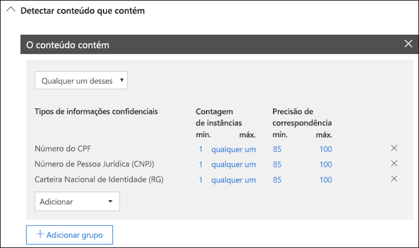
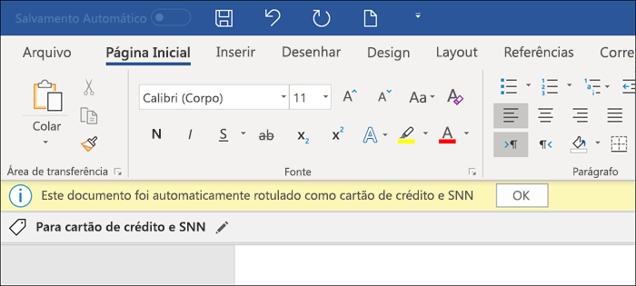
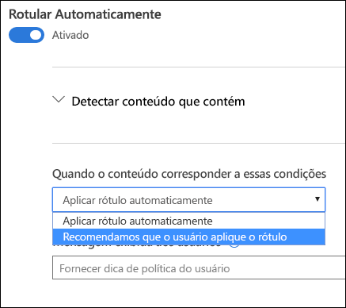
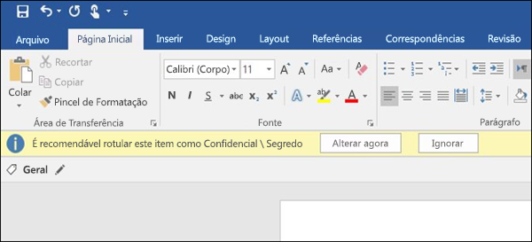

# Aplicar um rótulo de confidencialidade automaticamente ao conteúdo

Quando você cria um rótulo de confidencialidade, pode atribuir automaticamente um rótulo ao conteúdo, que inclui informações confidenciais, ou solicitar que os usuários apliquem o rótulo recomendado.

A capacidade de aplicar rótulos de confidencialidade automaticamente ao conteúdo é importante porque:

- Você não precisa treinar os usuários com relação a todas as classificações.

- Você não precisa depender dos usuários para classificar corretamente o conteúdo.

- Os usuários não precisam mais conhecer as políticas. Em vez disso, eles podem se concentrar no próprio trabalho.

> [!NOTE]
> A capacidade de aplicar rótulos automaticamente exige uma assinatura P2 da Proteção de Informações do Azure. Para usar esse recurso, você tem que [baixar e instalar o cliente de rotulagem unificada da Proteção de Informações do Azure](https://docs.microsoft.com/pt-BR/azure/information-protection/rms-client/install-unifiedlabelingclient-app). Estamos desenvolvendo um suporte nativo para esse recurso nos aplicativos do Office, para que ele não exija o cliente de rotulagem unificada da Proteção de Informações do Azure. Além disso, o cliente de rotulagem unificada é executado apenas no Windows, portanto, esse recurso ainda não tem suporte para Mac, iOS e Android.

## Aplicar um rótulo de confidencialidade automaticamente com base em condições

Um dos recursos mais avançados dos rótulos de confidencialidade é a capacidade de aplicá-los automaticamente ao conteúdo que atende a determinadas condições. Nesse caso, as pessoas na organização não precisam aplicar os rótulos de confidencialidade, pois o Office 365 faz isso por elas.
   
Você pode optar por aplicar rótulos de confidencialidade automaticamente ao conteúdo sempre que ele inclui tipos específicos de informações confidenciais. Quando configura um rótulo de confidencialidade para ser aplicado automaticamente, você vê a mesma lista de tipos de informações confidenciais quando cria uma política de prevenção contra perda de dados (DLP). Assim, você pode, por exemplo, aplicar automaticamente um rótulo Altamente Confidencial a qualquer conteúdo que inclua PII (informações de identificação pessoal) dos clientes, como números de cartão de crédito ou de seguro social. 

Depois de escolher os tipos de informações confidenciais, você pode refinar a condição alterando a contagem de instâncias e a precisão de correspondência. Para saber mais, confira o tópico [Regras de ajuste para facilitar ou dificultar a correspondência](data-loss-prevention-policies.md#tuning-rules-to-make-them-easier-or-harder-to-match).

Além disso, você pode escolher se uma condição deve detectar todos os tipos de informações confidenciais ou apenas um deles. E para tornar as condições mais flexíveis ou complexas, você pode adicionar grupos e usar operadores lógicos entre os grupos. Para saber mais, confira [Agrupamentos e operadores lógicos](data-loss-prevention-policies.md#grouping-and-logical-operators).

Quando um rótulo de confidencialidade é aplicado automaticamente, o usuário vê uma notificação no aplicativo do Office. Ele pode escolher **OK** ou ignorar a notificação.

## Recomendar ao usuário que ele aplique um rótulo de confidencialidade

Se preferir, em vez de aplicar automaticamente um rótulo de confidencialidade ao conteúdo, você pode recomendar aos usuários que eles apliquem o rótulo. Com essa opção, os usuários têm a flexibilidade de aceitar a classificação e qualquer proteção associada, ou descartar a recomendação se o rótulo não for adequado para o documento ou email.

Os rótulos recomendados têm suporte nos aplicativos Word, PowerPoint e Excel, e exigem a instalação do cliente de rotulagem unificada da Proteção de Informações do Azure. Estamos desenvolvendo suporte para rótulos recomendados no Outlook.

Veja o exemplo de um aviso ao configurar uma condição para aplicar um rótulo como uma ação recomendada, com uma dica de política personalizada. Você poderá escolher o texto que será exibido na dica de política.

## Como aplicar rótulos automáticos ou recomendados

- A rotulagem automática se aplica ao Word, Excel e PowerPoint quando os documentos são salvos, e ao Outlook quando os emails são enviados. Essas condições detectam informações confidenciais no texto do corpo, em documentos e emails, e nos cabeçalhos e rodapés, exceto na linha do assunto ou nos anexos de email.

- Não é possível usar a classificação automática para documentos e emails que tenham sido rotulados manualmente ou que tenham sido rotulados automaticamente com uma classificação mais alta. Um documento ou email pode ter apenas um rótulo de confidencialidade e um rótulo de retenção aplicados a ele.

- A classificação recomendada se aplica ao Word, Excel e PowerPoint quando os documentos são salvos. Estamos desenvolvendo suporte para rotulagem recomendada no Outlook.

- Não é possível usar a classificação recomendada para documentos que tenham sido rotulados com uma classificação mais alta. Nesse caso, se o conteúdo já foi rotulado com uma classificação mais alta, o usuário não verá o aviso com a recomendação e a dica de política.

## Como várias condições são avaliadas quando elas se aplicam a mais de um rótulo

Os rótulos são ordenados para avaliação de acordo com a posição especificada na política: o rótulo posicionado no início tem a posição mais baixa (menos confidencial) e o rótulo posicionado no final tem a posição mais alta (mais confidencial). Para saber mais sobre prioridade, confira [Prioridade de rótulos: a ordem é importante](sensitivity-labels.md#label-priority-order-matters)

## Não configure uma etiqueta pai para ser aplicada automaticamente ou recomendada

Lembre-se de que um rótulo pai (um rótulo com sub rótulos) não pode ser aplicado ao conteúdo. Certifique-se de não configurar uma etiqueta pai para aplicação automática ou para a opção recomendada, pois a etiqueta pai não será aplicada ao conteúdo em aplicativos do Office que usam o cliente de rotulagem unificada da Proteção de Informações do Azure. Confira mais informações em rótulos de pai e sub-rótulos[Sub-rótulos (agrupamento de rótulos)](sensitivity-labels.md#sublabels-grouping-labels).
