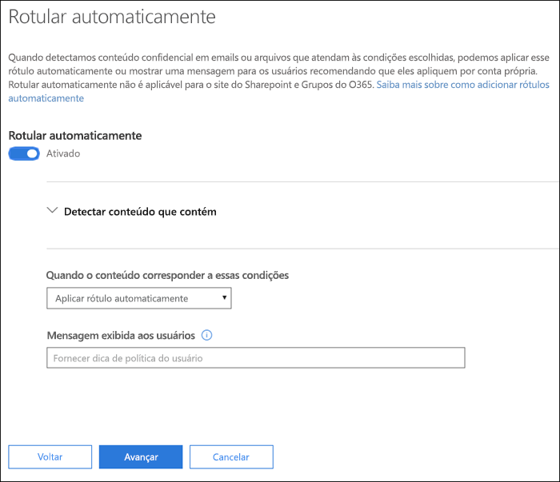
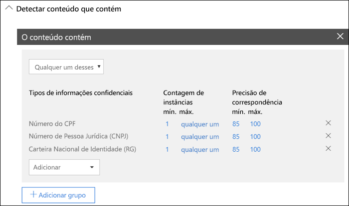
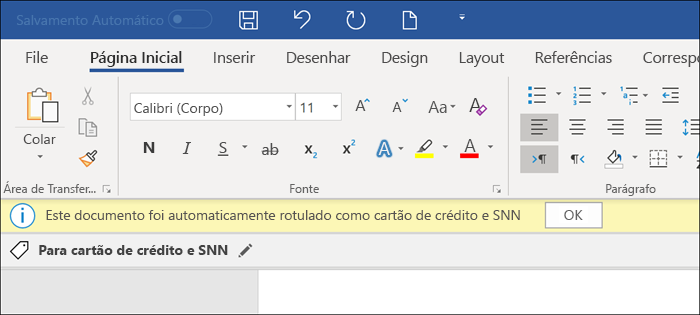
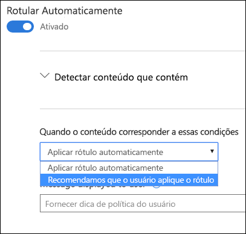

# Aplicar um rótulo de confidencialidade automaticamente ao conteúdoApply a sensitivity label to content automatically

Quando você cria um rótulo de confidencialidade, pode atribuir automaticamente um rótulo ao conteúdo, que inclui informações confidenciais, ou solicitar que os usuários apliquem o rótulo recomendado.When you create a sensitivity label, you can automatically assign that label to content containing sensitive information, or you can prompt users to apply the label that you recommend.

A capacidade de aplicar rótulos de confidencialidade automaticamente ao conteúdo é importante porque:The ability to apply sensitivity labels to content automatically is important because:

- Você não precisa treinar os usuários com relação a todas as classificações.You don't need to train your users on all of your classifications.

- Você não precisa depender dos usuários para classificar corretamente o conteúdo.You don't need to rely on users to classify all content correctly.

- Os usuários não precisam mais conhecer as políticas. Em vez disso, eles podem se concentrar no próprio trabalho.Users no longer need to know about your policies - they can instead focus on their work.

> [!NOTE]
> A capacidade de aplicar rótulos automaticamente exige uma assinatura P2 da Proteção de Informações do Azure. Para usar esse recurso, você tem que [baixar e instalar o cliente de rotulagem unificada da Proteção de Informações do Azure](https://docs.microsoft.com/pt-BR/azure/information-protection/rms-client/install-unifiedlabelingclient-app). Estamos desenvolvendo um suporte nativo para esse recurso nos aplicativos do Office, para que ele não exija o cliente de rotulagem unificada da Proteção de Informações do Azure. Além disso, o cliente de rotulagem unificada é executado apenas no Windows, portanto, esse recurso ainda não tem suporte para Mac, iOS e Android.The capability to apply labels automatically requires an Azure Information Protection P2 subscription. To use this feature, you must [Download and install the Azure Information Protection unified labeling client](https://docs.microsoft.com/pt-BR/azure/information-protection/rms-client/install-unifiedlabelingclient-app). We're working on native support for this feature in Office apps, so that it won't require the Azure Information Protection unified labeling client. Also, the unified labeling client runs only on Windows, so this feature is not yet supported on Mac, iOS, and Android.

## Aplicar um rótulo de confidencialidade automaticamente com base em condiçõesApply a sensitivity label automatically based on conditions

Um dos recursos mais avançados dos rótulos de confidencialidade é a capacidade de aplicá-los automaticamente ao conteúdo que atende a determinadas condições. Nesse caso, as pessoas na organização não precisam aplicar os rótulos de confidencialidade, pois o Office 365 faz isso por elas.One of the most powerful features of sensitivity labels is the ability to apply them automatically to content that matches certain conditions. In this case, people in your organization don't need to apply the sensitivity labels - Office 365 does the work for them.
   
Você pode optar por aplicar rótulos de confidencialidade automaticamente ao conteúdo sempre que ele inclui tipos específicos de informações confidenciais. Quando configura um rótulo de confidencialidade para ser aplicado automaticamente, você vê a mesma lista de tipos de informações confidenciais quando cria uma política de prevenção contra perda de dados (DLP). Assim, você pode, por exemplo, aplicar automaticamente um rótulo Altamente Confidencial a qualquer conteúdo que inclua PII (informações de identificação pessoal) dos clientes, como números de cartão de crédito ou de seguro social.You can choose to apply sensitivity labels to content automatically when that content contains specific types of sensitive information. When you configure a sensitivity label to be applied automatically, you see the same list of sensitive information types as when you create a data loss prevention (DLP) policy. So you can, for example, automatically apply a Highly Confidential label to any content that contains customers' personally identifiable information (PII), such as credit card numbers or social security numbers. 

Depois de escolher os tipos de informações confidenciais, você pode refinar a condição alterando a contagem de instâncias e a precisão de correspondência. Para saber mais, confira o tópico [Regras de ajuste para facilitar ou dificultar a correspondência](data-loss-prevention-policies.md#tuning-rules-to-make-them-easier-or-harder-to-match).After you choose your sensitive informaton types, you can refine your condition by changing the instance count or match accuracy. For more information, see [Tuning rules to make them easier or harder to match](data-loss-prevention-policies.md#tuning-rules-to-make-them-easier-or-harder-to-match).

Além disso, você pode escolher se uma condição deve detectar todos os tipos de informações confidenciais ou apenas um deles. E para tornar as condições mais flexíveis ou complexas, você pode adicionar grupos e usar operadores lógicos entre os grupos. Para saber mais, confira [Agrupamentos e operadores lógicos](data-loss-prevention-policies.md#grouping-and-logical-operators).Further, you can choose whether a condition must detect all of the sensitive infromation types, or just one of them. And to make your conditions more flexible or complex, you can add groups and use logical operators between the groups. For more information, see [Grouping and logical operators](data-loss-prevention-policies.md#grouping-and-logical-operators).

Quando um rótulo de confidencialidade é aplicado automaticamente, o usuário vê uma notificação no aplicativo do Office. Ele pode escolher **OK** ou ignorar a notificação.When a sensitivity label is automatically applied, the user sees a notification in their Office app. They can choose **OK** to dismiss the notification.

## Recomendar ao usuário que ele aplique um rótulo de confidencialidadeRecommend that the user apply a sensitivity label

Se preferir, em vez de aplicar automaticamente um rótulo de confidencialidade ao conteúdo, você pode recomendar aos usuários que eles apliquem o rótulo. Com essa opção, os usuários têm a flexibilidade de aceitar a classificação e qualquer proteção associada, ou descartar a recomendação se o rótulo não for adequado para o documento ou email.If you prefer, instead of applying a sensitivity label automatically to content, you can recommend to your users that they apply the label. This option provides your users the flexibility of accepting the classification and any associated protection, or dismissing the recommendation if the label is not suitable for their document or email.

Os rótulos recomendados têm suporte nos aplicativos Word, PowerPoint e Excel, e exigem a instalação do cliente de rotulagem unificada da Proteção de Informações do Azure. Estamos desenvolvendo suporte para rótulos recomendados no Outlook.Note that recommended labels are supported in Word, PowerPoint, and Excel (and require that the Azure Information Protection unified labeling client is installed). We're working on support for recommended labels in Outlook.

Veja o exemplo de um aviso ao configurar uma condição para aplicar um rótulo como uma ação recomendada, com uma dica de política personalizada. Você poderá escolher o texto que será exibido na dica de política.Here's an example of a prompt when you configure a condition to apply a label as a recommended action, with a custom policy tip. You can choose what text is displayed in the policy tip.

## Como aplicar rótulos automáticos ou recomendadosHow automatic or recommended labels are applied

- A rotulagem automática se aplica ao Word, Excel e PowerPoint quando os documentos são salvos, e ao Outlook quando os emails são enviados. Essas condições detectam informações confidenciais no texto do corpo, em documentos e emails, e nos cabeçalhos e rodapés, exceto na linha do assunto ou nos anexos de email.Automatic labeling applies to Word, Excel, and PowerPoint when documents are saved, and to Outlook when emails are sent. These conditions detect sensitive information in the body text in documents and emails, and to headers and footers -- but not in the subject line or attachments of email.

- Não é possível usar a classificação automática para documentos e emails que tenham sido rotulados manualmente ou que tenham sido rotulados automaticamente com uma classificação mais alta. Um documento ou email pode ter apenas um rótulo de confidencialidade e um rótulo de retenção aplicados a ele.You cannot use automatic classification for documents and emails that were previously manually labeled, or previously automatically labeled with a higher classification. Remember, a document or email can have only a single sensitivity label applied to it (in addition to a single retention label).

- A classificação recomendada se aplica ao Word, Excel e PowerPoint quando os documentos são salvos. Estamos desenvolvendo suporte para rotulagem recomendada no Outlook.Recommended classification applies to Word, Excel, and PowerPoint when documents are saved. We're working on support for recommended labeling in Outlook.

- Não é possível usar a classificação recomendada para documentos que tenham sido rotulados com uma classificação mais alta. Nesse caso, se o conteúdo já foi rotulado com uma classificação mais alta, o usuário não verá o aviso com a recomendação e a dica de política.You cannot use recommended classification for documents that were previously labeled with a higher classification. In this case, when the content's already labeled with a higher classification, the user won't see the prompt with the recommendation and policy tip.

## Como várias condições são avaliadas quando elas se aplicam a mais de um rótuloHow multiple conditions are evaluated when they apply to more than one label

Os rótulos são ordenados para avaliação de acordo com a posição especificada na política: o rótulo posicionado no início tem a posição mais baixa (menos confidencial) e o rótulo posicionado no final tem a posição mais alta (mais confidencial). Para saber mais sobre prioridade, confira [Prioridade de rótulos: a ordem é importante](sensitivity-labels.md#label-priority-order-matters)The labels are ordered for evaluation according to their position that you specify in the policy: The label positioned first has the lowest position (least sensitive) and the label positioned last has the highest position (most sensitive). For more information on priority, see [Label priority (order matters)](sensitivity-labels.md#label-priority-order-matters).