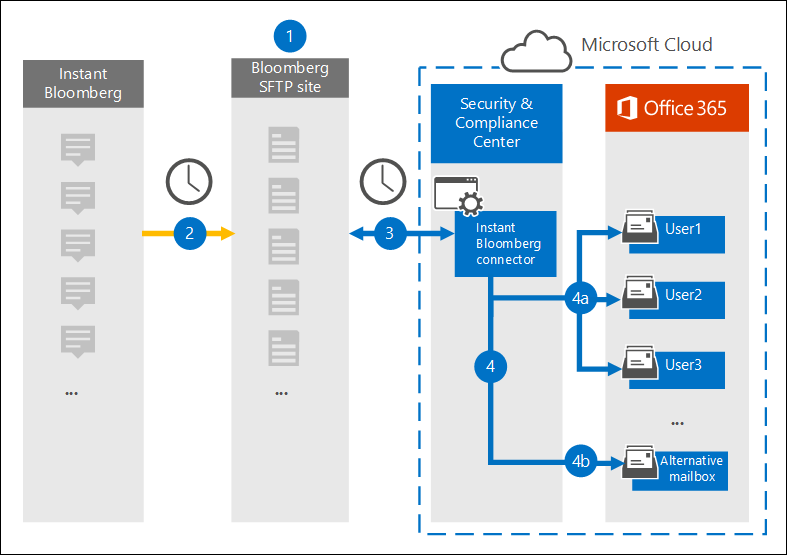

# Configurar um conector para arquivar dados de Bloomberg instantâneos no Office 365 (versão prévia)Set up a connector to archive Instant Bloomberg data in Office 365 (Preview)

O recurso conector para arquivar dados de Bloomberg instantâneos no Office 365 está em visualização.The connector feature to archive Instant Bloomberg data in Office 365 is in Preview.

Use um conector nativo no centro de conformidade & segurança no Office 365 para importar e arquivar dados de chat de serviços financeiros da ferramenta de colaboração do [Bloomberg](https://www.bloomberg.com/professional/product/collaboration/) .Use a native connector in the Security & Compliance Center in Office 365 to import and archive financial services chat data from [Instant Bloomberg](https://www.bloomberg.com/professional/product/collaboration/) collaboration tool. Depois de configurar e configurar um conector, ele se conecta ao site da sua organização (SFTP) uma vez a cada dia, converte o conteúdo de mensagens de chat em um formato de mensagem de email e, em seguida, importa esses itens para caixas de correio no Office 365.After you set up and configure a connector, it connects to your organization's Bloomberg secure FTP site (SFTP) once every day, converts the content of chat messages to an email message format, and then imports those items to mailboxes in Office 365.

Depois que os dados do Bloomberg instantâneos são armazenados nas caixas de correio do usuário, você pode aplicar recursos de conformidade do Office 365, como retenção de litígio, pesquisa de conteúdo, arquivamento in-loco, auditoria e políticas de retenção do Office 365 para dados instantâneos do Bloomberg.After Instant Bloomberg data is stored in user mailboxes, you can apply Office 365 compliance features such as Litigation Hold, Content Search, In-Place Archiving, Auditing, and Office 365 retention policies to Instant Bloomberg data. Por exemplo, você pode pesquisar mensagens de chat do Bloomberg instantâneas usando a pesquisa de conteúdo ou associar a caixa de correio que contém os dados do Bloomberg instantâneos a um funcionário em uma caixa de descoberta eletrônica avançada.For example, you can search Instant Bloomberg chat messages using Content Search or associate the mailbox that contains the Instant Bloomberg data with a custodian in an Advanced eDiscovery case. O uso de um conector de Bloomberg instantâneo para importar e arquivar dados no Office 365 pode ajudar sua organização a se manter em conformidade com as políticas governamentais e regulamentares.Using an Instant Bloomberg connector to import and archive data in Office 365 can help your organization stay compliant with government and regulatory policies.

## Visão geral do arquivamento de dados instantâneos do BloombergOverview of archiving Instant Bloomberg data

A visão geral a seguir explica o processo de uso de um conector para arquivar dados de chat instantânea do Bloomberg no Office 365.The following overview explains the process of using a connector to archive Instant Bloomberg chat data in Office 365. 

1. Sua organização trabalha com o Bloomberg para configurar um site do Bloomberg SFTP.Your organization works with Bloomberg to set up a Bloomberg SFTP site. Você também trabalhará com o Bloomberg para configurar o Bloomberg para copiar mensagens de chat para seu site do Bloomberg SFTP.You will also work with Bloomberg to configure Instant Bloomberg to copy chat messages to your Bloomberg SFTP site.

2. Uma vez a cada 24 horas, as mensagens de bate-papo do Bloomberg imediato são copiadas para o site Bloomberg SFTP.Once every 24 hours, chat messages from Instant Bloomberg are copied to the Bloomberg SFTP site.
    
3. O conector de Bloomberg instantâneo que você cria no centro de conformidade & segurança se conecta ao site do Bloomberg SFTP todos os dias e transfere as mensagens de chat das últimas 24 horas para uma área de armazenamento do Azure segura na nuvem da Microsoft.The Instant Bloomberg connector that you create in the Security & Compliance Center connects to the Bloomberg SFTP site every day and transfers the chat messages from the previous 24 hours to a secure Azure Storage area in the Microsoft Cloud. O conector também converte o conteúdo de um massage de chat em um formato de mensagem de email.The connector also converts the content of a chat massage to an email message format.
    
4. O conector importa os itens de mensagem de chat para a caixa de correio de um usuário específico ou para uma caixa de correio alternativa.The connector imports the chat message items to the mailbox of a specific user or to an alternative mailbox. O conector faz usando o valor da propriedade *CorporateEmailAddress* .The connector does by using the value of the *CorporateEmailAddress* property. Cada mensagem de chat contém essa propriedade, que é preenchida com o endereço de email de cada participante da mensagem de chat.Every chat message contains this property, which is populated with the email address of every participant of the chat message. Se um item é importado para uma caixa de correio de usuário específica ou para a caixa de correio alternativa com base nos seguintes critérios:Whether an item is imported into a specific user mailbox or to the alternative mailbox is based on the following criteria:
    
    a.a. **Itens que têm um valor na propriedade CorporateEmailAddress que corresponde a uma conta de usuário do Office 365** – se o conector puder associar o endereço de email na propriedade *CorporateEmailAddress* a uma conta de usuário específica no Office 365, o item é copiado para a pasta caixa de entrada na caixa de correio do Office 365 do usuário.**Items that have a value in the CorporateEmailAddress property that corresponds to an Office 365 user account** – If the connector can associate the email address in the *CorporateEmailAddress* property to a specific user account in Office 365, the item is copied to the Inbox folder in the user's Office 365 mailbox.
    
    b.b. **Itens que têm um valor na propriedade CorporateEmailAddress que não corresponde a uma conta de usuário do Office 365** – se o conector não puder associar um endereço de email na propriedade *CorporateEmailAddress* a uma conta de usuário específica no Office 365, o item é copiado para a pasta caixa de entrada de uma caixa de correio alternativa, "catch-all" no Office 365.**Items that have a value in the CorporateEmailAddress property that doesn't correspond to an Office 365 user account** – If the connector can't associate an email address in the *CorporateEmailAddress* property to a specific user account in Office 365, the item is copied to the Inbox folder of an alternative, "catch-all" mailbox in Office 365.

## Antes de começarBefore you begin

Muitas das etapas de implementação necessárias para arquivar dados instantâneos do Bloomberg são externas para o Office 365 e devem ser concluídas para que você possa criar o conector no centro de conformidade de & de segurança.Many of the implementation steps required to archive Instant Bloomberg data are external to Office 365 and must be completed before you can create the connector in the Security & Compliance Center.

- Inscreva-se em [Blooomberg em qualquer lugar](https://www.bloomberg.com/professional/product/remote-access/?bbgsum-page=DG-WS-PROF-PROD-BBA).Subscribe to [Blooomberg Anywhere](https://www.bloomberg.com/professional/product/remote-access/?bbgsum-page=DG-WS-PROF-PROD-BBA). Isso é necessário para que você possa fazer logon no Bloomberg em qualquer lugar para acessar o site do Bloomberg SFTP que você precisa configurar e configurar.This is required so that you can log in to Bloomberg Anywhere to access the Bloomberg SFTP site that you have to set up and configure.

- Configurar um site Bloomberg SFTP (protocolo de transferência segura de arquivos).Set up a Bloomberg SFTP (Secure file transfer protocol) site. Depois de trabalhar com o Bloomberg para configurar o site SFTP, os dados do Bloomberg imediato são carregados para o site do SFTP todos os dias.After working with Bloomberg to set up the SFTP site, data from Instant Bloomberg is uploaded to the SFTP site every day. O conector que você cria na etapa 2 se conecta a esse site SFTP e transfere os dados de chat para caixas de correio do Office 365.The connector you create in Step 2 connects to this SFTP site and transfers the chat data to Office 365 mailboxes. O SFTP também criptografa os dados de chat do Bloomberg que são enviados para as caixas de correio do Office 365 durante o processo de transferência.SFTP also encrypts the Instant Bloomberg chat data that is sent to Office 365 mailboxes during the transfer process.

    Para obter informações sobre o Bloomberg SFTP (também chamado *de BB-SFTP*):For information about Bloomberg SFTP (also called *BB-SFTP*):

    - Consulte o documento "padrões de conectividade SFTP" no [suporte do Bloomberg](https://www.bloomberg.com/professional/support/documentation/).See the "SFTP Connectivity Standards" document at [Bloomberg Support](https://www.bloomberg.com/professional/support/documentation/).
    
    - Contatar o [suporte ao cliente do Bloomberg](https://service.bloomberg.com/portal/sessions/new?utm_source=bloomberg-menu&utm_medium=csc).Contact [Bloomberg customer support](https://service.bloomberg.com/portal/sessions/new?utm_source=bloomberg-menu&utm_medium=csc).

    Depois de trabalhar com o Bloomberg para configurar um site SFTP, o Bloomberg fornecerá algumas informações depois que você responder à mensagem de email de implementação do Bloomberg.After you work with Bloomberg to set up an SFTP site, Bloomberg will provide some information to you after you respond to the Bloomberg implementation email message. Salve uma cópia das informações a seguir.Save a copy of the following information. Você pode usá-lo para configurar um conector na etapa 3.You use it to set up a connector in Step 3.

    - O código da empresa, que é uma ID da sua organização e é usado para fazer logon no site do Bloomberg SFTP.Firm code, which is an ID for your organization and is used to log in to the Bloomberg SFTP site.

    - Senha para seu site do Bloomberg SFTPPassword for your Bloomberg SFTP site

    - URL para o site do Bloomberg SFTP (por exemplo, sftp.bloomberg.com)URL for Bloomberg SFTP site (for example, sftp.bloomberg.com)

    - Número de porta para o site Bloomberg SFTPPort number for Bloomberg SFTP site

- Sua organização deve dar o consentimento para permitir que o serviço de importação do Office 365 acesse dados de caixa de correio em sua organização.Your organization must consent to allow the Office 365 Import service to access mailbox data in your organization. Para concordar com essa solicitação, acesse [esta página](https://login.microsoftonline.com/common/oauth2/authorize?client_id=570d0bec-d001-4c4e-985e-3ab17fdc3073&response_type=code&redirect_uri=https://portal.azure.com/&nonce=1234&prompt=admin_consent), entre com as credenciais de um administrador global do Office 365 e aceite a solicitação.To consent to this request, go to [this page](https://login.microsoftonline.com/common/oauth2/authorize?client_id=570d0bec-d001-4c4e-985e-3ab17fdc3073&response_type=code&redirect_uri=https://portal.azure.com/&nonce=1234&prompt=admin_consent), sign in with the credentials of an Office 365 global admin, and then accept the request. Você precisa concluir esta etapa para poder criar com êxito o conector do Bloomberg instantâneo na etapa 3.You have to complete this step before you can successfully create the Instant Bloomberg connector in Step 3.

- O usuário que cria um conector de Bloomberg instantâneo na etapa 3 (e quem baixa as chaves públicas e o endereço IP na etapa 1) deve receber a função de exportação de importação de caixa de correio no Exchange Online.The user who creates an Instant Bloomberg connector in Step 3 (and who downloads the public keys and IP address in Step 1) must be assigned the Mailbox Import Export role in Exchange Online. Isso é necessário para acessar a página **arquivar dados** de terceiros no centro de conformidade de & de segurança.This is required to access the **Archive third-party data** page in the Security & Compliance Center. Por padrão, essa função não é atribuída a nenhum grupo de função no Exchange Online.By default, this role isn't assigned to any role group in Exchange Online. Você pode adicionar a função de exportação de importação de caixa de correio ao grupo de funções Gerenciamento da organização no Exchange Online.You can add the Mailbox Import Export role to the Organization Management role group in Exchange Online. Ou você pode criar um grupo de função, atribua a função de exportação de importação de caixa de correio e, em seguida, adicione os usuários apropriados como membros.Or you can create a role group, assign the Mailbox Import Export role, and then add the appropriate users as members. Para obter mais informações, consulte as seções [criar grupos de função](https://docs.microsoft.com/Exchange/permissions-exo/role-groups#create-role-groups) ou [modificar grupos de função](https://docs.microsoft.com/Exchange/permissions-exo/role-groups#modify-role-groups) no artigo "gerenciar grupos de função no Exchange Online".For more information, see the  [Create role groups](https://docs.microsoft.com/Exchange/permissions-exo/role-groups#create-role-groups) or [Modify role groups](https://docs.microsoft.com/Exchange/permissions-exo/role-groups#modify-role-groups) sections in the article "Manage role groups in Exchange Online".

## Etapa 1: obter as chaves públicas SSH e PGPStep 1: Obtain SSH and PGP public keys

A primeira etapa é obter uma cópia das chaves públicas para SSH (Secure Shell) e PGP (boa privacidade).The first step is to obtain a copy of the public keys for Secure Shell (SSH) and Pretty Good Privacy (PGP). Use essas chaves na etapa 2 para configurar o site do Bloomberg SFTP para permitir que o conector (que você criou na etapa 3) se conecte ao site SFTP e transfira os dados de chat do Bloomberg para o Office 365 caixas de correio.You use these keys in Step 2 to configure the Bloomberg SFTP site to allow the connector (that you create in Step 3) to connect to the SFTP site and transfer the Instant Bloomberg chat data to Office 365 mailboxes. Você também obtém um endereço IP nesta etapa, que você usa ao configurar o site do Bloomberg SFTP.You also obtain an IP address in this step, which you use when configuring the Bloomberg SFTP site.

1. Vá para <https://protection.office.com> e clique em **importação de \> governança de dados** e clique em **arquivar dados de terceiros**.Go to <https://protection.office.com> and then click **Data governance \> Import** and then click **Archive third-party data**.

2. Na página **arquivar dados de terceiros** , clique em **Adicionar um conector**e, em seguida, clique em **Bloomberg instantâneo**.On the **Archive third-party data** page, click **Add a connector**, and then click **Instant Bloomberg**.

3. Na página **termos de serviço** , clique em **aceitar**.On the **Terms of service** page, click **Accept**.

4. No **site adicionar credenciais para o Bloomberg SFTP** , em etapa 1, clique em **baixar chave SSH** e baixar links de download da **chave PGP** para salvar uma cópia de cada arquivo de chave pública no computador local.On the **Add credentials for Bloomberg SFTP site** under step 1, click **Download SSH key** and **Download PGP key** download links to save a copy of each public key file to your local computer. Esses arquivos contêm os seguintes itens que serão usados para configurar o site do Bloomberg SFTP na etapa 2:These files contain the following items that will be used to configure the Bloomberg SFTP site in Step 2:

   - Chave pública SSH – essa chave será usada para configurar o Secure Shell (SSH) para habilitar um logon remoto seguro quando o conector se conectar ao site do Bloomberg SFTP.SSH public key – This key will be used to configure Secure Shell (SSH) to enable a secure remote login when the connector connects to the Bloomberg SFTP site.

   - Chave pública do PGP – essa chave será usada para configurar a criptografia de dados que são transferidos do site Bloomberg SFTP para o Office 365.PGP public key – This key will be used to configure the encryption of data that's transferred from the Bloomberg SFTP site to Office 365.

   - Endereço IP – o site do Bloomberg SFTP será configurado para aceitar uma solicitação de conexão apenas desse endereço IP, que é usado pelo conector do Bloomberg instantâneo criado na etapa 3.IP address – The Bloomberg SFTP site will be configured to accept a connection request only from this IP address, which is used by the Instant Bloomberg connector that you create in Step 3. 

5. Clique em **Cancelar** para fechar o assistente.Click **Cancel** to close the wizard. Você volta para este assistente na etapa 3 para criar o conector.You come back to this wizard in Step 3 to create the connector.

## Etapa 2: configurar o site do Bloomberg SFTPStep 2: Configure the Bloomberg SFTP site

A próxima etapa é usar as chaves públicas SSH e PGP e o endereço IP obtido na etapa 1 para configurar a autenticação SSH e a criptografia PGP para o site Bloomberg SFTP.The next step is to use the SSH and PGP public keys and the IP address that you obtained in Step 1 to configure SSH authentication and PGP encryption for the Bloomberg SFTP site. Isso permite que o conector do Bloomberg instantâneo criado na etapa 3 se conecte ao site Bloomberg SFTP e transfira dados de Bloomberg instantâneos para o Office 365.This allows the Instant Bloomberg connector that you create in Step 3 to connect to the Bloomberg SFTP site and transfer Instant Bloomberg data to Office 365. Entre em contato com o [suporte ao cliente Bloomberg](https://service.bloomberg.com/portal/sessions/new?utm_source=bloomberg-menu&utm_medium=csc) se você precisar de assistência para configurá-lo.Contact [Bloomberg customer support](https://service.bloomberg.com/portal/sessions/new?utm_source=bloomberg-menu&utm_medium=csc) if you need assistance setting this up.

1. Faça logon no painel de controle do Bloomberg CCNS usando uma conta para sua organização.Log in to the Bloomberg CCNS control panel using an account for your organization.

2. Vá para CCNS e clique na guia **chaves públicas** .Go to CCNS and click the **Public Keys** tab.

3. Para habilitar a autenticação SSH, clique em **Adicionar**.To enable SSH authentication, click **Add**.

4. Na janela **Adicionar chave pública** , clique na lista suspensa **tipo de chave** e clique em **logon**.In the **Add Public Key** window, click the **Key Type** dropdown list, and then click **Login**.

5. Copie a chave pública SSH inteira (todos os caracteres entre, mas não incluindo, as aspas duplas) que você baixou na etapa 1, Cole-o neste campo e clique em **Enviar** para salvar a chave.Copy the entire SSH public key (all characters between, but not including, the double quotation marks) that you downloaded in Step 1, paste it in this field, and then click **Submit** to save the key.
 
    Por exemplo, copie a seguinte chave pública SSH:For example, you would copy the following SSH public key:

    `
    ssh-rsa
    AAAAB3NzaC1yc2EAAAABIwAAAQEA1dxAyc0JzCmc5NzgyzRYhnj3FGHK5Kd9T2cwZNkmL/9nFhQupQor081rmuw9gACAmeot7y+V/fmijo/q4rxDe3Auu3hfLl1NpWlIssQJHzycms8zimtdQcXbMKwDQOnRthpEocF5ySs76KE72vaYQJTvclAamWWq0D75SUmXDFFr7afvEy57F7KgMD1ecg6lH7q8seSKbiiWxX1Ul0kL15fzpUyhjDP41owb1XC/dF7fJwAmCO1+HZfDLEp62q4tnApLpdd92KoR41LZTryO5dICKhk+S+JxPLkksxL0wm5YevOr2n4ScuRdsBV8mWKZ1Xw+cOss9O6L7cCcEiB3Ow==
    `

6. Para habilitar a criptografia PGP, clique em **Adicionar** novamente na guia **chaves públicas** , clique na lista suspensa **tipo de chave** e, neste momento, clique em **criptografia**.To enable PGP encryption, click **Add** again on the **Public Keys** tab, click the **Key Type** dropdown list, and this time click **Encryption**.

7. Copie toda a chave pública PGP (todos os caracteres entre, mas não incluindo, as aspas duplas) que você baixou na etapa 1, Cole-o neste campo e clique em **Enviar** para salvar a chave.Copy the entire PGP public key (all characters between, but not including, the double quotation marks) that you downloaded in Step 1, paste it in this field, and then click **Submit** to save the key. 

    Por exemplo, copie a seguinte chave pública do PGP:For example, you would copy the following PGP public key:

    `
    -----BEGIN PGP PUBLIC KEY BLOCK-----
    Version: BCPG C# v1.7.4137.9688
    nmQENBFz+6UQBCACKC4ilYoVOP5b/F0CO+oQYbag79Ov4NZxM4EKW51lUAvKNExRM\nc1C/gwXm8bghht8GEODckXXqx8qSSXUEeA/ROweXNtD1u1kn7PgYEFUeD/qE739m\nm5lxXF9Vod26AtKQ9Y1EvYoQEltwztAaXg8K8LQzB+tzN079d1cxM5tbiRQLttAh\nOt5amLXuINt8+dWyNas3DfgIBUmwfkwCbUO0ElrIhvvO3A85K97SX9Q6Py0SkfkK\nQpnULuhdjSm+7k7qlVMf0s8e/9jUXYKbMFkxlOoMq052vV0l0VQNSeuKoC+m6+LT\nEPab89AMt6S4Ujum9wTUy1eWNx9vV0y/w8N7ABEBAAG0JDM5MjM4ZTg3LWI1YWIt\nNGVmNi1hNTU5LWFmNTRjNmIwN2I0MokBHAQQAQIABgUCXP7pRAAKCRAJQdjaG//S\nCy70B/wKrR2CcqtZx56yrGJFfVy3niEt16VEA3xJM3D9nX0gmgo85Nh5gkiY3ahH\nnNEmgW5vlCM1gcgFeoZWe8A80G4QoabslSUzLbq9HsHOOAQApsfhrhXpylrAVa4n\nI53XUOxWdOTa4xsOob8hSRADqJbwHPOsoAr2A87TvZ9LSi2Mii5omeTq416CLnoS\nPBAEhelZm+ruy5JhzA1yXvWYFH08wNqSHO3bskdES2yW5SyQmYlcoEztWE0Q0Z+G\nZT3kOa/W2MbcZovFCQIfqhwVfXtIzx5uYUmxgk5cFKUJJMlO0AZK/HwM22xuuIWe\ndMa6OMo/n8tvEBxrLQMdVPlz+hZ6
    =AwmP
    -----END PGP PUBLIC KEY BLOCK-----
    `
8. De volta à janela principal do painel de controle do CCNS, em **Adicionar seu endereço IP aqui**, digite o seguinte endereço IP (que está incluído no arquivo Keys. txt que você baixou na etapa 1) no **campo Adicionar endereço**.Back on the main window of the CCNS control panel, under **Add your IP address here**, enter the following IP address (which is included in Keys.txt file that you downloaded in Step 1) in the **Add address field**.

   `
   40.124.28.216
   `

## Etapa 3: criar um conector de Bloomberg instantâneoStep 3: Create an Instant Bloomberg connector

A última etapa é criar um conector de Bloomberg instantâneo no centro de conformidade de & de segurança.The last step is to create an Instant Bloomberg connector in the Security & Compliance Center. O conector usa as informações que você fornece para se conectar ao site do Bloomberg SFTP e transferir mensagens de chat para as caixas de correio de usuário correspondentes no Office 365.The connector uses the information you provide to connect to the Bloomberg SFTP site and transfer chat messages to the corresponding user mailbox boxes in Office 365. 

1. Vá para <https://protection.office.com> e clique em **importação de \> governança de dados** e clique em **arquivar dados de terceiros**.Go to <https://protection.office.com> and then click **Data governance \> Import** and then click **Archive third-party data**.

2. Na página **arquivar dados de terceiros** , clique em **Adicionar um conector**e, em seguida, clique em **Bloomberg instantâneo**.On the **Archive third-party data** page, click **Add a connector**, and then click **Instant Bloomberg**.

3. Na página **termos de serviço** , clique em **aceitar**.On the **Terms of service** page, click **Accept**.

4. Na página **Adicionar credenciais para o site do Bloomberg SFTP** , em etapa 3, insira as informações necessárias nas caixas a seguir e clique em **Avançar**.On the **Add credentials for Bloomberg SFTP site** page, under Step 3, enter the required information in the following boxes and then click **Next**.

    - **Código da empresa** – a ID da sua organização e usada como o nome de usuário para o site do Bloomberg SFTP.**Firm code** – The ID for your organization and used as the username for the Bloomberg SFTP site.

    - **Senha** – senha para o site Bloomberg SFTP**Password** – Password for Bloomberg SFTP site

    - **URL de SFTP** – a URL para o site do Bloomberg SFTP (por exemplo, SFTP.Bloomberg.com).**SFTP URL** – The URL for Bloomberg SFTP site (for example, sftp.bloomberg.com).

    - **Porta SFTP** – o número da porta para o site Bloomberg SFTP.**SFTP port** – The port number for Bloomberg SFTP site. O conector o usa para se conectar ao site SFTP.The connector uses this to connect to the SFTP site.

5. Na página de **caixa de correio alternativa** , digite o endereço de email de uma caixa de correio que será usado para armazenar mensagens de chat do Bloomberg instantâneo que não podem ser associados a uma caixa de correio de usuário em sua organização.On the **Alternative mailbox** page, type the email address of a mailbox that will be used to store chat messages from Instant Bloomberg that can't be associated with a user mailbox in your organization.

   > [!NOTE]
   > Cada mensagem de chat em todas as conversas no Bloomberg instantâneo inclui uma propriedade chamada *CorporateEmailAddress*, que contém o endereço de email da sua organização para o participante do chat.Every chat message in every conversation in Instant Bloomberg includes a property called *CorporateEmailAddress*, which contains your organization's email address for the chat participant. Durante o processo de importação, o conector tenta importar mensagens de chat para uma caixa de correio de usuário no Office 365 que tenha os mesmos endereços de email que correspondem ao da propriedade *CorporateEmailAddress* .During the import process, the connector attempts to import chat messages to a user mailbox in Office 365 that has the same email addresses that matches the one in the *CorporateEmailAddress* property. Se não houver uma caixa de correio do Office 365 com o mesmo endereço que o da propriedade *CorporateEmailAddress* , o conector importa a mensagem de chat para a caixa de correio alternativa que você especificar nessa página.If the there isn't an Office 365 mailbox with the same address as the one in the *CorporateEmailAddress* property, the connector imports the chat message to the alternative mailbox that you specify on this page. No momento, as mensagens instantâneas de chat do Bloomberg arquivadas na caixa de correio alternativa não são monitoradas por políticas de supervisão no Office 365.At this time, Instant Bloomberg chat messages archived in the alternative mailbox aren't monitored by supervision policies in Office 365.

6. Clique em **Avançar**, revise suas configurações e clique em **preparar** para criar o conector.Click **Next**, review your settings, and then click **prepare** to create the connector.

7. Vá para a página **arquivar dados** de terceiros para ver o andamento do processo de importação para o novo conector.Go to the **Archive third-party data** page to see the progress of the import process for the new connector.
