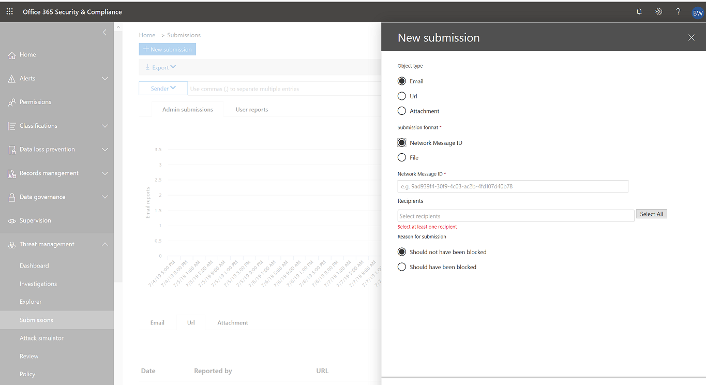

# Envios de administradores no Office 365 ATP

Agora, os administradores podem enviar emails usando a ID de mensagem de arquivo ou de rede, URLs e arquivos para verificação da Microsoft no Office 365. A seção envios atualizados ainda inclui mensagens relatadas pelo usuário. 

Ao enviar um email, você receberá informações sobre qualquer política que possa ter permitido o email de entrada em seu locatário, bem como o exame de qualquer URL e anexo no email. As políticas que podem ter permitido um email incluem a lista de remetentes confiáveis de um usuário individual, bem como as políticas de nível de locatário, como regras ETR. 

## Como enviar conteúdo

Para enviar conteúdo à Microsoft, clique no botão **novo envio** no lado superior esquerdo da página envios. Um submenu no lado direito da página aparece com a opção de enviar um email, uma URL ou um arquivo. 

### Email

1. Para enviar um email, selecione **email** e ESPECIFIQUE a **ID da mensagem da rede** de email ou carregue o arquivo de email. 

2. Especifique o (s) destinatário (s) em relação ao qual você gostaria de executar a verificação de política. A verificação de política determinará se o email ignorou a verificação devido a políticas de nível de usuário ou locatário. 

3. Especifique se o email deve ter sido bloqueado ou não. Se o email tiver sido bloqueado, especifique se ele deve ter sido bloqueado como spam, phishing ou malware. Se você não tiver certeza de qual tipo pode ser, use a melhor Judgement.  

* Se o filtro tiver sido ignorado devido às políticas após o envio, você verá informações sobre essa política.

* Se o filtro não tiver sido ignorado devido a uma ou mais políticas, a verificação será concluída em vários minutos. Você verá informações adicionais sobre o envio clicando no link status. Isso inclui os resultados da verificação de política e a veredicto de nova verificação. Observação isso não executa o email por meio da pilha de filtragem completa do Office 365 ATP novamente, mas executa uma verificação parcial com base em determinados atributos do email, da URL ou do arquivo. 

4. Clique no botão **Enviar** .

### URL

1. Para enviar uma URL de **** seleção de URL do submenu. Digite a URL completa incluindo o protocolo (**https://**). 

* Se você tiver selecionado o **deve ter sido filtrado**, especifique se a URL é phishing ou malware.

2. Clique no botão **Enviar** . 

### Arquivo

1. Para enviar um arquivo de **** seleção de arquivo do submenu e carregar o arquivo que você deseja verificar. 

2. Clique no botão **Enviar** .

## Tópicos relacionados

[Office 365 plano avançado de proteção contra ameaças 2](office-365-ti.md)
  
[Proteção contra ameaças no Office 365](protect-against-threats.md)
  
[Exibir relatórios para a proteção avançada contra ameaças do Office 365](view-reports-for-atp.md)
  

