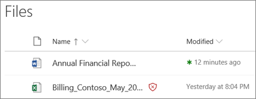

# Office 365 ATP para SharePoint, OneDrive e Microsoft Teams

## Visão geral do Office 365 ATP para SharePoint, OneDrive e Microsoft Teams

As pessoas costumam compartilhar arquivos e colaborar usando o SharePoint, o OneDrive e o Microsoft Teams. Com a [proteção avançada contra ameaças do Office 365](office-365-atp.md) (ATP), sua organização pode colaborar de forma mais segura. A ATP ajuda a detectar e bloquear arquivos identificados como mal-intencionados em sites de equipe e bibliotecas de documentos.  
  
## Como funciona

Quando um arquivo no SharePoint Online, OneDrive for Business e Microsoft Teams é identificado como mal-intencionado, a ATP se integra diretamente aos repositórios de arquivos para bloquear esse arquivo. A imagem a seguir mostra um exemplo de um arquivo mal-intencionado detectado em uma biblioteca.
  

  
Embora o arquivo bloqueado ainda esteja listado na biblioteca de documentos e aplicativos da Web, móveis ou da área de trabalho, o arquivo bloqueado não pode ser aberto, copiado, movido ou compartilhado. No entanto, as pessoas podem excluir um arquivo bloqueado. Veja um exemplo do que parece com o dispositivo móvel de um usuário:
  

  
Dependendo de como o Office 365 estiver configurado, as pessoas podem ou não ter a capacidade de baixar um arquivo bloqueado. Veja a seguir como baixar um arquivo bloqueado no dispositivo móvel de um usuário:
  

  
Para saber mais, confira [ativar o Office 365 ATP para SharePoint, onedrive e Microsoft Teams](turn-on-atp-for-spo-odb-and-teams.md).
  
## Mantenha esses pontos em mente

- A ATP não examinará todos os arquivos de um único arquivo no SharePoint Online, no OneDrive for Business ou no Microsoft Teams. Isso é esperado. Os arquivos são verificados de forma assíncrona por meio de um processo que usa eventos de atividade de compartilhamento e convidados, juntamente com heurística inteligente e sinais de ameaça para identificar arquivos mal-intencionados.

- Certifique-se de que seus sites do SharePoint estão configurados para usar a [experiência moderna](https://docs.microsoft.com/sharepoint/guide-to-sharepoint-modern-experience). Quando um arquivo é identificado como mal-intencionado e bloqueado, as pessoas podem ver que isso ocorreu na experiência moderna, mas não no modo de exibição clássico. A proteção ATP aplica se a experiência moderna ou o modo de exibição clássico é usado; no entanto, os indicadores visuais que um arquivo está bloqueado estão presentes apenas na experiência moderna.
    
- Arquivos identificados como mal-intencionados no SharePoint Online, no OneDrive for Business ou no Microsoft Teams aparecerão em [relatórios para a proteção avançada contra ameaças do Office 365](view-reports-for-atp.md) e no [Explorer (e detecções em tempo real)](threat-explorer.md).
    
- A ATP faz parte da estratégia geral de proteção contra ameaças da sua organização, que inclui proteção antispam e antimalware, bem como links seguros e anexos seguros. Para saber mais, confira [proteger contra ameaças no Office 365](protect-against-threats.md).
    
- Um administrador do SharePoint Online pode determinar se é para permitir que as pessoas baixem arquivos detectados como mal-intencionados. Isso é feito executando-se o cmdlet Set-SPOTenant do PowerShell usando um parâmetro DisallowInfectedFileDownload (consulte [ativar o Office 365 ATP para SharePoint, onedrive e Microsoft Teams](turn-on-atp-for-spo-odb-and-teams.md)).
    
## Quarentena no ATP para SharePoint Online, OneDrive for Business e Microsoft Teams

 A partir do final de maio  de 2018, os recursos de &amp; quarentena no centro de conformidade de segurança estão sendo estendidos para ATP para SharePoint Online, onedrive for Business e Microsoft Teams.
  
Quando um arquivo no SharePoint Online, no OneDrive for Business ou no Microsoft Teams é identificado como mal-intencionado, além de a ATP impedindo que o arquivo seja aberto ou compartilhado, esse arquivo é incluído em uma lista de itens em quarentena. (No centro de &amp; conformidade de segurança, vá para **Gerenciamento** \> **** \> de ameaças revisar **quarentena** e filtro para **conteúdo**.) 
  
Se você fizer parte da equipe de segurança do Office 365 da sua organização e tiver as [permissões necessárias atribuídas no centro &amp; de conformidade de segurança do Office 365](permissions-in-the-security-and-compliance-center.md), você poderá baixar, liberar, relatar e excluir arquivos detectados como mal-intencionados por ATP da quarentena.
  
- **Liberar e relatar** um arquivo Remove o bloco ATP no arquivo no respectivo site de equipe ou biblioteca de documentos do SharePoint, onedrive ou Microsoft Teams. Os usuários podem abrir, compartilhar e baixar o arquivo. E, quando a opção **Enviar relatório para a Microsoft** for selecionada, o arquivo será relatado como falso positivo para a Microsoft. 
    
- A **exclusão de um arquivo** remove o arquivo da quarentena; no entanto, o arquivo ainda está bloqueado para ser aberto ou compartilhado. O arquivo também deve ser excluído em sua respectiva biblioteca de documentos ou site de equipe (SharePoint Online, OneDrive for Business ou Microsoft Teams). 
    
- **Baixar um arquivo** permite que você baixe e analise o arquivo em busca de falsos positivos. 
    
## Próximas etapas

1. [Ativar o Office 365 ATP para SharePoint, OneDrive e Microsoft Teams](turn-on-atp-for-spo-odb-and-teams.md)
    
2. [Exibir informações sobre arquivos mal-intencionados detectados no SharePoint, no OneDrive ou no Microsoft Teams](malicious-files-detected-in-spo-odb-or-teams.md)
    
