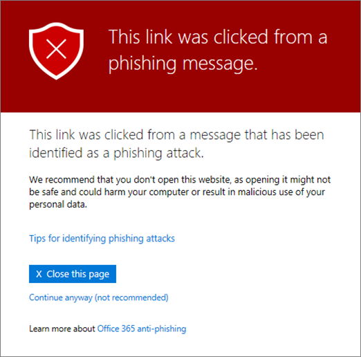
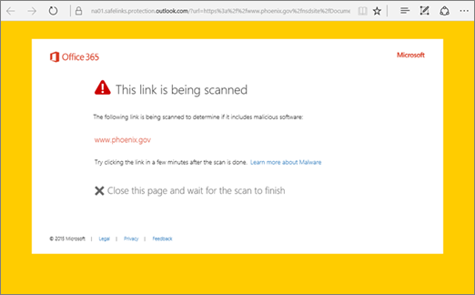

# Páginas de aviso de links seguros do Office 365 ATPOffice 365 ATP Safe Links warning pages

> [!IMPORTANT]
> Este artigo destina-se a clientes corporativos do Office 365.This article is intended for Office 365 Enterprise customers. Se você estiver usando o Outlook.com, o Office 365 Home ou o Office 365 Personal e estiver procurando informações sobre links seguros no Outlook, consulte [Advanced Outlook.com Security](https://support.office.com/article/advanced-outlook-com-security-for-office-365-subscribers-882d2243-eab9-4545-a58a-b36fee4a46e2).If you are using Outlook.com, Office 365 Home, or Office 365 Personal, and you're looking for information about Safe Links in Outlook, see [Advanced Outlook.com security](https://support.office.com/article/advanced-outlook-com-security-for-office-365-subscribers-882d2243-eab9-4545-a58a-b36fee4a46e2).

[Proteção avançada contra ameaças do Office 365](office-365-atp.md) (ATP) ajuda a proteger sua organização contra tentativas de phishing e malware por meio de recursos, como [links seguros de ATP](atp-safe-links.md), [anexos seguros de ATP](atp-safe-attachments.md)e [proteção contra phishing](anti-phishing-protection.md).[Office 365 Advanced Threat Protection](office-365-atp.md) (ATP) helps protect your organization from phishing attempts and malware through features, such as [ATP Safe Links](atp-safe-links.md), [ATP Safe Attachments](atp-safe-attachments.md), and [anti-phishing protection](anti-phishing-protection.md). Quando a proteção está no local, os links (URLs) em mensagens de email e documentos do Office são verificados.When protection is in place, links (URLs) in email messages and Office documents are checked. Se uma URL for identificada como suspeita ou mal-intencionada, você poderá ter impedido de abrir a URL quando clicar nela.If a URL is identified as suspicious or malicious, you might be blocked from opening the URL when you click it. Em vez de ir diretamente para o site, você pode ver uma página de aviso.Instead of going directly to the site, you might see a warning page instead. 
  
Leia este artigo para ver exemplos de páginas de aviso que podem aparecer, juntamente com as atualizações recentes para páginas de aviso.Read this article to see examples of warning pages that might appear, along with recent updates to warning pages.
  
## Exemplos de páginas de avisoExamples of warning pages

### ATP está examinando o linkATP is scanning the link

Uma URL está sendo verificada por links seguros de ATP.A URL is being scanned by ATP Safe Links. Talvez seja necessário aguardar alguns momentos para tentar o link novamente.You might have to wait a few moments to try the link again.

### Uma URL está em uma mensagem de email suspeitaA URL is in a suspicious email message

A URL está em uma mensagem de email que parece ser semelhante a outras mensagens de email consideradas suspeitas.The URL is in an email message that seems similar to other email messages that are considered suspicious. Recomendamos que você faça uma verificação dupla da mensagem de email antes de prosseguir para o site.We recommend that you double-check the email message before proceeding to the site.

### Uma URL está em uma mensagem identificada como uma tentativa de phishingA URL is in a message identified as a phishing attempt

A URL está em uma mensagem de email que foi identificada como um ataque de phishing.The URL is in an email message that has been identified as a phishing attack. Como resultado, todas as URLs na mensagem de email são bloqueadas.As a result, all URLs in the email message are blocked. Recomendamos que você não vá para o site.We recommend that you do not proceed to the site.

### Um site foi identificado como mal-intencionadoA site has been identified as malicious

A URL aponta para um site que foi identificado como mal-intencionado.The URL points to a site that has been identified as malicious.    Recomendamos que você não vá para o site.We recommend that you do not proceed to the site.

### Um site é bloqueadoA site is blocked

A URL é bloqueada para sua organização.The URL is blocked for your organization. Há várias razões pelas quais uma URL pode ser bloqueada.There are several reasons why a URL might be blocked. Recomendamos que você entre em contato com o administrador do Office 365 da sua organização.We recommend that you contact your organization's Office 365 administrator.

### ErroAn error has occurred

Ocorreu algum tipo de erro, e a URL não pode ser aberta.Some kind of error has occurred, and the URL cannot be opened.

## Atualizações recentes para páginas de avisoRecent updates to warning pages

Várias páginas de aviso foram recentemente atualizadas para o Office 365 ATP.Several warning pages were recently updated for Office 365 ATP. Se você ainda não estiver vendo as páginas atualizadas, em breve.If you're not already seeing the updated pages, you will soon. As atualizações incluem um novo esquema de cores, mais detalhes e a capacidade de prosseguir para um site apesar dos avisos e recomendações fornecidos.The updates include a new color scheme, more details, and the ability to proceed to a site despite the given warning and recommendations.

### Verificação de URL em andamentoURL scan in progress

Página de aviso original:Original warning page:

Página de aviso atualizada:Updated warning page:

### Aviso de site mal-intencionadoMalicious site warning

Página de aviso original:Original warning page:

Página de aviso atualizada:Updated warning page:

### Aviso de URL bloqueadoBlocked URL warning

Página de aviso original:Original warning page:

Página de aviso atualizada:Updated warning page:

### Página de aviso "erro ocorrido""Error occurred" warning page

Página de aviso original:Original warning page:

Página de aviso atualizada:Updated warning page:

   
