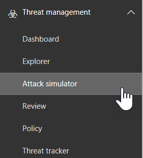

# Simulador de ataque no Office 365Attack Simulator in Office 365

**Resumo** Se você for um administrador global do Office 365 e sua organização tiver o [Office 365 Threat Intelligence](office-365-ti.md), você pode usar o Attack Simulator para executar cenários de ataque realísticos em sua organização. Isso pode ajudá-lo a identificar e encontrar usuários vulneráveis antes que um ataque real afete o resultado final. Leia este artigo para saber mais.**Summary** If you are an Office 365 global administrator and your organization has [Office 365 Threat Intelligence](office-365-ti.md), you can use Attack Simulator to run realistic attack scenarios in your organization. This can help you identify and find vulnerable users before a real attack impacts your bottom line. Read this article to learn more.

> [!IMPORTANT]
> A partir de fevereiro de 2019 e saindo dos próximos meses, o Office 365 Threat Intelligence está se tornando o Office 365 Advanced Threat Protection Plan 2, com recursos adicionais de proteção contra ameaças. Para saber mais, veja [planos e preços avançados de proteção contra ameaças do office 365](https://products.office.com/exchange/advance-threat-protection) e a [Descrição do serviço de proteção avançada contra ameaças do Office 365](https://docs.microsoft.com/office365/servicedescriptions/office-365-advanced-threat-protection-service-description).Beginning in February 2019 and rolling out over the next several months, Office 365 Threat Intelligence is becoming Office 365 Advanced Threat Protection Plan 2, with additional threat protection capabilities. To learn more, see [Office 365 Advanced Threat Protection plans and pricing](https://products.office.com/exchange/advance-threat-protection) and the [Office 365 Advanced Threat Protection Service Description](https://docs.microsoft.com/office365/servicedescriptions/office-365-advanced-threat-protection-service-description).
  
## Os ataquesThe Attacks

Três tipos de simulação de ataque estão disponíveis atualmente:Three kinds of attack simulations are currently available:
  
- [Nome de exibição spear-phishing AttackDisplay name spear-phishing attack](attack-simulator.md#spearphish)
    
- [Ataque de irrigação de senhaPassword-spray attack](attack-simulator.md#passwordspray)
    
- [Ataque de senha de força brutaBrute-force password attack](attack-simulator.md#bruteforce)
    
Para que um ataque seja iniciado com êxito, use a autenticação multifator na conta que você está usando para executar ataques simulados. Além disso, você deve ser um administrador global do Office 365.For an attack to be successfully launched, you use multi-factor authentication on the account you are using to run simulated attacks. In addition, you must be an Office 365 global administrator.
  
> [!NOTE]
> O suporte para acesso condicional estará disponível em breve.Support for Conditional Access is coming soon. 
  
Para acessar o simulador de conformidade, &amp; no centro de conformidade de segurança, escolha simulador de **ataque**de **Gerenciamento** \> de ameaças.To access Attack Simulator, in the Security &amp; Compliance Center, choose **Threat management** \> **Attack simulator**.
  
## Antes de começar...Before you begin...

Verifique se você e sua organização atendem aos seguintes requisitos para o simulador de ataques:Make sure that you and your organization meet the following requirements for Attack Simulator:
      
- O email da sua organização está hospedado no Exchange Online. (O simulador de ataque não está disponível para os servidores de email locais.)Your organization's email is hosted in Exchange Online. (Attack Simulator is not available for on-premises email servers.)
    
- Você é um administrador global do Office 365You are an Office 365 global administrator
    
- Sua organização está usando a [autenticação multifator para usuários do Office 365](https://docs.microsoft.com/office365/admin/security-and-compliance/set-up-multi-factor-authentication?view=o365-worldwide)Your organization is using [Multi-factor authentication for Office 365 users](https://docs.microsoft.com/office365/admin/security-and-compliance/set-up-multi-factor-authentication?view=o365-worldwide)
 
- sua organização tem [o Office 365 Threat Intelligence](office-365-ti.md), com o simulador de ataques &amp; visível no centro de conformidade de segurança (vá para o **Threat management** \> **Attack simulator**)Your organization has [Office 365 Threat Intelligence](office-365-ti.md), with Attack Simulator visible in the Security &amp; Compliance Center (go to **Threat management** \> **Attack simulator**) 

    
## Nome de exibição spear-phishing AttackDisplay name spear-phishing attack

Phishing é um termo genérico para um amplo conjunto de ataques de classe como um ataque de estilo de engenharia social. Esse ataque está voltado para o spear phishing, um ataque mais direcionado para um grupo específico de pessoas ou uma organização. Normalmente, um ataque personalizado com algum reconhecimento executado e usando um nome de exibição que irá gerar confiança no destinatário, como uma mensagem de email que parece ser proveniente de um executivo dentro da sua organização.Phishing is a generic term for a broad suite of attacks classed as a social engineering style attack. This attack is focused on spear phishing, a more targeted attack that is aimed at a specific group of individuals or an organization. Typically, a customized attack with some reconnaissance performed and using a display name that will generate trust in the recipient, such as an email message that looks like it came from an executive within your organization.
  
Esse ataque se concentra em permitir que você manipule quem a mensagem parece ter originado alterando o nome de exibição e o endereço de origem. Quando os ataques de spear-phishing forem bem-sucedidos, cybercriminals obter acesso às credenciais dos usuários.This attack focuses on letting you manipulate who the message appears to have originated from by changing the display name and source address. When spear-phishing attacks are successful, cybercriminals gain access to users' credentials.
  
### Para simular um ataque de spear-phishingTo simulate a spear-phishing attack

  
Você pode criar o editor de HTML avançado diretamente no próprio campo de **corpo de email** ou trabalhar com o código-fonte HTML.You can craft the rich HTML editor directly in the **Email body** field itself or work with HTML source.
  
1. No [centro de &amp; conformidade de segurança](https://protection.office.com), escolha simulador de **ataque**de **Gerenciamento** \> de ameaças.In the [Security &amp; Compliance Center](https://protection.office.com), choose **Threat management** \> **Attack simulator**.
    
2. Especifique um nome de campanha significativo para o ataque ou selecione um modelo.Specify a meaningful campaign name for the attack or select a template.  
  
3. Especifique os destinatários de destino. Podem ser indivíduos ou grupos em sua organização. Cada destinatário de destino deve ter uma caixa de correio do Exchange Online para que o ataque seja bem-sucedido.Specify the target recipients. This can be individuals or groups in your organization. Each targeted recipient must have an Exchange Online Mailbox in order for the attack to be successful.  
  
4. Configure os detalhes de email de phishing.Configure the Phishing email details.   A formatação HTML pode ser complexa ou básica quanto às necessidades de sua campanha. Como o formato de email é HTML, você pode inserir imagens e texto para aprimorar o believability. Você tem controle sobre qual será a aparência da mensagem recebida no cliente de recebimento de email.The HTML formatting can be as complex or basic as your campaign needs. As the email format is HTML, you can insert images and text to enhance believability. You have control on what the received message will look like in the receiving email client.
    
5. Especifique o texto para o campo **de (nome)** . Este é o campo que mostra o **nome de exibição** no cliente de recebimento de email.Specify text for the **From (Name)** field. This is the field that shows in the **Display Name** in the receiving email client. 
    
6. Especifique o texto ou o campo **de** . Este é o campo que aparece como o endereço de email do remetente no cliente de recebimento de email.Specify text or the **From** field. This is the field that shows as the email address of the sender in the receiving email client.  Você pode inserir um namespace de email existente dentro da sua organização (isso fará com que o endereço de email seja realmente resolvido no cliente de recebimento, facilitando um modelo de confiança muito alto) ou você pode inserir um endereço de email externo. O endereço de email que você especificar não precisa realmente existir, mas ele precisa seguir o formato de um endereço SMTP válido, como User @ nome_do_domínio. Extension.You can enter an existing email namespace within your organization (doing this will make the email address actually resolve in the receiving client, facilitating a very high trust model), or you can enter an external email address. The email address that you specify does not have to actually exist, but it does need to following the format of a valid SMTP address, such as user@domainname.extension. 
  
7. Usando o seletor suspenso, selecione uma URL de servidor de logon de phishing que reflita o tipo de conteúdo que você terá dentro de seu ataque. Várias URLs com temas são fornecidas para você escolher, como entrega de documentos, técnica, folha de pagamento, etc. Isso é efetivamente a URL para a qual os usuários direcionados são solicitados a clicar.Using the drop-down selector, select a Phishing Login server URL that reflects the type of content you will have within your attack. Several themed URLs are provided for you to choose from, such as document delivery, technical, payroll etc. This is effectively the URL that targeted users are asked to click.
    
8. Especifique uma URL da página de aterrissagem personalizada. O uso dessa forma redirecionará os usuários para uma URL que você especificar no final de um ataque bem-sucedido. Se você tiver treinamento de conscientização interna, por exemplo, você pode especificar isso aqui.Specify a custom landing page URL. Using this will redirect users to a URL you specify at the end of a successful attack. If you have internal awareness training, for example, you can specify that here.
    
9. Especifique o texto do campo **assunto** . Este é o campo que aparece como o **nome da entidade** no cliente de recebimento de email.Specify text for the **Subject** field. This is the field that shows as the **Subject Name** in the receiving email client. 
    
10. Redija o **corpo do email** que o destino receberá.Compose the **Email body** that the target will receive.  `${username}`Insere o nome do destino no corpo do email.`${username}` inserts the targets name into the Email body.  `${loginserverurl}`Insere a URL que os usuários de destino devem clicar`${loginserverurl}` inserts the URL we want target users to click 
    
11. Escolha **Avançar e** **concluir** para iniciar o ataque. A mensagem de email de spear phishing é entregue às caixas de correio dos destinatários de destino.Choose **Next,** then **Finish** to launch the attack. The spear phishing email message is delivered to your target recipients' mailboxes. 
    
## Ataque de irrigação de senhaPassword-spray attack

Um ataque de irrigação de senha em uma organização é geralmente usado após um ator incorreto ter adquirido com êxito uma lista de usuários válidos do locatário. O ator ruim sabe sobre senhas comuns que as pessoas utilizam. Esse é um ataque amplamente usado, pois é um ataque barato que é executado e é mais difícil de detectar abordagens de força bruta.A password spray attack against an organization is typically used after a bad actor has successfully acquired a list of valid users from the tenant. The bad actor knows about common passwords that people use. This is a widely used attack, as it is a cheap attack to run, and harder to detect than brute force approaches.
  
Esse ataque se concentra em permitir que você especifique uma senha comum para uma grande base de destino de usuários.This attack focuses on letting you specify a common password against a large target base of users.
  
### Para simular um ataque de irrigação de senhaTo simulate a password-spray attack

1. No [centro de &amp; conformidade de segurança](https://protection.office.com), escolha simulador de **ataque**de **Gerenciamento** \> de ameaças.In the [Security &amp; Compliance Center](https://protection.office.com), choose **Threat management** \> **Attack simulator**.
    
2. Especifique um nome de campanha significativo para o ataque.Specify a meaningful campaign name for the attack.
    
3. Especifique os destinatários de destino. Podem ser indivíduos ou grupos em sua organização. Um destinatário direcionado deve ter uma caixa de correio do Exchange Online para que o ataque seja bem-sucedido.Specify the target recipients. This can be individuals or groups in your organization. A targeted recipient must have an Exchange Online Mailbox in order for the attack to be successful.
    
4. Especifique uma senha a ser usada para o ataque. Por exemplo, uma senha comum e relevante que você pode tentar `Fall2017`é. Outro pode ser `Spring2018`ou `Password1`.Specify a password to use for the attack. For example, one common, relevant password you could try is `Fall2017`. Another might be `Spring2018`, or `Password1`.
    
5. Escolha **concluir** para iniciar o ataque.Choose **Finish** to launch the attack. 
    
## Ataque de senha de força brutaBrute-force password attack

Um ataque de senha de força bruta em relação a uma organização é geralmente usado após um ator incorreto ter adquirido com êxito uma lista de usuários principais do locatário. Esse ataque se concentra em tentar um conjunto de senhas em uma única conta de usuário.A brute-force password attack against an organization is typically used after a bad actor has successfully acquired a list of key users from the tenant. This attack focuses on trying a set of passwords on a single user's account.
  
### Para simular um ataque de senha de força brutaTo simulate a brute-force password attack

1. No [centro de &amp; conformidade de segurança](https://protection.office.com), escolha simulador de **ataque**de **Gerenciamento** \> de ameaças.In the [Security &amp; Compliance Center](https://protection.office.com), choose **Threat management** \> **Attack simulator**.
    
2. Especifique um nome de campanha significativo para o ataque.Specify a meaningful campaign name for the attack.
    
3. Especifique o destinatário de destino. Um destinatário direcionado deve ter uma caixa de correio do Exchange Online para que o ataque seja bem-sucedido.Specify the target recipient. A targeted recipient must have an Exchange Online Mailbox in order for the attack to be successful.
    
4. Especifique um conjunto de senhas a ser usado para o ataque. Para fazer isso, você pode usar um arquivo de texto (. txt) para sua lista de senhas. O arquivo de texto não pode exceder 10 MB em tamanho de arquivo. Use uma senha por linha e certifique-se de incluir um retorno de disco rígido após a última senha em sua lista.Specify a set of passwords to use for the attack. To do this, you can use a text (.txt) file for your list of passwords. The text file cannot exceed 10 MB in file size. Use one password per line, and make sure to include a hard return after the last password in your list.
    
5. Escolha **concluir** para iniciar o ataque.Choose **Finish** to launch the attack. 
    
## Novos recursos no simulador de ataquesNew features in Attack Simulator

Novos recursos estão sendo adicionados ao simulador de ataques. Eles incluem:New features are being added to Attack Simulator. These include:
- **Recursos avançados de relatórios**. Você poderá ver dados como o tempo mais rápido (ou mais lento) para abrir uma mensagem de email de simulação de ataque, o tempo mais rápido (ou mais lento) para clicar em um link na mensagem e muito mais.**Advanced reporting capabilities**. You'll be able to see data such as the fastest (or slowest) time to open an attack simulation email message, the fastest (or slowest) time to click a link in the message, and more.
- **Editor de modelos de email**. Você pode criar um modelo de email reutilizável e personalizado que pode ser usado para simulações de ataque futuras.**Email template editor**. You can create a custom, reusable email template that you can use for future attack simulations.

Visite o [mapa do Microsoft 365](https://www.microsoft.com/microsoft-365/roadmap) para ver o que está em desenvolvimento, o que está saindo e o que já foi iniciado.Visit the [Microsoft 365 Roadmap](https://www.microsoft.com/microsoft-365/roadmap) to see what's in development, what's rolling out, and what's already launched.

