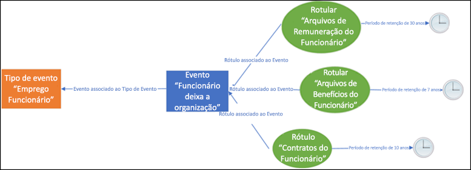
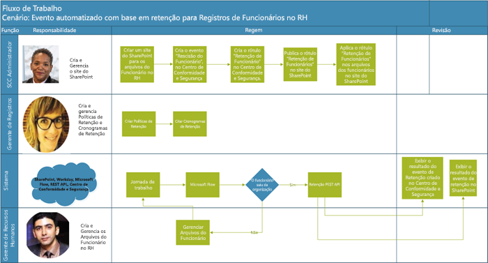
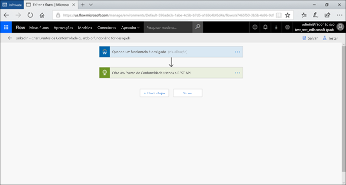
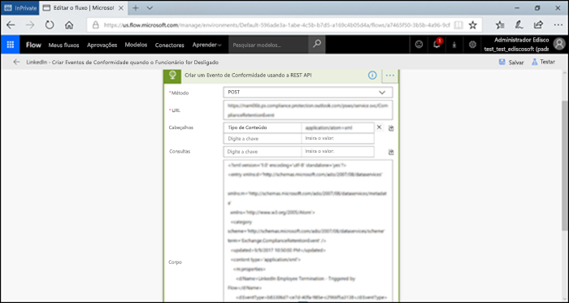
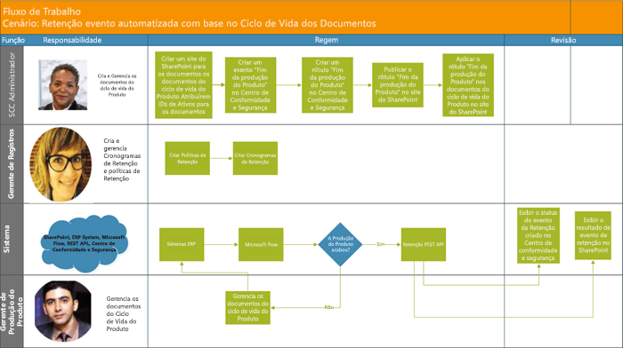

# Automatizar retenção baseada em eventosAutomate event-based retention

A massificação de conteúdo nas organizações e como ele pode se tornar ROT (redundante, obsoleto, trivial) é um negócio sério. Para continuar atendendo aos desafios legais, comerciais e de conformidade regulamentar, as empresas devem poder manter e proteger informações importantes, e encontrar rapidamente o conteúdo relevante. Para que uma empresa seja bem-sucedida, é fundamental que ela mantenha apenas informações importantes e pertinentes.The explosion of content in organizations and how it can become ROT (redundant, obsolete, trivial) is serious business. To continue to meet legal, business, and regulatory compliance challenges, businesses must be able to keep and protect important information and quickly find what’s relevant. Retaining only important, pertinent information is key to a business’s success.

Portanto, as organizações podem aproveitar as soluções de retenção no Centro de Conformidade e Segurança do Office 365. A retenção pode ser disparada por meio de [rótulos de retenção](labels.md). O rótulo de retenção tem a opção de [basear o período de retenção em um evento específico](event-driven-retention.md). Normalmente, o período de retenção se baseia em uma data conhecida, como a data de criação ou a data da última modificação do conteúdo. No entanto, as organizações também têm requisitos para descartar conteúdo com base na ocorrência de um evento, por exemplo, sete anos depois que um funcionário deixa a organização.Hence organizations can take advantage of retention solutions in the Office 365 Security & Compliance Center. Retention can be triggered by using [retention labels](labels.md). A retention label has the option to [base the retention period on a specific event](event-driven-retention.md). Typically, the retention period is based on a known date, such as the creation date or last modified date for the content. However, organizations also have requirements to dispose of content based on the occurrence of an event, such as 7 years after an employee leaves an organization.

Para garantir o descarte de conteúdo de acordo com as regras, é fundamental saber quando um evento ocorre. Com o volume de conteúdo aumentando rapidamente, fica cada vez mais difícil reter e descartá-lo em conformidade e de maneira oportuna.In order to ensure compliant disposal of content, it is imperative to know when an event takes place. With the volume of content increasing rapidly, it is becoming challenging to retain and dispose content in a timely and compliant manner.

A retenção baseada em eventos resolve esse problema. Este tópico explica como configurar os fluxos dos processos empresariais para automatizar a retenção por meio de eventos usando a API REST do Microsoft 365.Event-based retention solves this problem. This topic explains how to set up your business process flows to automate retention through events by using the Microsoft 365 REST API.

## Sobre a retenção baseada em eventosAbout event-based retention

Sejam de pequeno, médio ou grande porte, a quantidade de documentos comerciais e jurídicos, arquivos de funcionários, contratos e documentação de produtos que as empresas criam e gerenciam todos os dias está aumentando radicalmente.An organization can be small, medium, or large. The number of business documents, legal documents, employee files, contracts, and product documents that get created and managed on a day to day basis is increasing dramatically.

Por exemplo, todos os dias, dezenas ou centenas de funcionários entram e saem das organizações. O departamento de RH continua a criar, atualizar ou excluir documentos relacionados a funcionários de acordo com as exigências comerciais. Esse processo está sujeito às diferentes políticas de retenção descritas para o negócio:For example, each day, tens and hundreds of employees are joining and leaving organizations. The HR department continues to create, update, or delete employee-related documents as per business requirements. This process is subject to the different retention policies outlined for the business:

- **O período de retenção do conteúdo pode ser uma data conhecida**, como a data da criação, a data da última modificação ou da rotulagem do conteúdo. Por exemplo, você pode reter documentos por sete anos depois de criados e excluí-los em seguida.**The period of retention for content can be a known date** such as the date the content was created, last modified or labeled. For example, you might retain documents for seven years after they're created and then delete them.

- **O período de retenção do conteúdo pode ser uma data desconhecida**. Por exemplo, com os rótulos de retenção, é possível basear o período de retenção na ocasião em que ocorre um tipo específico de evento, como a data em que um funcionário sai da empresa.**The period of retention of content can also be an unknown date**. For example, with retention labels, you can also base a retention period on when a specific type of event occurs, such as an employee leaving the organization.

O evento dispara o início do período de retenção, e todo o conteúdo com um rótulo aplicado para esse tipo de evento faz com que as ações de retenção do rótulo sejam aplicadas a ele. Isso se chama retenção baseada em eventos. Para saber mais, confira [Visão geral da retenção orientada a eventos](event-driven-retention.md).The event triggers the start of the retention period, and all content with a label applied for that type of event get the label's retention actions enforced on them. This is called event-based retention - to learn more, see [Overview of event-driven retention](event-driven-retention.md).

## Configurar a retenção baseada em eventosSet up event-based retention

Esta seção descreve o que precisa ser feito antes da retenção do conteúdo.This section describes what needs to be done prior to retaining content.

### Identificar as funçõesIdentify roles

Identifique as diferentes funções de uma organização que executam as tarefas de Gerenciamento de Registros que seriam responsáveis pela retenção eficaz e eficiente de documentos comerciais.Identify the different roles in an organization that perform Record Management tasks that would be responsible for effective and efficient retention of business documents.

  | **Pessoal****Persona**| **Função****Role**|
  | - | - |
  | Administrador do Centro de Conformidade e SegurançaSecurity & Compliance Center admin | Cria tipos de evento de retenção, rótulos de retenção e repositórios de registro no SharePointCreates Retention Event types, Retention labels and Record repositories in SharePoint |
  | Gerente de registrosRecords Manager                                  | Fornece políticas de retenção, diretrizes de agendamento de retenção e detalhes de conformidadeProvides Retention Policies and Retention Schedules guidance and compliance details   |
  | Administrador do sistema (empresa)System Admin (business)                          | Configura e gerencia sistemas externos para trabalhar com o Microsoft 365Sets up and manages external systems to work with Microsoft 365                       |
  | Operador de InformaçõesInformation Worker                               | Gerencia o ciclo de vida dos processos empresariais (RH, finanças, TI, etc.)Manages the lifecycle of their business process (HR, Finance, IT etc)                 |

### Configurar o Centro de Conformidade e SegurançaSet up the Security & Compliance Center
  
1. O administrador de conformidade cria um tipo de evento. Por exemplo, rescisão de funcionário, vencimento de contrato ou término de fabricação de produto (confira o processo passo a passo no [artigo sobre retenção baseada em eventos](https://docs.microsoft.com/pt-BR/office365/securitycompliance/event-driven-retention))Compliance admin creates an event type – for example, Employee Termination or Contract Expiration or End of Product Manufacturing (Please refer to step by step process in [Event retention article](https://docs.microsoft.com/pt-BR/office365/securitycompliance/event-driven-retention)
    
1. O administrador de conformidade cria um rótulo de retenção com base em um evento e associa o rótulo a um tipo de eventoCompliance admin creates a retention label based on an event and associates the label with an event type
    
1. Há quatro tipos de disparadores para rótulos de retenção:There are 4 types of triggers for retention labels:
            
    1. Data de criaçãoCreate date
                
    1. Última modificaçãoLast modified
                
    1. Data do rótulo (quando o conteúdo foi rotulado)Label date (when the content was labeled)
                
    1. Com base em eventosEvent-based
    
1. O administrador de conformidade publica o rótuloCompliance admin publishes the label

### Configurar o SharePointSet up SharePoint
   
Para criar um repositório de registros, o administrador de conformidade:To create a records repository, the compliance admin:

1. Cria um site do SharePoint.Creates a SharePoint site.

1. Faz um dos seguintes procedimentos:Does one of the following:
        
    - Cria uma biblioteca do SharePoint: ele define um rótulo baseado em eventos no nível da biblioteca. Para saber mais, confira [Como aplicar um rótulo de retenção padrão a todo o conteúdo de uma biblioteca, pasta ou de um conjunto de documentos do SharePoint](labels.md#applying-a-default-retention-label-to-all-content-in-a-sharepoint-library-folder-or-document-set).Creates a SharePoint library: Set event-based label at the library level. For more information, see [Applying a default retention label to all content in a SharePoint library, folder, or document set](labels.md#applying-a-default-retention-label-to-all-content-in-a-sharepoint-library-folder-or-document-set).
          
    - Configura um conjunto de documentos no SharePoint. Para saber mais, confira [Introdução a conjuntos de documentos](https://support.office.com/pt-BR/article/Introduction-to-Document-Sets-3DBCD93E-0BED-46B7-B1BA-B31DE2BCD234).Sets up a Document set in SharePoint. For more information, see [Introduction to document sets](https://support.office.com/pt-BR/article/Introduction-to-Document-Sets-3DBCD93E-0BED-46B7-B1BA-B31DE2BCD234).
      
1. Atribui uma ID de ativo (a ID de ativo é um nome de produto ou código usado pela organização, por exemplo, um número de funcionário) a cada conjunto de documentos de funcionários. Ao atribuir a ID de ativo à pasta, todos os itens dessa pasta herdam automaticamente a mesma ID. Isso significa que todos os itens podem ter o período de retenção disparado pelo mesmo evento.Assigns Asset Id (asset ID is a product name or code used by the organization, for example, Employee number can be an asset id) to each employee document set (By assigning the asset ID to the folder, every item in that folder automatically inherits the same asset ID. This means all the items can have their retention period triggered by the same event.

## Maneiras de disparar a retenção baseada em eventosWays to trigger event-based retention

Há duas maneiras pelas quais a retenção baseada em eventos pode ser disparada:There are two ways in which event-based retention can be triggered:

- **Usando a IU do Centro de Conformidade e Segurança** Esse processo que pode ser usado para reter menos conteúdo por vez ou para reduzir a frequência de disparo da retenção, como mensal ou anual. Para saber mais sobre este método, confira [Visão geral da retenção orientada a eventos](event-driven-retention.md). No entanto, essa maneira de disparar a retenção pode ser demorada e passível de erros, retardando a escalabilidade. Portanto, uma solução automatizada e perfeita para acionar a retenção pode aumentar a segurança e a conformidade dos dados.**Using Security & Compliance Center UI** This is a process that can be used to retain less content at a time or the frequency to trigger retention is not often, such as monthly or yearly. For more information on this method, see [Overview of event-driven retention](event-driven-retention.md). However, this way to trigger retention can be time-consuming and prone to error, thus stunting scalability. Therefore, an automated, seamless solution to trigger retention can enhance the security and compliance of data.

- **Usando uma API REST do Microsoft 365** Esse processo pode ser usado quando grandes quantidades de conteúdo devem ser retidas por vez e/ou quando a frequência de disparo da retenção for mais frequente, como diária ou semanal. O fluxo detecta quando um evento ocorre no sistema de linha de negócios e cria automaticamente um evento relacionado no Centro de Conformidade e Segurança. Não é necessário criar manualmente um evento na interface do usuário sempre que ocorrer um.**Using a M365 REST API** This process can be used when large amounts of content are to be retained at a time and/or the frequency to trigger retention is often such as daily or weekly. The flow detects when an event occurs in your line-of-business system, and then automatically creates a related event in the Security & Compliance Center. You don't need to manually create an event in the UI each time one occurs.

Há duas opções de uso para a API REST:There are two options for using the REST API:

- **O Microsoft Flow ou um aplicativo semelhante** pode ser usado para disparar automaticamente a ocorrência de um evento. O Microsoft Flow é um orquestrador de conexão com outros sistemas. O uso deste aplicativo não exige uma solução personalizada.**Microsoft Flow or a similar application** can be used to trigger the occurrence of an event automatically. Microsoft Flow is an orchestrator for connecting to other systems. Using Microsoft Flow does not require a custom solution.

- **PowerShell ou um cliente HTTP para chamar a REST API** Usando o PowerShell (versão 6 ou superior) para chamar a API REST do Microsoft 365 para criar eventos.**PowerShell or an HTTP client to call REST API** Using PowerShell (version 6 or higher) to call Microsoft 365 REST API to create events. 

Uma API REST é um ponto de extremidade de serviço com suporte para conjuntos de operações HTTP (métodos), que fornecem acesso para criação/recuperação/atualização/exclusão aos recursos do serviço. Para saber mais, confira [Componentes de uma solicitação/resposta da API REST](https://docs.microsoft.com/pt-BR/rest/api/gettingstarted/#components-of-a-rest-api-requestresponse). Nesse caso, é possível criar e recuperar eventos usando operações (métodos) POST e GET com a API REST do Microsoft 365.A Rest API is a service endpoint that supports sets of HTTP operations (methods), which provide create/retrieve/update/delete access to the service's resources - for more information, see [Components of a REST API request/response](https://docs.microsoft.com/pt-BR/rest/api/gettingstarted/#components-of-a-rest-api-requestresponse). In this case, by using the Microsoft 365 REST API, events can be created and retrieved using operations (methods) POST and GET.

## Exemplos de cenáriosExample scenarios

Vamos considerar os seguintes cenários:Let’s consider the following scenarios.

### Cenário 1: funcionários que deixam a organizaçãoScenario 1: Employees leaving the organization 

Uma organização cria e armazena vários documentos relacionados a funcionários para cada funcionário. Esses documentos são gerenciados e retidos durante a vigência do contrato de cada funcionário. No entanto, quando o funcionário deixa a organização ou o contrato dele é rescindido, a organização é obrigada por exigências legais e comerciais a reter os documentos desse funcionário por um determinado período.An organization creates and stores numerous employee related documents per employee. These documents are managed and retained during the employment of each employee. However, when the employee leaves the organization or the employment is terminated, the organization is obligated by legal and business requirements to retain the documents of that employee for a stipulated period.

Agora, se vários funcionários deixarem a organização todos os dias, ela deverá disparar o tempo de retenção de centenas ou milhares de documentos por dia.Now if multiple employees leave the organization every day, the organization must trigger the retention clock of hundreds if not thousands of documents each day.

Além disso, o período de retenção deve ser calculado para cada um desses funcionários, como a data de rescisão + número de dias, meses ou anos, com base no tipo de registro do funcionário. Por exemplo, a remuneração versus os registros de benefícios desse funcionário pode precisar de uma retenção diferente.In addition to this, the retention period needs to be calculated for each of these employees as Employee termination date + number of days, months or years based on the type of the employee record. For example, worker’s compensation of the employee vs benefits filings of the same employee may need different retention.

O diagrama abaixo mostra como pode haver vários rótulos associados a um único evento. Aqui, todos os arquivos com rótulo de "remuneração do funcionário" e todos os arquivos com rótulo de "benefícios do funcionário" estão associados a um único evento, representado pelo funcionário que deixa a organização. Cada um desses diferentes arquivos tem diferentes relógios de retenção. Assim, quando um funcionário deixa a organização, esses arquivos, no âmbito de cada rótulo, passam por um período de retenção diferente. Disparar todos esses relógios de retenção diferentes para cada tipo de arquivo ou rótulo para cada funcionário é uma tarefa extremamente complexa. Imagine fazer isso para vários funcionários.The diagram below shows how there can be multiple labels that are associated with a single event. Here all the files under Worker’s compensation label and all the files under Employee benefits label are both associated with a single event which is the employee leaving the organization. Each of these different files have different retention clocks. So, when an employee leaves the organization, these files within each label experience a different retention period. To trigger all these different retention clocks for each file type or label for each employee is a very challenging task. Imagine doing this for multiple employees.

Portanto, um processo automatizado para disparar esses diferentes relógios de retenção para vários funcionários economizará tempo, será isento de erros e extremamente eficiente.Hence an automated process to trigger these different retention clocks for multiple employees will be time-saving, error-free and extremely efficient .

**Como configurar a retenção automatizada baseada em eventos para este cenário:****Configuring Automated Event Based Retention for this scenario:**

  - O administrador criar pastas de funcionários para o conjunto de documentos, como Sara Melo, Diogo Martins.Admin c reates employee folders to the Document set such as Jane Doe, John Smith.

  - O administrador adiciona arquivos de funcionários, como Benefícios, Folha de pagamento e Remuneração, à pasta de cada funcionário.Admin adds employee files such as Benefits, Payroll, Worker’s Compensation to each employee folder

  - O administrador atribui uma ID de ativo à pasta de cada funcionário.Admin assigns Asset Id to each employee folder. 

  - Administrador do Centro de Conformidade e Segurança ISCC Admin l

  - Entra no Centro de Conformidade e Segurança.ogs into the Security & Compliance Center

  - O administrador do Centro de Conformidade e Segurança cria tipos de eventos relacionados a funcionários, como "Rescisão de funcionário" e "Contratação de funcionário", no Centro de Conformidade e Segurança.SCC Admin creates employee related events types such as “Employee Termination”, “Employee Hire” events in Security and Compliance Center.

  - O administrador cria o rótulo "Retenção de funcionário" no Centro de Conformidade e Segurança.SCC Admin creates “Employee Retention” label in Security and Compliance Center.

  - O rótulo "Retenção de funcionário" é publicado e aplicado de forma automática ou manual aos arquivos de funcionários no SharePoint.This “Employee Retention” label is published and applied manually or automatically to the employee files in SharePoint

  - Um sistema de gerenciamento de RH, como o Workday, pode trabalhar com o Microsoft Flow para executar periodicamente o gerenciamento de arquivos de funcionários.HR Management System like Workday can work with Microsoft Flow to run periodically to manage employee files

  - Quando um funcionário deixa a organização, o Flow dispara a API REST de retenção baseada em eventos do Microsoft 365, que inicia o relógio de retenção nos arquivos específicos do funcionário.If an employee has left the organization, the Flow will trigger the M365 Event Based Retention REST API that will begin the retention clock on the specific employee’s files.

#### Usando o Microsoft FlowUsing Microsoft Flow

Etapa 1 – Criar um fluxo para criar um evento usando a API REST do Microsoft 365Step 1- Create a flow to create an event using the Microsoft 365 REST API

##### Criar um eventoCreate an event

Exemplo de código para chamar a API RESTSample code to call the REST API

<table>
<thead>
<tr class="header">
<th>MétodoMethod</th>
<th>POSTPOST</th>
<th></th>
</tr>
</thead>
<tbody>
<tr class="odd">
<td>URLURL</td>
<td>https://ps.compliance.protection.outlook.com/psws/service.svc/ComplianceRetentionEvent)</td>
<td></td>
</tr>
<tr class="even">
<td>CabeçalhosHeaders</td>
<td>Content-TypeContent-Type</td>
<td>application/atom+xmlapplication/atom+xml</td>
</tr>
<tr class="odd">
<td>CorpoBody</td>
<td>
&lt;?xml version='1.0' encoding='utf-8' standalone='yes'?&gt;&lt;?xml version='1.0' encoding='utf-8' standalone='yes'?&gt;

&lt;entry xmlns:d='http://schemas.microsoft.com/ado/2007/08/dataservices'&lt;entry xmlns:d='http://schemas.microsoft.com/ado/2007/08/dataservices'

xmlns:m='http://schemas.microsoft.com/ado/2007/08/dataservices/metadata'xmlns:m='http://schemas.microsoft.com/ado/2007/08/dataservices/metadata'

xmlns='http://www.w3.org/2005/Atom'&gt;xmlns='http://www.w3.org/2005/Atom'&gt;

&lt;category scheme='http://schemas.microsoft.com/ado/2007/08/dataservices/scheme' term='Exchange.ComplianceRetentionEvent' /&gt;&lt;category scheme='http://schemas.microsoft.com/ado/2007/08/dataservices/scheme' term='Exchange.ComplianceRetentionEvent' /&gt;

&lt;updated&gt;9/9/2017 10:50:00 PM&lt;/updated&gt;&lt;updated&gt;9/9/2017 10:50:00 PM&lt;/updated&gt;

&lt;content type='application/xml'&gt;&lt;content type='application/xml'&gt;

&lt;m:properties&gt;&lt;m:properties&gt;

&lt;d:Name&gt;Employee Termination &lt;/d:Name&gt;&lt;d:Name&gt;Employee Termination &lt;/d:Name&gt;

&lt;d:EventType&gt;99e0ae64-a4b8-40bb-82ed-645895610f56&lt;/d:EventType&gt;&lt;d:EventType&gt;99e0ae64-a4b8-40bb-82ed-645895610f56&lt;/d:EventType&gt;

&lt;d:SharePointAssetIdQuery&gt;1234&lt;/d:SharePointAssetIdQuery&gt;&lt;d:SharePointAssetIdQuery&gt;1234&lt;/d:SharePointAssetIdQuery&gt;

&lt;d:EventDateTime&gt;2018-12-01T00:00:00Z &lt;/d:EventDateTime&gt;&lt;d:EventDateTime&gt;2018-12-01T00:00:00Z &lt;/d:EventDateTime&gt;

&lt;/m:properties&gt;&lt;/m:properties&gt;

&lt;/content&gt;&lt;/content&gt;

&lt;/entry&gt;&lt;/entry&gt;
</td>
<td></td>
</tr>
<tr class="even">
<td>AutenticaçãoAuthentication</td>
<td>BásicaBasic</td>
<td></td>
</tr>
<tr class="odd">
<td>Nome de usuárioUsername</td>
<td>"Usuáriodeconformidade"“Complianceuser”</td>
<td></td>
</tr>
<tr class="even">
<td>SenhaPassword</td>
<td>"Senhadeconformidade"“Compliancepassword”</td>
<td></td>
</tr>
</tbody>
</table>

##### Parâmetros disponíveisAvailable parameters

<table>
<thead>
<tr class="header">
<th><strong>Parâmetros</strong><strong>Parameters</strong></th>
<th><strong>Descrição</strong><strong>Description</strong></th>
<th><strong>Anotações</strong><strong>Notes</strong></th>
</tr>
</thead>
<tbody>
<tr class="odd">
<td>&lt;d:Name&gt;&lt;/d:Name&gt;&lt;d:Name&gt;&lt;/d:Name&gt;</td>
<td>Fornece um nome exclusivo para o evento.Provide a unique name for the event,</td>
<td>Não pode conter espaços à direita nem os seguintes caracteres: % \* \ &amp; &lt; &gt; | # ? , : ;Cannot contain trailing spaces, and the following characters: % \* \ &amp; &lt; &gt; | # ? , : ;</td>
</tr>
<tr class="even">
<td>&lt;d:EventType&gt;&lt;/d:EventType&gt;&lt;d:EventType&gt;&lt;/d:EventType&gt;</td>
<td>Insere o nome do tipo de evento (ou GUID).Enter event type name (or Guid),</td>
<td>Exemplo: "Rescisão de funcionário". O Tipo de evento deve estar associado a um rótulo de retenção.Example: “Employee termination”. Event type has to be associated with a retention label.</td>
</tr>
<tr class="odd">
<td>&lt;d:SharePointAssetIdQuery&gt;&lt;/d:SharePointAssetIdQuery&gt;&lt;d:SharePointAssetIdQuery&gt;&lt;/d:SharePointAssetIdQuery&gt;</td>
<td>Insere "ComplianceAssetId:"” + ID do funcionário.Enter “ComplianceAssetId:” + employee Id</td>
<td>Exemplo: &quot;ComplianceAssetId:12345&quot;Example:&quot;ComplianceAssetId:12345&quot;</td>
</tr>
<tr class="even">
<td>&lt;d:EventDateTime&gt;&lt;/d:EventDateTime&gt;&lt;d:EventDateTime&gt;&lt;/d:EventDateTime&gt;</td>
<td>Data e hora do eventoEvent Date and Time</td>
<td>
Formato: yyyy-MM-ddTHH:mm:ssZ. Exemplo:Format: yyyy-MM-ddTHH:mm:ssZ, Example:

2018-12-01T00:00:00Z2018-12-01T00:00:00Z
</td>
</tr>
</tbody>
</table>

##### Códigos de respostaResponse codes

| **Código de resposta****Response Code** | **Descrição****Description**       |
| ----------------- | --------------------- |
| 302302 seconds               | RedirecionamentoRedirect              |
| 201201               | Criado emCreated               |
| 403403 Forbidden               | Falha na autorizaçãoAuthorization Failed  |
| 401401               | Falha na autenticaçãoAuthentication Failed |

##### Obter eventos com base em intervalo de tempoGet Events based on time range

<table>
<thead>
<tr class="header">
<th>MétodoMethod</th>
<th>GETGET</th>
<th></th>
</tr>
</thead>
<tbody>
<tr class="odd">
<td>URLURL</td>
<td><ol start="4" type="1">
<li>
https://ps.compliance.protection.outlook.com/psws/service.svc/ComplianceRetentionEvent?BeginDateTime=2019-01-11&amp;EndDateTime=2019-01-16https://ps.compliance.protection.outlook.com/psws/service.svc/ComplianceRetentionEvent?BeginDateTime=2019-01-11&amp;EndDateTime=2019-01-16
</li>
</ol></td>
<td></td>
</tr>
<tr class="even">
<td>CabeçalhosHeaders</td>
<td>Content-TypeContent-Type</td>
<td>application/atom+xmlapplication/atom+xml</td>
</tr>
<tr class="odd">
<td></td>
<td></td>
<td></td>
</tr>
<tr class="even">
<td>AutenticaçãoAuthentication</td>
<td>BásicaBasic</td>
<td></td>
</tr>
<tr class="odd">
<td>Nome de usuárioUsername</td>
<td>"Usuáriodeconformidade"“Complianceuser”</td>
<td></td>
</tr>
<tr class="even">
<td>SenhaPassword</td>
<td>"Senhadeconformidade"“Compliancepassword”</td>
<td></td>
</tr>
</tbody>
</table>

##### Códigos de respostaResponse codes

| **Código de resposta****Response Code** | **Descrição****Description**                   |
| ----------------- | --------------------------------- |
| 200200 GB               | OK. Uma lista de eventos em atom+xmlOK, A list of events in atom+ xml |
| 404404 errors               | Não encontradoNot found                         |
| 302302 seconds               | RedirecionamentoRedirect                          |
| 401401               | Falha na autorizaçãoAuthorization Failed              |
| 403403 Forbidden               | Falha na autenticaçãoAuthentication Failed             |

##### Obter um evento por IDGet an event by ID

| MétodoMethod         | GETGET   |                      |
| -------------- | ------------------------------------------------------------------------------------------------------------------------------------------------------------------------------------------------------------------------------------------------------------------ | -------------------- |
| URLURL            | [https://ps.compliance.protection.outlook.com/psws/service.svc/ComplianceRetentionEvent(‘174e9a86-74ff-4450-8666-7c11f7730f66’)](https://ps.compliance.protection.outlook.com/psws/service.svc/ComplianceRetentionEvent\('174e9a86-74ff-4450-8666-7c11f7730f66'\))[https://ps.compliance.protection.outlook.com/psws/service.svc/ComplianceRetentionEvent(‘174e9a86-74ff-4450-8666-7c11f7730f66’)](https://ps.compliance.protection.outlook.com/psws/service.svc/ComplianceRetentionEvent\('174e9a86-74ff-4450-8666-7c11f7730f66'\)) |                      |
| CabeçalhoHeader         | Content-TypeContent-Type                                                                                                                                                                                                                                                       | application/atom+xmlapplication/atom+xml |
| AutenticaçãoAuthentication | BásicaBasic                                                                                                                                                                                                                                                              |                      |
| Nome de usuárioUsername       | "Usuáriodeconformidade"“Complianceuser”                                                                                                                                                                                                                                                   |                      |
| SenhaPassword       | "Senhadeconformidade"“Compliancepassword”                                                                                                                                                                                                                                               |                      |

##### Códigos de respostaResponse codes

| **Código de resposta****Response Code** | **Descrição****Description**                                      |
| ----------------- | ---------------------------------------------------- |
| 200200 GB               | OK. O corpo da resposta contém o evento em atom+xml.OK, The response body contains the event in atom+xml |
| 404404 errors               | Não encontradoNot found                                            |
| 302302 seconds               | RedirecionamentoRedirect                                             |
| 401401               | Falha na autorizaçãoAuthorization Failed                                 |
| 403403 Forbidden               | Falha na autenticaçãoAuthentication Failed                                |

##### Obter um evento por nomeGet an event by name

| MétodoMethod         | GETGET       |                      |
| -------------- | -------------------------------------------------------------------------------------------------------------------------------------------- | -------------------- |
| URLURL            | <https://ps.compliance.protection.outlook.com/psws/service.svc/ComplianceRetentionEvent('EventByRESTPost-2226bfebcc2841a8968ba71f9516b763')> |                      |
| CabeçalhosHeaders        | Content-TypeContent-Type                                                                                                                                 | application/atom+xmlapplication/atom+xml |
| AutenticaçãoAuthentication | BásicaBasic                                                                                                                                        |                      |
| Nome de usuárioUsername       | "Usuáriodeconformidade"“Complianceuser”                                                                                                                             |                      |
| SenhaPassword       | "Senhadeconformidade"“Compliancepassword”                                                                                                                         |                      |

##### Códigos de respostaResponse codes

| **Código de resposta****Response Code** | **Descrição****Description**                                      |
| ----------------- | ---------------------------------------------------- |
| 200200 GB               | OK. O corpo da resposta contém o evento em atom+xml.OK, The response body contains the event in atom+xml |
| 404404 errors               | Não encontradoNot found                                            |
| 302302 seconds               | RedirecionamentoRedirect                                             |
| 401401               | Falha na autorizaçãoAuthorization Failed                                 |
| 403403 Forbidden               | Falha na autenticaçãoAuthentication Failed                                |

#### Usando o PowerShell (versão 6 ou posterior) ou um cliente HTTPUsing PowerShell (ver.6 or higher) or any HTTP client

Etapa 1 – Conectar-se ao PowerShell.Step 1: Connect to PowerShell.

Etapa 2 – Executar o seguinte script.Step 2: Run the following script.

<table>
<tbody>
<tr class="odd">
<td>
param([string]$baseUri)param([string]$baseUri)

$userName = &quot;UserName&quot;$userName = &quot;UserName&quot;

$password = &quot;Password&quot;$password = &quot;Password&quot;

$securePassword = ConvertTo-SecureString $password -AsPlainText -Force$securePassword = ConvertTo-SecureString $password -AsPlainText -Force

$credentials = New-Object System.Management.Automation.PSCredential($userName, $securePassword)$credentials = New-Object System.Management.Automation.PSCredential($userName, $securePassword)

$EventName=&quot;EventByRESTPost-$(([Guid]::NewGuid()).ToString('N'))&quot;$EventName=&quot;EventByRESTPost-$(([Guid]::NewGuid()).ToString('N'))&quot;

Write-Host &quot;Start to create an event with name: $EventName&quot;Write-Host &quot;Start to create an event with name: $EventName&quot;

$body = &quot;&lt;?xml version='1.0' encoding='utf-8' standalone='yes'?&gt;$body = &quot;&lt;?xml version='1.0' encoding='utf-8' standalone='yes'?&gt;

&lt;entry xmlns:d='http://schemas.microsoft.com/ado/2007/08/dataservices'&lt;entry xmlns:d='http://schemas.microsoft.com/ado/2007/08/dataservices'

xmlns:m='http://schemas.microsoft.com/ado/2007/08/dataservices/metadata'xmlns:m='http://schemas.microsoft.com/ado/2007/08/dataservices/metadata'

xmlns='http://www.w3.org/2005/Atom'&gt;xmlns='http://www.w3.org/2005/Atom'&gt;

&lt;category scheme='http://schemas.microsoft.com/ado/2007/08/dataservices/scheme' term='Exchange.ComplianceRetentionEvent' /&gt;&lt;category scheme='http://schemas.microsoft.com/ado/2007/08/dataservices/scheme' term='Exchange.ComplianceRetentionEvent' /&gt;

&lt;updated&gt;7/14/2017 2:03:36 PM&lt;/updated&gt;&lt;updated&gt;7/14/2017 2:03:36 PM&lt;/updated&gt;

&lt;content type='application/xml'&gt;&lt;content type='application/xml'&gt;

&lt;m:properties&gt;&lt;m:properties&gt;

&lt;d:Name&gt;$EventName&lt;/d:Name&gt;&lt;d:Name&gt;$EventName&lt;/d:Name&gt;

&lt;d:EventType&gt;e823b782-9a07-4e30-8091-034fc01f9347&lt;/d:EventType&gt;&lt;d:EventType&gt;e823b782-9a07-4e30-8091-034fc01f9347&lt;/d:EventType&gt;

&lt;d:SharePointAssetIdQuery&gt;'ComplianceAssetId:123'&lt;/d:SharePointAssetIdQuery&gt;&lt;d:SharePointAssetIdQuery&gt;'ComplianceAssetId:123'&lt;/d:SharePointAssetIdQuery&gt;

&lt;/m:properties&gt;&lt;/m:properties&gt;

&lt;/content&gt;&lt;/content&gt;

&lt;/entry&gt;&quot;&lt;/entry&gt;&quot;

$event = $null$event = $null

trytry

{

$event = Invoke-RestMethod -Body $body -Method 'POST' -Uri &quot;$baseUri/ComplianceRetentionEvent&quot; -ContentType &quot;application/atom+xml&quot; -Authentication Basic -Credential $credentials -MaximumRedirection 0$event = Invoke-RestMethod -Body $body -Method 'POST' -Uri &quot;$baseUri/ComplianceRetentionEvent&quot; -ContentType &quot;application/atom+xml&quot; -Authentication Basic -Credential $credentials -MaximumRedirection 0

}

catchcatch

{

$response = $_.Exception.Response$response = $_.Exception.Response

if($response.StatusCode -eq &quot;Redirect&quot;)if($response.StatusCode -eq &quot;Redirect&quot;)

{

$url = $response.Headers.Location$url = $response.Headers.Location

Write-Host &quot;redirected to $url&quot;Write-Host &quot;redirected to $url&quot;

$event = Invoke-RestMethod -Body $body -Method 'POST' -Uri $url -ContentType &quot;application/atom+xml&quot; -Authentication Basic -Credential $credentials -MaximumRedirection 0$event = Invoke-RestMethod -Body $body -Method 'POST' -Uri $url -ContentType &quot;application/atom+xml&quot; -Authentication Basic -Credential $credentials -MaximumRedirection 0

}

}

$event | fl \*$event | fl \*
</td>
</tr>
</tbody>
</table>

#### Verificar o resultado nas duas opçõesVerify the outcome in both options

Etapa 1 – Ir para o Centro de Conformidade e Segurança.Step 1: Go to Security & Compliance Center

Etapa 2 – Clicar em Eventos, em Governança de dados.Step 2: Click on Events under Data Governance

Etapa 3 – Verificar se o evento foi criado.Step 3: Verify Event has been created.

Da mesma forma, as opções acima para automatizar a retenção baseada em eventos também podem ser usadas para os cenários a seguir.Similarly, the above options to automate event based retention can be used for the following scenarios as well.

### Cenário 2 – Expiração de contratosScenario 2: Contracts Expiring

Uma organização pode ter vários registros para um único contrato com clientes, fornecedores e parceiros. Esses documentos podem residir em uma biblioteca de documentos, como o SharePoint. O término de um contrato determina o início do período de retenção dos documentos associados a esse contrato. Por exemplo: todos os registros relacionados a contratos devem ser retidos por cinco anos, a partir do momento em que o contrato expira. O evento que dispara o período de retenção de cinco anos é o término do contrato.An organization can have multiple records for a single contract with customers, vendors and partners. These documents can reside in a document library like SharePoint. The ending of a contract determines the start of the retention period of the documents associated with the contract. For example: all records related to contracts need to be retained for five years from the time the contract expires. The event that triggers the five-year retention period is the expiration of the contract.

Um sistema de CRM (gerenciamento de relacionamento com o cliente) pode trabalhar com o Microsoft 365 e disparar a retenção de documentos do contrato.A Customer Relationship Management (CRM) system can work with Microsoft 365 and trigger retention of Contract documents

**Como configurar a retenção automatizada baseada em eventos para este cenário:****Configuring Automated Event Based Retention for this scenario:**

  - O administrador cria uma biblioteca do SharePoint com várias pastas para cada tipo de contrato.Admin creates a SharePoint library with various folders for each contract type.

  - O administrador adiciona arquivos de contrato, como Contratos de licença e Contratos de desenvolvimento, a cada pasta de contrato.Admin adds contract files such as License Contracts, Development Contracts to each contract folder

  - O administrador atribui uma ID de ativo à pasta de cada contrato.Admin assigns Asset Id to each contract folder

  - O administrador entra no Centro de Conformidade e Segurança.SCC Admin logs into the Security & Compliance Center

  - O administrador cria tipos de eventos relacionados a contratos, como "Criação de contrato" e "Expiração de contrato", no Centro de Conformidade e Segurança.SCC Admin creates contract related events types such as “Contract Creation”, “Contract Expiration” events in Security and Compliance Center.

  - O administrador cria o rótulo "Expiração de contrato", no Centro de Conformidade e Segurança.SCC Admin creates “Contract Expiration” label in Security and Compliance Center.

  - O rótulo "Expiração de contrato" é publicado e aplicado de forma automática ou manual aos arquivos de contratos no SharePoint.This “ Contract Expiration” label is published and applied manually or automatically to the contract files in SharePoint

  - O sistema de gerenciamento de contratos pode trabalhar com o Microsoft Flow ou um aplicativo semelhante para executar periodicamente o gerenciamento de arquivos de contratos.Contract Management System can work with Microsoft Flow or a similar application to run periodically to manage contract files

  - Quando um contrato expira, o Microsoft Flow dispara a API REST de retenção baseada em eventos do Microsoft 365, que inicia o relógio de retenção nos arquivos específicos do contrato.If a contract expires, Microsoft Flow will trigger the M365 Event Based Retention REST API that will begin the retention clock on the specific contract’s files.

### Cenário 3 – Término de fabricação de produtoScenario 3: End of Product Manufacturing

Uma empresa que fabrica diferentes linhas de produtos cria muitas especificações de fabricação e documentos de precificação. Quando o produto deixa de ser fabricado, todas as especificações e os documentos vinculados a esse produto devem ser retidos por um período específico, após o término da vida útil do produto.A manufacturing company that produces different lines of products creates many manufacturing specifications and pricing documents. When the product is no longer manufactured, all specifications and documents linked to this product need to be retained for a specific period after the end of the lifetime of the product.

Um sistema de ERP (Planejamento de Recursos Empresariais) pode trabalhar com o Microsoft 365 e o Microsoft Flow para disparar a retenção.An Enterprise Resource Planning (ERP) system can work with Microsoft 365 and Microsoft Flow to trigger retention.

**Como configurar a retenção automatizada baseada em eventos para este cenário:****Configuring Automated Event Based Retention for this scenario:**

  - O administrador cria pastas de produtos no conjunto de documentos, como Produto 1, Produto 2, etc.Admin creates product folders in the Document set such as Product 1, Product 2, etc.

  - O administrador adiciona arquivos de produto, como Especificações de fabricação, Preços de produto e Licenciamento de produto, a cada pasta de produto.Admin adds product files such as Manufacturing Specifications, Product Pricing, Product licensing to each product folder

  - O administrador atribui uma ID de ativo à pasta de cada produto.Admin assigns Asset Id to each productfolder.

  - O administrador entra no Centro de Conformidade e Segurança.SCC Admin logs into the Security & Compliance Center

  - O administrador cria tipos de eventos relacionados a produtos, como "Início de fabricação de produto" e "Término de fabricação de produto", no Centro de Conformidade e Segurança.SCC Admin creates employee related events types such as “Start of Product Manufacturing”, “End of Product Manufacturing” events in Security and Compliance Center.

  - O administrador cria o rótulo "Término de fabricação de produto" no Centro de Conformidade e Segurança.SCC Admin creates “End of Product Manufacturing” label in Security and Compliance Center.

  - O rótulo "Término de fabricação de produto" é publicado e aplicado de forma automática ou manual aos arquivos de produtos no SharePoint.This “ End of Product Manufacturing” label is published and applied manually or automatically to the product files in SharePoint

  - Os sistemas de ERP podem trabalhar com o Microsoft Flow ou com aplicativos semelhantes para executar periodicamente o gerenciamento de arquivos de produtos.ERP Systems can work with Microsoft Flow or similar applications to run periodically to manage product files

  - Quando a fabricação de um produto é encerrada, o Microsoft Flow dispara a API REST de retenção baseada em eventos do Microsoft 365, que inicia o relógio de retenção nos arquivos específicos do produto.If the manufacturing of a product ends, Microsoft Flow will trigger the M365 Event Based Retention REST API that will begin the retention clock on the specific product’s files.

## ApêndiceAppendix

### Como usar resultados de resposta de Redirecionamento 302 para chamar a API RESTUsing Redirect 302 response results to call the REST API

1.  Invoque uma chamada de evento de retenção POST usando a URL da API REST <https://ps.compliance.protection.outlook.com/psws/service.svc/ComplianceRetentionEvent> (é necessário ter permissões de administrador global).Invoke a POST retention event call using the REST API URL <https://ps.compliance.protection.outlook.com/psws/service.svc/ComplianceRetentionEvent> (Global Admin permissions are required)

2.  Verifique o código da resposta. Se for 302, obtenha a URL redirecionada da propriedade Location do cabeçalho da resposta.Check the response code. If it’s 302, then get the redirected URL from Location property of the response header

3.  Invoque a chamada de evento de retenção POST usando a URL redirecionada.Invoke the POST retention event call again using the redirected URL.

## CréditosCredits

Este tópico foi revisado por:This topic was reviewed by:

Antonio MaioAntonio Maio MVP de aplicativos e serviços do Microsoft OfficeMicrosoft Office Apps and Services MVP  Antonio.Maio@Protiviti.comAntonio.Maio@Protiviti.com
