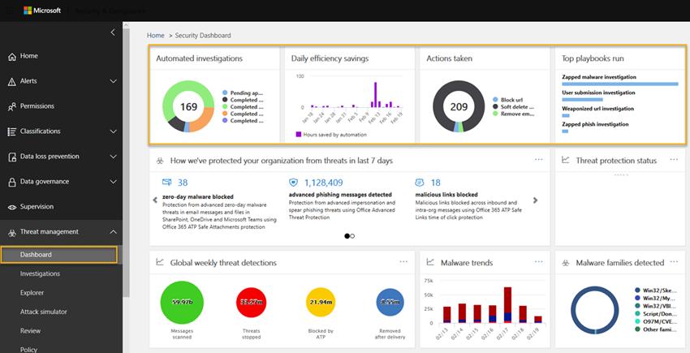

# Investigação e resposta automatizadas (AIR) com o Office 365

A investigação e a resposta automatizadas (AIR) (atualmente em visualização pública, como uma das muitas [funcionalidades de investigação e resposta contra ameaças do Office 365](office-365-ti.md)) permitem que você execute investigação e correção automatizadas para ameaças conhecidas que existem atualmente. Leia este artigo para obter uma visão geral do AIR e como ele pode ajudar sua organização e as equipes de operações de segurança a reduzir as ameaças de forma mais eficaz e eficiente. 

Para saber mais sobre quando os recursos do AIR estarão disponíveis, consulte o [Microsoft 365 Roadmap](https://www.microsoft.com/microsoft-365/roadmap).

## Alertas

Os [alertas](alert-policies.md#viewing-alerts) representam disparadores de fluxos de trabalho da equipe de operações de segurança para resposta a incidentes. Priorizar o conjunto certo de alertas para investigação e, ao mesmo tempo, garantir que nenhuma ameaça seja difícil. Quando as investigações nos alertas são realizadas manualmente, as equipes de operações de segurança devem procurar e correlacionar as entidades (por exemplo, conteúdo, dispositivos e usuários) em risco de ameaças. Essas tarefas e fluxos de trabalho são muito demorados e envolvem várias ferramentas e sistemas. Com o AIR, a investigação e a resposta são automatizadas nos alertas importantes de segurança e gerenciamento de ameaças que acionam os guias estratégicos de resposta de segurança automaticamente. 

Na versão inicial do AIR em abril de 2019, os alertas gerados a partir das seguintes políticas de alerta de eventos únicos serão investigados automaticamente. 

1. Um clique em URL potencialmente mal-intencionado foi detectado
2. Email relatado pelo usuário como Phish *
3. Mensagens de email contendo malware removidos após a entrega *
4. Mensagens de email que contêm URLs de phishing removidos após a entrega *

> [!NOTE]
> Esses alertas receberam uma severidade "informativa" nas respectivas políticas de alerta dentro do centro de conformidade & segurança com notificações por email desativadas. Eles podem ser ativados por meio da configuração da política de alerta.

Para exibir alertas, no centro de conformidade & segurança, escolha **alertas** > **exibir alertas**. Selecione um alerta para exibir seus detalhes e, em seguida, use o link **Exibir investigação** para ir para a [investigação](#investigation-graph)correspondente. Observe que os alertas informativos ficam ocultos no modo de exibição de alerta por padrão. Para vê-los, você precisa alterar a filtragem de alerta para incluir alertas informativos.

Se sua organização gerencia seus alertas de segurança por meio de um sistema de gerenciamento de alerta, sistema de gerenciamento de serviços ou informações de segurança e sistema de gerenciamento de eventos (SIEM), você pode enviar alertas do Office 365 para esse sistema por meio de [uma notificação por email ou via API de atividade de gerenciamento do Office 365](https://docs.microsoft.com/office/office-365-management-api/office-365-management-activity-api-reference). As notificações de alerta de investigação via email ou API incluirão links para acessar os alertas no centro de conformidade & segurança, permitindo que o administrador de segurança atribuído Navegue rapidamente para a investigação.

 

## Guias de segurança

Os guias de segurança são políticas de back-end que estão no coração da automação no Microsoft Threat Protection. Os guias estratégicos de segurança fornecidos no AIR são baseados em cenários comuns de segurança do mundo real. Um guia de segurança é iniciado automaticamente quando um alerta é disparado dentro da sua organização. Depois que o alerta é acionado, o manual associado é executado automaticamente. O guia estratégico executa uma investigação, examinando todos os metadados associados (incluindo mensagens de email, usuários, assuntos, remetentes, etc.). Com base nas conclusões do guia estratégico, o ar recomenda um conjunto de ações que a equipe de segurança de sua organização pode executar para controlar e reduzir a ameaça. 

Os guias de segurança que você receberá com o AIR são projetados para lidar com as ameaças mais frequentes que as organizações enfrentam hoje. Eles são baseados na entrada de operações de segurança e em equipes de resposta a incidentes, incluindo aqueles que ajudam a defender a Microsoft e seus ativos de clientes.

### Os guias de segurança estão distribuindo em fases

Como parte do AIR, os guias de segurança são implantados em fases

- **Fase 1 (abril de 2019)**: os guias estratégicos incluem recomendações para ações que os administradores de segurança revisam e aprovam. A fase 1 incluirá os seguintes guias estratégicos:
    - Mensagem de phishing relatada pelo usuário
    - URL clique em alterar veredicto 
    - Malware detectado após a entrega (malware ZAP)
    - O phishing detectou o post-Delivery ZAP (Phish ZAP)
    - Investigações de email manuais (usando o explorador de ameaças)

- **Fase 2 (segunda metade de 2019)**: vários guias estratégicos e melhorias de guias estratégicos, além da opção para que os administradores de segurança configurem os guias de segurança para realizar algumas ações automaticamente sem interação administrativa. 

### Os guias estratégicos incluem investigação e recomendações

Cada manual inclui: 
- uma investigação raiz, 
- etapas seguidas para identificar e correlacionar outras ameaças potenciais e 
- ações de correção de ameaças recomendadas.

Cada etapa de alto nível inclui muitas subetapas executadas para fornecer uma resposta detalhada, detalhada e exaustiva às ameaças.

## Exemplo: uma mensagem de phishing relatada pelo usuário inicia um guia estratégico de investigação

Quando um usuário em sua organização envia uma mensagem de email e o relata à Microsoft usando o [suplemento de mensagem de relatório para o Outlook ou o Outlook Web Access](enable-the-report-message-add-in.md), o relatório também é enviado ao seu sistema e fica visível no Explorer no modo de exibição relatado pelo usuário. Essa mensagem relatada pelo usuário agora dispara um alerta informativo baseado no sistema, que inicia automaticamente o guia estratégico de investigação.

Durante a fase de investigação de raiz, vários aspectos do email são avaliados. Entre eles:
- Uma determinação sobre o tipo de ameaça que ela pode ser;
- Quem o enviou;
- De onde o email foi enviado (infraestrutura de envio);
- Se outras instâncias do email foram entregues ou bloqueadas;
- Uma avaliação de nossos analistas;
- Se o email está associado a qualquer campanha conhecida;
- e muito mais.

Depois que a investigação raiz estiver concluída, o guia estratégico fornecerá uma lista de ações recomendadas a serem executadas no email original e entidades associadas a ela.
  
Em seguida, várias etapas de investigação e busca de ameaças são executadas:

- Mensagens de email semelhantes em outros clusters de email são pesquisadas.
- O sinal é compartilhado com outras plataformas, como [o Microsoft defender ATP](https://docs.microsoft.com/windows/security/threat-protection/microsoft-defender-atp/microsoft-defender-advanced-threat-protection).
- É possível determinar se qualquer usuário clicou por links mal-intencionados em mensagens de email suspeitas.
- Uma verificação é feita no Office 365 proteção do Exchange Online ([EOP](eop/exchange-online-protection-eop.md)) e no Office 365 Advanced Threat Protection ([ATP](office-365-atp.md)) para ver se há outras mensagens semelhantes relatadas pelos usuários.
- Uma verificação é feita para ver se um usuário foi comprometido. Esta verificação utiliza sinais no [Microsoft Cloud app Security](https://docs.microsoft.com/cloud-app-security) e no [Azure Active Directory](https://docs.microsoft.com/azure/active-directory), correlacionando qualquer anomalia de atividade do usuário relacionada. 

Durante a fase de caça, riscos e ameaças são atribuídos a várias etapas de busca. 

Correção é a fase final do guia estratégico. Durante esta fase, as etapas de correção são tomadas, com base nas fases de investigação e busca. 

## Exemplo: um administrador de segurança dispara uma investigação do explorador de ameaças

Além de investigações automáticas disparadas por um alerta, a equipe de operações de segurança da sua organização pode acionar uma investigação automática de um modo de exibição no [Explorador de ameaças](use-explorer-in-security-and-compliance.md).

Por exemplo, suponha que você está exibindo dados no Explorer sobre mensagens relatadas pelo usuário. Você pode selecionar um item na lista de resultados e, em seguida, clicar em **investigar**.

Como outro exemplo, suponha que você esteja exibindo dados sobre mensagens de email detectadas como contendo malware e que há várias mensagens de email detectadas como contendo malware. Você pode selecionar a guia **email** , selecionar uma ou mais mensagens de email e, em seguida, no menu **ações** , selecionar **investigar**. 

Semelhante aos guias estratégicos acionados por um alerta, as investigações automáticas disparadas de um modo de exibição no Explorer incluem uma investigação raiz, etapas para identificar e correlacionar ameaças e ações recomendadas para atenuar essas ameaças.

## Introdução

Para acessar suas investigações, como administrador global do Office 365, administrador de segurança ou leitor de segurança, vá para o centro de conformidade de[https://protection.office.com](https://protection.office.com)& de segurança () e entre. Em seguida, siga um destes procedimentos:

- No painel de navegação à esquerda, **** > vá para alertas**exibir alertas**, abra um dos alertas relacionados à investigação e, em seguida, clique no link **Exibir investigação** na parte inferior do submenu alerta. 

    ou

- No painel de navegação à esquerda, vá para**investigações**de **Gerenciamento** > de ameaças.

    ou

- Visite o painel de gerenciamento de ameaças (no centro de conformidade & segurança, vá para o**painel** **Gerenciamento** > de ameaças).

Seus widgets do AIR serão exibidos na parte superior do [painel de segurança](security-dashboard.md). Selecione um widget para começar.

Você também pode acessar uma investigação diretamente dos alertas relacionados.

### Investigações automatizadas

A página de investigações automatizadas mostra as investigações da organização e seus Estados atuais.

 
  
Você pode:
- Navegue diretamente para uma investigação (selecione uma **ID de investigação**).
- Aplicar filtros. Escolha um **tipo de investigação**, **intervalo de tempo**, **status**ou uma combinação desses.
- Exporte os dados para um arquivo CSV.

O status de investigação indica o progresso das análises e ações. À medida que a investigação é executada, o status mudará para indicar se as ameaças foram encontradas, bem como indicar se as ações foram aprovadas. 
- **Iniciando**: a investigação será enfileirada para começar em breve
- **Executando**: a investigação foi iniciada e está realizando a análise
- **Nenhuma ameaça encontrada**: a investigação concluiu a ' análise e nenhuma ameaça foi encontrada
- **Encerrado pelo sistema**: a investigação não foi fechada e expirou após 7 dias
- **Ação pendente**: a investigação encontrou ameaças com ações recomendadas
- **Ameaças encontradas**: a investigação encontrou ameaças, mas as ameaças não têm ações disponíveis no Air
- **Corrigido**: o investgation foi concluído e foi totalmente corrigido (todas as ações foram aprovadas)
- **Parcialmente corrigido**: a investigação concluída e algumas das ações recomendadas foram aprovadas
- **Encerrado pelo usuário**: um administrador terminou a investigação
- **Falha**: ocorreu um erro durante a investigação que impediu que ele chegasse em ameaças
- **Enfileirado por limitação**: a investigação está aguardando a análise devido às limitações de processamento do sistema (para proteger o desempenho do serviço)
- **Terminada pela limitação**: não foi possível concluir a investigação em tempo suficiente devido à investigação de limitações de processamento de volume e sistema. Você pode acionar novamente a investigação selecionando o email no Explorer e selecionando a ação investigar.

### Gráfico de investigação

Ao abrir uma investigação específica, você verá a página de gráfico de investigação. Esta página mostra todas as diferentes entidades: mensagens de email, usuários (e suas atividades) e dispositivos que foram investigados automaticamente como parte do alerta que foi acionado.

Você pode:
- Obtenha uma visão geral da investigação atual.
- Exibir um resumo da duração da investigação.
- Selecione um nó na visualização para exibir detalhes desse nó.
- Selecione uma guia na parte superior para exibir os detalhes dessa guia.

### Investigação de alerta

Na guia **alertas** de uma investigação, você pode ver alertas relevantes para a investigação. Os detalhes incluem o alerta que disparou a investigação e outros alertas, como entrada arriscada, download em massa, etc., que são correlacionados à investigação. A partir dessa página, um analista de segurança também pode exibir detalhes adicionais sobre alertas individuais.

Você pode:
- Obtenha uma visão geral do alerta de acionamento atual e de todos os alertas associados.
- Selecione um alerta na lista para abrir uma página de sobrevôo que mostre detalhes completos do alerta.

### Investigação de email

Na guia **email** de uma investigação, você pode ver todos os clusters de email identificados como parte da investigação. 

Dado o volume simples de email que os usuários de uma organização enviam e recebem, o processo de 
- agrupar mensagens de email com base em atributos semelhantes de um cabeçalho de mensagem, corpo, URL e anexos; 
- separar emails mal-intencionados do email em bom estado; e 
- executar ações em mensagens de email mal-intencionadas 

pode levar várias horas. Agora, o ar automatiza esse processo, poupando o tempo e esforço da equipe de segurança da sua organização. 

Dois tipos diferentes de clusters de email podem ser identificados durante a etapa de análise de email: clusters de similaridade e clusters de indicador. 
- Os clusters de similaridade são mensagens de email que contêm atributos de remetente e conteúdo semelhantes. Esses clusters são avaliados para conteúdo mal-intencionado com base nas descobertas de detecção originais. Os clusters de emails que contêm detecções mal intencionadas suficientes serão considerados mal-intencionados.
- Os clusters de indicadores são mensagens de email que contêm a mesma entidade de indicador (hash de arquivo ou URL) do email original. Quando a entidade de arquivo/URL original é identificada como mal-intencionada, o ar aplica o indicador veredicto a todo o cluster de mensagens de email contendo essa entidade. Como um arquivo identificado como malware significará que o cluster de mensagens de email que contém esse arquivo será tratado como mensagens de email de malware.

O objetivo do clustering é encontrar outras mensagens de email relacionadas enviadas pelo mesmo remetente como parte de um ataque ou uma campanha.

A guia **email** também mostrará os itens de email relacionados à investigação, como os detalhes de email relatados pelo usuário, o email original relatado, a (s) mensagem (ns) de email zapped devido a malware/phishing, etc.

A contagem de emails identificada na guia email representa atualmente a soma total de todas as mensagens de email exibidas na guia **email** . Como as mensagens de email estarão presentes em vários clusters, a contagem total real de mensagens de email identificadas (e afetadas por ações de correção) será a contagem de mensagens de email exclusivas em todos os clusters e emails dos destinatários originais enviadas. 

O Explorer e o AIR contam mensagens de email por destinatário, já que os locais de segurança verdicts, ações e entrega variam de acordo com cada destinatário. Assim, um email original enviado a três usuários contará como um total de três mensagens de email em vez de um email. Observação pode haver casos em que um email é contado duas ou mais vezes, uma vez que o email pode ter várias ações nela, pode haver várias cópias do email quando todas as ações ocorrerem. Por exemplo, um email de malware detectado na entrega pode resultar em um email bloqueado (em quarentena) e um email substituído (arquivo de ameaça substituído por um arquivo de aviso e, em seguida, entregue à caixa de correio do usuário). Como há, literalmente, duas cópias do email no sistema, elas podem ser contadas em contagens de cluster. 

As contagens de email são calculadas no momento da investigação e algumas contagens são recalculadas quando você abre submenus de investigação (com base em uma consulta subjacente). As contagens de email mostradas para os clusters de email na guia email e o valor de quantidade de email mostrado no submenu de cluster são calculados no momento da investigação. A contagem de emails mostrada na parte inferior da guia email do submenu de cluster, bem como a contagem de mensagens de email exibidas no Explorer, refletirá mensagens de email recebidas após a análise inicial da investigação. Portanto, um cluster de emails que mostra uma quantidade original de 10 mensagens de email mostraria uma lista de emails de 15 a 5 mensagens de email que chegam entre a fase de análise de investigação e quando o administrador revisa a investigação. Mostrar as duas contagens em modos de exibição diferentes é feito para indicar o impacto do email no momento da investigação e o impacto atual até o momento em que a correção é executada.

Por exemplo, considere o cenário a seguir. O primeiro cluster de três mensagens de email foi considerado como phishing. Outro cluster de mensagens semelhantes com o mesmo IP e assunto foi encontrado e considerado mal-intencionado, pois alguns deles foram identificados como phishing durante a detecção inicial. 

Você pode:
- Obtenha uma visão geral das ameaças e dos resultados de agrupamento atuais encontrados.
- Clique em uma entidade de cluster ou uma lista de ameaças para abrir uma página de saída que mostra os detalhes completos do alerta.
- Investigue mais o cluster de emails clicando no link "abrir no Explorer" na parte superior da guia "detalhes do cluster de emails"

* Observação: no contexto de email, você pode ver uma superfície de ameaça de anomalias de volume como parte da investigação. Uma anomalia de volume indica um pico em mensagens de email semelhantes em torno do tempo de evento de investigação em comparação aos prazos anteriores. Esse pico no tráfego de email com características semelhantes (por exemplo, domínio de assunto e remetente, semelhança de corpo e IP de remetente) é típico do início de campanhas ou ataques de email. No entanto, as campanhas de emails em massa, spam e legítimas normalmente compartilham essas características. As anomalias de volume representam uma possível ameaça e, portanto, podem ser menos graves em comparação às ameaças de malware ou phishing identificadas usando mecanismos antivírus, acionamento ou reputação mal-intencionados.

### Investigação de usuário

Na guia **usuários** , você pode ver todos os usuários identificados como parte da investigação. Os usuários serão exibidos na investigação quando houver um evento ou indicação de que o usuário pode ser afetado ou comprometido.

Por exemplo, na imagem a seguir, o AIR identificou indicadores de comprometimento e anomalias com base em uma nova regra de caixa de entrada que foi criada. Detalhes adicionais (evidência) da investigação estão disponíveis por meio de exibições detalhadas nesta guia. os indicadores de comprometimento e anomalias também podem incluir detecções de anomalias do [Microsoft Cloud app Security](https://docs.microsoft.com/cloud-app-security).

Você pode:
- Obtenha uma visão geral dos resultados do usuário identificados e dos riscos encontrados.
- Selecione um usuário para abrir uma página de sobrevôo que mostre os detalhes completos do alerta.

### Investigação de máquina

Na guia **computadores** , você pode ver todas as máquinas identificadas como parte da investigação. 

Como parte da investigação, o AIR correlaciona ameaças de email a dispositivos. Por exemplo, uma investigação passa um hash de arquivo mal-intencionado no [Microsoft defender ATP](https://docs.microsoft.com/windows/security/threat-protection/microsoft-defender-atp/microsoft-defender-advanced-threat-protection
) para investigar. Isso permite a investigação automatizada de máquinas relevantes para seus usuários, para ajudar a garantir que as ameaças sejam tratadas na nuvem e nos seus pontos de extremidade. 

Você pode:
- Obtenha uma visão geral das máquinas e ameaças atuais encontradas.
- Selecione uma máquina para abrir um modo de exibição que nas [investigações ATP do Microsoft](https://docs.microsoft.com/windows/security/threat-protection/microsoft-defender-atp/automated-investigations) defender relacionadas na central de segurança do Microsoft defender.

### Investigação de entidade

Na guia **entidades** , você pode ver todas as entidades identificadas como parte da investigação. 

Aqui, você pode ver as entidades investigadas e os detalhes dos tipos de entidades, como mensagens de email, clusters, endereços IP, usuários e muito mais. Você também pode ver quantas entidades foram analisadas e as ameaças que foram associadas a cada uma delas. 

Você pode:
- Obtenha uma visão geral das entidades e ameaças de investigação encontradas.
- Selecione uma entidade para abrir uma página de sobrevôo que mostre os detalhes relacionados da entidade.

### Log do guia estratégico

Na guia **log** , você pode ver todas as etapas do guia estratégico que ocorreram durante a investigação. O log captura um inventário completo de todas as ações concluídas pelos recursos de investigação automática do Office 365 como parte do ar. Ele fornece uma visão clara de todas as etapas executadas, incluindo a ação em si, uma descrição e a duração do real do início ao fim. 

Você pode:
- Obtenha uma visão geral das etapas do guia estratégico.
- Exportar os resultados para um arquivo CSV.
- Filtrar o modo de exibição.

### Ações recomendadas

Na guia **ações** , você pode ver todas as ações do guia estratégico que são recomendadas para correção após a conclusão da investigação. 

As ações capturam as etapas que a Microsoft recomenda que você faça no final de uma investigação. Você pode realizar ações de correção aqui selecionando uma ou mais ações. Clicar em **aprovar** permitirá que a correção seja iniciada. (As permissões apropriadas são necessárias-a função de ' pesquisa e limpeza ' é necessária para executar ações do Explorer e do AIR). Por exemplo, um leitor de segurança pode exibir ações, mas não aprová-las. Observação: não é necessário aprovar todas as ações. Se você não concordar com a ação recomendada ou sua organização não escolher determinados tipos de ações, então você poderá optar por **rejeitar** as ações ou simplesmente ignorá-las e não realizar qualquer ação. Aprovar e/ou rejeitar todas as ações permitirá que a investigação seja totalmente fechada, enquanto deixar algumas ações incompletas resultará na alteração do status de investigação para um estado parcialmente corrigido.

Você pode:
- Obtenha uma visão geral das ações recomendadas para o guia estratégico.
- Selecione uma única ação ou várias ações.
- Aprovar ou rejeitar ações recomendadas com comentários.
- Exportar os resultados para um arquivo CSV.
- Filtrar o modo de exibição.

## Como obter o AIR

No momento, os recursos do Office 365 AIR estão em visualização. Quando estiver disponível em geral, os recursos do Office 365 AIR serão incluídos nas seguintes assinaturas:

- Microsoft 365 Enterprise E5
- Office 365 Enterprise E5
- Proteção contra ameaças da Microsoft
- Office 365 plano avançado de proteção contra ameaças 2

Para saber mais sobre a disponibilidade de recursos, visite o [Microsoft 365 Roadmap](https://www.microsoft.com/microsoft-365/roadmap).
