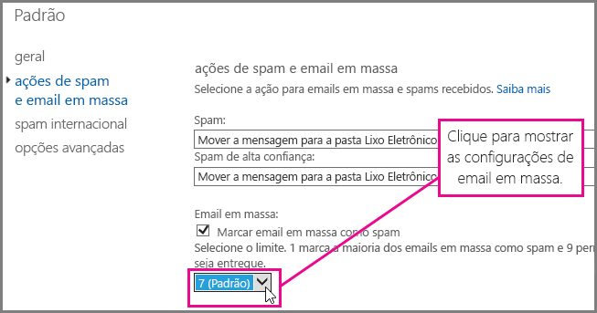
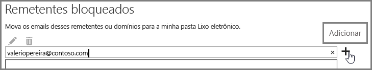

# <a name="block-email-spam-with-the-office-365-spam-filter-to-prevent-false-negative-issues"></a><span data-ttu-id="9edf8-105">Bloquear spam de email com o filtro de spam do Office 365 para evitar problemas de falsos negativos</span><span class="sxs-lookup"><span data-stu-id="9edf8-105">Block email spam with the Office 365 spam filter to prevent false negative issues</span></span>

<span data-ttu-id="9edf8-p101">O EOP (Proteção do Exchange Online) é um serviço de filtragem de email baseado na nuvem que ajuda a proteger sua organização contra spam e malware. Se você tem caixas de correio no Office 365, elas já estão protegidas pelo EOP por padrão.</span><span class="sxs-lookup"><span data-stu-id="9edf8-p101">Exchange Online Protection (EOP) is a cloud-based email filtering service that helps protect your organization against spam and malware. If you have mailboxes in Office 365, they are already protected by default with EOP.</span></span> 
  
<span data-ttu-id="9edf8-p102">Você pode ajudar a garantir o bloqueio de spam e lixo eletrônico ajustando o filtro de spam do Office 365. Isso ajuda na prevenção de problemas de falso negativo, em que o spam chega à caixa de entrada do usuário. Como administrador do Exchange Online ou do EOP (Proteção do Exchange Online), use as etapas a seguir para ajustar o filtro antispam do Office 365 e impedir a entrega de spam nas caixas de entrada dos usuários.</span><span class="sxs-lookup"><span data-stu-id="9edf8-p102">You can help to ensure spam and junk messages are blocked by adjusting your Office 365 spam filter. This helps to prevent the false negative issue, where email spam is allowed through to a user inbox. As an Exchange Online or Exchange Online Protection (EOP) administrator, use the following steps to adjust your Office 365 anti-spam filter and help prevent spam from being delivered to your user's inboxes.</span></span>
  
## <a name="customize-the-office-365-anti-spam-filter-with-these-settings"></a><span data-ttu-id="9edf8-111">Personalizar o filtro antispam do Office 365 com estas configurações</span><span class="sxs-lookup"><span data-stu-id="9edf8-111">Customize the Office 365 anti-spam filter with these settings</span></span>

<span data-ttu-id="9edf8-p103">O administrador pode usar várias configurações de filtro de spam do Office 365 para ajudar a impedir o envio de spam para a caixa de entrada de um usuário. Use as opções listadas aqui para melhorar o filtro de spam do Office 365 e evitar mensagens de falso negativo. Nesse contexto, um falso negativo se refere a mensagens de spam ou lixo eletrônico enviadas para a caixa de entrada de um usuário.</span><span class="sxs-lookup"><span data-stu-id="9edf8-p103">An Admin can use several Office 365 spam filter settings to help prevent email spam from being sent to a user inbox. The Office 365 spam filter will become better able to block email spam and prevent false negative messages if you use the options listed here. In this context, a false negative refers to email spam or junk messages that are getting sent to a user inbox.</span></span>
  
### <a name="block-ip-addresses-with-a-connection-filter"></a><span data-ttu-id="9edf8-115">Bloquear um endereço IP com um filtro de conexão</span><span class="sxs-lookup"><span data-stu-id="9edf8-115">Block IP addresses with a connection filter</span></span>

<span data-ttu-id="9edf8-116">Personalize o filtro de spam do Office 365 adicionando o endereço IP do remetente à lista de bloqueio de IP do filtro de conexão:</span><span class="sxs-lookup"><span data-stu-id="9edf8-116">Customize your Office 365 spam filter by adding the sender IP address to the connection filter IP block list:</span></span>
  
1. <span data-ttu-id="9edf8-117">Obtenha os cabeçalhos da mensagem que você deseja bloquear no cliente de email, como Outlook ou Outlook na Web (anteriormente conhecido como Outlook Web App), conforme descrito em analisador de [cabeçalho de mensagem](https://go.microsoft.com/fwlink/p/?LinkId=306583).</span><span class="sxs-lookup"><span data-stu-id="9edf8-117">Obtain the headers for the message you want to block in your mail client such as Outlook or Outlook on the web (formerly known as Outlook Web App), as described in [Message Header Analyzer](https://go.microsoft.com/fwlink/p/?LinkId=306583).</span></span>
    
2. <span data-ttu-id="9edf8-118">Procure o endereço IP após a marca CIP no cabeçalho X-Forefront-Antispam-Report usando o [Analisador de cabeçalho de mensagem](https://testconnectivity.microsoft.com/?tabid=mha) ou manualmente.</span><span class="sxs-lookup"><span data-stu-id="9edf8-118">Search for the IP address following the CIP tag in the X-Forefront-Antispam-Report header using the [message header analyzer](https://testconnectivity.microsoft.com/?tabid=mha) or manually.</span></span> 
    
3. <span data-ttu-id="9edf8-119">Adicione o endereço IP à Lista de IP Bloqueados executando as etapas em "Usar o EAC para editar a política de filtro de conexão padrão" em [Configurar a política de filtro de conexão](https://technet.microsoft.com/en-us/library/jj200718%28v=exchg.150%29.aspx).</span><span class="sxs-lookup"><span data-stu-id="9edf8-119">Add the IP address to the IP Block list by following the steps in "Use the EAC to edit the default connection filter policy" in [Configure the Connection Filter Policy](https://technet.microsoft.com/en-us/library/jj200718%28v=exchg.150%29.aspx).</span></span>
    
### <a name="block-bulk-mail-with-transport-rules-or-the-spam-filter"></a><span data-ttu-id="9edf8-120">Bloquear emails em massa com regras de transporte ou filtro de spam</span><span class="sxs-lookup"><span data-stu-id="9edf8-120">Block bulk mail with transport rules or the spam filter</span></span>

<span data-ttu-id="9edf8-p104">O spam é, em grande parte, emails em massa, por exemplo, boletins informativos ou promoções. Personalize o filtro de spam no Office 365 se você [Usar regras de transporte para filtrar rigorosamente as mensagens de email em massa](https://technet.microsoft.com/en-us/library/dn720438%28v=exchg.150%29.aspx) ou ative a configuração de **Emails em massa** nas [Opções Avançadas de Filtragem de Spam](https://technet.microsoft.com/en-us/library/jj200750%28v=exchg.150%29.aspx) em seu filtro de spam. No Centro de administração do Exchange, comece clicando em **Proteção** \> **Filtro de conteúdo** e, em seguida, clique duas vezes para filtrar a política que você deseja ajustar. Clique em **Ações para spam e emails em massa** para ajustar as configurações, conforme mostrado aqui.</span><span class="sxs-lookup"><span data-stu-id="9edf8-p104">Is the spam primarily bulk mail, for example, newsletters or promotions? You can customize the spam filter in Office 365 if you [Use transport rules to aggressively filter bulk email messages](https://technet.microsoft.com/en-us/library/dn720438%28v=exchg.150%29.aspx) or turn on the **Bulk mail** setting in your spam filter's [Advanced Spam Filtering Options](https://technet.microsoft.com/en-us/library/jj200750%28v=exchg.150%29.aspx). In the Exchange Admin center, get started by clicking **Protection** \> **Content filter** and then double click the filter policy you want to adjust. Click **Spam and bulk mail actions** to adjust the settings, as shown here.</span></span> 
  

  
### <a name="block-email-spam-using-spam-filter-block-lists"></a><span data-ttu-id="9edf8-126">Bloquear spam usando listas de bloqueio de filtro de spam</span><span class="sxs-lookup"><span data-stu-id="9edf8-126">Block email spam using spam filter block lists</span></span>

<span data-ttu-id="9edf8-p105">[Configure suas políticas de filtro de spam](https://technet.microsoft.com/en-us/library/jj200684%28v=exchg.150%29.aspx) para adicionar o endereço do remetente à lista de bloqueio de remetentes ou seu domínio à lista de bloqueio de domínios no filtro de spam. Os emails de um remetente ou domínio em uma lista de bloqueio de filtro de spam serão marcados como spam.</span><span class="sxs-lookup"><span data-stu-id="9edf8-p105">[Configure your spam filter policies](https://technet.microsoft.com/en-us/library/jj200684%28v=exchg.150%29.aspx) to add the sender address to the sender block list or domain to the domain block list in the spam filter. Emails from a sender or domain on a spam filter block list will marked as spam.</span></span> 
  
### <a name="advanced-spam-filtering-options"></a><span data-ttu-id="9edf8-129">Opções avançadas de filtragem de spam</span><span class="sxs-lookup"><span data-stu-id="9edf8-129">Advanced spam filtering options</span></span>

<span data-ttu-id="9edf8-130">[Configure suas políticas de filtro de spam](https://technet.microsoft.com/en-us/library/jj200684%28v=exchg.150%29.aspx) e ative outras [Opções Avançadas de Filtragem de Spam](https://technet.microsoft.com/en-us/library/jj200750%28v=exchg.150%29.aspx).</span><span class="sxs-lookup"><span data-stu-id="9edf8-130">[Configure your spam filter policies](https://technet.microsoft.com/en-us/library/jj200684%28v=exchg.150%29.aspx) and turn on additional [Advanced Spam Filtering Options](https://technet.microsoft.com/en-us/library/jj200750%28v=exchg.150%29.aspx).</span></span>
  
<span data-ttu-id="9edf8-p106">Para saber mais sobre configurações de spam que se aplicam a toda a organização, consulte [Impedir falsos positivos marcados como spam usando uma lista confiável ou outras técnicas](prevent-email-from-being-marked-as-spam-0.md). Isso é útil se você tem controle no nível de administrador e quer impedir falsos positivos.</span><span class="sxs-lookup"><span data-stu-id="9edf8-p106">For more spam settings that apply to the whole organization, take a look at [Prevent false positive email marked as spam with a safelist or other techniques](prevent-email-from-being-marked-as-spam-0.md). This is helpful if you have administrator-level control and you want to prevent false positives.</span></span>
  
## <a name="email-users-can-also-help-ensure-that-false-negative-and-email-spam-is-blocked-with-office-365-spam-filter"></a><span data-ttu-id="9edf8-133">Os usuários de email também podem ajudar a garantir que os falsos negativos e spams sejam bloqueados com o filtro de spam do Office 365</span><span class="sxs-lookup"><span data-stu-id="9edf8-133">Email users can also help ensure that false negative and email spam is blocked with Office 365 spam filter</span></span>

<span data-ttu-id="9edf8-p107">Ele ajudará seus esforços antispam do Office 365 a evitar falsos negativos e lixo eletrônico se você disser aos usuários para adicionar o endereço de remetente de spam à lista de remetentes bloqueados no [Outlook](https://go.microsoft.com/fwlink/p/?LinkId=270065) ou [no Outlook na Web](https://go.microsoft.com/fwlink/p/?LinkId=294862). No Outlook na Web, comece clicando em **Opções** \> de **configurações** \> **bloquear ou permitir**e, em seguida, adicionar o endereço à lista de **remetentes bloqueados** , conforme mostrado aqui.</span><span class="sxs-lookup"><span data-stu-id="9edf8-p107">It will help your Office 365 anti-spam efforts to prevent false negatives and junk mail if you tell your users to add the spam sender address to their blocked sender list in [Outlook](https://go.microsoft.com/fwlink/p/?LinkId=270065) or [Outlook on the web](https://go.microsoft.com/fwlink/p/?LinkId=294862). In Outlook on the web, get started by clicking **Settings** \> **Options** \> **Block or allow**, and then adding the address to the **Blocked senders** list, as shown here.</span></span> 
  

  
> [!NOTE]
> <span data-ttu-id="9edf8-137">Para saber mais sobre a lista de remetentes seguros, consulte [Perguntas frequentes sobre Remetente confiável e Listas de Remetentes Bloqueados](https://technet.microsoft.com/en-us/library/dn133608%28v=exchg.150%29.aspx).</span><span class="sxs-lookup"><span data-stu-id="9edf8-137">For more detailed information about safe sender lists, see [Safe Sender and Blocked Sender Lists FAQ](https://technet.microsoft.com/en-us/library/dn133608%28v=exchg.150%29.aspx).</span></span> 
  
<span data-ttu-id="9edf8-p108">Os parágrafos anteriores desta subseção aplicam-se somente aos clientes que usam o EOP como serviço para proteger sistemas de email locais, ou como parte de uma implantação híbrida de email. Saiba mais sobre o EOP na [Página inicial da Proteção do Exchange Online](https://products.office.com/en-us/exchange/exchange-email-security-spam-protection).</span><span class="sxs-lookup"><span data-stu-id="9edf8-p108">The previous paragraphs in this subsection applies only to customers who use EOP as service to protect on-premises email systems or as part of a hybrid email deployment. Learn more about EOP at the [Exchange Online Protection home page](https://products.office.com/en-us/exchange/exchange-email-security-spam-protection).</span></span>
  
## <a name="eop-only-customers-set-up-the-office-365-spam-filter-to-block-email-spam"></a><span data-ttu-id="9edf8-140">Clientes somente de EOP: configurar o filtro de spam do Office 365 para bloquear spam</span><span class="sxs-lookup"><span data-stu-id="9edf8-140">EOP-only customers: Set up the Office 365 spam filter to block email spam</span></span>

<span data-ttu-id="9edf8-p109">Para clientes somente de EOP com caixas de correio locais: se você configurar um filtro de spam para a ação padrão "Mover a mensagem para a pasta Lixo Eletrônico", execute as etapas necessárias fornecidas em "Garantir que o spam seja direcionado para a pasta Lixo Eletrônico de cada usuário". Tentamos facilitar isso fornecendo os comandos do Shell de Gerenciamento do Exchange em um tópico separado, além de um link para saber mais sobre como começar a usar o shell.</span><span class="sxs-lookup"><span data-stu-id="9edf8-p109">For EOP-only customers with on-premises mailboxes: If you setup a spam filter for the default action, Move message to Junk Email folder, follow the required steps provided in Ensure that spam is routed to each user's Junk Email folder. We've tried to make this easy by providing the Exchange Management Shell commands in a separate topic, as well as a link to more general information about how to get started with the shell.</span></span>
  
<span data-ttu-id="9edf8-p110">Isso o ajudará a evitar os emails marcados incorretamente como spam se você sincronizar as configurações de usuário com o serviço por meio da sincronização de diretórios, a fim de garantir que os remetentes bloqueados sejam respeitados. Para saber mais, consulte "Usar a sincronização de diretórios para gerenciar usuários de email" em Gerenciar usuários de email no EOP.</span><span class="sxs-lookup"><span data-stu-id="9edf8-p110">It will help you to avoid false negative email spam if you sync user settings with the service via directory synchronization to ensure that your blocked senders are respected. For more information, see "Use directory synchronization to manage mail users" in Manage mail users in EOP.</span></span>
  
## <a name="eop-only-customers-who-are-not-using-directory-synchronization"></a><span data-ttu-id="9edf8-145">Clientes somente de EOP que não estão usando a sincronização de diretórios</span><span class="sxs-lookup"><span data-stu-id="9edf8-145">EOP-only customers who are not using directory synchronization</span></span>

<span data-ttu-id="9edf8-p111">O serviço do EOP foi projetado para respeitar os remetentes confiáveis e bloqueados do usuário, se as informações tiverem sido compartilhadas com o serviço. Se você é um cliente de EOP que usa o Outlook, mas não tem a sincronização de diretórios configurada para sincronizar seus usuários no Office 365, ainda é possível impedir a entrega das mensagens na caixa de entrada dos usuários usando remetentes bloqueados. No entanto, talvez seja necessário configurar algumas regras de fluxo de email do Exchange nas seguintes situações:</span><span class="sxs-lookup"><span data-stu-id="9edf8-p111">The EOP service is designed to honor the user's safe and blocked senders, if the information has been shared with the service. If you are an EOP customer using Outlook, but do not have Directory Synchronization configured to sync your users to Office 365, you can still stop messages from being delivered to your users' inbox using blocked senders. However, you may have to set up some Exchange mail flow rules in the following situations:</span></span>
  
- <span data-ttu-id="9edf8-149">Se uma mensagem passar pela filtragem de spam normal no EOP e, em seguida, for entregue a um servidor local do Exchange e o EOP atribuir um veredito de spam SCL 1-4 (não spam), a lista local de remetentes bloqueados dos usuários substituirá o veredito do filtro de spam do EOP e a entregará à sua pasta Lixo Eletrônico.</span><span class="sxs-lookup"><span data-stu-id="9edf8-149">If a message goes through regular spam filtering through EOP and then is delivered to a local on-premises Exchange server, and EOP assigns a spam verdict of SCL 1-4 (non-spam), then your users' local blocked senders list will override the EOP spam filter verdict and deliver it to their junk email folder.</span></span>
    
- <span data-ttu-id="9edf8-p112">Se uma mensagem no EOP recebe um SCL -1 de uma regra de fluxo de email do Exchange, ou porque o endereço IP ou domínio está em sua lista de permissões, o SCL será propagado para o servidor local do Exchange usando conectores. Nesse caso, a lista de remetentes bloqueados do usuário não será aplicada. Para alterar isso, crie uma regra de fluxo de email local que define o SCL como 0. Isso fará com que o Outlook aplique a lista de remetentes bloqueados do local do usuário.</span><span class="sxs-lookup"><span data-stu-id="9edf8-p112">If a message in EOP is assigned SCL -1 by an Exchange mail flow rule or because the IP address or domain is in your allow list, the SCL is propagated to the on-premises Exchange server using connectors. In this case, your user's blocked senders list will not be enforced. To change this, you can create a local mail flow rule that sets the SCL to 0. This will cause Outlook to enforce your user's local blocked senders list.</span></span>
    
<span data-ttu-id="9edf8-154">**Para configurar uma regra de fluxo de email a fim de impedir que as mensagens sejam entregues na caixa de entrada dos usuários usando a lista de remetentes bloqueados**</span><span class="sxs-lookup"><span data-stu-id="9edf8-154">**To set up a mail flow rule to stop messages from being delivered to your users' inbox by using the blocked senders list**</span></span>
  
1. <span data-ttu-id="9edf8-p113">Abra o Shell de Gerenciamento do Exchange em seu servidor local. Para saber como abrir o Shell em sua organização local do Exchange, consulte [Abrir o Shell de Gerenciamento do Exchange](https://technet.microsoft.com/library/dd638134%28v=exchg.160%29.aspx).</span><span class="sxs-lookup"><span data-stu-id="9edf8-p113">Open the Exchange Management Shell on your on-premises server. To learn how to open the Shell in your on-premises Exchange organization, see [Open the Exchange Management Shell](https://technet.microsoft.com/library/dd638134%28v=exchg.160%29.aspx).</span></span>
    
2. <span data-ttu-id="9edf8-157">Execute o comando a seguir para encaminhar mensagens de spam com conteúdo filtrado para a pasta Lixo Eletrônico a fim de atualizar o SCL em toda mensagem marcada com SCL -1:</span><span class="sxs-lookup"><span data-stu-id="9edf8-157">Run the following command to route content-filtered spam messages to the Junk Email folder in order to update the SCL on every message that was marked with SCL -1:</span></span>
    
  ```
  New-TransportRule "NameForRule" -HeaderContainsMessageHeader "X-Forefront-Antispam-Report" -HeaderContainsWords "SCL:-1" -SetSCL 0
  ```

    <span data-ttu-id="9edf8-p114">Como o SCL é 0 em seu servidor local do Exchange, mensagens marcadas como não sendo spam serão entregues às caixas de entrada dos usuários, mas ainda poderão ser enviadas para o lixo eletrônico pela lista de remetentes bloqueados local dos usuários. Se você estiver usando a quarentena de spam no EOP, ainda será possível que os remetentes na lista de confiança do usuário sejam identificados como spam e enviados para quarentena. Se você estiver usando a pasta Lixo Eletrônico na caixa de correio local, isso permitirá a entrega de mensagens de remetentes confiáveis na Caixa de Entrada.</span><span class="sxs-lookup"><span data-stu-id="9edf8-p114">Because the SCL is 0 in your on-premises Exchange server, non-spam will be delivered to your users' inboxes but still allow for users' local blocked senders list to send them to junk email. If you are using spam quarantine in EOP, it is still possible that senders who are on your user's safe list will be identified as spam and sent to quarantine. If you are using the Junk Mail Folder in your local mailbox, however, this will allow delivery to the Inbox for safe senders.</span></span>

> [!WARNING]
> <span data-ttu-id="9edf8-p115">Se você usar uma regra de fluxo de email para alterar o valor do SCL para 0 (ou para qualquer valor diferente de -1), todas as opções de lixo eletrônico do Outlook serão aplicadas à mensagem. Isso significa que as listas confiáveis e bloqueadas serão cumpridas, mas também significa que as mensagens que não têm endereços nas listas bloqueadas ou confiáveis serão possivelmente marcadas como lixo eletrônico pelo processamento do filtro de lixo eletrônico no lado do cliente. Se você quiser que o Outlook processe as listas bloqueadas e confiáveis, mas não use o filtro de lixo eletrônico no lado do cliente, defina a opção "Sem Filtragem Automática" nas Opções de Lixo Eletrônico do Outlook. "Sem Filtragem Automática" é a opção padrão nas versões mais recentes do Outlook, mas você deve confirmar se essa configuração está presente, a fim de garantir que o filtro de lixo eletrônico do lado do cliente não seja aplicado às mensagens. Como administrador, você pode impor a desativação da filtragem de Lixo Eletrônico do Outlook seguindo as instruções em [Outlook: configuração de política para desativar a IU de lixo eletrônico e o mecanismo de filtragem](https://support.microsoft.com/en-us/kb/2180568).</span><span class="sxs-lookup"><span data-stu-id="9edf8-p115">If you use a mail flow rule to change the SCL value to 0 (or any value other than -1), then all of the Outlook junk mail options will apply to the message. This means that blocked and safe lists will be honored, but also means that messages that do not have addresses from the blocked or safe lists will potentially be marked as junk by the client side junk mail filter processing. If you want to have Outlook process the blocked and safe lists, but not use the client side junk mail filter, you must set the option to "No Automatic Filtering" in Outlook Junk Mail Options. "No Automatic Filtering" is the default option in the latest versions of Outlook, but you should confirm that the this setting is in place to ensure the client side junk mail filter is not applied to the messages. As an administrator, you can enforce disabling the Outlook Junk Email filtering by following the instructions in [Outlook: Policy setting to disable the Junk E-mail UI and filtering mechanism](https://support.microsoft.com/en-us/kb/2180568).</span></span>
  
## <a name="see-also"></a><span data-ttu-id="9edf8-166">Confira também</span><span class="sxs-lookup"><span data-stu-id="9edf8-166">See Also</span></span>

[<span data-ttu-id="9edf8-167">Proteção anti-spam de emails do Office 365</span><span class="sxs-lookup"><span data-stu-id="9edf8-167">Office 365 Email Anti-Spam Protection</span></span>](anti-spam-protection.md)
  
[<span data-ttu-id="9edf8-168">Impedir falsos positivos marcados como spam usando uma lista confiável ou outras técnicas</span><span class="sxs-lookup"><span data-stu-id="9edf8-168">Prevent false positive email marked as spam with a safelist or other techniques</span></span>](prevent-email-from-being-marked-as-spam-0.md)
  

