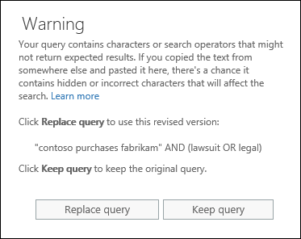

# Verificar sua consulta de Pesquisa de Conteúdo para erros

Quando você cria ou editar uma pesquisa de conteúdo, você pode ter o Office 365 verificar sua consulta para caracteres não suportados e operadores booleanos que não podem estar em letras maiusculas. Como? Basta clicar em **Verificar a consulta para erros de digitação** na página consulta de uma pesquisa de conteúdo. 
  

  
Aqui está uma lista dos caracteres não suportados que verificamos. Não há suporte para caracteres geralmente estão ocultos e geralmente causar um erro de pesquisa ou retornar resultados inesperados.
  
- **Aspas inglesas** - single e double aspas inglesas (também chamadas de aspas inglesas) não são suportados. Somente as aspas normais pode ser usadas em uma consulta de pesquisa. 
    
- **Caracteres não imprimíveis e controle** - não imprimíveis e caracteres de controle não representam um símbolo escrito, como um caractere alfanumérico. Exemplos de não-imprimíveis e caracteres de controle incluem caracteres que formatar texto ou em linhas separadas de texto. 
    
- **Marca da esquerda para a direita e da direita para a esquerda** - esses são usados para indicar a direção do texto para a esquerda para a direita (por exemplo, inglês e espanhol) e idiomas da direita para a esquerda (por exemplo, árabe e hebraico) de caracteres de controle.
    
- **Operadores booleanos minúsculo** - se você usar um operador booleano, como **e**, **ou**e **não** em uma consulta de pesquisa, ela deve ser letras maiusculas. Quando verificamos uma consulta para erros de digitação, a sintaxe de consulta frequentemente indicará que um operador booleano está sendo usado, mesmo que poderiam ser usadas operadores minúsculas; Por exemplo, `(WordA or WordB) and (WordC or WordD)`.
    
## O que acontece se uma consulta tiver um caractere sem suporte?

Se não há suporte para caracteres forem encontradas em sua consulta, aviso será exibida uma mensagem que informa que não há suporte para caracteres encontrados e um sugere uma alternativa. Em seguida, em seguida, você tem a opção mantenha a consulta original ou substituí-la com a consulta revisada sugerida. Aqui está um exemplo de mensagem de aviso é exibido após você clicar em **Verificar a consulta para erros de digitação** para a consulta de pesquisa a captura de tela anterior. Observe que a consulta original contém aspas inglesas e operadores booleanos minúsculos. 
  

  
## Como impedir que os caracteres não suportados em suas consultas de pesquisa

Não há suporte para caracteres normalmente são adicionados a uma consulta quando você copia a consulta ou partes da consulta de outros aplicativos (por exemplo, Microsoft Word ou Microsoft Excel) e copiá-los para a caixa de palavra-chave na página consulta de uma pesquisa de conteúdo. Basta digitar a consulta na caixa de palavra-chave é a melhor maneira de impedir que os caracteres não suportados. Como alternativa, você pode copiar uma consulta do Word ou Excel e colá-lo no arquivo em um editor de texto sem formatação, como o Microsoft Notepad. Em seguida, salve o arquivo de texto e selecione **ANSI** na lista suspensa **codificação** . Isto irá remover quaisquer caracteres não suportados e formatação. Você pode, em seguida, copie e cole a consulta do arquivo de texto para a caixa de consulta de palavra-chave. 
