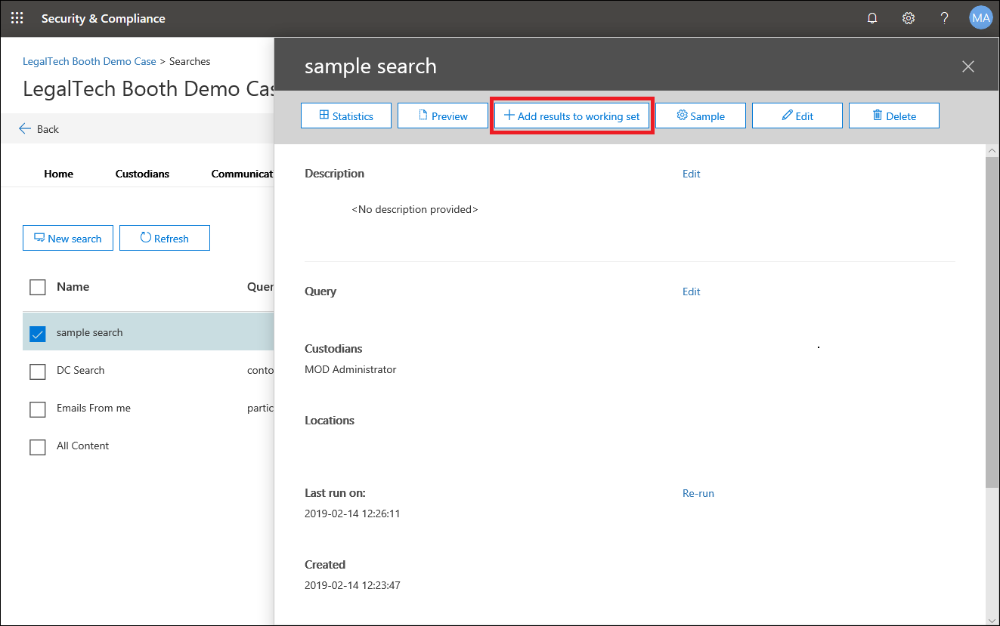
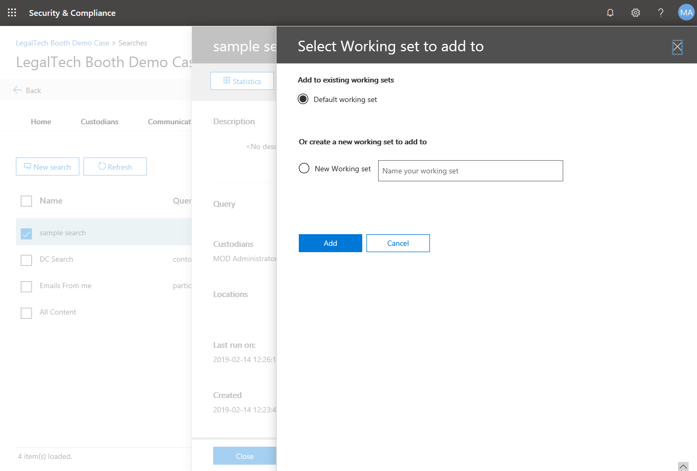

# Adicionar resultados de pesquisa a um conjunto de revisãoAdd search results to a review set

Quando estiver satisfeito com os resultados de uma pesquisa e estiver pronto para revisar e analisar os resultados da pesquisa, você poderá adicioná-los a uma análise definida no caso.When you're satisfied with the results of a search and you're ready to review and analyze those search results, you can add them to a review set in the case. Copiar os dados originais para o conjunto de revisão também facilita o processo de revisão e análise fornecendo ferramentas avançadas de análise, como detecção de temas, detecção de duplicidade próxima e identificação de thread de email.Copying the original data to the review set also facilitates the review and analysis process by providing you with advanced analytics tools such as themes detection, near-duplicate detection, and email thread identification. Também é possível adicionar dados de fontes de dados que não sejam do Office 365 a um conjunto de revisão para que você possa revisar os dados além dos dados coletados do Office 365.You can also add data from non-Office 365 data sources to a review set so that you can review that data in addition to the data you collect from Office 365.

Quando você adiciona os resultados de uma pesquisa a um conjunto de revisão (os conjuntos de revisão estão na guia **conjuntos de revisão** do caso), ocorrem as seguintes coisas:When you add the results of a search to a review set (review sets are on the **Review sets** tab of the case), the following things occur:

- A pesquisa é executada novamente.The search is run again. Isso significa que os resultados de pesquisa reais copiados para o conjunto de revisão podem ser diferentes dos resultados estimados que foram retornados quando a pesquisa foi executada pela última vez.This means the actual search results copied to the review set may be different than the estimated results that were returned when the search was last run.

- Todos os itens nos resultados da pesquisa são copiados da fonte de dados original nos serviços do Live Office 365 e copiados para um local seguro de armazenamento do Azure na nuvem da Microsoft.All items in the search results are copied from the original data source in the live Office 365 services, and copied to a secure Azure storage location in the Microsoft cloud.

- Todos os itens (incluindo o conteúdo e os metadados) são reindexados para que todos os dados no conjunto de revisão sejam totalmente pesquisáveis durante a revisão dos dados de caso.All items (including the content and metadata) are re-indexed so that all data in the review set is fully searchable during the review of the case data. A indexação dos resultados dos dados em pesquisas abrangentes e muito rápidas quando você pesquisa os dados na revisão definida durante a investigação do caso.Re-indexing the data results in thorough and very fast searches when you search the data in the review set during the case investigation.

Para adicionar dados a um conjunto de revisão, clique em uma pesquisa na guia **pesquisas** e, em seguida, clique em **Adicionar resultados para revisão definida** na página do menu suspenso.To add data to a review set, click a search on the **Searches** tab, and then click **Add results to review set** on the flyout page.

Você pode adicionar a um conjunto de revisão existente ou criar um novo conjunto de revisão.You can add to an existing review set or create a new review set.  Se estiver adicionando a um novo conjunto de revisão, especifique o nome e clique em **Adicionar**.If adding to a new review set, specify the name and then click **Add**.

A adição de dados a um conjunto de revisão é um processo de execução demorada.Adding data to a review set is a long-running process. Esse processo inclui a coleta de itens das fontes de dados originais no Office 365 (por exemplo, de caixas de correio e sites), copiando-os para o local de armazenamento do Azure (esse processo de cópia também é chamado de *inclusão*) e, em seguida, indexando novamente os itens.This process includes gathering items from the original data sources in Office 365 (for example, from mailboxes and sites), copying them to the Azure storage location (this copying process is also called *ingestion*), and then re-indexing the items. Você pode acompanhar o progresso na guia **trabalhos** ou na guia **pesquisas** monitorando o status na coluna **Adicionar dados para revisão** .You can track the progress on the **Jobs** tab or on the **Searches** tab by monitoring the status in the **Added data to review set** column. Depois que o processamento do conjunto de revisão estiver concluído, clique na guia revisar **conjuntos** no caso e clique no conjunto de revisão para iniciar o processo de filtragem, revisão, marcação e exportação de dados no conjunto de revisão.After the review set processing is completed, click the **Review sets** tab in the case, and click the review set to start the process of filtering, reviewing, tagging, and exporting data in the review set.

## Adicionar um exemplo a um conjunto de revisãoAdd a sample to a review set

Se você quiser validar os resultados de uma pesquisa com mais detalhes antes de adicionar todos eles a um conjunto de revisão, você pode adicionar um exemplo dos resultados da pesquisa a um conjunto de revisão, em vez de adicionar tudo.If you want to validate the results of a search more thoroughly before adding all of them to a review set, you can add a sample of the search results to a review set instead of adding everything.

Para adicionar um exemplo a um conjunto de revisão, clique em uma pesquisa na guia **pesquisas** e clique em **amostra** na página do menu suspenso.To add a sample to a review set, click a search on the **Searches** tab and click **Sample** on the flyout page. Na página **parâmetros de amostragem** , escolha uma das seguintes opções:On the **Sampling parameters** page, choose one of the following options:

- **Nível de confiança%** e **intervalo de confiança%** – os itens adicionados ao conjunto de revisão serão determinados pelos parâmetros estatísticos que você definir.**Confidence level %** and **Confidence interval %** – The items added to the review set will be determined by the statistical parameters that you set. Se você costuma usar um nível de confiança e um intervalo ao obter resultados de amostragem, especifique-os nas caixas suspensas.If you typically use a confidence level and interval when sampling results, specify them in the drop-down boxes. Caso contrário, use as configurações padrão.Otherwise, use the default settings.

- **Amostra aleatória%** – os itens adicionados ao conjunto de revisão são baseados em uma seleção aleatória do percentual especificado do número total de itens retornados pela pesquisa.**Random sample %** – The items added to the review set is based on a random selection of the specified percentage of the total number of items returned by the search.

Após selecionar e configurar uma das opções anteriores, escolha um conjunto de revisão para adicionar o exemplo a e clique em **Enviar**.After selecting and configuring one of the previous options, choose a review set to add the sample to and then click **Send**. Novamente, você pode acompanhar o progresso na guia **trabalhos** ou na guia **pesquisas** monitorando o status na coluna **Adicionar dados para revisão** .Again, you can track the progress on the **Jobs** tab or on the **Searches** tab by monitoring the status in the **Added data to review set** column.