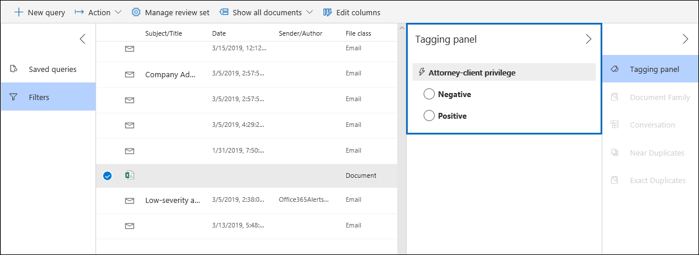

# Configurar detecção de privilégio de cliente de advogado na descoberta eletrônica avançada

Um aspecto importante e dispendioso da fase de análise de qualquer processo de descoberta eletrônica é a revisão de documentos para conteúdo privilegiado. A descoberta eletrônica avançada fornece detecção de conteúdo privilegiado com base em aprendizado de máquina para tornar esse processo mais eficiente. Esse recurso é chamado *detecção de privilégio de cliente de advogado*.

> [!NOTE]
> Você deve aceitar o modelo de detecção de privilégio de cliente advogado antes de poder usá-lo. Consulte a [etapa 1](#step-1-opt-in-to-attorney-client-privilege-detection) para obter instruções.

## Como funciona?

Quando a detecção de privilégio de cliente do advogado estiver habilitada, todos os documentos em um conjunto de análise serão processados pelo modelo de detecção de privilégio de cliente advogado quando você [analisar os dados](analyzing-data-in-review-set.md) no conjunto de revisão. O modelo procura duas coisas:

- Conteúdo privilegiado – o modelo usa o Machine Learning para determinar a probabilidade de que o documento contenha conteúdo legal de natureza.

- Participantes – como parte da configuração de detecção de privilégio de cliente de advogado, você precisa enviar uma lista de advogados para sua organização. O modelo compara os participantes do documento com a lista advogado para determinar se um documento tem pelo menos um participante advogado.

O modelo produz as três seguintes propriedades para cada documento:

- **AttorneyClientPrivilegeScore** – a probabilidade de que o documento seja legal por natureza; os valores da Pontuação estão entre **0** e **1**.

- **HasAttorney** – essa propriedade será definida como **true** se um dos participantes do documento estiver listado na lista advogado; caso contrário, o valor será **false**. O valor também será definido como **false** se sua organização não tiver carregado uma lista de advogados.

- **Isprivilege** – essa propriedade será definida como **true** se o valor de **AttorneyClientPrivilegeScore** estiver acima do limite *ou* se o documento tiver um participante advogado; caso contrário, o valor é definido como **false**.

Essas propriedades (e seus valores correspondentes) são adicionadas aos metadados de arquivo dos documentos em um conjunto de revisão, conforme mostrado na captura de tela a seguir:

Essas três propriedades também podem ser pesquisadas em um conjunto de revisão. Para obter mais informações, consulte [consultar os dados em um conjunto de revisão](review-set-search.md).

## Configurar o modelo de detecção de privilégio de cliente advogado

Para habilitar o modelo de detecção de privilégio de cliente advogado, sua organização deve aceitar e carregar uma lista de advogados.

### Etapa 1: aceitar a detecção de privilégio de cliente advogado

Conforme mencionado anteriormente, o modelo de detecção de privilégio de cliente advogado está em visualização. Portanto, uma pessoa em seu administrador de descoberta eletrônica da organização (membro do subgrupo administrador de descoberta eletrônica no grupo de funções Gerenciador de descoberta eletrônica) deve optar por disponibilizar o modelo em suas ocorrências de descoberta eletrônica avançada.

1. No centro de conformidade & segurança, vá para **descoberta eletrônica avançada**de descoberta eletrônica >.

2. Na home page de **descoberta eletrônica avançada** , no bloco **configurações** , clique em **configurar recursos experimentales**.

   

3. Na guia **recursos experimentales** , clique em **gerenciar definição de privilégio de cliente do advogado**.

4. Na página do submenu de **privilégio de cliente do advogado** , clique no botão de alternância para ativar o recurso e clique em **salvar**.

### Etapa 2: carregar uma lista de advogados (opcional)

Para aproveitar ao máximo o modelo de detecção de privilégio do advogado-Client e usar os resultados da detecção de **advogado ou com** **privilégios possíveis** descritos anteriormente, recomendamos carregar uma lista de endereços de email para o advogados e pessoas jurídicas que trabalham para sua organização. 

Para carregar uma lista de advogados para uso pelo modelo de detecção de privilégio de cliente advogado:

1. Crie um arquivo. csv (sem uma linha de cabeçalho) e adicione o endereço de email de cada pessoa apropriada em uma linha separada. Salve esse arquivo no computador local.

2. Na home page de **descoberta eletrônica avançada** , no bloco **configurações** , clique em **configurar recursos experimentais**e, em seguida, clique em **gerenciar definição de privilégio de cliente**.

   A página de **privilégio advogado-cliente** é exibida, e a opção de **detecção de privilégio advogado-cliente** é ativada.

   

3. Clique em **procurar** e, em seguida, localize e selecione o arquivo. csv que você criou na etapa 1.

4. Clique em **salvar** para carregar a lista advogado.

## Usar o modelo de detecção de privilégio de cliente advogado

Siga as etapas desta seção para usar a detecção de privilégio de cliente de advogados para documentos em um conjunto de revisão.

### Etapa 1: criar um grupo de marcas inteligentes com modelo de detecção de privilégio de cliente advogado

Uma das principais maneiras de ver os resultados da detecção de privilégio de cliente de advogados no processo de revisão é usar um grupo de marcas inteligentes. Um grupo de marcas inteligentes indica os resultados da detecção de privilégio de cliente advogado e mostra os resultados em linha ao lado das marcas em um grupo de marcas inteligentes. Isso permite identificar rapidamente documentos potencialmente privilegiados durante a revisão do documento. Além disso, você também pode usar as marcas no grupo de marcas inteligentes para marcar documentos como privilegiados ou não privilegiados. Para obter mais informações sobre marcas inteligentes, consulte [Configurar marcas inteligentes na descoberta eletrônica avançada](smart-tags.md).

1. No conjunto de revisão que contém os documentos analisados na etapa 1, clique em **gerenciar o conjunto de revisão** e, em seguida, clique em **gerenciar marcas**.
 
2. Em **marcas**, clique na parte suspensa ao lado de **Adicionar grupo** e, em seguida, clique em **Adicionar grupo de marcas inteligentes**.

   

3. Na página **escolha um modelo para a marca inteligente** , clique em **selecionar** ao lado de **privilégio advogado-cliente**.

   Um grupo de marcas chamado **privilégio advogado-cliente** é exibido. Ele contém duas marcas filhas chamadas **positiva** e **negativas**, que correspondem aos resultados possíveis produzidos pelo modelo.

   

3. Renomeie o grupo de marcas e as marcas conforme apropriado para sua revisão. Por exemplo, você pode renomear **** **positivo** como privilegiado e **negativo** para **não privilegiado**.

### Etapa 2: analisar um conjunto de revisão

Quando você analisa os documentos em um conjunto de revisão, o modelo de detecção de privilégio advogado-cliente também será executado e as propriedades correspondentes (descritas em[como funciona?](#how-does-it-work) serão adicionadas a todos os documentos do conjunto de revisão. Para obter mais informações sobre a análise de dados no conjunto de revisão, consulte [analisar dados em uma revisão definida em descoberta eletrônica avançada](analyzing-data-in-review-set.md).

### Etapa 3: usar o grupo de marcas inteligentes para análise de conteúdo privilegiado

Após analisar o conjunto de revisão e configurar marcas inteligentes, a próxima etapa é revisar os documentos. Se o modelo tiver determinado que o documento é potencialmente privilegiado, a marca inteligente correspondente no **painel de marcação** indicará os seguintes resultados produzidos pela detecção de privilégio advogado-cliente:

- Se o documento tiver conteúdo que possa ser de natureza legal, o **conteúdo legal** do rótulo será exibido ao lado da marca inteligente correspondente (que neste caso é a marca **positiva** padrão).

- Se o documento tiver um participante encontrado na lista de advogados da sua organização, o **advogado** do rótulo será exibido ao lado da marca inteligente correspondente (que neste caso também é a marca **positiva** padrão).

- Se o documento tiver conteúdo que possa ser legal por natureza *e* tiver um participante encontrado na lista de advogados, tanto o **conteúdo legal** como os rótulos de **advogado** serão exibidos. 

Se o modelo determinar que um documento não contém conteúdo legal ou que não contenha um participante da lista advogado, nenhum rótulo será exibido no painel de marcação.

Por exemplo, as capturas de tela a seguir mostram dois documentos; o primeiro contém conteúdo que é legal e tem um participante encontrado na lista de advogados; o segundo não contém e, portanto, não exibe nenhum rótulo.

Após revisar um documento para ver se ele contém conteúdo privilegiado, você pode marcar o documento com a marca apropriada.