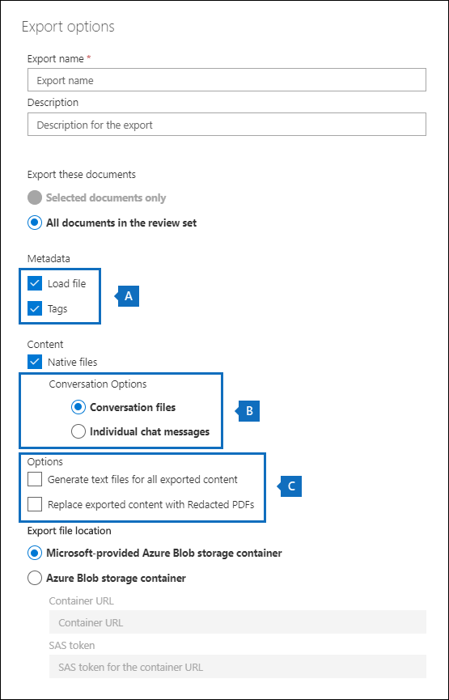

# Analisar conversas na descoberta eletrônica avançada 

O sistema de mensagens instantâneas é uma maneira conveniente de fazer perguntas, compartilhar ideias ou se comunicar rapidamente entre grandes audiências. Como as plataformas de mensagens instantâneas, como o Microsoft Teams, se tornarem essenciais para a colaboração corporativa, as organizações devem avaliar como o fluxo de trabalho de descoberta eletrônica resolve essas novas formas de comunicação e colaboração. 

O recurso de reconstrução de conversa na descoberta eletrônica avançada foi projetado para ajudá-lo a identificar o conteúdo contextual e produzir modos de exibição de conversa distintos. Esse recurso permite que você examine de forma eficiente e rápida as conversas de mensagens instantâneas completas (também chamadas de *conversações encadeadas*) geradas em plataformas como o Microsoft Teams.

Com a reconstrução de conversas, você pode usar recursos internos para reconstruir, revisar e exportar conversas encadeadas. Use a reconstrução de conversa de descoberta eletrônica avançada para:

- Preservar metadados únicos em nível de mensagem em todas as mensagens de uma conversa.

- Coletar mensagens contextuais em torno dos resultados da pesquisa.

- Revisar, anotar e redigir conversas encadeadas.

- Exportar mensagens individuais ou conversas encadeadas

## Terminologia

Aqui estão algumas definições para ajudá-lo a começar a usar a reconstrução de conversa.

- **Mensagens:** Representa a menor unidade de uma conversa. As mensagens podem variar de tamanho, estrutura e metadados. 

- **Conversa:** Representa um agrupamento de uma ou mais mensagens. Em diferentes aplicativos, as conversas podem ser representadas de diferentes maneiras. Em alguns aplicativos, há uma ação explícita que resulta da resposta a uma mensagem existente. As conversas são formadas explicitamente como resultado dessa ação do usuário. Por exemplo, aqui está uma captura de tela de uma conversa de canal no Microsoft Teams.

   

   Em outros aplicativos (como mensagens de chat do 1xN no Microsoft Teams), não há uma cadeia de resposta formal e, em vez disso, as mensagens aparecem como "Rio simples de mensagens" em um único thread. Nesses tipos de aplicativos, as conversas são inferidas de um grupo de mensagens que ocorrem dentro de um determinado momento. Esse "Agrupamento de mensagens" (em vez de uma cadeia de resposta) representa a conversa "frente e para trás" sobre um tópico específico de interesse. 

## Etapa 1: executar uma pesquisa

Após identificar os responsáveis e locais de conteúdo relevantes, você poderá criar uma pesquisa para localizar conteúdo potencialmente relevante. Na guia **pesquisas** da caixa de descoberta eletrônica avançada, você pode criar uma pesquisa clicando em **nova pesquisa** e seguindo o assistente. Para obter informações sobre como você pode criar uma pesquisa, criar uma consulta de pesquisa e exibir os resultados da pesquisa, consulte [coletar dados por um caso](create-search-to-collect-data.md).

## Etapa 2: criar um conjunto de revisão de conversa

Em um conjunto de revisão, você pode pesquisar, marcar, anotar e redigir documentos, mensagens de email e conversas de chat. Na descoberta eletrônica avançada, você pode personalizar a revisão de conversas, com base em mensagens individuais ou conversas encadeadas. Isso é determinado pelo tipo de conjunto de revisão que você adiciona os resultados da pesquisa criada na etapa 1 para. Há dois tipos diferentes de conjuntos de revisão: 
  
  - **Conjuntos de revisão padrão:** As mensagens em conversas são processadas e exibidas como itens individuais. 
  
  -  **Conjuntos de revisão de conversa:** As mensagens em conversas são processadas individualmente, mas exibidas em um modo de exibição de conversa. Em um conjunto de revisão de conversa, você pode anotar, marcar e redigir mensagens em um modo de exibição de conversa encadeado. 

Para obter mais informações sobre como revisar e gerenciar o conteúdo em um conjunto de revisão, consulte [Manage Review sets](managing-review-sets.md). 

## Etapa 3: habilitar as opções de recuperação de conversa

Depois de revisar e finalizar a consulta de pesquisa, você pode adicionar os resultados da pesquisa a um conjunto de revisão. Quando você adiciona os resultados da pesquisa em um conjunto de revisão, os dados originais são copiados para uma área de armazenamento do Azure para facilitar o processo de revisão e análise. Para obter mais informações sobre como adicionar resultados de pesquisa a um conjunto de revisão, consulte [Add Search Results to a Review Set](add-data-to-review-set.md). 

Ao adicionar dados de conversas a um conjunto de revisão, você pode usar as opções de recuperação de conversa para expandir sua pesquisa e incluir mensagens contextuais. Após definir as opções de recuperação de conversa, as seguintes coisas podem ocorrer:

  
  
1. Usando uma consulta de intervalo de datas e palavras-chave, a pesquisa retornou uma ocorrência na *mensagem 3*. Esta mensagem faz parte de uma conversa maior, ilustrada por *CRC1*. 
  
2. Quando você adiciona os dados em um conjunto de revisão e habilita as opções de recuperação de conversa, a descoberta eletrônica avançada volta e coleta outros itens no *CRC1*. 
  
3. Depois que os itens tiverem sido adicionados ao conjunto de revisão, você poderá revisar todas as mensagens individuais do *CRC1*. 

Para habilitar a recuperação de conversas:
  
1. Na guia **pesquisas** da caixa de descoberta eletrônica avançada, selecione uma pesquisa e, em seguida, clique em **Adicionar a revisão definida** na página do menu suspenso.
  
2. Selecione um conjunto de revisão existente ou crie um conjunto de revisão. Você pode configurar opções de recuperação ao adicionar resultados de pesquisa a um conjunto de análise de conversa padrão ou padrão.
  
3. Em **Opções de coleta**, configure as opções de recuperação de conversa para as fontes de conteúdo que você deseja expandir em sua pesquisa e clique em **Adicionar** para iniciar o processo.  
  
4. Após a conclusão do trabalho de **adição à revisão** do trabalho na guia **trabalhos** , você poderá começar a revisar as conversas.

## Etapa 4: examinar as conversas no conjunto de revisão

Após o conteúdo ter sido processado e adicionado ao conjunto de revisão, você pode começar a revisar os dados no conjunto de revisão. Os recursos de revisão são diferentes dependendo se o conteúdo foi adicionado a um conjunto de revisão padrão ou um conjunto de revisão de conversa. 

### Revisando conversas em um conjunto de análise padrão

Em um conjunto de revisão padrão, as mensagens são processadas e exibidas como itens individuais, semelhante à forma como estão armazenadas em uma pasta de caixa de correio. Neste fluxo de trabalho, cada mensagem é processada como um item separado. Como resultado, o resumo segmentado e as opções de exportação não estão disponíveis em um conjunto de análise padrão. 

  

### Analisar conversas em um conjunto de revisão de conversa

Em um conjunto de revisão de conversa, as mensagens individuais são encadeadas e apresentadas como conversas. Isso permite que você revise e exporte conversas contextuais. 

  

As seções a seguir descrevem a revisão e exportação de conversas em um conjunto de análise de conversa.

#### Revisando conversas

Em um conjunto de revisão de conversa, você pode usar as seguintes opções para facilitar o processo de revisão.

- **Agrupar por conversa:** Agrupa as mensagens dentro da mesma conversa para ajudar os usuários a simplificar e agilizar o processo de revisão. 

- **Exibição de Resumo:** Exibe a conversa encadeada. Nesse modo de exibição, você pode ver toda a conversa e também acessar os metadados de cada mensagem individual.  
  
   - Exibir metadados para mensagens individuais
   
   - Baixar mensagens individuais

- **Exibição de texto:** Fornece o texto extraído da conversa inteira. 

- **Modo de anotações:** Permite marcar um modo de exibição segmentado da conversa. Todas as mensagens na conversa compartilham o mesmo documento anotado.

- **Marcação:** Ao exibir conversas em um conjunto de revisão, você pode exibir e aplicar marcas clicando em **painel de marcação** no painel de codificação.

- **Executar a conversão de conversa novamente:** Quando as mensagens são adicionadas a um conjunto de revisão de conversa, um trabalho de conversão é executado automaticamente para criar os modos de exibição de resumo e anotações encadeados. Se o trabalho de reconstrução da conversa falhar, você poderá executar novamente esse trabalho clicando em **ação > criar PDFs de conversa** no conjunto de revisão.

#### Exportando conversas

Em um conjunto de revisão de conversa, você pode definir as seguintes opções para exportar conversas:

a. Opções de metadados

   - **Carregar arquivo:** Os metadados são incluídos para cada mensagem, email e documento individual. Há uma linha para cada mensagem em uma conversa. 

   - **Marcas:** As marcas do processo de revisão são incluídas no arquivo de metadados. As mensagens em uma conversa compartilham as mesmas marcas. 

b. Opções de conversa
  
   - **Arquivos de conversa:** Quando você exporta arquivos de conversa, o modo de exibição anotado é convertido em um arquivo PDF e baixado para a pasta de exportação. As mensagens em um arquivo de conversa apontam para a versão do PDF do mesmo arquivo de conversa.  
  
   - **Mensagens de chat individuais:** Quando você exporta mensagens individuais, cada mensagem exclusiva na conversa é exportada como um item autônomo. O arquivo é exportado no mesmo formato em que foi salvo na caixa de correio. Para uma conversa específica, você recebe vários arquivos. msg. 

     >[!NOTE]
     > Se você aplicou anotações ao arquivo de conversa, essas anotações não serão transferidas para as mensagens individuais. 

c. Outras opções

   - **Gerar arquivos de texto para todo o conteúdo exportado:** Gera um arquivo de texto para cada conversa exportada do conjunto de revisão. 

   - **Substitua o conteúdo exportado por PDFs redigidos:** Se os arquivos de conversa redigidos forem gerados durante o processo de revisão, esses arquivos estarão disponíveis durante a exportação. Você pode decidir se deseja exportar somente os arquivos nativos (sem selecionar essa opção) ou substituir os arquivos nativos pelas versões redigidas dos arquivos nativos (selecionando essa opção), que são exportadas como arquivos PDF.

## Mais informações

Para saber mais sobre como revisar os dados do caso na descoberta eletrônica avançada, consulte os seguintes artigos:

- [Exibir dados de caso](view-documents-in-review-set.md) 

- [Analisar dados de ocorrências](analyzing-data-in-review-set.md)

- [Exportar dados de ocorrência](exporting-data-ediscover20.md)
