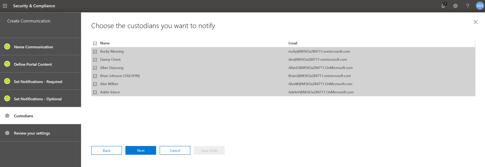

# Criar um aviso de retenção legal

Usando as comunicações de conversões de descoberta eletrônica avançada (prévia), as organizações podem gerenciar seu fluxo de trabalho em relação à comunicação com os responsáveis. Por meio da ferramenta de comunicação, as equipes jurídicas podem, sistematicamente, enviar, coletar e acompanhar as notificações de retenção legal. O processo de criação flexível também permite que as equipes personalizem o fluxo de trabalho de notificação de espera e o conteúdo dos avisos enviados aos responsáveis. 

O artigo descreve as etapas no fluxo de trabalho de notificação de retenção.

## Etapa 1: especificar detalhes de comunicação

A primeira etapa é especificar os detalhes apropriados para avisos de retenção legal ou outras comunicações do mesmo. 

1. No centro de conformidade do & de segurança, vá para descoberta **eletrônica avançada do > (visualização)** para exibir a lista de casos em sua organização.
   
2. Clique na guia **comunicações** e, em seguida, clique em **nova comunicação**.
   
3. Na página **comunicação de nome** , especifique os seguintes detalhes de comunicação (obrigatório).

    - **Name**: Este é o nome da comunicação.
    
    - **Responsável pela emissão**: a lista suspensa exibe uma lista de membros de caso. Cada aviso enviado aos responsáveis será enviado em nome do responsável pela emissão especificado.

4. Clique em **Avançar**.

## Etapa 2: definir o conteúdo do portal

Em seguida, você pode criar e adicionar o conteúdo do aviso de isenção. Na página **definir conteúdo do portal** no Assistente para **criar comunicação** , especifique o conteúdo do aviso de isenção. Esse conteúdo será automaticamente acrescentado aos avisos de emissão, reEmissão, lembrete e escalonamento. Além disso, esse conteúdo aparecerá no portal de conformidade do responsáveis. 

Para criar o conteúdo do portal:

1. Digite (ou recorte e Cole de outro documento) seu aviso de bloqueio na caixa de texto do conteúdo do Portal. 

2. Insira as variáveis de mesclagem no seu aviso para personalizar o aviso e compartilhar o portal de conformidade do responsáveis.

3. Clique em **Avançar**.

  >[!Tip]
  >Para saber mais sobre como personalizar o conteúdo e o formato do conteúdo do portal, confira [usar o editor de comunicações](using-communications-editor.md).

## Etapa 3: definir as notificações necessárias

Após definir o conteúdo do aviso de espera, você pode configurar os fluxos de trabalho em torno do envio e gerenciamento do processo de notificação. Notificações são mensagens de email enviadas para notificação e acompanhamento de responsáveis. Todos os responsáveis adicionados à comunicação receberão a mesma notificação. 

Para configurar e enviar um aviso de espera, você deve incluir notificações de emissão, reEmissão e lançamento.

### Notificação de emissão 

Depois que a comunicação é criada, a **notificação de emissão** é iniciada pelo responsável pela emissão especificado. A notificação de emissão é a primeira comunicação enviada ao responsáveis para informá-los sobre suas obrigações de preservação. 

Para criar uma notificação de emissão:

1. No bloco de **publicação** , clique em **Editar**.
   
2. Se necessário, adicione membros de caso adicionais ou equipe aos campos **CC** e **Cco** . Para adicionar vários usuários a esses campos, separe os endereços de email com um ponto-e-vírgula.
   
3. Especifique o **assunto** para o aviso (obrigatório).
   
4. Especifique o conteúdo ou instruções adicionais que você gostaria de fornecer aos responsáveis (obrigatório). Observe que o conteúdo do portal definido na etapa 2 é adicionado ao final do aviso de emissão. 
   
5. Clique em **Salvar** 

### Notificação de reEmissão 

Como o caso progride, os responsáveis podem ser necessários para preservar dados adicionais ou menos do que foram instruídos anteriormente. Depois de atualizar o conteúdo do aviso de espera, a notificação de reemissão alerta os responsáveis sobre as alterações às obrigações de preservação.

Para criar uma notificação de reemissão: 

1. No bloco **reemitir** , clique em **Editar**.
   
2. Se necessário, adicione membros de caso adicionais ou equipe aos campos **CC** e **Cco** . Para adicionar vários usuários a esses campos, separe os endereços de email com um ponto-e-vírgula.
   
3. Especifique o **assunto** para o aviso (obrigatório).
   
4. Especifique o conteúdo ou instruções adicionais que você gostaria de fornecer aos responsáveis (obrigatório). Observe que o conteúdo do portal definido na etapa 2 é adicionado ao final do aviso de reemissão.
   
5. Clique em **Salvar**.

>[!Note]
>Se uma notificação de retenção for modificada, a notificação de reemissão será enviada automaticamente a todos os responsáveis atribuídos ao aviso. Após a notificação ser enviada, os responsáveis serão solicitados a reconfirmar seu aviso de isenção. Se você tiver configurado os fluxos de trabalho de lembretes ou de escalonamento, eles também serão reiniciados. 

### Notificação de lançamento

Após uma questão ser resolvida ou se um usuário não está mais sujeito a preservar o conteúdo, você pode liberar os responsáveis de uma ocorrência. Se o objectrecebeu anteriormente um aviso de espera, a notificação de lançamento pode ser usada para alertar os responsáveis por terem sido liberados de sua obrigação.

Para criar uma notificação de lançamento: 

1. No bloco de **versão** , clique em **Editar**.
   
2. Se necessário, adicione membros de caso adicionais ou equipe aos campos **CC** e **Cco** . Para adicionar vários usuários a esses campos, separe os endereços de email com um ponto-e-vírgula.
   
3. Especifique o **assunto** para o aviso (obrigatório).
   
4. Especifique o conteúdo ou instruções adicionais que você gostaria de fornecer aos responsáveis (obrigatório).
   
5. Clique em **salvar** e vá para a próxima etapa. 

## Opcion Etapa 4: definir as notificações opcionais

Opcionalmente, você pode simplificar o fluxo de trabalho para acompanhar os responsáveis por não responder, criando e agendando notificações automatizadas de lembrete e escalonamento.

### Lembretes

Depois de enviar uma notificação de espera, você pode acompanhar os responsáveis por não responder, definindo um fluxo de trabalho de lembrete. 

Para agendar lembretes:

1. No bloco **lembrete** , clique em **Editar**.
   
2. Habilite **** o fluxo de trabalho de lembrete ativando o **status** de alternância (obrigatório).
   
3. Especifique o **intervalo de lembretes (em dias)** (obrigatório). Este é o número de dias de espera antes de enviar as notificações de lembrete inicial e de acompanhamento. Por exemplo, se você definir o intervalo de lembretes como 7 dias, o primeiro lembrete será enviado 7 dias após a notificação de retenção ser emitida inicialmente. Todos os lembretes subsequentes também serão enviados a cada 7 dias.
   
4. Especifique o **número de lembretes** (obrigatório). Este campo especifica o número de lembretes a serem enviados para os responsáveis pela resposta. Por exemplo, se você definir o número de lembretes como 3, um dos responsáveis receberá um máximo de 3 lembretes. Depois que os responsáveis confirmarem a notificação de espera, os lembretes não serão mais enviados para esse usuário.
   
5. Especifique o **assunto** para o aviso (obrigatório). 
   
6. Especifique o conteúdo ou instruções adicionais que você gostaria de fornecer aos responsáveis (obrigatório). Observe que o conteúdo do portal definido na etapa 2 é adicionado ao final do aviso de lembrete.
   
7. Clique em **salvar** e vá para a próxima etapa.

### Escalonamentos 

Em algumas situações, talvez você precise de outras maneiras de acompanhar os responsáveis por não responder. Se um responsáveis não confirmar uma notificação de bloqueio após receber o número especificado de lembretes, a equipe jurídica poderá especificar um fluxo de trabalho para enviar automaticamente um aviso de escalonamento para os responsáveis e seu gerente.

Para agendar escalonamentos:

1. No bloco **escalonamento** , clique em **Editar**.
   
2. Habilite o fluxo de trabalho de **escalonamento** ativando a alternância de **status** .
   
3. Especifique o **intervalo de escalonamento (em dias)** (obrigatório). 
   
4. Especifique o **número de escalas** (obrigatório). Este campo especifica a quantidade de escalonamentos a ser enviada para os responsáveis pela resposta. Por exemplo, se você definir o número de escalonamentos como 3, um aviso de escalonamento será enviado aos responsáveis e seu gerente no máximo três vezes. Depois que os responsáveis confirmarem a notificação de espera, os escalonamentos não serão mais enviados. 
   
5. Especifique o **assunto** para o aviso (obrigatório). 
   
6. Especifique o conteúdo ou instruções adicionais que você gostaria de fornecer aos responsáveis (obrigatório). Observe que o conteúdo do portal definido na etapa 2 é adicionado ao final do aviso de escalonamento.
   
7. Clique em **salvar** e vá para a próxima etapa.
   
## Etapa 5: atribuir os responsáveis 

Depois de finalizar o conteúdo para notificações, selecione os responsáveis que você gostaria de enviar as notificações. 

Para adicionar os responsáveis:

1. Atribua os responsáveis à comunicação clicando na caixa de seleção ao lado do nome.

    Depois que a comunicação for criada, o fluxo de trabalho de notificação será aplicado automaticamente aos responsáveis selecionados.
   
2. Clique em **Avançar** para revisar as configurações e detalhes de comunicação.
 
>[!NOTE]
>Você só pode adicionar os responsáveis que foram adicionados ao caso e não foram enviados outra notificação no caso.

## Etapa 6: reVisar as configurações

Após revisar as configurações e clicar em **Enviar** para concluir a comunicação, o sistema iniciará automaticamente o fluxo de trabalho de comunicação enviando o aviso de emissão.
