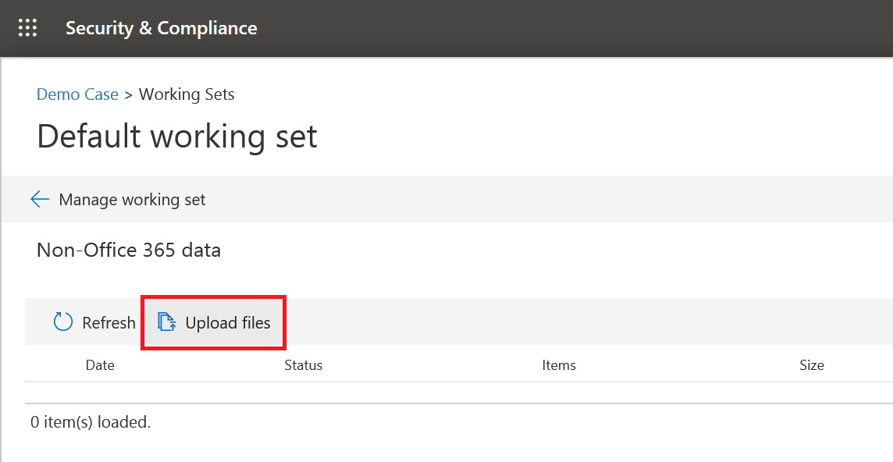
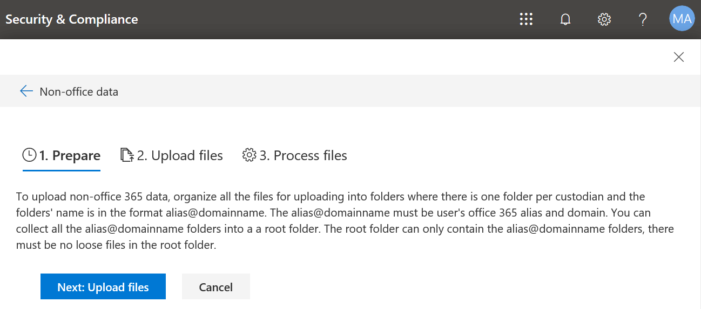

# Carregar dados que não sejam do Office 365 em um conjunto de revisão

Nem todos os documentos que você pode precisar analisar com a descoberta eletrônica avançada do Office 365 residirão no Office 365. Com o recurso de importação de conteúdo não-Office 365 na descoberta eletrônica avançada, é possível carregar documentos que não residem no Office 365 em um conjunto de revisão para que seja analisado com a descoberta eletrônica avançada. Este procedimento mostra como trazer documentos não-Office 365 para a descoberta eletrônica avançada para análise.

>[!Note]
>A descoberta eletrônica avançada requer um Office 365 E3 com o complemento de conformidade avançada ou uma assinatura E5 para sua organização. Se você não tiver esse plano e quiser tentar a descoberta eletrônica avançada, poderá se inscrever para uma avaliação do Office 365 Enterprise e5.

## Antes de começar

O uso do recurso de upload que não é do Office 365 conforme descrito neste artigo requer que você tenha o seguinte:

- Uma assinatura do Office 365 ou do Microsoft 365 E5 ou uma assinatura E3 com a assinatura de complemento de conformidade avançada.

- Todos os responsáveis cujo conteúdo que não seja do Office 365 será carregado deverá ter a licença E3 com uma licença de complemento de conformidade avançada ou ter uma licença e5.

- Uma ocorrência de descoberta eletrônica avançada existente.

- Os responsáveis devem ser adicionados à ocorrência antes de você carregar os dados que não são do Office 365 associados a eles.

- Todos os arquivos que serão carregados devem estar localizados em pastas, onde cada pasta é associada a um determinado local. Os nomes dessas pastas devem usar o seguinte formato de nomenclatura: *alias @ nome_do_domínio*. O *alias @ nome_do_domínio* deve ser o alias e o domínio do Office 365 do usuário. Você pode coletar todas as pastas *alias @* DomainName em uma pasta raiz. A pasta raiz pode conter apenas as pastas *alias @* DomainName; arquivos soltos não são permitidos na pasta raiz.

   Por exemplo, a estrutura de pastas dos dados não-Office 365 que você deseja carregar seria semelhante à seguinte:

   - c:\nonO365\abraham.mcmahon@contoso.com
   - c:\nonO365\jewell.gordon@contoso.com
   - c:\nonO365\staci.gonzalez@contoso.com

   Onde abraham.mcmahon@contoso.com, jewell.gordon@contoso.com e staci.gonzalez@contoso.com são os endereços SMTP dos responsáveis no caso.

   

- Uma conta que seja um Gerenciador de descoberta eletrônica ou administrador de descoberta eletrônica

- Ferramentas de armazenamento do Microsoft Azure instaladas em um computador que tem acesso à estrutura de pasta de conteúdo não-Office 365.

- Instale o AzCopy, que pode ser feito aqui:https://docs.microsoft.com/en-us/azure/storage/common/storage-use-azcopy

## Carregar conteúdo que não seja do Office 365 na descoberta eletrônica avançada

1. Como um gerente de descoberta eletrônica ou administrador de descoberta eletrônica, abra a descoberta eletrônica avançada e, em seguida, o caso em que os dados que não sejam do Office 365 serão carregados.  Clique na guia **conjuntos de revisão** e selecione o conjunto de revisão para o qual você deseja carregar os dados não-Office 365.  Se você ainda não criou um conjunto de revisão, é possível fazer isso agora.  Por fim, clique em **gerenciar o conjunto de revisão** e, em seguida, clique em **Exibir carregamentos** no bloco de dados * * não-Office 365.

2. Clique no botão **carregar arquivos** para iniciar o assistente de importação de dados não-Office 365.

   

3. A primeira etapa no assistente simplesmente prepara um blob do Azure seguro para os arquivos a serem carregados.  Após a conclusão da preparação, clique no botão **próximo: carregar arquivos** .

   
 
4. Na etapa **carregar arquivos** , especifique o **caminho para o local dos arquivos**, onde os dados não-Office 365 que você planeja importar estão localizados.  Definir o local correto garante que o comando AzCopy seja atualizado corretamente.

   > [!NOTE]
   > Se você ainda não tiver instalado o AzCopy, poderá fazer isso daqui:https://docs.microsoft.com/en-us/azure/storage/common/storage-use-azcopy

5. Copie o comando predefinido clicando no link **copiar para a área de transferência** . Inicie um prompt de comando do Windows, Cole o comando e pressione Enter.  Os arquivos serão carregados para o armazenamento de blob do Azure seguro para a próxima etapa.

   

   

   > [!NOTE]
   > Se o comando AzCopy fornecido falhar, consulte [solucionar problemas de AzCopy na descoberta eletrônica avançada](troubleshooting-azcopy.md)

6. Por fim, volte para a conformidade do & de segurança e clique no botão **próximo: processar arquivos** .  Isso iniciará o processamento, a extração de texto e a indexação de arquivos carregados.  Você pode acompanhar o progresso do processamento aqui ou na guia **trabalhos** .  Depois de concluído, os novos arquivos estarão disponíveis no conjunto de revisão.  Quando o processamento estiver concluído, você poderá ignorar o assistente.

   

