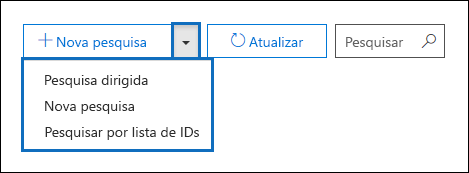
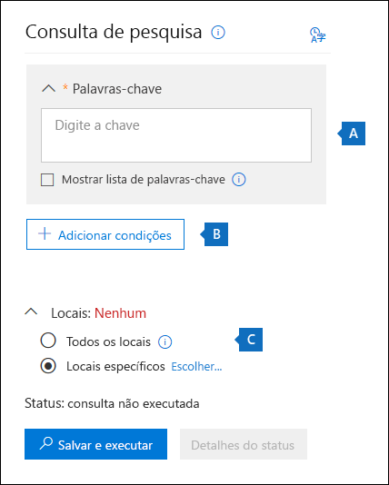
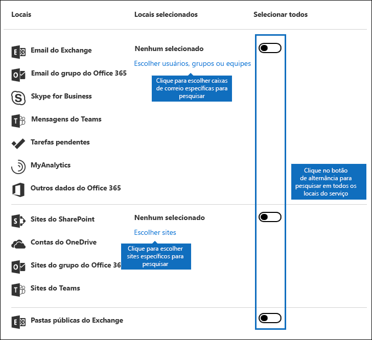
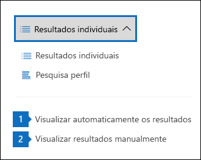
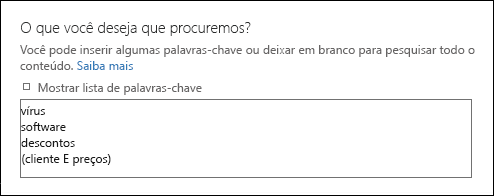
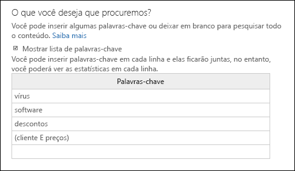
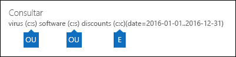
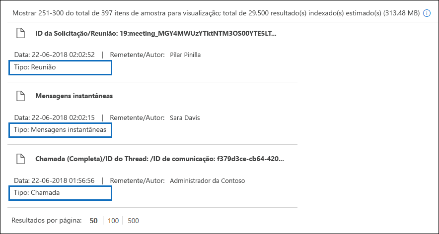
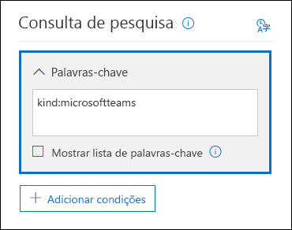
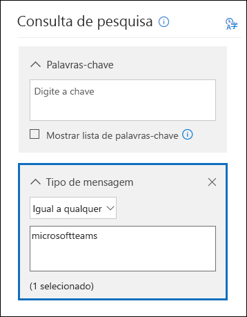

# <a name="content-search-in-office-365"></a>Pesquisa de conteúdo no Office 365

Você pode usar a ferramenta de descoberta eletrônica de pesquisa de conteúdo no &amp; centro de conformidade de segurança do Office 365 para pesquisar itens no local, como email, documentos e conversas de mensagens instantâneas em sua organização do Office 365. Use esta ferramenta para pesquisar itens nestes serviços do Office 365:
  
- Caixas de correio do Exchange Online e pastas públicas
    
- Sites do SharePoint Online e contas do OneDrive for Business
    
- Conversas do Skype for Business
    
- Microsoft Teams 
    
- Grupos do Office 365
    
Após executar uma pesquisa de conteúdo, o número de locais de conteúdo e um número estimado de resultados de pesquisa são exibidos no perfil de pesquisa. Você também pode exibir estatísticas rapidamente, como os locais de conteúdo que têm a maioria dos itens que correspondem à consulta de pesquisa. Após executar uma pesquisa, você pode visualizar os resultados ou exportá-los para um computador local.


## <a name="create-a-new-search"></a>Criar uma nova pesquisa

Para ter acesso à página de **pesquisa de conteúdo** para executar pesquisas e visualizar e exportar resultados de pesquisa, um administrador, um responsável pela conformidade ou um gerente de descoberta eletrônica deve ser membro do grupo de função &amp; Gerenciador de descoberta eletrônica no centro de conformidade de segurança. Para obter mais informações, consulte [atribuir permissões de descoberta eletrônica no centro &amp; de conformidade de segurança do Office 365](assign-ediscovery-permissions.md).
  
1. Acesse [https://protection.office.com](https://protection.office.com).
    
2. Entre usando seu endereço de email e senha do Office 365. 
    
3. No centro de &amp; conformidade de segurança, clique em pesquisa de \> **conteúdo**de **investigação de pesquisa &amp; ** .
    
4. Na página de **pesquisa** , clique na seta ao lado  **novo**ícone de pesquisa. 
    
    
  
    Utilize a guia Pesquisas de DNS Interno para especificar se serão utilizados servidores DNS configurados em um adaptador de rede instalado no servidor ou se serão utilizados servidores DNS específicos ao resolver os endereços de servidores de email para entrega de mensagens internas. Servidores DNS internos são usados para resolver os endereços IP de servidores que estão dentro da organização.
    
  - **Pesquisa orientada** : essa opção inicia um assistente que orienta você durante a criação da pesquisa. A interface do usuário para selecionar locais de conteúdo e compilar a consulta de pesquisa é a mesma que a nova opção de **pesquisa** . 
    
  - **Nova pesquisa** -esta opção exibe uma interface do usuário atualizada para criar uma nova pesquisa. Esta é a opção padrão se você clicar em **nova pesquisa**.
    
  - **Pesquisar por lista de IDs** -esta opção permite pesquisar mensagens de email específicas e outros itens de caixa de correio usando uma lista de IDs do Exchange. Para criar uma pesquisa de lista de ID (formalmente chamada de pesquisa direcionada), você envia um arquivo CSV (valor separado por vírgula) que identifica os itens de caixa de correio específicos para pesquisa. Para obter instruções, consulte [preparar um arquivo CSV para uma pesquisa de conteúdo de lista de ID no Office 365](csv-file-for-an-id-list-content-search.md).
    
    O restante das etapas deste procedimento seguirá o novo fluxo de trabalho de pesquisa padrão.
    
5. Clique em **nova pesquisa** na lista suspensa. 
    
6. Em **consulta de pesquisa**, especifique os itens a seguir.
    
    
  
- **Palavras-chave para pesquisar** -digite uma consulta de pesquisa na caixa **palavras-chave** . Você pode especificar palavras-chave, propriedades de mensagem, como datas de envio e recebimento, ou propriedades de documento, como nomes de arquivo ou a data em que um documento foi alterado pela última vez. Você pode usar consultas mais complexas que usam um operador Boolean, como **e**, **ou**, e **não**, e **Near**. Você também pode pesquisar informações confidenciais (como números de seguridade social) em documentos ou pesquisar documentos que foram compartilhados externamente. Se você deixar a caixa de palavras-chave vazia, todo o conteúdo localizado nos locais de conteúdo especificado será incluído nos resultados da pesquisa.
    
    Como alternativa, você pode clicar na caixa de seleção **Mostrar lista de palavras-chave** e a palavra-chave tipo a em cada linha. Se você fizer isso, as palavras-chave em cada linha serão conectadas por um operador lógico ( **c:s**) que é semelhante em funcionalidade ao operador **or** na consulta de pesquisa criada. 
    
    Por que usar a lista de palavras-chave? Você pode obter estatísticas que mostram quantos itens correspondem a cada palavra-chave. Isso pode ajudá-lo a identificar rapidamente quais palavras-chave são mais (e menos) eficientes. Você também pode usar uma frase de palavra-chave (entre parênteses) em uma linha. Para obter mais informações sobre estatísticas de pesquisa, consulte [View keyword Statistics for Content Search Results](view-keyword-statistics-for-content-search.md).

    > [!NOTE]
    > Para ajudar a reduzir os problemas causados por listas de palavras-chave grandes, agora você está limitado a um máximo de 20 linhas na lista de palavras-chave.
    
- **Condições** -você pode adicionar condições de pesquisa para restringir uma pesquisa e retornar um conjunto de resultados mais refinado. Cada condição adiciona uma cláusula à consulta de pesquisa criada e executada quando você inicia a pesquisa. Uma condição é conectada logicamente à consulta de palavra-chave (especificada na caixa palavra-chave) por um operador lógico ( **c:c**) que é semelhante em funcionalidade ao operador **and** . Isso significa que os itens precisam satisfazer a consulta de palavra-chave e uma ou mais condições a serem incluídas nos resultados. É assim que as condições ajudam a restringir os resultados. Para obter uma lista e uma descrição das condições que você pode usar em uma consulta de pesquisa, consulte a seção "condições de pesquisa" em [consultas de palavra-chave e condições de pesquisa para pesquisa de conteúdo](keyword-queries-and-search-conditions.md#search-conditions).
    
- **Locations** -escolha os locais de conteúdo para pesquisa.
    
  - **Todos os locais** – Use esta opção para pesquisar todos os locais de conteúdo em sua organização. Isso inclui emails em todas as caixas de correio do Exchange (incluindo todas as caixas de correio inativas, caixas de correio de todos os grupos do Office 365, caixas de correio para todas as equipes do Microsoft Teams), todas as conversas do Skype for Business, todos os sites do SharePoint e do OneDrive for Business (incluindo os sites para todos os grupos do Office 365 e o Microsoft Teams) e itens em todas as pastas públicas do Exchange.
    
  - **Locais específicos** : Use esta opção para pesquisar locais de conteúdo específicos. Você pode pesquisar todos os locais de conteúdo de um serviço específico do Office 365 (como pesquisar todas as caixas de correio do Exchange ou Pesquisar todos os sites do SharePoint) ou pode pesquisar locais específicos em qualquer um dos serviços do Office 365 que são exibidos. 
    
    
  
    Observe que você também pode adicionar grupos de distribuição à lista de caixas de correio do Exchange a Pesquisar. Para grupos de distribuição, as caixas de correio dos membros do grupo são pesquisadas. Observe que não há suporte para grupos dinâmicos de distribuição.
    
    **Importante:** Quando você pesquisa todos os locais da caixa de correio ou apenas caixas de correio específicas, os dados do myAnalytics e outros aplicativos do Office 365 salvos nas caixas de correio do usuário serão incluídos quando você exportar os resultados de uma pesquisa de conteúdo. Esses dados não serão incluídos nos resultados de pesquisa estimados e não estarão disponíveis para visualização. Ela só será incluída quando você exportar e baixar os resultados da pesquisa; consulte [exportando dados do myAnalytics e outros aplicativos do Office 365](#exporting-data-from-myanalytics-and-other-office-365-applications) na seção "mais informações sobre a pesquisa de conteúdo". 
    
7. Depois de configurar a consulta de pesquisa, clique em **Salvar &amp; executar**.
    
8. Na página **Salvar pesquisa** , digite um nome para a pesquisa e uma descrição opcional que ajuda a identificar a pesquisa. Observe que o nome da pesquisa precisa ser exclusivo em sua organização. 
    
9. Clique em **salvar** para iniciar a pesquisa. 
    
    Depois de salvar e executar a pesquisa, os resultados retornados pela pesquisa são exibidos no painel de resultados. Dependendo de como você tem a configuração de visualização configurada, os resultados da pesquisa são exibidos ou você precisa clicar em **Visualizar resultados** para visualizá-los. ConFira a próxima seção para obter detalhes. 
    
Para acessar a pesquisa de conteúdo novamente ou acessar outras pesquisas de conteúdo listadas na página de **pesquisa de conteúdo** , selecione a pesquisa e clique em **abrir**. 
  
Para limpar os resultados ou criar uma nova pesquisa, clique  **novo**ícone de pesquisa. 

  
## <a name="preview-search-results"></a>Visualização de resultados de pesquisa

Há duas definições de configuração para a visualização dos resultados da pesquisa. Após executar uma nova pesquisa ou abrir uma pesquisa existente, clique em * * resultados individuais * * para exibir as seguintes configurações de visualização: 
  

  
1. **Visualizar resultados automaticamente** -esta configuração exibe os resultados da pesquisa após a execução de uma pesquisa.
    
2. **Visualizar resultados manualmente** -essa configuração exibe espaços reservados no painel de resultados da pesquisa e exibe o botão **Visualizar resultados** que você precisa clicar para exibir os resultados da pesquisa. Essa é a configuração padrão; Ele ajuda a melhorar o desempenho da pesquisa, não exibindo automaticamente os resultados da pesquisa quando você abre uma pesquisa existente. 
    
Há limites relacionados à quantidade de itens disponíveis para visualização. Para obter mais informações, consulte [Limits for Search in The Office &amp; 365 Security Compliance Center](limits-for-content-search.md). 
  
Para obter uma lista dos tipos de arquivo com suporte que podem ser visualizados, consulte [visualização dos resultados da pesquisa](#previewing-search-results) na seção "mais informações sobre a pesquisa de conteúdo". Se não houver suporte para o tipo de arquivo para visualização ou para baixar uma cópia de um documento, você poderá clicar em **baixar arquivo original** para baixá-lo no computador local. Para páginas da Web. aspx, a URL da página é incluída, embora você talvez não tenha permissões para acessar a página. 
  
Observe também que itens não indexados não estão disponíveis para visualização.
  
## <a name="view-information-and-statistics-about-a-search"></a>Exibir informações e estatísticas sobre uma pesquisa

Depois de criar e executar uma pesquisa de conteúdo, você pode exibir estatísticas sobre os resultados estimados da pesquisa. Isso inclui um resumo dos resultados da pesquisa, as estatísticas de consulta, como o número de locais de conteúdo com itens que correspondem à consulta de pesquisa e o nome dos locais de conteúdo que possuem os itens mais coincidentes. Você pode exibir estatísticas para uma ou mais pesquisas de conteúdo. Isso permite que você compare rapidamente os resultados de várias pesquisas e tome decisões sobre a eficácia de suas consultas de pesquisa.
  
Você também pode baixar as estatísticas de pesquisa e as estatísticas de palavra-chave para um arquivo CSV. Isso permite que você use os recursos de filtragem e classificação no Excel para comparar resultados e preparar relatórios para seus resultados de pesquisa.
  
Para exibir as estatísticas de pesquisa:
  
1. Na página de **pesquisa de conteúdo** no centro &amp; de conformidade de segurança, clique em **abrir** e, em seguida, clique na pesquisa para a qual você deseja exibir a estatística. 
    
2. Na página sair, clique em **Abrir consulta**. 
    
3. Na lista suspensa **resultados individuais** , clique em **perfil de pesquisa**.
    
4. Na lista suspensa **tipo** , clique em uma das seguintes opções, dependendo das estatísticas de pesquisa que você deseja exibir. 
    
  - **Resumo** : exibe as estatísticas de cada tipo de local de conteúdo pesquisado. Esse conteúdo é o número de locais de conteúdo que continham itens que corresponderam à consulta de pesquisa e o número total e o tamanho dos itens de resultado de pesquisa. Essa é a configuração padrão.
    
  - **Consultas** – exibe estatísticas sobre a consulta de pesquisa. Isso inclui o tipo de local de conteúdo ao qual as estatísticas de consulta se aplicam, parte da consulta de pesquisa à qual as estatísticas são aplicáveis (Observe que **principal** indica a consulta de pesquisa inteira), o número de locais de conteúdo que contêm itens que corresponder à consulta de pesquisa e o número total e o tamanho e os itens que foram encontrados (no local de conteúdo especificado) que correspondem à consulta de pesquisa. Observe que as estatísticas de itens não indexados (também chamados de itens parcialmente indexados) também são exibidas. No enTanto, apenas itens parcialmente indexados de caixas de correio são incluídos nas estatísticas. Itens parcialmente indexados do SharePoint e do OneDrive não estão incluídos nas estatísticas.
    
  - **Principais locais** – exibe estatísticas sobre o número de itens que correspondem à consulta de pesquisa em cada local de conteúdo pesquisado. Os principais locais de 1.000 são exibidos.
    
Para obter informações mais detalhadas sobre estatísticas de pesquisa, consulte [View keyword Statistics for Content Search Results](view-keyword-statistics-for-content-search.md).
  
  
## <a name="export-search-results"></a>Exportar resultados de pesquisa

Após uma pesquisa ser executada com êxito, você pode exportar os resultados da pesquisa para um computador local. Quando você exporta os resultados de email, eles podem ser baixados para seu computador como arquivos PST ou como mensagens individuais (arquivos. msg). Quando você exporta conteúdo de sites do SharePoint e do OneDrive, cópias de documentos nativos do Office são exportadas. Também há outros documentos e relatórios que são incluídos nos resultados de pesquisa exportados. Você também pode apenas exportar o relatório de resultados de pesquisa e não os itens reais.
  
Para exportar os resultados da pesquisa:
  
1. Na página de **pesquisa de conteúdo** no centro &amp; de conformidade de segurança, clique na pesquisa para a qual você deseja exportar os resultados da pesquisa. 
    
2. Na página sair  de resultados de pesquisa **mais**e clique em **Exportar resultados**. Observe que você também pode exportar um relatório de resultados de pesquisa.
    
3. Conclua as seções na página **importar resultados** de saída. Certifique-se de usar a barra de rolagem para exibir todas as opções de exportação. 
    
Para obter instruções mais detalhadas e dicas de solução de problemas, consulte:
  
- [Exportar resultados de pesquisa do centro de conformidade &amp; de segurança do Office 365](export-search-results.md)
    
- [Exportar um relatório de pesquisa de conteúdo](export-a-content-search-report.md)
    

  
## <a name="more-information-about-content-search"></a>Mais informações sobre a pesquisa de conteúdo

Consulte as seções a seguir para obter mais informações sobre pesquisas de conteúdo.
  
[Limites de pesquisa de conteúdo](#content-search-limits)
  
[Criar uma consulta de pesquisa](#building-a-search-query)
  
[Pesquisando contas do OneDrive](#searching-onedrive-accounts)
  
[Pesquisando o Microsoft Teams e os grupos do Office 365](#searching-microsoft-teams-and-office-365-groups)
  
[Pesquisando caixas de correio inativas](#searching-inactive-mailboxes)
  
[Visualizando resultados de pesquisa](#previewing-search-results)
  
[Itens parcialmente indexados](#partially-indexed-items)
  
[ExPortando dados do myAnalytics e outros aplicativos do Office 365](#exporting-data-from-myanalytics-and-other-office-365-applications)
  
### <a name="content-search-limits"></a>Limites de pesquisa de conteúdo

- Para obter uma descrição dos limites que são aplicados ao recurso de pesquisa de conteúdo, consulte [Limits for Search in The Office &amp; 365 Security Compliance Center](limits-for-content-search.md).
    
- A Microsoft coleta informações de desempenho para pesquisas de conteúdo executadas por todas as organizações do Office 365. Embora a complexidade da consulta de pesquisa possa causar impacto nos tempos de pesquisa, o maior fator que afeta a duração das pesquisas longas é o número de caixas de correio pesquisadas. Embora a Microsoft não forneça um contrato de nível de serviço para tempos de pesquisa, a tabela a seguir lista os tempos de pesquisa médios de uma pesquisa de conteúdo com base no número de caixas de correio incluídas na pesquisa.
    
|**Número de caixas de correio**|**Tempo médio de pesquisa**|
|:-----|:-----|
|100  <br/> |30 segundos  <br/> |
|1,000  <br/> |45 segundos  <br/> |
|10.000  <br/> |4 minutos  <br/> |
|25.000  <br/> |10 minutos  <br/> |
|50.000  <br/> |20 minutos  <br/> |
|100.000  <br/> |25 minutos  <br/> |
  
### <a name="building-a-search-query"></a>Criar uma consulta de pesquisa

Para obter informações detalhadas sobre como criar uma consulta de pesquisa, usando operadores de pesquisa Boolean e condições de pesquisa e pesquisando tipos de informações confidenciais e conteúdo compartilhado com usuários fora da sua organização, consulte [keyword queries and Search Conditions para pesquisa de conteúdo ](keyword-queries-and-search-conditions.md).
  
Lembre-se do seguinte ao usar a lista de palavras-chave para criar uma consulta de pesquisa.
  
- Você precisa selecionar a caixa de seleção **Mostrar lista de palavras-chave** e, em seguida, digitar cada palavra-chave em uma linha separada para criar uma consulta de pesquisa onde as palavras-chave (ou palavras-chave) em cada linha estejam conectadas pelo operador **or** . Se você apenas colar uma lista de palavras-chave na caixa keyword ou pressionar a tecla **Enter** depois de digitar uma palavra-chave, elas não serão conectadas pelo operador **or** . Aqui estão incorretos e estão corretos exemplo de adição de uma lista de palavras-chave. 
    
    **Correcta**
    
    
  
    **Maneira**
    
    
  
- Você também pode preparar uma lista de palavras-chave ou frases de palavras-chave em um arquivo do Excel ou em um arquivo de texto sem formatação e, em seguida, copiar e colar a lista na lista de palavras-chave. Para fazer isso, você precisa selecionar a caixa de seleção **Mostrar lista de palavras-chave** . Em seguida, clique na primeira linha da lista de palavras-chave e cole sua lista. Cada linha do Excel ou arquivo de texto será colada em uma linha separada na lista de palavras-chave. 
    
- Após criar uma consulta usando a lista de palavras-chave, é uma boa ideia verificar a sintaxe da consulta de pesquisa para fazer a consulta de pesquisa é o que você pretendia. Na consulta de pesquisa exibida em **consulta** no painel de detalhes, as palavras-chave são separadas pelo texto **(c:s)**. Isso indica que as palavras-chave estão conectadas por um operador lógico semelhante em funcionalidade ao operador **or** . Da mesma forma, se a consulta de pesquisa incluir condições, as palavras-chave e as condições serão separadas pelo texto **(c:c)**. Isso indica que as palavras-chave estão conectadas às condições com um operador lógico semelhante em funcionalidade ao operador **and** . Veja a seguir um exemplo da consulta de pesquisa (exibido no painel de detalhes) que ocorre quando se usa a lista de palavras-chave e uma condição. 
    
    
  
- Quando você executa uma pesquisa de conteúdo, o Office 365 verifica automaticamente se há caracteres não suportados na consulta de pesquisa e se os operadores booleanos não podem ser colocados em maiúsculas. Os caracteres sem suporte são geralmente ocultos e geralmente causam um erro de pesquisa ou retornam resultados indesejados. Para obter mais informações sobre os caracteres não suportados verificados, confira [verificar se há erros na consulta de pesquisa de conteúdo](check-your-content-search-query-for-errors.md).
    
- Se você tiver uma consulta de pesquisa que contenha palavras-chave para caracteres não inglesas (como caracteres chineses), clique em idioma da consulta-idioma de consulta de **país/região** região em pesquisa de conteúdo e selecione um idioma-país código de cultura valor da pesquisa. Observe que o idioma/região padrão é neutro. Como saber se você precisa alterar a configuração de idioma de uma pesquisa de conteúdo? Se você estiver certo de que os locais de conteúdo contêm os caracteres que você está procurando, mas a pesquisa não retornar nenhum resultado, a configuração de idioma poderá ser a causa. 
  
### <a name="searching-onedrive-accounts"></a>Pesquisando contas do OneDrive

- Para coletar uma lista das URLs dos sites do OneDrive em sua organização, consulte [criar uma lista de todos os locais do onedrive em sua organização](https://support.office.com/article/8e200cb2-c768-49cb-88ec-53493e8ad80a). Este script neste artigo cria um arquivo de texto que contém uma lista de todos os sites do OneDrive. Para executar esse script, você precisará instalar e usar o Shell de gerenciamento do SharePoint Online. Certifique-se de acrescentar a URL para o domínio meusite da sua organização a cada site do OneDrive que você deseja pesquisar. Este é o domínio que contém todos os seus OneDrive; por exemplo, `https://contoso-my.sharepoint.com`. Veja um exemplo de uma URL para o site do OneDrive de um usuário `https://contoso-my.sharepoint.com/personal/sarad_contoso_onmicrosoft.com`:.
    
    No caso raro que o UPN (nome principal de usuário) de uma pessoa seja alterado, a URL do seu local do OneDrive também será alterada para incorporar o novo UPN. Se isso acontecer, você terá que modificar uma pesquisa de conteúdo adicionando a nova URL do OneDrive do usuário e removendo a antiga.
  
### <a name="searching-microsoft-teams-and-office-365-groups"></a>Pesquisando o Microsoft Teams e os grupos do Office 365

Você pode pesquisar a caixa de correio que está associada a um grupo do Office 365 ou a uma equipe da Microsoft. Como o Microsoft Teams é desenvolvido em grupos do Office 365, sua pesquisa é muito semelhante. Em ambos os casos, somente a caixa de correio de grupo ou equipe é pesquisada; as caixas de correio do grupo ou membros da equipe não são pesquisadas. Para procurá-los, adicione-os especificamente à pesquisa.
  
Lembre-se do seguinte ao pesquisar conteúdo no Microsoft Teams e nos grupos do Office 365.
  
- Para pesquisar conteúdo localizado no Microsoft Teams e nos grupos do Office 365, você precisa especificar a caixa de correio e o site do SharePoint associados a uma equipe ou a um grupo.
    
- Execute o cmdlet **Get-** unificado no Exchange Online para exibir as propriedades de um grupo do Microsoft Team ou do Office 365. Essa é uma boa maneira de obter a URL do site que está associado a uma equipe ou a um grupo. Por exemplo, o comando a seguir exibe as propriedades selecionadas de um grupo do Office 365 chamado equipe de liderança sênior: 
    
  ```
  Get-UnifiedGroup "Senior Leadership Team" | FL DisplayName,Alias,PrimarySmtpAddress,SharePointSiteUrl
  DisplayName            : Senior Leadership Team
  Alias                  : seniorleadershipteam
  PrimarySmtpAddress     : seniorleadershipteam@contoso.onmicrosoft.com
  SharePointSiteUrl      : https://contoso.sharepoint.com/sites/seniorleadershipteam
  
  ```

    > [!NOTE]
    > Para executar o cmdlet **Get-** unificado, você deve receber a função de destinatários somente para exibição no Exchange Online ou ser um membro de um grupo de função atribuído à função de destinatários somente para exibição. 
  
- Quando a caixa de correio de um usuário é pesquisada, qualquer Microsoft Team ou grupo do Office 365 do qual o usuário é membro não será pesquisado. Da mesma forma, quando você pesquisa um grupo do Microsoft Team ou do Office 365, somente a caixa de correio de grupo e o site de grupo que você especifica são pesquisados; as contas de caixas de correio e do OneDrive for Business dos membros do grupo não são pesquisadas, a menos que você as adicione explicitamente à pesquisa.
    
- Para obter uma lista dos membros de um grupo do Microsoft Team ou do Office 365, você pode exibir as propriedades na página **grupos \> domésticos** no centro de administração do Office 365. Como alternativa, você pode executar o seguinte comando no PowerShell do Exchange Online: 
    
  ```
  Get-UnifiedGroupLinks <group or team name> -LinkType Members | FL DisplayName,PrimarySmtpAddress 
  ```

    > [!NOTE]
    > Para executar o cmdlet **Get-UnifiedGroupLinks** , você deve ser atribuído à função de destinatários somente para exibição no Exchange Online ou ser um membro de um grupo de função atribuído à função de destinatários somente para exibição. 
  
- As conversas que fazem parte de um canal do Microsoft Teams são armazenadas na caixa de correio que está associada à equipe da Microsoft. Da mesma forma, os arquivos que os membros da equipe compartilham em um canal são armazenados no site do SharePoint da equipe. Portanto, você precisa adicionar a caixa de correio do Microsoft Team e o site do SharePoint como um local de conteúdo para pesquisar conversas e arquivos em um canal.
    
- Como alternativa, as conversas que fazem parte da lista de chat no Microsoft Teams são armazenadas na caixa de correio do Exchange Online dos usuários que participam do chat. Os arquivos que um usuário compartilha em conversas de chat são armazenados na conta do OneDrive for Business do usuário que compartilha o arquivo. Portanto, você precisa adicionar as caixas de correio de usuário individuais e as contas do OneDrive for Business como locais de conteúdo para pesquisar conversas e arquivos na lista de chat.
    
    > [!NOTE]
    > Em uma implantação híbrida do Exchange, os usuários com uma caixa de correio local podem participar de conversas que fazem parte da lista de chat no Microsoft Teams. Nesse caso, o conteúdo dessas conversas também é pesquisável porque é salvo em uma área de armazenamento baseada em nuvem (chamada de *caixa de correio baseada em nuvem para usuários locais*) para usuários que tenham uma caixa de correio local. Para obter mais informações, consulte [pesquisando caixas de correio baseadas em nuvem para usuários locais no Office 365](search-cloud-based-mailboxes-for-on-premises-users.md).
  
- Cada equipe do Microsoft ou canal de equipe contém um wiki para anotações e colaboração. O conteúdo wiki é automaticamente salvo em um arquivo com um formato. mht. Esse arquivo é armazenado na biblioteca de documentos de dados wiki do teams no site do SharePoint da equipe. Você pode usar a ferramenta de pesquisa de conteúdo para pesquisar o wiki especificando o site do SharePoint da equipe como o local de conteúdo a ser pesquisado. 
    
    > [!NOTE]
    > A capacidade de Pesquisar o wiki para uma equipe ou um canal da Microsoft (quando você pesquisa o site do SharePoint da equipe) foi lançada em 22 de junho de 2017. Páginas wiki que foram salvas ou atualizadas nessa data ou após estão disponíveis para serem pesquisadas. Páginas wiki salvas ou atualizadas pela última vez antes da data não estão disponíveis para pesquisa. 
 
- As informações reSumidas para reuniões e chamadas em um canal do Microsoft Teams também são armazenadas nas caixas de correio de usuários que discaram para a reunião ou chamada. Isso significa que você pode usar a pesquisa de conteúdo para pesquisar esses registros de resumo. As informações de resumo incluem: 
  - Data, hora de início, hora de término e duração de uma reunião ou chamada

  - A data e a hora em que cada participante ingressou ou saiu da reunião ou chamada

  - Chamadas enviadas para a caixa postal

  - Chamadas perdidas ou não atendidas

  - Transferências de chamadas, que são representadas como duas chamadas separadas

  Observe que pode levar até 8 horas para que os registros de reunião e de Resumo de chamada estejam disponíveis para pesquisa.

  Nos resultados da pesquisa, os resumos da reunião são identificados como **reunião** no **campo tipo**; os resumos de chamada são identificados como **Call**. Além disso, as conversas que fazem parte de um canal de equipe e chats 1xN são identificadas como **im** no campo **tipo** .
  
  

- Você pode usar a propriedade de email **Kind** ou o critério de pesquisa de **tipo de mensagem** para pesquisar especificamente o conteúdo no Microsoft Teams. 
  - Para usar a propriedade **Kind** como parte da consulta de pesquisa de palavra-chave, na caixa **palavras-chave** de uma consulta de `kind:microsoftteams`pesquisa, digite.

    
  
  - Para usar um critério de pesquisa, adicione a condição de **tipo de mensagem** e `microsoftteams`use o valor. 

    

Observe que as condições são logicamente conectadas à consulta de palavra-chave pelo operador **and** . Isso significa que um item deve corresponder tanto à consulta de palavra-chave quanto à condição de pesquisa a ser retornada nos resultados da pesquisa. Para obter mais informações, consulte a seção "diretrizes para usar condições" em [consultas de palavra-chave e condições de pesquisa para pesquisa de conteúdo.](keyword-queries-and-search-conditions.md#guidelines-for-using-conditions)

  
### <a name="searching-inactive-mailboxes"></a>Pesquisando caixas de correio inativas

Você pode pesquisar caixas de correio inativas em uma pesquisa de conteúdo. Para obter uma lista das caixas de correio inativas em sua organização, execute o `Get-Mailbox -InactiveMailboxOnly` comando no PowerShell do Exchange Online. Como alternativa, você pode ir para a **retenção** de **governança** \> de dados &amp; no centro de conformidade de segurança e, em seguida,](media/9723029d-e5cd-4740-b5b1-2806e4f28208.gif) \> clicar em **mais**![reticências de barras de navegação inativas. ****
  
Veja algumas coisas que você deve ter em mente ao pesquisar caixas de correio inativas.
  
- Se uma pesquisa de conteúdo incluir uma caixa de correio de usuário e essa caixa de correio for desativada, a pesquisa de conteúdo continuará a Pesquisar a caixa de correio inativa quando você executar novamente a pesquisa após ela se tornar inativa.
    
- Em alguns casos, um usuário pode ter uma caixa de correio ativa e uma caixa de correio inativa que tenha o mesmo endereço SMTP. Nesse caso, somente a caixa de correio específica que você selecionar como um local para uma pesquisa de conteúdo será pesquisada. Em outras palavras, se você adicionar a caixa de correio de um usuário a uma pesquisa, não poderá supor que as suas caixas de correio ativas e inativas serão pesquisadas; somente a caixa de correio que você adicionar explicitamente à pesquisa será pesquisada.
    
- É altamente recomendável que você evite ter uma caixa de correio ativa e uma caixa de correio inativa com o mesmo endereço SMTP. Se você precisar reutilizar o endereço SMTP atualmente atribuído a uma caixa de correio inativa, recomendamos recuperar a caixa de correio inativa ou restaurar o conteúdo de uma caixa de correio inativa para uma caixa de correio ativa (ou o arquivo de uma caixa de correio ativa) e excluir o caixa de correio inativa. Para obter mais informações, consulte um dos seguintes tópicos:
    
  - [Recuperar uma caixa de correio inativa no Office 365](recover-an-inactive-mailbox.md)
    
  - [Restaurar uma caixa de correio inativa no Office 365](restore-an-inactive-mailbox.md)
    
  - [Excluir uma caixa de correio inativa no Office 365](delete-an-inactive-mailbox.md)

  
### <a name="previewing-search-results"></a>Visualizando resultados de pesquisa

Você pode visualizar tipos de arquivo suportados no painel de visualização. Se não houver suporte para um tipo de arquivo, será necessário baixar uma cópia do arquivo para o computador local para visualizá-lo. Os tipos de arquivo a seguir têm suporte e podem ser visualizados no painel de resultados da pesquisa.
  
- . txt,. html,. mhtml
    
- . eml
    
- . doc,. docx,. docm
    
- . pptm,. pptx
    
- .pdf
    
Além disso, há suporte para os seguintes tipos de contêiner de arquivos. Você pode exibir a lista de arquivos no contêiner no painel de visualização.
  
- . zip
    
- . gzip
    
### <a name="partially-indexed-items"></a>Itens parcialmente indexados

- Como explicado anteriormente, itens parcialmente indexados em caixas de correio são incluídos nos resultados estimados da pesquisa; itens parcialmente indexados do SharePoint e do OneDrive não estão incluídos nos resultados de pesquisa estimados. 
    
- Se um item parcial corresponder à consulta de pesquisa (porque outras propriedades de mensagem ou de documento atendem aos critérios de pesquisa), ela não será incluída no número estimado de itens não indexados. Se um item parcial for excluído pelos critérios de pesquisa, ele também não será incluído no número estimado de itens parcialmente indexados. Para obter mais informações, consulte [itens parcialmente indexados na pesquisa de conteúdo no Office 365](partially-indexed-items-in-content-search.md).
    
### <a name="exporting-data-from-myanalytics-and-other-office-365-applications"></a>ExPortando dados do myAnalytics e outros aplicativos do Office 365

- Dados do myAnalytics (como insights sobre como os usuários passam o tempo com base nos dados de email e calendário em suas caixas de correio) e os dados de outros aplicativos do Office 365 são salvos em um local oculto (em uma sub-árvore não-IPM) na caixa de correio baseada em nuvem do usuário. Após executar uma pesquisa de conteúdo, esses dados não são incluídos nos resultados de pesquisa estimados, nas estatísticas de consulta e não estão disponíveis para visualização. No enTanto, esses dados serão exportados quando você exportar os resultados de uma pesquisa.
    
- Os dados do myAnalytics e os dados de outros aplicativos do Office 365 são exportados para uma pasta chamada "outros dados do Office 365". Essa pasta inclui subpastas para cada usuário.
  
