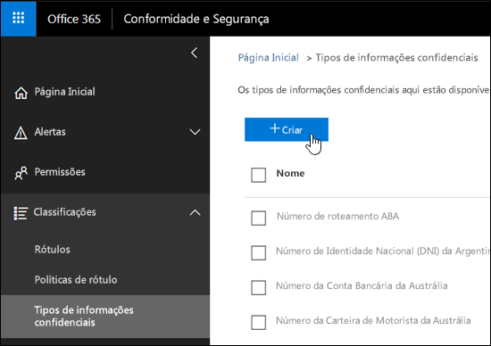
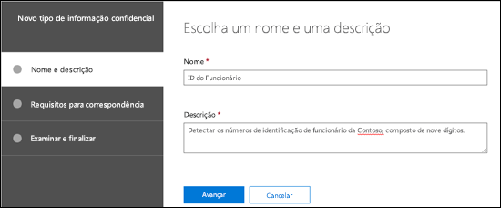
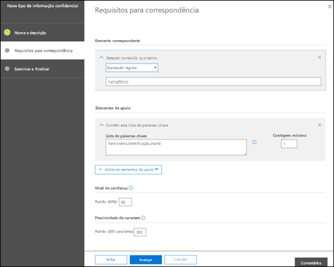
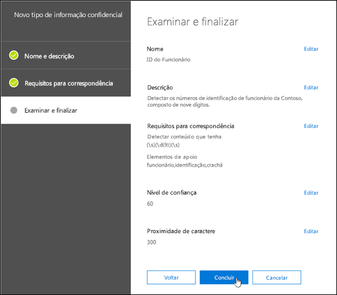
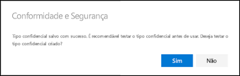
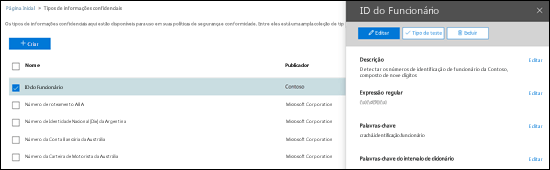
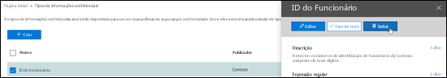
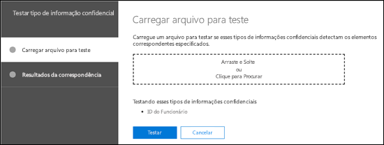
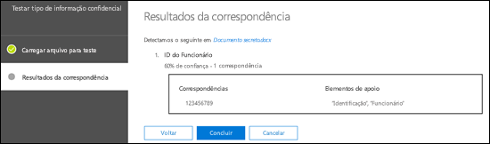

# Criar um tipo personalizado de informação confidencial no Centro de Conformidade e SegurançaCreate a custom sensitive information type in Security & Compliance Center PowerShell

## ResumoSummary

Leia este artigo para criar um [ tipo personalizado de informação confidencial](custom-sensitive-info-types.md) no Centro de Conformidade e Segurança ([https://protection.office.com](https://protection.office.com)).Read this article to create a [custom sensitive information type](custom-sensitive-info-types.md) in the Security & Compliance Center ([https://protection.office.com](https://protection.office.com)). Os tipos personalizados de informações confidenciais criados através desse método são adicionados ao pacote de regras chamado `Microsoft.SCCManaged.CustomRulePack`.The custom sensitive information types that you create by using this method are added to the rule package named `Microsoft.SCCManaged.CustomRulePack`.

Também é possível criar tipos personalizados de informações confidenciais usando os recursos PowerShell e Exact Data Match.You can also create custom sensitive information types by using PowerShell and Exact Data Match capabilities. Para saber mais sobre esses métodos, confira:To learn more about those methods, see:
- [Crie um tipo personalizado de informação confidencial no PowerShell do Centro de Conformidade e SegurançaCreate a custom sensitive information type in Security &amp; Compliance Center PowerShell](create-a-custom-sensitive-information-type-in-scc-powershell.md)
- [Criar um tipo personalizado de informações confidenciais com Correspondência Exata de Dados (visualização)](create-custom-sensitive-information-types-with-exact-data-match-based-classification.md)See [Create a custom sensitive information type with Exact Data Match based classification (Preview)](create-custom-sensitive-information-types-with-exact-data-match-based-classification.md).

## Antes de começar...Before you begin

- Sua organização deve ter uma assinatura, como o Office 365 Enterprise, que inclua Prevenção Contra Perda de Dados (DLP)Your organization must have a subscription, such as Office 365 Enterprise, that includes Data Loss Prevention (DLP). Consulte [Política de Mensagens e Descrição do Serviço de Conformidade](https://docs.microsoft.com/office365/servicedescriptions/exchange-online-protection-service-description/messaging-policy-and-compliance-servicedesc).See [Messaging Policy and Compliance ServiceDescription](https://docs.microsoft.com/office365/servicedescriptions/exchange-online-protection-service-description/messaging-policy-and-compliance-servicedesc). 

- Os tipos de informações confidenciais personalizados exigem familiaridade com expressões regulares (RegEx). Para saber mais sobre o mecanismo de RegEx (anteriormente conhecido como RegEx++) usado para processar o texto, confira [Boost.RegEx 5.1.3](https://www.boost.org/doc/libs/1_68_0/libs/regex/doc/html/).Custom sensitive information types require familiarity with regular expressions (RegEx). For more information about the Boost.RegEx (formerly known as RegEx++) engine that's used for processing the text, see [Boost.Regex 5.1.3](https://www.boost.org/doc/libs/1_68_0/libs/regex/doc/html/).

  O Suporte da Microsoft não pode ajudar no fornecimento de definições de correspondência de conteúdo personalizado (criação de classificações personalizadas ou padrões de expressões regulares). Os engenheiros de suporte podem fornecer suporte limitado para o recurso (por exemplo, fornecer padrões de expressões regulares de exemplo para fins de teste ou a assistência para solução de problemas de um padrão de expressão regular existente que não está sendo disparado conforme o esperado), mas não podem fornecer garantias de que qualquer desenvolvimento de correspondência de conteúdo personalizado atenderá a seus requisitos ou obrigações.Microsoft Customer Service & Support can't assist with providing custom content-matching definitions (creating custom classifications or regular expression patterns). Support engineers can provide limited support for the feature (for example, providing sample regular expression patterns for testing purposes, or assisting with troubleshooting an existing regular expression pattern that's not triggering as expected), but can't provide assurances that any custom content-matching development will fulfill your requirements or obligations.

- A DLP usa o rastreador de pesquisa para identificar e classificar informações confidenciais em sites do OneDrive e do SharePoint Online for Business. Para identificar o novo tipo personalizado de informações confidenciais no conteúdo existente, o conteúdo deve ser rastreado novamente. O conteúdo é rastreado novamente com base em uma agenda, mas você pode repetir manualmente o rastreamento do conteúdo de um conjunto de sites, uma lista ou uma biblioteca. Para saber mais, confira [Solicitar manualmente o rastreamento e a reindexação de um site, uma biblioteca ou uma lista](https://docs.microsoft.com/sharepoint/crawl-site-content).DLP uses the search crawler to identify and classify sensitive information in SharePoint Online and OneDrive for Business sites. To identify your new custom sensitive information type in existing content, the content must be recrawled. Content is recrawled based on a schedule, but you can manually recrawl content for a site collection, list, or library. For more information, see [Manually request crawling and re-indexing of a site, a library or a list](https://docs.microsoft.com/sharepoint/crawl-site-content).

## Criar tipos de informações confidenciais personalizados no Centro de Conformidade e SegurançaCreate custom sensitive information types in the Security & Compliance Center

No Centro de Conformidade e Segurança, acesse **Classificações** \> **Tipos de informações confidenciais** e clique em **Criar**.In the Security & Compliance Center, go to **Classifications** \> **Sensitive info types** and click **Create**.

As configurações são bastante óbvias e são explicadas na página associada do assistente:The settings are fairly self-evident, and are explained on the associate page of the wizard:

- **Nome****Name**

- **Descrição****Description**

- **Proximidade****Proximity**

- **Nível de confiança****Confidence level**

- **Elemento de padrão principal** (palavras-chave, expressão regular ou dicionário)**Primary pattern element** (keywords, regular expression, or dictionary)

- **Elementos de padrão de suporte** opcionais (palavras-chave, expressão regular ou dicionário) e um valor de **Custo mínimo** correspondente.Optional **Supporting pattern elements** (keywords, regular expression, or dictionary) and a corresponding **Minimum cost** value.

Aqui está um cenário: você deseja um tipo personalizado de informação confidencial que detecte os números de funcionários com nove dígitos no conteúdo, juntamente com as palavras-chave "funcionário", "ID" e "crachá". Para criar esse tipo personalizado de informação confidencial, faça o seguinte:Here's a scenario: You want a custom sensitive information type that detects 9-digit employee numbers in content, along with the keywords "employee" "ID" and "badge". To create this custom sensitive information type, do the following steps:

1. No Centro de Conformidade e Segurança, acesse **Classificações** \> **Tipos de informações confidenciais** e clique em **Criar**.In the Security & Compliance Center, go to **Classifications** \> **Sensitive info types** and click **Create**.

    

2. Na página **Escolher um nome e uma descrição** que é aberta, insira os seguintes valores:In the **Choose a name and description** page that opens, enter the following values:

  - **Nome**: ID de funcionário.**Name**: Employee ID.

  - **Descrição** detectar os números de nove dígitos de ID de funcionário da Contoso.**Description**: Detect nine-digit Contoso employee ID numbers.

    

    Quando terminar, clique em **Avançar**.When you're finished, click **Next**.

3. Na página **Requisitos para correspondência** que é aberta, clique em **Adicionar um elemento** e defina as seguintes configurações:In the **Requirements for matching** page that opens, click **Add an element** configure the following settings:

    - **Detectar conteúdo que tenha**:**Detect content containing**:
 
      a. Clique em **Qualquer um destes elementos** e selecione **Expressão regular**.a. Click **Any of these** and select **Regular expression**.

      b. Na caixa de expressão regular, insira `(\s)(\d{9})(\s)` (números de nove dígitos delimitados por espaço em branco)b. In the regular expression box, enter `(\s)(\d{9})(\s)` (nine-digit numbers surrounded by white space).
  
    - **Elementos de suporte**: clique em **Adicionar elementos de suporte** e selecione **Contém esta lista de palavras-chave**.**Supporting elements**: Click **Add supporting elements** and select **Contains this keyword list**.

    - Na área **Contém esta lista de palavra-chave** que é exibida, defina as seguintes configurações:In the **Contains this keyword list** area that appears, configure the following settings:

      - **Lista de palavra-chave**: insira o seguinte valor: funcionário,ID,crachá.**Keyword list**: Enter the following value: employee,ID,badge.

      - **Contagem mínima**: mantenha o valor padrão 1.**Minimum count**: Leave the default value 1.

    - Mantenha o valor padrão de 60 para o **Nível de confiança**.Leave the default **Confidence level** value 60. 

    - Mantenha o valor padrão de 300 para a **Proximidade de caracteres**.Leave the default **Character proximity** value 300.

    

    Quando terminar, clique em **Avançar**.When you're finished, click **Next**.

4. Na página **Examinar e finalizar** que é aberta, examine as configurações e clique em **Concluir**.On the **Review and finalize** page that opens, review the settings and click **Finish**.

    

5. A próxima página incentiva você a testar o novo tipo personalizado de informação confidencial clicando em **Sim**. Para saber mais, confira [Tipos de informações confidenciais personalizados no Centro de Conformidade e Segurança](#test-custom-sensitive-information-types-in-the-security--compliance-center). Para testar a regra mais tarde, clique em **Não**.The next page encourages you to test the new custom sensitive information type by clicking **Yes**. For more information, see [Test custom sensitive information types in the Security & Compliance Center](#test-custom-sensitive-information-types-in-the-security--compliance-center). To test the rule later, click **No**.

    

### Como saber se funcionou?How do you know this worked?

Para confirmar que você criou um novo tipo de informação confidencial com êxito, execute uma destas etapas:To verify that you've successfully created a new sensitive information type, do any of the following steps:

  - Vá para **Classificações** \> **Tipos de informações confidenciais** e verifique se o novo tipo personalizado de informações confidenciais está listado.Go to **Classifications** \> **Sensitive info types** and verify the new custom sensitive information type is listed.

  - Teste o novo tipo personalizado de informação confidencial. Para saber mais, confira [Testar tipos de informações confidenciais personalizados no Centro de Conformidade e Segurança](#test-custom-sensitive-information-types-in-the-security--compliance-center).Test the new custom sensitive information type. For more information, see [Test custom sensitive information types in the Security & Compliance Center](#test-custom-sensitive-information-types-in-the-security--compliance-center).

## Modificar tipos de informações confidenciais personalizados no Centro de Conformidade e SegurançaModify custom sensitive information types in the Security & Compliance Center

**Observações**:**Notes**:

- Você só pode modificar tipos de informações confidenciais personalizados. Não é possível modificar tipos internos de informações confidenciais. Porém, você pode usar o PowerShell para exportar tipos de informações confidenciais personalizados internos, personalizá-los e importá-los como tipos de informações confidenciais personalizados. Para saber mais, confira [Personalizar um tipo de informação confidencial interno](customize-a-built-in-sensitive-information-type.md).You can only modify custom sensitive information types; you can't modify built-in sensitive information types. But you can use PowerShell to export built-in custom sensitive information types, customize them, and import them as custom sensitive information types. For more information, see [Customize a built-in sensitive information type](customize-a-built-in-sensitive-information-type.md).

- Somente você pode modificar os tipos de informações confidenciais personalizados que criou na interface do usuário. Se você tiver usado o [procedimento do PowerShell](create-a-custom-sensitive-information-type-in-scc-powershell.md) para importar um pacote de regras de tipo personalizado de informações confidenciais, você receberá um erro.You can only modify custom sensitive information types that you created in the UI. If you used the [PowerShell procedure](create-a-custom-sensitive-information-type-in-scc-powershell.md) to import a custom sensitive information type rule package, you'll get an error.

No Centro de Conformidade e Segurança, acesse **Classificações** \> **Tipos de informações confidenciais**, selecione os tipos de informações confidenciais personalizados que você deseja modificar e clique em **Editar**.In the Security & Compliance Center, go to **Classifications** \> **Sensitive info types**, select the custom sensitive information type that you want to modify, and then click **Edit**.

  

Aqui estão disponíveis as mesmas opções oferecidas quando você criou o tipo de informação confidencial personalizado no Centro de Conformidade e Segurança. Para saber mais, confira [Criar tipos de informações confidenciais personalizados no Centro de Conformidade e Segurança](#create-custom-sensitive-information-types-in-the-security--compliance-center).The same options are available here as when you created the custom sensitive information type in the Security & Compliance Center. For more information, see [Create custom sensitive information types in the Security & Compliance Center](#create-custom-sensitive-information-types-in-the-security--compliance-center).

### Como saber se funcionou?How do you know this worked?

Para confirmar que você modificou um tipo de informação confidencial com êxito, execute uma destas etapas:To verify that you've successfully modified a sensitive information type, do any of the following steps:

  - Vá para **classificações** \> **Tipos de informações confidenciais** para verificar as propriedades do tipo personalizado de informação confidencial modificado.Go to **Classifications** \> **Sensitive info types** to verify the properties of the modified custom sensitive information type. 

  - Teste o tipo personalizado de informação confidencial modificada. Para saber mais, confira [Testar tipos de informações confidenciais personalizados no Centro de Conformidade e Segurança](#test-custom-sensitive-information-types-in-the-security--compliance-center).Test the modified custom sensitive information type. For more information, see [Test custom sensitive information types in the Security & Compliance Center](#test-custom-sensitive-information-types-in-the-security--compliance-center).

## Remover tipos de informações confidenciais personalizados no Centro de Conformidade e SegurançaRemove custom sensitive information types in the Security & Compliance Center 

**Observações**:**Notes**:

- Você só pode remover tipos de informações confidenciais personalizados. Não é possível remover tipos internos de informações confidenciais.You can only remove custom sensitive information types; you can't remove built-in sensitive information types.

- Antes de remover um tipo personalizado de informação confidencial, verifique se nenhuma política de DLP ou regras de fluxo de emails do Exchange (também conhecidas como regras de transporte) ainda fazem referência ao tipo de informação confidencial.Before your remove a custom sensitive information type, verify that no DLP policies or Exchange mail flow rules (also known as transport rules) still reference the sensitive information type.

1. No Centro de Conformidade e Segurança, acesse **Classificações** \> **Tipos de informações confidenciais** e selecione um ou mais tipos de informações confidenciais personalizados que você deseja remover.In the Security & Compliance Center, go to **Classifications** \> **Sensitive info types** and select one or more custom sensitive information types that you want to remove.

2. No submenu que é aberto, clique em **Excluir** (ou **Excluir tipos de informações confidenciais** se você tiver selecionado mais de um).In the fly-out that opens, click **Delete** (or **Delete sensitive info types** if you selected more than one).

    

3. Na mensagem de aviso exibida, clique em **Sim**.In the warning message that appears, click **Yes**.

### Como saber se funcionou?How do you know this worked?

Para verificar se você removeu um tipo personalizado de informação confidencial com êxito, vá até **Classificações** \> **Tipos de informações confidenciais** para verificar se o tipo personalizado de informação confidencial não está mais presente.To verify that you've successfully removed a custom sensitive information type, go to **Classifications** \> **Sensitive info types** to verify the custom sensitive information type is no longer listed.

## Teste tipos de informações confidenciais personalizados no Centro de Conformidade e SegurançaTest custom sensitive information types in the Security & Compliance Center

1. No Centro de Conformidade e Segurança, acesse **Classificações** \> **Tipos de informações confidenciais**.In the Security & Compliance Center, go to **Classifications** \> **Sensitive info types**.

2. Selecione um ou mais tipos de informações confidenciais personalizados para testar. No submenu suspenso que é aberto, clique em **Testar tipo** (ou **Testar tipos de informações confidenciais** se você tiver selecionado mais de um).Select one or more custom sensitive information types to test. In the fly-out that opens, click **Test type** (or **Test sensitive info types** if you selected more than one).

    

3. Na página **Carregar arquivo para teste** que se abre, carregue um documento para teste arrastando e soltando um arquivo, ou então clicando em **Procurar** e selecionando um arquivo.On the **Upload file to test** page that opens, upload a document to test by dragging and dropping a file or by clicking **Browse** and selecting a file.

    

4. Clique no botão **Testar** para testar o documento em busca de correspondências de padrão no arquivo.Click the **Test** button to test the document for pattern matches in the file.

5. Na página **Resultados da correspondência**, clique em **Concluir**.On the **Match results** page, click **Finish**.

    