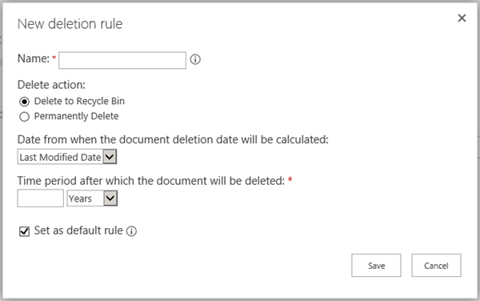
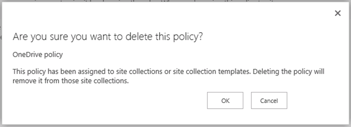

# Criar uma política de exclusão de documentos

> [!IMPORTANT]
> Em frente, recomendamos que você use uma política de retenção ou rótulos criados no centro &amp; de conformidade de segurança em vez de uma política de exclusão de documentos. As políticas de exclusão de documentos continuarão a funcionar lado a lado com políticas de retenção, mas se você precisar reter ou excluir conteúdo em qualquer lugar no Office 365, recomendamos que você use uma política de retenção. Para obter mais informações, consulte [usar uma política de retenção em vez desses recursos](retention-policies.md#use-a-retention-policy-instead-of-these-features). 
  
As organizações frequentemente são obrigadas a manter documentos por um determinado período devido a regulamentações de conformidade, legais ou outras. No entanto, reter os documentos por mais tempo do que o necessário poderá expor a organização a riscos legais.
  
Com uma política de exclusão de documentos, você pode reduzir o risco de forma proativa, excluindo documentos em um site após um período específico de tempo — por exemplo, você pode excluir documentos nos sites dos usuários do OneDrive for Business cinco anos depois que os documentos foram criados. 
  
Depois de criar uma política de exclusão de documentos, você poderá atribuí-la a um modelo de conjunto de sites, de forma que a política esteja disponível para todos os conjuntos de sites criados a partir desse modelo. Você pode ainda atribuir uma política a um conjunto específico de sites, que substitui qualquer política que possa ter sido atribuída ao modelo para esse conjunto de sites.
  

  
## Modelos de política

Você pode criar uma política de exclusão do documento do zero ou pode usar uma das políticas de amostra. A Central de Política de Conformidade inclui políticas de amostra que você pode usar como estão, ou como ponto de partida e, em seguida, renomeá-las ou modificá-las.
  

  
## Exemplos

Um conjunto de sites ou um modelo de conjunto de sites pode ter uma ou mais políticas atribuídas a ele, e cada uma dessas políticas pode ter uma ou mais regras. No enTanto, pode haver apenas uma política ativa por site e pode haver apenas uma regra de exclusão ativa a qualquer momento para as bibliotecas no site.
  

  
Além disso, você pode selecionar uma política como obrigatória ou padrão, e poderá selecionar uma regra de exclusão como uma regra padrão: 
  
- **Política obrigatória** Quando uma política é marcada como obrigatória, apenas uma política pode ser atribuída ao conjunto de sites ou modelo. A política deve ser marcada como padrão e será aplicada a todos os sites. Os proprietários do site não podem recusar a política.
    
- **Política padrão** Quando uma política é definida como padrão, a política é ativa automaticamente em todos os sites aos quais ela é atribuída sem nenhuma ação necessária para o proprietário do site.
    
- **Regra padrão** Quando uma regra de exclusão é definida como padrão, ela é automaticamente aplicada a todas as bibliotecas nos sites que usam a política.
    
Os exemplos a seguir explicam quando você pode querer usar uma política obrigatória ou políticas e regras padrão.
  
### Exemplo 1: aplicar uma política única com uma regra única a um modelo de conjunto de sites

Talvez você queira impor uma política de exclusão de documentos a uma ampla variedade de conteúdos não estruturados, como todos os sites do OneDrive for Business ou todos os sites de equipe. Se quiser garantir que uma única política de exclusão de documentos esteja ativa em todos os sites criados a partir de um modelo de conjunto de sites, você pode:
  
1. Criar uma única política com uma rúnica regra de exclusão padrão.
    
2. Definir a política como obrigatória e padrão.
    
3. Atribuir a política a um modelo de conjunto de sites.
    
Neste exemplo, a regra de exclusão padrão será aplicada a todas as bibliotecas em todos os conjuntos de sites criados a partir do modelo, e os proprietários do site não poderão recusar a política. Essa é a maneira mais simples de impor de forma ampla e rígida uma política de exclusão de documentos.
  

  
### Exemplo 2: aplicar uma única política com várias regras a um modelo de conjunto de sites

Os proprietários de site sabem melhor qual é o tipo de conteúdo de seus sites e, portanto, talvez você opte por permitir que os proprietários selecionem a regra de exclusão que se aplique melhor ao site deles. Talvez também queira permitir que os proprietários do site recusem completamente uma política.
  
Ao mesmo tempo, você ainda pode criar e gerenciar centralmente as políticas. Também é possível selecionar uma política e uma regra como o padrão, de forma que uma política esteja sempre em vigor até o proprietário do site escolha uma diferente ou a recuse. Se desejar fornecer essa flexibilidade a proprietários do site, você pode:
  
1. Criar uma única política com várias regras de exclusão e definir uma regra como padrão.
    
2. Definir a política como a política padrão.
    
3. Atribuir a política a um modelo de conjunto de sites.
    
Os proprietários do site podem selecionar uma das regras de exclusão alternativas, recusar a política ou fazer nada e ficarem sujeitos à política e à regra padrão.
  

  
### Exemplo 3: aplicar várias políticas com uma ou mais regras para um conjunto de sites

Este exemplo oferece a flexibilidade máxima a proprietários de sites, porque eles terão várias opções de políticas e, após a seleção de uma política, terão opções de várias regras. Uma política e uma regra estão definidas como padrão, de forma que uma política esteja sempre em vigor até que o proprietário do site escolha uma diferente ou a recuse. Observe que se você não definir uma política e uma regra como o padrão, então nenhuma política ou regra estará ativa para as bibliotecas de documentos no site até que o proprietário do site tome uma ação para selecioná-las e aplicá-las.
  
Ao contrário dos dois exemplos anteriores, essas políticas são atribuídas a um conjunto de sites específico e não ao modelo de conjunto de sites. Isso significa que as políticas poderão ser ajustadas mais especificamente para o conteúdo de um conjunto de sites específico.
  
Regras e políticas são herdadas. Os proprietários do site podem selecionar uma política e uma regra para seu site, e todos os subsites herdarão a política do site principal. Entretanto, um proprietário de um subsite poderá interromper a herança selecionando uma política e uma regra diferentes que, por sua vez, será aplicada a todos os subsites até a herança ser interrompida novamente.
  
Para configurar este cenário, você pode:
  
1. Criar várias políticas que contenham uma ou mais regras cada uma.
    
2. Definir uma política e uma regra como o padrão.
    
3. Atribuir as políticas a um conjunto de sites específico.
    
Além disso, as políticas e regras são ajustadas a um conjunto de sites específico, onde proprietários do site podem interromper a herança selecionando a política e a regra que melhor se aplique ao site.
  

  
## Criar uma política de exclusão de documentos

1. No centro de conformidade &amp; do Office 365Security, navegue até **retenção**de **Gerenciamento** \> de dados. Em **excluir**, clique em **gerenciar políticas de exclusão de documentos do SharePoint Online e do onedrive for Business**. A central de políticas de exclusão de documentos é aberta em uma nova guia do navegador.
    
    Na primeira vez que você navegar do centro &amp; de conformidade de segurança para a central de políticas de exclusão de documentos, a central de políticas será criada automaticamente para você. Como alternativa, você pode criar manualmente a central de políticas [criando o conjunto de sites](http://go.microsoft.com/fwlink/p/?LinkID=404342) e escolhendo **central de políticas de conformidade** na guia **empresa** . 
    
2. Escolha **políticas de exclusão**.
    
    
  
3. Escolha **novo item**.
    
4. Insira um nome de política e uma descrição. Os proprietários do site podem estar selecionando uma política para o site deles com base nesse nome e descrição, portanto inclua informações suficientes para que eles escolham a política correta.
    
5. Para criar uma regra, escolha **Novo**.
    
6. Insira um nome e escolha estas opções:
    
  - Escolha se a regra excluirá permanentemente os documentos ou as excluirá para a lixeira. A lixeira fornece uma rede de segurança de segundo estágio antes que um item seja excluído permanentemente de um site. Para obter mais informações sobre a lixeira, confira esVaziar [a lixeira ou restaurar seus arquivos](http://go.microsoft.com/fwlink/p/?LinkID=404348).
    
  - Escolha se a data de exclusão será calculada a partir da data em que um documento foi criado ou modificado pela última vez.
    
  - Insira um número de dias, meses ou anos como o período após o qual um documento será excluído.
    
  - Escolha se a regra será uma regra padrão. A primeira regra criada será automaticamente definida como a regra padrão. Uma regra padrão será automaticamente aplicada a todas as bibliotecas nos sites que usam a política.
    

  
7. Clique em **Salvar**.
    
8. Crie regras adicionais se quiser que proprietários do site sejam capazes de escolher regras diferentes para aplicarem ao site deles. A regra padrão, se houver, será aplicada se o proprietário do site não executar nenhuma ação.
    
9. Para remover uma regra de uma política, selecione a regra, clique em **excluir**e, em seguida, clique em **OK**.
    
    > [!NOTE]
    > Se você excluir uma regra e a política não contiver uma regra padrão, nenhuma regra será aplicada a essa política, em outras palavras, nenhum documento será excluído. 
  

  
## Atribuir a política de exclusão de documentos a um modelo de conjunto de sites

Atribuindo uma política a um modelo de conjunto de sites, você disponibiliza a política para todos os conjuntos de sites criados a partir desse modelo, incluindo conjuntos de sites existentes e conjuntos de sites criados no futuro.
  
É importante entender que o período de tempo especificado para uma política de exclusão de documentos significa o tempo desde que o documento foi criado ou modificado, não o tempo desde que a política foi atribuída. Quando você atribui a política pela primeira vez, todos os documentos no site são avaliados e, se eles atenderem aos critérios, serão excluídos. Isso se aplica a todos os documentos existentes, não apenas aos novos documentos criados desde que a política foi atribuída.
  
1. No centro de &amp; conformidade de segurança, navegue até **retenção**de **Gerenciamento** \> de dados. Em **excluir**, clique em **gerenciar políticas de exclusão de documentos do SharePoint Online e do onedrive for Business**. A central de políticas de exclusão de documentos é aberta em uma nova guia do navegador.
    
2. Escolha **Atribuições de políticas para modelos**.
    
    
  
3. Escolha **novo item**.
    
4. Siga um destes procedimentos:
    
  - Para atribuir a política a um modelo de conjunto de sites, como o modelo Site da Equipe, selecione **Atribuir ao modelo de conjunto de sites** e escolha o modelo de conjunto de sites.
    
  - Para atribuir a política à unidade de negócios de um dos usuários, escolha **atribuir ao modelo do onedrive for Business**, realçado abaixo.
    
    > [!NOTE]
    > Quando você atribuir uma política a um modelo de conjunto de sites, essa política estará disponível a conjuntos de sites existentes criados a partir desse modelo e para conjuntos de sites criados no futuro. 
  

  
5. Clique em **Salvar**.
    
    > [!NOTE]
    > Cada modelo pode ter apenas um conjunto de políticas atribuído a ele. Se você vir um erro dizendo que este modelo já tem políticas atribuídas a ele, escolha **Cancelar** \> **atribuir ao conjunto de sites** no painel \> de navegação à esquerda selecione um conjunto de sites para exibir e gerenciar o conjunto de políticas que já estão atribuí. 
  
6. Escolha **gerenciar políticas atribuídas**, selecione as políticas que você deseja atribuir e, em seguida, escolha se uma política é a política padrão. Quando você define uma política padrão, todos os sites atribuídos à política têm automaticamente a política ativa, sem nenhuma ação necessária para o proprietário do site.
    
    
  
7. Clique em **Salvar**.
    
8. Se quiser impor a política a todos os sites sem permitir que os proprietários do site a recusem, escolha **Marcar política como obrigatória**. Quando uma política for marcada como obrigatória, somente uma única política poderá ser atribuída ao modelo de conjunto de sites. A política também deve ser marcada como padrão.
    
    Se essa opção estiver esmaecida, escolha **Gerenciar políticas atribuídas** e verifique se pelo menos uma política foi atribuída e definida como padrão. 
    
9. Clique em **Salvar**.
    
## Atribuir a política de exclusão de documentos a um conjunto de sites

Ao atribuir uma política a um conjunto de sites específico, você disponibilizará a política somente àquele conjunto de sites específico. Isso significa que você poderá ajustar melhor as políticas ao conteúdo no conjunto de sites. Além disso, políticas atribuídas a um conjunto de sites específico substituirão todas as políticas atribuídas ao modelo para aquele conjunto de sites. Por exemplo, uma política atribuída ao conjunto de sites Departamento de Vendas (criado a partir do modelo Site da Equipe) substituirá qualquer política atribuída ao modelo Site da Equipe.
  
É importante entender que o período de tempo especificado para uma política de exclusão de documentos significa o tempo desde que o documento foi criado ou modificado, não o tempo desde que a política foi atribuída. Quando você atribui a política pela primeira vez, todos os documentos no site são avaliados e, se eles atenderem aos critérios, serão excluídos. Isso se aplica a todos os documentos existentes, não apenas aos novos documentos criados desde que a política foi atribuída.
  
1. No centro de &amp; conformidade de segurança, navegue até **retenção**de **Gerenciamento** \> de dados. Em **excluir**, escolha **gerenciar políticas de exclusão de documentos do SharePoint Online e do onedrive for Business**. A central de políticas de exclusão de documentos é aberta em uma nova guia do navegador.
    
2. Escolha **Atribuições de políticas para conjuntos de sites**.
    
    
  
3. Escolha **novo item**.
    
4. Escolha **escolher um conjunto de sites**. Procure o conjunto de sites por nome ou URL, selecione o conjunto de sites e clique em **salvar**.
    
    > [!NOTE]
    > Cada conjunto de sites pode ter apenas um conjunto de políticas atribuído a ele. Se você vir um erro dizendo que este conjunto de sites já tem políticas atribuídas a ele, escolha **Cancelar** \> **atribuir ao conjunto de sites** e selecione um conjunto de sites para exibir e gerenciar o conjunto de políticas que já estão atribuídas. 
  

  
5. Escolha **gerenciar políticas atribuídas**, selecione as políticas que você deseja atribuir e, em seguida, escolha se uma política é a política padrão. Quando você define uma política padrão, todos os sites atribuídos à política têm automaticamente a política ativa, sem nenhuma ação necessária para o proprietário do site.
    
    
  
6. Clique em **Salvar**.
    
7. Se quiser impor a política a todos os sites sem permitir que os proprietários do site a recusem, escolha **Marcar política como obrigatória**. Quando uma política for marcada como obrigatória, somente uma única política poderá ser atribuída ao conjunto de sites. A política também deve ser marcada como padrão.
    
    Se essa opção estiver esmaecida, escolha **Gerenciar políticas atribuídas** e verifique se pelo menos uma política foi atribuída e definida como padrão. 
    
8. Clique em **Salvar**.
    
## Excluir uma atribuição de política

Quando você excluir uma atribuição, as políticas atribuídas não se aplicarão mais a qualquer site do conjunto de sites ou do modelo de conjunto de sites.
  
1. No centro de &amp; conformidade de segurança, navegue até **retenção**de **Gerenciamento** \> de dados. Em **excluir**, escolha **gerenciar políticas de exclusão de documentos do SharePoint Online e do onedrive for Business**. A central de políticas de exclusão de documentos é aberta em uma nova guia do navegador.
    
2. Escolha uma destas opções **Atribuições de políticas para modelos** ou **Atribuições de políticas para conjuntos de sites**.
    
3. Selecione o item de atribuição e clique em **Excluir item**.
    
    
  
## Excluir uma política

Não é possível excluir uma política que está sendo usada. Antes de poder excluir uma política, primeiro é necessário excluir todas as atribuições de conjuntos de sites e modelos de conjunto de sites que incluam essa política: consulte a seção anterior.
  
1. &amp; No centro \> de conformidade de segurança, escolha **retenção** de gerenciamento \> \> de **dados** no painel de navegação à esquerda em **excluir** \> **gerenciar políticas de exclusão de documentos para o SharePoint Online e o onedrive para empresas**. A central de políticas de exclusão de documentos é aberta em uma nova guia do navegador.
    
2. Escolha * * políticas de exclusão * *.
    
    
  
3. Selecione a política.
    
4. Na guia \> **** \> itens da faixa de opções, **remova a política**.
    
    
  
5. Se a política estiver em uso, será perguntado se você deseja remover a política de todos os conjuntos de sites em que ele está sendo usado. Se tiver certeza, escolha **OK**.
    
    
  
## Confira também

[Visão geral das políticas de exclusão de documentos](document-deletion-policies.md)

[Aplicar ou remover uma política de exclusão de documentos de um site](apply-or-remove-a-document-deletion-policy-for-a-site.md)
 

