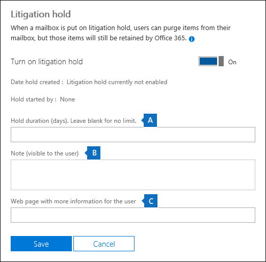
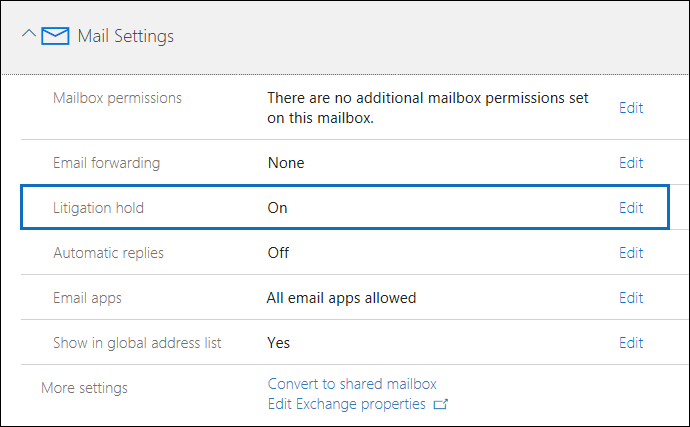

# Criar um litígio no Office 365Create a Litigation Hold in Office 365

Você pode colocar uma caixa de correio em retenção de litígio para reter todo o conteúdo de caixa de correio, incluindo itens excluídos e versões originais de itens modificados. Quando você realiza uma caixa de correio do usuário na retenção de litígio, conteúdo, na caixa de correio de arquivo morto do usuário (se ele estiver habilitado) também é mantido. Quando você cria uma pausa, você pode especificar uma duração de espera (também chamada de uma *baseadas em tempo de espera*) para que excluído e itens modificados são mantidos por um período especificado e excluídos permanentemente da caixa de correio. Ou você pode apenas reter conteúdo indefinidamente (chamado uma *espera infinita*) ou até que a retenção de litígio foi removida. Se você especificar uma período de duração de espera, ele é calculado a partir da data de uma mensagem é recebida ou um item de caixa de correio é criado.You can place a mailbox on Litigation Hold to retain all mailbox content, including deleted items and the original versions of modified items. When you place a user mailbox on Litigation Hold, content in the user's archive mailbox (if it's enabled) is also retained. When you create a hold, you can specify a hold duration (also called a *time-based hold*) so that deleted and modified items are retained for a specified period and then permanently deleted from the mailbox. Or you can just retain content indefinitely (called an *infinite hold*) or until the Litigation Hold is removed. If you do specify a hold duration period, it's calculated from the date a message is received or a mailbox item is created. 
  
Aqui está o que acontece quando você cria um litígio.Here's what happens when you create a Litigation Hold.
  
- Itens que são excluídos permanentemente pelo usuário são mantidos na pasta itens recuperáveis na caixa de correio do usuário para a duração da retenção.Items that are permanently deleted by the user are retained in the Recoverable Items folder in the user's mailbox for the duration of the hold.
    
- Itens que são removidos da pasta itens recuperáveis pelo usuário são retidos para a duração da retenção.Items that are purged from the Recoverable Items folder by the user are retained for the duration of the hold.
    
- A cota de armazenamento para a pasta itens recuperáveis é aumentada de 30 GB para 110 GB.The storage quota for the Recoverable Items folder is increased from 30 GB to 110 GB.
    
- Itens em primário do usuário e as caixas de correio de arquivo morto são mantidosItems in the user's primary and the archive mailboxes are retained
    
## Antes de começarBefore you begin

- Para colocar uma caixa de correio do Exchange Online em litígio, ele deve ser atribuído a uma licença do Exchange Online plano 2. Se uma caixa de correio for atribuída a uma licença do Exchange Online plano 1, você teria atribuí-lo de uma licença separada de arquivamento do Exchange Online para colocá-la em espera.To place an Exchange Online mailbox on Litigation Hold, it must be assigned an Exchange Online Plan 2 license. If a mailbox is assigned an Exchange Online Plan 1 license, you would have to assign it a separate Exchange Online Archiving license to place it on hold.
    

## Colocar uma caixa de correio em retenção de litígio no Centro de administração do Office 365Place a mailbox on Litigation Hold in the Office 365 admin center

Aqui estão as etapas para colocar um maibox em retenção de litígio usando o Centro de administração do Office 365.Here are the steps to place a maibox on Litigation Hold using the Office 365 admin center.

1. Vá para https://portal.office.com/adminportal/home e entrar usando sua conta de administrador global.Go to https://portal.office.com/adminportal/home and sign in using your global administrator account.
2. Clique em **usuários** > **usuários ativos** no painel de navegação à esquerda.Click **Users** > **Active users** in the left navigation pane.
3. Selecione o usuário cuja caixa de correio que você deseja colocar em retenção de litígio.Select the user whose mailbox you want to place on Litigation Hold.
4. Na página dinamicamente-out, clique em **configurações de email**e clique em **Editar** ao lado de **litígio**.On the fly-out page, click **Mail settings**, and then click **Edit** next to **Litigation hold**.
5. Na página de **litígio** , clique na alternância para ativar litígio e concluir as seguintes configurações opcionais que são exibidas:On the **Litigation hold** page, click the toggle to turn on Litigation Hold and complete the following optional settings that are displayed:
 
    

    r. **duração da retenção (dias)** -Use esta caixa para criar uma pausa baseadas em tempo e especifique por quanto tempo os itens de caixa de correio são mantidos quando a caixa de correio for colocada em retenção de litígio. A duração é calculada a partir da data de um item de caixa de correio é recebido ou criado. Se você deixar essa caixa em branco, os itens são mantidos indefinidamente ou até que a suspensão seja removida. Use dias para especificar a duração.a. **Hold duration (days)** - Use this box to create a time-based hold and specify how long mailbox items are held when the mailbox is placed on Litigation Hold. The duration is calculated from the date a mailbox item is received or created. If you leave this box blank, items are held indefinitely or until the hold is removed. Use days to specify the duration.
    
    b. **Nota** - Use esta caixa para informar ao usuário suas caixas de correio está em retenção de litígio. A nota será exibida na página informações da conta na caixa de correio do usuário, se estiver usando o Outlook 2010 ou posterior. Para acessar esta página, os usuários podem clicar o **arquivo** no Outlook.b. **Note** - Use this box to inform the user their mailbox is on Litigation Hold. The note will appear on the Account Information page in the user's mailbox if they're using Outlook 2010 or later. To access this page, users can click **File** in Outlook.
     
    c. a **página da Web** - Use esta caixa para direcionar o usuário para um site para obter mais informações sobre retenção de litígio. Essa URL aparece na página informações da conta na caixa de correio do usuário, se estiver usando o Outlook 2010 ou posterior. Para acessar esta página, os usuários podem clicar o **arquivo** no Outlook.c. **Web page** - Use this box to direct the user to a website for more information about Litigation Hold. This URL appears on the Account Information page in the user's mailbox if they are using Outlook 2010 or later. To access this page, users can click **File** in Outlook.
 
6. Clique em **Salvar** para criar o litígio.Click **Save** to create the Litigation Hold.

Depois de criar a retenção, as configurações de email na página dinamicamente-out mostra que litígio esteja ativado para o usuário selecionado.After you create the hold, the mail settings on the fly-out page shows that Litigation Hold is turned on for the selected user.

Para obter mais informações sobre como criar e gerenciar retenções de litígio e usando o PowerShell do Exchange Online para criação em massa litígio contém, consulte [colocar uma caixa de correio em retenção de litígio](https://docs.microsoft.com/office365/SecurityCompliance/place-a-mailbox-on-litigation-hold).For more information about creating and managing Litigation Holds and using Exchange Online PowerShell to bulk-create Litigation Holds, see [Place a mailbox on Litigation Hold](https://docs.microsoft.com/office365/SecurityCompliance/place-a-mailbox-on-litigation-hold).
