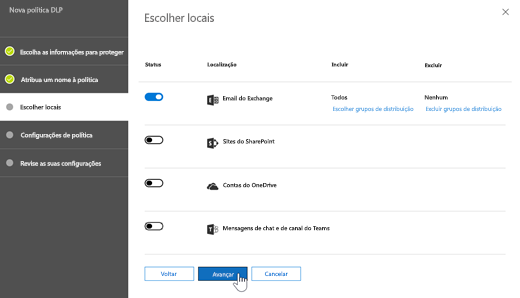
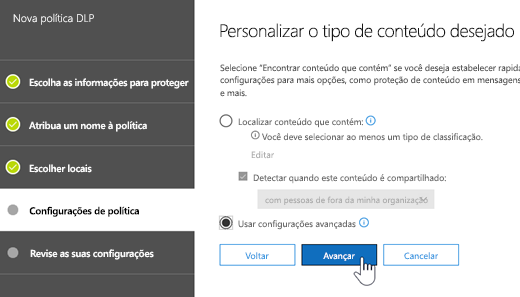
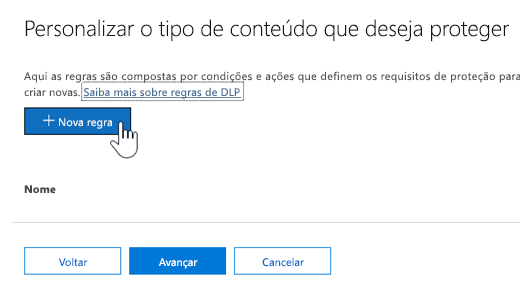
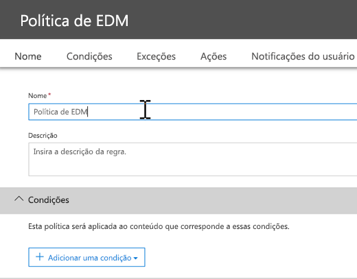
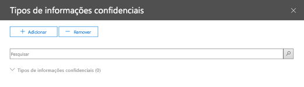

# <a name="create-custom-sensitive-information-types-with-exact-data-match-based-classification-preview"></a><span data-ttu-id="9a37c-103">Criar tipos personalizados de informações confidenciais com classificação baseada em Exact Data Match (visualização)</span><span class="sxs-lookup"><span data-stu-id="9a37c-103">See Create a custom sensitive information type with Exact Data Match based classification (Preview).</span></span>

## <a name="overview"></a><span data-ttu-id="9a37c-104">Visão Geral</span><span class="sxs-lookup"><span data-stu-id="9a37c-104">Overview</span></span>

<span data-ttu-id="9a37c-105">[Tipos personalizados de informações confidenciais](custom-sensitive-info-types.md) são usadas para ajudar a prevenir o compartilhamento acidental ou inadequado de informações confidenciais.</span><span class="sxs-lookup"><span data-stu-id="9a37c-105">[Custom sensitive information types](custom-sensitive-info-types.md) are used to help prevent inadvertent or inappropriate sharing of sensitive information.</span></span> <span data-ttu-id="9a37c-106">Como administrador, você pode usar o [Centro de Conformidade e Segurança](create-a-custom-sensitive-information-type.md) ou [PowerShell](create-a-custom-sensitive-information-type-in-scc-powershell.md) para definir um tipo personalizado de informação confidencial baseado em padrões, evidenciar (palavras-chave como *funcionário*, *crachá*, *ID* e assim por diante), proximidade de caractere (como evidência está próxima de caracteres em um padrão específico) e níveis de confiança.</span><span class="sxs-lookup"><span data-stu-id="9a37c-106">As an administrator, you can use the [Security & Compliance Center](create-a-custom-sensitive-information-type.md) or [PowerShell](create-a-custom-sensitive-information-type-in-scc-powershell.md) to define a custom sensitive information type based on patterns, evidence (keywords such as *employee*, *badge*, *ID*, and so on), character proximity (how close evidence is to characters in a particular pattern), and confidence levels.</span></span> <span data-ttu-id="9a37c-107">Esses tipos personalizados de informações confidenciais atendem às necessidades comerciais de várias organizações.</span><span class="sxs-lookup"><span data-stu-id="9a37c-107">Such custom sensitive information types meet business needs for many organizations.</span></span>

<span data-ttu-id="9a37c-108">Mas e se você quiser um tipo personalizado de informações confidenciais que usa valores de dados exatos, em vez de padrões e proximidade?</span><span class="sxs-lookup"><span data-stu-id="9a37c-108">But what if you wanted a custom sensitive information type that uses exact data values, instead of patterns and proximity?</span></span> <span data-ttu-id="9a37c-109">Com a classificação baseada em Exact Data Match (EDM), você pode criar um tipo personalizado de informações confidenciais que é criada para:</span><span class="sxs-lookup"><span data-stu-id="9a37c-109">With Exact Data Match (EDM)-based classification, you can create a custom sensitive information type that is designed to:</span></span>
- <span data-ttu-id="9a37c-110">ser dinâmico e atualizável.</span><span class="sxs-lookup"><span data-stu-id="9a37c-110">be dynamic and refreshable;</span></span>
- <span data-ttu-id="9a37c-111">ser mais escalonável;</span><span class="sxs-lookup"><span data-stu-id="9a37c-111">be more scalable;</span></span>
- <span data-ttu-id="9a37c-112">resultar em menos falso positivos.</span><span class="sxs-lookup"><span data-stu-id="9a37c-112">result in fewer false-positives;</span></span>
- <span data-ttu-id="9a37c-113">trabalhar com dados confidenciais estruturados;</span><span class="sxs-lookup"><span data-stu-id="9a37c-113">work with structured sensitive data;</span></span>
- <span data-ttu-id="9a37c-114">lidar com as informações confidenciais com mais segurança; e</span><span class="sxs-lookup"><span data-stu-id="9a37c-114">handle sensitive information more securely; and</span></span>
- <span data-ttu-id="9a37c-115">ser usado com vários serviços de nuvem da Microsoft.</span><span class="sxs-lookup"><span data-stu-id="9a37c-115">be used with several Microsoft cloud services.</span></span>


<span data-ttu-id="9a37c-117">A classificação baseada no EDM permite criar tipos personalizados de informações confidenciais que fazem referência a valores exatos em um banco de dados de informações confidenciais.</span><span class="sxs-lookup"><span data-stu-id="9a37c-117">EDM-based classification enables you to create custom sensitive information types that refer to exact values in a database of sensitive information.</span></span> <span data-ttu-id="9a37c-118">O banco de dados pode ser atualizado diariamente ou semanalmente, e pode conter até 10 milhões linhas de dados.</span><span class="sxs-lookup"><span data-stu-id="9a37c-118">The database can be refreshed daily or weekly, and it can contain up to 10 million rows of data.</span></span> <span data-ttu-id="9a37c-119">Assim como funcionários, pacientes ou clientes vêm e vão e os registros são alterados, os tipos personalizados de informações confidenciais permanecem atualizados e aplicáveis.</span><span class="sxs-lookup"><span data-stu-id="9a37c-119">So as employees, patients, or clients come and go, and records change, your custom sensitive information types remain current and applicable.</span></span> <span data-ttu-id="9a37c-120">Você também pode usar a classificação baseada em EDM com políticas, como [políticas de prevenção contra perda de dados](data-loss-prevention-policies.md) (DLP) ou [políticas de arquivo do Microsoft Cloud App Security](https://docs.microsoft.com/cloud-app-security/data-protection-policies).</span><span class="sxs-lookup"><span data-stu-id="9a37c-120">And, you can use EDM-based classification with policies, such as [data loss prevention policies](data-loss-prevention-policies.md) (DLP) or [Microsoft Cloud App Security file policies](https://docs.microsoft.com/cloud-app-security/data-protection-policies).</span></span>

## <a name="required-licenses-and-permissions"></a><span data-ttu-id="9a37c-121">Licenças e permissões necessárias</span><span class="sxs-lookup"><span data-stu-id="9a37c-121">Required licenses and permissions</span></span>

- <span data-ttu-id="9a37c-122">Você deve ser um administrador global, administrador de conformidade ou administrador do Exchange Online para executar as tarefas descritas neste artigo.</span><span class="sxs-lookup"><span data-stu-id="9a37c-122">You must be a global admin, compliance administrator, or Exchange Online administrator to perform the tasks described in this article.</span></span> <span data-ttu-id="9a37c-123">Para saber mais sobre permissões DLP, consulte [Permissões](data-loss-prevention-policies.md#permissions).</span><span class="sxs-lookup"><span data-stu-id="9a37c-123">To learn more about DLP permissions, see [Permissions](data-loss-prevention-policies.md#permissions).</span></span>

- <span data-ttu-id="9a37c-124">Quando estiver disponível geralmente, a classificação baseada em EDM será incluída nas seguintes assinaturas:</span><span class="sxs-lookup"><span data-stu-id="9a37c-124">When generally available, EDM-based classification will be included in the following subscriptions:</span></span>
    - <span data-ttu-id="9a37c-125">Office 365 E5</span><span class="sxs-lookup"><span data-stu-id="9a37c-125">Office 365 Enterprise E5</span></span>
    - <span data-ttu-id="9a37c-126">Microsoft 365 E5</span><span class="sxs-lookup"><span data-stu-id="9a37c-126">Microsoft 365 E5</span></span>
    - <span data-ttu-id="9a37c-127">Proteção de Informações e Conformidade do Microsoft 365</span><span class="sxs-lookup"><span data-stu-id="9a37c-127">Microsoft 365 Information Protection and Compliance</span></span>
    - <span data-ttu-id="9a37c-128">Conformidade Avançada do Office 365</span><span class="sxs-lookup"><span data-stu-id="9a37c-128">Office 365 Advanced Compliance</span></span>

> [!NOTE]
> <span data-ttu-id="9a37c-129">**Classificação baseada em EDM está atualmente em modo de visualização** para [DLP no Office 365](data-loss-prevention-policies.md) (com o Exchange Online e o Microsoft Teams) e o [Cloud App Security](https://docs.microsoft.com/cloud-app-security).</span><span class="sxs-lookup"><span data-stu-id="9a37c-129">**EDM-based classification is currently in preview** for [DLP in Office 365](data-loss-prevention-policies.md) (with Exchange Online and Microsoft Teams) and [Cloud App Security](https://docs.microsoft.com/cloud-app-security).</span></span> <span data-ttu-id="9a37c-130">Se a sua organização tiver [recursos DLP](https://docs.microsoft.com/office365/servicedescriptions/exchange-online-protection-service-description/messaging-policy-and-compliance-servicedesc#data-loss-prevention-dlp), você poderá testar a classificação baseada em EDM.</span><span class="sxs-lookup"><span data-stu-id="9a37c-130">If your organization has [DLP capabilities](https://docs.microsoft.com/office365/servicedescriptions/exchange-online-protection-service-description/messaging-policy-and-compliance-servicedesc#data-loss-prevention-dlp), you can try EDM-based classification.</span></span> <span data-ttu-id="9a37c-131">Se você ainda não estiver participando da visualização, [contatar a Microsoft](https://resources.office.com/us-landing-spe-contactus.html?LCID=EN-US) para começar.</span><span class="sxs-lookup"><span data-stu-id="9a37c-131">If you are not already participating in the preview, [contact Microsoft](https://resources.office.com/us-landing-spe-contactus.html?LCID=EN-US) to get started.</span></span> 

## <a name="the-work-flow-at-a-glance"></a><span data-ttu-id="9a37c-132">Visão geral do fluxo de trabalho </span><span class="sxs-lookup"><span data-stu-id="9a37c-132">The work flow at a glance</span></span>

|<span data-ttu-id="9a37c-133">Fase</span><span class="sxs-lookup"><span data-stu-id="9a37c-133">Phase</span></span>  |<span data-ttu-id="9a37c-134">Requisitos</span><span class="sxs-lookup"><span data-stu-id="9a37c-134">What's needed</span></span>  |
|---------|---------|
|[<span data-ttu-id="9a37c-135">Parte 1: Configuração da classificação baseada em EDM</span><span class="sxs-lookup"><span data-stu-id="9a37c-135">Part 1: Set up EDM-based classification</span></span>](#part-1-set-up-edm-based-classification)<br/><br/><span data-ttu-id="9a37c-136">(conforme o necessário)</span><span class="sxs-lookup"><span data-stu-id="9a37c-136">(As needed)</span></span><br/><span data-ttu-id="9a37c-137">- [Edite o Esquema de Banco de Dados](#editing-the-schema-for-edm-based-classification)</span><span class="sxs-lookup"><span data-stu-id="9a37c-137">- [Edit the database schema](#editing-the-schema-for-edm-based-classification)</span></span> <br/><span data-ttu-id="9a37c-138">- [Remova o esquema](#removing-the-schema-for-edm-based-classification)</span><span class="sxs-lookup"><span data-stu-id="9a37c-138">- [Remove the schema](#removing-the-schema-for-edm-based-classification)</span></span> |<span data-ttu-id="9a37c-139">– Acesso de leitura aos dados confidenciais</span><span class="sxs-lookup"><span data-stu-id="9a37c-139">- Read access to the sensitive data</span></span><br/><span data-ttu-id="9a37c-140">– Esquema de banco de dados no formato. XML (exemplo fornecido)</span><span class="sxs-lookup"><span data-stu-id="9a37c-140">- Database schema in .xml format (example provided)</span></span><br/><span data-ttu-id="9a37c-141">– Pacote de regras no formato. XML (exemplo fornecido)</span><span class="sxs-lookup"><span data-stu-id="9a37c-141">- Rule package in .xml format (example provided)</span></span><br/><span data-ttu-id="9a37c-142">– Permissões de administrador ao Centro de Conformidade e Segurança (usando o PowerShell)</span><span class="sxs-lookup"><span data-stu-id="9a37c-142">- Admin permissions to the Security & Compliance Center (using PowerShell)</span></span> |
|[<span data-ttu-id="9a37c-143">Parte 2: indexação e carregamento de dados confidenciais</span><span class="sxs-lookup"><span data-stu-id="9a37c-143">Part 2: Index and upload the sensitive data</span></span>](#part-2-index-and-upload-the-sensitive-data)<br/><br/><span data-ttu-id="9a37c-144">(conforme o necessário)</span><span class="sxs-lookup"><span data-stu-id="9a37c-144">(As needed)</span></span><br/>[<span data-ttu-id="9a37c-145">Atualize os dados</span><span class="sxs-lookup"><span data-stu-id="9a37c-145">Refresh the data</span></span>](#refreshing-your-sensitive-information-database) |<span data-ttu-id="9a37c-146">– Grupo de segurança personalizado e conta de usuário</span><span class="sxs-lookup"><span data-stu-id="9a37c-146">- Custom security group and user account</span></span><br/><span data-ttu-id="9a37c-147">– Acesso de administrador local à máquina com o agente de carregamento do EDM</span><span class="sxs-lookup"><span data-stu-id="9a37c-147">- Local admin access to machine with EDM Upload Agent</span></span><br/><span data-ttu-id="9a37c-148">– Acesso de leitura aos dados confidenciais</span><span class="sxs-lookup"><span data-stu-id="9a37c-148">- Read access to the sensitive data</span></span><br/><span data-ttu-id="9a37c-149">– Processar e agendar a atualização de dados</span><span class="sxs-lookup"><span data-stu-id="9a37c-149">- Process and schedule for refreshing the data</span></span>|
|[<span data-ttu-id="9a37c-150">Parte 3: uso da classificação baseada em EDM com os serviços de nuvem da Microsoft</span><span class="sxs-lookup"><span data-stu-id="9a37c-150">Part 3: Use EDM-based classification with your Microsoft cloud services</span></span>](#part-3-use-edm-based-classification-with-your-microsoft-cloud-services) |<span data-ttu-id="9a37c-151">– Sua assinatura com DLP do Office 365</span><span class="sxs-lookup"><span data-stu-id="9a37c-151">- Office 365 subscription with DLP</span></span><br/><span data-ttu-id="9a37c-152">– Recurso de classificação baseada em EDM habilitado (na visualização)</span><span class="sxs-lookup"><span data-stu-id="9a37c-152">- EDM-based classification feature enabled (in preview)</span></span> |

## <a name="part-1-set-up-edm-based-classification"></a><span data-ttu-id="9a37c-153">Parte 1: Configuração da classificação baseada em EDM</span><span class="sxs-lookup"><span data-stu-id="9a37c-153">Part 1: Set up EDM-based classification</span></span>

<span data-ttu-id="9a37c-154">Definição e configuração da classificação baseada em EDM envolve o salvamento de dados confidenciais no formato .csv, a definição de um esquema para seu banco de dados de informações confidenciais, a criação de um pacote de regras e o carregamento do esquema e do pacote de regras.</span><span class="sxs-lookup"><span data-stu-id="9a37c-154">Setting up and configuring EDM-based classification involves saving sensitive data in .csv format, defining a schema for your database of sensitive information, creating a rule package, and then uploading the schema and rule package.</span></span>

### <a name="define-the-schema-for-your-database-of-sensitive-information"></a><span data-ttu-id="9a37c-155">Definição do esquema para seu banco de dados de informações confidenciais</span><span class="sxs-lookup"><span data-stu-id="9a37c-155">Define the schema for your database of sensitive information</span></span>

1. <span data-ttu-id="9a37c-156">Identifique as informações confidenciais que deseja usar.</span><span class="sxs-lookup"><span data-stu-id="9a37c-156">Identify the KPIs that you want to use.</span></span> <span data-ttu-id="9a37c-157">Exporte os dados para um aplicativo, como o Microsoft Excel, e salve o arquivo no formato .csv.</span><span class="sxs-lookup"><span data-stu-id="9a37c-157">Export the data to an app, such as Microsoft Excel, and save the file in .csv format.</span></span> <span data-ttu-id="9a37c-158">O arquivo de dados pode incluir:</span><span class="sxs-lookup"><span data-stu-id="9a37c-158">The data file can include:</span></span>

    - <span data-ttu-id="9a37c-159">Até 10 milhões linhas de dados confidenciais</span><span class="sxs-lookup"><span data-stu-id="9a37c-159">Up to 10 million rows of sensitive data</span></span>
    - <span data-ttu-id="9a37c-160">Até 32 colunas (campos) por fonte de dados</span><span class="sxs-lookup"><span data-stu-id="9a37c-160">Up to 32 columns (fields) per data source</span></span>

2. <span data-ttu-id="9a37c-161">Estruture os dados confidenciais no arquivo .csv, de modo que a primeira linha inclui os nomes dos campos usados na classificação baseada em EDM.</span><span class="sxs-lookup"><span data-stu-id="9a37c-161">Structure the sensitive data in the .csv file such that the first row includes the names of the fields used for EDM-based classification.</span></span> <span data-ttu-id="9a37c-162">Você pode ter nomes de campo no arquivo .csv, como "CPF", "data de nascimento", "nome", "sobrenome" e assim por diante.</span><span class="sxs-lookup"><span data-stu-id="9a37c-162">In your .csv file, you might have field names, such as "ssn", "birthdate", "firstname", "lastname", and so on.</span></span> <span data-ttu-id="9a37c-163">Por exemplo, o arquivo. csv é chamado *PatientRecords.csv*, e suas colunas incluem *PatientID*, *número de prontuário médico*, *sobrenome*, *nome*, *CPF* e mais.</span><span class="sxs-lookup"><span data-stu-id="9a37c-163">As an example, our .csv file is called *PatientRecords.csv*, and its columns include *PatientID*, *MRN*, *lastname*, *FirstName*, *SSN* and more.</span></span>

3. <span data-ttu-id="9a37c-164">Defina o esquema para o banco de dados de informações confidenciais no formato .xml (semelhante ao nosso exemplo a seguir).</span><span class="sxs-lookup"><span data-stu-id="9a37c-164">Define the schema for the database of sensitive information in .xml format (similar to our example below).</span></span> <span data-ttu-id="9a37c-165">Nomeie esse esquema do arquivo `edm.xml` e configure-o para cada coluna no banco de dados, há uma linha que usa a sintaxe `<Field name="" unique="" searchable=""/>`.</span><span class="sxs-lookup"><span data-stu-id="9a37c-165">Name this schema file `edm.xml`, and configure it such that for each column in the database, there is a line that uses the syntax `<Field name="" unique="" searchable=""/>`.</span></span> 

    - <span data-ttu-id="9a37c-166">Use nomes da coluna para valores de *nome do campo*.</span><span class="sxs-lookup"><span data-stu-id="9a37c-166">Use column names for *Field name* values.</span></span>
    - <span data-ttu-id="9a37c-167">Use *unique="true"* para os campos que contêm valores exclusivos (CPF, números de identificação, etc.); caso contrário, *unique="false"*.</span><span class="sxs-lookup"><span data-stu-id="9a37c-167">Use *unique="true"* for the fields that contain unique values (Social Security numbers, identification numbers, etc.); otherwise, use *unique="false"*.</span></span>
    - <span data-ttu-id="9a37c-168">Use *searchable="true"* para os campos pesquisáveis.</span><span class="sxs-lookup"><span data-stu-id="9a37c-168">Use *searchable="true"* for the fields that you want to be searchable.</span></span> <span data-ttu-id="9a37c-169">Não especifique mais de cinco campos pesquisáveis por banco de dados.</span><span class="sxs-lookup"><span data-stu-id="9a37c-169">Do not specify more than five fields per database to be searchable.</span></span> <span data-ttu-id="9a37c-170">O restante deve ter *searchable="false"*.</span><span class="sxs-lookup"><span data-stu-id="9a37c-170">All the rest should have *searchable="false"*.</span></span>  

    <span data-ttu-id="9a37c-171">Por exemplo, o arquivo .xml a seguir define o esquema para um banco de dados de registros de paciente, com cinco campos especificados como pesquisável: *PatientID*, *Número de prontuário médico*, *CPF*, *Telefone*, e *data de nascimento*.</span><span class="sxs-lookup"><span data-stu-id="9a37c-171">As an example, the following .xml file defines the schema for a patient records database, with five fields specified as searchable: *PatientID*, *MRN*, *SSN*, *Phone*, and *DOB*.</span></span> 
    
    <span data-ttu-id="9a37c-172">(Você pode copiar, modificar e usar nosso exemplo.)</span><span class="sxs-lookup"><span data-stu-id="9a37c-172">(You can copy, modify, and use our example.)</span></span>
    
    ```<?xml version="1.0" encoding="utf-8"?>
    <EdmSchema xmlns="http://schemas.microsoft.com/office/2018/edm">
        <DataStore name="PatientRecords" description="Schema for patient records" version="1">
            <Field name="PatientID" unique="false" searchable="true" />
            <Field name="MRN" unique="false" searchable="true" />
            <Field name="FirstName" unique="false" searchable="false" />
            <Field name="LastName" unique="false" searchable="false" />
            <Field name="SSN" unique="false" searchable="true" />
            <Field name="Phone" unique="false" searchable="true" />
            <Field name="DOB" unique="false" searchable="true" />
            <Field name="Gender" unique="false" searchable="false" />
            <Field name="Address" unique="false" searchable="false" />
        </DataStore>
    </EdmSchema>
    ```

4. <span data-ttu-id="9a37c-173">[Conecte-se ao PowerShell do Centro de Conformidade e Segurança do Office 365](https://docs.microsoft.com/powershell/exchange/office-365-scc/connect-to-scc-powershell/connect-to-scc-powershell?view=exchange-ps).</span><span class="sxs-lookup"><span data-stu-id="9a37c-173">[Connect to Office 365 Security & Compliance Center PowerShell](https://docs.microsoft.com/powershell/exchange/office-365-scc/connect-to-scc-powershell/connect-to-scc-powershell?view=exchange-ps)</span></span>

5. <span data-ttu-id="9a37c-174">Para carregar o esquema do banco de dados, execute os seguintes cmdlets, um de cada vez:</span><span class="sxs-lookup"><span data-stu-id="9a37c-174">To upload the database schema, run the following cmdlets, one at a time:</span></span>

    `$edmSchemaXml=Get-Content .\edm.xml -Encoding Byte -ReadCount 0`

    `New-DlpEdmSchema -FileData $edmSchemaXml -Confirm:$true`

    <span data-ttu-id="9a37c-175">Você será solicitado a confirmar da seguinte maneira:</span><span class="sxs-lookup"><span data-stu-id="9a37c-175">You will be prompted to confirm, as follows:</span></span>

       Confirm
       Are you sure you want to perform this action?
       New EDM Schema for the data store 'patientrecords' will be imported.
       [Y] Yes  [A] Yes to All  [N] No  [L] No to All  [?] Help (default is "Y"):

    > [!TIP]
    > <span data-ttu-id="9a37c-176">Se você quiser que as suas alterações ocorram sem confirmação, na Etapa 5, use este cmdlet: `New-DlpEdmSchema -FileData $edmSchemaXml`</span><span class="sxs-lookup"><span data-stu-id="9a37c-176">If you want your changes to occur without confirmation, in Step 5, use this cmdlet instead: `New-DlpEdmSchema -FileData $edmSchemaXml`</span></span>
    
<span data-ttu-id="9a37c-177">Agora que o esquema para o seu banco de dados de informações confidenciais está definido, a próxima etapa é configurar um pacote de regras.</span><span class="sxs-lookup"><span data-stu-id="9a37c-177">Now that the schema for your database of sensitive information is defined, the next step is to set up a rule package.</span></span> <span data-ttu-id="9a37c-178">Continue na seção [Configurar um pacote de regras](#set-up-a-rule-package).</span><span class="sxs-lookup"><span data-stu-id="9a37c-178">Proceed to the section [Set up a rule package](#set-up-a-rule-package).</span></span>

#### <a name="editing-the-schema-for-edm-based-classification"></a><span data-ttu-id="9a37c-179">Editando o esquema para classificação baseada em EDM</span><span class="sxs-lookup"><span data-stu-id="9a37c-179">Editing the schema for EDM-based classification</span></span> 

<span data-ttu-id="9a37c-180">(Conforme necessário) Se você quiser fazer alterações em seu arquivo edm.xml, como alterar quais os campos usados para a classificação baseada em EDM, siga estas etapas:</span><span class="sxs-lookup"><span data-stu-id="9a37c-180">(As needed) If you want to make changes to your edm.xml file, such as changing which fields are used for EDM-based classification, follow these steps:</span></span>

1. <span data-ttu-id="9a37c-181">Edite o seu arquivo edm.xml (este é o arquivo discutido na seção [Definir o esquema](#define-the-schema-for-your-database-of-sensitive-information) deste artigo).</span><span class="sxs-lookup"><span data-stu-id="9a37c-181">Edit your edm.mxl file (this is the file discussed in the [Define the schema](#define-the-schema-for-your-database-of-sensitive-information) section of this article).</span></span>

2. <span data-ttu-id="9a37c-182">[Conecte-se ao PowerShell do Centro de Conformidade e Segurança do Office 365](https://docs.microsoft.com/powershell/exchange/office-365-scc/connect-to-scc-powershell/connect-to-scc-powershell?view=exchange-ps).</span><span class="sxs-lookup"><span data-stu-id="9a37c-182">[Connect to Office 365 Security & Compliance Center PowerShell](https://docs.microsoft.com/powershell/exchange/office-365-scc/connect-to-scc-powershell/connect-to-scc-powershell?view=exchange-ps)</span></span>

3. <span data-ttu-id="9a37c-183">Para atualizar o seu esquema do banco de dados, execute os seguintes cmdlets, um de cada vez:</span><span class="sxs-lookup"><span data-stu-id="9a37c-183">To update your database schema, run the following cmdlets, one at a time:</span></span>

    `$edmSchemaXml=Get-Content .\edm.xml -Encoding Byte -ReadCount 0`

    `Set-DlpEdmSchema -FileData $edmSchemaXml -Confirm:$true`

    <span data-ttu-id="9a37c-184">Você será solicitado a confirmar da seguinte maneira:</span><span class="sxs-lookup"><span data-stu-id="9a37c-184">You will be prompted to confirm, as follows:</span></span>

       Confirm
       Are you sure you want to perform this action?
       EDM Schema for the data store 'patientrecords' will be updated.
       [Y] Yes  [A] Yes to All  [N] No  [L] No to All  [?] Help (default is "Y"):

    > [!TIP]
    > <span data-ttu-id="9a37c-185">Se você quiser que as suas alterações ocorram sem confirmação, na Etapa 3, use este cmdlet: `Set-DlpEdmSchema -FileData $edmSchemaXml`</span><span class="sxs-lookup"><span data-stu-id="9a37c-185">If you want your changes to occur without confirmation, in Step 3, use this cmdlet instead: `Set-DlpEdmSchema -FileData $edmSchemaXml`</span></span>

#### <a name="removing-the-schema-for-edm-based-classification"></a><span data-ttu-id="9a37c-186">Removendo o esquema para classificação baseada em EDM</span><span class="sxs-lookup"><span data-stu-id="9a37c-186">Removing the schema for EDM-based classification</span></span>

<span data-ttu-id="9a37c-187">(Conforme necessário) Se você quiser remover o esquema que está usando para classificação baseada em EDM, siga estas etapas:</span><span class="sxs-lookup"><span data-stu-id="9a37c-187">(As needed) If you want to remove the schema you're using for EDM-based classification, follow these steps:</span></span>

1. <span data-ttu-id="9a37c-188">[Conecte-se ao PowerShell do Centro de Conformidade e Segurança do Office 365](https://docs.microsoft.com/powershell/exchange/office-365-scc/connect-to-scc-powershell/connect-to-scc-powershell?view=exchange-ps).</span><span class="sxs-lookup"><span data-stu-id="9a37c-188">[Connect to Office 365 Security & Compliance Center PowerShell](https://docs.microsoft.com/powershell/exchange/office-365-scc/connect-to-scc-powershell/connect-to-scc-powershell?view=exchange-ps)</span></span>

2. <span data-ttu-id="9a37c-189">Execute o seguinte cmdlet do PowerShell, substituindo o nome do repositório de dados de "patientrecords" pelo nome que você deseja remover:</span><span class="sxs-lookup"><span data-stu-id="9a37c-189">Run the following PowerShell cmdlet, substituting the data store name of "patientrecords" with the one you want to remove:</span></span>

    `Remove-DlpEdmSchema -Identity patientrecords`

     <span data-ttu-id="9a37c-190">Você será solicitado a confirmar da seguinte maneira:</span><span class="sxs-lookup"><span data-stu-id="9a37c-190">You will be prompted to confirm, as follows:</span></span>
    
       Confirm
       Are you sure you want to perform this action?
       EDM Schema for the data store 'patientrecords' will be removed.
       [Y] Yes  [A] Yes to All  [N] No  [L] No to All  [?] Help (default is "Y"):
    
    > [!TIP]
    > <span data-ttu-id="9a37c-191">Se você quiser que as suas alterações ocorram sem confirmação, na Etapa 2, use este cmdlet: `Remove-DlpEdmSchema -Identity patientrecords -Confirm:$false`</span><span class="sxs-lookup"><span data-stu-id="9a37c-191">If you want your changes to occur without confirmation, in Step 2, use this cmdlet instead: `Remove-DlpEdmSchema -Identity patientrecords -Confirm:$false`</span></span>

### <a name="set-up-a-rule-package"></a><span data-ttu-id="9a37c-192">Configurar um pacote de regras</span><span class="sxs-lookup"><span data-stu-id="9a37c-192">Set up a rule package</span></span>

1. <span data-ttu-id="9a37c-193">Crie um pacote de regras no formato .xml (com codificação Unicode), semelhante ao exemplo a seguir.</span><span class="sxs-lookup"><span data-stu-id="9a37c-193">Create a rule package in .xml format (with Unicode encoding), similar to the following example.</span></span> <span data-ttu-id="9a37c-194">(Você pode copiar, modificar e usar nosso exemplo.)</span><span class="sxs-lookup"><span data-stu-id="9a37c-194">(You can copy, modify, and use our example.)</span></span> 

   <span data-ttu-id="9a37c-195">Lembre-se do procedimento anterior onde o nosso esquema PatientRecords define cinco campos como pesquisáveis: *PatientID*, *MRN*, *SSN*, *Phone* e *DOB*.</span><span class="sxs-lookup"><span data-stu-id="9a37c-195">Recall from the previous procedure that our PatientRecords schema defines five fields as searchable: *PatientID*, *MRN*, *SSN*, *Phone*, and *DOB*.</span></span> <span data-ttu-id="9a37c-196">O nosso pacote de regras de exemplo inclui esses campos e faz referência ao arquivo de esquema do banco de dados (edm.xml), com um item *ExactMatch* por campo pesquisável.</span><span class="sxs-lookup"><span data-stu-id="9a37c-196">Our example rule package includes those fields and references the database schema file (edm.xml), with one *ExactMatch* items per searchable field.</span></span> <span data-ttu-id="9a37c-197">Considere o seguinte item ExactMatch:</span><span class="sxs-lookup"><span data-stu-id="9a37c-197">Consider the following ExactMatch item:</span></span>

   ```
    <ExactMatch id = "E1CC861E-3FE9-4A58-82DF-4BD259EAB371" patternsProximity = "300" dataStore ="PatientRecords" recommendedConfidence = "65" >
      <Pattern confidenceLevel="65">
        <idMatch matches = "SSN" classification = "U.S. Social Security Number (SSN)" />
      </Pattern>
    </ExactMatch>
   ```

    <span data-ttu-id="9a37c-198">Neste exemplo, observe o seguinte:</span><span class="sxs-lookup"><span data-stu-id="9a37c-198">In connection with this point, note the following:</span></span>

    - <span data-ttu-id="9a37c-199">O nome do dataStore faz referência ao arquivo .csv que criamos anteriormente: **dataStore = "PatientRecords"**.</span><span class="sxs-lookup"><span data-stu-id="9a37c-199">The dataStore name references the .csv file we created earlier: **dataStore = "PatientRecords"**.</span></span>
    - <span data-ttu-id="9a37c-200">O valor idMatch faz referência a um campo pesquisável listado no arquivo de esquema do banco de dados: **idMatch matches = "SSN"**.</span><span class="sxs-lookup"><span data-stu-id="9a37c-200">The idMatch value references a searchable field that is listed in the database schema file: **idMatch matches = "SSN"**.</span></span>
    - <span data-ttu-id="9a37c-201">O valor de classificação faz referência a um tipo de informação confidencial existente ou personalizada: **classification = "Número de Seguridade Social dos EUA (SSN)"**.</span><span class="sxs-lookup"><span data-stu-id="9a37c-201">The classification value references an existing or custom sensitive information type: **classification = "U.S. Social Security Number (SSN)"**.</span></span> <span data-ttu-id="9a37c-202">(Nesse caso, usamos o tipo de informação confidencial existente do Número de Seguridade Social dos EUA.)</span><span class="sxs-lookup"><span data-stu-id="9a37c-202">(In this case, we use the existing sensitive information type of U.S. Social Security Number.)</span></span>

    <span data-ttu-id="9a37c-203">Ao configurar o seu pacote de regras, certifique-se de referenciar corretamente o arquivo .csv e o arquivo edm.xml.</span><span class="sxs-lookup"><span data-stu-id="9a37c-203">When you set up your rule package, make sure to correctly reference your .csv file and edm.xml file.</span></span> <span data-ttu-id="9a37c-204">(Você pode copiar, modificar e usar nosso exemplo.)</span><span class="sxs-lookup"><span data-stu-id="9a37c-204">(You can copy, modify, and use our example.)</span></span> 

    ```<?xml version="1.0" encoding="utf-8"?>
    <RulePackage xmlns="http://schemas.microsoft.com/office/2018/edm">
      <RulePack id="fd098e03-1796-41a5-8ab6-198c93c62b11">
        <Version build="0" major="2" minor="0" revision="0" />
        <Publisher id="eb553734-8306-44b4-9ad5-c388ad970528" />
        <Details defaultLangCode="en-us">
          <LocalizedDetails langcode="en-us">
            <PublisherName>IP DLP</PublisherName>
            <Name>Health Care EDM Rulepack</Name>
            <Description>This rule package contains the EDM sensitive type for health care sensitive types.</Description>
          </LocalizedDetails>
        </Details>
      </RulePack>
      <Rules>
        <ExactMatch id = "E1CC861E-3FE9-4A58-82DF-4BD259EAB371" patternsProximity = "300" dataStore ="PatientRecords" recommendedConfidence = "65" >
          <Pattern confidenceLevel="65">
            <idMatch matches = "SSN" classification = "U.S. Social Security Number (SSN)" />
          </Pattern>
          <Pattern confidenceLevel="75">
            <idMatch matches = "SSN" classification = "U.S. Social Security Number (SSN)" />
            <Any minMatches ="3" maxMatches ="100">
              <match matches="PatientID" />
              <match matches="MRN"/>
              <match matches="FirstName"/>
              <match matches="LastName"/>
              <match matches="Phone"/>
              <match matches="DOB"/>
            </Any>
          </Pattern>
        </ExactMatch>
        <LocalizedStrings>
          <Resource idRef="E1CC861E-3FE9-4A58-82DF-4BD259EAB371">
            <Name default="true" langcode="en-us">Patient SSN Exact Match.</Name>
            <Description default="true" langcode="en-us">EDM Sensitive type for detecting Patient SSN.</Description>
          </Resource>
        </LocalizedStrings>
      </Rules>
    </RulePackage>
    ```
    
2. <span data-ttu-id="9a37c-205">Carregue o pacote de regras executando os seguintes cmdlets do PowerShell, um de cada vez:</span><span class="sxs-lookup"><span data-stu-id="9a37c-205">Upload the rule package by running the following PowerShell cmdlets, one at a time:</span></span>

    `$rulepack=Get-Content .\rulepack.xml -Encoding Byte -ReadCount 0`

    `New-DlpSensitiveInformationTypeRulePackage -FileData $rulepack`

<span data-ttu-id="9a37c-206">Nesse ponto, você configurou a classificação baseada em EDM.</span><span class="sxs-lookup"><span data-stu-id="9a37c-206">At this point, you have set up EDM-based classification.</span></span> <span data-ttu-id="9a37c-207">A próxima etapa é indexar os dados confidenciais e carregá-los.</span><span class="sxs-lookup"><span data-stu-id="9a37c-207">The next step is to index the sensitive data, and then upload the indexed data.</span></span> 

## <a name="part-2-index-and-upload-the-sensitive-data"></a><span data-ttu-id="9a37c-208">Parte 2: indexação e carregamento de dados confidenciais</span><span class="sxs-lookup"><span data-stu-id="9a37c-208">Part 2: Index and upload the sensitive data</span></span>

<span data-ttu-id="9a37c-209">Durante essa fase, você configura um grupo de segurança personalizado e uma conta de usuário, e configura a ferramenta do agente de carregamento do EDM.</span><span class="sxs-lookup"><span data-stu-id="9a37c-209">During this phase, you set up a custom security group and user account, and set up the EDM Upload Agent tool.</span></span> <span data-ttu-id="9a37c-210">Depois indexe os dados confidenciais e carregá-los.</span><span class="sxs-lookup"><span data-stu-id="9a37c-210">Then, you use the tool to index the sensitive data, and upload the indexed data.</span></span>

### <a name="set-up-the-security-group-and-user-account"></a><span data-ttu-id="9a37c-211">Configuração do grupo de segurança e conta de usuário</span><span class="sxs-lookup"><span data-stu-id="9a37c-211">Set up the security group and user account</span></span>

1. <span data-ttu-id="9a37c-212">Como um administrador global, acesse o centro de administração ([https://admin.microsoft.com](https://admin.microsoft.com)) e [crie um grupo de segurança](https://docs.microsoft.com/office365/admin/email/create-edit-or-delete-a-security-group?view=o365-worldwide) chamado `EDM_DataUploaders`.</span><span class="sxs-lookup"><span data-stu-id="9a37c-212">As a global administrator, go to the admin center ([https://admin.microsoft.com](https://admin.microsoft.com)) and [create a security group](https://docs.microsoft.com/office365/admin/email/create-edit-or-delete-a-security-group?view=o365-worldwide) called `EDM_DataUploaders`.</span></span> 

2. <span data-ttu-id="9a37c-213">Adicione um ou mais usuários ao grupo de segurança *EDM_DataUploaders*.</span><span class="sxs-lookup"><span data-stu-id="9a37c-213">Add one or more users to the *EDM_DataUploaders* security group.</span></span> <span data-ttu-id="9a37c-214">(Esses usuários vão gerenciar o banco de dados de informações confidenciais.)</span><span class="sxs-lookup"><span data-stu-id="9a37c-214">(These users will manage the database of sensitive information.)</span></span>

3. <span data-ttu-id="9a37c-215">Certifique-se de que todos os usuários que estão gerenciando os dados confidenciais sejam um administrador local no computador usado para o agente de carregamento do EDM.</span><span class="sxs-lookup"><span data-stu-id="9a37c-215">Make sure each user who is managing the sensitive data is a local admin on the machine used for the EDM Upload Agent.</span></span>

### <a name="set-up-the-edm-upload-agent"></a><span data-ttu-id="9a37c-216">Configurar o agente de carregamento do EDM</span><span class="sxs-lookup"><span data-stu-id="9a37c-216">Set up the EDM Upload Agent</span></span>

> [!NOTE]
> <span data-ttu-id="9a37c-217">Antes de iniciar esse procedimento, certifique-se de que você é um membro do grupo de segurança *EDM_DataUploaders* e de um administrador local no computador.</span><span class="sxs-lookup"><span data-stu-id="9a37c-217">Before you begin this procedure, make sure that you are a member of the *EDM_DataUploaders* security group and a local admin on your machine.</span></span>

1. <span data-ttu-id="9a37c-218">Baixe e instale o agente de carregamento do EDM em [https://go.microsoft.com/fwlink/?linkid=2088639](https://go.microsoft.com/fwlink/?linkid=2088639).</span><span class="sxs-lookup"><span data-stu-id="9a37c-218">Download and install the EDM Upload Agent at [https://go.microsoft.com/fwlink/?linkid=2088639](https://go.microsoft.com/fwlink/?linkid=2088639).</span></span> <span data-ttu-id="9a37c-219">Por padrão, o local de instalação do deve ser `C:\Program Files\Microsoft\EdmUploadAgent`.</span><span class="sxs-lookup"><span data-stu-id="9a37c-219">By default, the installation location should be `C:\Program Files\Microsoft\EdmUploadAgent`.</span></span> 

2. <span data-ttu-id="9a37c-220">Para autorizar o agente de carregamento do EDM, abra o prompt de comando do Windows (como um administrador) e execute o seguinte comando:</span><span class="sxs-lookup"><span data-stu-id="9a37c-220">To authorize the EDM Upload Agent, open Windows Command Prompt (as an administrator), and then run the following command:</span></span>

    `EdmUploadAgent.exe /Authorize`

3. <span data-ttu-id="9a37c-221">Entre com sua conta corporativa ou de estudante do Office 365.</span><span class="sxs-lookup"><span data-stu-id="9a37c-221">Sign in to Office 365 for business with your work or school account.</span></span>

<span data-ttu-id="9a37c-222">A próxima etapa é usar o agente de carregamento do EDM para indexar os dados confidenciais e depois carregá-los.</span><span class="sxs-lookup"><span data-stu-id="9a37c-222">The next step is to use the EDM Upload Agent to index the sensitive data, and then upload the indexed data.</span></span>

### <a name="index-and-upload-the-sensitive-data"></a><span data-ttu-id="9a37c-223">Indexação e carregamento de dados confidenciais</span><span class="sxs-lookup"><span data-stu-id="9a37c-223">Index and upload the sensitive data</span></span>

1. <span data-ttu-id="9a37c-224">Salve o arquivo de dados confidenciais (Lembre-se de que o nosso exemplo é *PatientRecords.csv*) para a unidade local no computador.</span><span class="sxs-lookup"><span data-stu-id="9a37c-224">Save the sensitive data file (recall our example is *PatientRecords.csv*) to the local drive on the machine.</span></span> <span data-ttu-id="9a37c-225">(Salvamos o arquivo do nosso exemplo *PatientRecords.csv* em `C:\Edm\Data`.)</span><span class="sxs-lookup"><span data-stu-id="9a37c-225">(We saved our example *PatientRecords.csv* file to `C:\Edm\Data`.)</span></span>

2. <span data-ttu-id="9a37c-226">Para indexar os dados confidenciais, execute o seguinte comando no prompt de comando do Windows:</span><span class="sxs-lookup"><span data-stu-id="9a37c-226">To index the sensitive data, run the following command in Windows Command Prompt:</span></span>

    `EdmUploadAgent.exe /CreateHash /DataStoreName <DataStoreName> /DataFile <DataFilePath> /HashLocation <HashedFileLocation>`

    <span data-ttu-id="9a37c-227">Exemplo: **EdmUploadAgent.exe /CreateHash /DataStoreName PatientRecords /DataFile C:\Edm\Data\PatientRecords.csv /HashLocation C:\Edm\Hash**</span><span class="sxs-lookup"><span data-stu-id="9a37c-227">Example: **EdmUploadAgent.exe /CreateHash /DataStoreName PatientRecords /DataFile C:\Edm\Data\PatientRecords.csv /HashLocation C:\Edm\Hash**</span></span> 

3. <span data-ttu-id="9a37c-228">Para indexar os dados indexados, execute o seguinte comando no prompt de comando do Windows:</span><span class="sxs-lookup"><span data-stu-id="9a37c-228">To upload the indexed data, run the following command in Windows Command Prompt:</span></span>

    `EdmUploadAgent.exe /UploadHash /DataStoreName <DataStoreName> /HashFile <HashedSourceFilePath>`

    <span data-ttu-id="9a37c-229">Exemplo: **EdmUploadAgent.exe /UploadHash /DataStoreName PatientRecords /HashFile C:\Edm\Hash\PatientRecords.EdmHash**</span><span class="sxs-lookup"><span data-stu-id="9a37c-229">Example: **EdmUploadAgent.exe /UploadHash /DataStoreName PatientRecords /HashFile C:\Edm\Hash\PatientRecords.EdmHash**</span></span> 

4. <span data-ttu-id="9a37c-230">Para verificar os dados confidenciais indexados, execute o seguinte comando no prompt de comando do Windows:</span><span class="sxs-lookup"><span data-stu-id="9a37c-230">To verify your sensitive data has been uploaded, run the following command in Windows Command Prompt:</span></span>

    `EdmUploadAgent.exe /GetDataStore`

    <span data-ttu-id="9a37c-231">Você verá uma lista de repositórios de dados e a data da última atualização, similar à seguinte:</span><span class="sxs-lookup"><span data-stu-id="9a37c-231">You'll see a list of data stores and when they were last updated, similar to the following:</span></span> <br/>

5. <span data-ttu-id="9a37c-233">Prossiga para configurar seu processo e cronograma da [Atualização de banco de dados de informação confidencial](#refreshing-your-sensitive-information-database).</span><span class="sxs-lookup"><span data-stu-id="9a37c-233">Proceed to set up your process and schedule for [Refreshing your sensitive information database](#refreshing-your-sensitive-information-database).</span></span>

<span data-ttu-id="9a37c-234">Nesse ponto, você já usou a classificação baseada em EDM com os serviços de nuvem da Microsoft.</span><span class="sxs-lookup"><span data-stu-id="9a37c-234">At this point, you are ready to use EDM-based classification with your Microsoft cloud services.</span></span> <span data-ttu-id="9a37c-235">Por exemplo, você pode [configurar uma política usando a classificação baseada em EDM](#to-create-a-dlp-policy-with-edm).</span><span class="sxs-lookup"><span data-stu-id="9a37c-235">For example, you can [set up a DLP policy using EDM-based classification](#to-create-a-dlp-policy-with-edm).</span></span> 

### <a name="refreshing-your-sensitive-information-database"></a><span data-ttu-id="9a37c-236">Atualização do banco de dados de informações confidenciais</span><span class="sxs-lookup"><span data-stu-id="9a37c-236">Refreshing your sensitive information database</span></span>

<span data-ttu-id="9a37c-237">Você pode atualizar seu banco de dados confidenciais diariamente ou semanalmente, e a ferramenta de carregamento do EDM pode reindexar os dados confidenciais e depois recarregar os dados indexados.</span><span class="sxs-lookup"><span data-stu-id="9a37c-237">You can refresh your sensitive information database daily or weekly, and the EDM Upload Tool can reindex the sensitive data and then reupload the indexed data.</span></span> 

1. <span data-ttu-id="9a37c-238">Determine seu processo e a frequência (diariamente ou semanalmente) para atualização do banco de dados de informações confidenciais.</span><span class="sxs-lookup"><span data-stu-id="9a37c-238">Determine your process and frequency (daily or weekly) for refreshing the database of sensitive information.</span></span>

2. <span data-ttu-id="9a37c-239">Exporte novamente os dados confidenciais para um aplicativo, como o Microsoft Excel, e salve o arquivo no formato .csv.</span><span class="sxs-lookup"><span data-stu-id="9a37c-239">Re-export the sensitive data to an app, such as Microsoft Excel, and save the file in .csv format.</span></span> <span data-ttu-id="9a37c-240">Mantenha o mesmo nome do arquivo e o local que você usou ao seguir as etapas descritas em [indexação e carregamento de dados confidenciais](#index-and-upload-the-sensitive-data).</span><span class="sxs-lookup"><span data-stu-id="9a37c-240">Keep the same file name and location you used when you followed the steps described in [Index and upload the sensitive data](#index-and-upload-the-sensitive-data).</span></span>

    > [!NOTE]
    > <span data-ttu-id="9a37c-241">Se não houver alterações na estrutura (nomes de campos) do arquivo .csv, você não precisará fazer alterações no arquivo de esquema do banco de dados ao atualizar os dados.</span><span class="sxs-lookup"><span data-stu-id="9a37c-241">If there are no changes to the structure (field names) of the .csv file, you won't need to make any changes to your database schema file when you refresh the data.</span></span> <span data-ttu-id="9a37c-242">Mas se for necessário fazer alterações, não deixe de editar o [esquema de banco de dados](#editing-the-schema-for-edm-based-classification) e seu [pacote de regra](#set-up-a-rule-package) correspondente.</span><span class="sxs-lookup"><span data-stu-id="9a37c-242">But if you must make changes, make sure to edit the [database schema](#editing-the-schema-for-edm-based-classification) and your [rule package](#set-up-a-rule-package) accordingly.</span></span>        

3. <span data-ttu-id="9a37c-243">Use o [Agendador de tarefas](https://docs.microsoft.com/windows/desktop/TaskSchd/task-scheduler-start-page) para automatizar as etapas 2 e 3 no procedimento de [indexação e carregamento de dados confidenciais](#index-and-upload-the-sensitive-data).</span><span class="sxs-lookup"><span data-stu-id="9a37c-243">Use [Task Scheduler](https://docs.microsoft.com/windows/desktop/TaskSchd/task-scheduler-start-page) to automate steps 2 and 3 in the [Index and upload the sensitive data](#index-and-upload-the-sensitive-data) procedure.</span></span> <span data-ttu-id="9a37c-244">Você pode agendar tarefas usando vários métodos:</span><span class="sxs-lookup"><span data-stu-id="9a37c-244">You can schedule tasks using several methods:</span></span>
    
    |<span data-ttu-id="9a37c-245">Método</span><span class="sxs-lookup"><span data-stu-id="9a37c-245">Method</span></span>  |<span data-ttu-id="9a37c-246">O que fazer</span><span class="sxs-lookup"><span data-stu-id="9a37c-246">What not to do</span></span>  |
    |---------|---------|
    |<span data-ttu-id="9a37c-247">Windows PowerShell</span><span class="sxs-lookup"><span data-stu-id="9a37c-247">Windows PowerShell</span></span>     |<span data-ttu-id="9a37c-248">Confira a documentação do [ScheduledTasks](https://docs.microsoft.com/powershell/module/scheduledtasks/?view=win10-ps) e o [exemplo do script do PowerShell](#example-powershell-script-for-task-scheduler) neste artigo</span><span class="sxs-lookup"><span data-stu-id="9a37c-248">See the [ScheduledTasks](https://docs.microsoft.com/powershell/module/scheduledtasks/?view=win10-ps) documentation and the [example PowerShell script](#example-powershell-script-for-task-scheduler) in this article</span></span>|
    |<span data-ttu-id="9a37c-249">API do Agendador de Tarefas</span><span class="sxs-lookup"><span data-stu-id="9a37c-249">Task Scheduler API</span></span> |<span data-ttu-id="9a37c-250">Confira a documentação do [Agendador de tarefas](https://docs.microsoft.com/windows/desktop/TaskSchd/using-the-task-scheduler)</span><span class="sxs-lookup"><span data-stu-id="9a37c-250">See the [Task Scheduler](https://docs.microsoft.com/windows/desktop/TaskSchd/using-the-task-scheduler) documentation</span></span> |
    |<span data-ttu-id="9a37c-251">Interface do usuário do Windows</span><span class="sxs-lookup"><span data-stu-id="9a37c-251">Windows user interface</span></span>     |<span data-ttu-id="9a37c-252">No Windows, clique em **Iniciar** e insira `Task Scheduler`.</span><span class="sxs-lookup"><span data-stu-id="9a37c-252">In Windows, click **Start**, and type `Task Scheduler`.</span></span> <span data-ttu-id="9a37c-253">Em seguida, na lista de resultados, clique com o botão direito do mouse no **Agendador de Tarefas**, e escolha **executar como administrador**.</span><span class="sxs-lookup"><span data-stu-id="9a37c-253">Then, in the list of results, right-click **Task Scheduler**, and choose **Run as administrator**.</span></span>          |

#### <a name="example-powershell-script-for-task-scheduler"></a><span data-ttu-id="9a37c-254">Exemplo de script do PowerShell para o Agendador de Tarefas</span><span class="sxs-lookup"><span data-stu-id="9a37c-254">Example PowerShell script for Task Scheduler</span></span>

<span data-ttu-id="9a37c-255">Esta seção inclui um exemplo de script do PowerShell que pode ser usado para agendar as tarefas de indexação de dados e carregamento dos dados indexados:</span><span class="sxs-lookup"><span data-stu-id="9a37c-255">This section includes an example PowerShell script you can use to schedule your tasks for indexing data and uploading the indexed data:</span></span>

```powershell
param([string]$dataStoreName,[string]$fileLocation)
# Assuming current user is also the user context to run the task
$user = "$env:USERDOMAIN\$env:USERNAME"
$edminstallpath = 'C:\Program Files\Microsoft\EdmUploadAgent\'
$edmuploader = $edminstallpath + 'EdmUploadAgent.exe'
$csvext = '.csv'
$edmext = '.EdmHash'
# Assuming CSV file name is same as data store name
$dataFile = "$fileLocation\$dataStoreName$csvext"
$hashFile = "$fileLocation\$dataStoreName$edmext"
# Assuming location to store hash file is same as the location of csv file
$hashLocation = $fileLocation
$createHashArgs = '/CreateHash /DataStoreName ' + $dataStoreName + ' /DataFile ' + $dataFile + ' /HashLocation ' + $hashLocation
$uploadHashArgs = '/UploadHash /DataStoreName ' + $dataStoreName + ' /HashFile ' + $hashFile
# Set up actions associated with the task
$actions = @()
$actions += New-ScheduledTaskAction -Execute $edmuploader -Argument $createHashArgs -WorkingDirectory $edminstallpath
$actions += New-ScheduledTaskAction -Execute $edmuploader -Argument $uploadHashArgs -WorkingDirectory $edminstallpath
# Set up trigger for the task
$trigger = New-ScheduledTaskTrigger -Weekly -DaysOfWeek Sunday -At 2am
# Set up task settings
$principal = New-ScheduledTaskPrincipal -UserId $user -LogonType S4U -RunLevel Highest
$settings = New-ScheduledTaskSettingsSet -RunOnlyIfNetworkAvailable -StartWhenAvailable -WakeToRun
# Create the scheduled task
$scheduledTask = New-ScheduledTask -Action $actions -Principal $principal -Trigger $trigger -Settings $settings
# Get credentials to run the task
$creds = Get-Credential -UserName $user -Message "Enter credentials to run the task"
$password=[Runtime.InteropServices.Marshal]::PtrToStringAuto([Runtime.InteropServices.Marshal]::SecureStringToBSTR($creds.Password))
# Register the scheduled task
$taskName = 'EDMUpload_' + $dataStoreName
Register-ScheduledTask -TaskName $taskName -InputObject $scheduledTask -User $user -Password $password
```
## <a name="part-3-use-edm-based-classification-with-your-microsoft-cloud-services"></a><span data-ttu-id="9a37c-256">Parte 3: uso da classificação baseada em EDM com os serviços de nuvem da Microsoft</span><span class="sxs-lookup"><span data-stu-id="9a37c-256">Part 3: Use EDM-based classification with your Microsoft cloud services</span></span>

<span data-ttu-id="9a37c-257">Você também pode usar a classificação baseada em EDM como [políticas de DLP do Office 365](data-loss-prevention-policies.md) e [políticas de arquivo do Microsoft Cloud App Security](https://docs.microsoft.com/cloud-app-security/data-protection-policies).</span><span class="sxs-lookup"><span data-stu-id="9a37c-257">You can use EDM-based classification with information protection features, such as [Office 365 DLP policies](data-loss-prevention-policies.md) and [Microsoft Cloud App Security file policies](https://docs.microsoft.com/cloud-app-security/data-protection-policies).</span></span> <span data-ttu-id="9a37c-258">O procedimento a seguir descreve como usar o EDM com uma política DLP criada no Centro de Conformidade & Segurança do Office 365.</span><span class="sxs-lookup"><span data-stu-id="9a37c-258">The following procedure describes how to use EDM with a DLP policy that is created in the Office 365 Security & Compliance Center.</span></span>

### <a name="to-create-a-dlp-policy-with-edm"></a><span data-ttu-id="9a37c-259">Criação de uma política DLP com o EDM</span><span class="sxs-lookup"><span data-stu-id="9a37c-259">To create a DLP policy with EDM</span></span>

1. <span data-ttu-id="9a37c-260">Acesse o Centro de Conformidade e Segurança ([https://protection.office.com](https://protection.office.com)).</span><span class="sxs-lookup"><span data-stu-id="9a37c-260">Go to the Security & Compliance Center</span></span>

2. <span data-ttu-id="9a37c-261">Clique em **Prevenção contra perda de dados** > **Política**.</span><span class="sxs-lookup"><span data-stu-id="9a37c-261">Click **Data loss prevention** > **Policy**.</span></span>

3. <span data-ttu-id="9a37c-262">Escolha **Criar uma política** > **Personalizar** > **Próximo**.</span><span class="sxs-lookup"><span data-stu-id="9a37c-262">Choose **Create a policy** > **Custom** > **Next**.</span></span>

4. <span data-ttu-id="9a37c-263">Na guia **Nomear sua política**, especifique um nome e uma descrição e, em seguida, escolha **Próximo**. </span><span class="sxs-lookup"><span data-stu-id="9a37c-263">On the **Name your policy** tab, specify a name and description, and then choose **Next**.</span></span>

5. <span data-ttu-id="9a37c-264">Na guia **Escolher locais**, clique em **Escolher locais específicos** e, em seguida, clique em **Próximo**.</span><span class="sxs-lookup"><span data-stu-id="9a37c-264">On the **Choose locations** tab, select **Let me choose specific locations**, and then choose **Next**.</span></span><br/><span data-ttu-id="9a37c-265"></span><span class="sxs-lookup"><span data-stu-id="9a37c-265"></span></span><br/>

6. <span data-ttu-id="9a37c-266">Na coluna **Status**, selecione somente **email do Exchange** e, em seguida, clique em **Próximo**.</span><span class="sxs-lookup"><span data-stu-id="9a37c-266">In the **Status** column, select **Exchange email** only, and then choose **Next**.</span></span> <br/><span data-ttu-id="9a37c-267"></span><span class="sxs-lookup"><span data-stu-id="9a37c-267"></span></span><br/>

7. <span data-ttu-id="9a37c-268">Na guia **configurações de política**, escolha **usar configurações avançadas** e, em seguida, clique em **Próximo**.</span><span class="sxs-lookup"><span data-stu-id="9a37c-268">On the **Policy settings** tab, choose **Use advanced settings**, and then choose **Next**.</span></span><br/><span data-ttu-id="9a37c-269"></span><span class="sxs-lookup"><span data-stu-id="9a37c-269"></span></span><br/>

8. <span data-ttu-id="9a37c-270">Escolha **+ nova regra**.</span><span class="sxs-lookup"><span data-stu-id="9a37c-270">Choose **+ New rule**.</span></span><br/><span data-ttu-id="9a37c-271"></span><span class="sxs-lookup"><span data-stu-id="9a37c-271">![Create a journal rule</span></span><br/>

9. <span data-ttu-id="9a37c-272">Na seção **Nome**, especifique um nome e uma descrição para a regra.</span><span class="sxs-lookup"><span data-stu-id="9a37c-272">In the **Name and Type** section, enter a name and description for the Data Analysis view.</span></span><br/><span data-ttu-id="9a37c-273"></span><span class="sxs-lookup"><span data-stu-id="9a37c-273"></span></span><br/>

10. <span data-ttu-id="9a37c-274">Na seção **Condições**, na lista **+ adicionar uma condição**, escolha **conteúdo contém tipo diferencial**.</span><span class="sxs-lookup"><span data-stu-id="9a37c-274">In the **Conditions** section, in the **+ Add a condition** list, choose **Content contains sensitive type**.</span></span><br/><span data-ttu-id="9a37c-275"></span><span class="sxs-lookup"><span data-stu-id="9a37c-275"></span></span><br/>

11. <span data-ttu-id="9a37c-276">Pesquise pelo tipo de informação confidencial que você criou ao configurar o pacote de regras e, em seguida, escolha **+ adicionar**.</span><span class="sxs-lookup"><span data-stu-id="9a37c-276">Search for the sensitive information type you created when you set up your rule package, and then choose **+ Add**.</span></span><br/><span data-ttu-id="9a37c-277"></span><span class="sxs-lookup"><span data-stu-id="9a37c-277"></span></span><br/><span data-ttu-id="9a37c-278">Depois escolha **Concluído**.</span><span class="sxs-lookup"><span data-stu-id="9a37c-278">Then choose **Done**.</span></span>

12. <span data-ttu-id="9a37c-279">Termine de selecionar as opções para a regra, como **Notificações de usuário**, **Substituições do usuário**, **Relatórios de incidente**, e assim por diante, e depois clique em **Salvar**.</span><span class="sxs-lookup"><span data-stu-id="9a37c-279">Finish selecting options for your rule, such as **User notifications**, **User overrides**, **Incident reports**, and so on, and then choose **Save**.</span></span>

13. <span data-ttu-id="9a37c-280">Na guia **Configurações de política**, revise suas regras e, em seguida, clique em **Próximo**.</span><span class="sxs-lookup"><span data-stu-id="9a37c-280">On the **Policy settings** tab, review your rules, and then choose **Next**.</span></span>

14. <span data-ttu-id="9a37c-281">Especifique se deseja ativar a política imediatamente, testá-la ou desativá-la.</span><span class="sxs-lookup"><span data-stu-id="9a37c-281">Specify whether to turn on the policy right away, test it out, or keep it turned off.</span></span> <span data-ttu-id="9a37c-282">Depois clique em **Próximo**.</span><span class="sxs-lookup"><span data-stu-id="9a37c-282">Then choose the **Next** button.</span></span>

15. <span data-ttu-id="9a37c-283">Na guia **Revisar suas configurações**, revise sua política.</span><span class="sxs-lookup"><span data-stu-id="9a37c-283">On the **Review your settings** tab, review your policy.</span></span> <span data-ttu-id="9a37c-284">Faça todas as alterações necessárias.</span><span class="sxs-lookup"><span data-stu-id="9a37c-284">Make any needed changes.</span></span> <span data-ttu-id="9a37c-285">Quando concluir, clique em **Criar**.</span><span class="sxs-lookup"><span data-stu-id="9a37c-285">When you're ready, choose **Create**.</span></span>

    > [!NOTE]
    > <span data-ttu-id="9a37c-286">Espere aproximadamente uma hora para sua nova política DLP funcionar em seu data center.</span><span class="sxs-lookup"><span data-stu-id="9a37c-286">Allow approximately one hour for your new DLP policy to work its way through your data center.</span></span>

## <a name="related-articles"></a><span data-ttu-id="9a37c-287">Artigos relacionados</span><span class="sxs-lookup"><span data-stu-id="9a37c-287">Related articles</span></span>

[<span data-ttu-id="9a37c-288">Tipos de informações confidenciais integradas e o que procuram</span><span class="sxs-lookup"><span data-stu-id="9a37c-288">Built-in sensitive information types and what they look for</span></span>](what-the-sensitive-information-types-look-for.md)

[<span data-ttu-id="9a37c-289">Tipos personalizados de informações confidenciais</span><span class="sxs-lookup"><span data-stu-id="9a37c-289">Custom sensitive information types</span></span>](custom-sensitive-info-types.md)

[<span data-ttu-id="9a37c-290">Visão geral das políticas DLP</span><span class="sxs-lookup"><span data-stu-id="9a37c-290">Overview of DLP policies</span></span>](data-loss-prevention-policies.md)

[<span data-ttu-id="9a37c-291">Microsoft Cloud App Security</span><span class="sxs-lookup"><span data-stu-id="9a37c-291">Microsoft Cloud App Security</span></span>](https://docs.microsoft.com/cloud-app-security)
