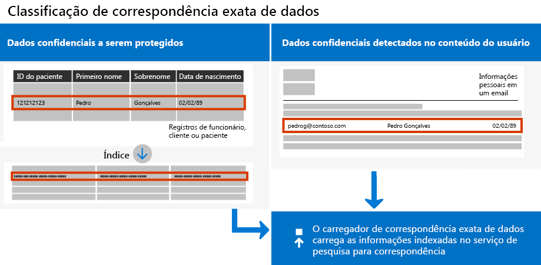
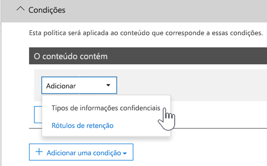

# <a name="create-custom-sensitive-information-types-with-exact-data-match-based-classification"></a>Criar tipos personalizados de informações confidenciais com classificação baseada em Exact Data Match

## <a name="overview"></a>Visão Geral


  [Tipos personalizados de informações confidenciais](https://docs.microsoft.com/pt-BR/office365/securitycompliance/custom-sensitive-info-types)  são usados para ajudar a prevenir o compartilhamento acidental ou inadequado de informações confidenciais. Como administrador, você pode usar o [Centro de Conformidade e Segurança](https://docs.microsoft.com/pt-BR/office365/securitycompliance/create-a-custom-sensitive-information-type) ou [PowerShell](https://docs.microsoft.com/pt-BR/office365/securitycompliance/create-a-custom-sensitive-information-type-in-scc-powershell) para definir um tipo personalizado de informação baseado em padrões, evidências (palavras-chave como *funcionário*, *crachá*, *ID* e assim por diante), proximidade de caractere (quão próxima a evidência está dos caracteres em um padrão específico) e níveis de confiança. Esses tipos personalizados de informações confidenciais atendem às necessidades comerciais de várias organizações.

Mas e se você quiser um tipo personalizado de informações confidenciais que usa valores de dados exatos, em vez de corresponder apenas a padrões genéricos? Com a classificação baseada em Exact Data Match (EDM), você pode criar um tipo personalizado de informações confidenciais que é criada para:

- ser dinâmico e atualizável.
- ser mais escalonável;
- resultar em menos falso positivos.
- trabalhar com dados confidenciais estruturados;
- lidar com as informações confidenciais com mais segurança; e
- ser usado com vários serviços de nuvem da Microsoft.



A classificação baseada no EDM permite criar tipos personalizados de informações confidenciais que fazem referência a valores exatos em um banco de dados de informações confidenciais. O banco de dados pode ser atualizado diariamente ou semanalmente, e pode conter até 10 milhões linhas de dados. Assim como funcionários, pacientes ou clientes vêm e vão e os registros são alterados, os tipos personalizados de informações confidenciais permanecem atualizados e aplicáveis. Você também pode usar a classificação baseada em EDM com políticas, como [políticas de prevenção contra perda de dados](https://docs.microsoft.com/pt-BR/office365/securitycompliance/data-loss-prevention-policies) (DLP) ou políticas de arquivo do [Microsoft Cloud App Security](https://docs.microsoft.com/cloud-app-security/data-protection-policies).

## <a name="required-licenses-and-permissions"></a>Licenças e permissões necessárias

Você deve ser um administrador global, administrador de conformidade ou administrador do Exchange Online para executar as tarefas descritas neste artigo. Para saber mais sobre permissões DLP, consulte [Permissões](https://docs.microsoft.com/pt-BR/office365/securitycompliance/data-loss-prevention-policies#permissions).

Quando estiver disponível para o público geral, a classificação baseada em EDM será incluída nessas assinaturas

- Office 365 E5
- Microsoft 365 E5
- Proteção de Informações e Conformidade do Microsoft 365
- Conformidade Avançada do Office 365

## <a name="the-work-flow-at-a-glance"></a>Visão geral do fluxo de trabalho 

|Fase  |Requisitos  |
|---------|---------|
|[Parte 1: Configuração da classificação baseada em EDM](#part-1-set-up-edm-based-classification)<br/><br/>(conforme o necessário)<br/>- [Edite o Esquema de Banco de Dados](#editing-the-schema-for-edm-based-classification) <br/>- [Remova o esquema](#removing-the-schema-for-edm-based-classification) |– Acesso de leitura aos dados confidenciais<br/>– Esquema de banco de dados no formato. XML (exemplo fornecido)<br/>– Pacote de regras no formato. XML (exemplo fornecido)<br/>– Permissões de administrador ao Centro de Conformidade e Segurança (usando o PowerShell) |
|[Parte 2: indexação e carregamento de dados confidenciais](#part-2-index-and-upload-the-sensitive-data)<br/><br/>(conforme o necessário)<br/>[Atualize os dados](#refreshing-your-sensitive-information-database) |– Grupo de segurança personalizado e conta de usuário<br/>– Acesso de administrador local à máquina com o agente de carregamento do EDM<br/>– Acesso de leitura aos dados confidenciais<br/>– Processar e agendar a atualização de dados|
|[Parte 3: uso da classificação baseada em EDM com os serviços de nuvem da Microsoft](#part-3-use-edm-based-classification-with-your-microsoft-cloud-services) |– Assinatura do Office 365 com DLP<br/>– Recurso de classificação baseada em EDM habilitado |

### <a name="part-1-set-up-edm-based-classification"></a>Parte 1: Configuração da classificação baseada em EDM

Definição e configuração da classificação baseada em EDM envolve o salvamento de dados confidenciais no formato .csv, a definição de um esquema para seu banco de dados de informações confidenciais, a criação de um pacote de regras e o carregamento do esquema e do pacote de regras.

#### <a name="define-the-schema-for-your-database-of-sensitive-information"></a>Definição do esquema para seu banco de dados de informações confidenciais

1. Identifique as informações confidenciais que deseja usar. Exporte os dados para um aplicativo, como o Microsoft Excel, e salve o arquivo no formato .csv. O arquivo de dados pode incluir um máximo de:
      - Até 10 milhões linhas de dados confidenciais
      - Até 32 colunas (campos) por fonte de dados
      - Até 5 colunas (campos) marcadas como pesquisáveis

2. Estruture os dados confidenciais no arquivo .csv, de modo que a primeira linha inclui os nomes dos campos usados na classificação baseada em EDM. Você pode ter nomes de campo no arquivo .csv, como "CPF", "data de nascimento", "nome", "sobrenome" e assim por diante. Por exemplo, o arquivo .csv é chamado  *PatientRecords.csv*, e suas colunas incluem  *PatientID*, *Número de prontuário médico*, *Sobrenome*, *Nome*, *CPF*  e mais.

3. Defina o esquema para o banco de dados de informações confidenciais no formato .xml (semelhante ao nosso exemplo a seguir). Nomeie esse esquema do arquivo edm.xml e configure-o para que cada coluna no banco de dados tenha uma linha que use a sintaxe \<Field name="" searchable=""/\>.

      - Use nomes de coluna para valores de *Nome do campo* .
      - Use  *searchable="true"*  para até 5 campos pesquisáveis. Você deve designar pelo menos um campo como pesquisável.

Por exemplo, o arquivo .xml a seguir define o esquema para um banco de dados de registros de paciente, com cinco campos especificados como pesquisáveis:  *PatientID*, *Número de prontuário médico*, *CPF*, *Telefone*e  *Data de nascimento*.

(Você pode copiar, modificar e usar nosso exemplo.)

 ```xml
<EdmSchema xmlns="http://schemas.microsoft.com/office/2018/edm">
      <DataStore name="PatientRecords" description="Schema for patient records" version="1">
            <Field name="PatientID" searchable="true" />
            <Field name="MRN" searchable="true" />
            <Field name="FirstName" />
            <Field name="LastName" />
            <Field name="SSN" searchable="true" />
            <Field name="Phone" searchable="true" />
            <Field name="DOB" searchable="true" />
            <Field name="Gender" />
            <Field name="Address" />
      </DataStore>
</EdmSchema>
```

4. [Conecte-se ao PowerShell do Centro de Conformidade e Segurança do Office 365](https://docs.microsoft.com/powershell/exchange/office-365-scc/connect-to-scc-powershell/connect-to-scc-powershell?view=exchange-ps).

5. Para carregar o esquema do banco de dados, execute os seguintes cmdlets, um de cada vez:

```powershell
$edmSchemaXml=Get-Content .\\edm.xml -Encoding Byte -ReadCount 0
New-DlpEdmSchema -FileData $edmSchemaXml -Confirm:$true
```

Você será solicitado a confirmar da seguinte maneira:

> Confirmar
>
> Tem certeza que deseja executar essa ação?
>
> O novo esquema EDM para o repositório de dado 'patientrecords' será importado.
>
> \[S\] Sim \[A\] Sim para Todos \[N\] Não \[L\] Não para Todos \[?\] Ajuda (padrão é “Y”):

> [!TIP]
> Se você quiser que as suas alterações ocorram sem confirmação, na Etapa 5, use este cmdlet: New-DlpEdmSchema -FileData $edmSchemaXml

> [!NOTE]
> Pode levar de 10 a 60 minutos para atualizar o EDMSchema com as adições. A atualização deve ser concluída antes que você execute as etapas que usam as adições.

Agora que o esquema para o seu banco de dados de informações confidenciais está definido, a próxima etapa é configurar um pacote de regras. Continue na seção [Configurar um pacote de regras](#set-up-a-rule-package).

#### <a name="editing-the-schema-for-edm-based-classification"></a>Editando o esquema para classificação baseada em EDM

Se você quiser fazer alterações em seu arquivo edm.xml, como alterar quais os campos usados para a classificação baseada em EDM, siga estas etapas:

1. Edite o seu arquivo edm.xml (este é o arquivo discutido na seção [Definir o esquema](#define-the-schema-for-your-database-of-sensitive-information) deste artigo).

2. [Conecte-se ao PowerShell do Centro de Conformidade e Segurança do Office 365](https://docs.microsoft.com/powershell/exchange/office-365-scc/connect-to-scc-powershell/connect-to-scc-powershell?view=exchange-ps).

3. Para atualizar o seu esquema do banco de dados, execute os seguintes cmdlets, um de cada vez:

```powershell
$edmSchemaXml=Get-Content .\\edm.xml -Encoding Byte -ReadCount 0
Set-DlpEdmSchema -FileData $edmSchemaXml -Confirm:$true
```

Você será solicitado a confirmar da seguinte maneira:

> Confirmar
>
> Tem certeza que deseja executar essa ação?
>
> O esquema EDM para o repositório de dados 'patientrecords' será atualizado.
>
> \[S\] Sim \[A\] Sim para Todos \[N\] Não \[L\] Não para Todos \[?\] Ajuda (padrão é “Y”):

> [!TIP]
> Se você quiser que as suas alterações ocorram sem confirmação, na Etapa 3, use este cmdlet: Set-DlpEdmSchema -FileData $edmSchemaXml

> [!NOTE]
> Pode levar de 10 a 60 minutos para atualizar o EDMSchema com as adições. A atualização deve ser concluída antes que você execute as etapas que usam as adições.

## <a name="removing-the-schema-for-edm-based-classification"></a>Removendo o esquema para classificação baseada em EDM

(Conforme necessário) Se você quiser remover o esquema que está usando para classificação baseada em EDM, siga estas etapas:

1. [Conecte-se ao PowerShell do Centro de Conformidade e Segurança do Office 365](https://docs.microsoft.com/powershell/exchange/office-365-scc/connect-to-scc-powershell/connect-to-scc-powershell?view=exchange-ps).

2. Execute os seguinte cmdlets do PowerShell, substituindo o nome do repositório de dados de "patientrecords" pelo nome que você deseja remover:

```powershell
Remove-DlpEdmSchema -Identity patientrecords
```

Você será solicitado a confirmar da seguinte maneira:

> Confirmar
>
> Tem certeza que deseja executar essa ação?
>
> O esquema EDM para o repositório de dados 'patientrecords' será removido.
>
> \[S\] Sim \[A\] Sim para Todos \[N\] Não \[L\] Não para Todos \[?\] Ajuda (padrão é “Y”):

> [!TIP]
>  Se você quiser que as alterações ocorram sem confirmação, na Etapa 2, use este cmdlet: Remove-DlpEdmSchema -Identity patientrecords -Confirm:$false

### <a name="set-up-a-rule-package"></a>Configurar um pacote de regras

1. Crie um pacote de regras no formato .xml (com codificação Unicode), semelhante ao exemplo a seguir. (Você pode copiar, modificar e usar nosso exemplo.)

Ao configurar o seu pacote de regras, certifique-se de referenciar corretamente o arquivo .csv e o arquivo edm.xml. Você pode copiar, modificar e usar nosso exemplo. Neste exemplo de xml, os seguintes campos precisam ser personalizados para criar seu tipo confidencial do EDM:

- 
  **RulePack id e ExactMatch id**: use [New-GUID](https://docs.microsoft.com/pt-BR/powershell/module/microsoft.powershell.utility/new-guid?view=powershell-6) para gerar um GUID.

- **Datastore**: este campo especifica o repositório de dados de pesquisa EDM a ser usado. Forneça um nome de fonte de dados de um esquema EDM configurado.

- **idMatch**: este campo aponta para o elemento principal do EDM.
  - Correspondências: especifica o campo a ser usado na pesquisa exata. Forneça um nome de campo pesquisável no esquema EDM para o DataStore.
  - Classificação: este campo especifica a correspondência de tipo confidencial que dispara a pesquisa EDM. Você pode fornecer o nome ou o GUID de uma classificação interna ou personalizada existente.

- **Corresponder:** este campo aponta para evidências adicionais encontradas em proximidade do idMatch.
  - Correspondências: forneça o nome do campo no esquema EMD para DataStore.
- **Recurso:** esta seção especifica o nome e a descrição do tipo confidencial em várias localidades.
  - idRef: forneça GUID para ExactMatch id.
  - Nome e Edição de descrições de esquema: personalize conforme necessário.

```xml
<RulePackage xmlns="http://schemas.microsoft.com/office/2018/edm">
  <RulePack id="fd098e03-1796-41a5-8ab6-198c93c62b11">
    <Version build="0" major="2" minor="0" revision="0" />
    <Publisher id="eb553734-8306-44b4-9ad5-c388ad970528" />
    <Details defaultLangCode="en-us">
      <LocalizedDetails langcode="en-us">
        <PublisherName>IP DLP</PublisherName>
        <Name>Health Care EDM Rulepack</Name>
        <Description>This rule package contains the EDM sensitive type for health care sensitive types.</Description>
      </LocalizedDetails>
    </Details>
  </RulePack>
  <Rules>
    <ExactMatch id = "E1CC861E-3FE9-4A58-82DF-4BD259EAB371" patternsProximity = "300" dataStore ="PatientRecords" recommendedConfidence = "65" >
      <Pattern confidenceLevel="65">
        <idMatch matches = "SSN" classification = "U.S. Social Security Number (SSN)" />
      </Pattern>
      <Pattern confidenceLevel="75">
        <idMatch matches = "SSN" classification = "U.S. Social Security Number (SSN)" />
        <Any minMatches ="3" maxMatches ="100">
          <match matches="PatientID" />
          <match matches="MRN"/>
          <match matches="FirstName"/>
          <match matches="LastName"/>
          <match matches="Phone"/>
          <match matches="DOB"/>
        </Any>
      </Pattern>
    </ExactMatch>
    <LocalizedStrings>
      <Resource idRef="E1CC861E-3FE9-4A58-82DF-4BD259EAB371">
        <Name default="true" langcode="en-us">Patient SSN Exact Match.</Name>
        <Description default="true" langcode="en-us">EDM Sensitive type for detecting Patient SSN.</Description>
      </Resource>
    </LocalizedStrings>
  </Rules>
</RulePackage>
```

1. Carregue o pacote de regras executando os seguintes cmdlets do PowerShell, um de cada vez:

```powershell
$rulepack=Get-Content .\\rulepack.xml -Encoding Byte -ReadCount 0
New-DlpSensitiveInformationTypeRulePackage -FileData $rulepack
```

Nesse ponto, você configurou a classificação baseada em EDM. A próxima etapa é indexar os dados confidenciais e carregá-los.

Lembre-se do procedimento anterior onde o nosso esquema PatientRecords define cinco campos como pesquisáveis:  *PatientID*, *Número de prontuário médico*, *CPF*, *Telefone* e  *Data de nascimento*. O nosso pacto de regras de exemplo inclui esses campos e faz referência ao arquivo de esquema do banco de dados (edm.xml), com um item *ExactMatch*  por campo pesquisável. Considere o seguinte item ExactMatch:

```xml
<ExactMatch id = "E1CC861E-3FE9-4A58-82DF-4BD259EAB371" patternsProximity = "300" dataStore ="PatientRecords" recommendedConfidence = "65" >
      <Pattern confidenceLevel="65">
        <idMatch matches = "SSN" classification = "U.S. Social Security Number (SSN)" />
      </Pattern>
      <Pattern confidenceLevel="75">
        <idMatch matches = "SSN" classification = "U.S. Social Security Number (SSN)" />
        <Any minMatches ="3" maxMatches ="100">
          <match matches="PatientID" />
          <match matches="MRN"/>
          <match matches="FirstName"/>
          <match matches="LastName"/>
          <match matches="Phone"/>
          <match matches="DOB"/>
        </Any>
      </Pattern>
    </ExactMatch>
```

Neste exemplo, observe o seguinte:

- O nome do dataStore faz referência ao arquivo .csv que criamos anteriormente: **dataStore = "PatientRecords"**.

- O valor idMatch faz referência a um campo pesquisável listado no arquivo de esquema do banco de dados:  **idMatch matches = "SSN"**.

- O valor de classificação faz referência a um tipo de informação confidencial existente ou personalizada: **classification = "Número de Seguridade Social dos EUA (SSN)"**. (Nesse caso, usamos o tipo de informação confidencial existente do Número de Seguridade Social dos EUA.)

> [!NOTE]
> Pode levar de 10 a 60 minutos para atualizar o EDMSchema com as adições. A atualização deve ser concluída antes que você execute as etapas que usam as adições.

### <a name="part-2-index-and-upload-the-sensitive-data"></a>Parte 2: indexação e carregamento de dados confidenciais

Durante essa fase, você configura um grupo de segurança personalizado e uma conta de usuário, e configura a ferramenta do agente de carregamento do EDM. Depois indexe os dados confidenciais e carregá-los.

#### <a name="set-up-the-security-group-and-user-account"></a>Configuração do grupo de segurança e conta de usuário

1. Como um administrador global, acesse o centro de administração ([https://admin.microsoft.com](https://admin.microsoft.com/)) e [crie um grupo de segurança](https://docs.microsoft.com/office365/admin/email/create-edit-or-delete-a-security-group?view=o365-worldwide) chamado EDM\_DataUploaders.

2. Adicione um ou mais usuários ao grupo de segurança *EDM\_DataUploaders* . (Esses usuários vão gerenciar o banco de dados de informações confidenciais.)

3. Certifique-se de que todos os usuários que estão gerenciando os dados confidenciais sejam um administrador local no computador usado para o agente de carregamento do EDM.

#### <a name="set-up-the-edm-upload-agent"></a>Configurar o agente de carregamento do EDM

>[!NOTE]
> Antes de iniciar esse procedimento, certifique-se de que você é um membro do grupo de segurança *EDM\_DataUploaders*  e um administrador local no computador.

1. Baixe e instale o [Agente de Carregamento do EDM](https://go.microsoft.com/fwlink/?linkid=2088639). Por padrão, o local de instalação deve ser C:\\Arquivos de Programa \\Microsoft\\EdmUploadAgent.

2. Para autorizar o agente de carregamento do EDM, abra o prompt de comando do Windows (como um administrador) e execute o seguinte comando:

    `EdmUploadAgent.exe /Authorize`

3. Entre com sua conta corporativa ou de estudante do Office 365.

A próxima etapa é usar o agente de carregamento do EDM para indexar os dados confidenciais e depois carregá-los.

#### <a name="index-and-upload-the-sensitive-data"></a>Indexação e carregamento de dados confidenciais

Salve o arquivo de dados confidenciais (lembre-se de que o nosso exemplo é *PatientRecords.csv*) para a unidade local no computador. (Salvamos nosso arquivo de exemplo *PatientRecords.csv*  em C:\\Edm\\Data.)

Para indexar e carregar os dados confidenciais, execute o seguinte comando no prompt de comando do Windows:

`EdmUploadAgent.exe /UploadData /DataStoreName \<DataStoreName\> /DataFile \<DataFilePath\> /HashLocation \<HashedFileLocation\>`

Exemplo: **EdmUploadAgent.exe /UploadData /DataStoreName PatientRecords /DataFile C:\\Edm\\Hash\\PatientRecords.csv /HashLocation C:\\Edm\\Hash**

Para separar e executar o índice de dados confidenciais em um ambiente isolado, execute as etapas de indexação e carregamento separadamente.

Para indexar os dados confidenciais, execute o seguinte comando no prompt de comando do Windows:

`EdmUploadAgent.exe /CreateHash /DataFile \<DataFilePath\> /HashLocation \<HashedFileLocation\>`

Exemplo: **EdmUploadAgent.exe /CreateHash /DataFile C:\\Edm\\Data\\PatientRecords.csv /HashLocation C:\\Edm\\Hash**

Para indexar os dados indexados, execute o seguinte comando no prompt de comando do Windows:

`EdmUploadAgent.exe /UploadHash /DataStoreName \<DataStoreName\> /HashFile \<HashedSourceFilePath\>`

Exemplo: **EdmUploadAgent.exe /UploadHash /DataStoreName PatientRecords /HashFile C:\\Edm\\Hash\\PatientRecords.EdmHash**

Para verificar os dados confidenciais indexados, execute o seguinte comando no prompt de comando do Windows:

`EdmUploadAgent.exe /GetDataStore`

Você verá uma lista de repositórios de dados e a data da última atualização.

Prossiga para configurar seu processo e cronograma da [Atualização de banco de dados de informação confidencial](#refreshing-your-sensitive-information-database).

Nesse ponto, você já usou a classificação baseada em EDM com os serviços de nuvem da Microsoft. Por exemplo, você pode [configurar uma política usando a classificação baseada em EDM](#to-create-a-dlp-policy-with-edm).

#### <a name="refreshing-your-sensitive-information-database"></a>Atualização do banco de dados de informações confidenciais

Você pode atualizar seu banco de dados confidenciais diariamente ou semanalmente, e a ferramenta de carregamento do EDM pode reindexar os dados confidenciais e depois recarregar os dados indexados.

1. Determine seu processo e a frequência (diariamente ou semanalmente) para atualização do banco de dados de informações confidenciais.

2. Exporte novamente os dados confidenciais para um aplicativo, como o Microsoft Excel, e salve o arquivo no formato .csv. Mantenha o mesmo nome do arquivo e o local que você usou ao seguir as etapas descritas em [indexação e carregamento de dados confidenciais](#index-and-upload-the-sensitive-data).

> [!NOTE]
> Se não houver alterações na estrutura (nomes de campos) do arquivo .csv, você não precisará fazer alterações no arquivo de esquema do banco de dados ao atualizar os dados. Mas se for necessário fazer alterações, não deixe de editar o esquema de banco de dados e seu pacote de regra correspondente.

3. Use o [Agendador de tarefas](https://docs.microsoft.com/windows/desktop/TaskSchd/task-scheduler-start-page) para automatizar as etapas 2 e 3 [no procedimento de indexação e carregamento de dados confidenciais](#index-and-upload-the-sensitive-data) . Você pode agendar tarefas usando vários métodos:

| **Método**             | **O que fazer**                                                                                                                                                                                                                                                                                                                                                                                                                     |
| ---------------------- | ---------------------------------------------------------------------------------------------------------------------------------------------------------------------------------------------------------------------------------------------------------------------------------------------------------------------------------------------------------------------------------------------------------------------------------- |
| Windows PowerShell     | Confira a [documentação do ScheduledTasks](https://docs.microsoft.com/powershell/module/scheduledtasks/?view=win10-ps) e o [exemplo do script do PowerShell](#example-powershell-script-for-task-scheduler) neste artigo. |
| API do Agendador de Tarefas     | Confira a documentação do [Agendador de Tarefas](https://docs.microsoft.com/windows/desktop/TaskSchd/using-the-task-scheduler)                                                                                                                                                                                                                                                                                 |
| Interface do usuário do Windows | No Windows, clique em **Iniciar** e digite Agendador de Tarefas. Em seguida, na lista de resultados, clique com o botão direito do mouse no **Agendador de Tarefas** e escolha **executar como administrador**.                                                                                                                                                                                                                                                                           |

#### <a name="example-powershell-script-for-task-scheduler"></a>Exemplo de script do PowerShell para o Agendador de Tarefas

Esta seção inclui um exemplo de script do PowerShell que pode ser usado para agendar as tarefas de indexação de dados e carregamento dos dados indexados:

##### <a name="to-schedule-index-and-upload-in-a-combined-step"></a>Para agendar o índice e carregar em uma etapa combinada

```powershell
param(\[string\]$dataStoreName,\[string\]$fileLocation)
\# Assuming current user is also the user context to run the task
$user = "$env:USERDOMAIN\\$env:USERNAME"
$edminstallpath = 'C:\\Program Files\\Microsoft\\EdmUploadAgent\\'
$edmuploader = $edminstallpath + 'EdmUploadAgent.exe'
$csvext = '.csv'
\# Assuming CSV file name is same as data store name
$dataFile = "$fileLocation\\$dataStoreName$csvext"
\# Assuming location to store hash file is same as the location of csv file
$hashLocation = $fileLocation
$uploadDataArgs = '/UploadData /DataStoreName ' + $dataStoreName + ' /DataFile ' + $dataFile + ‘ /HashLocation’ + $hashLocation
\# Set up actions associated with the task
$actions = @()
$actions += New-ScheduledTaskAction -Execute $edmuploader -Argument $uploadDataArgs -WorkingDirectory $edminstallpath
\# Set up trigger for the task
$trigger = New-ScheduledTaskTrigger -Weekly -DaysOfWeek Sunday -At 2am
\# Set up task settings
$principal = New-ScheduledTaskPrincipal -UserId $user -LogonType S4U -RunLevel Highest
$settings = New-ScheduledTaskSettingsSet -RunOnlyIfNetworkAvailable -StartWhenAvailable -WakeToRun
\# Create the scheduled task
$scheduledTask = New-ScheduledTask -Action $actions -Principal $principal -Trigger $trigger -Settings $settings
\# Get credentials to run the task
$creds = Get-Credential -UserName $user -Message "Enter credentials to run the task"
$password=\[Runtime.InteropServices.Marshal\]::PtrToStringAuto(\[Runtime.InteropServices.Marshal\]::SecureStringToBSTR($creds.Password))
\# Register the scheduled task
$taskName = 'EDMUpload\_' + $dataStoreName
Register-ScheduledTask -TaskName $taskName -InputObject $scheduledTask -User $user -Password $password
```

#### <a name="to-schedule-index-and-upload-as-separate-steps"></a>Para agendar o índice e carregar como etapas separadas

```powershell
param(\[string\]$dataStoreName,\[string\]$fileLocation)
\# Assuming current user is also the user context to run the task
$user = "$env:USERDOMAIN\\$env:USERNAME"
$edminstallpath = 'C:\\Program Files\\Microsoft\\EdmUploadAgent\\'
$edmuploader = $edminstallpath + 'EdmUploadAgent.exe'
$csvext = '.csv'
$edmext = '.EdmHash'
\# Assuming CSV file name is same as data store name
$dataFile = "$fileLocation\\$dataStoreName$csvext"
$hashFile = "$fileLocation\\$dataStoreName$edmext"
\# Assuming location to store hash file is same as the location of csv file
$hashLocation = $fileLocation
$createHashArgs = '/CreateHash' + ' /DataFile ' + $dataFile + ' /HashLocation ' + $hashLocation
$uploadHashArgs = '/UploadHash /DataStoreName ' + $dataStoreName + ' /HashFile ' + $hashFile
\# Set up actions associated with the task
$actions = @()
$actions += New-ScheduledTaskAction -Execute $edmuploader -Argument $createHashArgs -WorkingDirectory $edminstallpath
$actions += New-ScheduledTaskAction -Execute $edmuploader -Argument $uploadHashArgs -WorkingDirectory $edminstallpath
\# Set up trigger for the task
$trigger = New-ScheduledTaskTrigger -Weekly -DaysOfWeek Sunday -At 2am
\# Set up task settings
$principal = New-ScheduledTaskPrincipal -UserId $user -LogonType S4U -RunLevel Highest
$settings = New-ScheduledTaskSettingsSet -RunOnlyIfNetworkAvailable -StartWhenAvailable -WakeToRun
\# Create the scheduled task
$scheduledTask = New-ScheduledTask -Action $actions -Principal $principal -Trigger $trigger -Settings $settings
\# Get credentials to run the task
$creds = Get-Credential -UserName $user -Message "Enter credentials to run the task"
$password=\[Runtime.InteropServices.Marshal\]::PtrToStringAuto(\[Runtime.InteropServices.Marshal\]::SecureStringToBSTR($creds.Password))
\# Register the scheduled task
$taskName = 'EDMUpload\_' + $dataStoreName
Register-ScheduledTask -TaskName $taskName -InputObject $scheduledTask -User $user -Password $password
```

### <a name="part-3-use-edm-based-classification-with-your-microsoft-cloud-services"></a>Parte 3: uso da classificação baseada em EDM com os serviços de nuvem da Microsoft

A DLP do Office 365 para Exchange Online (email), OneDrive for Business (arquivos), Microsoft Teams (conversas) e as políticas de segurança do Microsoft Cloud App serão compatíveis com os tipos de informações confidenciais do EDM.

Os tipos de informações confidenciais do EDM para os cenários a seguir estão em desenvolvimento, mas ainda não estão disponíveis:

- A DLP do Office 365 para SharePoint (arquivos)
- Classificação automática de rótulos de confidencialidade e rótulos de retenção.

#### <a name="to-create-a-dlp-policy-with-edm"></a>Criação de uma política DLP com o EDM

1. Acesse o Centro de Conformidade e Segurança ([https://protection.office.com](https://protection.office.com/)).

2. Clique em **Prevenção contra perda de dados** \> **Política**.

3. Clique em **Criar uma política** \> **Personalizar** \> **Próximo**.

4. Na guia **Nomear sua política** , especifique um nome e uma descrição e, em seguida, clique em **Próximo**.

5. Na guia **Escolher locais** , clique em **Escolher locais específicos**e, em seguida, clique em **Próximo**.

6. Na coluna **Status** , escolha **email do Exchange, contas do OneDrive, mensagem de canal e chat do Teams** e, em seguida, escolha **Próximo**. (Observação: atualmente, o EDM não é compatível com sites do SharePoint e a política de DLP não irá detectar arquivos no SharePoint para EDM)

7. Na guia **Configurações de política** , escolha **Usar configurações avançadas**e, em seguida, clique em **Próximo**.

8. Escolha **+ Nova regra**.

9. Na seção **Nome** , especifique um nome e uma descrição para a regra.

10. Na seção **Condições** , na lista **Adicionar uma condição** , escolha **Conteúdo contém tipo confidencial**.<br/><br/>

11. Pesquise o tipo de informação confidencial que você criou ao configurar o pacote de regras e, em seguida, escolha **+ Adicionar**.  
    Em seguida, escolha **Concluído**.

12. Termine de selecionar as opções para a regra, como **Notificações de usuário**, **Substituições do usuário**, **Relatórios de incidente**, e assim por diante, e depois clique em **Salvar**.

13. Na guia **Configurações de política** , revise suas regras e, em seguida, clique em **Próximo**.

14. Especifique se deseja ativar a política imediatamente, testá-la ou desativá-la. Em seguida, escolha **Próximo**.

15. Na guia **Revisar suas configurações** , revise sua política. Faça todas as alterações necessárias. Quando concluir, clique em **Criar**.

> [!NOTE]
> Espere aproximadamente uma hora para sua nova política DLP funcionar em seu data center.

## <a name="related-articles"></a>Artigos relacionados


  [Tipos de informações confidenciais integradas e o que procuram](https://docs.microsoft.com/pt-BR/office365/securitycompliance/what-the-sensitive-information-types-look-for)


  [Tipos personalizados de informações confidenciais](https://docs.microsoft.com/pt-BR/office365/securitycompliance/custom-sensitive-info-types)


  [Visão geral das políticas DLP](https://docs.microsoft.com/pt-BR/office365/securitycompliance/data-loss-prevention-policies)

[Microsoft Cloud App Security](https://docs.microsoft.com/cloud-app-security)


  [New-DlpEdmSchema](https://docs.microsoft.com/pt-BR/powershell/module/exchange/policy-and-compliance-dlp/new-dlpedmschema?view=exchange-ps)

## <a name="feedback"></a>Feedback
Os comentários do GitHub estão habilitados, mas não é possível adicionar problemas no site público.
