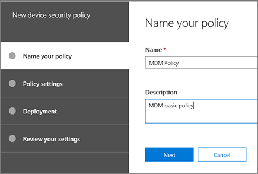

# Criar e implantar políticas de segurança de dispositivo

Você pode usar o gerenciamento de dispositivos móveis para o Office 365 para criar políticas de segurança que ajudam a proteger as informações da sua organização no Office 365 contra acesso não autorizado. Você pode aplicar políticas para qualquer dispositivo móvel em sua organização onde o usuário do dispositivo tem uma licença do Office 365 aplicável e tem inscritos o dispositivo em MDM para o Office 365.
  
## Antes de começar

- Saiba mais sobre os dispositivos, aplicativos de dispositivo móvel e configurações de segurança que suporta MDM para o Office 365. Consulte os [recursos de gerenciamento de dispositivos móveis para o Office 365](capabilities-of-mobile-device-management.md).
    
- Criar grupos de segurança que incluem usuários do Office 365 que você deseja implantar políticas e para usuários que você deseja excluir sejam bloqueados acesso ao Office 365. Recomendamos que, antes de implantar uma nova política à sua organização, você teste a política por implantá-lo para um pequeno número de usuários. Você pode criar e usar um grupo de segurança que inclui apenas sozinho ou um número usuários do Office 365 small que podem testar a diretiva para você. Para saber mais sobre grupos de segurança, consulte [criar, editar ou excluir um grupo de segurança](https://go.microsoft.com/fwlink/p/?LinkId=518555).
    
- **Importante:** Antes de criar uma política de dispositivo móvel, você deve ativar e configurar o MDM para Office 365. Consulte [Visão geral do gerenciamento de dispositivos móveis para o Office 365](overview-of-mdm.md).
    
- Para criar e implantar políticas de gerenciamento de dispositivos móveis no Office 365, você precisa ser um administrador global do Office 365. Consulte [Permissions in a segurança do Office 365 &amp; Centro de conformidade](https://support.office.com/article/d10608af-7934-490a-818e-e68f17d0e9c1).
    
- Antes de implantar políticas, permitem que sua organização Saiba os impactos potenciais da inscrição um dispositivo em MDM para Office 365. Dependendo de como configurar as políticas, dispositivos fora de conformidade podem ser impedidos de acessar o Office 365 e dados, incluindo aplicativos instalados, fotos e informações pessoais em um dispositivo registrado, podem ser excluídos.
    
> [!NOTE]
> Políticas e regras de acesso criadas no MDM para Office 365 substituirão políticas de caixa de correio de dispositivo móvel do Exchange ActiveSync e regras de acesso de dispositivo criadas no Centro de administração do Exchange. Depois que um dispositivo está inscrito no MDM para o Office 365, qualquer política de caixa de correio de dispositivo móvel do Exchange ActiveSync ou aplicada ao dispositivo da regra de acesso de dispositivo será ignorada. Para saber mais sobre o Exchange ActiveSync, consulte [Exchange ActiveSync no Exchange Online](https://go.microsoft.com/fwlink/p/?LinkId=524380). 
  
## Etapa 1: Criar uma política de segurança e implantar a um grupo de teste

Antes de começar, certifique-se de ter ativado e configurar o MDM para Office 365. Consulte [Visão geral do gerenciamento de dispositivos móveis para o Office 365](overview-of-mdm.md) para obter instruções. 
  
1. No Office 365, na segurança &amp; Centro de conformidade, vá para a **prevenção de perda de dados** \> **diretivas de segurança de dispositivo**.
    
    > [!NOTE]
    > As **diretivas de segurança do dispositivo** será exibida no menu apenas após ter ativado o gerenciamento de dispositivo móvel. 
  
2. Escolha **+ criar uma política**.
    
    
  
3. Especifique um **nome** e uma **Descrição** para a nova política e escolha **Avançar**.
    
    
  
4. No **que requisitos você deseja ter em dispositivos?** página, especifique os requisitos que você deseja aplicar a dispositivos móveis em sua organização e escolha **Avançar**.
    
    
  
5. Sobre o **o que você deseja configurar?** página, especifique os requisitos adicionais que você deseja aplicar a dispositivos móveis em sua organização e escolha **Avançar**.
    
6. Sobre o **você deseja aplicar esta diretiva agora?** página, escolha **Sim**e, em seguida, escolha **+ Add**. 
    
    
  
7. Selecione os grupos que testará a política antes de implantá-lo à sua organização e, em seguida, escolha **Adicionar**.
    
8. Escolha **Próximo**.
    
9. Revise e confirme os detalhes da nova diretiva de dispositivo e, em seguida, escolha **criar essa diretiva**.
    
    
  
10. Clique em **Fechar**.
    
Cada usuário que a política se aplica a terão a política enviada para seu dispositivo na próxima vez que entrarem no Office 365 usando seu dispositivo móvel. Se os usuários não tiveram uma diretiva aplicada aos seus dispositivos móveis antes, em seguida, após a implantação da diretiva, eles obterá uma notificação no dispositivo que inclui as [etapas para registrar e ativar o MDM para o Office 365](https://go.microsoft.com/fwlink/?LinkId=615272). Até que sejam concluídas inscrição, acesso a email, OneDrive e outros serviços será restritos. Após a conclusão de inscrição usando o app Intune Portal da empresa, eles serão capazes de usar os serviços e a diretiva será aplicada ao seu dispositivo.
  
## Etapa 2: Verificar sua funciona a diretiva

Depois que você criou uma diretiva de segurança, você deve verificar se a política funciona conforme o esperado antes de implantá-lo à sua organização.
  
1. No Office 365, vá para **segurança &amp; Centro de conformidade** \> **prevenção de perda de dados** \> **gerenciamento de dispositivo**.
    
2. Na página **Gerenciamento de dispositivos móveis para o Office 365** , verifique o status de dispositivos de usuário que tenham a diretiva aplicada. Você pode filtrar ou classificar por **todos** para exibir todos os dispositivos ou **bloqueado** para exibir dispositivos bloqueados. 
    
    
  
3. Você também pode fazer uma limpeza completa ou seletiva no dispositivo. Para obter instruções, consulte [Apagar um dispositivo móvel no Office 365](wipe-a-mobile-device.md).
    
## Etapa 3: Implantar uma política para a sua organização

Depois que você criou uma política de dispositivo móvel e verificado que ele funciona conforme o esperado, implantá-lo à sua organização.
  
1. No Office 365, vá para **segurança &amp; Centro de conformidade** \> **prevenção de perda de dados** \> **diretivas de segurança de dispositivo**.
    
2. Selecione a política que você deseja implantar e escolha **Editar política** no \< _nome da política_ \> painel.  
    
3. Selecione a guia **Implantação**. 
    
4. Na guia de **implantação** , escolha **Sim** acima **Selecionar um ou mais grupos de segurança que contêm as pessoas que você deseja aplicar a esta diretiva** e, em seguida, **Adicionar**.
    
  - No painel **Selecionar grupo** , você pode procurar um grupo ao qual adicionar, você pode filtrar por alias ou por nome para exibição. Você também pode adicionar um grupo existente na lista **grupos** . 
    
    Você pode adicionar vários grupos para aplicar a política.
    
    Escolha **Adicionar** na parte inferior do painel. 
    
5. Escolha **Salvar** na guia de **implantação** . 
    
    
  
Cada usuário que a política se aplica a terão a política enviada para seu dispositivo na próxima vez que entrarem no Office 365 usando seu dispositivo móvel. Se os usuários não tiveram uma diretiva aplicada aos seus dispositivos móveis, eles vai [fazer uma notificação em seus dispositivos](https://go.microsoft.com/fwlink/?LinkId=615272) com etapas para inscrever e ativá-lo para MDM para o Office 365. Depois que eles concluir o registro, a política será aplicada ao seu dispositivo. 
  
## Etapa 4: Bloquear email o acesso de dispositivos sem suporte

Para ajudar a proteger informações da sua organização, você deverá bloquear acesso de app para email do Office 365 para dispositivos móveis que não são suportados pelo MDM para o Office 365. Consulte os [recursos de gerenciamento de dispositivos móveis internos para o Office 365](capabilities-of-mobile-device-management.md) para obter uma lista de dispositivos que são suportados. Para fazer isso: 
  
1. Vá para segurança &amp; Centro de conformidade\> **prevenção de perda de dados** \> **diretivas de segurança de dispositivo**.
    
2. Selecione **Gerenciar definições de acesso do dispositivo de toda a organização**.
    
    
  
3. Para bloquear dispositivos sem suporte, escolha **Bloquear** em **se um dispositivo não é suportado pelo MDM para o Office 365, você deseja permitir ou bloquear a partir usando uma conta do Exchange para acessar email da sua organização** \> **Salvar**.
  
## Etapa 5: Escolher grupos de segurança a serem excluídos de verificações de acesso condicional

Se quiser excluir algumas pessoas de verificações de acesso condicional em seus dispositivos móveis e você criou um ou mais grupos de segurança para essas pessoas, adicione os grupos de segurança aqui. As pessoas nesses grupos não terão políticas aplicadas a seus dispositivos móveis compatíveis.
  
1. Vá para segurança &amp; Centro de conformidade\> **prevenção de perda de dados** \> **diretivas de segurança de dispositivo**.
    
2. Selecione **Gerenciar definições de acesso do dispositivo de toda a organização**.
    
    
  
3. Selecione **Adicionar** para adicionar o grupo de segurança que possui usuários que você gostaria de excluir sejam bloqueados acesso ao Office 365. Quando um usuário é adicionado a essa lista, ele poderá acessar o email do Office 365 ao usar um dispositivo sem suporte. 
    
4. Selecione o grupo de segurança que você deseja usar no painel **Selecione grupo** . 
    
5. Selecione o nome e, em seguida, **Adicionar** \> **Salvar**.
    
6. No painel de **configurações de acesso de dispositivo de toda a organização** , escolha **Salvar**.
  
## Qual é o impacto das políticas de segurança em tipos diferentes de dispositivos?

Quando você aplicar uma política a dispositivos de usuário, o impacto em cada dispositivo varia um pouco entre tipos diferentes de dispositivos. Consulte a tabela a seguir para obter exemplos do impacto das políticas em dispositivos diferentes.
  

|**Política de segurança**|**Windows Phone 8.1 +**|**Android 4 ou posterior**|**Samsung Knox**|**IOS 6 +**|**Anotações**|
|:-----|:-----|:-----|:-----|:-----|:-----|
|Exige backup criptografado    |✖    |✖    |✔    |✔    |Requer backup criptografado para IOS.    |
|Bloquear cópia de segurança na nuvem    |✖    |✔    |✔    |✔    |Bloquear backup no Google no Android (esmaecido), backup na nuvem no iOS.    |
|Bloquear sincronização de documento    |✖    |✖    |✖    |✔    |iOS: Bloquear documentos na nuvem.    |
|Bloquear sincronização de fotos    |✖    |✖    |✖    |✔    |iOS (nativo): Bloquear fluxo de foto.    |
|Bloquear captura de tela    |✔    |X    |✔    |✔    |Bloqueado quando tentado.    |
|Bloquear videoconferência    |✖    |✖    |✖    |✔    |FaceTime bloqueado no iOS, não no Skype ou outros.    |
|Bloquear o envio de dados de diagnóstico    |✖    |X    |✔    |✔    |Bloquear o envio de relatório de falha do Google no Android.    |
|Bloquear o acesso à loja de aplicativos    |✔    |X    |✔    |✔    |Ícone de armazenamento de aplicativo ausente na página inicial do Android, desabilitado no Windows, ausente no iOS.    |
|Exigir senha para a loja de aplicativos    |✖    |✖    |✖    |✔    |iOS: Senha necessária para compras do iTunes.    |
|Bloquear a conexão ao armazenamento removível    |✔    |X    |✔    |NA    |Android: O cartão SD ficará esmaecido nas configurações, Windows notifica o usuário, aplicativos instalados que não estão disponíveis    |
|Bloquear conexão Bluetooth    |✔    |\*\*\*    |\*\*\*    |✖    |\*\*\*Não é possível desabilitamos BlueTooth como uma configuração no Android. Em vez disso, podemos desabilitar todas as transações que exigem BlueTooth: distribuição de áudio avançado, controle remoto de áudio/vídeo, dispositivos viva-voz, headset, acesso de catálogo telefônico e porta Serial. Uma mensagem de proposta pequeno aparece na parte inferior da página quando qualquer uma dessas é usada.    |
   
## O que acontece quando você exclui uma política ou remove um usuário da política?

Quando você excluir uma política ou remove um usuário de um grupo ao qual a política foi implantada, as configurações de diretiva, perfil de email do Office 365 e emails em cache podem ser removidos do dispositivo do usuário. Consulte a tabela a seguir para ver o que foi removido para os tipos diferentes de dispositivos:
  
|**O que é removido**|**Windows Phone 8.1 +**|**iOS 6 +**|**Android 4 + (incluindo Samsung Knox)**|
|:-----|:-----|:-----|:-----|
|Perfis de email gerenciadas\*    |✖    |✔    |✖    |
|Configurações de política    |✔              Exceto para **Bloquear o envio de dados de diagnóstico do dispositivo.**   |✔    |✖    |
   
> [!NOTE]
> \*Se a política foi implantada com a opção de **perfil de Email é gerenciado** selecionado, faça o perfil de email gerenciadas e cache emails em que o perfil será excluído do dispositivo do usuário. 
  
Cada usuário que a diretiva removida aplicada ao terão a política removida do seu dispositivo na próxima vez em que seus dispositivos móveis verifica com MDM para o Office 365. Se você implantar uma nova política que se aplica a dispositivos desses usuários, eles serão solicitados a registrar-se novamente no MDM para o Office 365.
  
Você também pode [Apagar um dispositivo](wipe-a-mobile-device.md), tanto completamente ou seletivamente revelar informações organizacionais do dispositivo.
  
## Tópicos relacionados

[Visão geral do Gerenciamento de Dispositivos Móveis para o Office 365](overview-of-mdm.md)
  
[Recursos do Gerenciamento de Dispositivos Móveis para o Office 365](capabilities-of-mobile-device-management.md)
  

