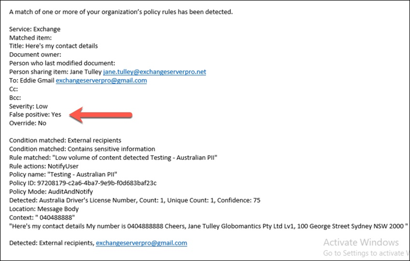

# Criar, testar e ajustar uma política DLP

**Autor da entidade**  
Paul Cunningham, MVP da Microsoft  
[Prática 365](https://practical365.com/)  
[@Practical365](https://twitter.com/practical365) 
__________________________________________________

A prevenção de perda de dados é um recurso de conformidade do Office 365 projetado para ajudar sua organização a impedir a exposição intencional ou acidental de informações confidenciais a partes indesejadas. O DLP tem suas raízes no Exchange Server e no Exchange Online e também se aplica ao SharePoint Online e ao OneDrive for Business.

A DLP usa um mecanismo de análise de conteúdo para examinar o conteúdo de mensagens e arquivos de email, procurando informações confidenciais, como números de cartões de crédito e PII (informações de identificação pessoal). As informações confidenciais normalmente não devem ser enviadas por email ou incluídas em documentos, sem realizar etapas adicionais, como criptografar a mensagem de email ou os arquivos. Usando DLP, você pode detectar informações confidenciais e tomar ações como:

- Registrar o evento para fins de auditoria
- Exibir um aviso para o usuário final que está enviando o email ou compartilhando o arquivo
- Bloquear ativamente o email ou o compartilhamento de arquivos

Às vezes, os clientes descartam DLP, pois eles não se consideram ter o tipo de dados que precisa de proteção. A pressuposição é que dados confidenciais, como registros médicos ou informações financeiras, existe apenas para indústrias como assistência médica ou para empresas que executam lojas online. Mas qualquer empresa pode manipular informações confidenciais regularmente, mesmo que não percebam. Uma planilha de nomes de funcionários e datas de nascimento é tão confidencial quanto uma planilha de nomes de clientes e detalhes de cartão de crédito. E esse tipo de informação tende a flutuar em torno de mais do que você pode esperar, à medida que os funcionários vão quase todas as tarefas diárias, não considerando nada de exportar um arquivo CSV de um sistema e enviar por email para alguém. Você também pode se surpreender com a frequência com que os funcionários enviam emails contendo detalhes de cartão de crédito ou do banco sem considerar as conseqüências.

## Como as informações confidenciais são detectadas pela DLP

As informações confidenciais são identificadas por correspondência de padrões de expressão regular (RegEx), em combinação com outros indicadores, como a proximidade de determinadas palavras-chave para os padrões correspondentes. Um exemplo disso é números de cartões de crédito. Um número de cartão de crédito da VISA tem 16 dígitos. No entanto, esses dígitos podem ser escritos de maneiras diferentes, como 1111-1111-1111-1111, 1111 1111 1111 1111 ou 1111111111111111.

Qualquer cadeia de 16 dígitos não é necessariamente um número de cartão de crédito, pode ser um número de tíquete de um sistema de suporte técnico ou um número de série de hardware. Para indicar a diferença entre um número de cartão de crédito e uma cadeia de 16 dígitos inofensiva, um cálculo é executado (checksum) para confirmar que os números correspondem a um padrão conhecido das várias marcas de cartão de crédito.

Além disso, a proximidade de palavras-chave como "VISA" ou "AMEX", juntamente com a proximidade dos valores de data que podem ser a data de vencimento do cartão de crédito, também é considerada para tomar uma decisão sobre se os dados são um número de cartão de crédito ou não.

Em outras palavras, a DLP normalmente é inteligente o suficiente para reconhecer a diferença entre esses dois textos em um email:

- "Você pode solicitar um novo laptop. Use o número do meu VISA 1111-1111-1111-1111, expirar 11/22 e envie-me a data de entrega estimada quando você o tiver. "
- "Meu número de série do laptop é 2222-2222-2222-2222 e foi comprado em 11/2010. A propósito, o meu visto de viagens ainda está aprovado? "

Uma boa referência para manter o indicador é este [tópico sobre tipos de informações confidenciais](what-the-sensitive-information-types-look-for.md) que explica como cada tipo de informação é detectado.

## Onde começar com a prevenção contra perda de dados

Quando os riscos de perda de dados não são totalmente óbvios, é difícil descobrir onde exatamente você deve começar com a implementação de DLP. Felizmente, as políticas de DLP podem ser executadas no "modo de teste", permitindo que você avalie sua eficácia e precisão antes de ligá-los.

As políticas de DLP do Exchange Online podem ser gerenciadas por meio do centro de administração do Exchange. Mas você pode configurar políticas de DLP para todas as cargas de trabalho por meio do centro de conformidade & segurança, portanto, é o que usarei para demonstrações neste artigo. No centro de conformidade & segurança, você encontrará as políticas de DLP em**política**de **prevenção** > de perda de dados. Clique em **criar uma política** para iniciar.

O Office 365 fornece uma variedade de [modelos de política de DLP](what-the-dlp-policy-templates-include.md) que você pode usar para criar políticas de DLP. Digamos que você seja um negócio australiano. Você pode filtrar os modelos de política para exibir apenas aqueles que são relevantes para a Austrália, que se enquadram nas categorias gerais de finanças, médicos e saúde e privacidade.

Para esta demonstração, eu escolheria dados de informações de identificação pessoal (PII) australiano, que inclui os tipos de informações do número de arquivo de impostos australiano (TFN) e número da carteira de motorista.

Dê um nome à sua nova política de DLP. O nome padrão corresponderá ao modelo de política de DLP, mas você deverá escolher um nome mais descritivo próprio, porque várias políticas podem ser criadas a partir do mesmo modelo.

Escolha os locais aos quais a política será aplicada. As políticas de DLP podem ser aplicadas ao Exchange Online, SharePoint Online e OneDrive for Business. Vou deixar essa política configurada para aplicar a todos os locais.

Na primeira etapa de **configurações de política** , aceite os padrões por enquanto. Há muita personalização que você pode fazer em políticas de DLP, mas os padrões são um local fino para iniciar.

Após clicar **em Avançar** , você verá uma página de **configurações de política** adicional com mais opções de personalização. Para uma política que você está apenas testando, aqui está onde você pode começar a fazer alguns ajustes.

- Eu desativei as dicas de política por enquanto, o que é uma etapa razoável a ser tomada se você estiver apenas testando tudo e não quiser exibir nada para os usuários ainda. As dicas de política exibem avisos para os usuários que eles estão prestes a violar uma política de DLP. Por exemplo, um usuário do Outlook verá um aviso informando que o arquivo que ele anexou contém números de cartão de crédito e fará com que seu email seja rejeitado. O objetivo das dicas de política é interromper o comportamento em não conformidade antes que isso aconteça.
- Também reduzi o número de instâncias de 10 para 1, para que essa política detecte qualquer compartilhamento de dados PII australianos, e não apenas o compartilhamento em massa dos dados.
- Também adicionei outro destinatário ao email do relatório de incidentes.

Por fim, configurei essa política para ser executada no modo de teste inicialmente. Observe também há uma opção aqui para desabilitar as dicas de política no modo de teste. Isso dá a você a flexibilidade de ter dicas de política habilitadas na política, mas decida se deseja mostrá-las ou suprime-las durante o teste.

Na tela última revisão, clique em **criar** para concluir a criação da política.

## Testar uma política de DLP

Sua nova política de DLP começará a ser aplicada em cerca de 1 hora. Você pode sentar-lo e aguardar até que ele seja disparado pela atividade normal do usuário, ou você pode tentar dispará-lo sozinho. Anteriormente vinculo a este [tópico sobre tipos de informações confidenciais](what-the-sensitive-information-types-look-for.md), que fornece informações sobre como disparar correspondências DLP.

Por exemplo, a política de DLP que criei para este artigo detectará os números de arquivo de impostos australianos (TFN). De acordo com a documentação, a correspondência é baseada nos critérios a seguir.

 
Para demonstrar a detecção de TFN de uma maneira mais econômica, um email com as palavras "número do arquivo de impostos" e uma cadeia de 9 dígitos na proximidade será Sail por meio de qualquer problema. O motivo pelo qual a política de DLP não é acionada é que a cadeia de caracteres de 9 dígitos deve passar a soma de verificação que indica que é um TFN válido e não apenas uma cadeia de caracteres inofensiva de números.

Em comparação, um email com as palavras "número do arquivo de impostos" e um TFN válido que passa a soma de verificação acionará a política. Para o registro aqui, o TFN que estou usando foi obtido de um site que gera um TFNs válido, mas não autêntico. Há sites semelhantes que geram [números de cartão de crédito válidos, mas falsificados](http://www.fakecreditcardgenerator.net/). Esses sites são muito úteis porque um dos erros mais comuns ao testar uma política de DLP é usar um número falso que não é válido e não passará na soma de verificação (e, portanto, não acionará a política).

O email de relatório de incidentes inclui o tipo de informações confidenciais que foram detectadas, quantas instâncias foram detectadas e o nível de confiança da detecção.

Se você deixar sua política de DLP no modo de teste e analisar os emails de relatório de incidentes, você pode começar a se familiarizar com a precisão da política de DLP e como ela será aplicada. Além dos relatórios de incidentes, você pode [usar os relatórios de DLP](view-the-dlp-reports.md) para ver uma exibição agregada de correspondências de política em seu locatário.

## Ajustar uma política de DLP

À medida que você analisar seus acertos de política, talvez queira fazer alguns ajustes em como as políticas se comportam. Como um exemplo simples, você pode determinar que um TFN no email não é um problema (acho que ele ainda é, mas vamos prosseguir com isso para demonstração), mas duas ou mais instâncias são um problema. Várias instâncias podem ser um cenário arriscado, como um funcionário enviando uma exportação de CSV do banco de dados de RH para uma parte externa, por exemplo, um serviço de contabilidade externo. Definitivamente, algo que você prefere detectar e bloquear.

No centro de conformidade & segurança, você pode editar uma política existente para ajustar o comportamento.

 
Você pode ajustar as configurações de local para que a política seja aplicada somente a cargas de trabalho específicas ou a sites e contas específicos.

Você também pode ajustar as configurações de política e editar as regras para atender melhor às suas necessidades.

Ao editar uma regra em uma política de DLP, você pode alterar:

- As condições, incluindo o tipo e o número de instâncias de dados confidenciais que irão acionar a regra.
- As ações que são executadas, como restringir o acesso ao conteúdo.
- Notificações de usuário, que são dicas de política que são exibidas para o usuário em seu cliente de email ou navegador da Web.
- User Overrides, que determina se os usuários podem optar por continuar com seus emails ou compartilhamento de arquivos.
- Relatórios de incidentes para notificar os administradores.

Para esta demonstração, adicionei notificações de usuário à política (seja cuidadoso ao fazê-lo sem o treinamento adequado do usuário) e permitia que os usuários substituam a política por uma justificativa comercial ou sinalizando-a como falso positivo. Observe que você também pode personalizar o texto de dica de política e email se quiser incluir informações adicionais sobre as políticas da sua organização ou solicitar que os usuários entrem em contato com o suporte caso tenham dúvidas.

A política contém duas regras para manipulação de alto volume e volume baixo, portanto, não deixe de editar as duas com as ações desejadas. Essa é uma oportunidade para tratar casos de forma diferente dependendo de suas características. Por exemplo, você pode permitir substituições para violações de volume baixo, mas não permitir substituições de altas violações de volume.

Além disso, se você quiser bloquear ou restringir o acesso ao conteúdo que está violando a política, precisará configurar uma ação na regra para fazê-lo.

Após salvar essas alterações nas configurações de política, também preciso retornar à página de configurações principal da política e habilitar a opção para mostrar dicas de política aos usuários enquanto a política estiver no modo de teste. Essa é uma maneira eficaz de apresentar políticas de DLP aos seus usuários finais e do treinamento de conscientização do usuário, sem o risco de muitos falsos positivos que impactam sua produtividade.

No lado do servidor (ou no lado da nuvem, se preferir), a alteração pode não ter efeito imediato, devido a vários intervalos de processamento. Se você estiver fazendo uma alteração na política de DLP que exibirá as novas dicas de política para um usuário, o usuário poderá não ver as alterações serão efetivadas imediatamente no cliente do Outlook, que verifica as alterações de política a cada 24 horas. Se você quiser acelerar as coisas para teste, você pode usar essa correção de registro para [limpar o último carimbo de data/hora da chave PolicyNudges](https://support.microsoft.com/en-au/help/2823261/changes-to-a-data-loss-prevention-policy-don-t-take-effect-in-outlook?__hstc=18650278.46377037dc0a82baa8a30f0ef07a7b2f.1538687978676.1538693509953.1540315763430.3&__hssc=18650278.1.1540315763430&__hsfp=3446956451). O Outlook baixará as informações mais recentes da política na próxima vez que você reiniciar e começar a redigir uma mensagem de email.

Se você tiver dicas de política habilitadas, o usuário começará a ver as dicas no Outlook e poderá relatar falsos positivos quando elas ocorrerem.

## Investigar falsos positivos

Os modelos de política de DLP não são perfeitos diretamente. É provável que você encontre alguns falsos positivos que ocorrem no seu ambiente, o que é o motivo pelo qual é tão importante simplificar sua maneira em uma implantação de DLP, levando o tempo para testar e ajustar adequadamente suas políticas.

Veja um exemplo de falso positivo. Este email é bastante inofensivo. O usuário está fornecendo seu número de telefone celular para alguém e incluindo sua assinatura de email.

 
No entanto, o usuário vê uma dica de política avisando que o email contém informações confidenciais, especificamente, o número da carteira de motorista da Austrália.

O usuário pode relatar o falso positivo e o administrador pode examinar o motivo pelo qual ele ocorreu. No email de relatório de incidentes, o email é sinalizado como falso positivo.

Este caso de licença do driver é um bom exemplo para se aprofundar no. O motivo pelo qual esse falso positivo ocorreu é que o tipo "licença do motorista australiano" será disparado por qualquer cadeia de caracteres de 9 dígitos (mesmo que seja parte de uma cadeia de 10 dígitos), em 300 caracteres de proximidade com as palavras-chave "Sydney NSW" (não diferencia maiúsculas de minúsculas). Portanto, ele é disparado pelo número de telefone e assinatura de email, somente porque o usuário está em Sydney.

Curiosamente, se "Sydney, NSW" tem uma vírgula, a política de DLP não é disparada. Não tenho idéia de por que uma vírgula faz qualquer diferença aqui, nem por que outras cidades e Estados na Austrália não estão incluídos nas palavras-chave para o tipo de informação de licença do driver australiano, mas lá você vai. Então, o que podemos fazer? Há algumas opções.

Uma opção é remover o tipo de informação de licença da Austrália do driver da política. Ele está lá porque faz parte do modelo de política de DLP, mas não é obrigado a usá-lo. Se você estiver interessado apenas em números de arquivo de impostos e não em licenças de driver, basta removê-lo. Por exemplo, você pode removê-lo da regra de volume baixo na política, mas deixá-lo na regra de alto volume para que as listas de várias licenças de drivers ainda sejam detectadas.

 
Outra opção é simplesmente aumentar a contagem de instância, para que um volume baixo de licenças do driver seja detectado apenas quando houver várias instâncias.

Além de alterar a contagem de instâncias, você também pode ajustar a precisão da correspondência (ou nível de confiança). Se seu tipo de informação confidencial tiver vários padrões, você poderá ajustar a precisão da correspondência em sua regra, para que sua regra corresponda apenas a padrões específicos. Por exemplo, para ajudar a reduzir falsos positivos, você pode definir a precisão da correspondência de sua regra para que ela corresponda apenas ao padrão com o nível de maior confiança. Entender como o nível de confiança é calculado é um pouco complicado (e além do escopo desta postagem), mas aqui está uma boa explicação de [como usar o nível de confiança para ajustar suas regras](https://docs.microsoft.com/en-us/office365/securitycompliance/data-loss-prevention-policies#match-accuracy).

Por fim, se você deseja obter um pouco mais avançado, é possível personalizar qualquer tipo de informação confidencial – por exemplo, você pode remover "Sydney NSW" da lista de palavras-chave da [licença do motorista australiano](https://docs.microsoft.com/en-us/office365/securitycompliance/what-the-sensitive-information-types-look-for#australia-drivers-license-number), para eliminar o falso positivo acionado acima. Para saber como fazer isso usando o XML e o PowerShell, consulte este tópico sobre como [Personalizar um tipo de informação confidencial interno](customize-a-built-in-sensitive-information-type.md).

## Desativar uma política de DLP

Quando você estiver contente que sua política de DLP está detectando com precisão e eficácia tipos de informações confidenciais e que seus usuários finais estão prontos para lidar com as políticas em vigor, é possível habilitar a política.

 
Se você estiver esperando para ver quando a política entrará em vigor, [Conecte-se ao PowerShell do centro de conformidade & segurança](https://docs.microsoft.com/en-us/powershell/exchange/office-365-scc/connect-to-scc-powershell/connect-to-scc-powershell?view=exchange-ps) e execute o [cmdlet Get-DlpCompliancePolicy](https://docs.microsoft.com/en-us/powershell/module/exchange/policy-and-compliance-dlp/get-dlpcompliancepolicy?view=exchange-ps) para ver o DistributionStatus.

Após ativar a política de DLP, você deve executar alguns testes finais próprios para garantir que as ações de política esperadas estejam ocorrendo. Se você estiver tentando testar itens como dados de cartão de crédito, há sites online com informações sobre como gerar o exemplo de cartão de crédito ou outras informações pessoais que passarão somas de verificação e dispararão suas políticas.

As políticas que permitem que o usuário substitua essa opção ao usuário como parte da dica de política.

As políticas que restringem o conteúdo apresentarão o aviso ao usuário como parte da dica de política e impedirão o envio do email.

## Resumo

As políticas de prevenção de perda de dados são úteis para organizações de todos os tipos. Testar algumas políticas de DLP é um exercício de baixo risco devido ao controle que você tem sobre as coisas como dicas de política, substituições de usuário final e relatórios de incidentes. Você pode testar silenciosamente algumas políticas de DLP para ver que tipo de violação já está ocorrendo em sua organização e, em seguida, criar políticas com baixas taxas de falsos positivos, instruir os usuários sobre o que é permitido e não permitido e, em seguida, distribuir suas políticas de DLP para o departamento.
