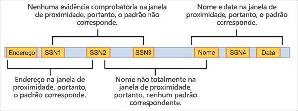
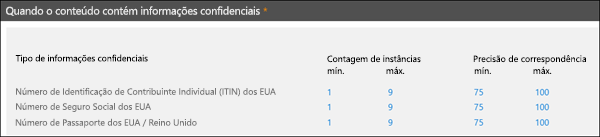

# Tipos de informações confidenciais personalizadas

## Visão geral

O Office 365 inclui muitos tipos de informações confidenciais integrados que estão prontos para você usar em sua organização, como para [prevenção de perda de dados](data-loss-prevention-policies.md) (DLP) ou com o [Microsoft Cloud App Security](https://docs.microsoft.com/cloud-app-security). Os tipos de informações confidenciais integrados podem ajudar a identificar e proteger números de cartão de crédito, números de contas bancárias, números de passaporte e muito mais, com base em padrões definidos por uma expressão regular (regex) ou por uma função. Para saber mais, consulte [O que os tipos de informações confidenciais procuram](what-the-sensitive-information-types-look-for.md).

Mas e se você precisar identificar e proteger um tipo diferente de informações confidenciais, como IDs de funcionários ou números de projetos, usando um formato específico para sua organização? Para fazer isso, você pode criar um tipo de informação confidencial personalizado.

As partes fundamentais de um tipo personalizado de informações confidenciais são:

- **Padrão principal**: números de ID de funcionário, números de projeto etc. Isso geralmente é identificado por uma expressão regular (RegEx), mas também pode ser uma lista de palavras-chave.

- **Evidências adicionais**: digamos que você esteja procurando por um número de ID de funcionário de nove dígitos. Nem todos os números de nove dígitos são números de ID de funcionário. Portanto, você pode pesquisar por texto adicional: palavras-chave como "funcionário", "crachá", "ID" ou outros padrões de texto com base em expressões regulares adicionais. Evidências de suporte (também chamadas de _suporte_ ou evidências _comprobatórias_) aumentam a probabilidade de que o número de nove dígitos no conteúdo seja realmente um número de ID de funcionário.

- **Caractere de proximidade**: faz sentido que quanto mais próximos o padrão principal e as evidências de suporte estejam entre si, mais provável seja que o conteúdo detectado seja o que você está procurando. Você pode especificar a distância de caracteres entre o padrão principal e as evidências de suporte (também conhecido como a _janela de proximidade_), conforme mostrado no seguinte diagrama:

    

- **Nível de confiança**: quanto mais evidências de suporte você tiver, maior será a probabilidade de que uma correspondência contenha as informações confidenciais que está procurando. Você pode atribuir níveis mais altos de confiança para correspondências detectadas usando mais evidências.

  Quando satisfeito, um padrão retorna uma contagem e um nível de confiança, que você pode usar nas condições de políticas DLP. Ao adicionar uma condição para detectar um tipo de informação confidencial a uma política DLP, você poderá editar o nível de confiança e a contagem, conforme mostrado no seguinte diagrama:

    

## Criando tipos de informações confidenciais personalizadas

Para criar tipos de informações confidenciais personalizadas no Centro de Conformidade e Segurança, você pode escolher entre várias opções:

- **Use EDM** (NOVO!) Você pode configurar tipos de informações confidenciais personalizadas usando a classificação baseada em Exact Data Match (EDM). Esse método permite criar um tipo de informações confidenciais dinâmico usando um banco de dados seguro que você pode atualizar periodicamente. Confira [Criar um tipo de informações confidenciais personalizadas com classificação baseada em Exact Data Match](create-custom-sensitive-information-types-with-exact-data-match-based-classification.md).

- **Use o PowerShell** Você pode configurar tipos de informações confidenciais personalizadas usando o PowerShell. Embora esse método seja mais complexo do que usar a interface do usuário, você tem mais opções de configuração. Consulte [Criar um tipo de informações confidenciais personalizadas no Centro de Conformidade e Segurança do PowerShell](create-a-custom-sensitive-information-type-in-scc-powershell.md).

- **Usar a interface do usuário** Você pode configurar um tipo de informações confidenciais personalizadas usando o a interface do usuário do Centro de Conformidade e Segurança. Com esse método, você pode usar expressões comuns, palavras-chave e dicionários de palavras-chave. Para saber mais, confira [Criar um tipo de informações confidenciais personalizadas](create-a-custom-sensitive-information-type.md).

