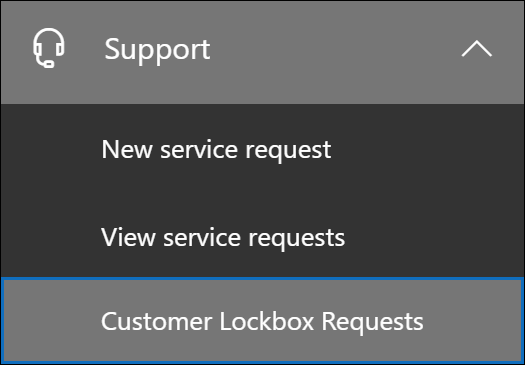

# Lockbox de cliente no Office 365Customer Lockbox in Office 365

> [!NOTE]
> Este artigo fornece orientações de implantação e configuração para um recurso atualmente disponível apenas para organizações que têm um Microsoft 365 e5, o Office 365 e5, a proteção de informações e conformidade ou a assinatura de complemento de conformidade avançada.This article provides deployment and configuration guidance for a feature that is currently available only for organizations that have a Microsoft 365 E5, Office 365 E5, Information Protection and Compliance, or Advanced Compliance add-on subscription.

A Lockbox do cliente garante que a Microsoft não possa acessar seu conteúdo para executar uma operação de serviço sem a sua aprovação explícita.Customer Lockbox ensures that Microsoft cannot access your content to perform a service operation without your explicit approval. O Lockbox do cliente o coloca no fluxo de trabalho de aprovação para solicitações de acesso ao seu conteúdo.Customer Lockbox brings you into the approval workflow for requests to access your content.

Ocasionalmente, os engenheiros da Microsoft ajudam a solucionar problemas e corrigir problemas relatados pelo cliente no processo de suporte.Occasionally, Microsoft engineers help troubleshoot and fix customer reported issues in the support process. Normalmente, os problemas são corrigidos por ferramentas de telemetria e depuração abrangentes que a Microsoft tem em vigor para seus serviços.Usually, issues are fixed through extensive telemetry and debugging tools Microsoft has in place for its services. No entanto, alguns casos exigem um engenheiro da Microsoft para acessar o conteúdo do cliente para determinar a causa raiz e corrigir o problema.However, some cases require a Microsoft engineer to access customer content to determine the root cause and fix the issue. A Lockbox do cliente exige que o engenheiro solicite acesso do cliente como uma etapa final no fluxo de trabalho de aprovação.Customer Lockbox requires the engineer to request access from the customer as a final step in the approval workflow. Isso oferece às organizações a opção de aprovar ou negar essas solicitações e fornecer controle de acesso direto ao cliente.This gives organizations the option to approve or deny these requests, and provide direct access control to the customer.

### Vídeo visão geral da Lockbox de clientesCustomer Lockbox overview video

> [!VIDEO https://www.microsoft.com/videoplayer/embed/8fecf10b-1f03-4849-8b67-76d3d2a43f26?autoplay=false]

> [!NOTE]
> O Lockbox do cliente oferece suporte a solicitações de acesso a dados no Exchange Online, no SharePoint Online e no OneDrive for Business.Customer Lockbox supports requests to access data in Exchange Online, SharePoint Online, and OneDrive for Business. Para recomendar o suporte para outros serviços do Office 365, envie uma solicitação no [Office 365 UserVoice](https://office365.uservoice.com/).To recommend support for other Office 365 services, please submit a request at [Office 365 UserVoice](https://office365.uservoice.com/).

## Fluxo de trabalho de lockbox do clienteCustomer Lockbox workflow

As etapas a seguir descrevem o fluxo de trabalho típico quando uma solicitação de lockbox do cliente é iniciada por um engenheiro da Microsoft:The following steps outline the typical workflow when a Customer Lockbox request is initiated by a Microsoft engineer:

1. Alguém em uma organização tem um problema com sua caixa de correio do Office 365.Someone at an organization has an issue with their Office 365 mailbox.

2. Depois que o usuário solucionar o problema, mas não conseguir corrigi-lo, ele abrirá uma solicitação de suporte com o suporte da Microsoft.After the user troubleshoots the issue, but can't fix it, they open a support request with Microsoft Support.

3. Um engenheiro de suporte revisa a solicitação de serviço e determina a necessidade de acessar o conteúdo do Exchange Online do cliente para reparar o problema.A support engineer reviews the service request and determines a need to access customer’s Exchange Online content to repair the issue.

4. O engenheiro de suporte faz logon na ferramenta de solicitação de lockbox do cliente e faz uma solicitação de acesso aos dados especificando o nome do locatário do cliente, o número da solicitação de serviço e a duração estimada para a qual o acesso aos dados é necessário.The support engineer logs into the Customer Lockbox request tool and makes a data access request by specifying the customer's tenant name, service request number, and the estimated duration for which access to the data is needed.

5. Depois que um gerente de suporte da Microsoft aprova a solicitação, o Lockbox do cliente envia o aprovador designado na organização do cliente uma notificação por email sobre a solicitação de acesso pendente da Microsoft.After a Microsoft Support manager approves the request, Customer Lockbox sends the designated approver at the customer's organization an email notification about the pending access request from Microsoft.

    

   > [!NOTE]
   > Qualquer pessoa que tenha atribuído a função de administrador do aprovador de [acesso de lockbox do cliente](https://docs.microsoft.com/office365/admin/add-users/about-admin-roles) no centro de administração do Microsoft 365 pode aprovar as solicitações de lockbox do cliente.Anyone who is assigned the [Customer Lockbox access approver](https://docs.microsoft.com/office365/admin/add-users/about-admin-roles) admin role in Microsoft 365 admin center can approve Customer Lockbox requests.

7. O aprovador entra no centro de administração do Microsoft 365 e aprova a solicitação.The approver signs in to the Microsoft 365 admin center and approves the request. Esta etapa dispara a criação de um registro de auditoria disponível pesquisando o log de auditoria do Office 365.This step triggers the creation of an audit record available by searching the Office 365 audit log. Para obter mais informações, consulte a seção [solicitações de lockbox de cliente de auditoria](#auditing-customer-lockbox-requests) .For more information, see the [Auditing Customer Lockbox requests](#auditing-customer-lockbox-requests) section.

   Se o cliente rejeitar a solicitação ou a solicitação não for aprovada dentro de 12 horas, a solicitação expirará e nenhum acesso será concedido ao engenheiro da Microsoft.If the customer rejects the request or the request isn’t approved within 12 hours, the request expires and no access is granted to the Microsoft engineer.

   > [!IMPORTANT]
   > A Microsoft não inclui nenhum link em notificações por email de lockbox de clientes que exijam que você entre no Office 365.Microsoft does not include any links in Customer Lockbox email notifications requiring you to sign in to Office 365.

8. Depois que o cliente aprova a solicitação, o engenheiro da Microsoft recebe a mensagem de aprovação, faz logon no Exchange Online e corrige o problema do cliente.After the customer approves the request, the Microsoft engineer receives the approval message, logs into Exchange Online, and fixes the customer's issue. Os engenheiros da Microsoft têm a duração solicitada para corrigir o problema após o qual o acesso é automaticamente revogado.Microsoft engineers have the requested duration to fix the issue after which the access is automatically revoked.

> [!NOTE]
> Todas as ações executadas por um engenheiro da Microsoft são registradas no log de auditoria do Office 365.All actions performed by a Microsoft engineer are logged in the Office 365 audit log. Você pode pesquisar e revisar esse registro de auditoria e pode ser pesquisada e revisada.You can search for and review these audit record and can be searched for and reviewed.

## Ativar ou desativar solicitações de lockbox do clienteTurn Customer Lockbox requests on or off

Um administrador do Office 365 pode ativar os controles de lockbox do cliente no centro de administração do Microsoft 365.An Office 365 administrator can turn on Customer Lockbox controls in the Microsoft 365 admin center. Quando a Lockbox do cliente está ativada, a Microsoft é obrigada a obter aprovação de uma organização antes de acessar qualquer um de seus conteúdos.When Customer Lockbox is turned on, Microsoft is required to obtain an organization’s approval before accessing any of their content.

> [!NOTE]
> Para executar o procedimento a seguir, você deve ser um administrador global em sua organização do Microsoft 365 ou do Office 365 ou receber a função de administrador do aprovador de **acesso de lockbox do cliente** .To perform the following procedure, you must be a global administrator in your Microsoft 365 or Office 365 organization, or be assigned the **Customer Lockbox access approver** admin role.

1. Acesse [https://admin.microsoft.com](https://admin.microsoft.com) e entre com sua conta corporativa ou de estudante.Go to [https://admin.microsoft.com](https://admin.microsoft.com) and sign in with your work or school account.

2. Clique em **configurações _GT_ segurança & privacidade**.Click **Settings > Security & privacy**.

    

3. No bloco de **Lockbox do cliente** , clique em **Editar**e, em seguida, mova a opção para **ativado** ou **desativado** para ativar ou desativar o recurso.On the **Customer Lockbox** tile, click **Edit**, and then move the toggle to **On** or **Off** to turn the feature on or off.

    

## Aprovar ou negar uma solicitação de lockbox do clienteApprove or deny a Customer Lockbox request

> [!NOTE]
> Para executar o procedimento a seguir, você deve ser um administrador global em sua organização do Microsoft 365 ou do Office 365 ou receber a função de administrador do aprovador de **acesso de lockbox do cliente** .To perform the following procedure, you must be a global administrator in your Microsoft 365 or Office 365 organization, or be assigned the **Customer Lockbox access approver** admin role.

1. Acesse [https://admin.microsoft.com](https://admin.microsoft.com) e entre com sua conta corporativa ou de estudante.Go to [https://admin.microsoft.com](https://admin.microsoft.com) and sign in with your work or school account.

2. Clique em **suporte para solicitações de lockbox do cliente do >**.Click **Support > Customer Lockbox Requests**.

    

    Uma lista de solicitações de lockbox do cliente é exibida.A list of Customer Lockbox requests is displayed.

    

3. Selecione uma solicitação de lockbox de cliente e clique em **aprovar** ou **negar**.Select a Customer Lockbox request, and then click **Approve** or **Deny**.

    

    É exibida uma mensagem de confirmação sobre a aprovação da solicitação de lockbox do cliente.A confirmation message about the approval of the Customer Lockbox request is displayed.

    

## Auditar solicitações de lockbox do clienteAuditing Customer Lockbox requests 

Os registros de auditoria que correspondem às solicitações de lockbox do cliente são registrados no log de auditoria do Office 365 e podem ser acessados usando a [ferramenta de pesquisa de log de auditoria](https://docs.microsoft.com/office365/securitycompliance/search-the-audit-log-in-security-and-compliance) no centro de conformidade do _AMP_ de segurança do Office 365.Audit records that correspond to the Customer Lockbox requests are logged in the Office 365 audit log and can be accessed by using the [Audit log search tool](https://docs.microsoft.com/office365/securitycompliance/search-the-audit-log-in-security-and-compliance) in the Office 365 Security & Compliance Center. As ações relacionadas a um cliente que aceita ou nega uma solicitação de lockbox de cliente e ações executadas por engenheiros da Microsoft (quando as solicitações de acesso são aprovadas) são registradas no log de auditoria do Office 365.Actions related to a customer accepting or denying a Customer Lockbox request and actions performed by Microsoft engineers (when access requests are approved) are logged in the Office 365 audit log. Você pode pesquisar e revisar esses registros de auditoria.You can search for and review these audit records.

> [!NOTE]
> Você precisa receber a função de logs de auditoria somente para exibição ou logs de auditoria no Exchange Online para pesquisar o log de auditoria do Office 365.You have to be assigned the View-Only Audit Logs or Audit Logs role in Exchange Online to search the Office 365 audit log. Para saber mais, confira [Pesquisar o log de auditoria no Centro de Conformidade e Segurança do Office 365](https://docs.microsoft.com/en-us/office365/securitycompliance/search-the-audit-log-in-security-and-compliance#before-you-begin).For more information, see [Search the audit log in the Office 365 Security & Compliance Center](https://docs.microsoft.com/en-us/office365/securitycompliance/search-the-audit-log-in-security-and-compliance#before-you-begin).

### Pesquisar o log de auditoria para atividades relacionadas às solicitações de lockbox do clienteSearch the audit log for activity related to Customer Lockbox requests

Confira aqui como criar uma consulta de pesquisa de log de auditoria para retornar registros de auditoria relacionados à Lockbox do cliente:Here's how to create an audit log search query to return audit records related to Customer Lockbox:

1. Acesse [https://protection.office.com](https://protection.office.com).Go to [https://protection.office.com](https://protection.office.com).
  
2. Entre no Office 365 usando a sua conta corporativa ou de estudante.Sign in to Office 365 using your work or school account.

3. No painel esquerdo do centro de conformidade do & de segurança, clique em pesquisa **& investigação** > de**log de auditoria**.In the left pane of the Security & Compliance Center, click **Search & investigation** > **Audit log search**.

    A página **pesquisa de log de auditoria** é exibida.The **Audit log search** page is displayed.

    
  
4. Configure os seguintes critérios de pesquisa:Configure the following search criteria:

    a.a. **Atividades** -deixe este campo em branco para que a pesquisa retorne registros de auditoria de todas as atividades.**Activities** - Leave this field blank so that the search returns audit records for all activities. Isso é necessário para retornar registros de auditoria relacionados às solicitações de lockbox do cliente e à atividade correspondente executada pelos engenheiros da Microsoft.This is necessary to return any audit records related to Customer Lockbox requests and corresponding activity performed by Microsoft engineers.

    b.b. **Data de início** e **data de término** -selecione um intervalo de data e hora para exibir os eventos que ocorreram dentro desse período.**Start date** and **End date** - Select a date and time range to display the events that occurred within that period.

    c.c. **Usuários** -deixe este campo em branco.**Users** - Leave this field blank.

    d.d. **Arquivo, pasta ou site** -deixe este campo em branco.**File, folder, or site** - Leave this field blank.

5. Clique em **Pesquisar** para executar a pesquisa usando seus critérios de pesquisa.Click **Search** to run the search using your search criteria. 

    Os resultados da pesquisa são carregados e após alguns momentos em que são exibidos em **resultados** na página **pesquisa de log de auditoria** .The search results are loaded, and after a few moments they are displayed under **Results** on the **Audit log search** page.

6. Clique em **filtrar resultados** na página de resultados da pesquisa e siga um destes procedimentos:Click **Filter results** on the search results page, and do one of the following things:

   - Para exibir registros de auditoria relacionados a um Aprovador em sua organização aprovar ou negar uma solicitação de lockbox de cliente: na caixa da coluna **atividade** , digite **set-AccessToCustomerDataRequest**.To display audit records related to an approver in your organization approving or denying a Customer Lockbox request: In the box under the **Activity** column, type **Set-AccessToCustomerDataRequest**.

   - Para exibir registros de auditoria relacionados a um engenheiro da Microsoft executando ações em resposta a uma solicitação de lockbox de cliente aprovado: na caixa abaixo da coluna **usuário** , digite **operador da Microsoft**.To display audit records related to a Microsoft engineer performing actions in response to an approved Customer Lockbox request: In the box under the **User** column, type **Microsoft Operator**. Observe que a ação executada pelo engenheiro é exibida int a coluna **atividade** .Note that the action performed by the engineer is displayed int the **Activity** column.

      

7. Na lista de resultados, clique em um registro de auditoria para exibi-lo.In the list of results, click an audit record to display it.

### Registro de auditoria para uma solicitação de acesso de lockbox do clienteAudit record for a Customer Lockbox access request

Quando uma pessoa em sua organização aprova ou nega uma solicitação de lockbox do cliente, um registro de auditoria é registrado no log de auditoria do Office 365.When a person in your organization approves or denies a Customer Lockbox request, an audit record is logged in the Office 365 audit log. Este registro contém as informações a seguir.This record contains the following information. 

| Propriedade do registro de auditoriaAudit record property| DescriçãoDescription|
|:---------- |:----------|
| DateDate       | A data e a hora em que a solicitação de lockbox do cliente foi aprovada ou negada.The date and time when the Customer Lockbox request was approved or denied.
| Endereço IPIP address | O endereço IP do computador que o aprovador usou para aprovar ou negar uma solicitação.The IP address of the machine the approver used to approve or deny a request. |
| UsuárioUser       | A conta de serviço BOXServiceAccount\[@\]customerforest. Prod.Outlook.com.The service account BOXServiceAccount@\[customerforest\].prod.outlook.com.            |
| AtividadeActivity   | Set-AccessToCustomerDataRequest; Esta é a atividade de auditoria que é registrada quando você aprova ou nega uma solicitação de lockbox do cliente.Set-AccessToCustomerDataRequest; this is the auditing activity that is logged when you approve or deny a Customer Lockbox request.                                |
| ItemItem       | O GUID da solicitação de lockbox do clienteThe Guid of the Customer Lockbox request                             |

A captura de tela a seguir mostra um exemplo de um registro de log de auditoria que corresponde a uma solicitação de lockbox de cliente aprovado.The following screenshot shows an example of an audit log record that corresponds to an approved Customer Lockbox request. Se uma solicitação de lockbox do cliente tiver sido negada, o valor do parâmetro **ApprovalDecision** seria **negado**.If a Customer Lockbox request was denied, then the value of **ApprovalDecision** parameter would be **Deny**.

> [!TIP]
> Para exibir informações mais detalhadas em um registro de auditoria, clique em **mais informações**.To display more detailed information in an audit record, click **More information**.

### Registro de auditoria para uma ação executada por um engenheiro da MicrosoftAudit record for an action performed by a Microsoft engineer

Conforme explicado anteriormente, as ações executadas por um engenheiro da Microsoft depois que uma solicitação de lockbox de cliente é aprovada (e que pode resultar no acesso ao conteúdo do cliente) são registradas no log de auditoria.As previously explained, the actions performed by a Microsoft engineer after a Customer Lockbox request is approved (and that may result in accessing customer content) are logged in the audit log. Esses registros contêm as informações a seguir.These records contain the following information.

| Propriedade do registro de auditoriaAudit record property| DescriçãoDescription|
|:---------- |:----------|
| DateDate       | Data e hora em que a ação foi executada.Date time when the action was performed. Observe que a hora em que essa ação foi executada estará dentro de 4 horas após a aprovação da solicitação de lockbox do cliente.Note that the time that this action was performed will be within 4 hours of when the Customer Lockbox request was approved.              |
| Endereço IPIP address | O endereço IP do engenheiro de máquina da Microsoft usado.The IP Address of the machine Microsoft engineer used. |
| UsuárioUser       | Operador da Microsoft; Esse valor indica que esse registro está relacionado a uma solicitação de lockbox do cliente.Microsoft Operator; this value indicates that this record is related to a Customer Lockbox request.                                  |
| AtividadeActivity   | Nome da atividade realizada pelo engenheiro da Microsoft.Name of the activity performed by the Microsoft engineer.|
| ItemItem       | \<Empty\>\<empty\>                                             |

## Perguntas frequentesFrequently asked questions

#### Para quais serviços do Office 365 a Lockbox do cliente se aplica?Which Office 365 services does Customer Lockbox apply to?

No momento, o Lockbox do cliente é compatível com o Exchange Online, o SharePoint Online e o OneDrive for Business.Customer Lockbox is currently supported in Exchange Online, SharePoint Online, and OneDrive for Business.

#### A Lockbox de cliente está disponível para todos os clientes do Office 365?Is Customer Lockbox available to all Office 365 customers?

O Lockbox do cliente está incluído nas assinaturas do Microsoft 365 ou do Office 365 E5 e pode ser adicionado a outros planos com proteção e conformidade de informações ou uma assinatura complementar de conformidade avançada.Customer Lockbox is included with the Microsoft 365 or Office 365 E5 subscriptions and can be added to other plans with an Information Protection and Compliance or an Advanced Compliance add-on subscription. Confira [planos e preços](https://products.office.com/business/office-365-enterprise-e5-business-software) para obter mais informações.Please see [Plans and pricing](https://products.office.com/business/office-365-enterprise-e5-business-software) for more information.

#### O que é conteúdo do cliente?What is customer content?

O conteúdo do cliente é os dados criados por usuários dos serviços e aplicativos do Office 365.Customer content is the data created by users of Office 365 services and applications. Exemplos de conteúdo do cliente incluem:Examples of customer content include:

- Envio de email ou anexos de emailEmail body or email attachments

- Conteúdo do site do SharePointSharePoint site contents

- Informações no corpo de um arquivo do SharePointInformation in the body of a SharePoint file

- Corpo do arquivo de apresentação do Skype for BusinessSkype for Business presentation file body

- Mensagens instantâneas (IM) ou conversas de vozInstant messages (IM) or voice conversations

- Blob gerado pelo cliente ou dados de armazenamento estruturados (por exemplo, contêineres SQL)Customer-generated blob or structured storage data (for example, SQL Containers)

- Informações de segurança de Propriedade do cliente (por exemplo, certificados, chaves de criptografia e senhas)Customer-owned security information (for example, certificates, encryption keys, and passwords)

- Inferências e todas as inferências subsequentes, se o conteúdo do cliente permanecerInferences, and all subsequent inferences, if customer content remains

Para obter informações adicionais sobre o conteúdo do cliente no Office 365, consulte a [central de confiabilidade do office 365](https://products.office.com/en-US/business/office-365-trust-center-privacy/).For additional information about customer content in Office 365, see the [Office 365 Trust Center](https://products.office.com/en-US/business/office-365-trust-center-privacy/).

#### Quem é notificado quando há uma solicitação para acessar meu conteúdo?Who is notified when there is a request to access my content?

Os administradores globais e qualquer pessoa que tenha atribuído a função de administrador de aprovador do acesso de lockbox do cliente são notificados.Global administrators and anyone assigned the Customer Lockbox access approver admin role are notified. Eles também são os mesmos usuários que podem aprovar solicitações de lockbox do cliente.These are also the same users who can approve for Customer Lockbox requests.

#### Quem pode aprovar ou rejeitar essas solicitações em minha organização?Who can approve or reject these requests in my organization?

Os administradores globais e qualquer pessoa que tenha atribuído a função de administrador do aprovador de acesso de lockbox do cliente podem aprovar solicitações de lockbox do cliente.Global administrators and anyone assigned the Customer Lockbox access approver admin role can approve Customer Lockbox requests. Os clientes controlam essas atribuições de função em suas organizações.Customers control these role assignments in their organizations.

#### Como faço para optar pela Lockbox do cliente?How do I opt-in to Customer Lockbox?

Um administrador global pode habilitar e configurar O Lockbox do cliente no centro de administração do Microsoft 365 ou do Microsoft 365.A global administrator can enable and configure Customer Lockbox in the Microsoft 365 or Microsoft 365 admin center.

#### Se eu aprovar uma solicitação de lockbox do cliente, o que o engenheiro pode fazer e como saberei o que o engenheiro da Microsoft fazia?If I approve a Customer Lockbox request, what can the engineer do and how will I know what the Microsoft engineer did?

Depois que você aprova uma solicitação de lockbox do cliente, o engenheiro da Microsoft concedeu esses privilégios necessários para acessar o conteúdo do cliente usando cmdlets pré-aprovados.After you approve a Customer Lockbox request, the Microsoft engineer granted these necessary privileges to access customer content by using pre-approved cmdlets. Ações executadas por engenheiros da Microsoft em resposta a solicitações de lockbox do cliente são registradas e acessíveis no log de auditoria no centro de conformidade do & de segurança do Office 365.Actions taken by Microsoft engineers in response to Customer Lockbox requests are logged and accessible in the audit log in the Office 365 Security & Compliance Center.

#### Como saber se a Microsoft segue o processo de aprovação?How do I know that Microsoft follows the approval process?

Você pode fazer referência cruzada as notificações de aprovação de email enviadas para administradores e aprovadores em sua organização com o histórico de solicitação de lockbox do cliente no centro de administração do Microsoft 365.You can cross-reference the email approval notifications sent to admins and approvers in your organization with the Customer Lockbox request history in the Microsoft 365 admin center.

O Lockbox do cliente está incluído no relatório de auditoria mais recente do [SOC 1 SSAE 16](https://servicetrust.microsoft.com/ViewPage/MSComplianceGuide?command=Download&downloadType=Document&downloadId=91592749-e86a-43ac-801e-121382614681&docTab=4ce99610-c9c0-11e7-8c2c-f908a777fa4d_SOC%20%2F%20SSAE%2016%20Reports).Customer Lockbox is included in the latest [SOC 1 SSAE 16 audit report](https://servicetrust.microsoft.com/ViewPage/MSComplianceGuide?command=Download&downloadType=Document&downloadId=91592749-e86a-43ac-801e-121382614681&docTab=4ce99610-c9c0-11e7-8c2c-f908a777fa4d_SOC%20%2F%20SSAE%2016%20Reports). Para obter mais detalhes, você pode encontrar os relatórios mais recentes no [portal de confiança do serviço Microsoft](https://servicetrust.microsoft.com/ViewPage/MSComplianceGuide?command=Download&downloadType=Document&downloadId=91592749-e86a-43ac-801e-121382614681&docTab=4ce99610-c9c0-11e7-8c2c-f908a777fa4d_SOC%20%2F%20SSAE%2016%20Reports).For more details, you can find the latest reports in the [Microsoft Service Trust Portal](https://servicetrust.microsoft.com/ViewPage/MSComplianceGuide?command=Download&downloadType=Document&downloadId=91592749-e86a-43ac-801e-121382614681&docTab=4ce99610-c9c0-11e7-8c2c-f908a777fa4d_SOC%20%2F%20SSAE%2016%20Reports).

#### A Microsoft pode modificar a lista de aprovadores para meu locatário?Can Microsoft modify the list of approvers for my tenant? Caso contrário, como ela é impedida?If not, how is it prevented?

Somente um administrador global em sua organização pode especificar quem pode aprovar as solicitações de lockbox do cliente.Only a global administrator in your organization can specify who can approve Customer Lockbox requests. Isso significa que somente os membros do grupo de administradores global no Azure Active Directory podem especificar quem pode aprovar a solicitação.That means only the members of the Global administrator group in Azure Active Directory can specify who can approve request. A associação ao grupo de administradores global no Azure Active Directory é gerenciada apenas pela sua organização.Membership of the Global administrator group in Azure Active Directory is managed only by your organization.

#### E se eu precisar de mais informações sobre uma solicitação de acesso ao conteúdo para aprová-la?What if I need more information about a content access request to approve it?

Cada solicitação de lockbox de cliente contém um número de solicitação de serviço do Office 365.Each Customer Lockbox request contains an Office 365 service request number. Você pode entrar em contato com o suporte da Microsoft e fazer referência a esse número de serviço para obter mais informações sobre a solicitação.You can contact Microsoft Support and reference this service number to get more information about the request.

#### Quando uma solicitação de lockbox de cliente é aprovada, quanto tempo as permissões são válidas?When a Customer Lockbox request is approved, how long are the permissions valid?

Atualmente, o período máximo para as permissões de acesso concedidas ao engenheiro da Microsoft é de quatro horas.Currently, the maximum period for the access permissions granted to the Microsoft engineer is 4 hours. O engenheiro da Microsoft também pode solicitar um período mais curto.The Microsoft engineer can also request a shorter period.

#### Como posso obter um histórico de todas as solicitações de lockbox do cliente?How can I get a history of all Customer Lockbox requests?

Todas as solicitações de lockbox do cliente são exibidas no centro de administração do Microsoft 365.All Customer Lockbox requests are viewed in the Microsoft 365 admin center.

#### Como faço para correlacionar as solicitações de acesso de conteúdo com os logs de auditoria relacionados?How do I correlate the content access requests with the related audit logs?

O feed de atividades do centro de conformidade contém atividades de log de lockbox de cliente.The Compliance Center Activity Feed contains log activities of Customer Lockbox. Os clientes podem fazer referência cruzada às atividades de log de lockbox do cliente do feed de atividades em relação à solicitação de email recebida.Customers can cross-reference the Customer Lockbox log activities from the activity feed against the email request they receive.

#### O que acontece quando um cliente não responde a uma solicitação de lockbox do cliente?What happens when a customer doesn't respond to a Customer Lockbox request?

As solicitações de lockbox do cliente têm uma duração padrão de 12 horas.Customer Lockbox requests have a default duration of 12 hours. Se você não responder a uma solicitação dentro de 12 horas, a solicitação expirará.If you don't respond to a request within 12 hour, the request expires.

#### O que a Microsoft quando um cliente rejeita uma solicitação de lockbox do cliente?What does Microsoft when a customer rejects a Customer Lockbox request?

Se um cliente rejeitar uma solicitação de lockbox do cliente, não ocorrerá nenhum acesso ao conteúdo do cliente.If a customer rejects a Customer Lockbox request, no access to customer content occurs. Se um usuário da sua organização continuar a enfrentar um problema de serviço que requer que a Microsoft acesse o conteúdo do cliente para resolver o problema, o problema de serviço pode persistir e a Microsoft informará o usuário sobre isso.If a user in your organization continues to experience a service issue requiring Microsoft to access customer content to resolve the issue, then the service issue might persist and Microsoft will inform the user about this.

#### A Lockbox do cliente protege contra solicitações de dados de agências de imposição de leis ou outras terceiros?Does Customer Lockbox protect against data requests from law enforcement agencies or other third parties?

Não.No. A Microsoft leva seriamente as solicitações de terceiros aos dados dos clientes.Microsoft takes third-party requests for customer data seriously. Como um provedor de serviços de nuvem, a Microsoft sempre defende a privacidade dos dados dos clientes.As a cloud service provider, Microsoft always advocates for the privacy of customer data. No evento, obtemos uma intimação, a Microsoft sempre tenta redirecionar o terceiro para o cliente para obter as informações.In the event we get a subpoena, Microsoft always attempts to redirect the third party to the customer to obtain the information. (Leia o blog de Brad Smith: [proteção dos dados do cliente a partir do rastreamento governamental](https://blogs.microsoft.com/blog/2013/12/04/protecting-customer-data-from-government-snooping/)).(Read Brad Smith's blog: [Protecting customer data from government snooping](https://blogs.microsoft.com/blog/2013/12/04/protecting-customer-data-from-government-snooping/)). Publicamos periodicamente [informações detalhadas](https://www.microsoft.com/en-us/corporate-responsibility/lerr) sobre as solicitações de cumprimento de leis que a Microsoft recebe.We periodically publish [detailed information](https://www.microsoft.com/en-us/corporate-responsibility/lerr) about the law enforcement requests that Microsoft receives.

Consulte a [central de confiabilidade da Microsoft](https://www.microsoft.com/en-us/trustcenter/default.aspx) sobre solicitações de dados de terceiros e a seção "divulgação de dados do cliente" nos [termos dos serviços online](https://www.microsoft.com/Licensing/product-licensing/products.aspx) para obter mais informações.See the [Microsoft Trust Center](https://www.microsoft.com/en-us/trustcenter/default.aspx) regarding third-party data requests and the "Disclosure of Customer Data" section in the [Online Services Terms](https://www.microsoft.com/Licensing/product-licensing/products.aspx) for more information.

#### Como a Microsoft garante que um membro de sua equipe não tenha acesso ao conteúdo do cliente em aplicativos do Office 365?How does Microsoft ensure that a member of its staff doesn't have standing access to customer content in Office 365 applications?

A Microsoft implementa medidas preventivas extensivas por meio de sistemas de controle de acesso e medidas de detecção para identificar e tratar de tentativas de burlar esses sistemas de controle de acesso.Microsoft implements extensive preventive measures through access control systems, and detective measures to identify and address attempts to circumvent these access control systems. O Office 365 funciona com os princípios de privilégios mínimos e acesso just-in-time.Office 365 operates with the principles of least privilege and just-in-time access. Portanto, nenhum pessoal da Microsoft tem permissão para acessar o conteúdo do cliente de forma contínua.Therefore, no Microsoft personnel have permission to access customer content on an ongoing basis. Se a permissão for concedida, ela será para uma duração limitada.If permission is granted, it is for a limited duration. 

O Office 365 usa um sistema de controle de acesso chamado *Lockbox* para processar as solicitações de permissões que concedem a capacidade de executar funções operacionais e administrativas dentro do serviço.Office 365 uses an access control system called *Lockbox* to process requests for permissions that grant the ability to perform operational and administrative functions within the service. Um operador deve solicitar acesso ao conteúdo do cliente usando o Lockbox, que requer uma segunda pessoa para executar a ação na solicitação (por exemplo, aprová-la) antes que o acesso seja concedido.An operator must request access to customer content using Lockbox, which then requires a second person to take action on the request (e.g., approve it) before access is granted. Essa segunda pessoa não pode ser o solicitante e deve ser designada para aprovar o acesso ao conteúdo do cliente.That second person can't be the requestor and must be designated to approve access to customer content. Somente se a solicitação for aprovada, o operador adquirirá acesso temporário ao conteúdo do cliente.Only if the request is approved does the operator acquire temporary access to customer content. Depois que o período de elevação expira, o Lockbox revoga o acesso.After the elevation period expires, Lockbox revokes access.

Consulte os [termos dos serviços online](https://www.microsoft.com/licensing/product-licensing/products) para obter mais detalhes sobre as práticas de segurança geral da Microsoft.Please refer to the [Online Services Terms](https://www.microsoft.com/licensing/product-licensing/products) for more details about Microsoft general security practices.

#### Em que circunstâncias os engenheiros da Microsoft precisam acessar o meu conteúdo?Under what circumstances do Microsoft engineers need access to my content?

O cenário mais comum em que os engenheiros da Microsoft precisam acessar o conteúdo do cliente é quando o cliente faz uma solicitação de suporte que requer acesso à solução de problemas.The most common scenario where Microsoft engineers need access customer content is when the customer makes a support request requiring access for troubleshooting. Um princípio básico do Office 365 é que o serviço opera sem o Microsoft Access para o conteúdo do cliente.A foundational principle of Office 365 is that the service operates without Microsoft access to customer content. Quase todas as operações de serviço realizadas pela Microsoft são totalmente automatizadas e o envolvimento humano é altamente controlado e resumido fora do conteúdo do cliente.Nearly all service operations performed by Microsoft are fully automated and human involvement is highly controlled and abstracted away from customer content. O objetivo do Office 365 é o acesso ao conteúdo do cliente para dar suporte ao serviço não é necessário até que o cliente aprove uma solicitação específica para o Microsoft Access.The goal for Office 365 is access to customer content to support the service isn't needed until the customer approves a specific request for Microsoft access.

#### Já pensei que meus dados estavam seguros com a nuvem da Microsoft, portanto, por que eu preciso de lockbox de cliente?I already thought my data was secure with the Microsoft cloud, so why do I need Customer Lockbox?

O Lockbox do cliente fornece uma camada extra de controle, oferecendo aos clientes a capacidade de fornecer autorização de acesso explícito para operações de serviço.Customer Lockbox provides an extra layer of control by offering customers the ability to give explicit access authorization for service operations. Ao demonstrar que os procedimentos estão disponíveis para autorização explícita de acesso a dados, a Lockbox de clientes também ajuda os clientes a atender a certas obrigações de conformidade, como HIPAA e FEDRAMP.By demonstrating that procedures are in place for explicit data access authorization, Customer Lockbox also helps customers meet certain compliance obligations such as HIPAA and FEDRAMP.
