# Visão geral da prevenção contra perda de dadosOverview of data loss prevention policies

> [!NOTE]
> Os recursos de prevenção contra perda de dados foram recentemente adicionados às mensagens de chat e de canal do Microsoft Teams para usuários licenciados para a Conformidade Avançada do Office 365, disponível como uma opção independente e está incluso na Conformidade do Office 365 E5 e no Microsoft 365 E5.Data loss prevention capabilities were recently added to Microsoft Teams chat and channel messages for users licensed for Office 365 Advanced Compliance, which is available as a standalone option and is included in Office 365 E5 and Microsoft 365 E5 Compliance. Para saber mais sobre os requisitos de licenciamento, confira [Diretrizes do Licenciamento de Serviços no Nível de Locatário do Microsoft 365](https://docs.microsoft.com/office365/servicedescriptions/microsoft-365-service-descriptions/microsoft-365-tenantlevel-services-licensing-guidance).To learn more about licensing requirements, see [Microsoft 365 Tenant-Level Services Licensing Guidance](https://docs.microsoft.com/office365/servicedescriptions/microsoft-365-service-descriptions/microsoft-365-tenantlevel-services-licensing-guidance).

Para estar em conformidade com padrões de negócios e regulamentações do setor, as organizações precisam proteger as informações confidenciais e evitar sua divulgação acidental.To comply with business standards and industry regulations, organizations need to protect sensitive information and prevent its inadvertent disclosure. Informação confidencial inclui dados financeiros ou informações de identificação pessoal (PII), como números de cartão de crédito, números de CPF ou registros de saúde.Examples of sensitive information that you might want to prevent from leaking outside your organization include financial data or personally identifiable information (PII) such as credit card numbers, social security numbers, or health records. Com uma política DLP no Centro de Conformidade &amp; Segurança do Office 365, você pode identificar, monitorar e proteger automaticamente as informações confidenciais no Office 365.With data loss prevention (DLP) policies in the Office 365 Security & Compliance center, you can identify, monitor, and automatically protect sensitive information across Microsoft 365.
  
Com uma política de DLP, você pode:With a DLP policy, you can:
  
- **Identificar informações confidenciais em vários locais, como no Exchange Online, SharePoint Online, OneDrive for Business e Microsoft Teams.****Identify sensitive information across many locations, such as Exchange Online, SharePoint Online, OneDrive for Business, and Microsoft Teams.**
    
    Por exemplo, você pode identificar qualquer documento com um número de cartão de crédito armazenado em qualquer site do OneDrive for Business ou você pode pesquisar apenas os sites do OneDrive de pessoas específicas.For example, you can identify any document containing a credit card number that’s stored in any OneDrive for Business site, or you can monitor just the OneDrive sites of specific people.
    
- **Impedir o compartilhamento acidental de informações confidenciais**.**Prevent the accidental sharing of sensitive information**. 
    
    Por exemplo, você pode identificar qualquer documento ou email com um registro de saúde compartilhado com pessoas de fora da sua organização e, em seguida, bloquear automaticamente o acesso a esse documento ou bloquear o envio do email.For example, you can identify any document or email containing a health record that's shared with people outside your organization, and then automatically block access to that document or block the email from being sent.
    
- **Monitorar e proteger informações confidenciais nas versões da área de trabalho do Excel, PowerPoint e Word.****Monitor and protect sensitive information in the desktop versions of Excel, PowerPoint, and Word.**
    
    Assim como no Exchange Online, no SharePoint Online e no OneDrive for Business, esses programas da área de trabalho do Office incluem os mesmos recursos para identificar informações confidenciais e aplicar políticas de DLP.Just like in SharePoint Online and OneDrive for Business, these Office 2016 desktop programs include the same capabilities to identify sensitive information and apply DLP policies. A DLP oferece monitoramento contínuo, quando as pessoas compartilham conteúdo nestes programas do Office.DLP provides continuous monitoring when people share content in these Office 2016 programs.
    
- **Ajude os usuários a manter a conformidade sem interromper o fluxo de trabalho.****Help users learn how to stay compliant without interrupting their workflow.**
    
    Você pode instruir os usuários sobre políticas de DLP e ajudá-los a permanecer em conformidade sem bloquear seu trabalho.You can educate your users about DLP policies and help them remain compliant without blocking their work. Por exemplo, se um usuário tentar compartilhar um documento que contém informações confidenciais, uma política de DLP pode enviar uma notificação por email e mostrar uma dica de política no contexto da biblioteca de documentos que permite substituir a política se ele tivere uma justificativa de negócios.For example, if a user tries to share a document containing sensitive information, a DLP policy can both send them an email notification and show them a policy tip in the context of the document library that allows them to override the policy if they have a business justification. As mesmas dicas de política também aparecem no Outlook na Web, no Outlook, no Excel, no PowerPoint e no Word.The same policy tips also appear in Outlook on the web, Outlook, Excel, PowerPoint, and Word.
    
- **Visualizar relatórios de DLP que mostrem conteúdo que corresponda às políticas de DLP da sua organização.****View DLP reports showing content that matches your organization's DLP policies.**
    
    Para avaliar como a sua organização está em conformidade com uma política DLP, você pode ver o número de correspondências de cada política e regra ao longo do tempo.To assess how your organization is complying with a DLP policy, you can see how many matches each policy and rule has over time. Se uma política DLP permitir aos usuários substituir uma dica de política e comunicar um falso positivo, você também poderá ver o que os usuários informaram.If a DLP policy allows users to override a policy tip and report a false positive, you can also view what users have reported.
    
Você cria e gerencia políticas DLP na página de Prevenção contra Perda de Dados no Centro de Conformidade &amp; Segurança do Office 365.You create and manage DLP policies on the Data loss prevention page in the Office 365 Compliance Center.
  
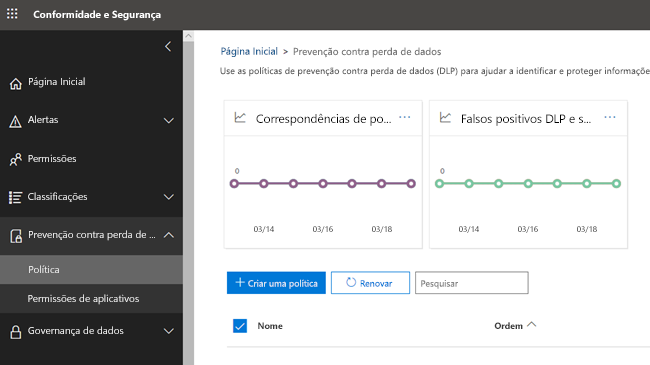
  
## O que uma política de DLP contémWhat a DLP policy contains

Uma política de DLP contém algumas informações básicas:A DLP policy contains a few basic things:
  
- Onde proteger o conteúdo: **Locais** como os sites do Exchange Online, SharePoint Online e OneDrive for Business, bem como mensagens no chat e de canais do Microsoft Teams.Where to protect the content: **locations** such as Exchange Online, SharePoint Online, and OneDrive for Business sites, as well as Microsoft Teams chat and channel messages. 
    
- Quando e como proteger o conteúdo aplicando **regras** compostas por:When and how to protect the content by enforcing **rules** comprised of: 
    
  - **Condições** com as quais o conteúdo deve corresponder antes que a regra seja aplicada.**Conditions** the content must match before the rule is enforced. Por exemplo, a regra deve ser configurada para procurar apenas conteúdo com números de previdência social compartilhados com pessoas de fora da sua organização.For example, a rule might be configured to look only for content containing Social Security numbers that's been shared with people outside your organization. 
    
  - **Ações** que a regra deve executar automaticamente quando o conteúdo correspondente às condições for encontrado.**Actions** that you want the rule to take automatically when content matching the conditions is found -- for example, block access to the document and send both the user and compliance officer an email notification. Por exemplo, uma regra pode ser configurada para bloquear o acesso a um documento e enviar uma notificação por email ao usuário e ao responsável pela conformidade.For example, a rule might be configured to block access to a document and send both the user and compliance officer an email notification. 
    
Você pode usar uma regra para atender a um requisito específico de proteção e depois usar uma política DLP para agrupar requisitos de proteção comuns, como todas as regras necessárias para manter a conformidade com uma regulamentação específica.You can use a rule to meet a specific protection requirement, and then use a DLP policy to group together common protection requirements, such as all of the rules needed to comply with a specific regulation.
  
Por exemplo, você pode ter uma política DLP que ajuda a detectar a presença de informações sujeitas à lei americana HIPAA (Health Insurance Portability Accountability Act).For example, you might have a DLP policy that helps you detect the presence of information subject to the Health Insurance Portability and Accountability Act (HIPAA). Essa política DLP pode ajudar a proteger dados HIPAA (objeto) em todos os sites do SharePoint Online e OneDrive for Business (local) ao encontrar qualquer documento com essas informações confidenciais que são compartilhadas com pessoas de fora da sua organização (condições) e, em seguida, bloquear o acesso ao documento e enviar uma notificação (ações).This DLP policy could help protect HIPAA data (the what) across all SharePoint Online sites and all OneDrive for Business sites (the where) by finding any document containing this sensitive information that’s shared with people outside your organization (the conditions) and then blocking access to the document and sending a notification (the actions). Esses requisitos são armazenados como regras individuais e agrupadas como uma política DLP para simplificar o gerenciamento e a geração de relatório.These requirements are stored as individual rules and grouped together as a DLP policy to simplify management and reporting.
  
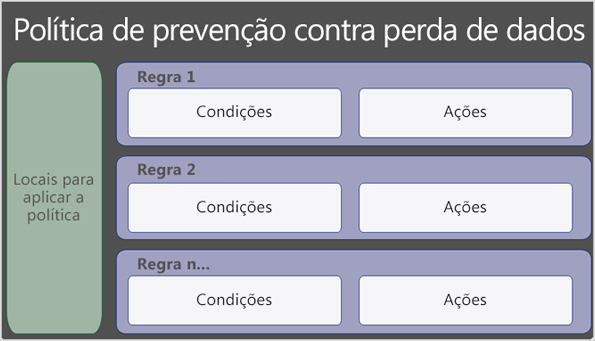
  
### LocaisLocations

Uma política DLP pode encontrar e proteger informações confidenciais no Office 365, não importa se essas informações estão armazenadas no Exchange Online, SharePoint Online, OneDrive for Business, ou Microsoft Teams.A DLP policy can find and protect sensitive information across Office 365, whether that information is located in Exchange Online, SharePoint Online, OneDrive for Business, or Microsoft Teams. Você pode optar por proteger o conteúdo de emails do Exchange, mensagens do chat e de canal do Microsoft Teams e todas as bibliotecas do SharePoint ou do OneDrive, ou selecionar locais específicos para uma política.You can choose to protect content in Exchange email, Microsoft Teams chats and channel messages, and all SharePoint or OneDrive libraries, or select specific locations for a policy.
  
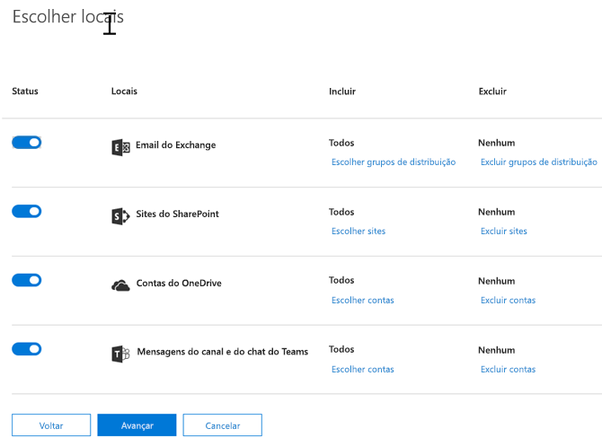
  
Se optar por incluir ou excluir sites específicos do SharePoint ou contas do OneDrive, uma política de DLP pode conter até 100 inclusões e exclusões.If you choose to include or exclude specific SharePoint sites or OneDrive accounts, a DLP policy can contain no more than 100 such inclusions and exclusions. Embora esses limites existam, você pode excede-los ao ignorar uma política no âmbito da organização ou uma política que se aplica a locais inteiros.Although this limit exists, you can exceed this limit by applying either an org-wide policy or a policy that applies to entire locations.
  
### RegrasRules

As regras aplicam os requisitos de negócios para o conteúdo da sua organização.Rules are what enforce your business requirements on the information stored by your organization. Uma política contém uma ou mais regras, e cada regra consiste em condições e ações.A policy contains one or more rules, and each rule consists of conditions and actions. Para cada regra, quando as condições forem atendidas, as ações são executadas automaticamente.For each rule, when the conditions are met, the actions are taken automatically. As regras são executadas sequencialmente, começando pela prioridade mais alta em cada política.Rules are executed sequentially, starting with the lowest order rule in each policy.
  
Uma regra também fornece opções para notificar os usuários (com dicas de política e notificações por email) e os administradores (com relatórios de incidentes por email) cujo conteúdo correspondeu à regra.A rule also provides options to notify users (with policy tips and email notifications) and admins (with email incident reports) that content has matched the rule.
  
Veja a seguir os componentes de uma regra, cada um explicado abaixo.Here are the components of a rule, each explained below.
  
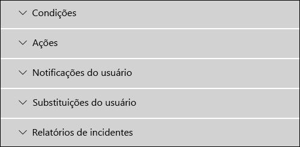
  
#### CondiçõesConditions

As condições são importantes porque elas determinam que tipos de informações confidenciais está procurando e quando uma ação deve ser executada.Conditions are important because they determine what types of information you’re looking for, and when to take an action. Por exemplo, você pode optar por ignorar o conteúdo com números de passaporte, a menos que o conteúdo contenha mais de 10 números e seja compartilhado com pessoas de fora da sua organização.For example, you might choose to ignore documents containing passport numbers unless the document contains more than ten such numbers and is shared with people outside your organization.
  
As condições se concentram no **conteúdo**, como quais tipos de informações confidenciais está procurando e também no **contexto**, como com quem o documento é compartilhado.Conditions focus on the content, such as what types of sensitive information you’re looking for, and also on the context, such as who the document is shared with. Você pode usar condições para atribuir ações diferentes a diferentes níveis de risco.You can use conditions to assign different actions to different risk levels. Por exemplo, o conteúdo confidencial compartilhado internamente pode diminuir o risco e exigir menos ações do que o conteúdo confidencial compartilhado com pessoas de fora da organização.You can use conditions to assign different actions to different risk levels -- for example, sensitive content shared internally might be lower risk and require fewer actions than sensitive content shared with people outside the organization. 
  
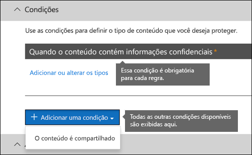
  
As condições disponíveis agora podem determinar se:The conditions now available can determine if:
  
- O conteúdo contém um tipo de informação confidencial.Content contains a type of sensitive information.
    
- O conteúdo contém um rótulo.Content contains a label. Para saber mais, confira a seção abaixo [Usar um rótulo como uma condição em uma política de DLP](#using-a-label-as-a-condition-in-a-dlp-policy).For more information, see [Using a label as a condition in a DLP policy](#using-a-label-as-a-condition-in-a-dlp-policy).
    
- O conteúdo é compartilhado com pessoas de fora ou de dentro da sua organização.Content is shared with people outside or inside your organization.
    
#### Tipos de informações confidenciaisTypes of sensitive information

Uma política DLP ajuda a proteger informações confidenciais, que são definidas como um **tipo de informações confidenciais**.A DLP policy can help  protect sensitive information, which is defined as a **sensitive information type**. O Office 365 inclui 51 definições para vários tipos comuns de informações confidenciais em diferentes regiões que estão prontos para uso, como um número de cartão de crédito, números de contas bancárias, números de carteiras de identidade e números de passaporte.Office 365 includes definitions for many common sensitive information types across many different regions that are ready for you to use, such as a credit card number, bank account numbers, national ID numbers, and passport numbers. 
  
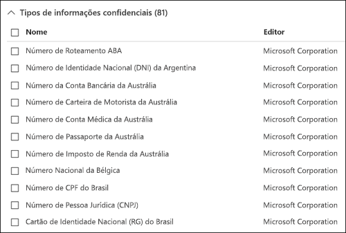
  
Quando uma política DLP procura por um tipo de informação confidencial, como um número de cartão de crédito, ela não procura simplesmente por um número de 16 dígitos.When a DLP policy looks for a sensitive information type such as a credit card number, it does not simply look for a 16-digit number. Cada tipo de informação confidencial é definido e detectado usando uma combinação de:Each sensitive information type is defined and detected by using a combination of:
  
- Palavras-chaveKeywords
    
- Funções internas para validar as somas de verificação ou a composiçãoInternal functions to validate checksums or composition
    
- Avaliação de expressões regulares para localizar correspondências padrãoEvaluation of regular expressions to find pattern matches
    
- Análise de outros conteúdosOther content examination
    
Isso ajuda a detecção de DLP a alcançar um alto grau de precisão, reduzindo o número de falsos positivos que pode interromper o trabalho das pessoas.This helps DLP detection achieve a high degree of accuracy while reducing the number of false positives that can interrupt peoples’ work.
  
#### AçõesActions

Quando o conteúdo corresponde a uma condição em uma regra, você pode aplicar ações para proteger automaticamente o conteúdo.When content matches a condition in a rule, you can apply actions to automatically protect the document or content.
  
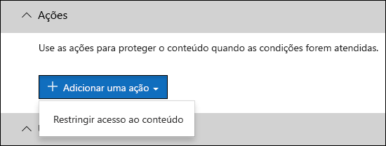
  
Com as ações agora disponíveis, você pode:With the actions now available, you can:
  
- **Restringir o acesso ao conteúdo** Para o conteúdo do site, isso significa que as permissões para o documento são restritas a todos exceto o administrador principal do conjunto de sites, o proprietário do documento e a pessoa que modificou o documento pela última vez.**Restrict access to the content** For site content, this means that permissions for the document are restricted for everyone except the primary site collection administrator, document owner, and person who last modified the document. Essas pessoas podem remover as informações confidenciais do documento ou executar outras ações corretivas.These people can remove the sensitive information from the document or take other remedial action. Quando o documento estiver em conformidade, as permissões originais serão restauradas automaticamente.When the document is in compliance, the original permissions will be automatically restored. Quando o acesso a um documento é bloqueado, o documento é exibido com um ícone de dica de política especial na biblioteca do site.When access to a document is blocked, the document appears with a special policy tip icon in the library on the site. 
    
    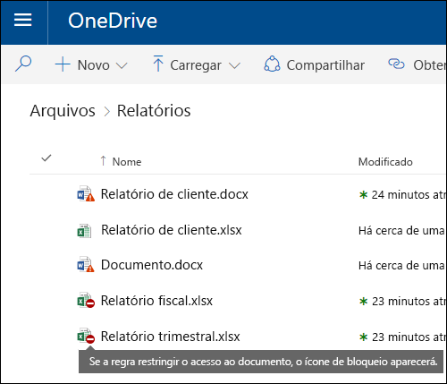
  
    Para conteúdo de email, essa ação bloqueia o envio da mensagem.For email content, this action blocks the message from being sent. Dependendo de como a regra DLP estiver configurada, o remetente verá uma notificação de falha na entrega (se a regra usar uma notificação) ou uma dica de política e/ou notificação por email.Depending on how the DLP rule is configured, the sender sees an NDR or (if the rule uses a notification) a policy tip and/or email notification.
    
    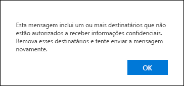
  
#### Notificações e substituições do usuárioUser notifications and user overrides

Você pode usar notificações e substituições para instruir usuários sobre políticas de DLP e ajudá-los a permanecer em conformidade sem bloquear seu trabalho.You can educate your users about DLP policies and help them to remain compliant without blocking their work. Por exemplo, se um usuário tentar compartilhar um documento que contém informações confidenciais, uma política de DLP pode enviar uma notificação por email e mostrar uma dica de política no contexto da biblioteca de documentos que permite substituir a política se ele tivere uma justificativa de negócios.For example, if a user tries to share a document containing sensitive information, a DLP policy can both send them an email notification and show them a policy tip in the context of the document library that allows them to override the policy if they have a business justification.
  
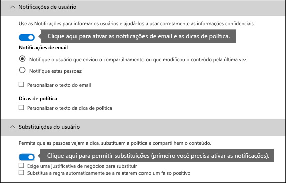
  
O email pode notificar a pessoa que enviou, compartilhou ou modificou o conteúdo por último e, no caso de conteúdo de sites, o administrador principal do conjunto de sites e o proprietário do documento.The email can notify the person who sent, shared, or last modified the content and, for site content, the primary site collection administrator and document owner. Além disso, você pode adicionar ou remover quem quiser na notificação por email.In addition, you can add or remove whomever you choose from the email notification.
  
Além de enviar uma notificação por email, uma notificação do usuário exibe uma dica de política:In addition to sending an email notification, a user notification displays a policy tip:
  
- No Outlook e no Outlook na Web.Personal tags in Outlook and Outlook on the web
    
- Para o documento no SharePoint ou no site do OneDrive for Business.User renames a document on a SharePoint or OneDrive for Business site.
    
- No Excel, PowerPoint, e Word, quando o documento está armazenado em um site incluído em uma política DLP.In addition to sending an email notification, this action displays a policy tip for the document on the site, and also in Excel 2016, PowerPoint 2016, and Word 2016, when the document is stored on a site included in a DLP policy.
    
A notificação de email e a dica de política explicam a razão do conflito do conteúdo com uma política DLP.The email notification and policy tip explain why a document conflicts with a DLP policy. Se você escolher, a notificação por email e a dica de política podem permitir que usuários substituam uma regra ao relatar um falso positivo ou fornecer uma justificativa de negócios.If you choose, the email notification and policy tip can allow users to override a rule by reporting a false positive or providing a business justification. Isso pode ajudar você a treinar os usuários sobre as políticas de DLP e aplicá-las sem impedir que as pessoas façam seu trabalho.This can help you educate users about your DLP policies and enforce them without preventing people from doing their work. Informações sobre substituições e falsos positivos também são registradas para relatório (veja abaixo sobre os relatórios de DLP) e incluídas nos relatórios de incidentes (próxima seção), para que o responsável pela conformidade possa analisar regularmente essas informações.Information about overrides and false positives is also logged for reporting (see below about the DLP reports) and included in the incident reports (next section), so that the compliance officer can regularly review this information.
  
Esta é a aparência de uma dica de política em uma conta do OneDrive for Business.Here's what a policy tip looks like in a OneDrive for Business account.
  
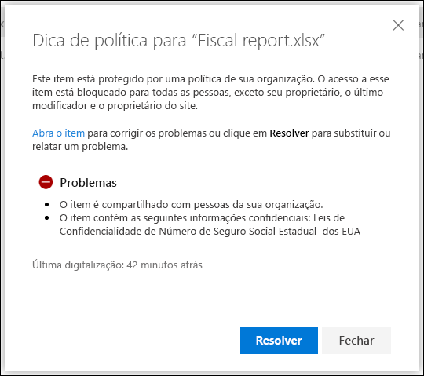
  
#### Relatórios de incidentesIncident reports

Quando uma regra é correspondida, você pode enviar um relatório de incidentes ao responsável pela conformidade (ou qualquer pessoa que você escolher) com detalhes sobre o evento.When a rule is matched, you can send an incident report to your compliance officer with details of the event. Esse relatório inclui informações sobre o item que foi correspondido, o conteúdo real que correspondeu à regra e o nome da pessoa que modificou o conteúdo por último.This report includes information about the item that was matched, the actual content that matched the rule, and the name of the person who last modified the content. Para mensagens de email, o relatório também inclui a mensagem original como anexo que corresponde a uma política DLP.For email messages, the report also includes as an attachment the original message that matches a DLP policy.
  
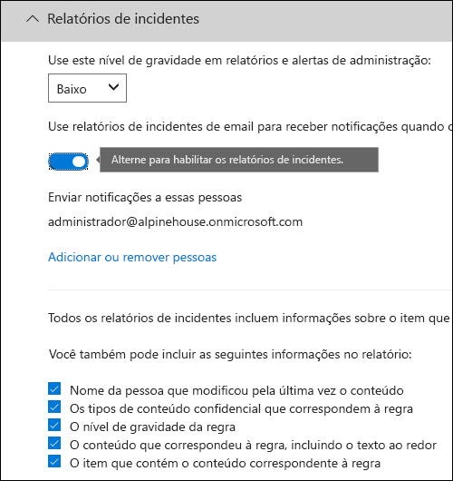
  
## Agrupamento e operadores lógicosGrouping and logical operators

Muitas vezes, sua política DLP tem um requisito direto, como identificar todo o conteúdo que contém um número de CPF.Often your DLP policy has a straightforward requirement, such as to identify all content that contains a U.S. Social Security Number. No entanto, em outras situações, talvez seja necessário que sua política DLP identifique dados definidos de forma mais flexível.However, in other scenarios, your DLP policy might need to identify more loosely defined data.
  
Por exemplo, para identificar conteúdo sujeito à HIPAA (Lei de Seguro de Saúde) dos EUA, você precisa procurar:For example, to identify content subject to the U.S. Health Insurance Act (HIPAA), you need to look for:
  
- Conteúdo que apresente tipos específicos de informações confidenciais, como um Número de Seguro Social dos EUA ou Número da DEA (Agência de Combate às Drogas dos EUA).Content that contains specific types of sensitive information, such as a U.S. Social Security Number or Drug Enforcement Agency (DEA) Number.
    
    EAND
    
- Conteúdo que é mais difícil de identificar, como comunicações sobre cuidados de um paciente ou descrições de serviços médicos fornecidos.Content that's more difficult to identify, such as communications about a patient's care or descriptions of medical services provided. Identificar esse conteúdo requer a combinação de palavras-chave de listas de palavras-chave muito extensas, como a Classificação Internacional de Doenças (ICD-9-CM ou ICD-10-CM).Identifying this content requires matching keywords from very large keyword lists, such as the International Classification of Diseases (ICD-9-CM or ICD-10-CM).
    
Você pode identificar facilmente esses dados definidos de forma mais flexível usando agrupamentos e operadores lógicos (E, OU).You can easily identify such loosely defined data by using grouping and logical operators (AND, OR). Ao criar uma política DLP, você pode:When you create a DLP policy, you can:
  
- Agrupar tipos de informações confidenciais.Custom sensitive information types
    
- Escolher o operador lógico entre os tipos de informações confidenciais dentro de um grupo e entre os próprios grupos.Choose the logical operator between the sensitive information types within a group and between the groups themselves.
    
### Escolher o operador dentro de um grupoChoosing the operator within a group

Dentro de um grupo, você pode escolher se uma ou todas as condições desse grupo devem ser atendidas para que o conteúdo corresponda à regra.Within a group, you can choose whether any or all of the conditions in that group must be satisfied for the content to match the rule.
  
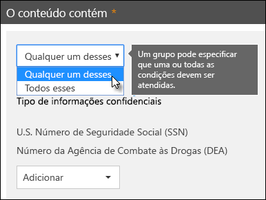
  
### Adicionar um grupoAdding a group as a geo admin

Você pode adicionar rapidamente um grupo, que pode ter suas próprias condições e operador dentro desse grupo.You can quickly add a group, which can have its own conditions and operator within that group.
  
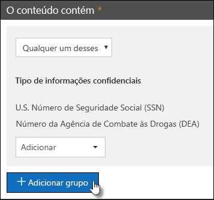
  
### Escolher o operador entre gruposChoosing the operator between groups

Entre grupos, você pode escolher se as condições em apenas um grupo ou todos os grupos devem ser atendidas para que o conteúdo corresponda à regra.Between groups, you can choose whether the conditions in just one group or all of the groups must be satisfied for the content to match the rule.
  
Por exemplo, a política interna \*\* HIPAA (Lei de Seguro de Saúde) dos EUA\*\* tem uma regra que usa um operador **E** entre os grupos para que identifique o conteúdo que apresente:For example, the built-in **U.S. HIPAA** policy has a rule that uses an **AND** operator between the groups so that it identifies content that contains: 
  
- do grupo **Identificadores PII** (pelo menos um número de CPF **OU** número da Agência de Combate às Drogas)from the group **PII Identifiers** (at least one SSN number **OR** DEA number) 
    
    **E****AND**
    
- do grupo **Termos Médicos** (pelo menos uma palavra-chave do ICD-9-CM **OU** do ICD-10-CM)from the group **Medical Terms** (at least one ICD-9-CM keyword **OR** ICD-10-CM keyword) 
    
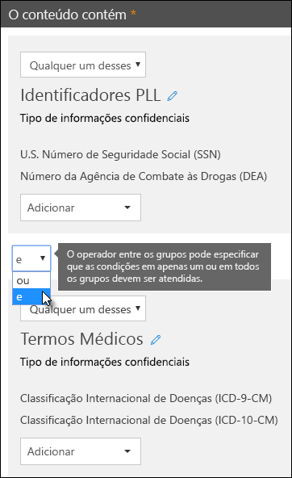
  
## A prioridade em que as regras são processadasThe priority by which rules are processed

Quando você cria regras em uma política, cada regra recebe uma prioridade na ordem em que ela é criada, ou seja, a regra criada primeiro tem a primeira prioridade, a regra criada em segundo lugar tem a segunda prioridade e assim por diante.When you create rules in a policy, each rule is assigned a priority in the order in which it's created — meaning, the rule created first has first priority, the rule created second has second priority, and so on. 
  
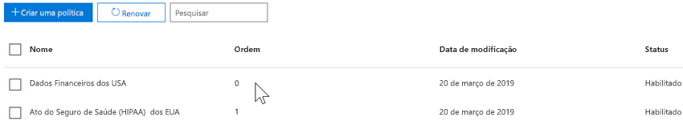
  
Após configurar mais de uma política DLP, você pode alterar a prioridade de uma ou mais políticas.After you have set up more than one DLP policy, you can change the priority of one or more policies. Para fazer isso, selecione uma política, clique em **Editar política**e use a lista **Prioridade** para especificar a prioridade.To do that, select a policy, choose **Edit policy**, and use the **Priority** list to specify its priority.

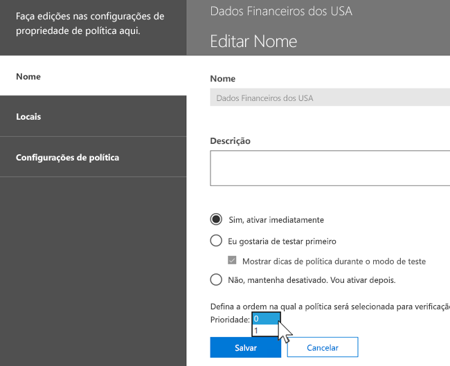

Quando o conteúdo é avaliado em relação às regras, estas são processadas na ordem de prioridade.When content is evaluated against rules, the rules are processed in priority order. Se o conteúdo corresponde a várias regras, as regras são processadas na ordem de prioridade, e a ação mais restritiva será aplicada.If content matches multiple rules, the rules are processed in priority order and the most restrictive action is enforced. Por exemplo, se o conteúdo corresponder a todas as regras a seguir, a Regra 3 será aplicada porque tem a prioridade mais alta, é a regra mais restritiva:For example, if content matches all of the following rules, Rule 3 is enforced because it's the highest priority, most restrictive rule:
  
- Regra 1: apenas notifica os usuáriosRule 1: only notifies users
    
- Regra 2: notifica os usuários, restringe o acesso e permite o usuário substituirRule 2: notifies users, restricts access, and allows user overrides
    
- Regra 3: notifica os usuários, restringe o acesso e não permite o usuário substituirRule 3: notifies users, restricts access, and does not allow user overrides
    
- Regra 4: apenas notifica os usuáriosRule 4: only notifies users
    
- Regra 5: restringe o acessoRule 5: restricts access
    
- Regra 6: notifica os usuários, restringe o acesso e não permite o usuário substituirRule 6: notifies users, restricts access, and does not allow user overrides
    
Nesse exemplo, observe que as correspondências para todas as regras são registradas nos logs de auditoria e exibidas nos relatórios de DLP, embora apenas a regra mais restritiva seja aplicada.In this example, note that matches for all of the rules are recorded in the audit logs and shown in the DLP reports, even though only the most restrictive rule is enforced.
  
Referente às dicas de política, observe que:Regarding policy tips, note that:
  
- Apenas a dica de política da prioridade mais alta e restritiva será exibida.Only the policy tip from the highest priority, most restrictive rule will be shown. Por exemplo, uma dica de política de uma regra que bloqueia o acesso ao conteúdo será mostrada em detrimento de uma dica de política de uma regra que simplesmente envia uma notificação.For example, a policy tip from a rule that blocks access to content will be shown over a policy tip from a rule that simply sends a notification. Isso impede que as pessoas vejam uma cascata de dicas de política.This prevents people from seeing a cascade of policy tips.
    
- Se as dicas de política na regra mais restritiva permitir que as pessoas substituam a regra, substituir essa regra também substitui quaisquer outras regras que o conteúdo correspondeu.If the policy tips in the most restrictive rule allow people to override the rule, then overriding this rule also overrides any other rules that the content matched.
    
## Ajustar as regras para que a correspondência seja mais fácil ou mais difícilFor more information on these options, see Tuning rules to make them easier or harder to match.

Após criar e ativar as políticas de DLP, algumas vezes ocorre esses problemas:After people create and turn on their DLP policies, they sometimes run into these issues:
  
- Grande parte do conteúdo que **não é** confidencial corresponde com as regras, ou seja, há muitos falsos positivos.Too much content that **is not** sensitive information matches the rules — in other words, too many false positives. 
    
- Pequena parte do conteúdo que **tem** informações confidenciais corresponde com as regras.Too little content that **is** sensitive information matches the rules. Em outras palavras, as ações de proteção não estão sendo aplicadas nas informações confidenciais.In other words, the protective actions aren't being enforced on the sensitive information. 
    
Para resolver esses problemas, você pode regular suas regras ajustando a contagem de instância e a precisão da correspondência para dificultar ou facilitar a correspondência do conteúdo às regras.To address these issues, you can tune your rules by adjusting the instance count and match accuracy to make it harder or easier for content to match the rules. Cada tipo de informação confidencial usado em uma regra tem uma contagem de instância e uma precisão de correspondência.Each sensitive information type used in a rule has both an instance count and match accuracy.
  
### Contagem de instânciasInstance count

A contagem de instâncias se refere à quantidade de ocorrências de um tipo específico de informação confidencial que deve estar presente para que o conteúdo corresponda à regra.Instance count means simply how many occurrences of a specific type of sensitive information must be present for content to match the rule. Por exemplo, o conteúdo corresponde com a regra mostrada abaixo se entre 1 e 9 passaportes únicosFor example, content matches the rule shown below if between 1 and 9 unique U.S. or U.K. dos EUA ou UE são identificados.passport numbers are identified.
  
Observe que a contagem de instâncias inclui apenas correspondências **únicas** a palavras-chave e tipos de informações confidenciais.Note that the instance count includes only **unique** matches for sensitive information types and keywords. Por exemplo, se um email contém 10 ocorrências do mesmo número de cartão de crédito, as 10 ocorrências são contadas como uma única instância de um número de cartão de crédito.For example, if an email contains 10 occurrences of the same credit card number, those 10 occurrences count as a single instance of a credit card number. 
  
Para usar a contagem de instâncias para ajustar as regras, a orientação é simples:To use instance count to tune rules, the guidance is straightforward:
  
- Para tornar a regra mais fácil para a correspondência, diminua a contagem **mín** e/ou aumente a contagem **máx**.To make the rule easier to match, decrease the **min** count and/or increase the **max** count. Também é possível definir o **máx** para **qualquer** excluindo o valor numérico.You can also set **max** to **any** by deleting the numerical value. 
    
- Para tornar a regra mais difícil para a correspondência, aumente a contagem **mín**.To make the rule harder to match, increase the **min** count. 
    
Normalmente, você usa menos ações restritivas, como o envio de notificações ao usuário, em uma regra com uma contagem de instâncias inferior (por exemplo, 1-9).Typically, you use less restrictive actions, such as sending user notifications, in a rule with a lower instance count (for example, 1-9). E usa ações mais restritivas, como restringir o acesso ao conteúdo sem permitir que o usuário faça substituição, em uma regra com uma contagem de instância superior (por exemplo, 10 – qualquer).And you use more restrictive actions, such as restricting access to content without allowing user overrides, in a rule with a higher instance count (for example, 10-any).
  
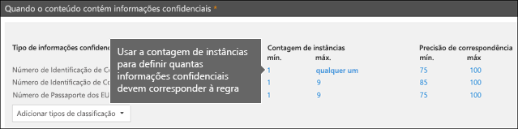
  
### Precisão de correspondênciaMatch accuracy

Conforme descrito acima, o tipo de informação confidencial é definido e detectado usando uma combinação de diferentes tipos de evidências.As described above, a sensitive information type is defined and detected by using a combination of different types of evidence. Em geral, um tipo de informação confidencial é definido por várias dessas combinações, chamadas padrões.Commonly, a sensitive information type is defined by multiple such combinations, called patterns. Um padrão que requer menos evidências tem uma precisão de correspondência inferior (ou nível de confiança), enquanto um padrão que exige mais evidências tem uma maior precisão de correspondência (ou nível de confiança).A pattern that requires less evidence has a lower match accuracy (or confidence level), while a pattern that requires more evidence has a higher match accuracy (or confidence level). Para saber mais sobre os padrões reais e níveis de confiança usados por todos os tipos de informações confidenciais, confira o artigo sobre [o que os tipos de informações confidenciais procuram](what-the-sensitive-information-types-look-for.md).To learn more about the actual patterns and confidence levels used by every sensitive information type, see [What the sensitive information types look for](what-the-sensitive-information-types-look-for.md).
  
Por exemplo, o tipo de informação confidencial chamado Número de Cartão de Crédito é definido por dois padrões:For example, the sensitive information type named Credit Card Number is defined by two patterns:
  
- Um padrão com confiança de 65% que exige:A pattern with 65% confidence that requires:
    
  - Um número no formato de um número de cartão de crédito.A number in the format of a credit card number.
    
  - Um número que passa na soma de verificação.A number that passes the checksum.
    
- Um padrão com confiança de 85% que exige:A pattern with 85% confidence that requires:
    
  - Um número no formato de um número de cartão de crédito.A number in the format of a credit card number.
    
  - Um número que passa na soma de verificação.A number that passes the checksum.
    
  - Uma palavra-chave ou uma data de validade no formato certo.A keyword or an expiration date in the right format.
    
Você pode usar esses níveis de confiança (ou precisão de correspondência) em suas regras.You can use these confidence levels (or match accuracy) in your rules. Normalmente, você usa menos ações restritivas, como o envio de notificações ao usuário, em uma regra com uma precisão de correspondência inferior.Typically, you use less restrictive actions, such as sending user notifications, in a rule with lower match accuracy. E usa ações mais restritivas, como restringir o acesso ao conteúdo sem permitir que o usuário faça uma substituição, em uma regra com uma precisão de correspondência superior.And you use more restrictive actions, such as restricting access to content without allowing user overrides, in a rule with higher match accuracy.
  
É importante compreender que quando um tipo específico de informação confidencial, como um número de cartão de crédito, é identificado no conteúdo, somente um único nível de confiança é retornado:It's important to understand that when a specific type of sensitive information, such as a credit card number, is identified in content, only a single confidence level is returned:
  
- Se todas as correspondências forem para um único padrão, o nível de confiança para aquele padrão será retornado.If all of the matches are for a single pattern, the confidence level for that pattern is returned.
    
- Se houver correspondências para mais de um padrão (ou seja, há correspondências com dois níveis de confiança diferentes), o nível de confiança maior do que qualquer um dos padrões únicos sozinhos será retornado.If there are matches for more than one pattern (that is, there are matches with two different confidence levels), a confidence level higher than any of the single patterns alone is returned. Esta é a parte desafiadora.This is the tricky part. Por exemplo, para um cartão de crédito, se os padrões de 65% e 85% forem atendidos, o nível de confiança retornado para aquele tipo de informação confidencial será maior que 90%, pois quanto mais evidências, mais confiança.For example, for a credit card, if both the 65% and 85% patterns are matched, the confidence level returned for that sensitive information type is greater than 90% because more evidence means more confidence.
    
Portanto, se você quiser criar duas regras mutuamente exclusivas para cartões de crédito, uma para a precisão de correspondência de 65% e outro para a precisão de correspondência de 85%, os intervalos para a precisão de correspondência serão parecidos com isto:So if you want to create two mutually exclusive rules for credit cards, one for the 65% match accuracy and one for the 85% match accuracy, the ranges for match accuracy would look like this. A primeira regra pega apenas as correspondências ao padrão de 65%.The first rule picks up only matches of the 65% pattern. A segunda regra pega as correspondências com **pelo menos uma** correspondência de 85% e **pode ter** outras correspondências de confiança inferiores.The second rule picks up matches with **at least one** 85% match and **can potentially have** other lower-confidence matches. 
  
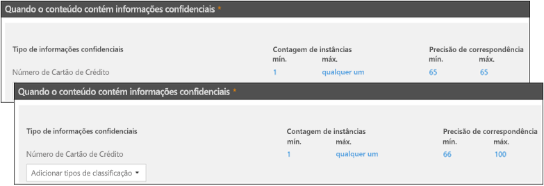
  
Por essas razões, a orientação para a criação de regras com diferentes precisões de correspondência é:For these reasons, the guidance for creating rules with different match accuracies is:
  
- O menor nível de confiança normalmente usa o mesmo valor para **mín** e **máx** (não um intervalo).The lowest confidence level typically uses the same value for **min** and **max** (not a range). 
    
- O nível mais alto de confiança é um intervalo entre o valor logo acima do nível de confiança inferior a 100.The highest confidence level is typically a range from just above the lower confidence level to 100.
    
- Qualquer nível de confiança intermediário normalmente varia de um valor logo acima do nível de confiança inferior para um valor logo abaixo do nível de confiança superior.Any in-between confidence levels typically range from just above the lower confidence level to just below the higher confidence level.
    
## Usar um rótulo como condição em uma política DLPUsing a retention label as a condition in a DLP policy

Você pode criar um rótulo e, em seguida:You can create a label and then:
  
- **Publicá-lo**, para que os usuários finais possam ver e aplicar manualmente o rótulo ao conteúdo.**Publish** it, so that end users can see and manually apply the label to content. 
    
- **Aplicá-lo automaticamente** ao conteúdo que corresponde às condições escolhidas.**Auto-apply** it to content that matches the conditions that you choose. 
    
Para mais informações sobre rótulos, consulte [Visão geral de rótulos de retenção](labels.md).For more information about labels, see [Overview of labels](labels.md).
  
Após criar um rótulo, você pode usá-lo como uma condição em suas políticas de DLP.After you create a label, you can then use that label as a condition in your DLP policies. Por exemplo, talvez você queira fazer isso porque:For example, you might want to do this because:
  
- Publicou um rótulo denominado **Confidencial**, para que as pessoas da sua organização possam aplicar manualmente o rótulo a documentos e emails confidenciais.You published a label named **Confidential**, so that people in your organization can manually apply the label to confidential email and documents. Usando esse rótulo como uma condição em sua política de DLP, você pode restringir que o conteúdo rotulado como **Confidencial** seja compartilhado com pessoas de fora da sua organização.By using this label as a condition in your DLP policy, you can restrict content labeled **Confidential** from being shared with people outside your organization. 
    
- Você criou um rótulo chamado **Casa Alpina** para um projeto com esse nome e, em seguida, aplicou esse rótulo automaticamente ao conteúdo contendo as palavras-chave “Casa Alpina”.You created a label named **Alpine House** for a project of that name, and then applied that label automatically to content containing the keywords "Alpine House". Usando esse rótulo como uma condição em sua política de DLP, você pode mostrar uma dica de política aos usuários finais quando eles estiverem prestes a compartilhar esse conteúdo com alguém de fora da sua organização.By using this label as a condition in your DLP policy, you can show a policy tip to end users when they're about to share this content with someone outside your organization. 
    
- Você publicou um rótulo chamado **Registro de impostos**, para que seu gerente de registros possa aplicar manualmente o rótulo ao conteúdo que precise ser classificado como um registro.You published a label named **Tax record**, so that your records manager can manually apply the label to content that needs to be classified as a record. Usando esse rótulo como uma condição em sua política de DLP, você pode procurar conteúdo com esse rótulo em outros tipos de informações confidenciais como CPF; aplicar ações de proteção ao conteúdo rotulado **Registro de impostos**; e obter relatórios de atividade detalhados sobre a política de DLP de relatórios de DLP e os dados do log de auditoria.By using this label as a condition in your DLP policy, you can look for content with this label along with other types of sensitive information such as ITINs or SSNs; apply protection actions to content labeled **Tax record**; and get detailed activity reports about the DLP policy from the DLP reports and audit log data. 
    
- Você publicou um rótulo chamado **Equipe Executiva de Liderança – Confidencial** para as contas de caixa de correio do Exchange e OneDrive de um grupo de executivos.You published a label named **Executive Leadership Team - Sensitive** to the Exchange mailboxes and OneDrive accounts of a group of executives. Usando esse rótulo como uma condição em sua política de DLP, você pode aplicar ações de retenção e proteção no mesmo subconjunto de conteúdo e usuários.By using this label as a condition in your DLP policy, you can enforce both retention and protection actions on the same subset of content and users. 
    
Usando rótulos como uma condição em suas regras de DLP, você pode aplicar seletivamente ações de proteção a um conjunto específico de conteúdos, locais ou usuários.By using labels as a condition in your DLP rules, can you selectively enforce protection actions on a specific set of content, locations, or users.
  
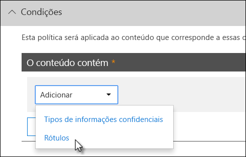

### O suporte para rótulos de confidencialidade estará disponível em breveSupport for sensitivity labels is coming

No momento, você pode usar apenas um rótulo de retenção como uma condição, não um [rótulo de confidencialidade](sensitivity-labels.md).You can currently use only a retention label as a condition, not a [sensitivity label](sensitivity-labels.md). Estamos trabalhando no suporte para usar um rótulo de confidencialidade nesta condição.We're currently working on support for using a sensitivity label in this condition.
  
### Como esse recurso se relaciona a outros recursosHow this feature relates to other features

Diversos recursos podem ser aplicados ao conteúdo com informações confidenciais:Several features can be applied to content containing sensitive information:
  
- Um [rótulo de retenção](labels.md#applying-a-retention-label-automatically-based-on-conditions) e uma [política de retenção](retention-policies.md) podem impor ações de **retenção** nesse conteúdo.A [retention label](labels.md#applying-a-retention-label-automatically-based-on-conditions) and a [retention policy](retention-policies.md) can both enforce **retention** actions on this content. 
    
- Uma política de DLP pode impor ações de **proteção** nesse conteúdo.A DLP policy can enforce **protection** actions on this content. E antes de aplicar essas ações, uma política de DLP pode exigir que outras condições sejam atendidas além do conteúdo que contém um rótulo.And before enforcing these actions, a DLP policy can require other conditions to be met in addition to the content containing a label. 
    
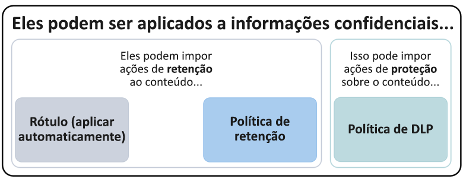
  
Observe que uma política de DLP tem um recurso de detecção mais avançado do que um rótulo ou política de retenção aplicada a informações confidenciais.Note that a DLP policy has a richer detection capability than a label or retention policy applied to sensitive information. Uma política de DLP pode impor ações de proteção ao conteúdo que contiver informações confidenciais e se as informações confidenciais forem removidas do conteúdo, essas ações de proteção serão desfeitas da próxima vez que o conteúdo for verificado.A DLP policy can enforce protective actions on content containing sensitive information, and if the sensitive information is removed from the content, those protective actions are undone the next time the content's scanned. Mas se uma política ou rótulo de retenção for aplicado ao conteúdo com informações confidenciais, essa será uma ação única que não será desfeita, mesmo se as informações confidenciais forem removidas.But if a retention policy or label is applied to content containing sensitive information, that's a one-time action that won't be undone even if the sensitive information is removed.
  
Usando um rótulo como uma condição em uma política de DLP, você pode aplicar ações de retenção e proteção no conteúdo com esse rótulo.By using a label as a condition in a DLP policy, you can enforce both retention and protection actions on content with that label. Pense no conteúdo com um rótulo exatamente como um conteúdo com informações confidenciais – tanto um rótulo quanto um tipo de informação confidencial são propriedades usadas para classificar o conteúdo, para poder impor ações para esse conteúdo.You can think of content containing a label exactly like content containing sensitive information - both a label and a sensitive information type are properties used to classify content, so that you can enforce actions on that content.
  
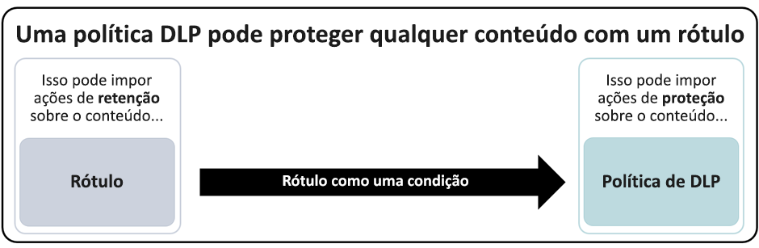
  
## Configurações simples versus configurações avançadasSimple settings vs. advanced settings

Ao criar uma política DLP, decida entre configurações simples ou avançadas:When you create a DLP policy, you'll choose between simple or advanced settings:
  
- **Configurações simples** facilitam a criação do tipo mais comum de política DLP sem usar o editor de regras para criar ou modificar regras.**Simple settings** make it easy to create the most common type of DLP policy without using the rule editor to create or modify rules. 
    
- **Configurações avançadas** usam o editor de regras para oferecer controle completo sobre cada configuração para a sua política DLP.**Advanced settings** use the rule editor to give you complete control over every setting for your DLP policy. 
    
Não se preocupe, nos bastidores, as configurações simples e avançadas funcionam exatamente da mesma forma, aplicando regras compostas por condições e ações. A única diferença é que, com configurações simples, você não vê o editor de regras.Don't worry, under the covers, simple settings and advanced settings work exactly the same, by enforcing rules comprised of conditions and actions -- only with simple settings, you don't see the rule editor. Trata-se de uma maneira rápida de criar uma política DLP.It's a quick way to create a DLP policy.
  
### Configurações simplesSimple MAPI settings

Sem dúvida, o cenário mais comum de DLP é criar uma política para ajudar a evitar que um conteúdo com informações confidenciais seja compartilhado com pessoas fora da sua organização e realizar uma ação corretiva automática, como restringir quem pode acessar o conteúdo, enviar notificações ao usuário final ou ao administrador e auditar o evento para investigação posterior.By far, the most common DLP scenario is creating a policy to help protect content containing sensitive information from being shared with people outside your organization, and taking an automatic remedial action such as restricting who can access the content, sending end-user or admin notifications, and auditing the event for later investigation. As pessoas usam a DLP para ajudar a evitar a divulgação acidental de informações confidenciais.People use DLP to help prevent the inadvertent disclosure of sensitive information.
  
Para simplificar essa meta, ao criar uma política DLP, você pode escolher **Usar configurações simples**.To simplify achieving this goal, when you create a DLP policy, you can choose **Use simple settings**. Essas configurações fornecem todos os elementos necessários para implementar a política DLP mais comum, sem precisar acessar o editor de regras.These settings provide everything you need to implement the most common DLP policy, without having to go into the rule editor.
  
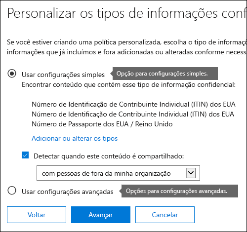
  
### Configurações avançadasAdvanced settings

Se você precisa criar políticas DLP mais personalizadas, pode escolher **Usar configurações avançadas**.If you need to create more customized DLP policies, you can choose **Use advanced settings**.
  
As configurações avançadas apresentam o editor de regras, no qual você tem controle total sobre todas as opções possíveis, incluindo a contagem de instâncias e a precisão de correspondência (nível de confiança) de cada regra.The advanced settings present you with the rule editor, where you have full control over every possible option, including the instance count and match accuracy (confidence level) for each rule.
  
Para acessar rapidamente uma seção, clique em um item na navegação superior do editor de regras para ir até essa seção abaixo.To jump to a section quickly, click an item in the top navigation of the rule editor to go to that section below.
  
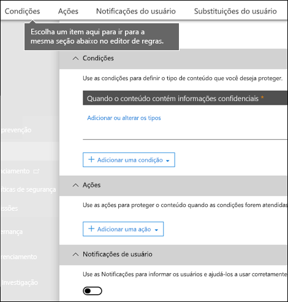
  
## Modelos de política DLPDLP policy templates

A primeira etapa na criação de uma política DLP é escolher quais informações serão protegidas.The first step in creating a DLP policy is choosing what information to protect. A partir de um modelo DLP, você economiza o trabalho de criar um novo conjunto de regras do zero e descobrir quais tipos de informações devem ser incluídas por padrão.This saves you the work of building a new set of rules from scratch, and figuring out which types of information should be included by default. Em seguida, você pode adicionar ou modificar esses requisitos para ajustar a regra para atender aos requisitos específicos da sua organização.You can then add to or modify these requirements to fine tune the rule to meet your organization’s specific requirements.
  
Um modelo de política DLP pré-configurado pode ajudar a detectar tipos específicos de informações confidenciais, como dados de HIPAA, dados de PCI-DSS, dados da Lei Gramm-Leach-Bliley ou até informações de identificação pessoal (PII) específicas de localidade.A preconfigured DLP policy template can help you detect specific types of sensitive information, such as HIPAA data, PCI-DSS data, Gramm-Leach-Bliley Act data, or even locale-specific personally identifiable information (PII). Para facilitar a localização e a proteção de tipos comuns de informações confidenciais, os modelos de política incluídos no Office 365 já contêm os tipos mais comuns de informações confidenciais necessários para você começar.To make it easy for you to find and protect common types of sensitive information, the policy templates included in Office 365 already contain the most common sensitive information types necessary for you to get started.
  
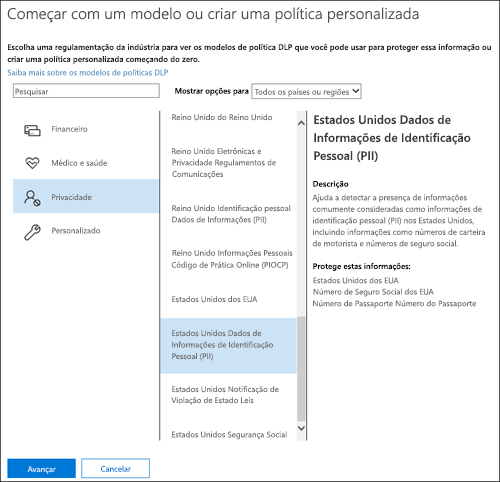
  
Sua organização também pode ter suas próprias exigências específicas e, nesse caso, você pode criar uma política DLP do zero, escolhendo a opção **Política personalizada**.Your organization may also have its own specific requirements, in which case you can create a DLP policy from scratch. Uma política personalizada é vazia e não contém regras pré-criadas.A custom policy is empty and contains no premade rules. 
  
## Implementar políticas de DLP gradualmente com o modo de testeRoll out DLP policies gradually with test mode

Depois de criar as políticas de DLP, você deve considerar a implementação gradual delas para avaliar o impacto e testar a eficácia delas antes de aplicá-las completamente.When you create your DLP policies, you should consider rolling them out gradually to assess their impact and test their effectiveness before fully enforcing them. Por exemplo, você não quer que uma nova política DLP, inadvertidamente, bloqueie o acesso a milhares de documentos que as pessoas precisam acessar para realizar seus trabalhos.For example, you don’t want a new DLP policy to unintentionally block access to thousands of documents that people require access to in order to get their work done.
  
Se estiver criando políticas DLP com um grande impacto em potencial, é recomendável seguir esta sequência:If you’re creating DLP policies with a large potential impact, we recommend following this sequence:
  
1. **Iniciar no modo de teste sem Dicas de Política** e, em seguida, usar os relatórios de DLP e de qualquer incidente para avaliar o impacto.**Start in test mode without Policy Tips** and then use the DLP reports to assess the impact. Você pode usar relatórios de DLP para exibir o número, o local, o tipo e a gravidade das correspondências de política.You can use DLP reports to view the number, location, type, and severity of policy matches. Com base nos resultados, você pode ajustar as regras conforme necessário.Based on the results, you can fine tune the rules as needed. No modo de teste, as políticas de DLP não afetarão a produtividade das pessoas que trabalham na sua organização.In test mode, DLP policies will not impact the productivity of people working in your organization. 
    
2. **Mover para o modo de teste com Dicas de Política e notificações** para que você possa começar a ensinar os usuários sobre suas políticas de conformidade e prepará-los para as regras que serão aplicadas. Nesse estágio, você também pode pedir aos usuários para relatar falsos positivos para que você possa refinar as regras.**Move to Test mode with notifications and Policy Tips** so that you can begin to teach users about your compliance policies and prepare them for the rules that are going to be applied. At this stage, you can also ask users to report false positives so that you can further refine the rules. 
    
3. **Inicie a imposição total das políticas** para que as ações sejam aplicadas nas regras e o conteúdo seja protegido.**Start full enforcement on the policies** so that the actions in the rules are applied and the content’s protected. Continue a monitorar os relatórios de DLP e qualquer relatório de incidente ou notificações para se certificar de que os resultados sejam os desejados.Continue to monitor the DLP reports and any incident reports or notifications to make sure that the results are what you intend. 
    
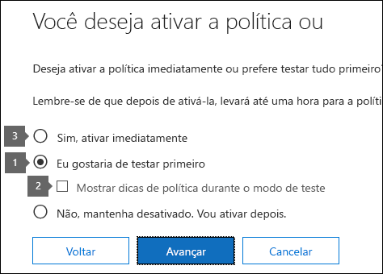
  
Você pode desativar uma política de DLP a qualquer momento, o que afeta todas as regras da política.You can turn off a DLP policy at any time, which affects all rules in the policy. No entanto, as regras também podem ser desativadas individualmente, alternando o status no editor de regras.However, each rule can also be turned off individually by toggling its status in the rule editor.
  
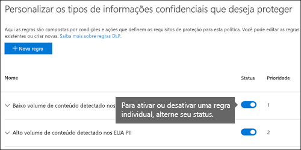

Você também pode alterar a prioridade de várias regras em uma política.You can also change the priority of multiple rules in a policy. Para fazer isso, abra uma política para edição.To do that, open a policy for editing. Em uma linha para uma regra, escolha as reticências (**...**) e, em seguida, escolha uma opção, como **Mover para baixo** ou **Colocar como mais baixa**.In a row for a rule, choose the ellipses (**...**), and then choose an option, such as **Move down** or **Bring to last**.

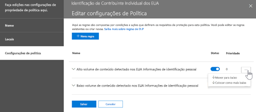
  
## Relatórios DLPDLP reports

Após criar e ativar as políticas de DLP, verifique se elas estão funcionando conforme esperado e se estão ajudando a manter a conformidade.After you create and turn on your DLP policies, you’ll want to verify that they’re working as you intended and helping you stay compliant. Com os relatórios de DLP, você pode exibir rapidamente o número de correspondências de regra e política de DLP ao longo do tempo e o número de falsos positivos e substituições.With DLP reports, you can quickly view the number of DLP policy and rule matches over time, and the number of false positives and overrides. Para cada relatório, você pode filtrar as correspondências por local, intervalo de tempo e até mesmo restringi-lo a uma diretiva, regra ou ação específica.For each report, you can filter those matches by location, time frame, and even narrow it down to a specific policy, rule, or action.
  
Com os relatórios de DLP, você pode obter ideias de negócios e:With the DLP reports, you can get business insights and:
  
- Se concentrar em períodos de tempo específicos e entender os motivos para picos e tendências.Focus on specific time periods and understand the reasons for spikes and trends.
    
- Descobrir os processos de negócios que violam as políticas de conformidade da sua organização.Discover business processes that violate your organization’s compliance policies.
    
- Compreender qualquer impacto nos negócios das políticas de DLP.Understand any business impact of the DLP policies.
    
Além disso, você pode usar os relatórios de DLP para ajustar suas políticas de DLP conforme as executar.In addition, you can use the DLP reports to fine tune your DLP policies as you run them.
  
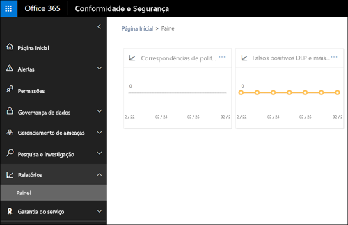
  
## Como funcionam as políticas de DLPHow DLP policies work

A DLP detecta informações confidenciais usando análise profunda de conteúdo (não apenas uma simples verificação de texto). Essa análise profunda de conteúdo usa correspondências de palavra-chave, correspondências de dicionário, a avaliação de expressões regulares, funções internas e outros métodos para detectar conteúdos que violam as políticas de DLP. Possivelmente, apenas uma pequena porcentagem dos seus dados é considerada confidencial. Uma política de DLP pode identificar, monitorar e proteger automaticamente apenas esses dados, sem impedir ou afetar as pessoas que trabalham com o restante do seu conteúdo.DLP detects sensitive information by using deep content analysis (not just a simple text scan). This deep content analysis uses keyword matches, dictionary matches, the evaluation of regular expressions, internal functions, and other methods to detect content that matches your DLP policies. Potentially only a small percentage of your data is considered sensitive. A DLP policy can identify, monitor, and automatically protect just that data, without impeding or affecting people who work with the rest of your content.
  
### As políticas são sincronizadasPolicies are synced

Após criar uma política de DLP no Centro de Segurança &amp; Conformidade, ela é armazenada em um repositório central de políticas e sincronizada com várias fontes de conteúdo, incluindo:After you create a DLP policy in the  ComplianceAdmin, it’s stored in a central policy store, and then synced to the various content sources, including:
  
- Exchange Online, e de lá para o Outlook na Web e o OutlookExchange Online, and from there to Outlook on the web and Outlook
    
- Sites do OneDrive for BusinessOneDrive for Business sites
    
- Sites do SharePoint OnlineSharePoint Online sites
    
- Programas da área de trabalho do Office (Excel, PowerPoint e Word)Office 2016 desktop programs (Excel 2016, PowerPoint 2016, and Word 2016)

- Mensagens de canais e de chats do Microsoft TeamsMicrosoft Teams chat threads and chat messages (preview)
    
Após a sincronização da política com os locais corretos, ela começa avaliar o conteúdo e aplicar as ações.After the policy’s synced to the right locations, it starts to evaluate content and enforce actions.
  
### Avaliação da política em sites do OneDrive for Business e do SharePoint OnlinePolicy evaluation in OneDrive for Business and SharePoint Online sites

Em todos os seus sites do SharePoint Online e sites do OneDrive for Business, os documentos estão em constante mudança — eles estão continuamente sendo criados, editados, compartilhados, movidos e assim por diante.Across all of your SharePoint Online sites and OneDrive for Business sites, documents are constantly changing — they’re continually being created, edited, shared, and so on. Isso significa que os documentos podem conflitar ou ficar em conformidade com uma política de DLP a qualquer momento.This means documents can conflict or become compliant with a DLP policy at any time. Por exemplo, uma pessoa pode carregar um documento que não contém nenhuma informação confidencial para seus sites de equipe, mas, posteriormente, outra pessoa pode editar o mesmo documento e adicionar informações confidenciais a ele.For example, a person can upload a document that contains no sensitive information to their team site, but later, a different person can edit the same document and add sensitive information to it.
  
Por esse motivo, as políticas de DLP verificam documentos em busca de correspondências de política com frequência em segundo plano.For this reason, DLP policies check documents for policy matches frequently in the background. Você pode considerar isso uma avaliação assíncrona da política.You can think of this as asynchronous policy evaluation.
  
#### Como funcionaHow it works
 
À medida em que as pessoas adicionam ou alteram documentos em seus sites, o mecanismo de pesquisa examina o conteúdo, para que você possa pesquisá-lo posteriormente.As people add or change documents in their sites, the search engine scans the content, so that you can search for it later. Enquanto isso, o conteúdo também será verificado quanto às informações confidenciais e para verificar se ele é compartilhado.While this is happening, the content's also scanned for sensitive information and to check if it's shared. Todas as informações confidenciais encontradas serão armazenadas de forma segura no índice de pesquisa, de modo que somente a equipe de conformidade possa acessá-la, mas não usuários comuns.Any sensitive information that's found is stored securely in the search index, so that only the compliance team can access it, but not typical users. Cada política de DLP ativada é executada em segundo plano (de forma assíncrona), verificando a pesquisa frequentemente por qualquer conteúdo que corresponda a uma política e aplicando ações para protegê-lo contra perdas acidentais.Each DLP policy that you've turned on runs in the background (asynchronously), checking search frequently for any content that matches a policy, and applying actions to protect it from inadvertent leaks.
  
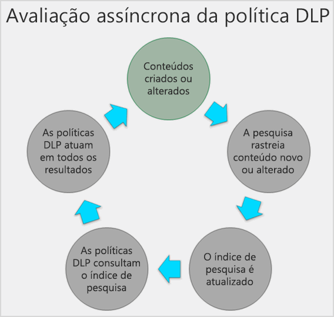
  
Por fim, os documentos podem conflitar uma política de DLP, mas eles também podem ficar em conformidade com ela. Por exemplo, se uma pessoa adicionar números de cartão de crédito a um documento, isso poderá fazer com que uma política de DLP bloqueie o acesso ao documento automaticamente. Mas, se a pessoa remover, mais tarde, as informações confidenciais, a ação (neste caso, bloqueio) será desfeita na próxima vez que se avaliar se o documento está de acordo com a política.Finally, documents can conflict with a DLP policy, but they can also become compliant with a DLP policy. For example, if a person adds credit card numbers to a document, it might cause a DLP policy to block access to the document automatically. But if the person later removes the sensitive information, the action (in this case, blocking) is automatically undone the next time the document is evaluated against the policy.
  
A DLP avalia qualquer conteúdo que pode ser indexado.DLP evaluates any content that can be indexed. Para saber mais sobre os tipos de arquivo que são rastreados por padrão, confira [Extensões de nomes de arquivos rastreados e tipos de arquivos padrão analisados no SharePoint Server](https://docs.microsoft.com/SharePoint/technical-reference/default-crawled-file-name-extensions-and-parsed-file-types).For more information on what file types are crawled by default, see [Default crawled file name extensions and parsed file types in SharePoint Server 2013http://go.microsoft.com/fwlink/p/?LinkID=627430](https://docs.microsoft.com/SharePoint/technical-reference/default-crawled-file-name-extensions-and-parsed-file-types).
  
### Avaliação de políticas no Exchange Online, Outlook e Outlook na WebPolicy evaluation in Exchange Online, Outlook, and Outlook on the web

Ao criar uma política DLP que inclui o Exchange Online como um local, a política foi sincronizada no Centro de Conformidade &amp; Segurança do Office 365 para o Exchange Online e, em seguida, do Exchange Online para o Outlook na Web e no Outlook.When you create a DLP policy that includes Exchange Online as a location, the policy's synced from the Office 365 Security &amp; Compliance Center to Exchange Online, and then from Exchange Online to Outlook on the web and Outlook.
  
Quando uma mensagem está sendo redigida no Outlook, o usuário pode ver dicas de política à medida que o conteúdo sendo criado é avaliado em relação às políticas DLP.When a message is being composed in Outlook, the user can see policy tips as the content being created is evaluated against DLP policies. Após uma mensagem ser enviada, ela é avaliada em relação às políticas DLP como parte normal do fluxo de emails, juntamente com regras de fluxo de emails do Exchange e as políticas DLP criadas no Centro de Administração do Exchange.And after a message is sent, it's evaluated against DLP policies as a normal part of mail flow, along with Exchange mail flow rules (also known as transport rules) and DLP policies created in the Exchange admin center. As políticas DLP examinam tanto a mensagem quanto os anexos.DLP policies scan both the message and any attachments.
  
### Avaliação de política nos programas da área de trabalho do OfficePolicy evaluation in the Office 2016 desktop programs

Excel, PowerPoint e Word incluem os mesmos recursos para identificar informações confidenciais e aplicar políticas de DLP como o SharePoint Online e o OneDrive for Business.Excel 2016, PowerPoint 2016, and Word 2016 include the same capability to identify sensitive information and apply DLP policies as SharePoint Online and OneDrive for Business. Esses programas do Office sincronizam suas políticas DLP diretamente do repositório central de políticas e, em seguida, avaliam continuamente o conteúdo em relação às políticas DLP quando as pessoas trabalham com documentos abertos de um site incluso em uma política DLP.These Office 2016 programs sync their DLP policies directly from the central policy store, and then continuously evaluate the content against the DLP policies when people work with documents opened from a site that’s included in a DLP policy.
  
A avaliação das políticas DLP no Office foi desenvolvida para não afetar o desempenho dos programas ou a produtividade de pessoas que trabalham no conteúdo.DLP policy evaluation in Office 2016 is designed not to affect the performance of the programs or the productivity of people working on content. Se estiverem trabalhando em um documento grande ou o computador do usuário estiver ocupado, pode demorar alguns segundos para uma dica de política ser exibida.If they’re working on a large document, or the user’s computer is busy, it might take a few seconds for a policy tip to appear.

### Avaliação de políticas no Microsoft TeamsPolicy evaluation in Microsoft Teams
 
Ao criar uma política DLP que inclui o Microsoft Teams como um local, a política foi sincronizada no centro de Conformidade &amp; Segurança do Office 365 para contas de usuários e mensagens de chat e de canais do Microsoft Teams.When you create a DLP policy that includes Microsoft Teams as a location, the policy's synced from the Office 365 Security &amp; Compliance Center to user accounts and Microsoft Teams channels and chat messages. Dependendo da configuração das políticas DLP, quando alguém tentar compartilhar informações confidenciais em uma mensagem de chat ou canal do Microsoft Teams, a mensagem pode ser bloqueada ou revogada.Depending on how DLP policies are configured, when someone attempts to share sensitive information in a Microsoft Teams chat or channel message, the message can be blocked or revoked. Os documentos com informações confidenciais e que são compartilhados com convidados (usuários externos) não abrirão para esses usuários.And, documents that contain sensitive information and that are shared with guests (external users) won't open for those users. Para saber mais, confira [Prevenção contra perda de dados no Microsoft Teams](dlp-microsoft-teams.md).To learn more, see [Data loss prevention and Microsoft Teams](dlp-microsoft-teams.md).
 
## PermissõesPermissions

Os membros da sua equipe de conformidade que irão criar políticas DLP precisam de permissões ao Centro de Conformidade &amp; Segurança.Members of your compliance team who will create DLP policies need permissions to the Compliance Center. Por padrão, o administrador de locatário terá acesso a esse local e pode conceder aos responsáveis pela conformidade e outras pessoas acesso ao Centro de Conformidade &amp; Segurança, sem conceder todas as permissões de um administrador de locatário. Para fazer isso, recomendamos:Members of your compliance team who will create DLP policies need permissions to the ComplianceAdmin. By default, your tenant admin will have access to this location and can give compliance officers and other people access to the ComplianceAdmin, without giving them all of the permissions of a tenant admin. To do this, we recommend that you:
  
1. Criar um grupo no Office 365 e adicione os responsáveis pela conformidade.Create a group in Office 365 and add compliance officers to it.
    
2. Criar um grupo de funções na página **Permissões** do Centro de Conformidade &amp; Segurança.Create a role group on the **Permissions** page of the Security &amp; Compliance Center. 
    
3. Adicionar o grupo do Office 365 ao grupo de funções.Add the Office 365 group to the role group.
    
Para saber mais, consulte [Conceder aos usuários acesso ao Centro de Conformidade e Segurança do Office 365](grant-access-to-the-security-and-compliance-center.md).For more information, see [Give users access to the Office 365 Compliance Center](grant-access-to-the-security-and-compliance-center.md).
  
Essas permissões são necessárias somente para criar e aplicar uma política de DLP.These permissions are required only to create and apply a DLP policy. A imposição da política não exige acesso ao conteúdo.Policy enforcement does not require access to the content.
  
## Encontre os cmdlets da DLPFind the DLP cmdlets

Para usar a maioria dos cmdlets do Centro de Conformidade &amp; Segurança, você precisa:To use most of the cmdlets for the Security &amp; Compliance Center, you need to:
  
1. [Conectar-se ao Centro de Conformidade &amp; Segurança do Office 365 usando o PowerShell RemotoConnect to the Office 365 Security &amp; Compliance Center using remote PowerShell](https://docs.microsoft.com/powershell/exchange/office-365-scc/connect-to-scc-powershell/connect-to-scc-powershell?view=exchange-ps)
    
2. Usar qualquer um destes [cmdlets policy-and-compliance-dlp](https://docs.microsoft.com/powershell/module/exchange/policy-and-compliance-dlp/export-dlppolicycollection?view=exchange-ps)Use any of these [policy-and-compliance-dlp cmdlets](https://docs.microsoft.com/powershell/module/exchange/policy-and-compliance-dlp/export-dlppolicycollection?view=exchange-ps)
    
No entanto, os relatórios DLP precisam extrair dados do Office 365, incluindo o Exchange Online.However, DLP reports need pull data from across Office 365, including Exchange Online. Por esse motivo, **os cmdlets para os relatórios DLP estão disponíveis no Exchange Online Powershell, e não no Centro de Conformidade &amp; Segurança do Powershell**.For this reason, **the cmdlets for the DLP reports are available in Exchange Online Powershell -- not in Security &amp; Compliance Center Powershell**. Portanto, para usar os cmdlets para os relatórios DLP, você precisa:Therefore, to use the cmdlets for the DLP reports, you need to:
  
1. [Conectar-se ao Exchange Online usando o PowerShell RemotoConnect to Exchange Online using remote PowerShell](https://docs.microsoft.com/powershell/exchange/exchange-online/connect-to-exchange-online-powershell/connect-to-exchange-online-powershell?view=exchange-ps)
    
2. Usar qualquer um destes cmdlets para os relatórios DLP:Use any of these cmdlets for the DLP reports:
    
  - [Get-DlpDetectionsReportGet-DlpDetectionsReport](https://docs.microsoft.com/powershell/module/exchange/policy-and-compliance-dlp/Get-DlpDetectionsReport?view=exchange-ps)
    
  - [Get-DlpDetailReportGet-DlpDetailReport](https://docs.microsoft.com/powershell/module/exchange/policy-and-compliance-dlp/Get-DlpDetailReport?view=exchange-ps)
    
## Mais informaçõesMore information

- [Criar uma política DLP a partir de um modeloCreate a DLP policy from a template](create-a-dlp-policy-from-a-template.md)
    
- [Enviar notificações e exibir dicas de políticas para as políticas DLPSend notifications and show policy tips for DLP policies](use-notifications-and-policy-tips.md)
    
- [Criar uma política DLP para proteger documentos com FCI ou outras propriedadesCreate a DLP policy to protect documents with FCI or other properties](protect-documents-that-have-fci-or-other-properties.md)
    
- [O que os modelos de política DLP incluemWhat the DLP policy templates include](what-the-dlp-policy-templates-include.md)
    
- [O que os tipos de informação confidencial procuramWhat the sensitive information types look for](what-the-sensitive-information-types-look-for.md)
    
- [O que as funções DLP procuramWhat the DLP functions look for](what-the-dlp-functions-look-for.md)
    
- [Criar um tipo de informação confidencial personalizadoCreate a custom sensitive information type](create-a-custom-sensitive-information-type.md)
    

