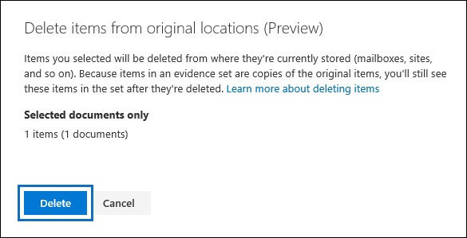
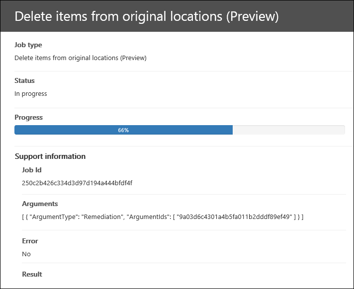

# Excluir itens de seu local original (versão prévia)

O recurso para excluir itens de seu local original está em visualização.

Usando investigações de dados, você pode excluir itens de seus locais originais. Isso significa que você pode excluir itens de caixas de correio do Exchange, sites do SharePoint e contas do OneDrive em sua organização. Como você coletou itens como evidência, você tem cópias dos itens retidos no conjunto de evidências para investigar mais ou manter como referência.

## Antes de começar

- Para excluir itens, você precisa ter a função de **pesquisa e limpeza** no centro de conformidade de segurança &. Essa função é atribuída por padrão ao grupo de função interno do investigador de dados. 

- O procedimento neste tópico pressupõe que você tenha executado uma pesquisa associada a uma investigação e adicionado os resultados da pesquisa a um conjunto de evidência. Depois que os resultados da pesquisa estiverem em evidência, você poderá selecionar um ou mais itens a serem excluídos. Para saber mais, confira [Pesquisar dados em uma investigação](search-for-data.md).

- É importante ter em mente que somente os itens dos locais de conteúdo original (como caixas de correio do Exchange, sites do SharePoint e contas do OneDrive) são excluídos. Esses itens não são excluídos do conjunto de evidências. Isso ocorre porque os itens em um conjunto de evidências são cópias do original. Esses itens são copiados quando você adicionou os resultados de uma pesquisa a um conjunto de evidências.

## Excluir itens

Execute as seguintes etapas para excluir itens do local original:

1. Na ferramenta de **investigações de dados** , abra a investigação de dados que contém os itens que você deseja excluir e clique na guia **evidência** .

2. Selecione os itens que você deseja excluir. Você pode selecionar todos os itens no conjunto de evidências ou selecionar apenas um subconjunto de itens. 

   > [!NOTE]
   > Se você selecionar os anexos de um email ou um arquivo anexado a um documento no SharePoint e no OneDrive, o item pai também será selecionado e excluído quando o item for excluído do seu local original. Da mesma forma, se você selecionar um item que tenha anexos, o item de item pai e todos os anexos serão excluídos.
 
2. Clique em **ação** e em **excluir itens de locais originais**.

   

3. Na página do menu suspenso, verifique o número de itens e documentos filhos relacionados que serão excluídos e clique em **excluir**.

   

   > [!NOTE]
   > Na captura de tela anterior, o número de itens indica o número de itens selecionados para exclusão. O número de documentos indica o número total de itens, incluindo os arquivos anexados a um item pai. Por exemplo, se você selecionar uma mensagem de email e essa mensagem tiver um documento do Word anexado, o número de itens e documentos exibidos em **documentos selecionados só** será **1 itens (2 documentos)**.

Você pode acompanhar o progresso do trabalho **excluir itens de locais originais** na guia **trabalhos** . Clique no trabalho para exibir a página de menu suspenso. 

Quando os itens no trabalho são excluídos, o status do trabalho é definido como **bem-sucedido**. A hora e a data do trabalho concluído também são exibidas. 

> [!NOTE]
> Você pode receber um status **parcialmente bem-sucedido** para o trabalho **excluir itens de locais originais** . Há várias situações que resultam nesse status de trabalho. Para obter mais informações, consulte a seção [exclusões parcialmente bem-sucedidas](#partially-successful-deletions) neste artigo.

## O que acontece quando você exclui itens

No momento, quando você exclui itens de seu local de conteúdo original, os itens são *excluídos*de forma reversível. Isso significa que os itens são movidos para um local especial e retidos até que o período de retenção do item excluído expire e um item seja marcado para exclusão permanente do Office 365. Itens de exclusão reversível significa que os usuários ainda podem recuperar esses itens até que o período de retenção expire. Veja a seguir descrições sobre o que acontece quando os itens são excluídos de forma reversível das caixas de correio do Exchange e dos sites do SharePoint e do OneDrive for Business e o que os usuários podem fazer depois que os itens são excluídos de seus locais originais.

- **Caixas de correio:** Quando um item de caixa de correio é excluído por software, ele é movido para a pasta itens recuperáveis na caixa de correio. Esse comportamento é semelhante a quando um usuário exclui um item da pasta itens excluídos ou exclui permanentemente um item pressionando Shift + Delete. Neste ponto, o usuário pode recuperar o item até que o período de retenção do item excluído expire. No Office 365, o período de retenção do item excluído é de 14 dias por padrão, mas um administrador pode aumentar o período de retenção para 30 dias. Depois que o período de retenção expirar, o item será movido para uma pasta oculta ( ** chamada de pasta de limpezas). O item será removido permanentemente do Office 365 na próxima vez que a caixa de correio for processada. As caixas de correio são processadas uma vez a cada sete dias).

- **Sites do SharePoint e do onedrive:** Quando um arquivo ou documento em um site é excluído de forma reversível, ele é movido para a lixeira do site (também chamada de lixeira de *primeiro estágio* ). O item permanece na lixeira por 93 dias (o período de retenção de itens excluídos para sites no Office 365). Durante o período de 93 dias, os itens excluídos ainda podem ser recuperados por um administrador de conjunto de sites no SharePoint ou pelo usuário ou administrador no OneDrive. Os itens também podem ser excluídos da lixeira de primeiro estágio. Quando isso acontece, os itens são movidos para a lixeira do conjunto de sites, que é chamado de lixeira de *segundo estágio* . O período de retenção é 93 dias para as lixeiras de primeiro estágio e de segundo estágio. Isso significa que a retenção da lixeira de segundo estágio começa quando o item é inicialmente excluído. Isso significa que o tempo de retenção máximo é de 93 dias para ambas as lixeiras. Se um item for excluído da lixeira de segundo estágio (seja manualmente por um administrador ou automaticamente quando o período de retenção expirar), ele não será mais acessível por um administrador.

## O que acontece se um local de conteúdo está em espera

No Office 365, caixas de correio e sites podem ser colocados em espera ou atribuídos a uma política de retenção. Isso significa que nada é permanentemente removido até que o período de retenção de um item expire ou até que a retenção seja removida. Mesmo que você exclua um item de seu local original, o item pode não ser permanentemente removido do Office 365. Por exemplo, se uma caixa de correio estiver em espera, os itens excluídos por software serão eventualmente movidos para limpezas ou subpastas do DiscoveryHold na pasta itens recuperáveis e retidos até que a duração da retenção ou o período de retenção expire. Para sites, uma cópia do item que é movido para a lixeira é copiada para a biblioteca de retenção de preservação que é criada quando uma política de retenção ou bloqueio é colocada em um site.

## Exclusões com êxito parcial

Após a conclusão da execução do trabalho **excluir itens de locais originais** , você poderá receber um status de trabalho **parcialmente bem-sucedido**. Em geral, esse status indica que o trabalho foi executado com êxito, mas nem todos os itens foram excluídos de forma reversível. Veja a seguir uma lista de motivos que resultam em exclusões parcialmente bem-sucedidas:

- Um item de caixa de correio já foi localizado na pasta itens recuperáveis na caixa de correio de origem.

- Um item de caixa de correio foi removido da pasta itens recuperáveis na caixa de correio de origem.

- Um documento já foi localizado na lixeira de primeiro estágio em um site do SharePoint ou do OneDrive.

- Um documento foi movido para um site do SharePoint diferente depois de adicionado ao conjunto de evidências. Nesse caso, o documento não será movido para a lixeira no site para o qual foi movido.

- Um documento foi excluído permanentemente no SharePoint ou no OneDrive (movido para a lixeira de segundo estágio) após ser adicionado ao conjunto de evidências.
