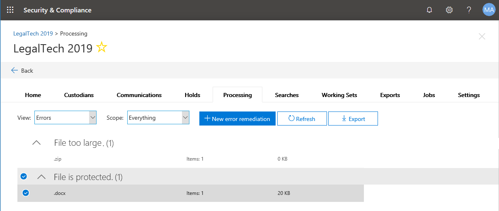
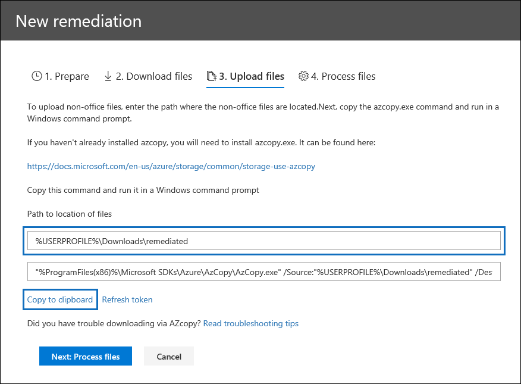

# Correção de erro ao processar dados de uma investigaçãoError remediation when processing data for an investigation

A correção de erros permite que o investigador possa corrigir problemas de dados que impedem que investigações de dados (visualização) processem o conteúdo corretamente.Error remediation allows investigators the ability to rectify data issues which prevent Data Investigations (Preview) from properly processing the content. Por exemplo, os arquivos protegidos por senha não podem ser processados, já que os arquivos são bloqueados ou criptografados.For example, files that are password protected cannot be processed since the files are locked or encrypted. Usando a correção de erros, os investigadores podem baixar arquivos com esses erros, remover a proteção por senha e carregar os arquivos corrigidos.Using error remediation, investigators can download files with such errors, remove the password protection and upload the remediated files.

Use o fluxo de trabalho a seguir para corrigir arquivos com erros em casos de investigações de dados (visualização).Use the following workflow to remediate files with errors in Data Investigations (Preview) cases.

## Criando uma sessão de correção de erro para corrigir arquivos com erros de processamentoCreating an error remediation session to remediate files with processing errors

>[!NOTE]
>Se o assistente de correção de erros for fechado a qualquer momento durante o procedimento a seguir, você poderá retornar à sessão de correção de erro na guia **processamento** selecionando as correções de **erro** no menu suspenso **Exibir** .If the the error remediation wizard is closed at any time during the following procedure, you can return to the error remediation session from the **Processing** tab by selecting **Error remediations** in the **View** drop down menu.

1. Na guia **processamento** em um caso de investigações de dados (visualização), selecione **erros** no menu suspenso **Exibir** .On the **Processing** tab in an Data Investigations (Preview) case, select **Errors** in the **View** drop down menu.

2. Selecione os erros que você deseja corrigir clicando no botão de opção ao lado do tipo de erro ou tipo de arquivo.Select the errors you want to remediate by clicking the radio button next to either the error type or file type.  No exemplo a seguir, estamos corrigindo um arquivo protegido por senha.In the following example, we're remediating a password protected file.

3. Clique em **+ nova correção de erro**.Click **+ New error remediation**.

    

    A sessão de correção de erro será iniciada, começando com um estágio de preparação onde os arquivos com erros são copiados para um local seguro do Azure para que eles possam ser baixados.The error remediation session will begin, starting with a preparation stage where the files with errors are copied to a secure Azure location so that they can be downloaded.

    

4. Após a conclusão da preparação, clique em **Avançar: baixar arquivos** para continuar com o download.After the preparation is completed, click **Next: Download files** to proceed with download.

    

5. Para baixar arquivos, especifique o **caminho de destino para download**; Este é um caminho no computador local onde o arquivo deve ser baixado.To download files, specify the **Destination path for download**; this is a path on your local computer where the file should be downloaded.  O caminho padrão,%USERPROFILE%\Downloads\errors, aponta para a pasta downloads do usuário conectado; Isso pode ser alterado conforme necessário.The default path, %USERPROFILE%\Downloads\errors, points to the logged-in user's downloads folder; this can be changed as needed.

    >[!NOTE]
    >Recomendamos que você use um caminho de arquivo local em vez de um caminho de rede remoto para obter o desempenho ideal.We recommend that you use a local file path instead of a remote network path for optimal performance.

    > [!NOTE]
    > Se você ainda não instalou o AzCopy, você pode instalá-lo daqui:https://docs.microsoft.com/en-us/azure/storage/common/storage-use-azcopyIf you haven't installed AzCopy, you can install it from here: https://docs.microsoft.com/en-us/azure/storage/common/storage-use-azcopy

6. Copie o comando predefinido clicando em **copiar para área de transferência**.Copy the predefined command by clicking **Copy to clipboard**. Inicie um prompt de comando do Windows, Cole o comando e pressione **Enter**.Start a windows command prompt, paste the command, and then press **Enter**.  

    Os arquivos serão baixados.The files will be downloaded.

    

     > [!NOTE]
     > Se você tiver problemas para executar este comando, confira [solucionar problemas de AzCopy na descoberta eletrônica avançada](../compliance20/troubleshooting-azcopy.md).If you have issues running this command, see [Troubleshoot AzCopy in Advanced eDiscovery](../compliance20/troubleshooting-azcopy.md).

7. Depois de baixar os arquivos, você pode corrigi-los com uma ferramenta apropriada.After downloading the files, you can remediate them with an appropriate tool. Para arquivos protegidos por senha, há várias ferramentas de quebra de senha que você pode usar.For password protected files, there are a number of password cracking tools you can use. Se você souber as senhas dos arquivos, poderá abri-las e remover a proteção por senha.If you know the passwords for the files, you can open them and remove the password protection.
    
   > [!NOTE]
    > É importante que você mantenha a estrutura de diretório e os nomes de arquivo dos arquivos corrigidos no tact.It's important that you retain the directory structure and file names of the remediated files in tact.  Todas as convenções de nomenclatura usadas nas pastas e arquivos baixados tornam possível associar os arquivos do remdiated de volta ao original.All naming conventions used in the downloaded files and folders make it possible to associate the remdiated files back to the original.

8. Agora, retorne a investigações de dados (visualização) e clique em **Avançar: carregar arquivos**.Now, return to Data Investigations (Preview) and click **Next: Upload files**.  Isso passará para a próxima etapa, onde você pode agora carregar os arquivos.This will move to the next step where you can now upload the files.

    

9. Especifique o local dos arquivos corrigidos na caixa de texto **caminho para o local de arquivos** e clique em **copiar para área de transferência**.Specify the location of the remediated files in the **Path to location of files** text box, then click **Copy to clipboard**.

10. Cole o comando em um prompt de comando do Windows e pressione **Enter** para carregar os arquivos.Paste the command into a Windows Command Prompt and press **Enter** to upload the files.

    

11. Por fim, retorne a investigações de dados (visualização) e clique em **Avançar: processar arquivos**.Finally, return to Data Investigations (Preview) and click **Next: Process files**.

12. Quando o processamento estiver concluído.When processing is complete.  Você pode retornar ao conjunto de trabalho e ver o arquivo corrigido.You can return to the working set and see the remediated file.

## O que acontece quando os arquivos são corrigidosWhat happens when files are remediated

Quando os arquivos corrigidos são carregados, os metadados originais são preservados com a exceção dos seguintes campos:When remediated files are uploaded, the original metadata is preserved with the exception of the following fields: 

- ExtractedTextSizeExtractedTextSize
- HasTextHasText
- IsErrorRemediateIsErrorRemediate
- LoadidLoadId
- ProcessingErrorMessageProcessingErrorMessage
- ProcessingStatusProcessingStatus
- TextoText
- WordCountWordCount
- WorkingsetIdWorkingsetId

Para obter uma definição de todos os campos de metadados do documento em investigações de dados (visualização), confira [campos de metadados do documento](document-metadata-fields.md).For a definition of all document metadata fields in Data Investigations (Preview), see [Document metadata fields](document-metadata-fields.md).