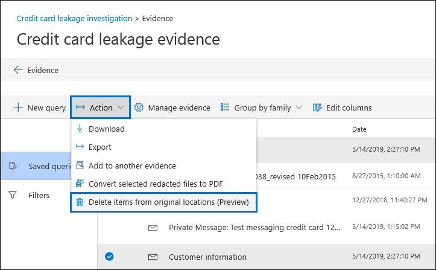

# Gerenciar um incidente de derramamento de dados no Microsoft 365Manage a data spillage incident in Microsoft 365

Data derramamento é quando um documento que contém informações confidenciais, confidenciais ou mal-intencionadas é liberado em um ambiente não confiável.Data spillage is when a document containing confidential, sensitive, or malicious information is released in an untrusted environment. Quando um incidente de derramamento de dados é detectado, é importante conter rapidamente o ambiente, avaliar o tamanho e os locais do derramamento, examinar as atividades do usuário em torno dele e, em seguida, excluir os dados derramados do serviço.When a data spillage incident is detected, it's important to quickly contain the environment, assess the size and locations of the spillage, examine user activities around it, and then delete the spilled data from the service. Usando a ferramenta de investigações de dados (visualização), você pode pesquisar dados confidenciais, mal-intencionados ou incorretos no Office 365, investigar para descobrir o que aconteceu e tomar as medidas apropriadas.Using the Data Investigations (Preview) tool, you can search for sensitive, malicious, or misplaced data across Office 365, investigate to find out what happened, and then take appropriate actions.  

## Escopo deste artigoScope of this article

Este artigo fornece uma lista de instruções sobre como excluir permanentemente os itens das caixas de correio do Office 365 para que eles não sejam mais acessíveis ou recuperáveis por usuários ou administradores.This article provides a list of instructions on how to permanently delete items from Office 365 mailboxes so they are no longer accessible or recoverable by users or admins. 

> [!NOTE]
> Quando você exclui itens localizados em um site do SharePoint ou do OneDrive for Business, eles são mantidos por 93 dias a partir do momento em que são excluídos do local original.When you delete items located in a SharePoint or OneDrive for Business site, they are retained for 93 days from the time you delete them from their original location.

## CenárioScenario

Você é informado de um incidente de derramamento de dados em que um funcionário compartilhou inadvertidamente um documento altamente confidencial com várias pessoas por email.You're informed of a data spillage incident where an employee unknowingly shared a highly confidential document with multiple people through email. Você deseja avaliar rapidamente quem recebeu este documento, tanto dentro e fora da sua organização.You want to quickly assess who received this document, both inside and outside of your organization. Após investigar o incidente, você planeja compartilhar suas descobertas com outros investigadores para revisão e, em seguida, remover permanentemente os dados derramados de sua organização do Office 365.After you've investigate the incident, you plan to share your findings with other investigators to review, and then permanently remove the spilled data from your Office 365 organization. Após a conclusão da investigação, você deseja remover todas as evidências.After the investigation is complete, you want to remove all evidence. 

> [!IMPORTANT]
> Embora você possa remover permanentemente os dados derramados dentro de sua própria organização, nenhum dado derramado fora da sua organização não pode ser removido com esses recursos.While you'll be able to permanently remove the spilled data within your own organization, any data spilled outside your organization can't be removed with these capabilities.

## Fluxo de TrabalhoWorkflow

Este é o fluxo de trabalho para usar investigações de dados (visualização) para gerenciar um incidente de derramamento de dados:Here's the workflow for using Data Investigations (Preview) to manage a data spillage incident:

1.  Criar uma investigação de dados.Create a data investigation.

2.  Pesquise dados confidenciais, mal-intencionados ou de local incorreto e colete-os como evidência.Search for sensitive, malicious, or misplaced data and collect them as evidence.

3.  Revise e investigue as evidências.Review and investigate the evidence.

4.  Excluir permanentemente os dados derramados.Permanently delete the spilled data.

5.  Feche ou exclua a investigação.Close or delete the investigation.

## Antes de começarBefore you begin

- Para criar uma investigação de dados, procurar por conteúdo e excluir dados derramados, você precisa ser membro do grupo de função do investigador de dados no centro de conformidade de & de segurança.To create a data investigation, search for content, and delete spilled data, you have to be a member of the Data Investigator role group in the Security & Compliance Center.

- Para controlar quais caixas de correio de usuário e contas do OneDrive podem pesquisar, sua organização pode configurar os limites de conformidade.To control which user mailboxes and OneDrive accounts an investigator can search, your organization can set up compliance boundaries. Para obter mais informações, [Configure os limites de conformidade para investigações de descoberta eletrônica](../set-up-compliance-boundaries.md).For more information, [Set up compliance boundaries for eDiscovery investigations](../set-up-compliance-boundaries.md). 

## Etapa 1: criar uma investigação de dadosStep 1: Create a data investigation

Para criar uma investigação na ferramenta de investigações de dados (visualização):To create an investigation in the Data Investigations (Preview) tool:

1. Acesse [https://protection.office.com](https://protection.office.com).Go to [https://protection.office.com](https://protection.office.com).
    
2. Entre no Office 365 usando uma conta que seja membro do grupo de função do investigador de dados.Sign in to Office 365 using an account that is a member of the Data Investigator role group.
    
3. No centro de segurança e conformidade, clique em **investigações de dados**.In the security and compliance center, click **Data Investigations**.
 
4. Na página **investigações de dados (visualização)** , clique em **criar nova investigação**.On the **Data Investigations (Preview)** page, click **Create new investigation**.
    
5. Na nova página de submenu de **investigação de dados** , dê um nome à investigação (obrigatório) e digite um número de investigação e uma descrição opcionais.On the **New data investigation** flyout page, give the investigation a name (required), and then type an optional investigation number and description. O nome deve ser exclusivo em sua organização.The name must be unique in your organization.

6. Em **você deseja definir configurações adicionais depois de criar esta investigação?**, siga um destes procedimentos:Under **Do you want to configure additional settings after creating this investigation?**, do one of the following:

    - Clique em **Sim** para criar a investigação e exiba a página **configurações** no novo caso.Click **Yes** to create the investigation, and display the **Settings** page in the new case. Isso permite adicionar membros à investigação.This allows you to add members to the investigation.
    
    - Clique em **não** para criar a investigação e exibi-la na lista de casos da página **investigações de dados (visualização)** .Click **No** to create the investigation and display it in the list of cases on the **Data Investigations (Preview)** page. Se você escolher essa opção, será adicionado como o único membro da investigação, e as configurações padrão de pesquisa e análise serão usadas.If you choose this option, you will be added as the only member of the investigation and the default search and analytics settings will be used. Você pode adicionar membros ou alterar configurações a qualquer momento após a criação da investigação.You can add members or change settings anytime after the investigation is created.

7. Clique em **salvar** para criar a investigação.Click **Save** to create the investigation.

    A nova investigação é exibida na lista na página **investigações de dados (visualização)** .The new investigation is displayed in the list on the **Data Investigations (Preview)** page. 

8. Para abrir uma investigação, clique no nome da investigação.To open an investigation, click the name of the investigation. 

    A guia **página inicial** da investigação é exibida.The **Home** tab for the investigation is displayed. 

> [!TIP]
> Considere o estabelecimento de uma Convenção de nomenclatura para investigações e forneça tantas informações quantas forem necessárias no nome e na descrição para que você possa localizar e se referir a elas no futuro, se necessário.Consider establishing a naming convention for investigations and provide as much information as you can in the name and description so you can locate and refer to them in the future if necessary.
 
## Etapa 2: Pesquisar os dados derramadosStep 2: Search for the spilled data 
 
Se você souber quais usuários você deseja pesquisar por dados derramados, você pode adicioná-los como pessoas de interesse para mapear suas fontes de dados para a investigação e pesquisar rapidamente a sua caixa de correio e a conta do OneDrive.If you know which users you want to search for spilled data, you can add them as people of interest to map their data sources to the investigation and quickly search their mailbox and OneDrive account. Para adicionar pessoas de interesse à investigação, clique em **pessoas de interesse**e, em seguida, clique em **adicionar pessoas de interesse**.To add people of interest to the investigation, click **People of interest**, and then click **Add people of interest**. Para obter mais informações, consulte [gerenciar pessoas de interesse](manage-people-of-interest.md).For more information, see [Manage people of interest](manage-people-of-interest.md).

Na guia **pesquisas** , você pode criar pesquisas para localizar os dados derramados.On the **Searches** tab, you can create searches to find the spilled data. Para obter mais informações sobre como criar pesquisas, confira [Pesquisar dados em uma investigação](search-for-data.md).For more information about creating searches, see [Search for data in an investigation](search-for-data.md).

Depois de executar a pesquisa, você pode Visualizar amostras de resultados de pesquisa e exibir estatísticas de pesquisa para avaliar a eficácia da consulta de pesquisa.After you run the search, you can preview samples of search results and view search statistics to evaluate the effectiveness of your search query. Após identificar os itens que você deseja excluir do Office 365, você pode adicionar os resultados da pesquisa a um conjunto de evidência.After you identify the items that you want to delete from Office 365, you can add the search results to an evidence set. Para fazer isso, clique na pesquisa que você deseja investigar.To do this, click the search that you want to investigate. Na página do menu suspenso, clique em **Adicionar resultados a evidências** e siga as instruções.On the flyout page, click **Add results to evidence** and follow the instructions. Em seguida, no conjunto de evidências, você pode revisar documentos individuais, investigar quem teve acesso aos documentos e exportar os documentos.Then in the evidence set, you can review individual documents, investigate who had access to documents, and export the documents. Para excluir os documentos (ou um subconjunto de documentos) em vez de analisá-los, vá para a [etapa 4](#step-4-delete-the-spilled-data).To delete the documents (or a subset of documents) instead of reviewing them, go to [Step 4](#step-4-delete-the-spilled-data). 

> [!IMPORTANT]
> As palavras-chave que você usa na consulta de pesquisa podem conter os dados reais derramados que você está pesquisando.The keywords that you use in the search query may contain the actual spilled data that you're searching for. Por exemplo, se você procurar documentos que contenham um número de seguro social e usá-lo como uma palavra-chave na consulta de pesquisa, você deverá excluir a consulta posteriormente para evitar mais derramamento.For example, if you search for documents containing a social security number and you use it as a keyword in the search query, you must delete the query afterwards to avoid further spillage. Você pode excluir a pesquisa ou excluir toda a investigação na [etapa 5](#step-5-close-or-delete-the-investigation).You can delete the search or delete the entire investigation in [Step 5](#step-5-close-or-delete-the-investigation). 

## Etapa 3: analisar e investigarStep 3: Review and investigate 

Na investigação, vá para a guia **evidência** e clique no conjunto de evidências que você criou na etapa anterior.In the investigation, go to the **Evidence** tab and click the evidence set that you created in the previous step. Após o trabalho de processamento ser concluído e os resultados da pesquisa serem adicionados à evidência, você pode revisar documentos individuais em seu formato nativo, formato de texto ou um formato Near-Native.After the processing job is completed and the search results are added to the evidence, you can review individual documents in their native format, text format, or a near-native format. Você pode criar consultas adicionais para restringir a lista de documentos e marcar documentos para indicar resultados de sua investigação.You can create additional queries to narrow the list of documents, and tag documents to indicate findings from your investigation. Para obter mais informações, consulte [Review data in Evidence](review-data-in-evidence.md)For more information, see [Review data in evidence](review-data-in-evidence.md)

Para agrupar documentos e obter mais assistência para revisão, clique em **gerenciar evidência**.To group documents and get more assistance for your review, click **Manage evidence**. No bloco de **análise** , clique em **analisar**.In the **Analytics** tile, click **Analyze**. Isso executa análises avançadas, como detecção de duplicidades, encadeamento de emails e análise de temas.This runs advanced analytics such as duplicate detection, email threading, and theme analysis. Para obter mais informações, consulte:For more information, see:

- [Executar análise para investigar mais rápidoRun analytics to investigate faster](run-analytics-to-investigate-faster.md)
- [Detecção de duplicata próximaNear duplicate detection](near-duplicates.md)
- [Conversa de emailEmail threading](email-threading.md)
- [TemasThemes](themes.md)

Para determinar quais usuários estão envolvidos no derramamento de dados, você pode criar uma consulta no conjunto de evidências e, em seguida, usar as condições remetente/autor e destinatários.To determine which users are involved in the data spillage, you can create a query in the evidence set and then use the Sender/Author and Recipients conditions. Isso cria uma lista de todos os remetentes, destinatários e autores encontrados nos dados coletados que foram adicionados à evidência.This creates a list of all senders, recipients, and authors found in collected data that was added to the evidence. Certifique-se de examinar a lista para determinar se há usuários externos.Be sure to examine the list to determine if there are any external users. Para obter mais informações sobre como usar condições para restringir os resultados da pesquisa, consulte [Search Conditions](../keyword-queries-and-search-conditions.md#search-conditions).For more information about using conditions to narrow search results, see [Search conditions](../keyword-queries-and-search-conditions.md#search-conditions).

## Etapa 4: excluir os dados derramadosStep 4: Delete the spilled data

Usando a ferramenta de investigações de dados, você pode excluir itens de seus locais originais.Using the data investigations tool, you can delete items from their original locations. Por exemplo, você pode excluir itens de caixas de correio, sites do SharePoint e contas do OneDrive em sua organização.For example, you can delete items from mailboxes, SharePoint sites, and OneDrive accounts across your organization. Lembre-se de que, como você coletou itens como evidência (adicionando os resultados da pesquisa ao conjunto de evidências na etapa 2), você tem cópias dos itens no conjunto de evidências para investigar ou preservá-los ainda mais.Keep in mind that because you collected items as evidence (by adding the search results to the evidence set in Step 2), you have copies of the items in the evidence set to further investigate or preserve them.

Para excluir itens de seus locais originais:To delete items from their original locations:

1. No conjunto de evidências, selecione os itens que você deseja excluir.In the evidence set, select the items that you want to delete. Se você selecionar itens que estão anexados a uma mensagem de email, a mensagem de email pai também será selecionada e excluída.If you select items that are attached to an email message, the parent email message will also be selected and deleted. 
 
2. Clique em **ação** e em **excluir itens de locais originais**.Click **Action** and then click **Delete items from original locations**.

   

3. Na página do menu suspenso, verifique o número de itens e documentos filhos relacionados que serão excluídos e clique em **excluir**.On the flyout page, verify the number of items and related child documents that will be deleted, and then click **Delete**.

No momento, quando você exclui itens de seu local original, os itens são excluídos de forma reversível.At this time, when you delete items from their original location, the items are soft-deleted. Isso significa que os itens excluídos serão retidos até que o período de recuperação de item excluído do item expire.This means that the deleted items will be retained until the deleted item recovery period for the item expires. Isso também significa que é possível que os usuários recuperem esses itens.This also means it's possible for users to recover these items. Para obter mais informações sobre o que acontece quando itens são excluídos de caixas de correio e sites, consulte [excluir itens de seu local original](delete-items-from-original-locations.md).For more information about what happens when items are deleted from mailboxes and sites, see [Delete items from their original location](delete-items-from-original-locations.md).

## Etapa 5: fechar ou excluir a investigaçãoStep 5: Close or delete the investigation

Após excluir documentos nos locais de conteúdo de origem (caixas de correio ou sites) no serviço Live, você ainda terá cópias desses documentos que você adicionou às evidências como parte da sua investigação.After you delete documents in the source content locations (mailboxes or sites) in the live service, you will still have copies of these documents that you added to evidence as part of your investigation. Para evitar mais dados derramamento, considere a possibilidade de excluir a própria investigação.To avoid further data spillage, you should consider deleting the investigation itself.

Para excluir uma investigação:To delete an investigation:

1. Na guia **configurações** , clique em **informações de investigação**.On the **Settings** tab, click **Investigation information**.

2. Clique em **excluir investigação**.Click  **Delete investigation**. 

Se você não precisar excluir a investigação ou se quiser salvar as informações coletadas durante a investigação, clique em **fechar caso**.If you don't need to delete the investigation or if you want to save the information that you collected during the investigation, you can click **Close case**. Posteriormente, você poderá reabrir investigações fechadas.Then later, you can reopen closed investigations.
