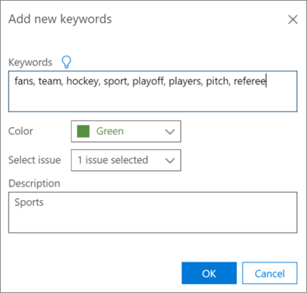

# Definir palavras-chave destacadas e opções avançadas na Descoberta Eletrônica Avançada do Office 365Define highlighted keywords and advanced options in Office 365 Advanced eDiscovery

> [!NOTE]
> EDiscovery Avançado requer um Office 365 E3 com o complemento de conformidade avançadas ou uma assinatura E5 para sua organização. Se você não tiver que plano e quiser tentar eDiscovery avançado, você pode [inscrever-se para uma avaliação do Office 365 Enterprise E5](https://go.microsoft.com/fwlink/p/?LinkID=698279).Advanced eDiscovery requires an Office 365 E3 with the Advanced Compliance add-on or an E5 subscription for your organization. If you don't have that plan and want to try Advanced eDiscovery, you can [sign up for a trial of Office 365 Enterprise E5](https://go.microsoft.com/fwlink/p/?LinkID=698279). 
  
No Advanced eDiscovery, é possível adicionar palavras-chave definidas pelo usuário a relevância para ajudá-lo a identificar arquivos relevantes durante a marcação. Palavras-chave serão exibidas nas cores especificadas no **relevância \> marca**.In Advanced eDiscovery, it's possible to add user-defined keywords to Relevance in order to help you identify relevant files while tagging. Keywords will be displayed in the specified colors in **Relevance \> Tag**. 
  
Conforme descrito abaixo, listas de palavra-chave podem ser adicionadas, e as cores atribuídas para a lista de palavras-chave e os problemas relacionados. Uma dica de ferramenta exibe descrição da palavra-chave, se houver, conforme indicado pelo sublinhado duplo.As described below, keyword lists can be added, and colors assigned to the Keywords list and the related issues. A tooltip displays the keyword's description, if one exists, as indicated by a double underline.
  
> [!IMPORTANT]
> Exibição de palavra-chave e realce na relevância ocorrências de visitas aos resultados dentro de documentos durante a relevância de marcação não funciona para os conjuntos de caracteres de byte duplo japonês, chinês e coreano.Hit highlighting in Relevance and viewing keyword hit results within documents during Relevance tagging does not work for the Japanese, Chinese, and Korean double-byte character sets. 
  
## Adicionando palavras-chave realçadasAdding highlighted keywords

1. No **relevância \> instalação relevância** guia, selecione **destaques as palavras-chave**.In the **Relevance \> Relevance setup** tab, select **Highlighted keywords**.
    
2. Clique no **+** ícone para adicionar palavras-chave. A caixa de diálogo **Adicionar novas palavras-chave** é exibida.Click the **+** icon to add keywords. The **Add new keywords** dialog is displayed. 
    
3. No **palavras-chave**, digite a lista de palavras-chave, separando palavras-chave por vírgulas.In **Keywords**, type the keywords list, separating keywords with commas. 
    
4. Na lista de **cor** , selecione a cor para realçar a lista de palavras-chave inseridas.In the **Color** list, select the color to highlight the entered keywords list. 
    
5. Na lista **Selecione o problema** , selecione se deseja aplicar a lista de palavras-chave para "Todos os problemas" ou problemas selecionados.In the **Select issue** list, select whether to apply the keywords list to "All issues" or to selected issues. 
    
6. Em **Descrição**, digite a lista de palavras-chave (opcional).In **Description**, type the keywords list (optional).
    
    
  
7. Clique em **Okey** quando terminar. A lista criada é adicionada à tabela de lista de palavras-chave e pode ser editada ou excluída.Click **OK** when done. The created list is added to the keywords list table and can be edited or deleted. 
    
    
  
As palavras-chave definidas pelo usuário serão exibidas, em que as cores especificadas na relevância \> marca.The user-defined keywords will be displayed, in the specified colors in Relevance \> Tag. 
  
## Instalação de relevância Especifica configurações avançadaSpecifying Relevance setup advanced settings

Essas configurações afetam os gráficos Track e decidir na relevância.These settings affect the Track and Decide graphs in Relevance.
  
1. No **relevância \> instalação relevância** guia, selecione **Configurações avançadas**.In the **Relevance \> Relevance setup** tab, select **Advanced settings**.
    
2. Na caixa de diálogo **parâmetros de custo** , faça as seguintes seleções:In the **Cost parameters** dialog, make the following selections: 
    
1. Na lista de **custo revisão por hora ($)** , selecione a quantidade em dólares ou aceite o padrão.In the **Cost review per hour ($)** list, select the amount in dollars or accept the default. 
    
2. Na lista **número de arquivos seja revisada por hora** , selecione a quantidade ou aceite o padrão.In the **Number of files reviewed by hour** list, select the amount or accept the default. 
    
    
  
3. Clique em **Salvar**. As configurações selecionadas são salvas.Click **Save**. The selected settings are saved.
    
## Confira tambémSee also

[Descoberta Eletrônica Avançada do Office 365Office 365 Advanced eDiscovery](office-365-advanced-ediscovery.md)
  
[Definindo os problemas e como atribuir usuáriosDefining issues and assigning users](define-issues-and-assign-users.md)
  
[Configurando cargas para adicionar os arquivos importadosSetting up loads to add imported files](set-up-loads-to-add-imported-files.md)

