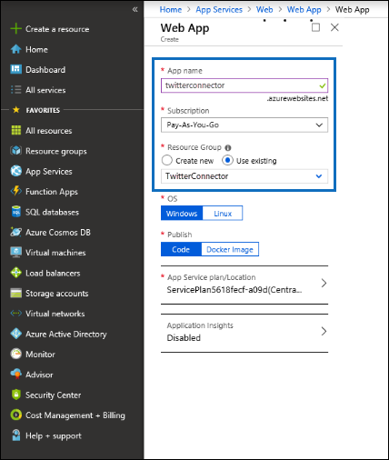
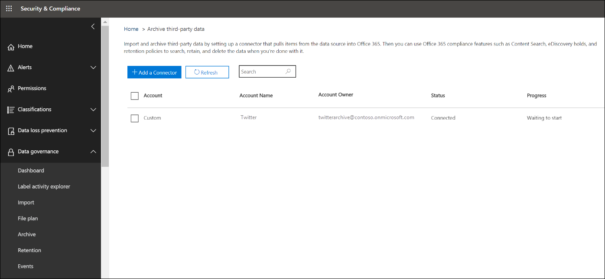

# Implantar um conector para arquivar dados do Twitter no Office 365

Este artigo contém o processo passo a passo para implantar um conector que usa o serviço de importação do Office 365 para importar dados da conta do Twitter da sua organização para o Office 365. Para obter uma visão geral de alto nível desse processo e uma lista de pré-requisitos necessários para implantar um conector do Twitter, consulte [usar um conector de exemplo para arquivar dados do Twitter no Office 365 (versão prévia)](archive-twitter-data-with-sample-connector.md). 

## Etapa 1: baixar o pacote

Baixe o pacote pré-criado da seção liberar no repositório do GitHub em [https://github.com/microsoft/m365-sample-twitter-connector-csharp-aspnet/releases](https://github.com/microsoft/m365-sample-twitter-connector-csharp-aspnet/releases). Na versão mais recente, baixe o arquivo zip chamado **SampleConnector. zip**. Você carregará este arquivo zip no Azure na etapa 4.

## Etapa 2: criar um aplicativo no Azure Active Directory

1. Vá para <https://portal.azure.com> e entre usando as credenciais de uma conta de administrador global do Office 365.

   

2. No painel de navegação esquerdo, clique em **Azure Active Directory**.

   

3. No painel de navegação esquerdo, clique em **registros de aplicativo (visualização)** e clique em **novo registro**.

   

4. Registre o aplicativo. Em **URI de redirecionamento (opcional)**, selecione Web na lista suspensa tipo de aplicativo <https://portal.azure.com> e digite a caixa para o URI.

   

5. Copie a ID de **aplicativo (cliente)** e a ID de **diretório (locatário)** e salve-as em um arquivo de texto ou outro local seguro. Você usará essas IDs nas etapas posteriores.

    

6. Vá até **certificados & segredos do novo aplicativo** e, em **segredos do cliente** , clique em **novo segredo do cliente**.

   

7. Criar um novo segredo. Na caixa Descrição, digite o segredo e, em seguida, escolha um período de expiração. 

   

8. Copie o valor do segredo e salve-o em um arquivo de texto ou outro local de armazenamento. Este é o segredo do aplicativo AAD que você vai usar nas etapas posteriores.

   

9. Vá para **manifesto** e copie o identifieruris agora (que também é chamado de URI do aplicativo AAD) como realçado na captura de tela a seguir. Copie o URI do aplicativo AAD para um arquivo de texto ou outro local de armazenamento. Você o usará na etapa 6.

    

## Etapa 3: criar uma conta de armazenamento do Azure

1.  Vá para a home page do Azure para sua organização.

    

2. Clique em **criar um recurso** e digite a **conta de armazenamento** na caixa de pesquisa.

   

3. Clique em **armazenamento**e, em seguida, clique em **conta de armazenamento**.

   

4. Na página **criar conta de armazenamento** , na caixa assinatura, selecione **pagar como você** ou **avaliação gratuita** , dependendo do tipo de assinatura do Azure que você tem. 

   

5. Selecione ou crie um grupo de recursos.

   

6. Digite um nome para a conta de armazenamento.

   

7. Revise e clique em **criar** para criar a conta de armazenamento.

   

8. Após alguns momentos, clique em **Atualizar** e clique em **ir para recurso** para navegar até a conta de armazenamento.

   

9. Clique em **teclas de acesso** no painel de navegação esquerdo.

   

10. Copie uma **cadeia de caracteres de conexão** e salve-a em um arquivo de texto ou outro local de armazenamento. Você o usará ao criar um recurso do aplicativo Web na etapa 4.

    

## Etapa 4: criar um novo recurso do aplicativo Web no Azure

1. Na **Home** Page do portal do Azure, clique em **criar um recurso \> para \> todos os aplicativos Web**. Na página **Web App** , clique em **criar**.

   

2. Preencha os detalhes (conforme mostrado abaixo) e, em seguida, crie o aplicativo Web. Observe que o nome inserido na caixa nome do **aplicativo** será usado para criar a URL do serviço de aplicativo do Azure; por exemplo twitterconnector.azurewebsites.net.

   

3. Vá para o recurso aplicativo Web recém-criado, clique em **configurações do aplicativo** no painel de navegação esquerdo. Em **configurações do aplicativo**, clique em **Adicionar nova configuração** e adicione as três configurações a seguir. Use os valores (que você copiou para o arquivo de texto das etapas anteriores): 

    - **APISecretKey** – você pode digitar qualquer valor como o segredo. Isso será usado para acessar o aplicativo Web do conector na etapa 7.

    - **StorageAccountConnectionString** – o URI da cadeia de caracteres de conexão que você copiou após a criação da conta de armazenamento do Azure na etapa 3.

    - **tenantid** – a ID do locatário de sua organização do Office 365 que você copiou depois de criar o aplicativo do conector do Twitter no Azure Active Directory na etapa 2.

    

4. Em **configurações gerais**, clique **em** ao lado de **sempre ligado**. Clique em **salvar** na parte superior da página para salvar as configurações do aplicativo.

   

5. A etapa final é carregar o código-fonte do aplicativo conector para o Azure que você baixou na etapa 1. Em um navegador da Web, vá para<AzureAppResourceName>https://. SCM.azurewebsites.net/ZipDeployUi. Por exemplo, se o nome do seu recurso de aplicativo do Azure (que você nomeou na etapa 2 nesta seção) for **twitterconnector**, vá para https://twitterconnector.scm.azurewebsites.net/ZipDeployUi.

6. Arraste e solte o SampleConnector. zip (que você baixou na etapa 1) para esta página. Após o carregamento dos arquivos e a implantação ter êxito, a página será semelhante à captura de tela a seguir.

   

## Etapa 5: criar o aplicativo Twitter

1. Vá para https://developer.twitter.com, faça logon usando as credenciais da conta de desenvolvedor da sua organização e clique em **aplicativos**.

   
2. Clique em **criar um aplicativo**.
   
   

3. Em **detalhes do aplicativo**, adicione informações sobre o aplicativo.

   

4. No painel de desenvolvedor do Twitter, selecione o aplicativo que você acabou de criar e copie a ID do aplicativo que é exibida e salve-a em um arquivo de texto ou outro local de armazenamento. Em seguida, clique em **detalhes**.
   
   

5. Na guia **chaves e tokens** , em **chaves da API do consumidor** , copie a chave secreta da API e salve-a em um arquivo de texto ou outro local de armazenamento. Em seguida, clique em **criar** para gerar um token de acesso e um segredo de token de acesso e copie-os para um arquivo de texto ou outro local de armazenamento.
   
   

   Em seguida, clique em **criar** para gerar um token de acesso e um segredo de token de acesso e copie-os para um arquivo de texto ou outro local de armazenamento.

6. Clique na guia **permissões** e configure as permissões conforme mostrado na captura de tela a seguir:

   

7. Após salvar as configurações de permissão, clique na guia **detalhes do aplicativo** e, em seguida, clique em **Editar > editar detalhes**.

   

8. Execute as seguintes tarefas:

   - Marque a caixa de seleção para permitir que o aplicativo conector entre no Twitter.
   
   - Adicione o URI de redirecionamento OAuth usando o seguinte formato: ** \<connectorserviceuri>/views/TwitterOAuth**, onde o valor de *connectorserviceuri* é a URL do serviço de aplicativo do Azure para sua organização; por exemplo https://twitterconnector.azurewebsites.net/Views/TwitterOAuth.

   

O aplicativo de desenvolvedor do Twitter agora está pronto para uso.

## Etapa 6: configurar o aplicativo Web do conector 

1. Vá para https://\<AzureAppResourceName>. azurewebsites. net (onde **AzureAppResourceName** é o nome do seu recurso do aplicativo do Azure que você nomeou na etapa 4) por exemplo, se o nome for **twitterconnector**, vá para https://twitterconnector.azurewebsites.net. A home page do aplicativo se parecerá com a captura de tela a seguir.

   

2. Clique em **Configurar** para exibir uma página de entrada.

   

3. Na caixa ID do locatário, digite ou cole sua ID de locatário (que você obteve na etapa 2). Na caixa senha, digite ou cole o APISecretKey (que você obteve na etapa 2) e clique em **definir definições de configuração** para exibir a página **detalhes da configuração** .

   

4. Em **detalhes da configuração**, insira as seguintes definições de configuração 

   - **Chave de API do Twitter** -a ID do aplicativo do aplicativo Twitter que você criou na etapa 5.
   - **Chave secreta de API do Twitter** – a chave secreta da API do aplicativo Twitter que você criou na etapa 5.
   - **Token de acesso do Twitter** -o token de acesso que você criou na etapa 5.
   - **Segredo do token de acesso do Twitter** -o segredo do token de acesso que você criou na etapa 5.
   - **ID do aplicativo AAD** -a ID do aplicativo para o aplicativo do Azure Active Directory que você criou na etapa 2
   - **Sigilo de aplicativo do AAD** -o valor para o segredo APISecretKey que você criou na etapa 4.
   - **URI do aplicativo AAD** -o URI do aplicativo AAD obtido na etapa 2; por exemplo, https://microsoft.onmicrosoft.com/2688yu6n-12q3-23we-e3ee-121111123213.
   - **Chave** de instrumentação do App insights-deixe esta caixa em branco.

5. Clique em **salvar** para salvar as configurações do conector.

## Etapa 7: configurar um conector personalizado no centro de conformidade e segurança

1.  Vá para <https://protection.office.com> e, em seguida, clique em **arquivar importação \> \> de governança de dados dados de terceiros**.

    

2. Clique em **Adicionar um conector** e, em seguida, clique em **Twitter**.

   

3. Na página **Adicionar aplicativo do conector** , digite as informações a seguir e clique em **validar conector**.

    - Na primeira caixa, digite um nome para o conector, como **Twitter**.
    - Na segunda caixa, digite ou cole o valor do APISecretKey que você adicionou na etapa 4.
    - Na terceira caixa, digite ou cole a URL do serviço de aplicativo do Azure; por exemplo **https://twitterconnector.azurewebsites.net**.

   Depois que o conector for validado com êxito, clique em **Avançar**.

   

4. Clique em **login com o aplicativo do conector**.

   

5. Digite ou cole o APISecretKey novamente e, em seguida, clique em **login to Connector Service**.

   

6. Clique em **continuar com o Twitter**.

7. Na página de entrada do Twitter, entre usando as credenciais da conta da conta do Twitter da sua organização.

   

   Depois que você entrar, a página do Twitter exibirá a seguinte mensagem, "trabalho do conector do Twitter configurado com êxito".

8. Clique em **concluir** para concluir a configuração do conector do Twitter.

9. Na página **definir filtros** , você pode aplicar um filtro para importar (e arquivar) itens que são uma determinada idade. Clique em **Avançar**.

   

10. Na página **definir conta de armazenamento** , selecione a caixa de correio do Office 365 para a qual os itens do Twitter serão importados.

    

11. Revise suas configurações e clique em **concluir** para concluir a instalação do conector no centro de conformidade do _AMP_ de segurança.

    

    

12. Vá para a página **arquivar dados** de terceiros para ver o andamento do processo de importação.

    
