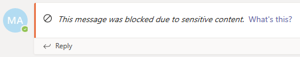

# Prevenção de perda de dados e Microsoft Teams

> [!NOTE]
> Os recursos de prevenção contra perda de dados foram recentemente adicionados às mensagens de chat e de canal do Microsoft Teams para usuários licenciados para a conformidade avançada do Office 365, que está disponível como uma opção autônoma e está incluído no Office 365 E5 e no Microsoft 365 E5 conformidade. Para saber mais sobre requisitos de licenciamento, confira [diretrizes de licenciamento de serviços em nível de locatário do Microsoft 365](https://docs.microsoft.com/office365/servicedescriptions/microsoft-365-service-descriptions/microsoft-365-tenantlevel-services-licensing-guidance).

## Visão geral da DLP para o Microsoft Teams

Recentemente, os recursos de DLP ( [prevenção contra perda de dados](data-loss-prevention-policies.md) ) foram estendidos para incluir mensagens de chat e de canal do Microsoft Teams. Se sua organização tem DLP, agora você pode definir políticas que impedem que as pessoas compartilhem informações confidenciais em um canal do Microsoft Teams ou em uma sessão de chat. Estes são alguns exemplos de como essa proteção funciona:

- **Exemplo 1: protegendo informações confidenciais em mensagens**. Suponha que alguém tente compartilhar informações confidenciais em um chat de equipes ou canal com convidados (usuários externos). Se você tiver uma política de DLP definida para evitar isso, as mensagens com informações confidenciais enviadas a usuários externos serão excluídas. Isso ocorre automaticamente e, em segundos, de acordo com o modo como sua política de DLP é configurada.

    > [!NOTE]
    > O DLP para o Microsoft Teams bloqueia conteúdo confidencial quando compartilhado com usuários do Microsoft Teams que têm: - [acesso de convidados](https://docs.microsoft.com/MicrosoftTeams/guest-access) em equipes e canais; ou - [acesso externo](https://docs.microsoft.com/MicrosoftTeams/manage-external-access) em sessões de chat e reuniões. 
A DLP para sessões de chat externas só funcionará se o remetente e o receptor estiverem no modo somente Teams e o uso da [Federação nativa do Microsoft Teams](https://docs.microsoft.com/microsoftteams/manage-external-access). O DLP para Teams não bloqueia mensagens  em interoperabilidade com o Skype for Business ou sessões de chat federadas não nativas.

- **Exemplo 2: protegendo informações confidenciais em documentos**. Suponha que alguém tente compartilhar um documento com convidados em um canal ou chat do Microsoft Teams, e o documento contém informações confidenciais. Se você tiver uma política de DLP definida para evitar isso, o documento não será aberto para esses usuários. Observe que, nesse caso, sua política de DLP deve incluir o SharePoint e o OneDrive para que a proteção esteja no local. (Este é um exemplo de DLP para SharePoint que aparece no Microsoft Teams e, portanto, requer que os usuários estejam licenciados para o Office 365 DLP (incluído no Office 365 E3), mas não exija que os usuários sejam licenciados para conformidade avançada do Office 365.)

## Dicas de política ajudam a ensinar usuários

Semelhante à forma como o DLP funciona no [Exchange, no Outlook e no Outlook na Web, no](data-loss-prevention-policies.md#policy-evaluation-in-exchange-online-outlook-and-outlook-on-the-web) [SharePoint e nos sites do onedrive for Business](data-loss-prevention-policies.md#policy-evaluation-in-onedrive-for-business-and-sharepoint-online-sites)e [clientes de área de trabalho do Office](data-loss-prevention-policies.md#policy-evaluation-in-the-office-desktop-programs), as dicas de política são exibidas quando uma ação entra em conflito com uma política de DLP. Veja um exemplo de uma dica de política:

Nesse caso, o remetente tentou compartilhar um número de segurança social em um canal do Microsoft Teams. O link o **que eu posso fazer?** abre uma caixa de diálogo que fornece opções para o remetente resolver o problema. Observe que, nesse caso, o remetente pode optar por substituir a política ou notificar um administrador para revisá-la e resolvê-la.

Em sua organização, você pode escolher se deseja permitir que os usuários substituam uma política de DLP ou não. E, ao configurar suas políticas de DLP, você pode usar as dicas de política padrão ou [personalizar dicas de política](#to-customize-policy-tips) para sua organização. 

Retornando ao nosso exemplo, em que um remetente compartilhou um número de seguro social em um canal do Teams, aqui está o que o destinatário viu:

O link o **que é isto** abre um [artigo](data-loss-prevention-policies.md) sobre políticas de DLP, que ajuda a explicar por que a mensagem foi bloqueada.

### Para personalizar dicas de política

Para realizar essa tarefa, você deve receber uma função que tenha permissões para editar políticas de DLP. Para saber mais, confira [permissões](data-loss-prevention-policies.md#permissions).

1. Vá para o centro de conformidade & segurança do Office[https://protection.office.com](https://protection.office.com)365 () e entre.

2. Escolha > **política**de **prevenção contra perda de dados**. 

3. Selecione uma política e ao lado de **configurações de política**, escolha **Editar**.

4. Crie uma nova regra ou edite uma regra existente para a política.  

5. Na guia **notificações do usuário** , selecione **Personalizar o texto do email** e/ou **Personalizar as opções de texto de dica de política** .    

6. Especifique o texto que você deseja usar para notificações por email e/ou dicas de política e, em seguida, escolha **salvar**. 

7. Na guia **configurações de política** , escolha **salvar**.

Aguarde aproximadamente uma hora para que suas alterações funcionem de forma em seu data center e sincronize com as contas de usuário.
 
## Adicionar o Microsoft Teams como um local às políticas de DLP existentes

Para realizar essa tarefa, você deve receber uma função que tenha permissões para editar políticas de DLP. Para saber mais, confira [permissões](data-loss-prevention-policies.md#permissions).

1. Vá para o centro de conformidade & segurança do Office[https://protection.office.com](https://protection.office.com)365 () e entre.

2. Escolha > **política**de **prevenção contra perda de dados**. 

3. Selecione uma política e examine os valores em **locais**. Se você vir **chat de equipes e mensagens de canal**, tudo pronto. Caso contrário, clique em **Editar**.  

4. Na coluna **status** , ative a política para chat de **equipes e mensagens de canal**.  

5. Mantenha as configurações padrão de todas as contas ou especifique quais contas serão incluídas ou excluídas.

6. Clique em **Salvar**.

Aguarde aproximadamente uma hora para que suas alterações funcionem de forma em seu data center e sincronize com as contas de usuário.

## Definir uma nova política de DLP para o Microsoft Teams

Para realizar essa tarefa, você deve receber uma função que tenha permissões para editar políticas de DLP. Para saber mais, confira [permissões](data-loss-prevention-policies.md#permissions).

1. Vá para o centro de conformidade & segurança do Office[https://protection.office.com](https://protection.office.com)365 () e entre.

2. Escolha > **** política > de **prevenção contra perda de dados****+ criar uma política**. 

3. Escolha um [modelo](data-loss-prevention-policies.md#dlp-policy-templates)e, em seguida, escolha **Avançar**. No nosso exemplo, escolhemos o modelo de dados de informações de identificação pessoal dos EUA.  

4. Na guia **nomear sua política** , especifique um nome e uma descrição para a política e, em seguida, escolha **Avançar**. 

5. Na guia **escolher locais** , mantenha a configuração padrão de todos os locais ou selecione **deixe-me escolher locais específicos**e, em seguida, escolha **Avançar**. Se você optou por escolher locais específicos, selecione os locais para sua política de DLP e, em seguida, escolha **Avançar**.  
    > [!NOTE]
    > Se você quiser garantir que os documentos que contêm informações confidenciais não sejam compartilhados inadequadamente, verifique se os **sites do SharePoint** e as **contas do onedrive** estão ativados, junto com **as mensagens de chat e de canal**do teams.
 

6. Na guia **configurações de política** , em **Personalizar o tipo de conteúdo que você deseja proteger**, mantenha as configurações simples padrão ou escolha **usar configurações avançadas**e, em seguida, escolha **Avançar**. Se você escolher configurações avançadas, você pode criar ou editar regras para sua política. (Para obter ajuda com isso, consulte [configurações simples vs. configurações avançadas](data-loss-prevention-policies.md#simple-settings-vs-advanced-settings).)

7.  Na guia **configurações de política** , em **o que você deseja fazer se detectarmos informações confidenciais?**, revise as configurações. (Aqui você pode optar por manter [dicas de política padrão e notificações por email](use-notifications-and-policy-tips.md)ou personalizá-las.)  Quando terminar de revisar ou editar as configurações, escolha **Avançar**.

8. Na guia **configurações de política** , em **você deseja ativar a política ou testar as tarefas primeiro?**, escolha se deseja ativar a política, [testá-la primeiro](data-loss-prevention-policies.md#roll-out-dlp-policies-gradually-with-test-mode)ou mantê-la desativada por enquanto e, em seguida, escolha **Avançar**.  

9. Na guia **examinar suas configurações** , revise as configurações da nova política. Escolha **Editar** para fazer alterações. Quando tiver terminado, escolha **criar**. 

Aguarde aproximadamente uma hora para que sua nova política funcione de forma em seu data center e sincronize com as contas de usuário.

## Artigos relacionados

[Criar, testar e ajustar uma política DLP](create-test-tune-dlp-policy.md)

[Enviar notificações por email e mostrar dicas para políticas de DLP](use-notifications-and-policy-tips.md)
