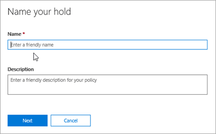
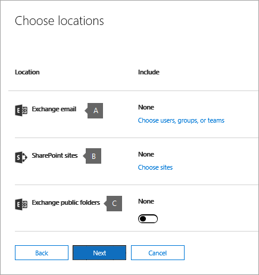

# <a name="ediscovery-cases-in-the-office-365-security-amp-compliance-center"></a><span data-ttu-id="24cf5-105">casos de descoberta eletrônica no Office 365 Security &amp; Centro de conformidade</span><span class="sxs-lookup"><span data-stu-id="24cf5-105">eDiscovery cases in the Office 365 Security &amp; Compliance Center</span></span>

<span data-ttu-id="24cf5-p102">Você pode usar os casos de eDiscovery no Office 365 Security &amp; Centro de conformidade para controlar quem pode criar, acessar e gerenciar casos do eDiscovery em sua organização. Se sua organização tiver uma assinatura do Office 365 E5, você também pode usar os casos de eDiscovery para analisar os resultados de pesquisa usando o eDiscovery avançadas do Office 365.</span><span class="sxs-lookup"><span data-stu-id="24cf5-p102">You can use eDiscovery cases in the Office 365 Security &amp; Compliance Center to control who can create, access, and manage eDiscovery cases in your organization. If your organization has an Office 365 E5 subscription, you can also use eDiscovery cases to analyze search results by using Office 365 Advanced eDiscovery.</span></span>
  
<span data-ttu-id="24cf5-p103">Um caso de eDiscovery permite que você adicionar membros a um caso, controlar que tipos de ações que membros de maiusculas específicos podem executar, colocar uma isenção em locais de conteúdo relevante a um caso jurídico e associar várias pesquisas de conteúdo um único caso. Você também pode exportar os resultados de qualquer pesquisa de conteúdo que está associado um caso ou preparar os resultados da pesquisa para análise no eDiscovery avançado. casos de eDiscovery são uma boa maneira de limitar quem tem acesso ao conteúdo de pesquisa e seus resultados de pesquisa para um caso jurídico específico em sua organização.</span><span class="sxs-lookup"><span data-stu-id="24cf5-p103">An eDiscovery case allows you to add members to a case, control what types of actions that specific case members can perform, place a hold on content locations relevant to a legal case, and associate multiple Content Searches with a single case. You can also export the results of any Content Search that is associated with a case or prepare search results for analysis in Advanced eDiscovery. eDiscovery cases are a good way to limit who has access to Content Searches and search results for a specific legal case in your organization.</span></span>
  
<span data-ttu-id="24cf5-111">Use o fluxo de trabalho a seguir para configurar e usar os casos de eDiscovery na segurança &amp; descoberta eletrônica do Centro de conformidade e Avançado.</span><span class="sxs-lookup"><span data-stu-id="24cf5-111">Use the following workflow to set up and use eDiscovery cases in the Security &amp; Compliance Center and Advanced eDiscovery.</span></span>

[<span data-ttu-id="24cf5-112">Etapa 1: atribuir permissões de Descoberta Eletrônica para possíveis membros da ocorrência</span><span class="sxs-lookup"><span data-stu-id="24cf5-112">Step 1: Assign eDiscovery permissions to potential case members</span></span>](#step-1-assign-ediscovery-permissions-to-potential-case-members)

[<span data-ttu-id="24cf5-113">Etapa 2: Criar um novo caso</span><span class="sxs-lookup"><span data-stu-id="24cf5-113">Step 2: Create a new case</span></span>](#step-2-create-a-new-case)

[<span data-ttu-id="24cf5-114">Etapa 3: Adicionar membros a um caso</span><span class="sxs-lookup"><span data-stu-id="24cf5-114">Step 3: Add members to a case</span></span>](#step-3-add-members-to-a-case)

[<span data-ttu-id="24cf5-115">Etapa 4: Local locais de conteúdo em espera</span><span class="sxs-lookup"><span data-stu-id="24cf5-115">Step 4: Place content locations on hold</span></span>](#step-4-place-content-locations-on-hold)

[<span data-ttu-id="24cf5-116">Etapa 5: Criar e executar uma pesquisa de conteúdo associados a um caso</span><span class="sxs-lookup"><span data-stu-id="24cf5-116">Step 5: Create and run a Content Search associated with a case</span></span>](#step-5-create-and-run-a-content-search-associated-with-a-case)

[<span data-ttu-id="24cf5-117">Etapa 6: Exportar os resultados de uma pesquisa de conteúdo associados a um caso</span><span class="sxs-lookup"><span data-stu-id="24cf5-117">Step 6: Export the results of a Content Search associated with a case</span></span>](#step-6-export-the-results-of-a-content-search-associated-with-a-case)

[<span data-ttu-id="24cf5-118">Etapa 7: Preparar resultados para eDiscovery avançada de pesquisa</span><span class="sxs-lookup"><span data-stu-id="24cf5-118">Step 7: Prepare search results for Advanced eDiscovery</span></span>](#step-7-prepare-search-results-for-advanced-ediscovery)

[<span data-ttu-id="24cf5-119">Etapa 8: Vá para o caso da eDiscovery avançado</span><span class="sxs-lookup"><span data-stu-id="24cf5-119">Step 8: Go to the case in Advanced eDiscovery</span></span>](#step-8-go-to-the-case-in-advanced-ediscovery)

[<span data-ttu-id="24cf5-120">(Opcional) Etapa 9: Fechar um caso</span><span class="sxs-lookup"><span data-stu-id="24cf5-120">(Optional) Step 9: Close a case</span></span>](#optional-step-9-close-a-case)

[<span data-ttu-id="24cf5-121">(Opcional) Etapa 10: Reabrir uma ocorrência fechada</span><span class="sxs-lookup"><span data-stu-id="24cf5-121">(Optional) Step 10: Re-open a closed case</span></span>](#optional-step-10-re-open-a-closed-case)

[<span data-ttu-id="24cf5-122">Mais informações</span><span class="sxs-lookup"><span data-stu-id="24cf5-122">More information</span></span>](#more-information)
  
## <a name="step-1-assign-ediscovery-permissions-to-potential-case-members"></a><span data-ttu-id="24cf5-123">Etapa 1: atribuir permissões de Descoberta Eletrônica para possíveis membros da ocorrência</span><span class="sxs-lookup"><span data-stu-id="24cf5-123">Step 1: Assign eDiscovery permissions to potential case members</span></span>

<span data-ttu-id="24cf5-p104">A primeira etapa é atribuir as permissões apropriadas de descoberta eletrônica relacionados a pessoas, portanto, você poderá adicioná-los a um caso de descoberta eletrônica na etapa 2. Você precisa ser membro do grupo de funções de gerenciamento da organização (ou a ser atribuído à função de gerenciamento de função) no Office 365 Security &amp; Centro de conformidade para atribuir permissões de descoberta eletrônica. A lista a seguir descreve os grupos de função relacionadas a descoberta eletrônica na segurança &amp; Centro de conformidade.</span><span class="sxs-lookup"><span data-stu-id="24cf5-p104">The first step is to assign the appropriate eDiscovery-related permissions to people so you can add them to an eDiscovery case in Step 2. You have to be a member of the Organization Management role group (or be assigned the Role Management role) in the Office 365 Security &amp; Compliance Center to assign eDiscovery permissions. The following list describes the eDiscovery-related role groups in the Security &amp; Compliance Center.</span></span>
  
- <span data-ttu-id="24cf5-p105">**Revisor** - este grupo de funções tem as permissões mais restritivas de descoberta eletrônica relacionados. Os membros desse grupo só podem ver e abrir a lista dos casos na página de **Descoberta eletrônica** na segurança &amp; Centro de conformidade que eles são membros. Eles não podem criar casos, adicionar membros a um caso, criar pausas, criar pesquisas, exportar resultados da pesquisa ou preparar os resultados para eDiscovery avançado. No entanto, os membros podem acessar casos de eDiscovery avançado para executar tarefas de análise.</span><span class="sxs-lookup"><span data-stu-id="24cf5-p105">**Reviewer** - This role group has the most restrictive eDiscovery-related permissions. Members of this group can only see and open the list of the cases on the **eDiscovery** page in the Security &amp; Compliance Center that they are members of. They can't create cases, add members to a case, create holds, create searches, export search results, or prepare results for Advanced eDiscovery. However, members can access cases in Advanced eDiscovery to perform analysis tasks.</span></span> 
    
- <span data-ttu-id="24cf5-p106">**gerente de descoberta eletrônica** - membros desse grupo de função pode criar e gerenciar casos do eDiscovery. Eles podem adicionar e remover membros, colocar conteúdo locais em espera, criar e editar pesquisas de conteúdo associados a um caso, exportar os resultados de uma pesquisa de conteúdo e preparar os resultados da pesquisa para análise no eDiscovery avançado. Existem dois subgrupos nesse grupo de função. A diferença entre esses subgrupos baseia-se em escopo.</span><span class="sxs-lookup"><span data-stu-id="24cf5-p106">**eDiscovery Manager** - Members of this role group can create and manage eDiscovery cases. They can add and remove members, place content locations on hold, create and edit Content Searches associated with a case, export the results of a Content Search, and prepare search results for analysis in Advanced eDiscovery. There are two sub-groups in this role group. The difference between these subgroups is based on scope.</span></span>
    
  - <span data-ttu-id="24cf5-p107">**gerente de descoberta eletrônica** - pode exibir e gerenciar os casos de eDiscovery que eles criam ou serão um membro do. Se outra eDiscovery Manager cria um caso, mas não adiciona um segundo eDiscovery Manager como membro desse caso, a segunda eDiscovery Manager não será possível exibir ou abra a ocorrência na página de **Descoberta eletrônica** na segurança &amp; Centro de conformidade. Gerentes de descoberta eletrônica também pode acessar seus casos de eDiscovery avançado para executar tarefas de análise.</span><span class="sxs-lookup"><span data-stu-id="24cf5-p107">**eDiscovery Manager** - Can view and manage the eDiscovery cases they create or are a member of. If another eDiscovery Manager creates a case but doesn't add a second eDiscovery Manager as a member of that case, the second eDiscovery Manager won't be able to view or open the case on the **eDiscovery** page in the Security &amp; Compliance Center. eDiscovery Managers can also access their cases in Advanced eDiscovery to perform analysis tasks.</span></span> 
    
  - <span data-ttu-id="24cf5-p108">**administrador de descoberta eletrônica** - pode executar todas as tarefas de gerenciamento de casos que pode ser feito por uma gerente de descoberta eletrônica. Além disso, um administrador de eDiscovery pode:</span><span class="sxs-lookup"><span data-stu-id="24cf5-p108">**eDiscovery Administrator** - Can perform all case management tasks that an eDiscovery Manager can do. Additionally, an eDiscovery Administrator can:</span></span>
    
    - <span data-ttu-id="24cf5-140">Exibir todas as ocorrências listadas na página **Descoberta Eletrônica**.</span><span class="sxs-lookup"><span data-stu-id="24cf5-140">View all cases that are listed on the **eDiscovery** page.</span></span> 
    
    - <span data-ttu-id="24cf5-141">Depois que eles adicionam-se como um membro do caso, gerencie qualquer caso de descoberta eletrônica na organização.</span><span class="sxs-lookup"><span data-stu-id="24cf5-141">Manage any eDiscovery case in the organization after they add themself as a member of the case.</span></span>
    
    - <span data-ttu-id="24cf5-p109">Execute tarefas administrativas no eDiscovery avançado, como processamento de dados casos para análise, definindo configurações de maiusculas e exportando dados do eDiscovery avançado. Isso ocorre porque uma pessoa que é um administrador na segurança de descoberta eletrônica &amp; Centro de conformidade é adicionado automaticamente como um administrador no eDiscovery avançado.</span><span class="sxs-lookup"><span data-stu-id="24cf5-p109">Perform administrative tasks in Advanced eDiscovery, such as processing case data for analysis, configuring case settings, and exporting data from Advanced eDiscovery. This is because a person who is an eDiscovery Administrator in the Security &amp; Compliance Center is automatically added as an administrator in Advanced eDiscovery.</span></span>
    
    <span data-ttu-id="24cf5-144">Consulte a seção [More information](ediscovery-cases.md#moreinfo_1) para conhecer os motivos pelos quais convém ter um Administrador de Descoberta Eletrônica em sua organização.</span><span class="sxs-lookup"><span data-stu-id="24cf5-144">See the [More information](ediscovery-cases.md#moreinfo_1) section for reasons why you may want an eDiscovery Administrator in your organization.</span></span> 
    
> [!IMPORTANT]
> <span data-ttu-id="24cf5-145">Se uma pessoa não for um membro de um desses grupos de função relacionadas a descoberta eletrônica ou não é um membro de um grupo de função que atribuiu a função de revisor, você não pode adicioná-los como um membro de um caso de eDiscovery.</span><span class="sxs-lookup"><span data-stu-id="24cf5-145">If a person isn't a member of one of these eDiscovery-related role groups, or isn't a member of a role group that's assigned the Reviewer role, you can't add them as a member of an eDiscovery case.</span></span> 
  
 <span data-ttu-id="24cf5-146">**Para atribuir as permissões de Descoberta Eletrônica:**</span><span class="sxs-lookup"><span data-stu-id="24cf5-146">**To assign eDiscovery permissions:**</span></span>
  
1. <span data-ttu-id="24cf5-147">Acesse [https://protection.office.com](https://protection.office.com).</span><span class="sxs-lookup"><span data-stu-id="24cf5-147">Go to [https://protection.office.com](https://protection.office.com).</span></span>
    
2. <span data-ttu-id="24cf5-148">Entrar no Office 365 usando sua conta do trabalho ou da escola.</span><span class="sxs-lookup"><span data-stu-id="24cf5-148">Sign in to Office 365 using your work or school account.</span></span>
    
3. <span data-ttu-id="24cf5-149">Na segurança &amp; Centro de conformidade, clique em **permissões**e, em seguida, siga um destes procedimentos com base nas permissões de eDiscovery que você deseja atribuir.</span><span class="sxs-lookup"><span data-stu-id="24cf5-149">In the Security &amp; Compliance Center, click **Permissions**, and then do one of the following based on the eDiscovery permissions that you want to assign.</span></span>
    
    - <span data-ttu-id="24cf5-p110">Para atribuir permissões de revisor, selecione o grupo de funções do **Revisor** e, ao lado de **membros**, clique em **Editar**. Clique em **Escolher membros**, clique em **Editar**, clique em  **Adicionar**, selecione o usuário que você deseja adicionar ao grupo de função revisor e, em seguida, clique em **Adicionar**.</span><span class="sxs-lookup"><span data-stu-id="24cf5-p110">To assign Reviewer permissions, select the **Reviewer** role group, and then next to **Members**, click **Edit**. Click **Choose members**, click **Edit**, click  **Add**, select the user that you want to add to the Reviewer role group, and then click **Add**.</span></span>
    
    - <span data-ttu-id="24cf5-p111">Para atribuir permissões de gerente de descoberta eletrônica, selecione o grupo de função de **gerente de descoberta eletrônica** e, ao lado de **eDiscovery Manager**, clique em **Editar**. Clique em **Escolher eDiscovery Manager**, clique em **Editar**, clique em  \* \* Add \* \*, selecione o usuário que você deseja adicionar como uma gerente de descoberta eletrônica e, em seguida, clique em **Adicionar**.</span><span class="sxs-lookup"><span data-stu-id="24cf5-p111">To assign eDiscovery Manager permissions, select the **eDiscovery Manager** role group, and then next to **eDiscovery Manager**, click **Edit**. Click **Choose eDiscovery Manager**, click **Edit**, click  \*\* Add \*\*, select the user that you want to add as an eDiscovery Manager, and then click **Add**.</span></span>
    
    - <span data-ttu-id="24cf5-p112">Para atribuir permissões de administrador de descoberta eletrônica, selecione o grupo de função de **gerente de descoberta eletrônica** e, ao lado de **Descoberta eletrônica de administrador**, clique em **Editar**. Clique em **Escolher eDiscovery administrador**, clique em **Editar**, clique em  **Adicionar**, selecione o usuário que você deseja adicionar como uma administrador de descoberta eletrônica e, em seguida, clique em **Adicionar**.</span><span class="sxs-lookup"><span data-stu-id="24cf5-p112">To assign eDiscovery Administrator permissions, select the **eDiscovery Manager** role group, and then next to **eDiscovery Administrator**, click **Edit**. Click **Choose eDiscovery Administrator**, click **Edit**, click  **Add**, select the user that you want to add as an eDiscovery Administrator, and then click **Add**.</span></span>
    
4. <span data-ttu-id="24cf5-156">Após ter adicionado todos os usuários, clique em **concluído**, clique em **Salvar** para salvar as alterações ao grupo de funções e, em seguida, clique em **Fechar**.</span><span class="sxs-lookup"><span data-stu-id="24cf5-156">After you've added all the users, click **Done**, click **Save** to save the changes to the role group, and then click **Close**.</span></span>

## <a name="step-2-create-a-new-case"></a><span data-ttu-id="24cf5-157">Etapa 2: Criar um novo caso</span><span class="sxs-lookup"><span data-stu-id="24cf5-157">Step 2: Create a new case</span></span>

<span data-ttu-id="24cf5-p113">A próxima etapa é criar um novo caso de descoberta eletrônica. Você deve ser um membro do grupo de função de gerenciadores de descoberta eletrônica para criar casos de eDiscovery. Como previamente explicado, depois de criar um novo caso na segurança &amp; Centro de conformidade, você (e outros membros maiusculas) será capazes de acesso que o mesmo caso no eDiscovery avançado, se você estiver organização tem uma assinatura do Office 365 E5.</span><span class="sxs-lookup"><span data-stu-id="24cf5-p113">The next step is to create a new eDiscovery case. You must be a member of the eDiscovery Managers role group to create eDiscovery cases. As previously explained, after you create a new case in the Security &amp; Compliance Center, you (and other case members) will be able to access that same case in Advanced eDiscovery if you're organization has an Office 365 E5 subscription.</span></span>
  
1. <span data-ttu-id="24cf5-161">Acesse [https://protection.office.com](https://protection.office.com).</span><span class="sxs-lookup"><span data-stu-id="24cf5-161">Go to [https://protection.office.com](https://protection.office.com).</span></span>
    
2. <span data-ttu-id="24cf5-162">Entrar no Office 365 usando sua conta do trabalho ou da escola.</span><span class="sxs-lookup"><span data-stu-id="24cf5-162">Sign in to Office 365 using your work or school account.</span></span>
    
3. <span data-ttu-id="24cf5-163">Na segurança &amp; Centro de conformidade, clique em **pesquisa &amp; investigação** \> **eDiscovery**e clique  **criar um caso**.</span><span class="sxs-lookup"><span data-stu-id="24cf5-163">In the Security &amp; Compliance Center, click **Search &amp; investigation** \> **eDiscovery**, and then click  **Create a case**.</span></span>
    
4. <span data-ttu-id="24cf5-p114">Na página **Novo caso** , nomeie o caso, digite uma descrição opcional e clique em **Salvar**. Observe que o nome de maiusculas deve ser exclusivo na sua organização.</span><span class="sxs-lookup"><span data-stu-id="24cf5-p114">On the **New Case** page, give the case a name, type an optional description, and then click **Save**. Note that the case name must be unique in your organization.</span></span>
    
    
  
    <span data-ttu-id="24cf5-p115">O novo caso é exibido na lista de casos na página de **Descoberta eletrônica** . Observe que você pode posicionar o cursor sobre um nome de maiusculas para exibir informações sobre o caso, incluindo o status do caso ( **ativo** ou **fechado**), a descrição da ocorrência (que foi criada na etapa anterior), e quando o caso foi alterado pela última e quem alterou.</span><span class="sxs-lookup"><span data-stu-id="24cf5-p115">The new case is displayed in the list of cases on the **eDiscovery** page. Note that you can hover the cursor over a case name to display information about the case, including the status of the case ( **Active** or **Closed**), the description of the case (that was created in the previous step), and when the case was changed last and who changed it.</span></span>
    
    > [!TIP]
    > <span data-ttu-id="24cf5-p116">Depois de criar um novo caso, você poderá renomeá-lo a qualquer momento. Basta clicar no nome da ocorrência na página de **Descoberta eletrônica** . Na página **Gerenciar neste caso** submenu, alterar o nome exibido na caixa em **nome**e, em seguida, salvar as alterações.</span><span class="sxs-lookup"><span data-stu-id="24cf5-p116">After you create a new case, you can rename it anytime. Just click the name of the case on the **eDiscovery** page. On the **Manage this case** flyout page, change the name displayed in the box under **Name**, and then save the change.</span></span> 
  
## <a name="step-3-add-members-to-a-case"></a><span data-ttu-id="24cf5-172">Etapa 3: Adicionar membros a um caso</span><span class="sxs-lookup"><span data-stu-id="24cf5-172">Step 3: Add members to a case</span></span>

<span data-ttu-id="24cf5-p117">Depois de criar um novo caso, a próxima etapa é adicionar membros ao caso. Anterior conforme explicado, somente os usuários que são membros do revisor ou grupos de função de gerente de descoberta eletrônica podem ser adicionados como membros do caso. Observe que o gerente que criou o caso de descoberta eletrônica é adicionada automaticamente como um membro.</span><span class="sxs-lookup"><span data-stu-id="24cf5-p117">After you create a new case, the next step is to add members to the case. As previous explained, only users who are members of the Reviewer or eDiscovery Manager role groups can be added as members of the case. Note that the eDiscovery Manager who created the case is automatically added as a member.</span></span>
  
1. <span data-ttu-id="24cf5-176">No Centro de Conformidade e Segurança, clique em **Pesquisa e investigação** \> **Descoberta Eletrônica** para exibir a lista de casos na sua organização.</span><span class="sxs-lookup"><span data-stu-id="24cf5-176">In the Security &amp; Compliance Center, click **Search &amp; investigation** \> **eDiscovery** to display the list of cases in your organization.</span></span> 
    
2. <span data-ttu-id="24cf5-177">Clique no nome do que você deseja adicionar membros ao caso.</span><span class="sxs-lookup"><span data-stu-id="24cf5-177">Click the name of the case that you want to add members to.</span></span>
    
    <span data-ttu-id="24cf5-178">A página de submenu **Gerenciar neste caso** é exibida.</span><span class="sxs-lookup"><span data-stu-id="24cf5-178">The **Manage this case** flyout page is displayed.</span></span> 
    
    
  
3. <span data-ttu-id="24cf5-180">Em **Gerenciar membros**, clique em  **Add** para adicionar membros ao caso.</span><span class="sxs-lookup"><span data-stu-id="24cf5-180">Under **Manage members**, click  **Add** to add members to the case.</span></span> 
    
    <span data-ttu-id="24cf5-p118">Você também pode optar por adicionar um grupo de funções ao caso. Em **Gerenciar grupos de função**, clique em  **Add**.</span><span class="sxs-lookup"><span data-stu-id="24cf5-p118">You can also choose to add a role group to the case. Under **Manage role groups**, click  **Add**.</span></span>
    
    > [!NOTE]
    > <span data-ttu-id="24cf5-p119">Controle de grupos de função quem pode atribuir membros a um caso de eDiscovery. Isso significa que você só pode atribuir os grupos de função que você é um membro da um caso.</span><span class="sxs-lookup"><span data-stu-id="24cf5-p119">Role groups control who can assign members to an eDiscovery case. That means you can only assign the role groups that you are a member of to a case.</span></span>
    
4. <span data-ttu-id="24cf5-185">Na lista de grupos de pessoas ou função que podem ser adicionados como membros do caso, clique em caixa de seleção ao lado dos nomes dos grupos de pessoas ou a função que você deseja adicionar.</span><span class="sxs-lookup"><span data-stu-id="24cf5-185">In the list of people or role groups that can be added as members of the case, click the check box next to the names of the people or role groups that you want to add.</span></span>
    
    > [!TIP]
    > <span data-ttu-id="24cf5-186">Se você tiver uma grande lista de pessoas que podem adicionadas como membros, use a caixa **Pesquisar** para procurar uma pessoa específica na lista.</span><span class="sxs-lookup"><span data-stu-id="24cf5-186">If you have a large list of people who can added as members, use the **Search** box to search for a specific person in the list.</span></span> 
  
5. <span data-ttu-id="24cf5-187">Depois de selecionar os grupos de pessoas ou função para adicionar como membros do grupo, clique em **Adicionar**.</span><span class="sxs-lookup"><span data-stu-id="24cf5-187">After you've selected the people or role groups to add as members of the group, click **Add**.</span></span>
    
    <span data-ttu-id="24cf5-188">Em **Gerenciar neste caso**, clique em **Salvar** para salvar a nova lista de membros de maiusculas.</span><span class="sxs-lookup"><span data-stu-id="24cf5-188">In **Manage this case**, click **Save** to save the new list of case members.</span></span> 
    
6. <span data-ttu-id="24cf5-189">Clique em **Salvar** para salvar a nova lista de membros de maiusculas.</span><span class="sxs-lookup"><span data-stu-id="24cf5-189">Click **Save** to save the new list of case members.</span></span> 
  
## <a name="step-4-place-content-locations-on-hold"></a><span data-ttu-id="24cf5-190">Etapa 4: Local locais de conteúdo em espera</span><span class="sxs-lookup"><span data-stu-id="24cf5-190">Step 4: Place content locations on hold</span></span>

<span data-ttu-id="24cf5-p120">Você pode usar um caso de eDiscovery para criar pausas para preservar o conteúdo que pode ser relevante ao caso. Você pode colocar uma isenção nas caixas de correio e OneDrive para sites corporativos das pessoas que são responsáveis no caso. Você também pode fazer uma pausa na caixa de correio de grupo, site do SharePoint e OneDrive para o site de negócios para um grupo do Office 365. Da mesma forma, você pode colocar uma pausa no site que estão associados a Teams da Microsoft e da caixa de correio. Quando você realiza locais de conteúdo em espera, o conteúdo é mantido até que você remova o bloqueio do conteúdo local ou até que você exclua isenção.</span><span class="sxs-lookup"><span data-stu-id="24cf5-p120">You can use an eDiscovery case to create holds to preserve content that might be relevant to the case. You can place a hold on the mailboxes and OneDrive for Business sites of people who are custodians in the case. You can also place a hold on the group mailbox, SharePoint site, and OneDrive for Business site for an Office 365 Group. Similarly, you can place a hold on the mailbox and site that are associated with Microsoft Teams. When you place content locations on hold, content is held until you remove the hold from the content location or until you delete the hold.</span></span>
  
<span data-ttu-id="24cf5-196">Quando você cria uma pausa, você tem as seguintes opções para o conteúdo que é mantido nos locais especificados conteúdos de escopo:</span><span class="sxs-lookup"><span data-stu-id="24cf5-196">When you create a hold, you have the following options to scope the content that is held in the specified content locations:</span></span>
  
- <span data-ttu-id="24cf5-p121">Criar uma espera infinita, onde todo o conteúdo é colocado em espera. Como alternativa, é possível criar uma isenção baseado em consulta onde somente o conteúdo que corresponda a uma consulta de pesquisa é colocado em espera.</span><span class="sxs-lookup"><span data-stu-id="24cf5-p121">You create an infinite hold where all content is placed on hold. Alternatively, you can create a query-based hold where only content that matches a search query is placed on hold.</span></span>
    
- <span data-ttu-id="24cf5-p122">Você pode especificar um intervalo de datas para reter somente o conteúdo que foi enviado, recebido ou criado dentro desse intervalo de datas. Como alternativa, você pode manter todo o conteúdo independentemente de quando ela foi enviada, recebida ou criada.</span><span class="sxs-lookup"><span data-stu-id="24cf5-p122">You can specify a date range to hold only the content that was sent, received, or created within that date range. Alternatively, you can hold all content regardless of when it was sent, received, or created.</span></span>
    
> [!NOTE]
> <span data-ttu-id="24cf5-201">Você pode ter um máximo de 10.000 políticas de retenção em todos os casos de eDiscovery em sua organização.</span><span class="sxs-lookup"><span data-stu-id="24cf5-201">You can have a maximum of 10,000 hold policies across all eDiscovery cases in your organization.</span></span> 
  
<span data-ttu-id="24cf5-202">Para criar uma isenção para um caso de eDiscovery:</span><span class="sxs-lookup"><span data-stu-id="24cf5-202">To create a hold for an eDiscovery case:</span></span>
  
1. <span data-ttu-id="24cf5-203">No Centro de Conformidade e Segurança, clique em **Pesquisa e investigação** \> **Descoberta Eletrônica** para exibir a lista de casos na sua organização.</span><span class="sxs-lookup"><span data-stu-id="24cf5-203">In the Security &amp; Compliance Center, click **Search &amp; investigation** \> **eDiscovery** to display the list of cases in your organization.</span></span> 
    
2. <span data-ttu-id="24cf5-204">Clique em **Abrir** , ao lado do caso em que você deseja criar os bloqueios no.</span><span class="sxs-lookup"><span data-stu-id="24cf5-204">Click **Open** next to the case that you want to create the holds in.</span></span> 
    
3. <span data-ttu-id="24cf5-205">Na página **inicial** para o caso, clique na guia **bloqueio** .</span><span class="sxs-lookup"><span data-stu-id="24cf5-205">On the **Home** page for the case, click the **Hold** tab.</span></span> 
    
    
  
4. <span data-ttu-id="24cf5-207">Na página de **espera** , clique em  **criar**.</span><span class="sxs-lookup"><span data-stu-id="24cf5-207">On the **Hold** page, click  **Create**.</span></span>
    
5. <span data-ttu-id="24cf5-p123">Na página **nome sua espera** , nomeie a suspensão. O nome da isenção deve ser exclusivo na sua organização.</span><span class="sxs-lookup"><span data-stu-id="24cf5-p123">On the **Name your hold** page, give the hold a name. The name of the hold must be unique in your organization.</span></span> 
    
    
  
6. <span data-ttu-id="24cf5-211">(Opcional) Na caixa **Descrição** , adicione uma descrição da isenção.</span><span class="sxs-lookup"><span data-stu-id="24cf5-211">(Optional) In the **Description** box, add a description of the hold.</span></span> 
    
7. <span data-ttu-id="24cf5-212">Clique em **Avançar**.</span><span class="sxs-lookup"><span data-stu-id="24cf5-212">Click **Next**.</span></span>
    
8. <span data-ttu-id="24cf5-p124">Escolha os locais de conteúdo que você deseja colocar em espera. Você pode colocar pastas públicas, sites e caixas de correio em espera.</span><span class="sxs-lookup"><span data-stu-id="24cf5-p124">Choose the content locations that you want to place on hold. You can place mailboxes, sites, and public folders on hold.</span></span>
    
    
  
   <span data-ttu-id="24cf5-p125">r. de **email do Exchange** – clique em **Escolher usuários, grupos ou equipes** e, em seguida, clique em **Escolher usuários, grupos ou equipes** novamente. para especificar as caixas de correio para colocar em espera. Use a caixa Pesquisar para localizar caixas de correio de usuário e grupos de distribuição (para colocar uma isenção em caixas de correio dos membros do grupo) deve ser colocado em espera. Você também pode fazer uma pausa na caixa de correio associada para um Team Microsoft ou de um grupo do Office 365. Selecione o usuário, grupo, caixa de seleção de equipe, clique em **Escolher**e, em seguida, clique em **concluído**.</span><span class="sxs-lookup"><span data-stu-id="24cf5-p125">a. **Exchange email** - Click **Choose users, groups, or teams** and then click **Choose users, groups, or teams** again. to specify mailboxes to place on hold. Use the search box to find user mailboxes and distribution groups (to place a hold on the mailboxes of group members) to place on hold. You can also place a hold on the associated mailbox for an Office 365 Group or a Microsoft Team. Select the user, group, team check box, click **Choose**, and then click **Done**.</span></span>
    
    > [!NOTE]
    > <span data-ttu-id="24cf5-p126">Quando você clica **Escolher usuários, grupos ou equipes** para especificar as caixas de correio deve ser colocado em espera, o seletor de caixa de correio que é exibido está vazio. Isso ocorre por design para aprimorar o desempenho. Para adicionar pessoas a essa lista, digite um nome (um mínimo de 3 caracteres) na caixa Pesquisar.</span><span class="sxs-lookup"><span data-stu-id="24cf5-p126">When you click **Choose users, groups, or teams** to specify mailboxes to place on hold, the mailbox picker that's displayed is empty. This is by design to enhance performance. To add people to this list, type a name (a minimum of 3 characters) in the search box.</span></span> 
  
   <span data-ttu-id="24cf5-p127">b. **Sites do SharePoint** - clique em **sites de escolha** e clique em **Escolher sites** novamente para especificar SharePoint e OneDrive para sites corporativos para colocar em espera. Digite a URL para cada site que você deseja colocar em espera. Você também pode adicionar a URL do site do SharePoint para um Team Microsoft ou de um grupo do Office 365. Clique em **Escolher**e, em seguida, clique em **concluído**.</span><span class="sxs-lookup"><span data-stu-id="24cf5-p127">b. **SharePoint Sites** - Click **Choose sites** and then click **Choose sites** again to specify SharePoint and OneDrive for Business sites to place on hold. Type the URL for each site that you want to place on hold. You can also add the URL for the SharePoint site for an Office 365 Group or a Microsoft Team. Click **Choose**, and then click **Done**.</span></span>
    
    <span data-ttu-id="24cf5-230">Consulte a seção de [informações adicionais](ediscovery-cases.md#moreinfo_1) para obter dicas sobre a colocação de grupos do Office 365 e Teams da Microsoft em espera.</span><span class="sxs-lookup"><span data-stu-id="24cf5-230">See the [More information](ediscovery-cases.md#moreinfo_1) section for tips on putting Office 365 Groups and Microsoft Teams on hold.</span></span> 
    
    > [!NOTE]
    > <span data-ttu-id="24cf5-p128">No caso raro que o nome principal de usuário de uma pessoa (UPN) é alterada, a URL para a sua conta de OneDrive também será alterada para incorporar o UPN novo. Se isso acontecer, você terá que modificar a retenção a nova URL do usuário de OneDrive de adicionando e removendo o antigo.</span><span class="sxs-lookup"><span data-stu-id="24cf5-p128">In the rare case that a person's user principal name (UPN) is changed, the URL for their OneDrive account will also be changed to incorporate the new UPN. If this happens, you'll have to modify the hold by adding the user's new OneDrive URL and removing the old one.</span></span> 
  
   <span data-ttu-id="24cf5-p129">c. **pastas públicas do Exchange** - mover o switch de alternância  para a posição de **todos os** colocar todas as pastas públicas em sua organização do Exchange Online em espera. Observe que não é possível escolher específicos de pastas públicas para colocar em espera. Deixe o switch de alternância definido como **Nenhuma** , se não desejar colocar um bloqueio em pastas públicas.</span><span class="sxs-lookup"><span data-stu-id="24cf5-p129">c. **Exchange public folders** - Move the toggle switch  to the **All** position to put all public folders in your Exchange Online organization on hold. Note that you can't choose specific public folders to put on hold. Leave the toggle switch set to **None** if you don't want to put a hold on public folders.</span></span>
    
9. <span data-ttu-id="24cf5-237">Quando você terminar de adicionar locais de conteúdo à isenção, clique em **Avançar**.</span><span class="sxs-lookup"><span data-stu-id="24cf5-237">When you're done adding content locations to the hold, click **Next**.</span></span>
    
10. <span data-ttu-id="24cf5-p130">Para criar uma isenção baseado em consulta com condições, conclua o seguinte. Caso contrário, basta clicar em **Avançar**</span><span class="sxs-lookup"><span data-stu-id="24cf5-p130">To create a query-based hold with conditions, complete the following. Otherwise, just click **Next**</span></span>
    
    
  
    
       <span data-ttu-id="24cf5-p131">r. na caixa em **palavras-chave**, tipo de uma consulta de pesquisa na caixa de modo que somente o conteúdo que satisfaz os critérios de pesquisa é colocado em espera. Você pode especificar palavras-chave, propriedades de mensagem ou propriedades de documento, como nomes de arquivo. Você também pode usar as consultas mais complexas que usam um operador booleano, como **AND**, **OR**ou **não**. Se você deixar a caixa de palavra-chave vazia, e em seguida, todo o conteúdo localizado nos locais de conteúdo especificados será colocado em espera.</span><span class="sxs-lookup"><span data-stu-id="24cf5-p131">a. In the box under **Keywords**, type a search query in the box so that only the content that meets the search criteria is placed on hold. You can specify keywords, message properties, or document properties, such as file names. You can also use more complex queries that use a Boolean operator, such as **AND**, **OR**, or **NOT**. If you leave the keyword box empty, then all content located in the specified content locations will be placed on hold.</span></span>
    
    <span data-ttu-id="24cf5-p132">b. Clique  **condições Add** para adicionar uma ou mais condições para restringir a consulta de pesquisa para a retenção. Cada condição adiciona uma cláusula à consulta KQL pesquisa que é criada e executada quando você cria o bloqueio. Por exemplo, você pode especificar um intervalo de datas para que os documentos de email ou site que foram criados dentro da intervalo de data são colocados em espera. Uma condição logicamente está conectada à consulta de palavra-chave (especificada na caixa de palavra-chave) pelo operador **e** . Isso significa que o item deve satisfazer ambos a consulta de palavra-chave e a condição sejam colocadas em espera.</span><span class="sxs-lookup"><span data-stu-id="24cf5-p132">b. Click  **Add conditions** to add one or more conditions to narrow the search query for the hold. Each condition adds a clause to the KQL search query that is created and run when you create the hold. For example you can specify a date range so that email or site documents that were created within the date ranged are placed on hold. A condition is logically connected to the keyword query (specified in the keyword box) by the **AND** operator. That means that items have to satisfy both the keyword query and the condition to be placed on hold.</span></span>

    <span data-ttu-id="24cf5-252">Para obter mais informações sobre como criar uma consulta de pesquisa e condições de uso, consulte [consultas de palavra-chave e condições de pesquisa para pesquisa de conteúdo](keyword-queries-and-search-conditions.md).</span><span class="sxs-lookup"><span data-stu-id="24cf5-252">For more information about creating a search query and using conditions, see [Keyword queries and search conditions for Content Search](keyword-queries-and-search-conditions.md).</span></span>
    
11. <span data-ttu-id="24cf5-253">Depois de configurar uma consulta com base em espera, clique em **Avançar**.</span><span class="sxs-lookup"><span data-stu-id="24cf5-253">After configuring a query-based hold, click **Next**.</span></span>
    
12. <span data-ttu-id="24cf5-254">Revise suas configurações e clique em **criar esta isenção**.</span><span class="sxs-lookup"><span data-stu-id="24cf5-254">Review your settings, and then click **Create this hold**.</span></span>
    
### <a name="hold-statistics"></a><span data-ttu-id="24cf5-255">Mantenha as estatísticas</span><span class="sxs-lookup"><span data-stu-id="24cf5-255">Hold statistics</span></span>

<span data-ttu-id="24cf5-p133">Após algum tempo, informações sobre a nova isenção são exibidas no painel de detalhes, na página **contém** referente à isenção selecionada. Essas informações incluem o número de caixas de correio e sites em espera e estatísticas sobre o conteúdo que foi colocado em espera, como o número total e o tamanho dos itens colocados em espera e a última vez que a suspensão estatísticas foram calculadas. Mantenha a Ajuda de estatísticas que identificar a quantidade de conteúdo que está relacionada ao caso de eDiscovery está sendo mantido.</span><span class="sxs-lookup"><span data-stu-id="24cf5-p133">After a while, information about the new hold is displayed in the details pane on the **Holds** page for the selected hold. This information includes the number of mailboxes and sites on hold and statistics about the content that was placed on hold, such as the total number and size of items placed on hold and the last time the hold statistics were calculated. These hold statistics help you identify how much content that's related to the eDiscovery case is being held.</span></span> 
  

  
<span data-ttu-id="24cf5-260">Mantenha as seguintes coisas em mente sobre estatísticas de espera:</span><span class="sxs-lookup"><span data-stu-id="24cf5-260">Keep the following things in mind about hold statistics:</span></span>
  
- <span data-ttu-id="24cf5-p134">O número total de itens em espera indica o número de itens de todas as fontes de conteúdo que são colocadas em espera. Se você criou uma consulta com base em espera, essa estatística indica o número de itens que correspondem à consulta.</span><span class="sxs-lookup"><span data-stu-id="24cf5-p134">The total number of items on hold indicates the number of items from all content sources that are placed on hold. If you've created a query-based hold, this statistic indicates the number of items that match the query.</span></span>
    
- <span data-ttu-id="24cf5-p135">O número de itens em espera também inclui itens indexados encontrados em locais de conteúdo. Observe que, se você criar uma isenção baseado em consulta, todos os itens indexados os locais de conteúdo são colocados em espera. Isso inclui itens indexados que não correspondem aos critérios de pesquisa de uma isenção baseado em consulta e não indexadas que poderão ficar fora de uma condição de intervalo de data. Isso é diferente do que o que acontece quando você executa uma pesquisa de conteúdo, na qual os itens indexados que não correspondem à consulta de pesquisa ou são excluídos por uma condição de intervalo de data não estão incluídos nos resultados da pesquisa. Para obter mais informações sobre os itens não indexadas, consulte [parcialmente indexados itens na pesquisa de conteúdo no Office 365](partially-indexed-items-in-content-search.md).</span><span class="sxs-lookup"><span data-stu-id="24cf5-p135">The number of items on hold also includes unindexed items found in the content locations. Note that if you create a query-based hold, all unindexed items in the content locations are placed on hold. This includes unindexed items that don't match the search criteria of a query-based hold and unindexed items that might fall outside of a date range condition. This is different than what happens when you run a Content Search, in which unindexed items that don't match the search query or are excluded by a date range condition aren't included in the search results. For more information about unindexed items, see [Partially indexed items in Content Search in Office 365](partially-indexed-items-in-content-search.md).</span></span>
    
- <span data-ttu-id="24cf5-p136">Você pode obter as informações mais recentes mantenha estatísticas clicando em **Atualizar estatísticas** para executar novamente uma pesquisa estimar que calcula o número atual de itens em espera. Se necessário, clique em **Atualizar** na barra de ferramentas para atualizar as estatísticas de espera no painel de detalhes.</span><span class="sxs-lookup"><span data-stu-id="24cf5-p136">You can get the latest hold statistics by clicking **Update statistics** to re-run a search estimate that calculates the current number of items on hold. If necessary, click **Refresh** in the toolbar to update the hold statistics in the details pane.</span></span> 
    
- <span data-ttu-id="24cf5-270">De TI normal para o número de itens em espera para aumentar ao longo do tempo porque os usuários cujas caixas de correio ou o site está em retenção são geralmente enviando ou recebendo a nova mensagem de email e criando novo SharePoint e OneDrive para documentos de negócios.</span><span class="sxs-lookup"><span data-stu-id="24cf5-270">It's normal for the number of items on hold to increase over time because users whose mailbox or site is on hold are typically sending or receiving new email message and creating new SharePoint and OneDrive for Business documents.</span></span>
    
> [!NOTE]
> <span data-ttu-id="24cf5-p137">Se um site do SharePoint ou a conta do OneDrive for movida para uma região diferente em um ambiente multi-geo, as estatísticas para esse site não serão incluídas nas estatísticas de espera. No entanto, o conteúdo do site ainda estará em espera. Além disso, se um site é movido para uma região diferente a URL que é exibida na isenção não será atualizada. Você terá que editar a retenção e atualizar a URL.</span><span class="sxs-lookup"><span data-stu-id="24cf5-p137">If a SharePoint site or OneDrive account is moved to a different region in a multi-geo environment, the statistics for that site won't be included in the hold statistics. However, the content in the site will still be on hold. Also, if a site is moved to a different region the URL that's displayed in the hold will not be updated. You'll have to edit the hold and update the URL.</span></span> 
  
## <a name="step-5-create-and-run-a-content-search-associated-with-a-case"></a><span data-ttu-id="24cf5-275">Etapa 5: Criar e executar uma pesquisa de conteúdo associados a um caso</span><span class="sxs-lookup"><span data-stu-id="24cf5-275">Step 5: Create and run a Content Search associated with a case</span></span>

<span data-ttu-id="24cf5-p138">Depois de um caso de eDiscovery é criado e qualquer responsáveis relacionadas ao caso são colocados em espera, você pode criar e executar uma ou mais pesquisas de conteúdo associados ao caso. Conteúdo de pesquisas associadas a um caso não estão listadas na página de **pesquisa** na segurança &amp; Centro de conformidade. Isso significa que as pesquisas de conteúdo associadas a um caso só pode ser acessada por integrantes de maiusculas, que também são membros do grupo de função de Gerenciador de descoberta eletrônica.</span><span class="sxs-lookup"><span data-stu-id="24cf5-p138">After an eDiscovery case is created and any custodians related to the case are placed on hold, you can create and run one or more Content Searches that are associated with the case. Content Searches associated with a case aren't listed on the **Search** page in the Security &amp; Compliance Center. This means that Content Searches associated with a case can only be accessed by case members who are also members of the eDiscovery Manager role group.</span></span> 
  
1. <span data-ttu-id="24cf5-279">No Centro de Conformidade e Segurança, clique em **Pesquisa e investigação** \> **Descoberta Eletrônica** para exibir a lista de casos na sua organização.</span><span class="sxs-lookup"><span data-stu-id="24cf5-279">In the Security &amp; Compliance Center, click **Search &amp; investigation** \> **eDiscovery** to display the list of cases in your organization.</span></span> 
    
2. <span data-ttu-id="24cf5-280">Clique em **Abrir** , ao lado do caso em que você deseja criar uma pesquisa de conteúdo no.</span><span class="sxs-lookup"><span data-stu-id="24cf5-280">Click **Open** next to the case that you want to create a Content Search in.</span></span> 
    
3. <span data-ttu-id="24cf5-281">Na página **inicial** para o caso, clique na guia **pesquisa** .</span><span class="sxs-lookup"><span data-stu-id="24cf5-281">On the **Home** page for the case, click the **Search** tab.</span></span> 
    
    
  
4. <span data-ttu-id="24cf5-283">Na página de **pesquisa** , clique em  **nova pesquisa**.</span><span class="sxs-lookup"><span data-stu-id="24cf5-283">On the **Search** page, click  **New search**.</span></span> 
    
5. <span data-ttu-id="24cf5-284">Na página **Nova pesquisa**, você pode adicionar palavras-chave e condições para criar a consulta de pesquisa.</span><span class="sxs-lookup"><span data-stu-id="24cf5-284">On the **New search** page, you can add keywords and conditions to create the search query.</span></span> 
    
    
  
1. <span data-ttu-id="24cf5-p139">Você pode especificar palavras-chave, mensagem, propriedades, tais como enviados e recebidos datas, ou propriedades de documento, como nomes de arquivo ou a data em que um documento foi alterada pela última vez. Você pode usar consultas mais complexas que usam um operador booleano, como **AND**, **ou**, **não**, **NEAR**ou **ONEAR**. Você também pode pesquisar informações confidenciais (por exemplo, números do seguro social) em documentos ou procurar documentos que foram compartilhados externamente. Se você deixar a caixa de palavra-chave vazia, todo o conteúdo localizado nos locais de conteúdo especificados será incluído nos resultados da pesquisa.</span><span class="sxs-lookup"><span data-stu-id="24cf5-p139">You can specify keywords, message properties, such as sent and received dates, or document properties, such as file names or the date that a document was last changed. You can use more complex queries that use a Boolean operator, such as **AND**, **OR**, **NOT**, **NEAR**, or **ONEAR**. You can also search for sensitive information (such as social security numbers) in documents, or search for documents that have been shared externally. If you leave the keyword box empty, all content located in the specified content locations will be included in the search results.</span></span> 
    
2. <span data-ttu-id="24cf5-p140">Você pode clicar na caixa de seleção **Mostrar lista de palavra-chave** e o tipo de uma palavra-chave em cada linha. Se você fizer isso, as palavras-chave em cada linha são conectadas pela operadora **ou** na consulta de pesquisa que é criada.</span><span class="sxs-lookup"><span data-stu-id="24cf5-p140">You can click the **Show keyword list** check box and the type a keyword in each row. If you do this, the keywords on each row are connected by the **OR** operator in the search query that's created.</span></span> 
    
    
  
    <span data-ttu-id="24cf5-p141">Por que usar a lista de palavra-chave? Você pode obter estatísticas que mostram quantos itens correspondem a cada palavra-chave. Isso pode ajudá-lo a identificar rapidamente quais palavras-chave é mais (e menos) eficientes. Você também pode usar uma frase de palavra-chave (entre parênteses) em uma linha. Para obter mais informações sobre estatísticas da pesquisa, consulte [Exibir as estatísticas de palavra-chave para resultados de pesquisa de conteúdo](view-keyword-statistics-for-content-search.md).</span><span class="sxs-lookup"><span data-stu-id="24cf5-p141">Why use the keyword list? You can get statistics that show how many items match each keyword. This can help you quickly identify which keywords are the most (and least) effective. You can also use a keyword phrase (surrounded by parentheses) in a row. For more information about search statistics, see [View keyword statistics for Content Search results](view-keyword-statistics-for-content-search.md).</span></span>
    
    <span data-ttu-id="24cf5-298">Para obter mais informações sobre como usar a lista de palavras-chave, consulte [criar uma consulta de pesquisa](content-search.md#building-a-search-query).</span><span class="sxs-lookup"><span data-stu-id="24cf5-298">For more information about using the keywords list, see [Building a search query](content-search.md#building-a-search-query).</span></span>
    
3. <span data-ttu-id="24cf5-p142">Sob **condições**, adicione condições para uma consulta de pesquisa para restringir uma pesquisa e retornar um conjunto mais refinado de resultados. Cada condição adiciona uma cláusula à consulta KQL pesquisa que é criada e executada quando você iniciar a pesquisa. Uma condição logicamente está conectada à consulta de palavra-chave (especificada na caixa de palavra-chave) pelo operador **e** . Isso significa que itens precisam satisfazer tanto a consulta de palavra-chave e a condição a ser incluído nos resultados. Isso é como ajudam a condições para restringir os resultados.</span><span class="sxs-lookup"><span data-stu-id="24cf5-p142">Under **Conditions**, add conditions to a search query to narrow a search and return a more refined set of results. Each condition adds a clause to the KQL search query that is created and run when you start the search. A condition is logically connected to the keyword query (specified in the keyword box) by the **AND** operator. That means that items have to satisfy both the keyword query and the condition to be included in the results. This is how conditions help to narrow your results.</span></span> 
    
    <span data-ttu-id="24cf5-304">Para saber mais sobre como criar uma consulta de pesquisa e usar condições, confira [Keyword queries for Content Search](keyword-queries-and-search-conditions.md).</span><span class="sxs-lookup"><span data-stu-id="24cf5-304">For more information about creating a search query and using conditions, see [Keyword queries for Content Search](keyword-queries-and-search-conditions.md).</span></span>
    
6. <span data-ttu-id="24cf5-p143">Sob **locais: locais em espera**, escolha os locais de conteúdo que você deseja pesquisar. Você pode pesquisar caixas de correio, sites e pastas públicas na mesma pesquisa.</span><span class="sxs-lookup"><span data-stu-id="24cf5-p143">Under **Locations: locations on hold**, choose the content locations that you want to search. You can search mailboxes, sites, and public folders in the same search.</span></span>
    
    
  
  - <span data-ttu-id="24cf5-p144">**Todos os locais** - Selecione essa opção para pesquisar todos os locais de conteúdo na sua organização. Quando você seleciona essa opção, você pode optar por pesquisar todas as caixas de correio do Exchange (que inclui as caixas de correio para todos os grupos do Office 365 e Microsoft Teams), SharePoint e o OneDrive para sites corporativos (que inclui os sites para todos os grupos do Office 365 e Microsoft As equipes) e todas as pastas públicas.</span><span class="sxs-lookup"><span data-stu-id="24cf5-p144">**All locations** - Select this option to search all content locations in your organization. When you select this option, you can choose to search all Exchange mailboxes (which includes the mailboxes for all Office 365 Groups and Microsoft Teams), all SharePoint and OneDrive for Business sites (which includes the sites for all Office 365 Groups and Microsoft Teams), and all public folders.</span></span>
    
  - <span data-ttu-id="24cf5-p145">**Que todos os locais em mantenha** - Selecione essa opção para pesquisar todos os locais de conteúdo que foram colocados em espera no caso. Se o caso contiver várias retenções, o conteúdo de locais de todas as isenções devem ser pesquisadas quando você seleciona essa opção. Além disso, se um local de conteúdo foi colocado em uma espera baseado em consulta, somente os itens que estão em espera serão pesquisados quando você executar a pesquisa de conteúdo que você está criando nesta etapa. Por exemplo, se um usuário foi colocado em espera maiusculas baseado em consulta que preserva itens que foram enviados ou criados antes de uma data específica, somente aqueles itens ser pesquisados usando os critérios de pesquisa da pesquisa conteúdo. Isso é realizado conectando-se a consulta de espera de maiusculas e a consulta de pesquisa de conteúdo por um operador **e** . Consulte a seção [mais informações](ediscovery-cases.md#moreinfo_1) no final deste artigo para obter mais detalhes sobre como pesquisar conteúdo maiusculas.</span><span class="sxs-lookup"><span data-stu-id="24cf5-p145">**All locations on hold** - Select this option to search all the content locations that have been placed on hold in the case. If the case contains multiple holds, the content locations from all holds will be searched when you select this option. Additionally, if a content location was placed on a query-based hold, only the items that are on hold will be searched when you run the content search that you're creating in this step. For example, if a user was placed on query-based case hold that preserves items that were sent or created before a specific date, only those items would be searched by using the search criteria of the content search. This is accomplished by connecting the case hold query and the content search query by an **AND** operator. See the [More information](ediscovery-cases.md#moreinfo_1) section at the end of this article for more details about searching case content.</span></span> 
    
  - <span data-ttu-id="24cf5-p146">**Locais específicos** - Selecione essa opção para selecionar as caixas de correio e os sites que você deseja pesquisar. Quando você seleciona essa opção e clique em **Modificar**, é exibida uma lista de locais. Você pode optar por um ou todos os usuários, grupos, equipes ou locais de site de pesquisa.</span><span class="sxs-lookup"><span data-stu-id="24cf5-p146">**Specific locations** - Select this option to select the mailboxes and sites that you want to search. When you select this option and click **Modify**, a list of locations appears. You can choose to search any or all users, groups, teams, or site locations.</span></span>
    
    
  
    <span data-ttu-id="24cf5-p147">Você também pode optar por pesquisar todas as pastas públicas em sua organização, mas se você selecionar essa opção e pesquisa de qualquer local do conteúdo que está em espera, qualquer consulta de uma isenção maiusculas baseado em consulta não será aplicada à consulta de pesquisa. Em outras palavras, todo o conteúdo em um local é pesquisado, não apenas o conteúdo que é preservado por uma isenção maiusculas baseado em consulta.</span><span class="sxs-lookup"><span data-stu-id="24cf5-p147">You can also choose to search all public folders in your organization, but if you select this option and search any content location that's on hold, any query from a query-based case hold won't be applied to the search query. In other words, all content in a location is searched, not just the content that is preserved by a query-based case hold.</span></span>
    
    <span data-ttu-id="24cf5-p148">Você pode remover os locais de conteúdo maiusculas pré-preenchida ou adicionar novos. Se você escolher essa opção, você também tem a flexibilidade para pesquisar todos os locais de conteúdo para um serviço específico (por exemplo, pesquisar todas as caixas de correio do Exchange) ou você pode pesquisar locais de conteúdo específico para um serviço. Você também pode escolher se ou não pesquisar as pastas públicas em sua organização.</span><span class="sxs-lookup"><span data-stu-id="24cf5-p148">You can remove the pre-populated case content locations or add new ones. If you choose this option, you also have flexibility to search all content locations for a specific service (such as searching all Exchange mailboxes) or you can search specific content locations for a service. You can also choose whether or not to search the public folders in your organization.</span></span>
    
    <span data-ttu-id="24cf5-325">Mantenha em mente ao adicionar locais de conteúdo para pesquisa:</span><span class="sxs-lookup"><span data-stu-id="24cf5-325">Keep these things in mind when adding content locations to search:</span></span>
    
  - <span data-ttu-id="24cf5-p149">Quando você clica **Escolher usuários, grupos ou equipes** para especificar as caixas de correio para pesquisar, o seletor de caixa de correio que é exibido está vazio. Isso ocorre por design para aprimorar o desempenho. Para adicionar destinatários para essa lista, clique em **Escolher usuários, grupos ou equipes**, digite um nome (um mínimo de 3 caracteres) na caixa de pesquisa, marque a caixa de seleção ao lado do nome e, em seguida, clique em **Escolher**.</span><span class="sxs-lookup"><span data-stu-id="24cf5-p149">When you click **Choose users, groups, or teams** to specify mailboxes to search, the mailbox picker that's displayed is empty. This is by design to enhance performance. To add recipients to this list, click **Choose users, groups, or teams**, type a name (a minimum of 3 characters) in the search box, select the check box next to the name, and then click **Choose**.</span></span> 
    
  - <span data-ttu-id="24cf5-p150">Você pode adicionar caixas de correio inativas, grupos do Office 365, Teams da Microsoft e grupos de distribuição à lista de caixas de correio a ser pesquisado. Grupos dinâmicos de distribuição não são suportados. Se você adicionar grupos do Office 365 ou Teams da Microsoft, a caixa de correio de grupo ou equipe é pesquisada; as caixas de correio dos membros do grupo não são pesquisadas.</span><span class="sxs-lookup"><span data-stu-id="24cf5-p150">You can add inactive mailboxes, Office 365 Groups, Microsoft Teams, and distribution groups to the list of mailboxes to search. Dynamic distribution groups aren't supported. If you add Office 365 Groups or Microsoft Teams, the group or team mailbox is searched; the mailboxes of the group members aren't searched.</span></span>
    
  - <span data-ttu-id="24cf5-p151">Para adicionar sites clique em **Escolher sites**, clique em **Escolher sites** novamente e, em seguida, digite a URL para cada site que você deseja pesquisar. Você também pode adicionar a URL do site do SharePoint para o Office 365 grupos e Teams da Microsoft.</span><span class="sxs-lookup"><span data-stu-id="24cf5-p151">To add sites click **Choose sites**, click **Choose sites** again, and then type the URL for each site that you want to search. You can also add the URL for the SharePoint site for Office 365 Groups and Microsoft Teams.</span></span> 
    
7. <span data-ttu-id="24cf5-334">Depois de selecionar os locais de conteúdo de pesquisa, clique em **concluído** e clique em **Salvar**.</span><span class="sxs-lookup"><span data-stu-id="24cf5-334">After you select the content locations to search, click **Done** and then click **Save**.</span></span>
    
8. <span data-ttu-id="24cf5-p152">Na página **nova pesquisa** , clique em **Salvar** e, em seguida, digite um nome para a pesquisa. Pesquisas de conteúdo associadas a um caso devem ter nomes exclusivos dentro da sua organização do Office 365.</span><span class="sxs-lookup"><span data-stu-id="24cf5-p152">On the **New search** page, click **Save** and then type a name for the search. Content Searches associated with a case must have names that are unique within your Office 365 organization.</span></span> 
    
9. <span data-ttu-id="24cf5-337">Clique em **Salvar &amp; execute** para salvar as configurações de pesquisa.</span><span class="sxs-lookup"><span data-stu-id="24cf5-337">Click **Save &amp; run** to save the search settings.</span></span> 
    
10. <span data-ttu-id="24cf5-338">Insira um nome exclusivo para a pesquisa e clique em **Salvar** para iniciar a pesquisa.</span><span class="sxs-lookup"><span data-stu-id="24cf5-338">Enter a unique name for the search, and click **Save** to start the search.</span></span> 
    
    <span data-ttu-id="24cf5-p153">A pesquisa começa. Após algum tempo, uma estimativa dos resultados da pesquisa é exibida no painel de detalhes. A estimativa inclui o tamanho total e o número de itens que correspondem aos critérios de pesquisa. A estimativa de pesquisa também inclui o número de itens indexados nos locais do conteúdo que foram pesquisados. O número de itens indexados que não atendem aos critérios de pesquisa será incluído nas estatísticas da pesquisa exibidas no painel de detalhes. Se um item não indexadas corresponde à pesquisa de consulta (porque outras propriedades de mensagem ou documento atendam aos critérios de pesquisa), não será incluído o número estimado de itens indexados. Se um item não indexado for excluído pelos critérios de pesquisa, ele também não será incluído na estimativa de itens indexados.</span><span class="sxs-lookup"><span data-stu-id="24cf5-p153">The search begins. After a while, an estimate of the search results is displayed in the details pane. The estimate includes the total size and number of items that matched the search criteria. The search estimate also includes the number of unindexed items in the content locations that were searched. The number of unindexed items that don't meet the search criteria will be included in the search statistics displayed in the details pane. If an unindexed item matches the search query (because other message or document properties meet the search criteria), it won't be included in the estimated number of unindexed items. If an unindexed item is excluded by the search criteria, it also won't be included in the estimate of unindexed items.</span></span>
    
    <span data-ttu-id="24cf5-p154">Uma vez concluída a pesquisa, você pode visualizar os resultados da pesquisa. Se necessário, clique em **Atualizar** para atualizar as informações no painel de detalhes.</span><span class="sxs-lookup"><span data-stu-id="24cf5-p154">After the search is completed, you can preview the search results. If necessary, click **Refresh** to update the information in the details pane.</span></span> 
    
## <a name="step-6-export-the-results-of-a-content-search-associated-with-a-case"></a><span data-ttu-id="24cf5-348">Etapa 6: Exportar os resultados de uma pesquisa de conteúdo associados a um caso</span><span class="sxs-lookup"><span data-stu-id="24cf5-348">Step 6: Export the results of a Content Search associated with a case</span></span>

<span data-ttu-id="24cf5-p155">Depois que uma pesquisa for executada com êxito, você pode exportar os resultados da pesquisa. Ao exportar os resultados da pesquisa, itens de caixa de correio são baixadas em arquivos PST ou como mensagens individuais. Quando você exporta o conteúdo do SharePoint e OneDrive para sites corporativos, cópias de documentos do Office nativos e outros documentos são exportadas. Um arquivo de manifesto (no formato XML) que contém informações sobre cada resultado de pesquisa também será exportado.</span><span class="sxs-lookup"><span data-stu-id="24cf5-p155">After a search is successfully run, you can export the search results. When you export search results, mailbox items are downloaded in PST files or as individual messages. When you export content from SharePoint and OneDrive for Business sites, copies of native Office documents and other documents are exported. A manifest file (in XML format) that contains information about every search result is also exported.</span></span>
  
<span data-ttu-id="24cf5-353">Você pode exportar os resultados de um [exportar os resultados de uma única pesquisa associada a um caso](ediscovery-cases.md#singlesearch_1) ou é possível exportar os resultados de [exportar os resultados de pesquisas de várias associados a um caso](ediscovery-cases.md#multiplesearches_1).</span><span class="sxs-lookup"><span data-stu-id="24cf5-353">You can export the results of a [Export the results of a single search associated with a case](ediscovery-cases.md#singlesearch_1) or you can export the results of [Export the results of multiple searches associated with a case](ediscovery-cases.md#multiplesearches_1).</span></span>
  
### <a name="export-the-results-of-a-single-search-associated-with-a-case"></a><span data-ttu-id="24cf5-354">Exportar os resultados de uma única pesquisa associada a um caso</span><span class="sxs-lookup"><span data-stu-id="24cf5-354">Export the results of a single search associated with a case</span></span>

1. <span data-ttu-id="24cf5-355">No Centro de Conformidade e Segurança, clique em **Pesquisa e investigação** \> **Descoberta Eletrônica** para exibir a lista de casos na sua organização.</span><span class="sxs-lookup"><span data-stu-id="24cf5-355">In the Security &amp; Compliance Center, click **Search &amp; investigation** \> **eDiscovery** to display the list of cases in your organization.</span></span> 
    
2. <span data-ttu-id="24cf5-356">Clique em **Abrir** , ao lado do caso em que você deseja exportar a pesquisa de.</span><span class="sxs-lookup"><span data-stu-id="24cf5-356">Click **Open** next to the case that you want to export search from.</span></span> 
    
3. <span data-ttu-id="24cf5-357">Na página **inicial** para o caso, clique em **Pesquisar**.</span><span class="sxs-lookup"><span data-stu-id="24cf5-357">On the **Home** page for the case, click **Search**.</span></span>
    
4. <span data-ttu-id="24cf5-358">Na lista de pesquisas para o caso, clique em pesquisa que você deseja exportar os resultados da pesquisa, clique em  **mais**e, então, selecione **Exportar resultados** da lista suspensa.</span><span class="sxs-lookup"><span data-stu-id="24cf5-358">In the list of searches for the case, click the search that you want to export search results from, click  **More**, and then select **Export results** from the drop-down list.</span></span> 
    
    <span data-ttu-id="24cf5-359">**Exportar resultados da** página é exibida.</span><span class="sxs-lookup"><span data-stu-id="24cf5-359">The **Export results** page is displayed.</span></span> 
    
    
  
    <span data-ttu-id="24cf5-p156">O fluxo de trabalho para exportar os resultados de uma pesquisa de conteúdo associados a um caso é igual ao exportar os resultados da pesquisa para uma pesquisa na página de **pesquisa de conteúdo** . Para obter instruções detalhadas, consulte [resultados de pesquisa de conteúdo de exportação da segurança do Office 365 &amp; Centro de conformidade](export-search-results.md).</span><span class="sxs-lookup"><span data-stu-id="24cf5-p156">The workflow to export the results from a Content Search associated with a case is that same as exporting the search results for a search on the **Content search** page. For step-by-step instructions, see [Export Content Search results from the Office 365 Security &amp; Compliance Center](export-search-results.md).</span></span>
    
    > [!NOTE]
    > <span data-ttu-id="24cf5-p157">Ao exportar os resultados da pesquisa, você tem a opção para habilitar a eliminação da duplicação para que apenas uma cópia de uma mensagem de email será exportada, mesmo que várias instâncias da mesma mensagem podem ter sido encontradas nas caixas de correio que foram pesquisadas. Para obter mais informações sobre desduplicação e itens duplicados como são identificados, consulte [desduplicação nos resultados da pesquisa de descoberta eletrônica](de-duplication-in-ediscovery-search-results.md).</span><span class="sxs-lookup"><span data-stu-id="24cf5-p157">When you export search results, you have the option to enable de-duplication so that only one copy of an email message is exported even though multiple instances of the same message might have been found in the mailboxes that were searched. For more information about de-duplication and how duplicate items are identified, see [De-duplication in eDiscovery search results](de-duplication-in-ediscovery-search-results.md).</span></span> 
  
5. <span data-ttu-id="24cf5-365">Clique na guia **Exportar** para exibir a lista de trabalhos de exportação que existem para esse caso.</span><span class="sxs-lookup"><span data-stu-id="24cf5-365">Click the **Export** tab to display the list of export jobs that exist for that case.</span></span> 
    
    
  
    <span data-ttu-id="24cf5-p158">Talvez você precise clicar em **Atualizar** para atualizar a lista de trabalhos de exportação para que mostre o trabalho de exportação que você acabou de criar. Observe que os trabalhos de exportação tem o mesmo nome que o conteúdo correspondente de pesquisa com **_Export** acrescentados ao final do nome de pesquisa.</span><span class="sxs-lookup"><span data-stu-id="24cf5-p158">You might have to click **Refresh** to update the list of export jobs so that it shows the export job that you just created. Note that export jobs have the same name as the corresponding Content Search with **_Export** appended to the end of search name.</span></span> 
    
6. <span data-ttu-id="24cf5-p159">Clique no trabalho de exportação que você acabou de criar para exibir informações de status no painel de detalhes. Essas informações incluem a porcentagem de itens que tenham sido transferidas para uma área de armazenamento do Azure na nuvem da Microsoft.</span><span class="sxs-lookup"><span data-stu-id="24cf5-p159">Click the export job that you just created to display status information in the details pane. This information includes the percentage of items that have been transferred to an Azure storage area in the Microsoft cloud.</span></span>
    
    <span data-ttu-id="24cf5-p160">Depois de tem sido transferidos todos os itens, clique em **baixar os resultados** para baixar os resultados da pesquisa ao computador local. Para obter mais informações, consulte a etapa 2 em [resultados de pesquisa de conteúdo de exportação da segurança do Office 365 &amp; Centro de conformidade](export-search-results.md)</span><span class="sxs-lookup"><span data-stu-id="24cf5-p160">After all items have been transferred, click **Download results** to download the search results to your local computer. For more information, see Step 2 in [Export Content Search results from the Office 365 Security &amp; Compliance Center](export-search-results.md)</span></span>
    
### <a name="export-the-results-of-multiple-searches-associated-with-a-case"></a><span data-ttu-id="24cf5-373">Exportar os resultados de pesquisas de várias associados a um caso</span><span class="sxs-lookup"><span data-stu-id="24cf5-373">Export the results of multiple searches associated with a case</span></span>

<span data-ttu-id="24cf5-p161">Como uma alternativa ao exportar os resultados de uma única pesquisa de conteúdo associados a um caso, você pode exportar os resultados das pesquisas de várias de maiusculas e minúsculas mesma em uma único exportação. Exportar os resultados das pesquisas de várias é mais rápido e mais fácil do que exportando a pesquisa de resultados um por vez.</span><span class="sxs-lookup"><span data-stu-id="24cf5-p161">As an alternative to exporting the results of a single Content Search associated with a case, you can export the results of multiple searches from the same case in a single export. Exporting the results of multiple searches is faster and easier than exporting the results one search at a time.</span></span>
  
> [!NOTE]
> <span data-ttu-id="24cf5-p162">É possível exportar os resultados das pesquisas de várias se uma dessas pesquisas foi configurada para pesquisar todo o conteúdo maiusculas. Exporte somente os resultados das pesquisas de várias para pesquisas que estão associadas um caso de eDiscovery. Não é possível exportar os resultados das pesquisas de várias listados na página **pesquisa de conteúdo** na segurança &amp; Centro de conformidade.</span><span class="sxs-lookup"><span data-stu-id="24cf5-p162">You can't export the results of multiple searches if one of those searches was configured to search all case content. only export the results of multiple searches for searches that are associated with an eDiscovery case. You can't export the results of multiple searches listed on the **Content search** page in the Security &amp; Compliance Center.</span></span> 
  
1. <span data-ttu-id="24cf5-379">No Centro de Conformidade e Segurança, clique em **Pesquisa e investigação** \> **Descoberta Eletrônica** para exibir a lista de casos na sua organização.</span><span class="sxs-lookup"><span data-stu-id="24cf5-379">In the Security &amp; Compliance Center, click **Search &amp; investigation** \> **eDiscovery** to display the list of cases in your organization.</span></span> 
    
2. <span data-ttu-id="24cf5-380">Clique em **Abrir** , ao lado de caso que você deseja exportar os resultados da pesquisa.</span><span class="sxs-lookup"><span data-stu-id="24cf5-380">Click **Open** next to the case that you want to export search results from.</span></span> 
    
3. <span data-ttu-id="24cf5-381">Na página **inicial** para o caso, clique em **Pesquisar**.</span><span class="sxs-lookup"><span data-stu-id="24cf5-381">On the **Home** page for the case, click **Search**.</span></span>
    
4. <span data-ttu-id="24cf5-382">Na lista de pesquisas para o caso, selecione duas ou mais pesquisas que você deseja exportar os resultados da pesquisa.</span><span class="sxs-lookup"><span data-stu-id="24cf5-382">In the list of searches for the case, select two or more searches that you want to export search results from.</span></span>
    
    > [!NOTE]
    > <span data-ttu-id="24cf5-p163">Para selecionar várias pesquisas, pressione Ctrl enquanto clica em cada pesquisa. Ou você pode selecionar várias pesquisas adjacentes clicando a primeira pesquisa, mantendo pressionada a tecla Shift, e, em seguida, clicando em última pesquisa.</span><span class="sxs-lookup"><span data-stu-id="24cf5-p163">To select multiple searches, press Ctrl as you click each search. Or you can select multiple adjacent searches by clicking the first search, holding down the Shift key, and then clicking the last search.</span></span> 
  
5. <span data-ttu-id="24cf5-385">Depois de selecionar as pesquisas, aparece na página **ações em massa** .</span><span class="sxs-lookup"><span data-stu-id="24cf5-385">After you select the searches, the **Bulk actions** page appears.</span></span> 
    
    
  
    
6. <span data-ttu-id="24cf5-387">Clique em  **exportar os resultados**.</span><span class="sxs-lookup"><span data-stu-id="24cf5-387">Click  **Export results**.</span></span>

7. <span data-ttu-id="24cf5-p164">Na página **Exportar resultados** , dê um nome exclusivo de exportação, selecione opções de saída e escolha como seu conteúdo será exportado. Clique em **Exportar**.</span><span class="sxs-lookup"><span data-stu-id="24cf5-p164">On the **Export results** page, give the export a unique name, select output options, and choose how your content will be exported. Click **Export**.</span></span>
    
    <span data-ttu-id="24cf5-p165">O fluxo de trabalho para exportar os resultados de várias pesquisas de conteúdo associadas a um caso é igual ao exportar os resultados da pesquisa para uma única pesquisa. Para obter instruções detalhadas, consulte [resultados de pesquisa de conteúdo de exportação da segurança do Office 365 &amp; Centro de conformidade](export-search-results.md).</span><span class="sxs-lookup"><span data-stu-id="24cf5-p165">The workflow to export the results from multiple content searches associated with a case is the same as exporting the search results for a single search. For step-by-step instructions, see [Export Content Search results from the Office 365 Security &amp; Compliance Center](export-search-results.md).</span></span>
    
    > [!NOTE]
    > <span data-ttu-id="24cf5-p166">Ao exportar os resultados da pesquisa de várias pesquisas associadas a um caso, você também tem a opção para habilitar a eliminação da duplicação para que apenas uma cópia de uma mensagem de email será exportada, mesmo que várias instâncias da mesma mensagem podem ter sido encontradas no caixas de correio que foram pesquisadas em uma ou mais das pesquisas. Para obter mais informações sobre desduplicação e itens duplicados como são identificados, consulte [desduplicação nos resultados da pesquisa de descoberta eletrônica](de-duplication-in-ediscovery-search-results.md).</span><span class="sxs-lookup"><span data-stu-id="24cf5-p166">When you export search results from multiple searches associated with a case, you also have the option to enable de-duplication so that only one copy of an email message is exported even though multiple instances of the same message might have been found in the mailboxes that were searched in one or more of the searches. For more information about de-duplication and how duplicate items are identified, see [De-duplication in eDiscovery search results](de-duplication-in-ediscovery-search-results.md).</span></span> 
  
8. <span data-ttu-id="24cf5-394">Depois de iniciar a exportação, clique na guia **Exportar** para exibir a lista de trabalhos de exportação para esse caso.</span><span class="sxs-lookup"><span data-stu-id="24cf5-394">After you start the export, click the **Export** tab to display the list of export jobs for that case.</span></span> 
    
    
  
    <span data-ttu-id="24cf5-p167">Talvez você precise clicar em **Atualizar**  para atualizar a lista de trabalhos de exportação para exibir o trabalho de exportação que você acabou de criar. Observe que as pesquisas que foram incluídas no trabalho de exportação estão listadas na coluna **pesquisas** .</span><span class="sxs-lookup"><span data-stu-id="24cf5-p167">You might have to click **Refresh**  to update the list of export jobs to display the export job that you just created. Note that the searches that were included in the export job are listed in the **Searches** column.</span></span> 
    
8. <span data-ttu-id="24cf5-p168">Clique no trabalho de exportação que você acabou de criar para exibir informações de status no painel de detalhes. Essas informações incluem a porcentagem de itens que tenham sido transferidas para uma área de armazenamento do Azure na nuvem da Microsoft.</span><span class="sxs-lookup"><span data-stu-id="24cf5-p168">Click the export job that you just created to display status information in the details pane. This information includes the percentage of items that have been transferred to an Azure storage area in the Microsoft cloud.</span></span>
    
9. <span data-ttu-id="24cf5-p169">Depois de tem sido transferidos todos os itens, clique em **baixar os resultados** para baixar os resultados da pesquisa ao computador local. Para obter mais informações, consulte a etapa 2 em [resultados de pesquisa de exportação da segurança do Office 365 &amp; Centro de conformidade](export-search-results.md)</span><span class="sxs-lookup"><span data-stu-id="24cf5-p169">After all items have been transferred, click **Download results** to download the search results to your local computer. For more information, see Step 2 in [Export search results from the Office 365 Security &amp; Compliance Center](export-search-results.md)</span></span>
    
#### <a name="more-information-about-exporting-the-results-of-multiple-searches"></a><span data-ttu-id="24cf5-402">Para obter mais informações sobre como exportar os resultados das pesquisas de várias</span><span class="sxs-lookup"><span data-stu-id="24cf5-402">More information about exporting the results of multiple searches</span></span>

- <span data-ttu-id="24cf5-p170">Ao exportar os resultados das pesquisas de várias, as consultas de pesquisa de todas as pesquisas são combinadas usando operadores **ou** e, em seguida, a pesquisa combinada é iniciada. Os estimado resultados da pesquisa combinada são exibidos no painel de detalhes do trabalho de exportação selecionado. Os resultados da pesquisa, em seguida, são transferidos para a área de armazenamento do Azure na nuvem da Microsoft. O status da transferência também será exibido no painel de detalhes. Conforme indicado anteriormente, depois de tem sido transferidos todos os resultados da pesquisa, você pode baixá-los ao computador local.</span><span class="sxs-lookup"><span data-stu-id="24cf5-p170">When you export the results of multiple searches, the search queries from all the searches are combined by using **OR** operators, and then the combined search is started. The estimated results of the combined search are displayed in the details pane of the selected export job. The search results are then transferred to the Azure storage area in the Microsoft cloud. The status of the transfer is also displayed in the details pane. As previously stated, after all the search results have been transferred, you can download them to your local computer.</span></span> 
    
- <span data-ttu-id="24cf5-p171">O número máximo de palavras-chave das consultas de pesquisa para todas as pesquisas que você deseja exportar é 500. (isto é o mesmo limite para uma única pesquisa de conteúdo). Isso acontece porque o trabalho de exportação combina todas as consultas de pesquisa usando o operador **OR** . Se você exceder esse limite, um erro será retornado. Nesse caso, você terá que exportar os resultados de pesquisas menos ou simplificar as consultas de pesquisa de pesquisas de que você deseja exportar.</span><span class="sxs-lookup"><span data-stu-id="24cf5-p171">The maximum number of keywords from the search queries for all searches that you want to export is 500. (this is the same limit for a single Content Search). That's because the export job combines all the search queries by using the **OR** operator. If you exceed this limit, an error will be returned. In this case, you'll have to export the results from fewer searches or simplify the search queries of the searches that you want to export.</span></span> 
    
- <span data-ttu-id="24cf5-p172">Os resultados da pesquisa que são exportados serão organizados por fonte de conteúdo que o item foi encontrado no. Isso significa que uma fonte de conteúdo nos resultados da exportação pode ter itens retornados por pesquisas diferentes. Por exemplo, se você escolher exportar mensagens de email em um arquivo PST para cada caixa de correio, o arquivo PST pode ter os resultados de várias pesquisas.</span><span class="sxs-lookup"><span data-stu-id="24cf5-p172">The search results that are exported are organized by the content source the item was found in. That means a content source in the export results might have items returned by different searches. For example, if you chose to export email messages in one PST file for each mailbox, the PST file might have results from multiple searches.</span></span>
    
- <span data-ttu-id="24cf5-416">Se o mesmo item de email ou o documento a partir do mesmo local de conteúdo é retornado por mais de uma das pesquisas de que você exporta, apenas uma cópia do item será exportada.</span><span class="sxs-lookup"><span data-stu-id="24cf5-416">If the same email item or document from the same content location is returned by more than one of the searches that you export, only one copy of the item will be exported.</span></span>
    
- <span data-ttu-id="24cf5-p173">Você não pode editar uma exportação para várias pesquisas após criá-la. Por exemplo, você não pode adicionar ou remover pesquisas da exportação. Você precisará criar um novo trabalho de exportação para alterar os resultados da pesquisa serão exportados. Depois que um trabalho de exportação é criado, você só pode baixar os resultados para um computador, reinicie a exportação ou excluir o trabalho de exportação.</span><span class="sxs-lookup"><span data-stu-id="24cf5-p173">You can't edit an export for multiple searches after you create it. For example, you can't add or remove searches from the export. You'll have to create a new export job to change which search results are exported. After a export job is created, you only can download the results to a computer, restart the export, or delete the export job.</span></span>
    
- <span data-ttu-id="24cf5-p174">Se você reiniciar a exportação, quaisquer alterações às consultas das pesquisas que compõem o trabalho de exportação não afetarão os resultados de pesquisa que serão recuperados. Quando você reiniciar uma exportação, o trabalho de consulta de pesquisa combinada mesmo que foi executado quando o trabalho de exportação foi criado será executado novamente.</span><span class="sxs-lookup"><span data-stu-id="24cf5-p174">If you restart the export, any changes to the queries of the searches that make up the export job won't affect the search results that will be retrieved. When you restart an export, the same combined search query job that was run when the export job was created will be run again.</span></span>
    
- <span data-ttu-id="24cf5-423">Se você reiniciar uma exportação da página **exportações** em um caso de eDiscovery, resultados da pesquisa que são transferidos para a área de armazenamento do Azure substituirá os resultados anteriores; os resultados anteriores havia transferidos não estará disponível para download.</span><span class="sxs-lookup"><span data-stu-id="24cf5-423">If you restart an export from the **Exports** page in an eDiscovery case, the search results that are transferred to the Azure storage area will overwrite the previous results; the previous results there were transferred won't be available to be downloaded.</span></span> 
    
- <span data-ttu-id="24cf5-p175">Preparar os resultados das pesquisas de várias para análise no eDiscovery Avançado não está disponível. Você só pode preparar os resultados de uma única pesquisa para análise no eDiscovery avançado.</span><span class="sxs-lookup"><span data-stu-id="24cf5-p175">Preparing the results of multiple searches for analysis in Advanced eDiscovery isn't available. You can only prepare the results of a single search for analysis in Advanced eDiscovery.</span></span>

## <a name="step-7-prepare-search-results-for-advanced-ediscovery"></a><span data-ttu-id="24cf5-426">Etapa 7: Preparar resultados para eDiscovery avançada de pesquisa</span><span class="sxs-lookup"><span data-stu-id="24cf5-426">Step 7: Prepare search results for Advanced eDiscovery</span></span>

<span data-ttu-id="24cf5-p176">Se sua organização tiver uma assinatura do Office 365 E5, você pode preparar os resultados de pesquisas de conteúdo associados a um caso para análise no eDiscovery avançado. Depois de preparar os resultados da pesquisa, você pode ir para descoberta eletrônica avançada (consulte [etapa 8: vá para o caso da eDiscovery avançado](ediscovery-cases.md#gotoAeD_1)) e processar os dados de resultado de pesquisa para análise adicional no eDiscovery avançado.</span><span class="sxs-lookup"><span data-stu-id="24cf5-p176">If your organization has an Office 365 E5 subscription, you can prepare the results of Content Searches associated with a case for analysis in Advanced eDiscovery. After you prepare search results, you can go to Advanced eDiscovery (see [Step 8: Go to the case in Advanced eDiscovery](ediscovery-cases.md#gotoAeD_1)) and process the search result data for further analysis in Advanced eDiscovery.</span></span>
  
<span data-ttu-id="24cf5-p177">Ao preparar os resultados da pesquisa para a descoberta eletrônica avançada, a funcionalidade de reconhecimento óptico de caracteres (OCR) extrai automaticamente texto de imagens. OCR é suportado para arquivos flexível, anexos de email e imagens incorporadas. Isso permite que você aplique as capacidades analíticas de texto de eDiscovery avançado (perto duplicatas, email threading, temas e previsão de codificação) para qualquer texto nos arquivos de imagem.</span><span class="sxs-lookup"><span data-stu-id="24cf5-p177">When you prepare search results for Advanced eDiscovery, optical character recognition (OCR) functionality automatically extracts text from images. OCR is supported for loose files, email attachments, and embedded images. This allows you to apply the text analytic capabilities of Advanced eDiscovery (near-duplicates, email threading, themes, and predictive coding) to any text in image files.</span></span>
  
> [!NOTE]
> <span data-ttu-id="24cf5-p178">Para analisar dados de um usuário usando o eDiscovery avançado, o usuário (o de responsáveis dos dados) deve ser atribuído uma licença do Office 365 E5. Como alternativa, os usuários com uma licença do Office 365 E1 ou E3 podem ser atribuídos uma licença autônoma de eDiscovery avançado. Os administradores e oficiais de conformidade que estão atribuídos ao casos e usam o eDiscovery avançada para analisar dados não precisam de uma licença E5.</span><span class="sxs-lookup"><span data-stu-id="24cf5-p178">To analyze a user's data using Advanced eDiscovery, the user (the custodian of the data) must be assigned an Office 365 E5 license. Alternatively, users with an Office 365 E1 or E3 license can be assigned an Advanced eDiscovery standalone license. Administrators and compliance officers who are assigned to cases and use Advanced eDiscovery to analyze data don't need an E5 license.</span></span> 
  
1. <span data-ttu-id="24cf5-435">No Centro de Conformidade e Segurança, clique em **Pesquisa e investigação** \> **Descoberta Eletrônica** para exibir a lista de casos na sua organização.</span><span class="sxs-lookup"><span data-stu-id="24cf5-435">In the Security &amp; Compliance Center, click **Search &amp; investigation** \> **eDiscovery** to display the list of cases in your organization.</span></span> 
    
2. <span data-ttu-id="24cf5-436">Clique em **Abrir** , ao lado do caso em que você deseja preparar os resultados da pesquisa para análise no eDiscovery avançado.</span><span class="sxs-lookup"><span data-stu-id="24cf5-436">Click **Open** next to the case that you want to prepare search results for analysis in Advanced eDiscovery.</span></span> 
    
3. <span data-ttu-id="24cf5-437">Na página **inicial** para o caso, clique em **Pesquisar**e, em seguida, selecione a pesquisa.</span><span class="sxs-lookup"><span data-stu-id="24cf5-437">On the **Home** page for the case, click **Search**, and then select the search.</span></span>
    
4. <span data-ttu-id="24cf5-438">No painel de detalhes, clique em  **mais**e, em seguida, clique em **preparar para a descoberta eletrônica avançada**.</span><span class="sxs-lookup"><span data-stu-id="24cf5-438">In the details pane, click  **More**, and then click **Prepare for Advanced eDiscovery**.</span></span>
    
    
  
5. <span data-ttu-id="24cf5-440">Na página **preparar para descoberta eletrônica avançada** , escolha preparar um destes procedimentos:</span><span class="sxs-lookup"><span data-stu-id="24cf5-440">On the **Prepare for Advanced eDiscovery** page, choose to prepare one of the following:</span></span> 
    
    - <span data-ttu-id="24cf5-441">Todos os itens, exceto aqueles com formato não reconhecido, são criptografados ou não foram indexados por outros motivos.</span><span class="sxs-lookup"><span data-stu-id="24cf5-441">All items, excluding those with unrecognized format, are encrypted, or weren't indexed for other reasons.</span></span>
    
    - <span data-ttu-id="24cf5-442">Todos os itens, incluindo aqueles que têm não reconhecida formato, são criptografados ou não foram indexados por outros motivos.</span><span class="sxs-lookup"><span data-stu-id="24cf5-442">All items, including those that have unrecognized format, are encrypted, or weren't indexed for other reasons.</span></span>
    
    - <span data-ttu-id="24cf5-443">Somente os itens que tenham um formato não reconhecível, são criptografados ou não foram indexados por outros motivos.</span><span class="sxs-lookup"><span data-stu-id="24cf5-443">Only items that have an unrecognizable format, are encrypted, or weren't indexed for other reasons.</span></span>
    
6. <span data-ttu-id="24cf5-444">(Opcional) Clique na caixa de seleção **incluir versões de arquivos do SharePoint** .</span><span class="sxs-lookup"><span data-stu-id="24cf5-444">(Optional) Click the **Include versions for SharePoint files** check box.</span></span> 
    
7. <span data-ttu-id="24cf5-445">Clique em **Preparar**.</span><span class="sxs-lookup"><span data-stu-id="24cf5-445">Click **Prepare**.</span></span>
    
    <span data-ttu-id="24cf5-446">Os resultados da pesquisa são preparados para análise com eDiscovery avançado.</span><span class="sxs-lookup"><span data-stu-id="24cf5-446">The search results are prepared for analysis with Advanced eDiscovery.</span></span>
    
8. <span data-ttu-id="24cf5-447">Clique em **Fechar** para fechar o painel de detalhes.</span><span class="sxs-lookup"><span data-stu-id="24cf5-447">Click **Close** to close the details pane.</span></span> 
    
## <a name="step-8-go-to-the-case-in-advanced-ediscovery"></a><span data-ttu-id="24cf5-448">Etapa 8: Vá para o caso da eDiscovery avançado</span><span class="sxs-lookup"><span data-stu-id="24cf5-448">Step 8: Go to the case in Advanced eDiscovery</span></span>

<span data-ttu-id="24cf5-449">Depois de criar um caso na segurança &amp; Centro de conformidade, que você pode ir para o mesmo caso no eDiscovery avançado.</span><span class="sxs-lookup"><span data-stu-id="24cf5-449">After you create a case in the Security &amp; Compliance Center, you can go to the same case in Advanced eDiscovery.</span></span>
  
<span data-ttu-id="24cf5-450">Para ir a um caso na Descoberta Eletrônica Avançada:</span><span class="sxs-lookup"><span data-stu-id="24cf5-450">To go to a case in Advanced eDiscovery:</span></span>
  
1. <span data-ttu-id="24cf5-451">No Centro de Conformidade e Segurança, clique em **Pesquisa e investigação** \> **Descoberta Eletrônica** para exibir a lista de casos na sua organização.</span><span class="sxs-lookup"><span data-stu-id="24cf5-451">In the Security &amp; Compliance Center, click **Search &amp; investigation** \> **eDiscovery** to display the list of cases in your organization.</span></span> 
    
2. <span data-ttu-id="24cf5-452">Clique em **Abrir** , ao lado do caso em que você deseja ir para a descoberta eletrônica avançada.</span><span class="sxs-lookup"><span data-stu-id="24cf5-452">Click **Open** next to the case that you want to go to in Advanced eDiscovery.</span></span> 
    
3. <span data-ttu-id="24cf5-453">Na página **inicial** para o caso, clique em **Alternar para descoberta eletrônica avançada**.</span><span class="sxs-lookup"><span data-stu-id="24cf5-453">On the **Home** page for the case, click **Switch to Advanced eDiscovery**.</span></span>
    
    
  
    <span data-ttu-id="24cf5-p179">A barra de progresso **Conectando-se a descoberta eletrônica avançada** é exibida. Quando você estiver conectado ao eDiscovery avançado, uma lista dos contêineres é exibida na página.</span><span class="sxs-lookup"><span data-stu-id="24cf5-p179">The **Connecting to Advanced eDiscovery** progress bar is displayed. When you're connected to Advanced eDiscovery, a list of containers is displayed on the page.</span></span> 
    
    
  
    <span data-ttu-id="24cf5-p180">Desses contêineres representam os resultados da pesquisa que você preparou para análise no eDiscovery Avançado na etapa 7. Observe que o nome do contêiner tem o mesmo nome de pesquisa de conteúdo no caso de segurança &amp; Centro de conformidade. Os contêineres na lista são aqueles que você preparou. Se um usuário diferente preparado os resultados da pesquisa para a descoberta eletrônica avançada, os contêineres correspondentes não serão incluídos na lista.</span><span class="sxs-lookup"><span data-stu-id="24cf5-p180">These containers represent the search results that you prepared for analysis in Advanced eDiscovery in Step 7. Note that the name of the container has the same name as Content Search in the case in the Security &amp; Compliance Center. The containers in the list are the ones that you prepared. If a different user prepared search results for Advanced eDiscovery, the corresponding containers won't be included in the list.</span></span>
    
4. <span data-ttu-id="24cf5-462">Para carregar os dados de resultado de pesquisa de um contêiner para o caso da eDiscovery avançada, selecione um contêiner e clique em **processar**.</span><span class="sxs-lookup"><span data-stu-id="24cf5-462">To load the search result data from a container to the case in Advanced eDiscovery, select a container and click **Process**.</span></span>
    
    <span data-ttu-id="24cf5-463">Para obter informações sobre como contêineres de processo, consulte [executar o módulo de processo e carregar dados no eDiscovery avançadas do Office 365](run-the-process-module-and-load-data-in-advanced-ediscovery.md).</span><span class="sxs-lookup"><span data-stu-id="24cf5-463">For information about how to process containers, see [Run the Process module and load data in Office 365 Advanced eDiscovery](run-the-process-module-and-load-data-in-advanced-ediscovery.md).</span></span>
    
> [!TIP]
> <span data-ttu-id="24cf5-464">Clique em **Alternar para descoberta eletrônica** para voltar para o mesmo caso na segurança &amp; Centro de conformidade.</span><span class="sxs-lookup"><span data-stu-id="24cf5-464">Click **Switch to eDiscovery** to go back to the same case in the Security &amp; Compliance Center.</span></span> 
  
## <a name="optional-step-9-close-a-case"></a><span data-ttu-id="24cf5-465">(Opcional) Etapa 9: Fechar um caso</span><span class="sxs-lookup"><span data-stu-id="24cf5-465">(Optional) Step 9: Close a case</span></span>

<span data-ttu-id="24cf5-p181">Quando o caso legal ou investigação compatíveis com um caso de eDiscovery for concluída, você pode fechar o caso. Aqui está o que acontece quando você fecha um caso:</span><span class="sxs-lookup"><span data-stu-id="24cf5-p181">When the legal case or investigation supported by an eDiscovery case is completed, you can close the case. Here's what happens when you close a case:</span></span>
  
- <span data-ttu-id="24cf5-p182">Se o caso contiver quaisquer locais de conteúdo em espera, essas isenções serão desativadas. Isso pode resultar no conteúdo que está sendo excluído permanentemente ou removidos, pelo usuário ou por um processo automatizado, como uma política de exclusão.</span><span class="sxs-lookup"><span data-stu-id="24cf5-p182">If the case contains any content locations on hold, those holds will be turned off. This might result in content being permanently deleted or purged, either by the user or by an automated process, such as a deletion policy.</span></span>
    
- <span data-ttu-id="24cf5-p183">Fechar um caso apenas desativa os bloqueios que estão associados esse caso. Se a outras retenções são realizadas em um local de conteúdo (por exemplo, um litígio espera. uma política de preservação ou uma espera de um caso de eDiscovery diferentes) essas isenções ainda serão mantidas.</span><span class="sxs-lookup"><span data-stu-id="24cf5-p183">Closing a case only turns off the holds that are associated with that case. If other holds are place on a content location (such as a Litigation Hold. a Preservation Policy, or a hold from a different eDiscovery case) those holds will still be maintained.</span></span>
    
- <span data-ttu-id="24cf5-p184">O caso ainda estiver listado na página de descoberta eletrônica na segurança &amp; Centro de conformidade. Os detalhes, isenções, pesquisas e membros de um caso de fechado são mantidos.</span><span class="sxs-lookup"><span data-stu-id="24cf5-p184">The case is still listed on the eDiscovery page in the Security &amp; Compliance Center. The details, holds, searches, and members of a closed case are retained.</span></span>
    
- <span data-ttu-id="24cf5-p185">Você pode editar um caso depois que ele é fechado. Por exemplo, você pode adicionar ou remover membros, criar pesquisas, exportar resultados da pesquisa e preparar o resultado de pesquisa para análise no eDiscovery avançado. A principal diferença entre os casos de ativos e fechados é isenções serão desativadas quando um caso for fechado.</span><span class="sxs-lookup"><span data-stu-id="24cf5-p185">You can edit a case after it's closed. For example, you can add or removing members, create searches, export search results, and prepare search result for analysis in Advanced eDiscovery. The primary difference between active and closed cases is that holds are turned off when a case is closed.</span></span>
    
<span data-ttu-id="24cf5-478">Para fechar um caso:</span><span class="sxs-lookup"><span data-stu-id="24cf5-478">To close a case:</span></span>
  
1. <span data-ttu-id="24cf5-479">No Centro de Conformidade e Segurança, clique em **Pesquisa e investigação** \> **Descoberta Eletrônica** para exibir a lista de casos na sua organização.</span><span class="sxs-lookup"><span data-stu-id="24cf5-479">In the Security &amp; Compliance Center, click **Search &amp; investigation** \> **eDiscovery** to display the list of cases in your organization.</span></span> 
    
2. <span data-ttu-id="24cf5-480">Clique no nome do caso que você deseja fechar.</span><span class="sxs-lookup"><span data-stu-id="24cf5-480">Click the name of the case that you want to close.</span></span>
    
    <span data-ttu-id="24cf5-481">A página de submenu **Gerenciar neste caso** é exibida.</span><span class="sxs-lookup"><span data-stu-id="24cf5-481">The **Manage this case** flyout page is displayed.</span></span> 
    
3. <span data-ttu-id="24cf5-482">Em **status do caso de gerenciar**, clique em  **Fechar o caso**.</span><span class="sxs-lookup"><span data-stu-id="24cf5-482">Under **Manage case status**, click  **Close case**.</span></span>
    
    <span data-ttu-id="24cf5-483">Será exibido um aviso dizendo que os bloqueios associados à ocorrência serão desativados.</span><span class="sxs-lookup"><span data-stu-id="24cf5-483">A warning is displayed saying that the holds associated with the case will be turned off.</span></span>
    
4. <span data-ttu-id="24cf5-484">Clique em **Sim** para fechar o caso.</span><span class="sxs-lookup"><span data-stu-id="24cf5-484">Click **Yes** to close the case.</span></span> 
    
    <span data-ttu-id="24cf5-485">O status na página **Gerenciar neste caso** submenu é alterado de **ativo** para **Fechar**.</span><span class="sxs-lookup"><span data-stu-id="24cf5-485">The status on the **Manage this case** flyout page is changed from **Active** to **Closing**.</span></span>
    
5. <span data-ttu-id="24cf5-486">Feche a página **Gerenciar neste caso** .</span><span class="sxs-lookup"><span data-stu-id="24cf5-486">Close the **Manage this case** page.</span></span> 
    
6. <span data-ttu-id="24cf5-p186">Na página de **Descoberta eletrônica** , clique em  **Refresh** para atualizar o status do caso fechado. Ela pode levar até 60 minutos para concluir o processo de fechamento.</span><span class="sxs-lookup"><span data-stu-id="24cf5-p186">On the **eDiscovery** page, click  **Refresh** to update the status of the closed case. It might take up to 60 minutes for the closing process to complete.</span></span> 
    
    <span data-ttu-id="24cf5-p187">Quando o processo estiver concluído, o status do caso é alterado para **fechado** na página de **Descoberta eletrônica** . Clique no nome do caso novamente para exibir a página de submenu **Gerenciar neste caso** , que contém informações sobre quando o caso foi fechado e a quem fechá-la.</span><span class="sxs-lookup"><span data-stu-id="24cf5-p187">When the process is complete, the status of the case is changed to **Closed** on the **eDiscovery** page. Click the name of the case again to display the **Manage this case** flyout page, which contains information about when the case was closed and who closed it.</span></span> 
     
## <a name="optional-step-10-re-open-a-closed-case"></a><span data-ttu-id="24cf5-491">(Opcional) Etapa 10: Reabrir uma ocorrência fechada</span><span class="sxs-lookup"><span data-stu-id="24cf5-491">(Optional) Step 10: Re-open a closed case</span></span>

<span data-ttu-id="24cf5-p188">Quando você reabrir um caso, qualquer isenções que estavam em vigor quando o caso foi fechado não restabelecidas automaticamente. Depois que o caso for reaberto, você terá que ir até a página de **espera** e ativar os bloqueios anteriores. Para ativar uma isenção, selecione-o e clique em **ativá-lo** no painel de detalhes.</span><span class="sxs-lookup"><span data-stu-id="24cf5-p188">When you reopen a case, any holds that were in place when the case was closed won't be automatically reinstated. After the case is reopened, you'll have to go to the **Hold** page and turn on the previous holds. To turn a hold on, select it and click **Turn it on** in the details pane.</span></span> 
  
1. <span data-ttu-id="24cf5-495">No Centro de Conformidade e Segurança, clique em **Pesquisa e investigação** \> **Descoberta Eletrônica** para exibir a lista de casos na sua organização.</span><span class="sxs-lookup"><span data-stu-id="24cf5-495">In the Security &amp; Compliance Center, click **Search &amp; investigation** \> **eDiscovery** to display the list of cases in your organization.</span></span> 
    
2. <span data-ttu-id="24cf5-496">Clique no nome do caso que você deseja reabrir.</span><span class="sxs-lookup"><span data-stu-id="24cf5-496">Click the name of the case that you want to reopen.</span></span>
    
    <span data-ttu-id="24cf5-497">A página de submenu **Gerenciar neste caso** é exibida.</span><span class="sxs-lookup"><span data-stu-id="24cf5-497">The **Manage this case** flyout page is displayed.</span></span> 
    
3. <span data-ttu-id="24cf5-498">Sob **Gerenciar status case**, clique em **reabra caso**.</span><span class="sxs-lookup"><span data-stu-id="24cf5-498">Under **Manage case status**, click **Reopen case**.</span></span>
    
    <span data-ttu-id="24cf5-499">Será exibido um aviso dizendo que os bloqueios que estavam associados o caso quando foi fechado não ser ativados automaticamente.</span><span class="sxs-lookup"><span data-stu-id="24cf5-499">A warning is displayed saying that the holds that were associated with the case when it was closed won't be turned on automatically.</span></span>
    
4. <span data-ttu-id="24cf5-500">Clique em **Sim** para reabrir o caso.</span><span class="sxs-lookup"><span data-stu-id="24cf5-500">Click **Yes** to reopen the case.</span></span> 
    
    <span data-ttu-id="24cf5-501">O status na página **Gerenciar neste caso** submenu é alterado de **fechado** para **ativo**.</span><span class="sxs-lookup"><span data-stu-id="24cf5-501">The status on the **Manage this case** flyout page is changed from **Closed** to **Active**.</span></span>
    
5. <span data-ttu-id="24cf5-502">Feche a página **Gerenciar neste caso** .</span><span class="sxs-lookup"><span data-stu-id="24cf5-502">Close the **Manage this case** page.</span></span> 
    
6. <span data-ttu-id="24cf5-p189">Na página de **Descoberta eletrônica** , clique em  **Refresh** para atualizar o status do caso reaberto. Ela pode levar até 60 minutos para o conclusão do processo reopening.</span><span class="sxs-lookup"><span data-stu-id="24cf5-p189">On the **eDiscovery** page, click  **Refresh** to update the status of the reopened case. It might take up to 60 minutes for the reopening process to complete.</span></span> 
    
    <span data-ttu-id="24cf5-505">Quando o processo estiver concluído, o status do caso é alterado para **ativo** na página de **Descoberta eletrônica** .</span><span class="sxs-lookup"><span data-stu-id="24cf5-505">When the process is complete, the status of the case is changed to **Active** on the **eDiscovery** page.</span></span> 
  
## <a name="more-information"></a><span data-ttu-id="24cf5-506">Mais informações</span><span class="sxs-lookup"><span data-stu-id="24cf5-506">More information</span></span>

- <span data-ttu-id="24cf5-p190">**Há qualquer limites para casos de descoberta eletrônica ou isenções associadas a um caso de descoberta eletrônica?** A tabela a seguir lista os limites para casos de eDiscovery e retenções maiusculas.</span><span class="sxs-lookup"><span data-stu-id="24cf5-p190">**Are there any limits for eDiscovery cases or holds associated with an eDiscovery case?** The following table lists the limits for eDiscovery cases and case holds.</span></span>
    
  |<span data-ttu-id="24cf5-509">**Descrição de limite**</span><span class="sxs-lookup"><span data-stu-id="24cf5-509">**Description of limit**</span></span>|<span data-ttu-id="24cf5-510">**Limite**</span><span class="sxs-lookup"><span data-stu-id="24cf5-510">**Limit**</span></span>|
  |:-----|:-----|
  |<span data-ttu-id="24cf5-511">Número máximo de casos para uma organização</span><span class="sxs-lookup"><span data-stu-id="24cf5-511">Maximum number of cases for an organization</span></span>  <br/> |<span data-ttu-id="24cf5-512">Sem limite</span><span class="sxs-lookup"><span data-stu-id="24cf5-512">No limit</span></span>  <br/> |
  |<span data-ttu-id="24cf5-513">Número máximo de caso retenções para uma organização</span><span class="sxs-lookup"><span data-stu-id="24cf5-513">Maximum number of case holds for an organization</span></span>  <br/> |<span data-ttu-id="24cf5-514">10.000</span><span class="sxs-lookup"><span data-stu-id="24cf5-514">10,000</span></span>  <br/> |
  |<span data-ttu-id="24cf5-515">Número máximo de caixas de correio em uma isenção de ocorrência única</span><span class="sxs-lookup"><span data-stu-id="24cf5-515">Maximum number of mailboxes in a single case hold</span></span>  <br/> |<span data-ttu-id="24cf5-516">1,000</span><span class="sxs-lookup"><span data-stu-id="24cf5-516">1,000</span></span>  <br/> |
  |<span data-ttu-id="24cf5-517">Número máximo de SharePoint e OneDrive para sites corporativos em uma isenção de ocorrência única</span><span class="sxs-lookup"><span data-stu-id="24cf5-517">Maximum number of SharePoint and OneDrive for Business sites in a single case hold</span></span>  <br/> |<span data-ttu-id="24cf5-518">100</span><span class="sxs-lookup"><span data-stu-id="24cf5-518">100</span></span>  <br/> |
   
- <span data-ttu-id="24cf5-p191">**Que tal casos em que foram criados na página Gerenciamento de casos no eDiscovery avançado?** Você pode acessar uma lista de casos de eDiscovery avançado mais antigos clicando no link na parte inferior na página de **Descoberta eletrônica** na segurança &amp; Centro de conformidade. No entanto, para fazer qualquer trabalho em um caso mais antigo, você precisa contatar o suporte do Office 365 e solicitar que o caso ser transferido para um novo caso de descoberta eletrônica na segurança &amp; Centro de conformidade.</span><span class="sxs-lookup"><span data-stu-id="24cf5-p191">**What about cases that were created on the case management page in Advanced eDiscovery?** You can access a list of older Advanced eDiscovery cases by clicking the link at the bottom on the **eDiscovery** page in the Security &amp; Compliance Center. However, to do any work in an older case, you have to contact Office 365 Support and request that the case be moved to a new eDiscovery case in the Security &amp; Compliance Center.</span></span> 
    
- <span data-ttu-id="24cf5-p192">**Por que criar uma administrador de descoberta eletrônica?** Como previamente explicado, o administrador é membro do grupo de função Gerenciador de descoberta eletrônica que pode exibir e acessar todos os casos de eDiscovery em sua organização de eDiscovery. Essa capacidade para acessar todos os casos de eDiscovery tem duas finalidades importantes:</span><span class="sxs-lookup"><span data-stu-id="24cf5-p192">**Why create an eDiscovery Administrator?** As previously explained, an eDiscovery Administrator is member of the eDiscovery Manager role group who can view and access all eDiscovery cases in your organization. This ability to access all the eDiscovery cases has two important purposes:</span></span>
    
  - <span data-ttu-id="24cf5-p193">Se uma pessoa que é o único membro de um caso de eDiscovery sair de sua organização, ninguém (incluindo os membros do grupo de funções de gerenciamento da organização ou outro membro do grupo de função de Gerenciador de descoberta eletrônica) pode acessar essa ocorrência de descoberta eletrônica porque elas não seja um membro de um caso. Nessa situação, não deve haver nenhuma maneira de acessar os dados no caso. Mas como um administrador de eDiscovery pode acessar todos os casos de eDiscovery na organização, eles podem exibir o caso na segurança &amp; Centro de conformidade e adicione sozinhos ou outro gerente de descoberta eletrônica como um membro do caso.</span><span class="sxs-lookup"><span data-stu-id="24cf5-p193">If a person who is the only member of an eDiscovery case leaves your organization, no one (including members of the Organization Management role group or another member of the eDiscovery Manager role group) can access that eDiscovery case because they aren't a member of a case. In this situation, there would be no way to access the data in the case. But because an eDiscovery Administrator can access all eDiscovery cases in the organization, they can view the case in the Security &amp; Compliance Center and add themselves or another eDiscovery manager as a member of the case.</span></span>
    
  - <span data-ttu-id="24cf5-p194">Porque um administrador de eDiscovery pode exibir e acessar todos os casos de eDiscovery, eles podem auditar e acompanhar todos os casos e pesquisas de conteúdo associado. Isso pode ajudar a evitar o uso indevido do pesquisas de conteúdo ou casos de eDiscovery. E descoberta eletrônica administradores pode acessar informações potencialmente confidenciais nos resultados de uma pesquisa de conteúdo, você deve limitar o número de pessoas que são administradores de descoberta eletrônica.</span><span class="sxs-lookup"><span data-stu-id="24cf5-p194">Because an eDiscovery Administrator can view and access all eDiscovery cases, they can audit and oversee all cases and associated Content Searches. This can help to prevent any misuse of Content Searches or eDiscovery cases. And because eDiscovery Administrators can access potentially sensitive information in the results of a Content Search, you should limit the number of people who are eDiscovery Administrators.</span></span>
    
    <span data-ttu-id="24cf5-p195">Finalmente, anterior conforme explicado, administradores de descoberta eletrônica na segurança &amp; Centro de conformidade são automaticamente adicionados como administradores no eDiscovery avançado. Isso significa que uma pessoa que é um administrador de descoberta eletrônica pode executar tarefas administrativas na descoberta eletrônica avançada, como configurar usuários, criando casos e adicionar dados para casos.</span><span class="sxs-lookup"><span data-stu-id="24cf5-p195">Finally, as previous explained, eDiscovery Administrators in the Security &amp; Compliance Center are automatically added as administrators in Advanced eDiscovery. That means a person who is an eDiscovery Administrator can perform administrative tasks in Advanced eDiscovery, such as setting up users, creating cases, and adding data to cases.</span></span>
    
- <span data-ttu-id="24cf5-p196">**Quais são os requisitos de licenciamento para colocar os locais de conteúdo em espera?** Em geral, as organizações exigem uma assinatura do Office 365 E3 ou superior para colocar os locais de conteúdo em espera. Para colocar as caixas de correio em espera, uma licença do Exchange Online plano 2 é necessária.</span><span class="sxs-lookup"><span data-stu-id="24cf5-p196">**What are the licensing requirements to place content locations on hold?** In general, organizations require an Office 365 E3 subscription or higher to place content locations on hold. To place mailboxes on hold, an Exchange Online Plan 2 license is required.</span></span>
    
- <span data-ttu-id="24cf5-p197">**o que mais você deve saber sobre a pesquisa de todo o conteúdo maiusculas na etapa 5?** Conforme explicado anteriormente, você pode pesquisar os locais de conteúdo que foram colocados em espera no caso. Quando você fizer isso, apenas o conteúdo que corresponde aos critérios de espera é pesquisa. Se não houver nenhum critério de espera, todo o conteúdo é pesquisado. Se o conteúdo está em uma consulta com base em espera, somente o conteúdo que ambas as correspondências mantém critérios (da retenção colocado na etapa 4) e os critérios de pesquisa (de pesquisa na etapa 5) é retornado com os resultados da pesquisa.</span><span class="sxs-lookup"><span data-stu-id="24cf5-p197">**What else should you know about searching all case content in Step 5?** As previously explained, you can search the content locations that have been placed on hold in the case. When you do this, only the content that matches the hold criteria is search. If there is no hold criteria, all content is searched. If contents are on a query-based hold, only the content that matches both hold criteria (from the hold placed in Step 4) and the search criteria (from the search in Step 5) is returned with the search results.</span></span>
    
    <span data-ttu-id="24cf5-541">Aqui estão algumas outras coisas, tenha em mente ao pesquisar todo o conteúdo caso:</span><span class="sxs-lookup"><span data-stu-id="24cf5-541">Here are some other things to keep in mind when searching all case content:</span></span>
    
  - <span data-ttu-id="24cf5-p198">Se um local de conteúdo for parte de vários bloqueios dentro do mesmo caso, as consultas de espera são combinadas por um operador **ou** quando você pesquisa esse local de conteúdo usando a opção de conteúdo todas maiusculas. Da mesma forma, se um local de conteúdo for parte de dois diferentes contém, onde um é baseado em consulta e o outro for uma espera infinita (onde todo o conteúdo é colocado em espera), e em seguida, todo o conteúdo será pesquisa devido à isenção infinita.</span><span class="sxs-lookup"><span data-stu-id="24cf5-p198">If a content location is part of multiple holds within the same case, the hold queries are combined by an **OR** operator when you search that content location using the all case content option. Similarly, if a content location is part of two different holds, where one is query-based and the other is an infinite hold (where all content is placed on hold), then all content will be search because of the infinite hold.</span></span> 
    
  - <span data-ttu-id="24cf5-p199">Se uma pesquisa de conteúdo se destina a um caso e você configurou para pesquisar todo o conteúdo maiusculas e, em seguida, você alterar uma isenção (Adicionar ou remover um local de conteúdo ou alterar a consulta de espera), a configuração de pesquisa é atualizada com essas alterações. No entanto, você precisará executar a pesquisa novamente depois que a suspensão é alterada para atualizar os resultados da pesquisa.</span><span class="sxs-lookup"><span data-stu-id="24cf5-p199">If a content search is for a case and you've configured it to search all case content and then you change a hold (by adding or removing a content location or changing the hold query), the search configuration is updated with those changes. However, you have to re-run the search after the hold is changed to update the search results.</span></span>
    
  - <span data-ttu-id="24cf5-p200">Se vários bloqueios maiusculas são colocados em um local de conteúdo em um caso de eDiscovery e selecionar para pesquisar todo o conteúdo caso, o número máximo de palavras-chave de consulta de pesquisa que é 500. Isso ocorre porque a pesquisa de conteúdo combina todos os bloqueios baseado em consulta usando o operador **OR** . Se houver que mais de 500 palavras-chave no combinada retenção consultas e a consulta de pesquisa de conteúdo, em seguida, todo o conteúdo na caixa de correio é pesquisado, não apenas se o conteúdo que corresponde a qualquer um dos caso baseado em consulta contém.</span><span class="sxs-lookup"><span data-stu-id="24cf5-p200">If multiple case holds are placed on a content location in an eDiscovery case and you select to search all case content, the maximum number of keywords for that search query is 500. That's because the content search combines all the query-based holds by using the **OR** operator. If there are more than 500 keywords in the combined hold queries and the content search query, then all content in the mailbox is searched, not just that content that matches the any of query-based case holds.</span></span> 
    
  - <span data-ttu-id="24cf5-549">Se uma isenção maiusculas tem um status de **ativem**, você ainda pode pesquisar os locais de conteúdo maiusculas enquanto a espera está sendo ativada.</span><span class="sxs-lookup"><span data-stu-id="24cf5-549">If a case hold has a status of **Turning on**, you can still search the case content locations while the hold is being turned on.</span></span>
    
  - <span data-ttu-id="24cf5-p201">Conforme anteriormente mencionado, se uma pesquisa é configurada para pesquisar em todo o conteúdo de maiusculas, e em seguida, você não pode incluir pesquisa, se você deseja exportar os resultados das pesquisas de várias. Se uma pesquisa estiver configurada para pesquisar todo o conteúdo caso, você terá que exportar os resultados da pesquisa único.</span><span class="sxs-lookup"><span data-stu-id="24cf5-p201">As previously stated, if a search is configured to search all case content, then you can't include that search if you want to export the results of multiple searches. If a search is configured to search all case content, then you'll have to export the results of that single search.</span></span>
    
- <span data-ttu-id="24cf5-p202">**Se uma caixa de correio, o site do SharePoint ou a conta de OneDrive que está em retenção é movida para uma região diferente em um ambiente multi-geo, isenção ainda se aplicarão?** Em todos os casos, o conteúdo em uma caixa de correio, site ou conta de OneDrive ainda será mantido. No entanto, as estatísticas de espera não incluirá itens de um local de conteúdo que é foi movida para uma região diferente. Para incluir as estatísticas de espera para um local de conteúdo que é foram movido, você precisará editar isenção e atualizar a URL (ou o endereço SMTP de uma caixa de correio) para que o local do conteúdo mais uma vez está incluído nas estatísticas de espera.</span><span class="sxs-lookup"><span data-stu-id="24cf5-p202">**If a mailbox, SharePoint site, or OneDrive account that is on hold is moved to a different region in a multi-geo environment, will the hold still apply?** In all cases, the content in a mailbox, site, or OneDrive account will still be retained. However, the hold statistics will no longer include items from a content location that's been moved to a different region. To include hold statistics for a content location that's been moved, you'll have to edit the hold and update the URL (or SMTP address of a mailbox) so that the content location is once again included in the hold statistics.</span></span> 
    
- <span data-ttu-id="24cf5-p203">**Sobre o quê fazendo uma pausa no Office 365 grupos e Teams da Microsoft?** Microsoft Teams baseiam-se no Office 365 grupos. Portanto, colocando-os em espera em um caso de eDiscovery é muito semelhante. Mantenha as seguintes coisas em mente ao colocando grupos do Office 365 e Microsoft Teams em espera.</span><span class="sxs-lookup"><span data-stu-id="24cf5-p203">**What about placing a hold on Office 365 Groups and Microsoft Teams?** Microsoft Teams are built on Office 365 Groups. Therefore, placing them on hold in an eDiscovery case is very similar. Keep the following things in mind when placing Office 365 Groups and Microsoft Teams on hold.</span></span> 
    
  - <span data-ttu-id="24cf5-560">Para colocar o conteúdo localizado no Office 365 grupos e Teams da Microsoft em espera, você precisa especificar a caixa de correio e o site do SharePoint que associado a um grupo ou equipe.</span><span class="sxs-lookup"><span data-stu-id="24cf5-560">To place content located in Office 365 Groups and Microsoft Teams on hold, you have to specify the mailbox and SharePoint site that associated with a group or team.</span></span>
    
  - <span data-ttu-id="24cf5-p204">Execute o cmdlet **Get-UnifiedGroup** no Exchange Online para exibir as propriedades de um grupo do Office 365 ou Microsoft Team. Isso é uma boa maneira de obter a URL para o site que está associado a um grupo do Office 365 ou um Team Microsoft. Por exemplo, o comando a seguir exibe propriedades selecionadas para um grupo do Office 365 denominado sênior liderança equipe:</span><span class="sxs-lookup"><span data-stu-id="24cf5-p204">Run the **Get-UnifiedGroup** cmdlet in Exchange Online to view properties for an Office 365 Group or Microsoft Team. This is a good way to get the URL for the site that's associated with an Office 365 Group or a Microsoft Team. For example, the following command displays selected properties for an Office 365 Group named Senior Leadership Team:</span></span> 
    
     ```
    Get-UnifiedGroup "Senior Leadership Team" | FL DisplayName,Alias,PrimarySmtpAddress,SharePointSiteUrl

     DisplayName            : Senior Leadership Team
     Alias                  : seniorleadershipteam
     PrimarySmtpAddress     : seniorleadershipteam@contoso.onmicrosoft.com
     SharePointSiteUrl      : https://contoso.sharepoint.com/sites/seniorleadershipteam
    ```

    > [!NOTE]
    > <span data-ttu-id="24cf5-564">Para executar o cmdlet **Get-UnifiedGroup** , você precisa ter a função de destinatários somente para exibição no Exchange Online ou ser membro de um grupo de função que tiver atribuído a função de destinatários somente para exibição.</span><span class="sxs-lookup"><span data-stu-id="24cf5-564">To run the **Get-UnifiedGroup** cmdlet, you have to be assigned the View-Only Recipients role in Exchange Online or be a member of a role group that's assigned the View-Only Recipients role.</span></span> 
  
  - <span data-ttu-id="24cf5-p205">Quando a caixa de correio do usuário é pesquisada, qualquer grupo do Office 365 ou Microsoft Team que o usuário é membro do não ser pesquisado. Da mesma forma, quando você realiza um grupo do Office 365 ou Microsoft Team espera, somente as caixas de correio de grupo e o site de grupo são colocadas em espera; as caixas de correio e OneDrive para sites corporativos membros do grupo não são colocados em espera, a menos que você os adicione explicitamente à isenção. Portanto, se você a necessidade de colocar um grupo do Office 365 ou Microsoft Team em espera por um motivos legais, considere a adição de caixas de correio e OneDrive para sites corporativos para que membros da equipe e grupo no mesmo espera.</span><span class="sxs-lookup"><span data-stu-id="24cf5-p205">When a user's mailbox is searched, any Office 365 Group or Microsoft Team that the user is a member of won't be searched. Similarly, when you place an Office 365 Group or Microsoft Team hold, only the group mailbox and group site are placed on hold; the mailboxes and OneDrive for Business sites of group members aren't placed on hold unless you explicitly add them to the hold. Therefore, if you the need to place an Office 365 Group or Microsoft Team on hold for a legal reasons, consider adding the mailboxes and OneDrive for Business sites for group and team members on the same hold.</span></span>
    
  - <span data-ttu-id="24cf5-p206">Para obter uma lista dos membros de um grupo do Office 365 ou Microsoft Team, você pode exibir as propriedades no **inicial \> grupos** página no Centro de administração do Office 365. Como alternativa, você pode executar o seguinte comando no PowerShell do Exchange Online:</span><span class="sxs-lookup"><span data-stu-id="24cf5-p206">To get a list of the members of a Office 365 Group or Microsoft Team, you can view the properties on the **Home \> Groups** page in the Office 365 admin center. Alternatively, you can run the following command in Exchange Online PowerShell:</span></span> 
    
      ```
      Get-UnifiedGroupLinks <group or team name> -LinkType Members | FL DisplayName,PrimarySmtpAddress 
      ```

    > [!NOTE]
    > <span data-ttu-id="24cf5-570">Para executar o cmdlet **Get-UnifiedGroupLinks** , você precisa ter a função de destinatários somente para exibição no Exchange Online ou ser membro de um grupo de função que tiver atribuído a função de destinatários somente para exibição.</span><span class="sxs-lookup"><span data-stu-id="24cf5-570">To run the **Get-UnifiedGroupLinks** cmdlet, you have to be assigned the View-Only Recipients role in Exchange Online or be a member of a role group that's assigned the View-Only Recipients role.</span></span> 
  
  - <span data-ttu-id="24cf5-p207">Conversas que fazem parte de um canal de Teams da Microsoft são armazenadas na caixa de correio que está associado a Team Microsoft. Da mesma forma, os arquivos que compartilham de membros da equipe em um canal são armazenados no site do SharePoint da equipe. Portanto, você precisa colocar a caixa de correio do Microsoft Team e site do SharePoint no armazenam para reter conversas e arquivos em um canal.</span><span class="sxs-lookup"><span data-stu-id="24cf5-p207">Conversations that are part of a Microsoft Teams channel are stored in the mailbox that's associated with the Microsoft Team. Similarly, files that team members share in a channel are stored on the team's SharePoint site. Therefore, you have to place the Microsoft Team mailbox and SharePoint site on hold to retain conversations and files in a channel.</span></span>
    
    <span data-ttu-id="24cf5-p208">Como alternativa, conversas que fazem parte da lista de bate-papo no Microsoft Teams são armazenadas na caixa de correio do usuário que participam de bate-papo. E os arquivos que um usuário compartilha em conversas de bate-papo são armazenados em OneDrive para site de negócios do usuário que compartilha o arquivo. Portanto, você precisa colocar as caixas de correio de usuário individual e OneDrive para sites corporativos em espera para reter conversas e arquivos na lista de bate-papo. É por isso que é uma boa ideia fazer uma pausa em caixas de correio dos membros de um Team Microsoft além de fazer a caixa de correio de equipe (e o site) em espera.</span><span class="sxs-lookup"><span data-stu-id="24cf5-p208">Alternatively, conversations that are part of the Chat list in Microsoft Teams are stored in the mailbox of the user's who participate in the chat. And files that a user shares in Chat conversations are stored in the OneDrive for Business site of the user who shares the file. Therefore, you have to place the individual user mailboxes and OneDrive for Business sites on hold to retain conversations and files in the Chat list. That's why it's a good idea to place a hold on the mailboxes of members of a Microsoft Team in addition to placing the team mailbox (and site) on hold.</span></span>
    
    > [!IMPORTANT]
    > <span data-ttu-id="24cf5-p209">Os usuários participem de conversas que fazem parte da lista de bate-papo no Microsoft Teams devem ter uma caixa de correio Exchange Online (baseado em nuvem) a fim de manter as conversas de bate-papo quando a caixa de correio é colocada em uma espera de descoberta eletrônica. Isso acontece porque conversas que fazem parte da lista de Chat são armazenadas nas caixas de correio baseadas em nuvem dos participantes bate-papo. Se um participante de bate-papo não tiver uma caixa de correio do Exchange Online, você não conseguirá reter as conversas de bate-papo. Por exemplo, em uma implantação híbrida do Exchange, os usuários com uma caixa de correio local poderá participar de conversas que fazem parte da lista de bate-papo no Microsoft Teams. No entanto nesse caso, o conteúdo desses conversa não pode ser retido porque os usuários não têm caixas de correio baseadas em nuvem.</span><span class="sxs-lookup"><span data-stu-id="24cf5-p209">Users who participate in conversations that are part of the Chat list in Microsoft Teams must have an Exchange Online (cloud-based) mailbox in order to retain chat conversations when the mailbox is placed on an eDiscovery hold. That's because conversations that are part of the Chat list are stored in the cloud-based mailboxes of the chat participants. If a chat participant doesn't have an Exchange Online mailbox, you won't be able to retain chat conversations. For example, in an Exchange hybrid deployment, users with an on-premises mailbox might be able to participate in conversations that are part of the Chat list in Microsoft Teams. However in this case, content from these conversation can't be retained because the users don't have cloud-based mailboxes.</span></span> 
  
  - <span data-ttu-id="24cf5-p210">Cada canal Microsoft Team ou equipe contém um Wiki para colaboração e anotações. O conteúdo Wiki automaticamente é salvo em um arquivo com um formato. mht. Este arquivo é armazenado na biblioteca de documentos de equipes Wiki dados no site do SharePoint da equipe. Você pode colocar o conteúdo no Wiki em espera, colocando o site do SharePoint da equipe em espera.</span><span class="sxs-lookup"><span data-stu-id="24cf5-p210">Every Microsoft Team or team channel contains a Wiki for note-taking and collaboration. The Wiki content is automatically saved to a file with a .mht format. This file is stored in the Teams Wiki Data document library on the team's SharePoint site. You can place the content in the Wiki on hold by placing the team's SharePoint site on hold.</span></span>
    
    > [!NOTE]
    > <span data-ttu-id="24cf5-p211">A capacidade de reter o conteúdo de Wiki para um canal do Microsoft Team ou equipe (quando o site do SharePoint da equipe você coloca em espera) foi lançada em 22 de junho de 2017. Se um site de equipe estiver em espera, o conteúdo será retido iniciando nessa data de Wiki. No entanto, se um site de equipe está em espera e o conteúdo de Wiki foi excluído antes de 22 de junho de 2017, o conteúdo de Wiki não foi mantido.</span><span class="sxs-lookup"><span data-stu-id="24cf5-p211">The capability to retain Wiki content for a Microsoft Team or team channel (when you place the team's SharePoint site on hold) was released on June 22, 2017. If a team site is on hold, the Wiki content will be retained starting on that date. However, if a team site is on hold and the Wiki content was deleted before June 22, 2017, the Wiki content was not retained.</span></span> 
  
- <span data-ttu-id="24cf5-p212">**Como encontrar a URL do OneDrive para sites corporativos?** Para obter uma lista das URLs do OneDrive para sites corporativos em sua organização para que você possa adicioná-los a uma isenção ou de pesquisa associado a um caso de eDiscovery, consulte [criar uma lista de todos os locais de OneDrive na sua organização](https://support.office.com/article/8e200cb2-c768-49cb-88ec-53493e8ad80a). Esse script neste artigo cria um arquivo de texto que contém uma lista de todos os sites de OneDrive. Para executar esse script, você precisará instalar e usar o Shell de gerenciamento do SharePoint Online. Certifique-se de que inclua o URL para o domínio de meusite da sua organização para cada site de OneDrive que você deseja pesquisar. Este é o domínio que contém todos os seu OneDrive; Por exemplo, `https://contoso-my.sharepoint.com`. Aqui está um exemplo de URL de um site do usuário OneDrive: `https://contoso-my.sharepoint.com/personal/sarad_contoso_onmicrosoft.com`.</span><span class="sxs-lookup"><span data-stu-id="24cf5-p212">**How do I find the URL for OneDrive for Business sites?** To collect a list of the URLs for the OneDrive for Business sites in your organization so you can add them to a hold or search associated with an eDiscovery case, see [Create a list of all OneDrive locations in your organization](https://support.office.com/article/8e200cb2-c768-49cb-88ec-53493e8ad80a). This script in this article creates a text file that contains a list of all OneDrive sites. To run this script, you'll have to install and use the SharePoint Online Management Shell. Be sure to append the URL for your organization's MySite domain to each OneDrive site that you want to search. This is the domain that contains all your OneDrive; for example,  `https://contoso-my.sharepoint.com`. Here's an example of a URL for a user's OneDrive site:  `https://contoso-my.sharepoint.com/personal/sarad_contoso_onmicrosoft.com`.</span></span>
