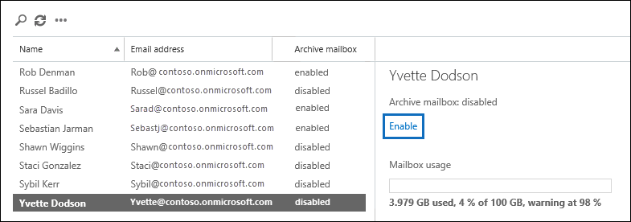

# <a name="enable-archive-mailboxes-in-the-security--compliance-center"></a>Habilitar caixas de correio de arquivo morto no centro de conformidade do & de segurança
  
O arquivamento no Office 365 (também chamado de arquivamento in-loco) fornece aos usuários espaço de armazenamento adicional de caixa de correio. Depois de ativar as caixas de correio de arquivo morto, os usuários podem acessar e armazenar mensagens em suas caixas de correio de arquivo morto usando o Microsoft Outlook e o Outlook na Web (anteriormente conhecido como Outlook Web App). Os usuários também podem mover ou copiar mensagens entre a caixa de correio principal e a caixa de correio de arquivo morto. Eles também podem recuperar itens excluídos da pasta itens recuperáveis em suas caixas de correio de arquivo morto usando a ferramenta recuperar itens excluídos. 
  
> [!TIP]
> O Office 365 fornece uma quantidade ilimitada de armazenamento de arquivos com o recurso de arquivamento de expansão automática. Quando o arquivamento de expansão automática está ativado e, em seguida, a cota de armazenamento inicial na caixa de correio de arquivo morto de um usuário é atingida, o Office 365 adiciona automaticamente espaço de armazenamento adicional. Isso significa que os usuários não ficarão sem espaço de armazenamento de caixa de correio e você não precisará gerenciar nada depois de habilitar inicialmente a caixa de correio de arquivo morto e ativar o arquivamento de expansão automática para sua organização. Confira mais informações em [Visão geral de arquivamento ilimitado no Office 365](unlimited-archiving.md). 
  
## <a name="before-you-begin"></a>Antes de começar

Você precisa receber a função de destinatários de email no Exchange Online para habilitar ou desabilitar caixas de correio de arquivo morto. Por padrão, essa função é atribuída aos grupos de função gerenciamento de destinatários e gerenciamento de organização na página **permissões** no centro de administração do Exchange. Se você não vir a página **arquivo morto** no centro de conformidade do _AMP_ de segurança, peça ao administrador para atribuir as permissões necessárias. 
  
## <a name="enable-an-archive-mailbox"></a>Habilitar uma caixa de correio de arquivo morto
  
1. Acesse [https://protection.office.com](https://protection.office.com).
    
2. Entre no Office 365 usando a sua conta corporativa ou de estudante.
    
3. No painel esquerdo do centro de conformidade do & de segurança, clique em arquivamento de **governança** \> **** de dados.
    
    A página **arquivo morto** é exibida. A coluna **caixa de correio de arquivo morto** indica se uma caixa de correio de arquivo morto está habilitada ou desabilitada para cada usuário. 
    
4. Na lista de caixas de correio, selecione o usuário para o qual você deseja habilitar a caixa de correio de arquivo morto.
    
    
  
5. No painel de detalhes do usuário selecionado, clique em **habilitar**. 
    
    Um aviso é exibido dizendo que se você habilitar a caixa de correio de arquivo morto, os itens da caixa de correio do usuário mais antigos do que a política de arquivamento atribuída à caixa de correio serão movidos para a nova caixa de correio de arquivo morto. A política de arquivo morto padrão que faz parte da política de retenção atribuída às caixas de correio do Exchange Online transfere itens para a caixa de correio de arquivo morto dois anos após a data em que o item foi entregue à caixa de correio ou criado pelo usuário. Para obter mais informações, consulte a seção **mais** informações neste artigo. 
    
6. Clique em **Sim** para habilitar a caixa de correio de arquivo morto. 
    
    Pode levar alguns momentos para criar a caixa de correio de arquivo morto. Quando ele é criado, a **caixa de correio de arquivo morto: habilitada** é exibida no painel de detalhes para o usuário selecionado. Talvez seja necessário clicar em **Atualizar**  de atualização para atualizar as informações no painel de detalhes. 
    
> [!TIP]
> Você também pode habilitar as caixas de correio de arquivo morto em massa, selecionando vários usuários com caixas de correio de arquivo morto desabilitadas (use as teclas Shift ou CTRL). Depois de selecionar várias caixas de correio, clique em **habilitar** no painel de detalhes. 
  
## <a name="disable-an-archive-mailbox"></a>Desabilitar uma caixa de correio de arquivo morto
  
Você também pode usar a página **arquivo morto** no centro de conformidade do _AMP_ de segurança para desabilitar a caixa de correio de arquivo morto de um usuário. Após desabilitar uma caixa de correio de arquivo morto, você poderá reconectá-la à caixa de correio principal do usuário dentro de 30 dias de desabilitá-la. Neste caso, o conteúdo original da caixa de correio de arquivo morto é restaurado. Após 30 dias, o conteúdo da caixa de correio de arquivo morto original é excluído permanentemente e não pode ser recuperado. Então, se você habilitar novamente o arquivo morto 30 dias ou mais após desabilitá-lo, será criada uma nova caixa de correio de arquivo morto. 
  
Observe que a política de arquivo morto padrão atribuída às caixas de correio dos usuários move itens para a caixa de correio de arquivo morto dois anos após a data em que o item é entregue. Se você desabilitar a caixa de correio de arquivo morto de um usuário, nenhuma ação será realizada nos itens de caixa de correio e ela permanecerá na caixa de correio principal do usuário.
  
Para desabilitar uma caixa de correio de arquivo morto:
  
1. Acesse [https://protection.office.com](https://protection.office.com).
    
2. Entre no Office 365 usando a sua conta corporativa ou de estudante.
    
3. No painel esquerdo do centro de conformidade do & de segurança, clique em arquivamento de **governança** \> **** de dados.
    
    A página **arquivo morto** é exibida. A coluna **caixa de correio de arquivo morto** indica se uma caixa de correio de arquivo morto está habilitada ou desabilitada para cada usuário. 
    
4. Na lista de caixas de correio, selecione o usuário para o qual você deseja desabilitar a caixa de correio de arquivo morto.
    
5. No painel de detalhes, clique em **desabilitar**. 
    
    Uma mensagem de aviso é exibida dizendo que você terá 30 dias para reabilitar a caixa de correio de arquivo morto e, após 30 dias, todas as informações no arquivo morto serão excluídas permanentemente. 
    
6. Clique em **Sim** para desabilitar a caixa de correio de arquivo morto. 
    
    Pode levar alguns instantes para desabilitar a caixa de correio de arquivo morto. Quando estiver desabilitada, **caixa de correio de arquivo morto: Disabled** será exibido no painel de detalhes para o usuário selecionado. Talvez seja necessário clicar em **Atualizar**  de atualização para atualizar as informações no painel de detalhes. 
    
> [!TIP]
> Você também pode desabilitar em massa as caixas de correio de arquivo morto selecionando vários usuários com caixas de correio de arquivo morto habilitadas (use as teclas Shift ou CTRL). Depois de selecionar várias caixas de correio, clique em **desabilitar** no painel de detalhes. 
  
## <a name="use-exchange-online-powershell-to-enable-or-disable-archive-mailboxes"></a>Usar o PowerShell do Exchange Online para habilitar ou desabilitar caixas de correio de arquivo morto

Você também pode usar o PowerShell do Exchange Online para habilitar caixas de correio de arquivo morto. O principal motivo para usar o PowerShell é que você pode habilitar rapidamente a caixa de correio de arquivo morto para todos os usuários em sua organização.

A primeira etapa é conectar-se ao PowerShell do Exchange Online. Para obter instruções, consulte [Connect to Exchange Online PowerShell](https://docs.microsoft.com/powershell/exchange/exchange-online/connect-to-exchange-online-powershell/connect-to-exchange-online-powershell).

Depois de se conectar ao Exchange Online, você pode executar os comandos nas seções a seguir para habilitar ou desabilitar caixas de correio de arquivo morto.

### <a name="enable-archive-mailboxes"></a>Habilitar caixas de correio de arquivamento

Execute o seguinte comando para habilitar a caixa de correio de arquivo morto para um único usuário.
    
  ```
  Enable-Mailbox -Identity <username> -Archive
  ```

Execute o seguinte comando para habilitar a caixa de correio de arquivo morto para todos os usuários em sua organização (cuja caixa de correio de arquivo morto não está habilitada no momento).
    
  ```
  Get-Mailbox -Filter {ArchiveStatus -Eq "None" -AND RecipientTypeDetails -eq "UserMailbox"} | Enable-Mailbox -Archive
  ```
  
### <a name="disable-archive-mailboxes"></a>Desabilitar caixas de correio de arquivo morto

Execute o seguinte comando para desabilitar a caixa de correio de arquivo morto para um único usuário.
    
  ```
  Disable-Mailbox -Identity <username> -Archive
  ```

Execute o seguinte comando para desabilitar a caixa de correio de arquivo morto para todos os usuários em sua organização (cuja caixa de correio de arquivo morto está habilitada no momento).
    
  ```
  Get-Mailbox -Filter {ArchiveStatus -Eq "Active" -AND RecipientTypeDetails -eq "UserMailbox"} | Disable-Mailbox -Archive
  ```

## <a name="more-information"></a>Mais informações
  
- Quando uma caixa de correio de arquivo morto está habilitada, os usuários podem armazenar mensagens em suas caixas de correio de arquivo morto. Os usuários podem acessar suas caixas de correio de arquivo morto usando o Microsoft Outlook e o Outlook na Web. Usando qualquer um desses aplicativos de cliente, os usuários podem exibir mensagens em sua caixa de correio de arquivo morto e mover ou copiar mensagens entre a caixa de correio principal e a caixa de correio de arquivo morto. Os usuários também podem recuperar itens excluídos da pasta Itens Recuperáveis em suas caixas de correio de arquivo morto usando a ferramenta Recuperar Itens Excluídos.

   Para obter uma lista de licenças do Outlook que dão suporte ao arquivamento in-loco, consulte [Outlook License Requirements for Exchange Features](https://support.office.com/article/outlook-license-requirements-for-exchange-features-46b6b7c5-c3ca-43e5-8424-1e2807917c99).

- As caixas de correio de arquivo morto ajudam você e seus usuários a atender aos requisitos de retenção, eDiscovery e bloqueio da sua organização. Por exemplo, você pode usar a política de retenção do Exchange da sua organização para mover o conteúdo da caixa de correio para a caixa de correio de arquivo morto dos usuários. Ao usar a ferramenta de pesquisa de conteúdo no centro de conformidade do & de segurança para pesquisar conteúdo específico na caixa de correio de um usuário, a caixa de correio de arquivo morto do usuário também será pesquisada. E, quando você coloca uma retenção de litígio ou aplica uma política de retenção do Office 365 à caixa de correio de um usuário, os itens na caixa de correio de arquivo morto também são mantidos.
  
- Após as caixas de correio de arquivo morto serem habilitadas, sua organização pode aproveitar a política de retenção padrão do Exchange (também chamada de gerenciamento de registros de mensagens ou política de MRM) que é atribuída automaticamente a cada caixa de correio. Quando uma caixa de correio de arquivo morto está habilitada, a política de retenção padrão do Exchange faz automaticamente o seguinte: 
  
    - Move os itens que têm dois anos ou mais da caixa de correio principal do usuário para suas caixas de correio de arquivo morto. 
    
    - Move os itens que têm 14 dias ou mais da pasta Itens Recuperáveis na caixa de correio principal do usuário para a pasta Itens Recuperáveis nas caixas de correio de arquivo morto.
    
- Para obter mais informações sobre caixas de correio de arquivo morto e políticas de retenção do Exchange, consulte:
    
  - [Marcas e políticas de retenção](https://go.microsoft.com/fwlink/?LinkId=404424)
    
  - [Política de retenção padrão no Exchange Online](https://go.microsoft.com/fwlink/?linkid=839418)
    
  - [Configurar uma política de arquivo morto e exclusão para caixas de correio em sua organização do Office 365](set-up-an-archive-and-deletion-policy-for-mailboxes.md)
