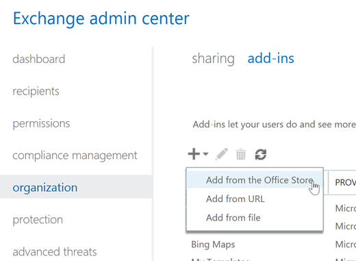

# Habilitar o suplemento de Mensagem de relatório

## Visão geral

O suplemento de mensagem de relatório para o Outlook e Outlook na Web permite que as pessoas facilmente relatado email classificados incorretamente, se seguros ou mal-intencionada, Microsoft e suas afiliadas para análise. A Microsoft usa essas envios para melhorar a eficácia das tecnologias de proteção de email. Além disso, se sua organização estiver usando [A proteção de ameaça avançadas do Office 365](office-365-atp.md) ou [Office 365 Threat Intelligence](office-365-ti.md), o suplemento de mensagem de relatório fornece equipe de segurança da sua organização com informações úteis, que eles podem usar para analisar e atualizar diretivas de segurança. 

Por exemplo, suponha que as pessoas são relatórios muitas mensagens como phishing. Este mostra informações no [Painel de segurança](security-dashboard.md) e outros relatórios. Equipe de segurança da sua organização pode usar essas informações como uma indicação de que as políticas de AntiPhishing talvez precisem ser atualizados. Ou, se as pessoas estão relatando muita mensagens que foram sinalizados como lixo eletrônico, como não sendo lixo eletrônico usando o suplemento de mensagem de relatório, talvez seja necessário ajustar o [políticas antispam](configure-the-anti-spam-policies.md)equipe de segurança da sua organização. 

O suplemento de mensagem de relatório funciona com sua assinatura do Office 365 e produtos a seguir:
 - Outlook na Web
 - Outlook 2013 SP1
 - Outlook 2016
 - Outlook 2016 para Mac
 - Outlook incluído com o Office 365 ProPlus
  
Se você for um usuário individual, você pode [Habilitar o suplemento de mensagem de relatório por conta própria](#get-the-report-message-add-in-for-yourself). 
  
Se você for um administrador do Exchange Online, você pode [Habilitar o suplemento de mensagem de relatório para sua organização](#get-and-enable-the-report-message-add-in-for-your-organization).
    
## Obtenha a mensagem de relatório suplemento para si mesmo

1. No [Microsoft AppSource](https://appsource.microsoft.com/marketplace/apps), procure o [suplemento de mensagem de relatório](https://appsource.microsoft.com/product/office/wa104381180).
    
2. Escolha **GET IT agora**.   
    
3. Analise os termos da política de uso e de privacidade. Em seguida, clique em **continuar**. 
    
4. Entrar no seu email do Office 365 usando seu trabalho ou a conta de escola (para uso de negócios) ou a sua conta da Microsoft (para uso pessoal).
    

Depois que o suplemento está instalado e habilitado, você verá os ícones a seguir: 

- No Outlook no ícone tem esta aparência:    
- No Outlook Web App no ícone tem esta aparência:  

Como o próximo passo, Aprenda como [usar o suplemento de mensagem de relatório](https://support.office.com/article/b5caa9f1-cdf3-4443-af8c-ff724ea719d2).
  
## Obter e habilitar o suplemento de mensagem de relatório para sua organização

> [!IMPORTANT]
> Você deve ser um administrador global do Office 365 ou um administrador do Exchange Online para completar esta tarefa.

1. Vá para [https://portal.office.com](https://portal.office.com) e entrar usando sua conta do trabalho ou da escola. 
    
2. Escolha **Admin** para ir para o Centro de administração. 
    
3. Escolha **Admin centrais** \> **Exchange** para ir para o Centro de administração do Exchange (EAC). 
    
4. Escolha **organização** \> **suplementos**. 
    
5. Escolha **+**  >  **Adicionar da Office Store**.  Isso abre a Office Store no seu navegador da web.
    
6. Procure a mensagem de relatório.  
    
7. Na lista de **aplicativos** , selecione **A mensagem de relatório**e escolha **Obter TI agora**.   
    
8. Analise os termos da política de uso e de privacidade. Em seguida, clique em **continuar**. 
    
    
  
9. Um assistente é aberto para ajudá-lo a configurar as informações de revisão de suplemento a mensagem de relatório e escolha **próximo** para continuar.   

10. Especifique a configuração padrão que você deseja atribuir ao usuário para o suplemento de mensagem de relatório.  
    
11. Especifica quem obtém a mensagem de relatório suplemento.   

12. Escolha **Salvar**.  
> [!TIP]
> Recomendamos a [configuração de uma regra para obter uma cópia das mensagens de email relatado pelos usuários](#set-up-a-rule-to-get-a-copy-of-email-messages-reported-by-your-users)

Dependendo do que você selecionou usando o assistente, pessoas da sua organização terão o [suplemento de mensagem de relatório](https://support.office.com/article/b5caa9f1-cdf3-4443-af8c-ff724ea719d2) disponíveis. Pessoas da sua organização verá os ícones a seguir: 

- No Outlook no ícone tem esta aparência:    
- No Outlook Web App no ícone tem esta aparência:  

## Configurar uma regra para obter uma cópia das mensagens de email relatado pelos usuários

> [!IMPORTANT]
> Você deve ser um administrador do Exchange Online para executar essa tarefa.
  
Você pode configurar uma regra para obter uma cópia das mensagens de email relatado pelos usuários em sua organização. Isso é feito depois que você baixou e habilitou o suplemento de mensagem de relatório para sua organização.
  
1. No EAC, selecione o **fluxo de email** \> **regras**. 
    
2. Escolha **+** \> **criar uma nova regra**. 
    
3. Na caixa **nome** , digite um nome, como envios.
    
4. Na lista **Aplicar esta regra se** , escolha **o endereço do destinatário inclui...**. 
    
5. Na tela **Especificar palavras ou expressões** , adicione junk@office365.microsoft.com e phish@office365.microsoft.com e escolha **Okey**. 
    
    
  
6. Na lista **faça o seguinte …** , escolha **Cco da mensagem para...**. 
    
7. Adicione um administrador global, administrador de segurança e/ou leitor de segurança que deve receber uma cópia de cada mensagem de email que pessoas reportam à Microsoft e escolha **Okey**. 
    
    
  
8. Selecione **Auditar esta regra com nível de severidade**e escolha **Médio**. 
    
9. Em **Escolher um modo para essa regra**, escolha **Enforce**. 
    
    
  
10. Escolha **Salvar**. 
    
Com essa regra in-loco, sempre que alguém em sua organização relata uma mensagem de email usando o suplemento do relatório de mensagem, seu administrador global, administrador de segurança e/ou leitor de segurança receberá uma cópia da mensagem. Essas informações podem permitem definir ou ajustar políticas, como políticas de [Vínculos do Office 365 ATP seguros](atp-safe-links.md) . 

## Analisar ou editar as configurações padrão para o suplemento de mensagem de relatório

Você pode analisar e editar as configurações padrão para o suplemento de mensagem de relatório usando o Centro de administração. 

> [!IMPORTANT]
> Você deve ser um administrador global do Office 365 ou um administrador do Exchange Online para completar esta tarefa.
    
1. Se apenas, você instalou o suplemento de mensagem de relatório para sua organização, você já será na página serviços e suplementos. Caso contrário, vá [aqui](https://portal.office.com/adminportal/home#/Settings/ServicesAndAddIns) e entrar usando sua conta de trabalho ou da escola para o Office 365.

2. Procure a **Mensagem de relatório**e selecioná-lo.   
    
3. Um painel aberto que exibe as configurações que foram selecionadas para o suplemento de mensagem de relatório durante a implantação.   

4. Revise e, se necessário, editar configurações para o suplemento de mensagem de relatório e salve as alterações.
    
## Saiba como usar o suplemento de mensagem de relatório

Consulte [usar o suplemento de mensagem de relatório](https://support.office.com/article/b5caa9f1-cdf3-4443-af8c-ff724ea719d2).
  
## Tópicos relacionados

[Usar o suplemento de mensagem de relatório](https://support.office.com/article/b5caa9f1-cdf3-4443-af8c-ff724ea719d2)
  
[Exibir relatórios de segurança de email na segurança &amp; Centro de conformidade](view-email-security-reports.md)

[Exibir relatórios de proteção de ameaça avançadas do Office 365](view-reports-for-atp.md)

[Use o Explorer na segurança &amp; Centro de conformidade](use-explorer-in-security-and-compliance.md)
  

