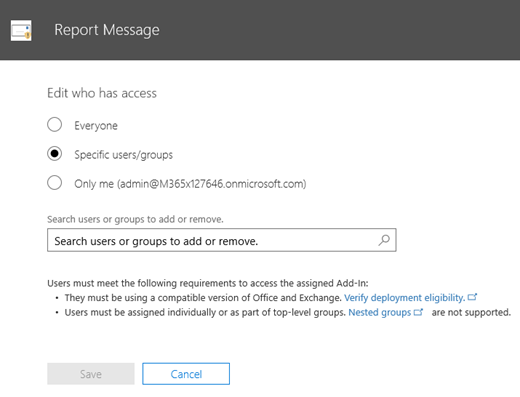

# Habilitar o suplemento de Mensagem de Relatório

> [!NOTE]
> O suplemento de mensagem de relatório para o Outlook e o Outlook na Web não é exatamente o mesmo que o [filtro de lixo eletrônico do Outlook](https://support.office.com/article/Overview-of-the-Junk-Email-Filter-5ae3ea8e-cf41-4fa0-b02a-3b96e21de089), embora ambos possam ser usados para marcar email como lixo eletrônico, não lixo eletrônico ou uma tentativa de phishing. A diferença é, o suplemento de mensagem de relatório para o Outlook e o Outlook na Web notifica a Microsoft sobre emails não classificados, enquanto o filtro de lixo eletrônico do Outlook é usado para organizar mensagens de email na caixa de correio de um usuário. 

## Visão geral

O suplemento de mensagem de relatório para o Outlook e o Outlook na Web permite que as pessoas relatem facilmente emails mal classificados, sejam seguros ou mal-intencionados, para a Microsoft e seus afiliados para análise. A Microsoft usa esses envios para melhorar a eficácia das tecnologias de proteção de email. Além disso, se sua organização estiver usando o [Office 365 Advanced Threat Protection Plan 1](office-365-atp.md) ou o [plano 2](office-365-ti.md), o suplemento de mensagem de relatório fornecerá a equipe de segurança da sua organização com informações úteis que podem ser usadas para analisar e atualizar as políticas de segurança. 

Por exemplo, suponha que as pessoas estejam relatando muitas mensagens como phishing. Essas informações são superfícies no [painel de segurança](security-dashboard.md) e em outros relatórios. A equipe de segurança da sua organização pode usar essas informações como indicação de que as políticas anti-phishing podem precisar ser atualizadas. Ou, se as pessoas estiverem relatando muitas mensagens que foram sinalizadas como lixo eletrônico como não sendo lixo eletrônico usando o suplemento de mensagem de relatório, a equipe de segurança da sua organização poderá precisar ajustar [políticas antispam](configure-the-anti-spam-policies.md). 

O suplemento de mensagem de relatório funciona com sua assinatura do Office 365 e os seguintes produtos:
 - Outlook na Web
 - Outlook 2013 SP1
 - Outlook 2016
 - Outlook 2016 para Mac
 - Outlook incluído no Office 365 ProPlus

O navegador da Web existente deve ser suficiente para que o suplemento de mensagem de relatório funcione; no entanto, se você notar que o suplemento não está disponível ou não está funcionando conforme o esperado, tente um navegador diferente.
  
Se você for um usuário individual, é possível [habilitar o relatório de suplemento de mensagens para você](#get-the-report-message-add-in-for-yourself). 
  
Se você for um administrador global do Office 365 ou um administrador do Exchange Online e o Exchange estiver configurado para usar a autenticação OAuth, você poderá [habilitar o suplemento de mensagem de relatório para sua organização](#get-and-enable-the-report-message-add-in-for-your-organization). O suplemento de mensagem de relatório agora está disponível por meio da [implantação centralizada](https://docs.microsoft.com/office365/admin/manage/centralized-deployment-of-add-ins).
    
## Obter o suplemento de mensagem de relatório para você mesmo

1. No [Microsoft AppSource](https://appsource.microsoft.com/marketplace/apps), procure o [suplemento de mensagem de relatório](https://appsource.microsoft.com/product/office/wa104381180).
    
2. Escolha **obtê-lo agora**.   
    
3. Revise os termos de uso e política de privacidade. Em seguida, escolha **Continuar**. 
    
4. Entre no Office 365 usando sua conta corporativa ou de estudante (para uso comercial) ou sua conta da Microsoft (para uso pessoal).
    
Depois que o suplemento estiver instalado e habilitado, você verá os seguintes ícones: 

- No Outlook, o ícone tem a seguinte aparência:    
- No Outlook na Web (anteriormente conhecido como Outlook Web App), o ícone tem a seguinte aparência:  

> [!TIP]
> Como próxima etapa, saiba como [usar o suplemento de mensagem de relatório](https://support.office.com/article/b5caa9f1-cdf3-4443-af8c-ff724ea719d2).
  
## Obter e habilitar o suplemento de mensagem de relatório para sua organização

> [!IMPORTANT]
> Você deve ser um administrador global do Office 365 ou um administrador do Exchange Online para concluir essa tarefa. Além disso, o Exchange deve ser configurado para usar a autenticação OAuth para saber mais, consulte [Exchange Requirements (implantação centralizada de suplementos)](https://docs.microsoft.com/office365/admin/manage/centralized-deployment-of-add-ins). 

1. Vá até a [página serviços & suplementos](https://admin.microsoft.com/AdminPortal/Home#/Settings/ServicesAndAddIns) no centro de administração do Microsoft 365.   
    
2. Escolha **+ implantar suplemento**.   
    
3. Na tela **novo suplemento** , revise as informações e, em seguida, escolha **Avançar**.  
    
4. Selecione **desejo adicionar um suplemento da Office Store**e, em seguida, escolha **Avançar**.   
    
5. Procure por **mensagem de relatório**e, na lista de resultados, ao lado do **suplemento de mensagem de relatório**, escolha **Adicionar**.  
    
6. Na tela de **mensagens de relatório** , revise as informações e, em seguida, escolha **Avançar**.  

7. Especifique as configurações padrão do usuário para o Outlook e, em seguida, escolha **Avançar**.  

8. Especifique quem recebe o suplemento de mensagem de relatório e, em seguida, escolha **salvar**.   

> [!TIP]
> Recomendamos [Configurar uma regra para obter uma cópia das mensagens de email relatadas por seus usuários](#set-up-a-rule-to-get-a-copy-of-email-messages-reported-by-your-users).

Dependendo do que você selecionou quando configurou o suplemento (etapas 7-8 acima), as pessoas em sua organização terão o [suplemento de mensagem de relatório](https://support.office.com/article/b5caa9f1-cdf3-4443-af8c-ff724ea719d2) disponível. As pessoas na sua organização verão os seguintes ícones: 

- No Outlook, o ícone tem a seguinte aparência:    
- No Outlook na Web, o ícone tem a seguinte aparência:  

> [!TIP]
> Ao notificar os usuários sobre o suplemento de mensagens de relatório, inclua um link para [usar o suplemento de mensagem de relatório](https://support.office.com/article/b5caa9f1-cdf3-4443-af8c-ff724ea719d2).

## Configurar uma regra para obter uma cópia das mensagens de email relatadas por seus usuários

> [!IMPORTANT]
> Você deve ser um administrador do Exchange Online para executar essa tarefa.
  
Você pode configurar uma regra para obter uma cópia das mensagens de email relatadas por usuários em sua organização. Faça isso depois de baixar e habilitar o suplemento de mensagem de relatório para sua organização.
  
1. No centro de administração do Exchange, escolha **regras**de **fluxo** \> de email. 
    
2. Escolha **+** \> **criar uma nova regra**. 
    
3. Na caixa **nome** , digite um nome, como envios.
    
4. Na lista **aplicar esta regra se** , escolha **o endereço do destinatário inclui..**. 
    
5. Na tela **especificar palavras ou frases** , adicione `junk@office365.microsoft.com` e `phish@office365.microsoft.com`, em seguida, escolha **OK**.  
  
6. Na lista **faça o seguinte...** , escolha **Cco a mensagem para..**.. 
    
7. Adicione um administrador global, um administrador de segurança e/ou um leitor de segurança que deve receber uma cópia de cada mensagem de email que as pessoas relatam à Microsoft e, em seguida, escolha **OK**.  
  
8. Selecione **auditar esta regra com nível de severidade**e escolha **médio**. 
    
9. Em **escolher um modo para essa regra**, escolha **impor**.  
  
10. Escolha **Salvar**. 
    
Com essa regra em vigor, sempre que alguém em sua organização relatar uma mensagem de email usando o suplemento de mensagem de relatório, seu administrador global, administrador de segurança e/ou leitor de segurança receberá uma cópia dessa mensagem. Essas informações podem permitir que você configure ou ajuste políticas, como as políticas de [links seguros de ATP do Office 365](atp-safe-links.md) ou suas configurações [antispam](anti-spam-protection.md) . 

## Saiba como usar o suplemento de mensagem de relatório

Confira [usar o suplemento de mensagem de relatório](https://support.office.com/article/b5caa9f1-cdf3-4443-af8c-ff724ea719d2).

## Revise ou edite as configurações do suplemento de mensagem de relatório

Você pode revisar e editar as configurações padrão para o suplemento de mensagem de relatório na [página de suplementos de serviços &](https://admin.microsoft.com/AdminPortal/Home#/Settings/ServicesAndAddIns). 

> [!IMPORTANT]
> Você deve ser um administrador global do Office 365 ou um administrador do Exchange Online para concluir essa tarefa.
    
1. Vá até a [página serviços & suplementos](https://admin.microsoft.com/AdminPortal/Home#/Settings/ServicesAndAddIns) no centro de administração do Microsoft 365.  

2. Localize e selecione o suplemento de mensagem de relatório.   
    
3. Na tela de mensagens de relatório, revise e edite as configurações conforme apropriado para sua organização.   

## Tópicos relacionados

[Usar o suplemento de mensagem de relatório](https://support.office.com/article/b5caa9f1-cdf3-4443-af8c-ff724ea719d2)
  
[Exibir relatórios de segurança de email no &amp; centro de conformidade de segurança](view-email-security-reports.md)

[Exibir relatórios para a proteção avançada contra ameaças do Office 365](view-reports-for-atp.md)

[Usar o Explorer no centro &amp; de conformidade de segurança](use-explorer-in-security-and-compliance.md)
  

