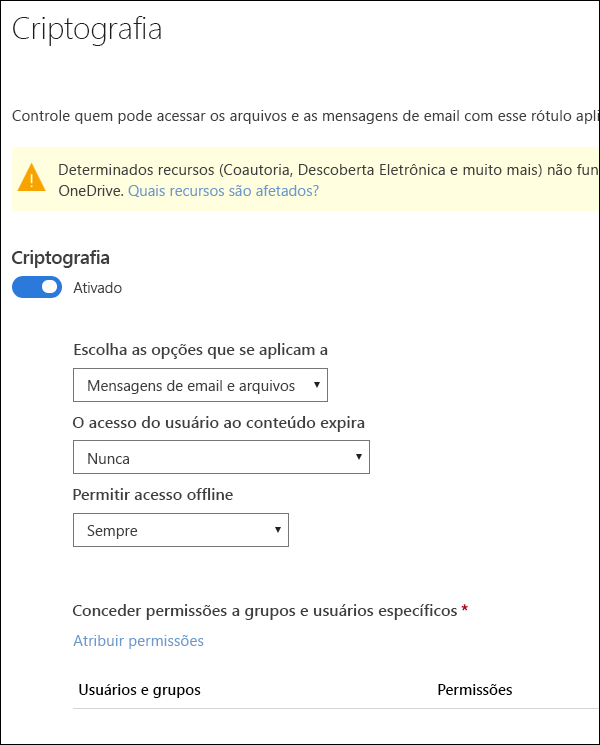
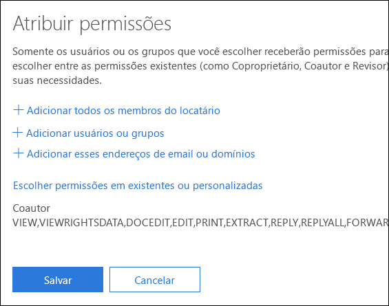
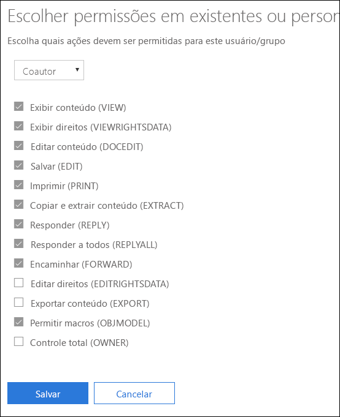
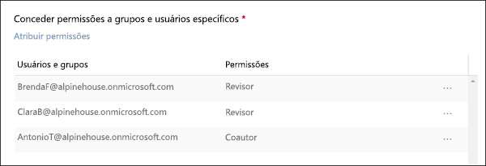

# Restringir o acesso ao conteúdo usando criptografia nos rótulos de confidencialidade

Quando você cria um rótulo de confidencialidade, pode restringir o acesso ao conteúdo ao qual o rótulo será aplicado. Por exemplo, com as configurações de criptografia para um rótulo de confidencialidade, você pode proteger conteúdos de modo que:

- Somente os usuários em sua organização possam abrir um documento ou um email confidenciais.
- Somente os usuários do departamento de marketing possam editar e imprimir o documento ou email de comunicado de promoção, enquanto todos os outros usuários em sua organização possam apenas lê-lo.
- Os usuários não podem encaminhar um email ou copiar informações destas fontes que contêm notícias sobre uma reorganização interna.
- A lista de preços atual que enviada a parceiros de negócios não pode ser aberta após uma data especificada.

Quando um documento ou email é criptografado, o acesso ao conteúdo é restrito, para que ele:

- Possa ser descriptografado apenas por usuários autorizados pelas configurações de criptografia do rótulo.
- Permaneça criptografado independentemente de onde esteja, dentro ou fora da sua organização, mesmo se o arquivo for renomeado.
- Fique criptografado tanto em repouso (por exemplo, em uma conta do OneDrive) quanto em trânsito (por exemplo, um email enviado).

As configurações de criptografia estão disponíveis no Centro de Conformidade e Segurança do Office 365 > página **Rótulos** > guia **Confidencialidade** > **Criar um rótulo**.

## Como funciona a criptografia

A criptografia usa o Azure Rights Management (Azure RMS). O Azure RMS usa identidade, criptografia e autorização políticas. Para saber mais, confira [O que é Azure Rights Management?](https://docs.microsoft.com/pt-BR/azure/information-protection/what-is-azure-rms)

## Como ativar a criptografia para um rótulo de confidencialidade

Para começar, basta colocar **Criptografia** no estado **Ativado** e depois usar as opções abaixo para controlar quem pode acessar emails ou documentos aos quais o rótulo é aplicado. Você pode:

1. **Aplicar criptografia em emails e documentos, ou apenas em emails. ** Se quiser aplicar somente aos emails, as mensagens com esse rótulo serão criptografadas no Outlook, mas os documentos com este rótulo não serão criptografados em outros aplicativos, como Word ou PowerPoint. 
2. **Permitir que o acesso ao conteúdo rotulado expire**, em uma data específica ou depois de um número específico de dias após o rótulo ser aplicado. Após este período, os usuários não poderão abrir o item rotulado. Se você especificar uma data, isso será válido a partir da meia-noite da data em questão em seu fuso horário atual. 
3. **Permitir o acesso offline** nunca, sempre ou por um número específico de dias após o rótulo ser aplicado. Se você restringir o acesso offline para nunca ou por um número de dias, quando este limite for atingido, os usuários precisarão ser autenticados novamente e seu acesso será registrado. Para saber mais, confira a próxima seção na licença de uso de Gerenciamento de Direitos.

### Licença de uso de Gerenciamento de Direitos para acesso offline

Quando o usuário abre um documento ou email offline protegido por um rótulo de confidencialidade, ele recebe uma licença de uso do Azure Rights Management para esse conteúdo. Essa licença de uso é um certificado com direitos de uso do usuário para o documento ou email e a chave de criptografia usada para criptografar o conteúdo. A licença de uso também contém uma data de vencimento, se tiver sido definida, e o período de validade da licença.

Se nenhuma data de vencimento tiver sido definida, o período de validade da licença de uso padrão para um locatário é de 30 dias. Pela duração da licença de uso, o usuário não precisa ser autenticado ou autorizado novamente para o conteúdo. Isso permite que o usuário continue a abrir o documento ou email protegido sem uma conexão de Internet. Quando expirar o período de validade da licença de uso, na próxima vez em que o usuário acessar o documento ou email protegido, ele precisará ser autenticado e autorizado novamente.

Além da nova autenticação, a política e a associação do grupo de usuários são reavaliados. Isso significa que os usuários pode experimentar diferentes resultados de acesso para o mesmo documento ou email se houver alterações na política ou na associação de grupo em relação à última vez em que acessaram o conteúdo.

Para saber como alterar a configuração padrão de 30 dias, confira [Licença de uso de Gerenciamento de Direitos](https://docs.microsoft.com/pt-BR/azure/information-protection/configure-usage-rights#rights-management-use-license)..

## Atribuir permissões a usuários ou grupos específicos

Você pode conceder permissões para pessoas específicas para que somente elas possam interagir com o conteúdo rotulado.

Este é um processo de duas etapas simples:

1. Primeiro você adiciona usuários ou grupos que receberão permissões para o conteúdo rotulado.
2. Em seguida, escolhe quais permissões os usuários têm para o conteúdo rotulado.

### Adicionar usuários ou grupos

Quando você atribui permissões, pode escolher:

- Todos em sua organização (todos os membros locatários). Esta configuração exclui contas de convidados.
- Qualquer usuário específico ou grupo de segurança, grupo de distribuição, grupo do Office 365 ou grupo de distribuição dinâmico habilitado para email. 
- Qualquer endereço de email ou domínio fora da sua organização, como gmail.com, hotmail.com ou outlook.com.

Quando você escolhe todos os membros locatários e pesquisa o diretório, os usuários ou grupos devem ter um endereço de email.

Como prática recomendada, use grupos em vez de usuários. Essa estratégia mantém a configuração mais simples.

### Escolher permissões

Quando você escolhe quais permissões atribuir para os usuários ou grupos, você pode selecionar:

- Um [nível de permissões predefinidas](https://docs.microsoft.com/pt-BR/azure/information-protection/configure-usage-rights#rights-included-in-permissions-levels) com um grupo predefinido de direitos, como co-autor ou revisor.
- Um grupo de direitos personalizados, no qual você escolhe as permissões que desejar.

Para saber mais sobre cada permissão específica, confira [Direitos de uso e descrições](https://docs.microsoft.com/pt-BR/azure/information-protection/configure-usage-rights#usage-rights-and-descriptions).  

Observe que o mesmo rótulo pode atribuir permissões diferentes a usuários diferentes. Por exemplo, um rótulo único pode definir alguns usuários como Revisores e um usuário diferente como Co-Autor, como mostrado abaixo.

Para fazer isso, adicione usuários ou grupos, atribua-lhes permissões e salve essas configurações. Depois repita essas etapas, adicionando usuários e atribuindo-lhes permissões, salvando as configurações a cada vez. Você pode fazer isso quantas vezes for necessário para definir permissões diferentes para usuários diferentes.

### O emissor do Gerenciamento de Direitos (usuário que aplica o rótulo de confidencialidade) sempre tem o Controle Total

A criptografia de um rótulo de confidencialidade usa Azure RMS. Quando um usuário aplica um rótulo de confidencialidade para proteger um documento ou email usando o Azure RMS, esse usuário se torna o emissor do Gerenciamento de Direitos daquele conteúdo.

O emissor do Gerenciamento de Direitos sempre recebe as permissões de Controle Total para o documento ou email, e também:

- Se as configurações de proteção incluem uma data de vencimento, o emissor do Gerenciamento de Direitos ainda pode abrir e editar o documento ou email após essa data.
- O emissor do Gerenciamento de Direitos sempre pode acessar o documento ou email offline.
- O emissor do Gerenciamento de Direitos ainda consegue abrir um documento após sua revogação.

Para saber mais, confira [Emissor do Gerenciamento de Direitos e Proprietário do Gerenciamento de Direitos](https://docs.microsoft.com/pt-BR/azure/information-protection/configure-usage-rights#rights-management-issuer-and-rights-management-owner).

## Armazenar conteúdo criptografado no OneDrive e no SharePoint

Saiba que quando a criptografia é aplicada aos arquivos armazenados no OneDrive e no SharePoint, o serviço não pode processar o conteúdo desses arquivos. Isso significa que recursos como co-autoria, Descoberta Eletrônica, pesquisa, Delve e outros recursos colaborativos não funcionam. Além disso, as políticas de prevenção de perda de dados (DLP) só funcionam com metadados (incluindo rótulos do Office 365), mas não com o conteúdo dos arquivos criptografados (como números de cartão de crédito dentro de arquivos).

Isso se aplica apenas ao conteúdo armazenado no OneDrive e no SharePoint. No Exchange Online, as regras de transporte usam a [super conta de usuário](https://docs.microsoft.com/pt-BR/azure/information-protection/configure-super-users) para que possam criptografar conteúdos e aplicar políticas DLP.

## Pré-requisitos importantes

Antes de usar a criptografia, talvez seja necessário realizar essas tarefas.

### Ativar o Gerenciamento de Direitos do Azure

Para usar a criptografia em rótulos de confidencialidade, o serviço de Gerenciamento de Direitos do Azure precisa ser ativado em seu locatário. Nos locatários mais novos, o serviço fica ativo por padrão, mas você pode precisar ativá-lo manualmente. Para saber mais, confira [Ativar o Gerenciamento de Direitos do Azure](https://docs.microsoft.com/pt-BR/azure/information-protection/activate-service).

### Configurar o Exchange para a Proteção de Informações do Azure

O Exchange não precisa ser configurado para a Proteção de Informações do Azure antes que os usuários podem aplicar rótulos no Outlook para proteger seus emails. No entanto, até que o Exchange esteja configurado para a Proteção de Informações do Azure, você não conseguirá obter a funcionalidade completa do uso da proteção do Gerenciamento de Direitos do Azure com o Exchange.
 
Por exemplo, usuários não podem exibir emails protegidos em celulares ou com o Outlook na Web, os emails protegidos não podem ser indexados para pesquisa e você não pode configurar o DLP do Exchange Online para a proteção do Gerenciamento de Direitos. 

Para garantir que Exchange possa dar suporte a esses cenários adicionais, confira o seguinte:

- Para o Exchange Online, confira as instruções de [Exchange Online: configuração do IRM](https://docs.microsoft.com/pt-BR/azure/information-protection/configure-office365#exchange-online-irm-configuration).
- Para o Exchange local, é necessário implantar o [conector RMS e configurar seus servidores Exchange](https://docs.microsoft.com/pt-BR/azure/information-protection/deploy-rms-connector). 
