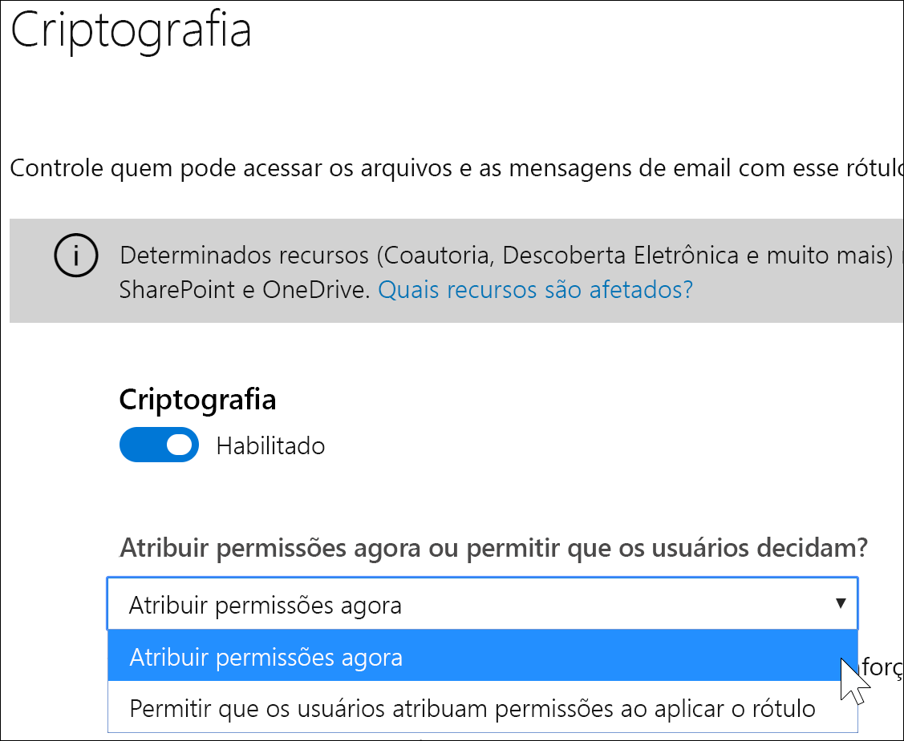
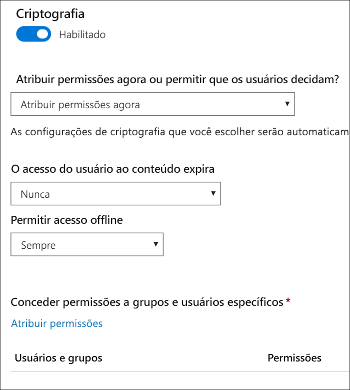
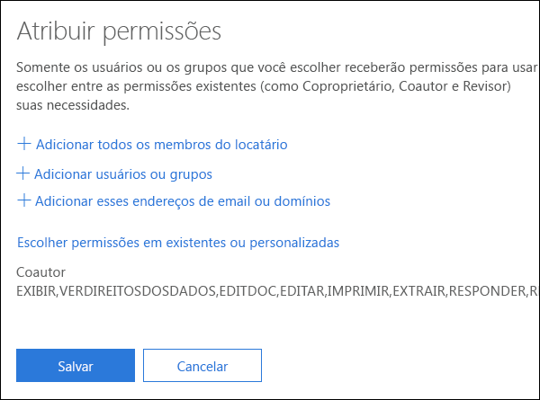
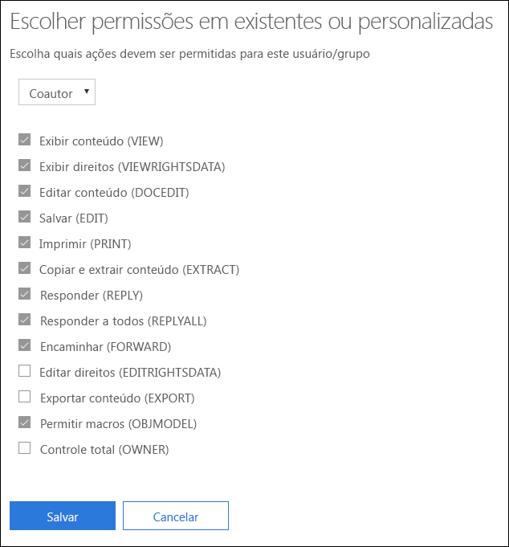
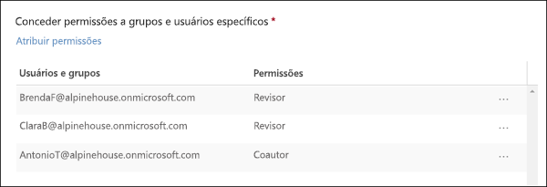
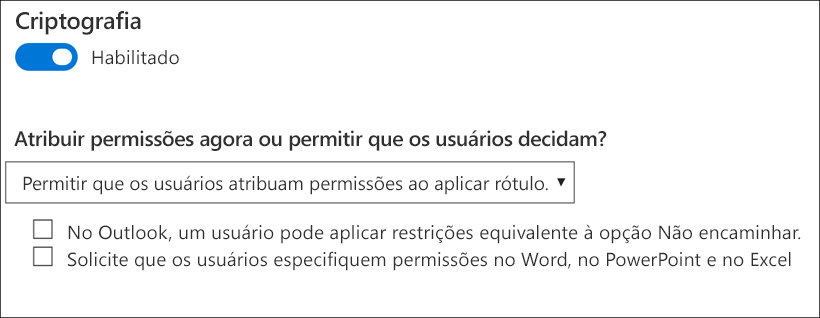
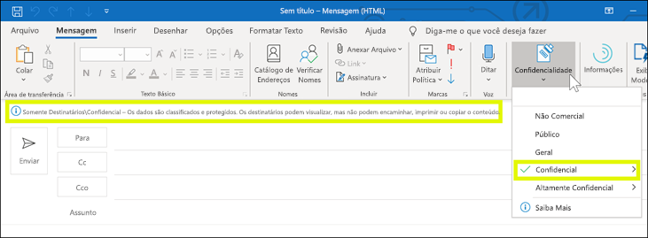
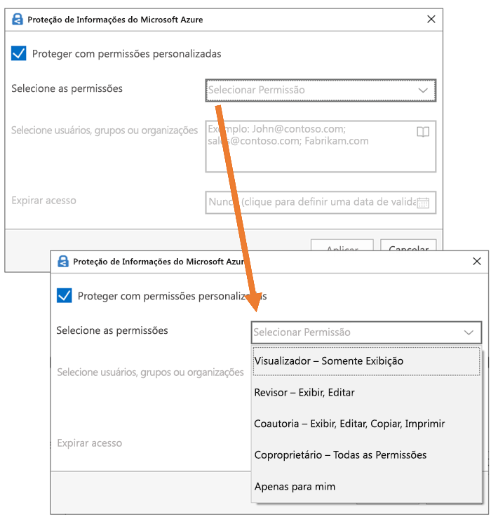

# Restringir o acesso ao conteúdo usando criptografia nos rótulos de confidencialidadeRestrict access to content by using encryption in sensitivity labels

Quando você cria um rótulo de confidencialidade, pode restringir o acesso ao conteúdo ao qual o rótulo será aplicado. Por exemplo, com as configurações de criptografia para um rótulo de confidencialidade, você pode proteger conteúdos de modo que:When you create a sensitivity label, you can restrict access to content that the label will be applied to. For example, with the encryption settings for a sensitivity label, you can protect content so that:

- Somente os usuários em sua organização possam abrir um documento ou um email confidenciais.Only users within your organization can open a confidential document or email.
- Somente os usuários do departamento de marketing possam editar e imprimir o documento ou email de comunicado de promoção, enquanto todos os outros usuários em sua organização possam apenas lê-lo.Only users in the marketing department can edit and print the promotion announcement document or email, while all other users in your organization can only read it.
- Os usuários não podem encaminhar um email ou copiar informações destas fontes que contêm notícias sobre uma reorganização interna.Users cannot forward an email or copy information from it that contains news about an internal reorganization.
- A lista de preços atual que enviada a parceiros de negócios não pode ser aberta após uma data especificada.The current price list that is sent to business partners cannot be opened after a specified date.

Quando um documento ou email é criptografado, o acesso ao conteúdo é restrito, para que ele:When a document or email is encrypted, access to the content is restricted, so that it:

- Possa ser descriptografado apenas por usuários autorizados pelas configurações de criptografia do rótulo.Can be decrypted only by users authorized by the label’s encryption settings.
- Permaneça criptografado independentemente de onde esteja, dentro ou fora da sua organização, mesmo se o arquivo for renomeado.Remains encrypted no matter where it resides, inside or outside your organization, even if the file’s renamed.
- Fique criptografado tanto em repouso (por exemplo, em uma conta do OneDrive) quanto em trânsito (por exemplo, um email enviado).Is encrypted both at rest (for example, in a OneDrive account) and in transit (for example, a sent email).

Por fim, como administrador, quando você cria um rótulo de sensibilidade, há duas opções a escolher:Finally, as an admin, when you create a sensitivity label, you can choose either to:

- **Atribuir permissões agora**, para que assim você possa determinar exatamente quais usuários podem obter quais permissões de conteúdo com esse rótulo.**Assign permissions now**, so that you determine exactly which users get which permissions to content with that label.
- **Permitir que os usuários atribuam permissões** quando aplicam o rótulo ao conteúdo.**Let users assign permissions** when they apply the label to content. Dessa forma, você pode conceder a pessoas em sua organização uma certa flexibilidade que elas possam precisar para colaborar e realizar o trabalho.This way, you can allow people in your organization some flexibility that they might need to collaborate and get their work done.

As configurações de criptografia estão disponíveis quando você cria um rótulo de confidencialidade no centro de conformidade do Microsoft 365, centro de segurança do Microsoft 365 ou Centro de Conformidade e Segurança do Office 365.The encryption settings are available when you create a sensitivity label in the Microsoft 365 compliance center, Microsoft 365 security center, or Office 365 Security & Compliance Center. Na barra de navegação à esquerda, escolha **Classificação** > \*\* Rótulo de sensibilidade\*\* > **Criar um rótulo**.In the left nav, choose **Classification** > **Sensitivity label** > **Create a label**.

## Como funciona a criptografiaHow encryption works

A criptografia usa o Azure Rights Management (Azure RMS). O Azure RMS usa identidade, criptografia e autorização políticas. Para saber mais, confira [O que é Azure Rights Management?](https://docs.microsoft.com/pt-BR/azure/information-protection/what-is-azure-rms)Encryption uses Azure Rights Management (Azure RMS). Azure RMS uses encryption, identity, and authorization policies. To learn more, see [What is Azure Rights Management?](https://docs.microsoft.com/pt-BR/azure/information-protection/what-is-azure-rms)

## Como ativar a criptografia para um rótulo de confidencialidadeHow to turn on encryption for a sensitivity label

Para começar, basta no botão de alternância em**Criptografia**optar por**Ativar**, em seguida, escolha entre:To begin, simply toggle **Encryption** to **On**, and then choose whether to:

- **Atribuir permissões agora**, para assim determinar exatamente quais usuários podem obter quais permissões de conteúdo com esse rótulo.**Assign permissions now**, so that you can determine exactly which users get which permissions to content with that label. Para mais informações, consulte a próxima seção[Atribuir permissões agora](#assign-permissions-now).For more information, see the next section [Assign permissions now](#assign-permissions-now).
- **Permitir que os usuários atribuam permissões** quando aplicam o rótulo ao conteúdo.**Let users assign permissions** when they apply the label to content. Dessa forma, você pode conceder a pessoas em sua organização uma certa flexibilidade que elas possam precisar para colaborar e realizar o trabalho.This way, you can allow people in your organization some flexibility that they might need to collaborate and get their work done. Para mais informações, consulte a seção abaixo[ Permitir que usuários atribuam permissões](#let-users-assign-permissions).For more information, see the below section [Let users assign permissions](#let-users-assign-permissions).

Por exemplo, se você tiver um rótulo de sensibilidade denominado **Altamente Confidencial** que seria aplicado ao seu conteúdo mais confidencial, talvez você queira decidir agora quem recebe o tipo de permissão para esse conteúdo.For example, if you have a sensitivity label named **Highly Confidential** that will be applied to your most sensitive content, you may want to decide now who gets what type of permissions to that content.

Como alternativa, se você tiver um rótulo de sensibilidade chamado **Contratos de Negócios**, e o fluxo de trabalho da sua organização exigir que as pessoas colaborem com outras pessoas de forma ad hoc, talvez você queira permitir que seus os usuários decidam quem receberá permissões quando atribui o rótulo.Alternatively, if you have a sensitivity label named **Business Contracts**, and your organization's workflow requires that your people collaborate on this content with different people on an ad hoc basis, you may want to allow your users to decide who gets permissions when they assign the label. Essa flexibilidade auxilia não só a produtividade dos usuários como também reduz as solicitações dos seus administradores de atualizar ou criar novos rótulos de sensibilidade para cenários específicos.This flexibility both helps your users' productivity and reduces the requests for your admins to update or create new sensitivity labels to address specific scenarios.

## Atribuir permissões agoraAssign permissions now

Use as opções abaixo para controlar quem pode acessar os emails e documentos aos quais aquele rótulo foi aplicado.To begin, simply toggle Encryption to On, and then use the options below to control who can access email or documents to which this label is applied. You can: Você pode:You can:

1. \*\*Aplicar criptografia em emails e documentos, ou apenas em emails. \*\* Se quiser aplicar somente aos emails, as mensagens com esse rótulo serão criptografadas no Outlook, mas os documentos com este rótulo não serão criptografados em outros aplicativos, como Word ou PowerPoint.**Apply encryption to both email and documents, or just email.** If you choose just email, messages with this label will be encrypted in Outlook, but documents with this label won't be encrypted in other apps, such as Word or PowerPoint. 
2. **Permitir que o acesso ao conteúdo rotulado expire**, em uma data específica ou depois de um número específico de dias após o rótulo ser aplicado. Após este período, os usuários não poderão abrir o item rotulado. Se você especificar uma data, isso será válido a partir da meia-noite da data em questão em seu fuso horário atual. (Observe que alguns clientes de email podem não impor expiração e exibir emails após a data de vencimento, devido a seus mecanismos de cache.)**Allow access to labeled content to expire**, either on a specific date or after a specific number of days after the label is applied. After this time, users won’t be able to open the labeled item. If you specify a date, it is effective midnight on that date in your current time zone. (Note that some email clients may not enforce expiration and show emails past their expiration date, due to their caching mechanisms.)
3. **Permitir o acesso offline** nunca, sempre ou por um número específico de dias após o rótulo ser aplicado. Se você restringir o acesso offline para nunca ou por um número de dias, quando este limite for atingido, os usuários precisarão ser autenticados novamente e seu acesso será registrado. Para saber mais, confira a próxima seção na licença de uso de Gerenciamento de Direitos.**Allow offline access** never, always, or for a specific number of days after the label is applied. If you restrict offline access to never or a number of days, when that threshold is reached, users must be reauthenticated and their access is logged. For more information, see the next section on the Rights Management use license.

### Licença de uso de Gerenciamento de Direitos para acesso offlineRights Management use license for offline access

Quando o usuário abre um documento ou email offline protegido por um rótulo de confidencialidade, ele recebe uma licença de uso do Azure Rights Management para esse conteúdo. Essa licença de uso é um certificado com direitos de uso do usuário para o documento ou email e a chave de criptografia usada para criptografar o conteúdo. A licença de uso também contém uma data de vencimento, se tiver sido definida, e o período de validade da licença.When a user opens a document or email offline that’s been protected by a sensitivity label, an Azure Rights Management use license for that content is granted to the user. This use license is a certificate that contains the user's usage rights for the document or email, and the encryption key that was used to encrypt the content. The use license also contains an expiration date if this has been set, and how long the use license is valid.

Se nenhuma data de vencimento tiver sido definida, o período de validade da licença de uso padrão para um locatário é de 30 dias. Pela duração da licença de uso, o usuário não precisa ser autenticado ou autorizado novamente para o conteúdo. Isso permite que o usuário continue a abrir o documento ou email protegido sem uma conexão de Internet. Quando expirar o período de validade da licença de uso, na próxima vez em que o usuário acessar o documento ou email protegido, ele precisará ser autenticado e autorizado novamente.If no expiration date has been set, the default use license validity period for a tenant is 30 days. For the duration of the use license, the user is not reauthenticated or reauthorized for the content. This lets the user continue to open the protected document or email without an Internet connection. When the use license validity period expires, the next time the user accesses the protected document or email, the user must be reauthenticated and reauthorized.

Além da nova autenticação, a política e a associação do grupo de usuários são reavaliados. Isso significa que os usuários pode experimentar diferentes resultados de acesso para o mesmo documento ou email se houver alterações na política ou na associação de grupo em relação à última vez em que acessaram o conteúdo.In addition to reauthentication, the policy and user group membership is reevaluated. This means that users could experience different access results for the same document or email if there are changes in the policy or group membership from when they last accessed the content.

Para saber como alterar a configuração padrão de 30 dias, confira [Licença de uso de Gerenciamento de Direitos](https://docs.microsoft.com/pt-BR/azure/information-protection/configure-usage-rights#rights-management-use-license)..To learn how to change the default 30-day setting, see [Rights Management use license](https://docs.microsoft.com/pt-BR/azure/information-protection/configure-usage-rights#rights-management-use-license).

### Atribuir permissões a usuários ou grupos específicosAssign permissions to specific users or groups

Você pode conceder permissões para pessoas específicas para que somente elas possam interagir com o conteúdo rotulado.You can grant permissions to specific people so that only they can interact with the labeled content.

Este é um processo de duas etapas simples:Doing so is a straightforward two-step process:

1. Primeiro você adiciona usuários ou grupos que receberão permissões para o conteúdo rotulado.First you add users or groups that will be assigned permissions to the labeled content.
2. Em seguida, escolhe quais permissões os usuários têm para o conteúdo rotulado.Then you choose which permissions those users have for the labeled content.

#### Adicionar usuários ou gruposAdd users or groups

Quando você atribui permissões, pode escolher:When you assign permissions, you can choose:

- Todos em sua organização (todos os membros locatários). Esta configuração exclui contas de convidados.Everyone in your organization (all tenant members). This setting excludes guest accounts.
- Qualquer usuário específico ou grupo de segurança, grupo de distribuição, grupo do Office 365 ou grupo de distribuição dinâmico habilitado para email.Any specific user or email-enabled security group, distribution group, Office 365 group, or dynamic distribution group. 
- Qualquer endereço de email ou domínio fora da sua organização, como gmail.com, hotmail.com ou outlook.com.Any email address or domain outside your organization, such as gmail.com, hotmail.com, or outlook.com.

Quando você escolhe todos os membros locatários e pesquisa o diretório, os usuários ou grupos devem ter um endereço de email.When you choose all tenant members or browse the directory, the users or groups must have an email address.

Como prática recomendada, use grupos em vez de usuários. Essa estratégia mantém a configuração mais simples.As a best practice, use groups rather than users. This strategy keeps your configuration simpler.

#### Escolher permissõesChoose permissions

Quando você escolhe quais permissões atribuir para os usuários ou grupos, você pode selecionar:When you choose which permissions to allow for those users or groups, you can select either:

- Um [nível de permissões predefinidas](https://docs.microsoft.com/pt-BR/azure/information-protection/configure-usage-rights#rights-included-in-permissions-levels) com um grupo predefinido de direitos, como co-autor ou revisor.A [predefined permissions level](https://docs.microsoft.com/pt-BR/azure/information-protection/configure-usage-rights#rights-included-in-permissions-levels) with a preset group of rights, such as Co-Author or Reviewer.
- Um grupo de direitos personalizados, no qual você escolhe as permissões que desejar.A Custom group of rights, where you choose whichever permissions you want.

Para saber mais sobre cada permissão específica, confira [Direitos de uso e descrições](https://docs.microsoft.com/pt-BR/azure/information-protection/configure-usage-rights#usage-rights-and-descriptions).For more information on each specific permission, see [Usage rights and descriptions](https://docs.microsoft.com/pt-BR/azure/information-protection/configure-usage-rights#usage-rights-and-descriptions).  

Observe que o mesmo rótulo pode atribuir permissões diferentes a usuários diferentes. Por exemplo, um rótulo único pode definir alguns usuários como Revisores e um usuário diferente como Co-Autor, como mostrado abaixo.Note that the same label can grant different permissions to different users. For example, a single label can assign some users as Reviewer and a different user as Co-author, as shown below.

Para fazer isso, adicione usuários ou grupos, atribua-lhes permissões e salve essas configurações. Depois repita essas etapas, adicionando usuários e atribuindo-lhes permissões, salvando as configurações a cada vez. Você pode fazer isso quantas vezes for necessário para definir permissões diferentes para usuários diferentes.To do this, add users or groups, assign them permissions, and save those settings. Then repeat these steps, adding users and assigning them permissions, saving the settings each time. You can do this as often as necessary, to define different permissions for different users.

#### O emissor do Gerenciamento de Direitos (usuário que aplica o rótulo de confidencialidade) sempre tem o Controle TotalRights Management issuer (user applying the sensitivity label) always has Full Control

A criptografia de um rótulo de confidencialidade usa Azure RMS. Quando um usuário aplica um rótulo de confidencialidade para proteger um documento ou email usando o Azure RMS, esse usuário se torna o emissor do Gerenciamento de Direitos daquele conteúdo.Encryption for a sensitivity label uses Azure RMS. When a user applies a sensitivity label to protect a document or email by using Azure RMS, that user becomes the Rights Management issuers for that content.

O emissor do Gerenciamento de Direitos sempre recebe as permissões de Controle Total para o documento ou email, e também:The Rights Management issuer is always granted Full Control permissions for the document or email, and in addition:

- Se as configurações de proteção incluem uma data de vencimento, o emissor do Gerenciamento de Direitos ainda pode abrir e editar o documento ou email após essa data.If the protection settings include an expiration date, the Rights Management issuer can still open and edit the document or email after that date.
- O emissor do Gerenciamento de Direitos sempre pode acessar o documento ou email offline.The Rights Management issuer can always access the document or email offline.
- O emissor do Gerenciamento de Direitos ainda consegue abrir um documento após sua revogação.The Rights Management issuer can still open a document after it is revoked.

Para saber mais, confira [Emissor do Gerenciamento de Direitos e Proprietário do Gerenciamento de Direitos](https://docs.microsoft.com/pt-BR/azure/information-protection/configure-usage-rights#rights-management-issuer-and-rights-management-owner).For more information, see [Rights Management issuer and Rights Management owner](https://docs.microsoft.com/pt-BR/azure/information-protection/configure-usage-rights#rights-management-issuer-and-rights-management-owner).

## Permitir que usuários atribuam permissõesLet users assign permissions

Você pode usar essas opções para permitir que os usuários atribuam permissões quando os mesmos aplicarem manualmente um rótulo de sensibilidade ao conteúdo:You can use these options to let users assign permissions when they manually apply a sensitivity label to content:

- No Outlook, um usuário pode aplicar restrições equivalente à opção**Não encaminhar**.In Outlook, a user can enforce restrictions equivalent to the **Do Not Forward** option. Essa opção é compatível nativamente com o Outlook no Windows e não exige que você instale o cliente de rotulagem de Proteção de informações do Azure.This option is supported natively in Outlook on Windows, and does not require you to install the Azure Information Protection unified labeling client.
- No Word, no PowerPoint e no Excel, um usuário deve selecionar um nível de permissão para usuários, grupos ou organizações específicos.In Word, PowerPoint, and Excel, a user is prompted to select a permission level for specific users, groups, or organizations. Essa opção não é compatível nativamente com esses aplicativos e portanto exige que você instale o cliente de rotulagem de Proteção de informações do Azure.This option is not supported natively in these Office apps, so your users must install the Azure Information Protection unified labeling client.

Essas opções determinam em quais aplicativos o rótulo de sensibilidade será exibido:These options determine in which apps the sensitivity label will appear:

- Se o rótulo de sensibilidade tiver apenas a opção Outlook habilitada, o rótulo aparecerá para os usuários somente no Outlook.If the sensitivity label has only the Outlook option enabled, the label will appear to users only in Outlook.
- Se o rótulo de sensibilidade tiver apenas a opção Word, PowerPoint e Excel habilitada, o rótulo aparecerá para os usuários somente nesses aplicativos.If the sensitivity label has only the Word, PowerPoint, and Excel option enabled, the label will appear to users only in those apps.
- Se o rótulo de sensibilidade tiver ambas as opções habilitadas, o rótulo aparecerá para os usuários em todos os aplicativos disponíveis: Outlook, Word, PowerPoint e Excel.If the sensitivity label has both options enabled, the label will appear to users in all of the available apps: Outlook, Word, PowerPoint, and Excel.

Um rótulo de sensibilidade que permite aos usuários atribuir permissões a conteúdo só poderá ser aplicado manualmente por usuários. Tal rótulo não pode ser aplicado automaticamente ou usado como um rótulo recomendado.A sensitivity label that lets users assign permissions can be applied to content only manually by users; it can't be auto-applied or used as a recommended label.

> [!NOTE]
> Permitir que os usuários atribuam permissões exige uma assinatura de Proteção de informações do Azure.Letting users assign permissions requires an Azure Information Protection subscription. Para usar esse recurso no Word, PowerPoint e Excel, você deve baixar e instalar o [cliente de rotulagem de Proteção de informações do Azure](https://docs.microsoft.com/azure/information-protection/rms-client/install-unifiedlabelingclient-app).To use this feature in Word, PowerPoint, and Excel, you must download and install the [Azure Information Protection unified labeling client](https://docs.microsoft.com/azure/information-protection/rms-client/install-unifiedlabelingclient-app). Estamos trabalhando na combatibilidade nativa desse recurso nestes aplicativos do Office, para que eles não exijam a instalação do cliente de Proteção de informações do Azure.We're working on native support for this feature in these Office apps, so that they won't require the Azure Information Protection client. Além disso, o cliente só é executado no Windows, portanto esse recurso ainda não é compatível com Mac, iOS, Android ou com o Office para a Web.Also, the client runs only on Windows, so this feature is not yet supported on Mac, iOS, Android, or Office for the web.

### Restrições do OutlookOutlook restrictions

No Outlook, quando um usuário aplica um rótulo de sensibilidade que permite atribuir permissões a uma mensagem, as restrições são as mesmas da opção Não Encaminhar.In Outlook, when a user applies a sensitivity label that lets them assign permissions to a message, the restrictions are the same as the Do Not Forward option. O usuário verá o nome e a descrição do rótulo na parte superior da mensagem, o que indica que o conteúdo é protegido.The user will see the label name and description at the top of the message, which indicates the content's being protected. Diferentemente do Word, do PowerPoint e do Excel (confira a [ próxima seção](#word-powerpoint-and-excel-permissions)), os usuários não são solicitados a selecionar permissões específicas.Unlike Word, PowerPoint, and Excel (see the [next section](#word-powerpoint-and-excel-permissions)), users aren't prompted to select specific permissions.

Quando a opção Não Encaminhar for aplicada a um email, tal email será criptografado e os destinatários deverão ser autenticados.When the Do Not Forward option is applied to an email, the email is encrypted and recipients must be authenticated. Subsequentemente, os destinatários não podem encaminhar, imprimir ou copiar esse email.Then, the recipients cannot forward it, print it, or copy from it. Por exemplo, no cliente do Outlook, o botão Encaminhar não está disponível, as opções do menu Salvar Como e Imprimir não estão disponíveis, e você não pode adicionar ou alterar destinatários nas caixas Para, CC ou Cco.For example, in the Outlook client, the Forward button is not available, the Save As and Print menu options are not available, and you cannot add or change recipients in the To, Cc, or Bcc boxes.

Os documentos do Office desprotegidos que são anexados ao email herdam automaticamente as mesmas restrições.Unprotected Office documents that are attached to the email automatically inherit the same restrictions. Os direitos de uso aplicados a esses documentos são Editar Conteúdo, Editar; Salvar, Exibir, Abrir, Ler; e Permitir Macros.The usage rights applied to these documents are Edit Content, Edit; Save; View, Open, Read; and Allow Macros. Se o usuário quiser direitos de uso diferentes para um anexo, ou se o anexo não for um documento do Office compatível com essa proteção herdada, o usuário precisará proteger o arquivo antes de anexá-lo ao email.If the user wants different usage rights for an attachment, or the attachment is not an Office document that supports this inherited protection, the user needs to protect the file before attaching it to the email.

### Permissões do Word, do PowerPoint e do ExcelWord, PowerPoint, and Excel permissions

No Word, no PowerPoint e no Excel, quando um usuário aplica um rótulo de sensibilidade que permite atribuir permissões a um documento, eles são solicitados a proteger o conteúdo conforme mostrado a seguir.In Word, PowerPoint, and Excel, when a user applies a sensitivity label that lets them assign permissions to a document, they are prompted to protect the content as shown below.

O usuário pode:The user can modify records.

- Selecionar um nível de permissão, como o Visualizador (que atribui permissão Somente para Exibição) ou Coautor (que atribui permissões de Exibição, Edição, Cópia e Impressão).Select a permission level, such as Viewer (which assigns View Only permission) or Co-Author (which assigns View, Edit, Copy, and Print permissions).
- Selecione usuários, grupos ou organizações.Select users, groups, or organizations. Isso pode incluir pessoas tanto de dentro quanto de fora de sua organização.This can include people both inside or outside your organizations.
- Defina uma data de vencimento, após a qual os usuários selecionados não poderão acessar o conteúdo.Set an expiration date, after which the selected users cannot access the content. Para saber mais, confira a seção acima [Licença de uso do Gerenciamento de Direitos para acesso online](#rights-management-use-license-for-offline-access).For more information, see the above section [Rights Management use license for offline access](#rights-management-use-license-for-offline-access).

## O que acontece com a criptografia existente quando um rótulo é aplicadoWhat happens to existing encryption when a label's applied

Antes de um rótulo de sensibilidade for aplicado ao conteúdo, é possível que um usuário já tenha criptografado o conteúdo ao aplicar outras configurações de proteção.Before a sensitivity label is applied to content, it's possible that a user already encrypted the content by applying some other protection setting. Por exemplo, um usuário pode ter aplicado:For example, a user might have applied:

- A opção **Não Encaminhar**.The **Do Not Forward** option.
- Proteção personalizada usando a rotulagem de cliente unificado da Proteção de informações do Azure.Custom protection by using the Azure Information Protection unified labeling client.
- Um modelo de Serviço de Gerenciamento de Direitos (RMS) do Azure que criptografa o conteúdo, mas não está associado um rótulo.An Azure Rights Management Service (RMS) template that encrypts the content but is not associated with a label.

Esta tabela descreve o que acontece com uma criptografia preexistente quando um rótulo de sensibilidade é aplicado ao conteúdo.This table describe what happens to existing encyption when a sensitivity label is applied to that content.
 
 

| |**O usuário aplica um rótulo de sensibilidade com a criptografia desativada****User applies a sensitivity label with encryption turned off**|**O usuário aplica um rótulo de sensibilidade com a criptografia ativada****User applies a sensitivity label with encryption turned on**|**Usuário aplica um rótulo com Remover a Proteção**1**User applies a label with Remove Protection**1|
|:-----|:-----|:-----|:-----|
|**Não Encaminhar****Do Not Forward**|Email – a proteção é removidaEmail - Protection is removed Documento – a proteção é preservadaDocument - Protection is preserved|Proteção de rótulo é aplicadaLabel protection is applied|**Não encaminhar** é removida**Do Not Forward** is removed|
|**Proteção personalizada**1**Custom protection**1|A proteção é preservadaProtection is preserved|Proteção de rótulo é aplicadaLabel protection is applied|A proteção personalizada é removidaCustom protection is removed|
|**Modelo do Azure RMS****Azure RMS template**|A proteção é preservadaProtection is preserved|Proteção de rótulo é aplicadaLabel protection is applied|A proteção personalizada é removidaCustom protection is removed|

1Isso tem suporte apenas na rotulagem de cliente da Proteção de informações do Azure.1This is supported only in the Azure Information Protection labeling client.

## Armazenar conteúdo criptografado no OneDrive e no SharePointStoring encrypted content in OneDrive and SharePoint

Saiba que quando a criptografia é aplicada aos arquivos armazenados no OneDrive e no SharePoint, o serviço não pode processar o conteúdo desses arquivos. Isso significa que recursos como co-autoria, Descoberta Eletrônica, pesquisa, Delve e outros recursos colaborativos não funcionam. Além disso, as políticas de prevenção de perda de dados (DLP) só funcionam com metadados (incluindo rótulos do Office 365), mas não com o conteúdo dos arquivos criptografados (como números de cartão de crédito dentro de arquivos).Be aware that when encryption is applied to files stored in OneDrive and SharePoint, the service cannot process the contents of these files. This means that features such as co-authoring, eDiscovery, search, Delve, and other collaborative features do not work. Also, data loss prevention (DLP) policies can work only with the metadata (including Office 365 labels) but not the contents of encrypted files (such as credit card numbers within files).

Isso se aplica apenas ao conteúdo armazenado no OneDrive e no SharePoint. No Exchange Online, as regras de fluxo de emails (também conhecidas como regras de transporte) usam a [super conta de usuário](https://docs.microsoft.com/pt-BR/azure/information-protection/configure-super-users) para que possam criptografar conteúdos e aplicar políticas DLP.This applies only to content stored in OneDrive and SharePoint. In Exchange Online, mail flow rules (also known as transport rules) use the [super user account](https://docs.microsoft.com/pt-BR/azure/information-protection/configure-super-users) so that they can scan encrypted content and enforce DLP policies.

## Pré-requisitos importantesImportant prerequisites

Antes de usar a criptografia, talvez seja necessário realizar essas tarefas.Before you can use encryption, you might need to perform these tasks.

### Ativar o Gerenciamento de Direitos do AzureActivating Azure Rights Management

Para usar a criptografia em rótulos de confidencialidade, o serviço de Gerenciamento de Direitos do Azure precisa ser ativado em seu locatário. Nos locatários mais novos, o serviço fica ativo por padrão, mas você pode precisar ativá-lo manualmente. Para saber mais, confira [Ativar o Gerenciamento de Direitos do Azure](https://docs.microsoft.com/pt-BR/azure/information-protection/activate-service).To use encryption in sensitivity labels, the Azure Rights Management service needs to be activated in your tenant. In newer tenants, the service is on by default, but you might need to manually activate the service. For more information, see [Activating Azure Rights Management](https://docs.microsoft.com/pt-BR/azure/information-protection/activate-service).

### Configurar o Exchange para a Proteção de Informações do AzureConfigure Exchange for Azure Information Protection

O Exchange não precisa ser configurado para a Proteção de Informações do Azure antes que os usuários podem aplicar rótulos no Outlook para proteger seus emails. No entanto, até que o Exchange esteja configurado para a Proteção de Informações do Azure, você não conseguirá obter a funcionalidade completa do uso da proteção do Gerenciamento de Direitos do Azure com o Exchange.Exchange does not have to be configured for Azure Information Protection before users can apply labels in Outlook to protect their emails. However, until Exchange is configured for Azure Information Protection, you do not get the full functionality of using Azure Rights Management protection with Exchange.
 
Por exemplo, usuários não podem exibir emails protegidos em celulares ou com o Outlook na Web, os emails protegidos não podem ser indexados para pesquisa e você não pode configurar o DLP do Exchange Online para a proteção do Gerenciamento de Direitos.For example, users cannot view protected emails on mobile phones or with Outlook on the web, protected emails cannot be indexed for search, and you cannot configure Exchange Online DLP for Rights Management protection. 

Para garantir que Exchange possa dar suporte a esses cenários adicionais, confira o seguinte:To ensure that Exchange can support these additional scenarios, see the following:

- Para o Exchange Online, confira as instruções de [Exchange Online: configuração do IRM](https://docs.microsoft.com/pt-BR/azure/information-protection/configure-office365#exchange-online-irm-configuration).For Exchange Online, see the instructions for [Exchange Online: IRM Configuration](https://docs.microsoft.com/pt-BR/azure/information-protection/configure-office365#exchange-online-irm-configuration).
- Para o Exchange local, é necessário implantar o [conector RMS e configurar seus servidores Exchange](https://docs.microsoft.com/pt-BR/azure/information-protection/deploy-rms-connector).For Exchange on-premises, you must deploy the [RMS connector and configure your Exchange servers](https://docs.microsoft.com/pt-BR/azure/information-protection/deploy-rms-connector). 
