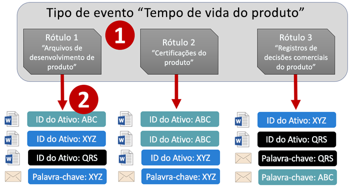
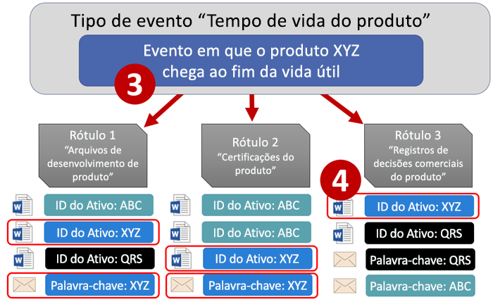
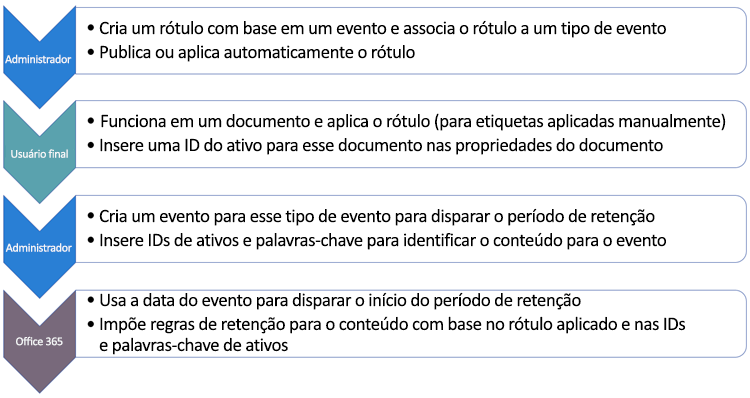
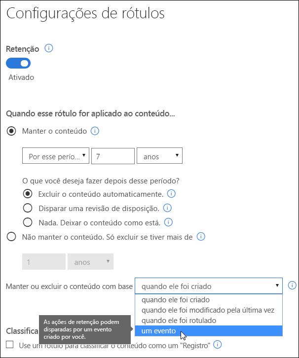
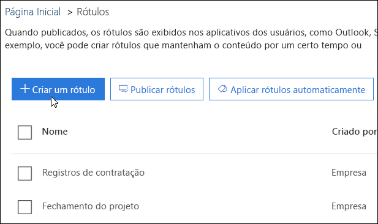
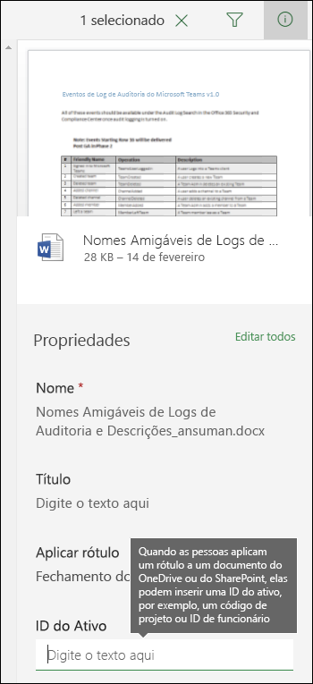
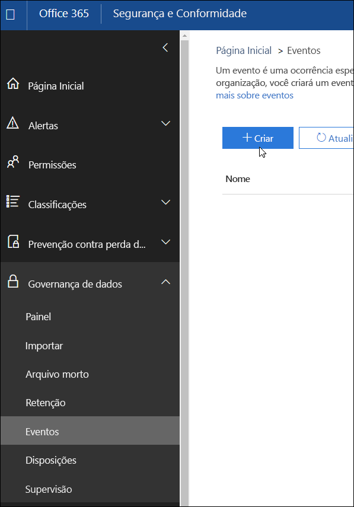
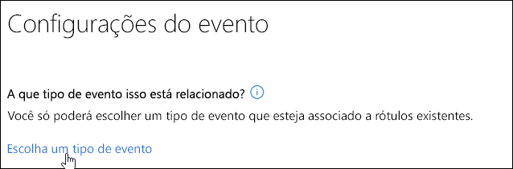
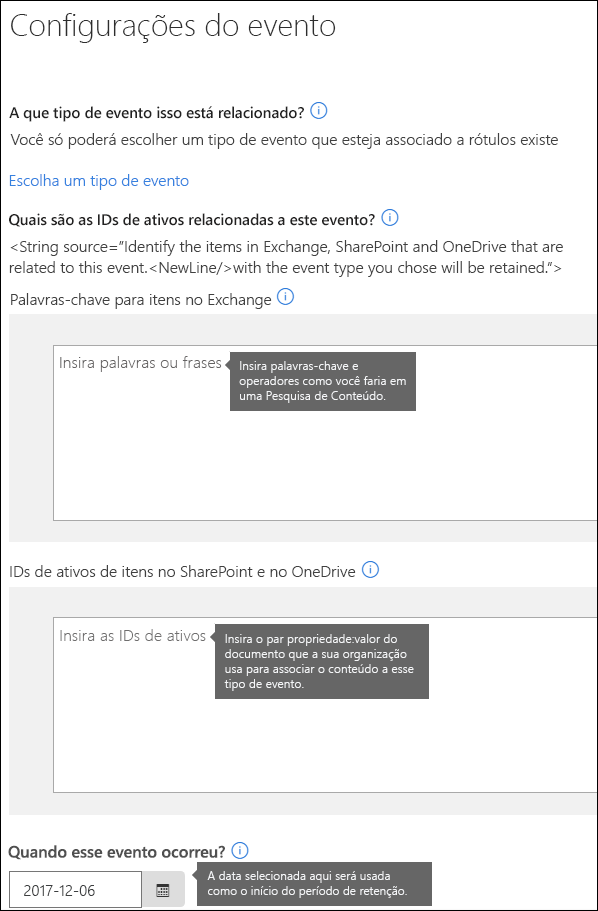

# Visão geral da retenção controlada por eventosOverview of event-driven retention

Quando você retém o conteúdo, o período de retenção normalmente é baseado na idade desse conteúdo. Por exemplo, você pode reter os documentos por sete anos após a criação e, depois disso, excluí-los. Porém, com os rótulos no Office 365, também é possível basear um período de retenção no momento em quando um tipo específico de evento ocorre. O evento dispara o início do período de retenção, e todo o conteúdo com um rótulo aplicado para esse tipo de evento recebe as ações de retenção do rótulo.When you retain content, the retention period is often based on the age of the content - for example, you might retain documents for seven years after they're created and then delete them. But with labels in Office 365, you can also base a retention period on when a specific type of event occurs. The event triggers the start of the retention period, and all content with a label applied for that type of event get the label's retention actions enforced on them.
  
Por exemplo, você pode usar rótulos com a retenção controlada por eventos para:For example, you can use labels with event-driven retention for:
  
- **Funcionários que estão saindo da organização** Vamos supor que os registros devam ser retidos por dez anos após um funcionário sair da organização. Decorridos os dez anos, é necessário descartar todos os documentos relacionados à contratação, desempenho e rescisão desse funcionário. O evento que aciona o período de retenção de dez anos é a saída do funcionário da organização.**Employees leaving the organization** Suppose that employee records must be retained for 10 years from the time an employee leaves the organization. After 10 years elapse, all documents related to the hiring, performance, and termination of that employee need to be disposed. The event that triggers the 10-year retention period is the employee leaving the organization. 
    
- **Expiração do contrato** Suponhamos que todos os registros relacionados aos contratos precisem ser retidos por cinco anos a partir da expiração do contrato. O evento que dispara o período de retenção de cinco anos é a expiração do contrato.**Contract expiration** Suppose that all records related to contracts need to be retained for five years from the time the contract expires. The event that triggers the five-year retention period is the expiration of the contract. 
    
- **Vida útil do produto** Talvez sua organização tenha exigências de retenção relacionadas à última data de produção de produtos para determinados conteúdos, como especificações técnicas. Nesse caso, a última data de produção é o evento que dispara o período de retenção.**Product lifetime** Your organization might have retention requirements related to the last manufacturing date of products for content such as technical specifications. In this case, the last manufacturing date is the event that triggers the retention period. 
    
Normalmente, a retenção controlada por eventos é usada como parte de um processo de gerenciamento de registros. Isso significa que:Event-driven retention is typically used as part of a records-management process. This means that:
  
- Geralmente, os rótulos baseados em eventos também classificam o conteúdo como registro. Para saber mais, consulte [Usar a Pesquisa de Conteúdo para localizar todo o conteúdo com um rótulo de retenção específico aplicado](labels.md#using-content-search-to-find-all-content-with-a-specific-retention-label-applied-to-it).Labels based on events also usually classify content as a record. For more information, see [Using Content Search to find all content with a specific retention label applied to it](labels.md#using-content-search-to-find-all-content-with-a-specific-retention-label-applied-to-it).
    
- Um documento declarado como um registro, mas cujo gatilho de evento ainda não aconteceu, é retido indefinidamente (registros não podem ser excluídos permanentemente), até que um evento dispare o período de retenção desse documento.A document that's been declared as a record but whose event trigger has not yet happened is retained indefinitely (records can't be permanently deleted), until an event triggers that document's retention period.
    
- Rótulos com base em eventos frequentemente disparam uma revisão de disposição ao final do período de retenção, para que um gerente de registros possa revisar e descartar manualmente o conteúdo. Para saber mais, consulte [Visão geral das revisões de disposição](disposition-reviews.md).Labels based on events usually trigger a disposition review at the end of the retention period, so that a records manager can manually review and dispose the content. For more information, see [Overview of disposition reviews](disposition-reviews.md).
    
Um rótulo baseado em um evento tem os mesmos recursos que qualquer rótulo no Office 365. Para saber mais, consulte [Visão geral dos rótulos](labels.md).A label based on an event has the same capabilities as any label in Office 365. To learn more, see [Overview of labels](labels.md).
    
## Compreender a relação entre tipos de eventos, rótulos, eventos e IDs de ativosUnderstanding the relationship between event types, labels, events, and asset IDs

Para usar a retenção controlada por eventos, é importante compreender a relação entre tipos de evento, rótulos, eventos e IDs de ativo, conforme ilustrado aqui. Veja uma explicação após o diagrama.To successfully use event-driven retention, it's important to understand the relationship between event types, labels, events, and asset IDs as illustrated here. An explanation follows the diagram.
  

  

  
1. Crie rótulos para tipos diferentes de conteúdo e associe-os a um tipo de evento. Por exemplo, rótulos para tipos diferentes de arquivos e registros de produtos são associados a um tipo de evento chamado Tempo de vida do produto, pois esses registros devem ser retidos por 10 anos a partir do momento em que o produto atinge o final da vida útil.You create labels for different types of content and then associate them with a type of event. For example, labels for different types of product files and records are associated with an event type named Product Lifetime because those records must be retained for 10 years from the time the product reaches its end of life.
    
2. Os usuários (normalmente gerentes de registros) aplicam esses rótulos ao conteúdo e, para documentos do SharePoint e do OneDrive, inserem uma ID de ativo para cada item. Neste exemplo, a ID de ativo é um nome ou um código de produto usado pela organização. Dessa forma, os registros de cada produto recebem um rótulo, e cada registro tem uma propriedade que contém uma ID de ativo. O diagrama representa **todo o conteúdo** de todos os registros de produtos em uma organização, e cada item contém a ID de ativo do produto no qual está o registro.Users (typically records managers) apply those labels to content and (for SharePoint and OneDrive documents) enter an asset ID for each item. In this example, the asset ID is a product name or code used by the organization. Thus, each product's records are assigned a label, and each record has a property that contains an asset ID. The diagram represents **all of the content** for all product records in an organization, and each item bears the asset ID of the product whose record it is. 
    
3. Tempo de vida do produto é o tipo de evento; um produto específico que chega ao fim da vida útil é um evento. Quando ocorre um evento desse tipo, neste caso, quando um produto atinge o final da vida útil, você cria um evento que especifica:Product Lifetime is the event type; a specific product reaching end of life is an event. When an event of that event type occurs - in this case, when a product reaches its end of life - you create an event that specifies:
    
  - Uma ID de ativo (para documentos do SharePoint e do OneDrive)An asset ID (for SharePoint and OneDrive documents)
    
  - Palavras-chave (para itens do Exchange). Neste exemplo, a organização usa um código de produto em mensagens que contêm registros de produto, assim, a palavra-chave para itens do Exchange é igual à ID de ativos de documentos do SharePoint e do OneDrive.Keywords (for Exchange items). In this example, the organization uses a product code in messages containing product records, so the keyword for Exchange items is the same as the asset ID for SharePoint and OneDrive documents.
    
  - A data de ocorrência do evento. Essa data é utilizada como o início do período de retenção. Essa data só pode ser atual ou futura, não uma data passada.The date when the event occurred. This date is used as the start of the retention period. This date can only be the current or a future date, not a past date.
    
4. Após a criação de um evento, a data do evento é sincronizada com todo o conteúdo que apresenta um rótulo desse tipo de evento e que contém a ID de ativo ou uma palavra-chave especificadas. Como ocorre com qualquer rótulo, essa sincronização pode demorar até sete dias. No diagrama acima, o período de retenção de todos os itens marcados em vermelho é acionado, ou seja, quando este produto atinge o final da vida útil, esse evento aciona o período de retenção para registros do produto.After you create an event, that event date is synced to all of the content that has a label of that event type and that contains the specified asset ID or keyword. Like any label, this syncing can take up to 7 days. In the diagram above, all of the items circled in red have their retention period triggered by this event - in other words, when this product reaches its end of life, that event triggers the retention period for that product's records.
    
É importante entender que se você não especificar uma ID de ativo ou palavras-chave para um evento, o período de retenção de **todo o conteúdo** com um rótulo desse tipo de evento será disparado pelo evento. Isso significa que, no diagrama acima, todo o conteúdo seria retido. Talvez essa não seja sua intenção.It's important to understand that if you don't specify an asset ID or keywords for an event, **all of the content** with a label of that event type will have its retention period triggered by the event. This means that in the diagram above, all of the content would start being retained. This may not be what you intend. 
  
Por fim, lembre-se de que cada rótulo tem suas próprias configurações de retenção. Neste exemplo, todos especificam 10 anos, mas é possível que um evento acione rótulos com períodos de retenção diferentes.Finally, remember that each label has its own retention settings. In this example, they all specify 10 years, but it's possible for an event to trigger labels where each label has a different retention period.
  
## Como configurar a retenção controlada por eventosHow to set up event-driven retention

Este é o fluxo de trabalho de nível superior para retenção controlada por eventos. Consulte etapas mais detalhadas abaixo.Here's the high-level workflow for event-driven retention. More detailed steps follow below.
  

  
### Etapa 1: Criar um rótulo cujo período de retenção seja baseado em um eventoStep 1: Create a label whose retention period is based on an event

No Centro de Conformidade e Segurança, na navegação à esquerda, em **Classificações**, escolha **Rótulos** \> **Criar um rótulo**.In the Security &amp; Compliance Center, in the left navigation, under **Classifications**, choose **Labels** \> **Create a label**.
  
Ao criar o rótulo, ative a retenção e escolha a opção exibida abaixo para reter ou excluir o conteúdo com base em um evento. Isso significa que as configurações de retenção não entrarão em vigor até a Etapa 5, quando você criar um evento na página **Eventos**.When you create the label, turn on retention, and then choose the option shown below to retain or delete the content based on an event. This means that the retention settings won't go into effect until Step 5, when you create an event on the **Events** page. 
  
Observe que a retenção controlada por eventos geralmente é usada para o conteúdo classificado como registro. Por esse motivo, ao criar rótulos com base em um evento, você normalmente escolhe a opção **Usar rótulo para classificar o conteúdo como um "Registro"**.Note that event-driven retention is typically used for content that's classified as a record. For this reason, when you create labels based on an event, you typically choose the option to **Use label to classify content as a "Record"**.
  
Saiba também que a retenção controlada por eventos exige configurações de retenção que:Also note that event-driven retention requires retention settings that:
  
- Retêm o conteúdo.Retain the content.
    
- Excluem o conteúdo automaticamente, ou acionam uma revisão de disposição ao final do período de retenção.Delete the content automatically or trigger a disposition review at the end of the retention period.
    

  
### Etapa 2: Escolher um tipo de evento para esse rótuloStep 2: Choose an event type for that label

Nas configurações de rótulo, após escolher a opção para basear o rótulo em **um evento**, você verá a opção **Escolher um tipo de evento**. Um tipo de evento é simplesmente uma descrição geral de um evento ao qual você deseja associar um rótulo.In the label settings, after you choose the option to base the label on **an event**, you'll see the option to **Choose an event type**. An event type is simply a general description of an event that you want to associate a label with.
  
Por exemplo, se você criar um evento chamado Tempo de vida do produto, criará os rótulos baseados em eventos com nomes que descrevem a quais tipos de conteúdo você deseja aplicar os rótulos, como "Arquivos de desenvolvimento de produto" ou "Registros de decisões comerciais sobre o produto".For example, if you create an event type named Product Lifetime, you'll create event-based labels with names that describe what types of content you want the labels to be applied to, such as "Product development files" or "Product business decision records".
  
Observe que após escolher um tipo de evento e criar o rótulo, o tipo de evento não pode ser alterado.Note that once you choose an event type and create the label, the event type cannot be changed.
  

  
### Etapa 3: Publicar ou aplicar automaticamente o rótuloStep 3: Publish or auto-apply the label

Assim como com qualquer rótulo, você precisa publicar ou aplicar automaticamente um rótulo baseado em eventos, para que seja aplicado manual ou automaticamente ao conteúdo. Faça isso na página **Rótulos**. Note que os rótulos que classificam o conteúdo como registro só podem ser publicados e aplicados manualmente ao conteúdo; não é possível aplicá-los automaticamente ao conteúdo.Just like any label, you need to publish or auto-apply an event-based label, so that it's manually or automatically applied to content. Do this on the **Labels** page. Note that labels that classify content as a record can only be published and manually applied to content; they can't be auto-applied to content. 
  

  
### Etapa 4: Inserir uma ID de ativoStep 4: Enter an asset ID

Após a aplicação de um rótulo controlado por evento ao conteúdo, você pode inserir uma ID de ativo para cada item. Por exemplo, sua organização pode usar:After an event-driven label is applied to content, you can enter an asset ID for each item. For example, your organization might use:
  
- Códigos de produto que você pode usar para reter o conteúdo apenas de um produto específico.Product codes that you can use to retain content for only a specific product.
    
- Códigos de projeto que você pode usar para reter o conteúdo apenas de um projeto específico.Project codes that you can use to retain content for only a specific project.
    
- IDs de funcionário que você pode usar para reter o conteúdo apenas de uma pessoa específica.Employee IDs that you can use to retain content for only a specific person.
    
Compreenda que a ID de ativo é simplesmente outra propriedade do documento no SharePoint e no OneDrive for Business. Talvez sua organização já use outras propriedades e IDs de documento para classificar o conteúdo. Se este for o caso, você também pode usar essas propriedades e valores ao criar um evento; consulte a Etapa 6 abaixo. O importante é que sua organização deve usar uma combinação de propriedade e valor nas propriedades do documento para associar esse item a um tipo de evento.Understand that Asset ID is simply another document property in SharePoint and OneDrive for Business. Your organization may already use other document properties and IDs to classify content. If so, you can also use those properties and values when you create an event - see Step 6 below. The important point is that your organization must use some property:value combination in the document properties to associate that item with an event type.
  

  
### Etapa 5: Criar um eventoStep 5: Create an event

Quando uma instância específica desse tipo de evento ocorrer, por exemplo, um produto atingir o final da vida útil, acesse a página Eventos no Centro de Conformidade e Segurança e crie um evento. Você precisa acionar manualmente um evento por meio da criação dele.When a particular instance of that event type occurs - for example, a product reaches its end of life - go to the Events page in the Security &amp; Compliance Center and create an event. You need to manually trigger an event by creating it.
  

  
### Etapa 6: Escolher o mesmo tipo de evento usado pelo rótulo na Etapa 2Step 6: Choose the same event type used by the label in step 2

Ao criar o evento, escolha o mesmo tipo de evento usado pelo rótulo na Etapa 2. Por exemplo, Tempo de vida de produto. Somente o conteúdo com rótulos desse tipo de evento aplicados terão o período de retenção acionado.When you create the event, choose the same event type used by the label in step 2 - for example, Product Lifetime. Only content with labels applied to it of that event type will have its retention period triggered.
  

  
### Etapa 7: Inserir palavras-chave ou IDs de ativoStep 7: Enter keywords or an asset ID

Agora, restrinja o escopo do conteúdo especificando as IDs de ativo para o conteúdo do SharePoint e do OneDrive ou palavras-chave para conteúdo do Exchange. Para IDs de ativo, a retenção será imposta somente no conteúdo com o par de propriedade:valor especificado. Se uma ID de ativo não for inserida, **todo o conteúdo** com rótulos desse tipo de evento receberá a mesma data de retenção.Now you narrow the scope of the content by specifying asset IDs for SharePoint and OneDrive content or keywords for Exchange content. For asset IDs, retention will be enforced only on content with the specified property:value pair. If an asset ID is not entered, **all of the content** with labels of that event type get the same retention date applied to them. 
  
Compreenda que a ID de ativo é simplesmente outra propriedade de documento no SharePoint e no OneDrive for Business. Se você estiver usando a propriedade ID de ativo, digite ComplianceAssetID:\<valor\> na caixa de IDs de ativo mostrada abaixo.Understand that Asset ID is simply another document property in SharePoint and OneDrive for Business. If you're using the Asset ID property, you would enter ComplianceAssetID:\<value\> in the box for asset IDs shown below.
  
Talvez sua organização tenha aplicado outras propriedades e IDs aos documentos relacionados a esse tipo de evento. Por exemplo, se você precisar detectar os registros de um produto específico, a ID poderá ser uma combinação de sua propriedade personalizada, ProductID, e o valor "XYZ". Nesse caso, você digitaria ProductID:XYZ na caixa de IDs de ativo mostrada abaixo.Your organization might have applied other properties and IDs to the documents related to this event type. For example, if you need to detect a specific product's records, the ID might be a combination of your custom property ProductID and the value "XYZ". In this case, you'd enter ProductID:XYZ in the box for asset IDs shown below.
  
Para itens do Exchange, você pode incluir palavras-chave. Refine a consulta usando os operadores de pesquisa E, OU e NÃO. Para saber mais sobre operadores, veja [Consultas de palavra-chave e condições de pesquisa para Pesquisa de Conteúdo](keyword-queries-and-search-conditions.md).For Exchange items, you can include keywords. You can refine your query by using search operators like AND, OR, and NOT. For more information on operators, see [Keyword queries and search conditions for Content Search](keyword-queries-and-search-conditions.md).
  
Por fim, escolha a data de ocorrência do evento; essa data é usada como o início do período de retenção. Após a criação de um evento, essa data de evento é sincronizada com todo o conteúdo que tem um rótulo desse tipo de evento, ID de ativo e palavras-chave. Como ocorre com qualquer rótulo, essa sincronização pode demorar até sete dias.Finally, choose the date when the event occurred; this date is used as the start of the retention period. After you create an event, that event date is synced to all of the content with a label of that event type, asset ID, and keywords. Like any label, this syncing can take up to 7 days.
  

  
## Usar a Pesquisa de Conteúdo para localizar todo o conteúdo com um rótulo ou ID de ativo específicosUse Content Search to find all content with a specific label or asset ID

Após a atribuição dos rótulos ao conteúdo, você pode usar a pesquisa de conteúdo no Centro de Conformidade e Segurança para localizar todo o conteúdo classificado com um rótulo específico ou que contenha uma ID de ativo específica.After labels are assigned to content, you can use content search in the Security &amp; Compliance Center to find all content that's classified with a specific label or that contains a specific asset ID.
  
Ao criar uma pesquisa de conteúdo:When you create a content search:
  
- Para localizar todo o conteúdo com um rótulo específico, escolha a condição **Marca de conformidade** e, em seguida, insira o nome completo do rótulo ou parte do nome do rótulo e use um caractere curinga.To find all content with a specific label, choose the **Compliance Tag** condition, and then enter the complete label name or part of the label name and use a wildcard. 
    
- Para localizar todo o conteúdo com uma ID de ativo específica, insira a propriedade **ComplianceAssetID** e um valor, por exemplo, ComplianceAssetID:\<valor\>.To find all content with a specific asset ID, enter the **ComplianceAssetID** property and a value, like ComplianceAssetID:\<value\>. 
    
Para saber mais, veja [Consultas de palavra-chave e condições de pesquisa para Pesquisa de Conteúdo](keyword-queries-and-search-conditions.md).For more information, see [Keyword queries and search conditions for Content Search](keyword-queries-and-search-conditions.md).
  
## PermissõesPermissions

Para acessar a página **Eventos**, os revisores devem ser membros de um grupo com a função **Gerenciamento de disposição** e a função **Logs de auditoria somente para exibição**. Recomendamos criar um novo grupo de funções denominado Revisores de disposição, adicionar essas duas funções a esse grupo e incluir membros ao grupo de funções.To get access to the **Events** page, reviewers must be members of a role group with the **Disposition Management** role and the **View-Only Audit Logs** role. We recommend creating a new role group called Disposition Reviewers, adding these two roles to that role group, and then adding members to the role group. 
  
Para saber mais, consulte [Dar aos usuários acesso ao Centro de Conformidade e Segurança do Office 365](grant-access-to-the-security-and-compliance-center.md).For more information, see [Give users access to the Office 365 Security &amp; Compliance Center](grant-access-to-the-security-and-compliance-center.md).
  
## Automatizar eventos usando o PowerShellAutomate events by using PowerShell

No Centro de Conformidade e Segurança do Office 365, você só pode criar eventos manualmente; não é possível acionar automaticamente um evento. No entanto, você pode usar um script do PowerShell para automatizar a retenção com base em eventos de seus aplicativos de negócios.In the Office 365 Security &amp; Compliance Center, you can only create events manually; it's not possible to automatically trigger an event when it occurs. However, you can use a PowerShell script to automate event-based retention from your business applications.
  
No momento, estamos trabalhando em APIs que permitam a conexão de seus aplicativos comerciais (como RH, CRM ou aplicativos financeiros) com a retenção controlada por eventos. Por exemplo, você poderá conectar seu sistema de RH à retenção controlada por eventos, assim, quando um funcionário deixar a organização, um evento desse tipo será acionado automaticamente.We are currently working on APIs, so that you can connect your business applications (such as HR, CRM, or financial applications) to event-driven retention. For example, you'll be able to connect your HR system to event-driven retention, so that when an employee leaves the organization, and event of that event type is automatically triggered.
  
Enquanto isso, estes são os cmdlets do PowerShell disponíveis para retenção controlada por eventos:Until then, here are the PowerShell cmdlets available for event-driven retention:
  
- [Get-ComplianceRetentionEventTypeGet-ComplianceRetentionEventType](https://go.microsoft.com/fwlink/?linkid=873002)
    
- [New-ComplianceRetentionEventTypeNew-ComplianceRetentionEventType](https://go.microsoft.com/fwlink/?linkid=873004)
    
- [Remove-ComplianceRetentionEventTypeRemove-ComplianceRetentionEventType](https://go.microsoft.com/fwlink/?linkid=873005)
    
- [Set-ComplianceRetentionEventTypeSet-ComplianceRetentionEventType](https://go.microsoft.com/fwlink/?linkid=873006)
    
- [Get-ComplianceRetentionEventGet-ComplianceRetentionEvent](https://go.microsoft.com/fwlink/?linkid=873001)
    
- [New-ComplianceRetentionEventNew-ComplianceRetentionEvent](https://go.microsoft.com/fwlink/?linkid=873003)
    

