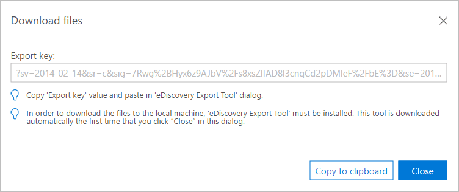

# Exportar resultados na descoberta eletrônica avançada do Office 365

> [!NOTE]
> A Descoberta Eletrônica Avançada exige um Office 365 E3, com um complemento de Conformidade Avançada ou uma assinatura do E5 para sua organização. Se você não tiver esse plano e quiser tentar a Descoberta Eletrônica Avançada, poderá [Inscrever-se para uma avaliação do Office 365 Enterprise E5](https://go.microsoft.com/fwlink/p/?LinkID=698279). 
  
Este tópico descreve as opções avançadas de configuração de exportação de descoberta eletrônica.
  
 **Neste tópico:**
  
- [Definindo lotes de exportação e sessões](export-results-in-advanced-ediscovery.md#BK_Define)
    
- [Exportações incrementais e adicionais](export-results-in-advanced-ediscovery.md#BK_IncrementalReports)
    
- [Configurar parâmetros de exportação em lote](export-results-in-advanced-ediscovery.md#BK_SetUpExport)
    
- [Exportar arquivos de saída de relatório](export-results-in-advanced-ediscovery.md#BK_ExportOutputFIles)
    
## Definindo lotes de exportação e sessões

Um lote de exportação permite o processamento de exportação usando um conjunto de parâmetros definidos. A descoberta eletrônica avançada permite que você defina lotes para personalizar cada exportação.
  
Os parâmetros são definidos por lote de exportação. Um lote chamado "exportar lote 01" é criado por padrão para o primeiro lote de uma ocorrência. Você também pode editar o nome e a descrição do lote.
  
Uma sessão de exportação é uma execução de exportação de descoberta eletrônica avançada em um lote de exportação.
  
## Exportações incrementais e adicionais

Você pode executar várias sessões de exportação dentro de um lote de exportação, para garantir resultados consistentes baseados no mesmo modelo de exportação e parâmetros. Para cada sessão em um lote, você pode exportar análises para dados de caso recém processados e processar cada "incrementalmente".
  
Para exportar usando um conjunto diferente de parâmetros, primeiro é necessário criar um novo lote. A primeira sessão no novo lote produzirá resultados para os arquivos processados no caso, até o momento, se esses arquivos foram importados e processados em uma ou várias importações. Cada lote recalcula pivôs, semelhanças, inclusive, etc. As sessões usam os parâmetros definidos para o lote e não recalculam pivôs, semelhanças, inclusive, etc. para cada execução de sessão.
  
Por exemplo, suponha que um caso foi importado e seus dados analisados. Para recuperar as duplicatas e os resultados de encadeamento de emails próximos aos dados incrementais, clique em **criar sessão de exportação** no mesmo lote usado anteriormente para exportar os dados. 
  
## Configurar parâmetros de exportação em lote

A ferramenta de exportação de descoberta eletrônica é usada para exportar resultados de pesquisa de descoberta eletrônica avançada para seu computador local. Para aumentar a produtividade da transferência de dados e acelerar o processo de exportação, você pode definir uma configuração do registro do Windows no computador que você usa para exportar os resultados da pesquisa. Se quiser aumentar a velocidade de download, configure a configuração do registro antes de configurar os parâmetros de exportação. Para obter mais informações, consulte [aumentar a velocidade de download ao exportar resultados de pesquisa de descoberta eletrônica do Office 365](increase-download-speeds-when-exporting-ediscovery-results.md).
  
1. Em descoberta eletrônica avançada, selecione um caso e clique em **Configurar** **exportação** \> .
    
    - Na lista **Exportar lote** , selecione o nome do lote ou exportar os resultados para exportar o lote 01 (o lote padrão). 
    
    - Para exportar resultados para novos arquivos que você adicionou a um caso existente, continue com seu lote atual. Para criar uma sessão no lote, selecione o mesmo número de lote e clique em **criar sessão de exportação** você pode usar essa opção para exportar os mesmos parâmetros que o lote anterior, de forma incremental. 
    
    - Para exportar para um novo lote, clique em **Adicionar** de adição e insira um novo nome em **lote** (ou aceite o padrão) e uma descrição na **Descrição em lote**. Clique em **OK**.
    
    - Para editar um nome de lote ou descrição, selecione o nome **em lote de exportação**, clique em](media/3d613660-7602-4df2-bdb9-14e9ca2f9cf2.png) **Editar** ![ícone de edição e modifique os campos.
    
      > [!NOTE]
      > Depois de executar sessões para um lote de exportação, elas não podem ser excluídas. Além disso, apenas alguns parâmetros podem ser editados depois que a primeira sessão é executada. 
  
    - Para criar um lote de exportação duplicado, escolha o **lote**  um ícone de lote de exportação duplicado e insira um nome e uma descrição para o lote duplicado no painel. 
    
    - Para excluir um lote de exportação, escolha **excluir** de lote de exportação.
    
    - Para exibir o histórico de um lote, escolha **** histórico de exibição do histórico de lotes.
    
2. Em **população**, selecione **incluir somente os arquivos acima da classificação** de recorte de relevância e/ou refinar **lote de exportação** se quiser ajustar as configurações para o lote de exportação. 
    
3. Se você selecionar **incluir somente os arquivos acima da Pontuação**de reCorte de relevância, o **problema** será habilitado. Se a pontuação de relevância do arquivo for maior do que a pontuação de recorte do problema selecionado, o arquivo será exportado, a menos que seja excluído pelo filtro "para revisão". 
  
    Se você selecionar **refinar lote de exportação**, os botões de opção de eliminação **de duplicação** e filtro por "para revisão" estão habilitados. Se você escolher **** a eliminação da duplicação, os arquivos duplicados serão filtrados de acordo com a política definida [nível de caso (padrão): a partir de cada conjunto de arquivos duplicados em todo o caso, todos os arquivos, exceto um, serão eliminados da duplicação. Nível do responsáveis: de cada conjunto de arquivos duplicados do mesmo mesmo, todos os arquivos, exceto um, serão eliminados.] A saída de exportação contém um registro de todos os arquivos duplicados. Se você escolher **Filtrar por "para revisão"** , selecione **Modificar em metadados** para inserir as configurações de campo **"para revisão"** . Selecione **incluir arquivos de entrada** para incluir arquivos de origem no conteúdo do pacote. Você pode desmarcar essa configuração para acelerar o processo de exportação. Observe que os arquivos nativos serão exportados em qualquer caso. 
    
4. Em **metadados**, selecione uma das seguintes opções na lista **Exportar modelo** (uma vez por sessão). 
    
    - **Standard**: conjunto básico de itens de dados, metadados e propriedades. Use essa opção quando a importação de dados já foi processada em descoberta eletrônica avançada e os dados de exportação são carregados em um sistema que já contém os arquivos. Por padrão, as colunas exportar modelo são criadas e preenchidas.
    
    - **All**: conjunto completo de metadados padrão, incluindo todos os dados de processamento, bem como as pontuações de análise e relevância. Este modelo é obrigatório quando a descoberta eletrônica avançada realiza o processamento e os dados de arquivo são carregados para um sistema externo pela primeira vez.
    
    - **Problemas**: selecione **todos os problemas** ou selecione um determinado problema que você criou. 
    
5. Em **destino**:
    
    - **Baixar para o computador local**
    
    - **Exportar para o blob do Azure definido pelo usuário**: se estiver selecionado, você poderá especificar uma URL de contêiner e um token SAS.
    
      > [!NOTE]
      > Depois que um pacote de exportação é armazenado para o blob do Azure definido pelo usuário, os dados não são mais gerenciados pela descoberta eletrônica avançada; é gerenciado pelo blob do Azure. Isso significa que, se você excluir o caso, os arquivos exportados ainda permanecerão no blob do Azure. 
  
    - **Salvar token SAS para sessão de exportação futura**: se estiver marcada, o token SAS será criptografado no banco de dados interno da descoberta eletrônica avançada para uso futuro.
    
      > [!NOTE]
      > No momento, o token SAS expira após um mês. Se você tentar baixar após mais de um mês, será necessário desfazer a última sessão e exportar novamente. 
  
6. Clique em **Modificar** para definir as configurações de campo "para revisão". 
    
    
  
   - Em **configurações do campo de revisão**, na lista suspensa **selecionar cenário** , selecione o cenário e o escopo da revisão. As configurações são exibidas com base na seleção.
    
      - **Examinar tudo** (padrão): todos os emails, anexos e documentos são selecionados por padrão. 
    
      - **Examinar todo o conteúdo exclusivo em um conjunto**: inclusive cópias inclusivas e exclusivas, anexos exclusivos no nível do conjunto de emails, representativos de cada conjunto de duplicatas exatas.
    
      - **Revise todo o conteúdo exclusivo em um conjunto-sem cópias inclusivas**: inclusive anexos exclusivos no nível do conjunto de emails, representados de cada conjunto de duplicatas exatas.
    
      - **Revise todo o conteúdo exclusivo e os arquivos da família relacionados**: inclusive os anexos exclusivos no nível do conjunto de emails, representativos de cada conjunto de duplicatas exatas, expanda para incluir arquivos da família.
    
      - **Personalizado** (permite que você defina as opções na caixa de diálogo): o padrão é manter as seleções atuais e habilitar todas as opções da caixa de diálogo, para permitir sua seleção. Se você selecionar essa opção, poderá personalizar as configurações de emails, documentos, anexos e diversos.
    
    - Em **emails**, selecione os emails que você deseja exportar.
    
      - **Todos os emails**: (padrão) todos os emails são selecionados.
    
      - **Inclusive**: um email inclusivo é um último email de um thread e contém todos os outros emails do thread.
    
      - **Inclusive cópias inclusivas e exclusivas**: cópias inclusivas e inclusivas com o mesmo assunto, corpo e anexos; cópias exclusivas inclusive são cópias exclusivas desses emails.
    
    - Em **documentos**, selecione os documentos que você deseja exportar. 
    
      - **Todos os documentos**: (padrão) todos os documentos são selecionados.
    
      - **Pivôs**: um arquivo escolhido como representante de conjuntos de duplicatas aproximados, que normalmente é usado como a linha de base ao examinar o conjunto.
    
      - **Representa o representante de cada conjunto de duplicatas exatas**: Arquivos únicos quase duplicados (incluindo a tabela dinâmica).
    
    - Em **anexos**, selecione os anexos que você deseja exportar. 
    
      - **Todos os anexos**: (padrão) todos os anexos são selecionados.
    
      - **Anexo exclusivo no nível do caso**: Arquivos de anexo exclusivos dentro do caso especificado.
    
      - **Anexo exclusivo no nível do conjunto de emails**: Arquivos de anexo exclusivos dentro do caso de email especificado.
    
   - Em**Micellaneous**, você pode optar por **tratar anexos como documentos**, **tratar emails como documentos**ou **expandir para incluir arquivos da família**. Ao escolher **expandir para incluir arquivos da família**, para cada arquivo sinalizado para revisão, todos os arquivos da mesma família também serão sinalizados.
    
7. Escolha **salvar** para salvar as configurações. 
    
8. Depois de especificar os parâmetros de exportação, para iniciar o lote de exportação, clique em **criar sessão de exportação**.
    
    Durante a exportação, o status é exibido no **status da tarefa**. Os resultados são exibidos no **Resumo de exportação**.
    
9. Na janela **baixar arquivos** , clique em **copiar para área de transferência** para copiar a chave de exportação. 
    
    
  
10. Clique em **Fechar**. 
    
    A ferramenta de exportação de descoberta eletrônica é iniciada.
    
    
  
11. Na **ferramenta de exportação de descoberta eletrônica**:
    
    -  Em **colar a assinatura de acesso compartilhado que será usada para se conectar à fonte**, Cole a chave de exportação que youcopied para a área de transferência na etapa 7.
    
    - Clique em **procurar** para selecionar o local de destino para armazenar os arquivos de exportação baixados na máquina local. 
    
    - Clique em **Iniciar**. Os arquivos de exportação são baixados para a máquina local. Se você escolher **exportar para o blob do Azure definido pelo usuário** na etapa 4, a sessão será exportada para um destino de URL de armazenamento blob de sua escolha.
    
Para obter uma descrição completa dos campos no relatório de exportação, confira [Exportar campos de relatório](export-report-fields-in-advanced-ediscovery.md).
  
## Exportar arquivos de saída de relatório

A tabela a seguir lista os arquivos de saída que são gerados quando você executa um lote de exportação.
  
|**Nome do arquivo**|**Tipo de arquivo**|**Descrição**|
|:-----|:-----|:-----|
|Resumo de exportação    |Limit    |Um arquivo de log gerado pela ferramenta de exportação de descoberta eletrônica.    |
|Rastrear    |txt    |Um arquivo de log gerado pela ferramenta de exportação de descoberta eletrônica.    |
|Arquivos de texto extraídos    |Pasta de arquivo    |Pasta que contém os arquivos de texto extraídos dos arquivos exportados.    |
|Entrada ou arquivos nativos    |Pasta de arquivo    |Pasta que contém os arquivos nativos e de entrada dos arquivos exportados.    |
|Exportar lista    |xlsx    |Metadados de arquivos exPortados no formato xlsx. Os campos nos arquivos são de acordo com o modelo de usuário selecionado para exportação. Se necessário, vários arquivos são criados, cada um contém linhas de 100 150K. Se um determinado valor contiver mais caracteres do que uma célula do Excel pode conter (atualmente, o limite é de 32.767 caracteres), o valor será cortado para o comprimento máximo permitido. Se um valor for cortado, a cor de plano de fundo da célula será vermelha para indicar isso ao usuário. " Participantes de email "é um exemplo de um campo que pode exceder o limite de tamanho, se o email foi enviado para uma distribuição grande. ConFira [Exportar campos de relatório](export-report-fields-in-advanced-ediscovery.md) para obter detalhes sobre os campos de saída.    |
|Carregar arquivo    |Limit    |Metadados de arquivos exPortados no formato CSV para carregar em um aplicativo diferente. Os campos nos arquivos são de acordo com o modelo de usuário selecionado para exportação.    |
|Indicador de êxito    |txt    |Criado somente ao exportar para um blob do Azure de terceiros. Se a exportação tiver êxito completamente, o arquivo será criado. No caso de falha, ou o sucesso parcial, o arquivo não será criado. O arquivo será criado na pasta raiz, permitindo o rastreamento automático em diferentes status de lotes/sessões de exportação. Este é um arquivo vazio. O nome é: TenantId_CaseId_ExternalCaseId_CaseName_ExportBatchId_SessionId_DateTime. txt.    |
   
## Confira também

[Descoberta Eletrônica Avançada do Office 365](office-365-advanced-ediscovery.md)
  
[Exibindo histórico de lotes e exportando resultados passados](view-batch-history-and-export-past-results.md)
  
[Configuração rápida da Descoberta Eletrônica Avançada do Office 365](quick-setup-for-advanced-ediscovery.md)

[Campos do relatório de exportação](export-report-fields-in-advanced-ediscovery.md)
  
[Aumentar a velocidade de download ao exportar resultados de pesquisa de descoberta eletrônica do Office 365](increase-download-speeds-when-exporting-ediscovery-results.md)

