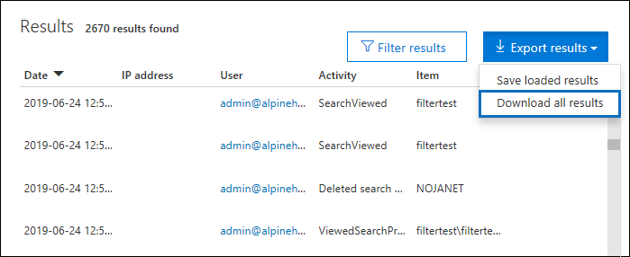

# <a name="export-configure-and-view-audit-log-records"></a>Exportar, configurar e exibir registros de log de auditoria

Depois de Pesquisar o log de auditoria do Office 365 e baixar os resultados da pesquisa em um arquivo CSV, o arquivo contém uma coluna chamada **AuditData**, que contém informações adicionais sobre cada evento. Os dados dessa coluna são formatados como um objeto JSON, que contém várias propriedades que são configuradas como *Propriedade:* pares de valores separados por vírgulas. Você pode usar o recurso de transformação JSON no editor do Power Query no Excel para dividir cada propriedade no objeto JSON na coluna **AuditData** em várias colunas, de modo que cada propriedade tenha sua própria coluna. Isso permite que você classifique e filtre em uma ou mais dessas propriedades, o que pode ajudá-lo a localizar rapidamente os dados de auditoria específicos que você está procurando.

## <a name="step-1-export-audit-log-search-results"></a>Etapa 1: exportar resultados de pesquisa de log de auditoria

A primeira etapa é Pesquisar o log de auditoria e, em seguida, exportar os resultados em um arquivo CSV (valor separado por vírgula) para seu computador local.
  
1. Execute uma [pesquisa de log de auditoria](search-the-audit-log-in-security-and-compliance.md#search-the-audit-log) e revise os critérios de pesquisa, se necessário, até que você tenha os resultados desejados.
    
2. Clique em **Exportar resultados** e selecione **baixar todos os resultados**. 
    
   

   Essa opção para exportar todos os registros de auditoria da pesquisa de log de auditoria que você executou na etapa 1 e baixa os dados brutos do log de auditoria para um arquivo CSV. 

   Uma mensagem é exibida na parte inferior da janela que solicita que você abra ou salve o arquivo CSV. 

3. Clique em **salvar > salvar como** e salve o arquivo CSV no computador local. Leva um tempo para baixar vários resultados de pesquisa. Normalmente, esse é o caso da pesquisa de todas as atividades ou de um intervalo de datas abrangente. Uma mensagem na parte inferior do Windows é exibida quando o arquivo CSV termina de ser baixado.
 
   

> [!NOTE]
  > Você pode baixar um máximo de 50.000 entradas para um arquivo CSV de uma única pesquisa de log de auditoria. Se as entradas 50.000 forem baixadas para o arquivo CSV, provavelmente você poderá supor que há mais de 50.000 eventos que atingiram os critérios de pesquisa. Para exportar mais do que esse limite, tente usar um intervalo de datas para reduzir o número de registros de log de auditoria. Você pode ter que executar várias pesquisas com intervalos de datas menores para exportar mais de 50.000 entradas.

## <a name="step-2-format-the-exported-audit-log-using-the-power-query-editor"></a>Etapa 2: Formatar o log de auditoria exportado usando o editor de consulta de alimentação

A próxima etapa é usar o recurso transformação JSON no editor do Power Query no Excel para dividir cada propriedade no objeto JSON na coluna **AuditData** em sua própria coluna. Em seguida, filtre colunas para exibir registros com base nos valores das propriedades específicas. Isso pode ajudá-lo a localizar rapidamente os dados de auditoria específicos que você está procurando.

1. Abra uma pasta de trabalho em branco no Excel para Office 365, Excel 2019 ou Excel 2016.
    
2.  Na guia **dados** , no grupo **obter & transformar dados de transformação** , clique em **do texto/CSV**.

    

3. Abra o arquivo CSV que você baixou na etapa 1.
    
4. Na janela exibida, clique em **transformar dados**.

   

O arquivo CSV é aberto no **Editor de consultas**. Há quatro colunas: **CreationDate**, **userids**, **operações**e **AuditData**. A coluna **AuditData** é um objeto JSON que contém várias propriedades. A próxima etapa é criar uma coluna para cada propriedade no objeto JSON.
    
5. Clique com o botão direito do mouse no título na coluna **AuditData** , clique em **transformar**e em **JSON**. 
 
   

6. No canto superior direito da coluna **AuditData** , clique no ícone expandir.
    
   

   Uma lista parcial das propriedades nos objetos JSON na coluna **AuditData** é exibida.

7. Clique em **carregar mais** para exibir todas as propriedades nos objetos JSON na coluna **AuditData** .

   

   Você pode desmarcar a caixa de seleção ao lado de qualquer propriedade que você não deseja incluir. A eliminação de colunas que não são úteis para sua investigação é uma boa maneira de reduzir a quantidade de dados exibidos no log de auditoria. 

   > [!NOTE]
   > As propriedades JSON exibidas na captura de tela anterior (depois que você clica em **carregar mais**) são baseadas nas propriedades encontradas na coluna **AuditData** das primeiras 1.000 linhas no arquivo CSV. Se houver diferentes propriedades JSON nos registros após as primeiras 1.000 linhas, essas propriedades (e uma coluna correspondente) não serão incluídas quando a coluna **AuditData** for dividida em várias colunas. Para ajudar a evitar isso, considere executar novamente a pesquisa de log de auditoria e restringir os critérios de pesquisa para que menos registros sejam retornados. Outra solução é filtrar itens na coluna **operações** para reduzir o número de linhas (antes de executar a etapa 5 acima) antes de transformar o objeto JSON na coluna **AuditData** .

8. Execute um dos seguintes procedimentos para formatar o título das colunas adicionadas para cada propriedade JSON selecionada.

    - Desmarque a caixa de seleção **usar nome de coluna original como prefixo** para usar o nome da propriedade JSON como nomes de coluna; por exemplo, **RecordType** ou **sourceFileName**.
    
   - Deixe a caixa de seleção **usar nome de coluna original como prefixo** selecionada para adicionar o prefixo AuditData aos nomes das colunas; por exemplo, **AuditData. RecordType** ou **AuditData. sourceFileName**.

9. Clique em **OK**.
    
    A coluna **AuditData** é dividida em várias colunas. Cada nova coluna corresponde a uma propriedade no objeto JSON AuditData. Cada linha na coluna contém o valor da propriedade. Se a propriedade não contiver um valor, o valor *nulo* será exibido. No Excel, as células com valores nulos estão vazias.
  
10. Na guia **página inicial** , clique em **fechar & carregar** para fechar o editor de consulta de alimentação e abrir o arquivo CSV transformado em uma pasta de trabalho do Excel. 

## <a name="tips-for-exporting-and-viewing-the-audit-log"></a>Dicas para exportar e exibir o log de auditoria

Veja aqui algumas dicas e exemplos de como exportar e exibir o log de auditoria antes e depois de usar o recurso de transformação JSON para dividir a coluna **AuditData** em várias colunas.

- Filtrar a **** coluna RecordType para exibir apenas os registros de um serviço específico do Office 365 ou uma área funcional. Por exemplo, para mostrar eventos relacionados ao compartilhamento do SharePoint, você deve selecionar **14** (o valor de enumeração para registros disparados pelas atividades de compartilhamento do SharePoint). Para obter uma lista dos serviços do Office 365 que correspondem aos valores de enumeração exibidos na **** coluna RecordType, consulte [propriedades detalhadas no log de auditoria do Office 365](detailed-properties-in-the-office-365-audit-log.md).

- Filtrar a coluna **operações** para exibir os registros de atividades específicas. Para obter uma lista de a maioria das operações que correspondem a uma atividade pesquisável na ferramenta de pesquisa de log de auditoria no centro de conformidade de & de segurança, consulte a seção "atividades auditadas" em [Pesquisar o log de auditoria no centro de conformidade do & de segurança](search-the-audit-log-in-security-and-compliance.md#audited-activities).

- Em vez de usar a ferramenta de pesquisa de log de auditoria no centro de conformidade e segurança &, você pode usar o cmdlet [Search-UnifiedAuditLog](https://docs.microsoft.com/powershell/module/exchange/policy-and-compliance-audit/search-unifiedauditlog) no PowerShell do Exchange Online para exportar os resultados de uma pesquisa de log de auditoria do Office 365 para um arquivo CSV. Em seguida, você pode seguir o mesmo procedimento descrito na etapa 2 para formatar o log de auditoria usando o editor de consulta de alimentação. Uma vantagem de usar o cmdlet do PowerShell é que você pode pesquisar eventos de um serviço específico do Office 365 usando o ** parâmetro RecordType. Aqui estão alguns exemplos de como usar o PowerShell para exportar registros de auditoria para um arquivo CSV, para que você possa usar o editor de consulta de alimentação para transformar o objeto JSON na coluna **AuditData** , conforme descrito na etapa 2.

   Neste exemplo, execute os seguintes comandos para retornar todos os registros relacionados às operações de compartilhamento do SharePoint. 
   
   ```
   $auditlog = Search-UnifiedAuditLog -StartDate 06/01/2019 -EndDate 06/30/2019 -RecordType SharePointSharingOperation
   ```

   ```
   $auditlog | Select-Object -Property CreationDate,UserIds,RecordType,AuditData | Export-Csv -Path c:\AuditLogs\PowerShellAuditlog.csv -NoTypeInformation
   ```

   - Os resultados da pesquisa são exportados para um arquivo CSV chamado *PowerShellAuditlog* que contém quatro colunas: CreationDate, userids, RecordType, AuditData).

   - Você pode usar o nome ou o valor de enumeração para o tipo de registro como o ** valor para o parâmetro RecordType. Para obter uma lista de nomes de tipo de registro e seus valores de enumeração correspondentes, consulte a tabela *AuditLogRecordType* no [esquema da API da atividade de gerenciamento do Office 365](https://docs.microsoft.com/office/office-365-management-api/office-365-management-activity-api-schema#enum-auditlogrecordtype---type-edmint32).
   
   - Você só pode incluir um único valor para esse parâmetro. Para pesquisar registros de auditoria para outros tipos de registro, você precisa executar novamente os dois comandos anteriores para especificar um tipo de registro diferente e acrescentar esses resultados ao arquivo CSV original. Por exemplo, você executaria esses dois comandos para adicionar atividades de arquivo do SharePoint do mesmo intervalo de datas ao arquivo PowerShellAuditlog. csv.

       ```
      $auditlog = Search-UnifiedAuditLog -StartDate 06/01/2019 -EndDate 06/30/2019 -RecordType SharePointFileOperation
      ```

      ```
      $auditlog | Select-Object -Property CreationDate,UserIds,RecordType,AuditData | Export-Csv -Append -Path c:\AuditLogs\PowerShellAuditlog.csv -NoTypeInformation
      ```
