# Visão geral do gerenciador de planos de arquivoOverview of file plan manager

O gerenciador de planos de arquivo fornece recursos avançados de gerenciamento de políticas e rótulos de retenção, políticas de rótulos de retenção e oferece uma maneira integrada de percorrer a atividade de rótulos e de rótulo para conteúdo para todo o seu ciclo de vida de conteúdo, desde a criação à colaboração, declaração de registros, retenção e por fim, à disposição.File plan manager provides advanced management capabilities for retention labels and policies, and provides an integrated way to traverse label and label-to-content activity for your entire content lifecycle – from creation, through collaboration, record declaration, retention, and finally disposition.

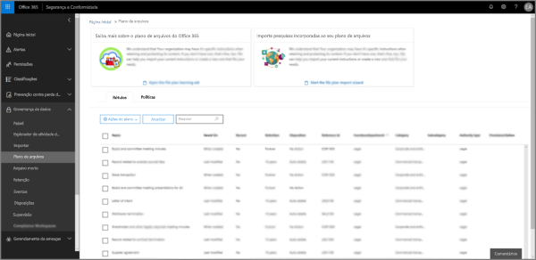

## Acessar o gerenciador de planos de arquivoAccessing file plan manager

Há dois requisitos para acessar o gerenciador de planos de arquivo, que são:There are two requirements to access file plan manager, they are:
- Uma assinatura do Office 365 Enterprise E5.An Office 365 Enterprise E5 subscription.
- O usuário ter recebido uma das seguintes funções do Centro de Conformidade e Segurança:The user has been in assigned one of the following roles of the Security &amp; Compliance Center:
    - Gerenciador de RetençãoRetention Manager
    - Gerenciador de Retenção somente exibiçãoView-only Retention Manager

## Rótulos de retenção e política de rótulos padrãoDefault retention labels and label policy

Se não houver rótulos de retenção na Central de Conformidade e Segurança, na primeira vez que você escolher **Planejamento de Arquivos** na navegação à esquerda, será criada uma política de rótulo chamada **Política Padrão de Publicação de Governança de Dados**.If there are no retention labels in the Security & Compliance Center, the first time you choose **File plan** in the left nav, this creates a label policy called **Default Data Governance Publishing Policy**. 

Esta política de rótulo contém três etiquetas de retenção:This label policy contains three retention labels:

- **Procedimento operacional****Operational procedure**
- **Geral de negócios****Business general**
- **Contrato****Contract agreement**

Estes rótulos de retenção estão configurados apenas para reter conteúdo, e não para excluir conteúdo.These retention labels are configured only to retain content, not delete content. Esta política de rótulos será publicada para toda a organização e poderá ser desativada ou removida.This label policy will be published to the entire organization and can be disabled or removed. 

Você pode determinar quem abriu o gerenciador de planejamento de arquivos e iniciou a primeira experiência de execução examinando as atividades **Política de retenção criada** e **Configuração de retenção criada para uma política de retenção** no log de auditoria.You can determine who opened file plan manager and kicked off the first-run experience by reviewing the audit log for the activities **Created retention policy** and **Created retention configuration for a retention policy**.

> [!NOTE]
> Devido aos comentários dos clientes, removemos esse recurso que cria a política de rótulos de retenção e os rótulos de retenção padrão mencionados acima.Due to customer feedback, we have removed this feature that creates the default retention labels and label policy mentioned above. Você só verá os rótulos de retenção e a política de rótulos de retenção caso tenha aberto o gerenciador de planos de arquivo antes de 11 de abril de 2019.You will only see this policy and labels if you used file plan manager before April 11, 2019.

## Navegar pelo plano de arquivoNavigating your file plan

O gerente de plano de arquivo torna mais fácil ver todas as configurações dos seus rótulos e políticas de retenção no mesmo modo de exibição.File plan manager makes it easier see into and across the settings of all your retention labels and policies from one view.

Observe que os rótulos de retenção criados fora do plano de arquivamento estarão disponíveis no plano de arquivamento e vice-versa.Note that retention labels created outside of the file plan will be available in the file plan and vice versa.

Na guia **rótulos de plano de arquivo**, as seguintes informações e recursos adicionais estão disponíveis:On the **file plan labels** tab, the following additional information and capabilities are available:

### Colunas de configurações de rótuloLabel settings columns

- **Com base em** identifica o tipo de gatilho que iniciará o período de retenção. Os valores válidos estão:**Based on** identifies the type of trigger that will start the retention period. Valid values are:
    - EventoEvent
    - Data de criaçãoWhen created
    - Data da última modificaçãoWhen last modified
    - Data do rótuloWhen labeled
- **Registro** identifica se o item se tornará um registro declarado quando o rótulo for aplicado. Os valores válidos são:**Record** identifies if the item will become a declared record when the label is applied. Valid values are:
    - NãoNo
    - SimYes
    - Sim (Regulatório)Yes(Regulatory)
- **Retenção** identifica o tipo de retenção. Os valores válidos são:**Retention** identifies the retention type. Valid values are:
    - ManterKeep
    - Manter e excluirKeep and delete
    - ExcluirDelete
- **Descarte** identifica o que acontecerá com o conteúdo no final do período de retenção. Os valores válidos são:**Disposition** identifies what will happen to the content at the end of the retention period. Valid values are:
    - nullnull
    - Nenhuma açãoNo action
    - Excluir automaticamenteAuto-delete
    - Revisão obrigatória (também conhecida como revisão de descarte)Review required (aka Disposition review)

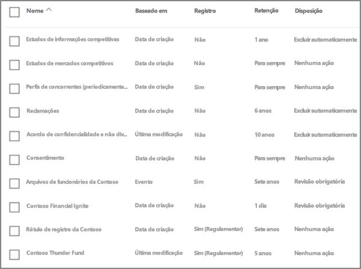

### Colunas de descritores de plano de arquivo de rótulo de retençãoLabel file plan descriptors columns

Agora você pode incluir mais informações na configuração das suas etiquetas de retenção. Inserir descritores de plano de arquivo em rótulos de retenção melhora o gerenciamento e a organização do seu plano de arquivo.You can now include more information in the configuration of your retention labels. Inserting file plan descriptors into labels will improve the manageability and organization of your file plan.

Para começar, o gerenciador de planos de arquivo fornece alguns valores prontos de origem para: Função/departamento, Categoria, Tipo de autoridade e Provisão/citação. Você pode adicionar novos valores descritores de planos de arquivo ao criar ou editar um rótulo de retenção.To get you started, file plan manager provides some out-of-box values for: Function/department, Category, Authority type and Provision/citation. You can add new file plan descriptor values when creating or editing a retention label.

Aqui está uma visão geral da etapa de descritores de plano de arquivo ao criar ou editar um rótulo de retenção.Here's a view of the file plan descriptors step when creating or editing a retention label.

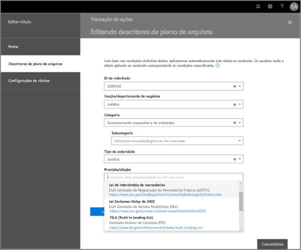

Aqui está um modo de exibição das colunas de descritores de plano de arquivo na guia Rótulos do gerenciador de planos de arquivo.Here's a view of the file plan descriptors columns on the labels tab of file plan manager.

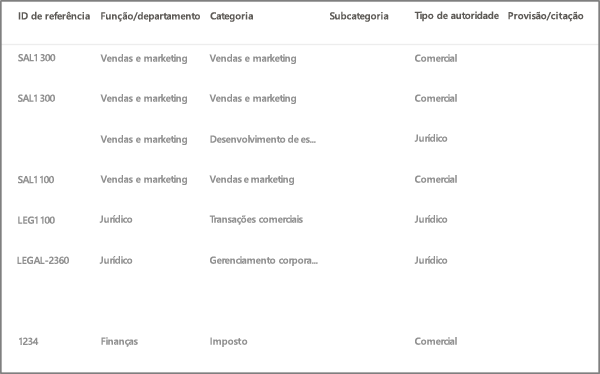

## Exportar todos os rótulos de retenção existentes para analisar e/ou executar revisões offlineExport all existing retention labels to analyze and/or perform offline reviews

No gerenciador de planos de arquivo, você pode exportar os detalhes de todos os rótulos de retenção para um arquivo .csv, para ajudá-lo a facilitar as avaliações de conformidade periódicas com os participantes de governança de dados na sua organização.From file plan manager, you can export the details of all retention labels into a .csv file to assist you in facilitating periodic compliance reviews with data governance stakeholders in your organization.

Para exportar todos os rótulos de retenção, acesse **gerenciador de planos de arquivo** \> **ações de plano de arquivo** \> **exportar rótulos**.To export all retention labels, go to **file plan manager** \> **file plan actions** \> **export labels**.

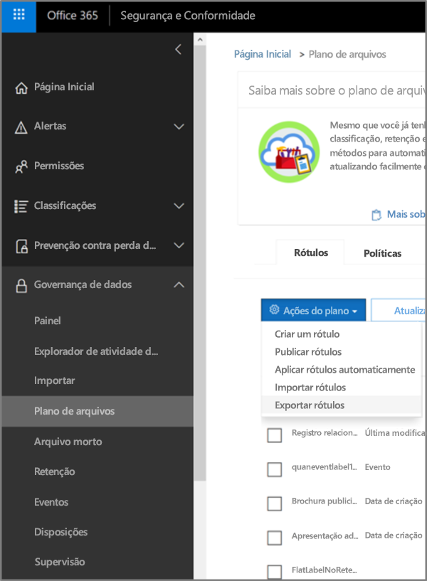

Um arquivo \*.csv que contém todos os rótulos de retenção existentes será aberto.A \*.csv file containing all existing retention labels will open.

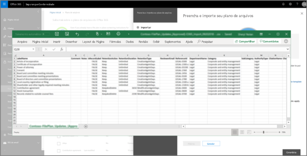

## Importar rótulos de retenção para seu plano de arquivoImport labels into your file plan

No gerenciador de planos de arquivo, você pode importar em massa novos rótulos de retenção, bem como modificar rótulos de retenção existentes.From file plan manager, you can bulk import new labels as well as modify existing retention labels.

Para importar novos rótulos de retenção e atualizar rótulos de retenção existentes, acesse **gerenciador de planos de arquivo** \> **ações de plano de arquivo** \> **importar rótulos**.To import new retention labels and make updates existing retention labels, go to **file plan manager** \> **file plan actions** \> **import labels**.

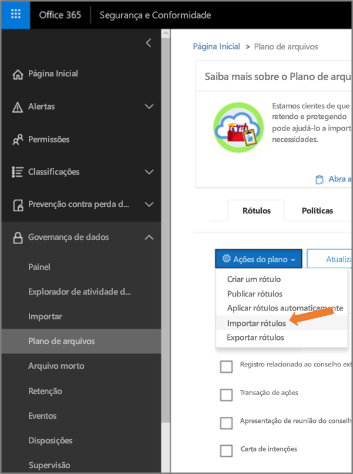

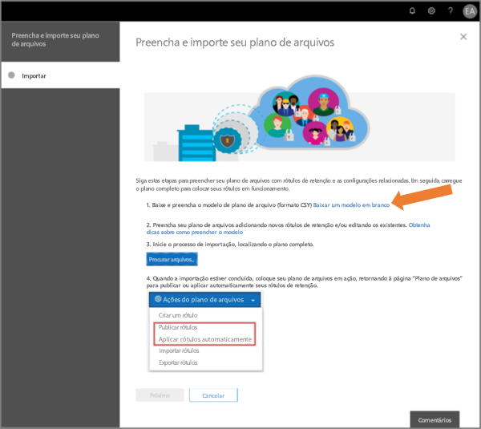

Baixar um modelo em branco (ou começar com base em uma exportação do seu plano de arquivo atual).Download a blank template (or start from an export of your current file plan).

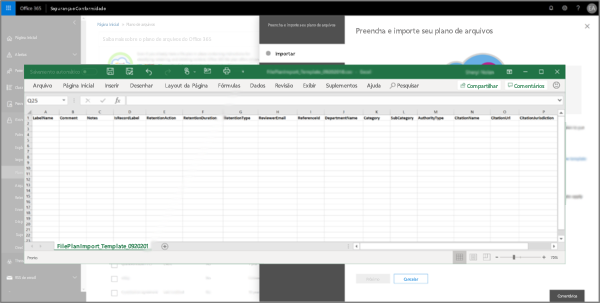

Preencha o modelo (em breve: informações de referência sobre combinações de valores válidas para um único rótulo de retenção).Fill-out the template (coming soon: reference information about valid value combinations for a single retention label).

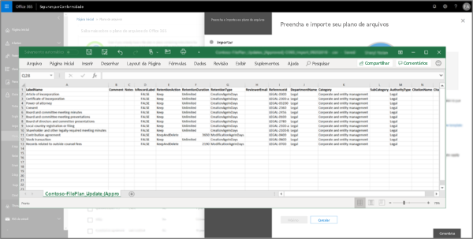

Carregue o modelo preenchido, e o gerenciador de plano de arquivo validará as entradas e exibirá as estatísticas de importação.Upload the filled-out template, and file plan manager will validate the entries and display import statistics.

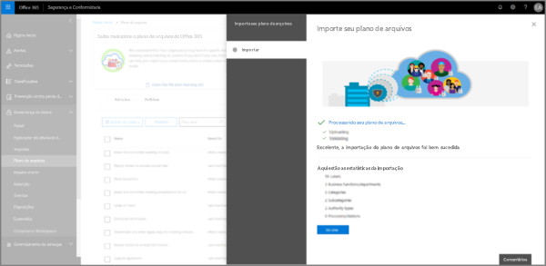

Caso haja um erro de validação, a importação do plano de arquivo continuará a validar todas as entradas no arquivo de importação e exibirá todos os erros ao referenciar números de linha no arquivo de importação, copiar os resultados de erros exibidos para que você possa retornar facilmente ao arquivo de importação e corrigir os erros.In the event there is a validation error, file plan import will continue to validate every entry in the import file and display all errors referencing line/row numbers in the import file, copy the displayed error results so that you can easilly return to the import file and correct the errors. 

Quando a importação for concluída, volte para o gerenciador de planos de arquivo para associar os novos rótulos de retenção a políticas de rótulos de retenção novas ou existentes.When the import is complete, return to file plan manager to assign new labels to new or existing policies.

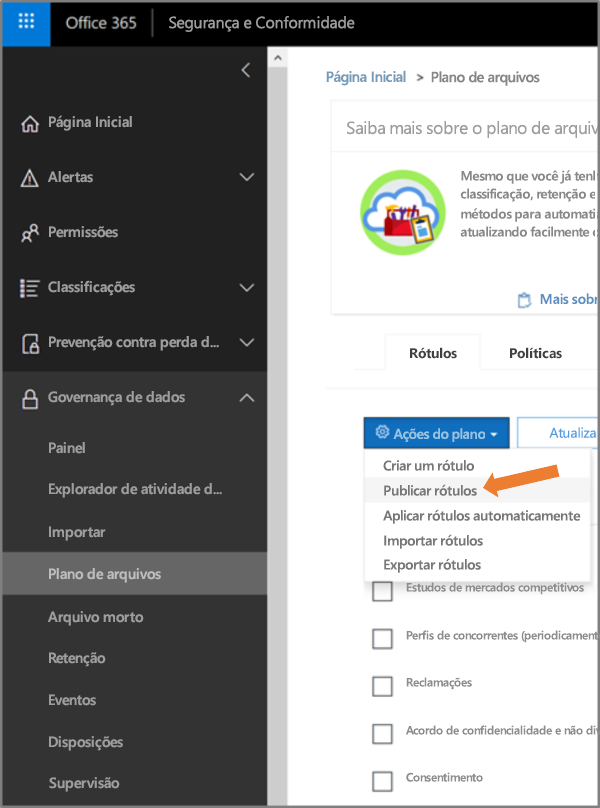

