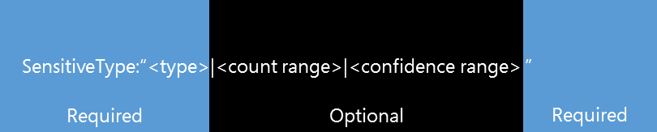

# Criar uma consulta para encontrar dados confidenciais armazenados em sites

Os usuários armazenam frequentemente dados confidenciais em seus sites, como números de cartão de crédito, de previdência social ou pessoais, e com o passar do tempo isso pode expor a organização a um risco significativo de perda de dados. Os documentos armazenados nos sites, incluindo os sites do OneDrive for Business, podem ser compartilhados com pessoas de fora da organização que não deveriam ter acesso às informações. Com a prevenção de perda de dados (DLP) no SharePoint Online, você pode descobrir documentos que contêm dados confidenciais em todo o locatário. Após descobrir os documentos, você pode trabalhar com os proprietários do documento para proteger os dados. Este tópico pode ajudá-lo a formar uma consulta para procurar dados confidenciais.
  
> [!NOTE]
> A descoberta eletrônica, ou eDiscovery, e a DLP são recursos premium que exigem o [SharePoint Online plano 2](https://go.microsoft.com/fwlink/?LinkId=510080). 
  
## Criando uma consulta básica de DLP

Uma consulta básica de DLP é composta por três partes: SensitiveType, intervalo de contagem, e intervalo de confiança. Conforme ilustrado no gráfico a seguir, **sensitivetype:\<"\>Type"** é necessário, e o**|\<intervalo\> de contagem** e o**|\<\> intervalo de confiança** são opcionais. 
  

  
### Tipo confidencial - necessário

Portanto, o que é cada parte? As consultas de DLP do SharePoint normalmente começam `SensitiveType:"` com a propriedade e um nome de tipo de informação do [inventário de tipos de informações confidenciais](https://go.microsoft.com/fwlink/?LinkID=509999)e terminam com um `"`. Você também pode usar o nome de um [tipo de informação confidencial personalizado](create-a-custom-sensitive-information-type.md) que você criou para sua organização. Por exemplo, você pode estar procurando por documentos que contenham números de cartão de crédito. Nesse caso, você usaria o seguinte formato: `SensitiveType:"Credit Card Number"`. Como você não incluiu o intervalo de contagem ou o intervalo de confiança, a consulta retorna todos os documentos nos quais um número de cartão de crédito é detectado. Esta é a consulta mais simples que você pode executar, e a que retorna mais resultados. Tenha em mente que a ortografia e o espaçamento do tipo confidencial são importantes. 
  
### Intervalos - opcionais

Ambas as duas partes seguintes são intervalos, portanto, vamos examinar rapidamente a aparência de um intervalo. Nas consultas de DLP do SharePoint, um intervalo básico é representado por dois números separados por dois pontos, que tem a `[number]..[number]`seguinte aparência:. Por exemplo, se `10..20` for usado, esse intervalo capturaria números de 10 a 20. Existem várias combinações de intervalos e vários são abordados neste tópico. 
  
Vamos adicionar um intervalo de contagem à consulta. Você pode usar o intervalo de contagem para definir o número de ocorrências de informações confidenciais que um documento precisa conter antes de ser incluído nos resultados da consulta. Por exemplo, se você quiser que a consulta retorne apenas documentos que contenham exatamente cinco números de cartão de `SensitiveType:"Credit Card Number|5"`crédito, use:. O intervalo de contagem também pode ajudá-lo a identificar documentos que apresentam níveis elevados de risco. Por exemplo, a sua organização pode considerar documentos com cinco ou mais números de cartão de crédito como de alto risco. Para localizar documentos que estejam ajustando esse critério, você usaria esta `SensitiveType:"Credit Card Number|5.."`consulta:. Como alternativa, você pode encontrar documentos com cinco ou menos números de cartão de crédito usando esta consulta `SensitiveType:"Credit Card Number|..5"`:. 
  
#### Intervalo de confiança

Finalmente, intervalo de confiança é o nível de confiança a que o tipo confidencial detectado corresponde. Os valores de intervalo de confiança funcionam da mesma forma para o intervalo de contagem. É possível formar uma consulta sem incluir uma variedade de contagem. Por exemplo, para pesquisar documentos com qualquer número de números de cartão de crédito, contanto que o intervalo de confiança seja de 85% ou mais — você usaria esta `SensitiveType:"Credit Card Number|*|85.."`consulta:. 
  
> [!IMPORTANT]
> O asterisco ( `*`) é um caractere curinga que significa que qualquer valor funciona. Você pode usar o caractere curinga ( `*`) tanto no intervalo de contagem quanto no intervalo de confiança, mas não em um tipo confidencial. 
  
### Propriedades de pesquisa e operadores de consulta adicionais disponíveis no Centro de Descoberta Eletrônica

DLP no SharePoint também apresenta a propriedade LastSensitiveContentScan, que pode ajudá-lo a Pesquisar arquivos verificados dentro de um período específico. Para obter exemplos de consulta `LastSensitiveContentScan` com a propriedade, consulte os [exemplos de consultas complexas](#examples-of-complex-queries) na próxima seção. 
  
Você pode usar não apenas propriedades específicas de DLP para criar uma consulta, mas também Propriedades de pesquisa de descoberta eletrônica do `Author` SharePoint `FileExtension`padrão, como ou. Você pode usar operadores para criar consultas complexas. Para obter a lista de propriedades e operadores disponíveis, consulte o [usando as propriedades de pesquisa e os operadores com](https://go.microsoft.com/fwlink/?LinkId=510093) postagem do blog de descoberta eletrônica. 
  
## Exemplos

Os exemplos a seguir usam diferentes tipos confidenciais, propriedades e operadores para ilustrar como você pode refinar suas consultas para localizar exatamente o que você está procurando.
  
|**Query**|**Explicação**|
|:-----|:-----|
| `SensitiveType:"International Banking Account Number (IBAN)"`   |O nome pode parecer estranho porque é muito longo, mas é o nome correto para esse tipo confidencial. Certifique-se de usar nomes exatos do [inventário de tipos de informações confidenciais](https://go.microsoft.com/fwlink/?LinkID=509999). Você também pode usar o nome de um [tipo de informação confidencial personalizado](create-a-custom-sensitive-information-type.md) que você criou para sua organização.    |
| `SensitiveType:"Credit Card Number|1..4294967295|1..100"`   |Isso retorna documentos com pelo menos uma correspondência para o tipo confidencial "número de cartão de crédito". Os valores para cada intervalo são os respectivos valores mínimo e máximo. Uma maneira mais simples de escrever essa consulta é `SensitiveType:"Credit Card Number"`, mas onde é a diversão?    |
| `SensitiveType:"Credit Card Number| 5..25" AND LastSensitiveContentScan:"8/11/2018..8/13/2018"`   |Isso retorna documentos com números de cartão de crédito de 5-25 que foram verificados de 11 de agosto de 2018 até 13 de agosto de 2018.    |
| `SensitiveType:"Credit Card Number| 5..25" AND LastSensitiveContentScan:"8/11/2018..8/13/2018" NOT FileExtension:XLSX`   |Isso retorna documentos com números de cartão de crédito de 5-25 que foram verificados de 11 de agosto de 2018 até 13 de agosto de 2018. Arquivos com uma extensão XLSX não são incluídos nos resultados da consulta.  `FileExtension`é uma das muitas propriedades que você pode incluir em uma consulta. Para obter mais informações, consulte [usando propriedades e operadores de pesquisa com o eDiscovery](https://go.microsoft.com/fwlink/?LinkId=510093).    |
| `SensitiveType:"Credit Card Number" OR SensitiveType:"U.S. Social Security Number (SSN)"`   |Isso retornará documentos que contenham um número de cartão de crédito ou um número de previdência social.    |
   
## Exemplos

Nem todas as consultas são criadas da mesma forma. A tabela a seguir fornece exemplos de consultas que não funcionam com DLP no SharePoint e descreve o porquê.
  
|**Consulta incompatível**|**Motivo**|
|:-----|:-----|
| `SensitiveType:"Credit Card Number|.."`   |Você deve adicionar pelo menos um serviço.    |
| `SensitiveType:"NotARule"`   |"NotARule" não é um nome de tipo confidencial válido. Somente os nomes no [inventário de tipos de informações confidenciais](https://go.microsoft.com/fwlink/?LinkID=509999) funcionam em consultas de DLP.    |
| `SensitiveType:"Credit Card Number|0"`   |Zero não é válido como o valor mínimo ou o valor máximo em um intervalo.    |
| `SensitiveType:"Credit Card Number"`   |Talvez seja difícil ver, mas há um espaço em branco extra entre "crédito" e "cartão" que torna a consulta inválida. Use nomes de tipo confidenciais exatos do [inventário de tipos de informações confidenciais](https://go.microsoft.com/fwlink/?LinkID=509999).    |
| `SensitiveType:"Credit Card Number|1. .3"`   |A parte de dois períodos não deve ser separada por um espaço.    |
| `SensitiveType:"Credit Card Number| |1..|80.."`   |Há muitos delimitadores de pipe (|). Em vez disso, siga este formato:`SensitiveType: "Credit Card Number|1..|80.."`   |
| `SensitiveType:"Credit Card Number|1..|80..101"`   |Como os valores de confiança representam uma porcentagem, eles não podem exceder 100. Escolha um número de 1 a 100 em vez disso.    |
   
## Para obter mais informações

[O que os tipos de informação confidencial procuram](what-the-sensitive-information-types-look-for.md)
  
[Executar uma pesquisa de conteúdo no centro de conformidade &amp; de segurança do Office 365](run-a-content-search-in-the-security-and-compliance-center.md)
  
[Consultas de palavra-chave e condições de pesquisa para Pesquisa de Conteúdo](keyword-queries-and-search-conditions.md)
  

