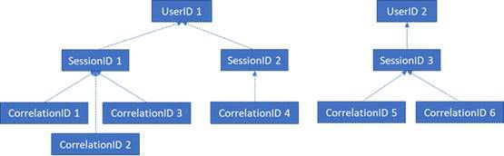

# RGPD para Servidor do Office Web Apps e Servidor do Office OnlineGDPR for Office Web Apps Server and Office Online Server

Dados de telemetria do Servidor do Office Web Apps e do Servidor do Office Online são armazenados em forma de logs ULS. Você pode usar [ULSViewer](https://www.microsoft.com/en-us/download/details.aspx?id=44020) para exibir os logs ULS do seu locatário local.Office Online Server and Office Web Apps Server telemetry data is stored in the form of ULS logs. You can use [ULS Viewer](https://www.microsoft.com/en-us/download/details.aspx?id=44020) to view ULS logs from your on-premises tenant.

Todas as linhas de log contêm uma CorrelationID. Linhas de log relacionadas compartilham a mesma CorrelationID. Cada CorrelationID está vinculada a uma SessionID e uma SessionID pode estar relacionada a muitas CorrelationIDs. Cada SessionID pode estar relacionada a uma única UserID, embora algumas sessões possam ser anônimas e, portanto, não estarem associadas a uma UserID. Para determinar quais dados estão associados a um usuário específico, é possível mapear de uma única UserID para as SessionIDs associadas ao usuário, das SessionIDs para as CorrelationIDs associadas, e dessas CorrelationIDs para todos os logs nessas correlações. Confira o diagrama abaixo para verificar a relação entre as diferentes IDs.Every log line contains a CorrelationID. Related log lines share the same CorrelationID. Each CorrelationID is tied to a single SessionID, and one SessionID may be related to many CorrelationIDs. Each SessionID may be related to a single UserID, although some sessions can be anonymous and therefore not have an associated UserID. In order to determine what data is associated with a particular user, it is therefore possible to map from a single UserID to the SessionIDs associated with that user, from those SessionIDs to the associated CorrelationIDs, and from those CorrelationIDs to all the logs in those correlations. See the below diagram for the relationship between the different IDs.

## Coletar logsGathering Logs

Para reunir todos os logs associados com a UserID 1, por exemplo, a primeira etapa é reunir todas as sessões associadas à UserID 1 (ou seja, SessionID 1 e SessionID2). A próxima etapa será reunir todas as correlações associadas com a SessionID 1 (ou seja, CorrelationIDs 1, 2 e 3) e com a SessionID 2 (ou seja, CorrelationID 4). Por fim, reúna todos os logs associados a cada correlação na lista.In order to gather all logs associated with UserID 1, for example, the first step would be to gather all sessions associated with UserID 1 (i.e. SessionID 1 and SessionID2). The next step would be to gather all correlations associated with SessionID 1 (i.e. CorrelationIDs 1, 2, and 3) and with SessionID 2 (i.e. CorrelationID 4). Finally, gather all logs associated with each of the correlations in the list.

1.  Iniciar o ULSViewerLaunch UlsViewer

2.  Abra o log ULS correspondente ao período de tempo pretendido; logs ULS são armazenados em %PROGRAMDATA%\\Microsoft\\OfficeWebApps\\Data\\Logs\\ULSOpen up the uls log corresponding to the intended timeframe; ULS logs are stored in %PROGRAMDATA%\\Microsoft\\OfficeWebApps\\Data\\Logs\\ULS

3.  Editar | Modificar FiltroEdit | Modify Filter

4.  Aplique um filtro que seja:Apply a filter that is:

    -   EventID igual a apr3y ouEventID equals apr3y Or

    -   EventID igual a bp2d6EventID equals bp2d6

5.  UserIDs com hash estarão na mensagem de qualquer um desses dois eventosHashed UserIds will be in the Message of either one of these two events

6.  Para apr3y, a mensagem conterá um valor de UserID e um valor de PUIDFor apr3y, the Message will contain a UserID value and a PUID value

7.  Para bp2d6, a mensagem conterá uma grande quantidade de informações. O campo de valor LoggableUserId é a UserID com hash.For bp2d6, the Message will contain quite a bit of information. The LoggableUserId Value field is the hashed UserID.

8.  Depois de obter a UserID com hash dessas duas marcas, o valor de WacSessionId dessa linha no ULSViewer conterá a WacSessionId associada ao usuárioOnce the hashed UserId is obtained from either of these two tags, the WacSessionId value of that row in ULSViewer will contain the WacSessionId associated with that user

9.  Colete todos os valores de WacSessionId associados com usuários em questãoCollect all of the WacSessionId values associated with the user in question

10. Filtre todos EventId iguais a "xmnv", Message igual a "UserSessionId =\<WacSessionId\>" para a primeira WacSessionId na lista (substituindo a \<WacSessionId\> do filtro pela sua WacSessionId)Filter for all EventId equals "xmnv", Message equals "UserSessionId=\<WacSessionId\>" for the first WacSessionId in the list (replacing the \<WacSessionId\> part of the filter with your WacSessionId)

11. Colete todos os valores de correlação que correspondam a essa WacSessionIdCollect all values of Correlation that match that WacSessionId

12. Repita as etapas 10 e 11 para todos os valores de WacSessionId em sua lista de usuários em questãoRepeat steps 10-11 for all values of WacSessionId in your list for the user in question

13. Filtrar para todos os valores de correlação iguais à primeira correlação da sua listaFilter for all Correlation equals the first Correlation in your list

14. Colete todos os logs correspondentes a essa correlaçãoCollect all logs matching that Correlation

15. Repita as etapas 13 e 14 para todos os valores de correlação em sua lista de usuários em questãoRepeat steps 13-14 for all values of Correlation in your list for the user in question

## Tipos de dadosTypes of Data

Os logs do Office Online contêm diversos tipos de dados. A seguir são apresentados exemplos de dados que podem conter logs ULS:Office Online logs contain a variety of different types of data. The following are examples of the data that ULS logs may contain:

-   Códigos de erro para problemas encontrados durante o uso do produtoError codes for issues encountered during use of the product

-   Cliques de botão e outros dados sobre o uso do aplicativoButton clicks and other pieces of data about app usage

-   Dados de desempenho do aplicativo e/ou recursos específicos do aplicativoPerformance data about the app and/or particular features within the app

-   Informações gerais de localização sobre onde está o computador do usuário (por exemplo, país/região, estado e cidade, derivadas do endereço IP), mas não uma geolocalização precisaGeneral location information about where the user’s computer is (e.g. country / region, state, and city, derived from the IP address), but not precise geolocation

-   Metadados básicos sobre o navegador, por exemplo, o nome e a versão do navegador e informações sobre o computador, como o tipo e a versão do sistema operacionalBasic metadata about the browser, e.g. browser name and version, and the computer, e.g. OS type and version

-   Mensagens de erro do host do documento (por exemplo, OneDrive, SharePoint, Exchange)Error messages from the document host (e.g. OneDrive, SharePoint, Exchange)

-   Informações sobre processos internos do aplicativo não relacionados a ações do usuárioInformation about processes internal to the app, unrelated to any action the user has taken
