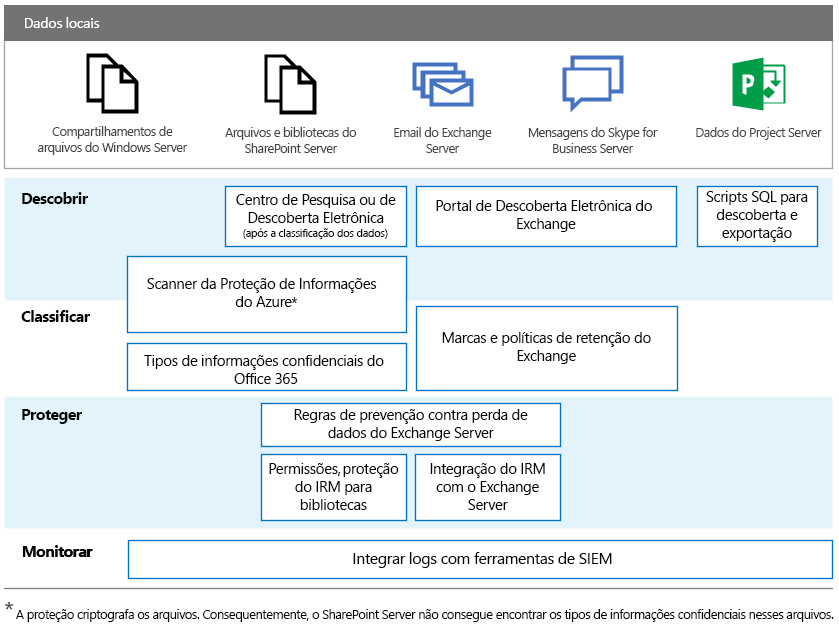

# RGPD para servidores locais do Office

O RGPD (Regulamento Geral sobre a Proteção de Dados) apresenta os requisitos para as organizações protegerem dados pessoais adequadamente e atender adequadamente às solicitações de titulares de dados. Esta série de artigos fornece abordagens recomendadas para cargas de trabalho locais:

-   [SharePoint Server](gdpr-for-sharepoint-server.md)

-   [Exchange Server](gdpr-for-exchange-server.md)

-   [Skype for Business Server](gdpr-for-skype-for-business-server.md)

-   [Project Server](gdpr-for-project-server.md)

-   [Servidor do Office Web Apps e Servidor do Office Online](gdpr-for-office-online-server.md)

-   [Compartilhamentos de arquivos locais](gdpr-for-on-premises-file-shares.md)

Para obter mais informações sobre o RGPD e como a Microsoft pode ajudar você, confira a [Central de Confiabilidade da Microsoft](https://www.microsoft.com/pt-BR/TrustCenter/Privacy/gdpr/default.aspx).

Antes de trabalhar com dados locais, consulte suas equipes de conformidade e jurídica para buscar orientações e saber mais sobre os esquemas e as abordagens existentes de classificação para trabalhar com dados pessoais. A Microsoft fornece recomendações para desenvolver e estender esquemas de classificação no Microsoft GDPR Data Discovery Toolkit em [http://aka.ms/gdprpartners](<http://aka.ms/gdprpartners>). Esse kit de ferramentas também descreve abordagens para mover dados locais para a nuvem, onde você pode usar recursos de governança de dados mais sofisticados, se desejar. Os artigos nesta seção fornecem recomendações para os dados destinados a permanecerem no local.

A ilustração a seguir lista os recursos recomendados para usar em cada uma dessas cargas de trabalho para descobrir, classificar, proteger e monitorar dados pessoais. Confira os artigos desta seção para saber mais.

## Descrição da ilustração

Para aprimorar a acessibilidade, a tabela a seguir fornece os mesmos exemplos da ilustração.

|             |Compartilhamentos de arquivos do Windows Server|SharePoint Server|Exchange Server|Skype for Business|Project Server|
|:------------|:-------------------------|:----------------|:--------------|:-----------------|:-------------|
|Descobrir|Verificador da Proteção de Informações do Azure*|Centro de Pesquisa ou Descoberta Eletrônica (depois que os dados forem classificados); verificador da Proteção de Informações do Azure*|Portal de Descoberta Eletrônica do Exchange|Portal de Descoberta Eletrônica do Exchange|Scripts SQL para descobrir e exportar|
|Classificar|Verificador da Proteção de Informações do Azure*; tipos de informações confidenciais do Office 365|Verificador da Proteção de Informações do Azure*; tipos de informações confidenciais do Office 365|Marcas e políticas de retenção do Exchange|Marcas e políticas de retenção do Exchange||
|Proteger||Regras de prevenção contra perda de dados do Exchange Server; proteção de IRM para bibliotecas de permissões|Regras de prevenção contra perda de dados do Exchange Server; integração de IRM com o Exchange Server|||
|Monitorar|Integrar logs com ferramentas SIEM|Integrar logs com ferramentas SIEM|Integrar logs com ferramentas SIEM|Integrar logs com ferramentas SIEM|Integrar logs com ferramentas SIEM|

*A proteção criptografa os arquivos. Consequentemente, o SharePoint Server não consegue encontrar os tipos de informações confidenciais nesses arquivos.
