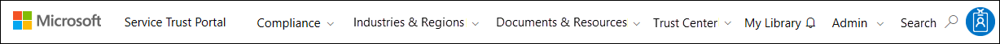

# Introdução ao Portal de Confiança do Serviço Microsoft

O Portal de confiança do serviço da Microsoft oferece uma variedade de conteúdo, ferramentas e outros recursos sobre práticas recomendadas de segurança, privacidade e conformidade da Microsoft.
  
## Como acessar o Portal de confiança do serviço

O Portal do serviço confiar contém detalhes sobre a implementação de controles e processos que protegem os dados do cliente e nossos serviços de nuvem aí da Microsoft. Para acessar alguns dos recursos no Portal de confiança do serviço, você deve fazer logon como um usuário autenticado com sua conta de serviços de nuvem Microsoft (uma conta de organização do Azure Active Directory ou uma Account da Microsoft) e revisar e aceitar a Microsoft Contrato de confidencialidade para materiais de conformidade.
  
**Os clientes podem acessar o Portal do serviço confiar** em [https://aka.ms/STP](https://aka.ms/STP) com uma das seguintes assinaturas online (avaliação ou pagas): 
  
- Office 365

- Dynamics 365

- Azure
    
 > [!NOTE]
 > Azure contas do Active Directory associadas organizações têm acesso a toda a gama de recursos como o Gerenciador de conformidade e documentos. Contas do Microsoft criadas para uso pessoal têm acesso ao conteúdo do Portal do serviço confiar limitado. 
  
**Novos clientes e avaliar o Microsoft online services**
  
Para criar uma nova conta ou para criar uma conta de avaliação, use uma das seguintes formas de inscrição (também é usadas para contas de avaliação) para obter acesso ao STP.
  
- Inscreva-se para uma nova [conta de avaliação do Office 365 Business](https://go.microsoft.com/fwlink/p/?LinkID=507653) ou uma nova [conta de avaliação do Office 365 Enterprise](https://go.microsoft.com/fwlink/p/?LinkID=698279)

- Inscreva-se para uma nova [conta de avaliação do Dynamics 365](https://go.microsoft.com/fwlink/?LinkId=252780)

- Inscreva-se para uma nova [conta de avaliação do Azure](https://go.microsoft.com/fwlink/?LinkId=722737). 
    
Quando você se inscreve para uma avaliação gratuita ou uma assinatura, você deve ativar o Azure Active Directory dar suporte ao seu acesso à STP.
  
## Usando o Portal de confiança do serviço

Os recursos de Portal do serviço de confiança e o conteúdo são acessíveis a partir do menu principal.
  

As seções a seguir descrevem cada item no menu principal.
  
### Portal de Confiança do Serviço

O link do **Portal do serviço de confiança** exibe a home page. Ele fornece uma maneira rápida para voltar à home page.

### Conformidade

Fornece as seguintes ferramentas relacionadas a conformidade e os recursos:

- **Relatórios de auditoria** - uma lista de relatórios de auditoria e avaliação independentes nos serviços de nuvem da Microsoft é exibida. Esses relatórios fornecem informações sobre conformidade do Microsoft Cloud services com os padrões de proteção de dados e os requisitos normativos, tais como:
  
    - Organização internacional de normalização (ISO)
    - Controles de organização de serviço (SOC)
    - Instituto Nacional de padrões e tecnologia (NIST)
    - Risco federal e o programa de gerenciamento de autorização (FedRAMP)
    - Proteção de dados gerais regulamentação (GDPR)

  Informações sobre os relatórios de auditoria e um link para a página **relatórios de auditoria** também são exibidas na home page do Portal do serviço de confiança. 
  
- **Gerenciador de conformidade** - Gerenciador de conformidade é uma ferramenta de avaliação de risco com base no fluxo de trabalho que ajuda você a acompanhar, atribuir e verificar as atividades de conformidade a normas da sua organização relacionada aos serviços do Microsoft Cloud, como o Office 365, Dynamics 365, e Windows Azure. Use o Gerenciador de conformidade para gerenciar a conformidade a normas no modelo de responsabilidade compartilhada da nuvem. Para obter mais informações, consulte [Usar o Gerenciador de conformidade para ajudar a atender aos requisitos normativos ao usar os serviços de nuvem da Microsoft e proteção de dados](meet-data-protection-and-regulatory-reqs-using-microsoft-cloud.md).

### Setores & regiões

Fornece informações de conformidade específicos do setor e região sobre os serviços Microsoft Cloud.

- **Setores** - fornece páginas de aterrissagem específicas do setor para obter informações sobre como o Microsoft Cloud services ajudar sua organização a estar em conformidade com os padrões e normas para esses setores:

    - Educação
    - Serviços financeiros
    - Governo
    - Integridade
    - Fabricação
    - Varejo

- **Regiões** - fornece opiniões legais sobre conformidade de serviços do Microsoft Cloud com várias leis de vários países. Determinados países incluem Austrália, República Tcheca, Alemanha, Polônia, Romênia, Espanha e Reino Unido.
  
### Recursos de & de documentos

Fornece uma ampla gama de informações de design e implementação de segurança com o objetivo de tornando mais fácil para atender aos objetivos de conformidade a normas através da compreensão de como o Microsoft Cloud services mantêm seus dados seguros. Para revisar o conteúdo, selecione uma das opções na página **documentos & recursos** .

- White papers, perguntas frequentes e How em artigos
- Guias de conformidade
- Testes de caneta e avaliações de segurança
- Pontuação de segura
- Segurança do Azure e plantas de conformidade
- Controles auditados
  
### Central de Confiabilidade

Links para a [Central de confiabilidade da Microsoft](https://www.microsoft.com/trustcenter), que fornece mais informações sobre segurança, conformidade e privacidade no Microsoft Cloud. Isso inclui informações sobre os recursos nos serviços do Microsoft Cloud que você pode usar para atender aos requisitos específicos de GDPR, documentação úteis para sua responsabilidade GDPR e sua compreensão das medidas técnicas e organizacionais Microsoft levou para dar suporte a GDPR.
  
### Minha biblioteca

Este novo recurso permite que você salve (ou o *pin*) documentos para que possam acessá-los rapidamente em sua página My Library. Você também pode configurar as notificações para que a Microsoft envia uma mensagem de email quando os documentos em sua biblioteca meu são atualizados. Para obter mais informações, consulte a seção de [Biblioteca meu](#my-library-1) neste artigo.

### Admin

Funções administrativas que só estão disponíveis para a conta de administrador global. Essa opção estará visível somente quando você estiver conectado como um administrador global.
  
 A página de **configurações** permite para atribuir acesso baseado em função para o Gerenciador de conformidade. Para obter mais informações, consulte a seção "Permissões e controle de acesso baseado em função" no [Gerenciador de conformidade para ajudar a atender aos requisitos normativos ao usar os serviços de nuvem da Microsoft e proteção de dados de uso](meet-data-protection-and-regulatory-reqs-using-microsoft-cloud.md#permissions-and-role-based-access-control).
  
### Pesquisa

Clique no botão de lupa no canto superior direito da página do Portal do serviço de confiança para expandir a caixa, digite os termos de pesquisa e pressione **Enter**.

  
 A página de **pesquisa** é exibida, com o termo de pesquisa exibido na caixa de pesquisa e os resultados da pesquisa listadas abaixo.
  

Por padrão, a pesquisa retorna resultados de documento. Você pode os resultados usando listas suspensas para refinar a lista de documentos exibidos. Você pode usar vários filtros para restringir a lista de documentos. Filtros incluem os serviços de nuvem específico, categorias de setores, regiões ou práticas de segurança e conformidade. Clique no link do nome do documento para baixar o documento.
  
À lista de controles de avaliações no Gerenciador de conformidade relacionados ao seus termos de pesquisa, clique em **Gerenciador de conformidade**. Os resultados da pesquisa mostram a data de avaliação foi criada, o nome da avaliação de agrupamento, o serviço Microsoft Cloud aplicável, e se o controle está da Microsoft ou gerenciados pelo cliente. Clique no nome do controle para exibir o controle na avaliação no Gerenciador de conformidade.
  

  
> [!NOTE]
> Portal de confiança do serviço de relatórios e documentos estão disponíveis para download pelo menos 12 meses após a publicação ou até uma nova versão do documento se tornar disponível.
  
## Minha biblioteca

Use o recurso de biblioteca de meu para adicionar documentos e recursos no Portal do serviço de confiança para sua página de meu biblioteca. Isso lhe permite acessar os documentos que são relevantes para você em um único lugar.  Para adicionar um documento à sua biblioteca meu, clique no menu **…** à direita de um documento e selecione **Adicionar à biblioteca**. Você pode adicionar vários documentos em sua biblioteca de meu clicando na caixa de seleção ao lado de um ou mais documentos e, em seguida, clicando em **Salvar biblioteca** na parte superior da página.

Além disso, o recurso de notificações permite configurar sua biblioteca de meu para que uma mensagem de email é enviada a você sempre que a Microsoft atualiza um documento que você tenha adicionado à sua biblioteca meu. Para configurar as notificações, vá para a sua biblioteca meu e clique em **Configurações de notificação**. Você pode escolher a frequência das notificações e especificar um endereço de email na sua organização aos quais enviar notificações. Notificações por email incluem links para os documentos que foram atualizados e uma breve descrição da atualização.

Observe também que podemos identificar quaisquer documentos em sua biblioteca meu que foram atualizados nos últimos 30 dias, independentemente de estarem ou não ativar notificações. Uma breve descrição da atualização também é exibida em uma dica de ferramenta. 

## Pacotes de início

Pacotes de início são um conjunto de curated de Microsoft da documentação sobre os serviços Microsoft Cloud para setores específicos. Atualmente, o Portal do serviço confiar oferece os seguintes pacotes de três starter para organizações de serviços financeiros. Esses pacotes starter ajudam as organizações a avaliar e avaliar a segurança, a conformidade e privacidade no Microsoft Cloud e oferecem diretrizes para ajudar a implementar os serviços Microsoft Cloud no setor de serviços financeiros altamente regulamentado.

- **Pacote de início da avaliação** - uso para avaliação inicial de nuvem da Microsoft para organizações de serviços financeiros.

- **Pacote de início da avaliação** - depois de avaliação, use as listas de verificação e outras diretrizes neste Pack starter para ajudar a avaliar os riscos relacionados à privacidade, segurança e conformidade de sua organização.

- **Pacote de início de auditoria** - usuário esse pacote de início para orientação sobre como usar controles de auditoria e outra ferramenta para ajudar a orientar a implementação dos serviços do Microsoft Cloud de forma que ajuda a reduzir a exposição da sua organização a riscos.

Para acessar esses pacotes de início, vá para o **Portal do serviço confiar gt _ setores & regiões gt _ soluções setoriais gt _ serviços financeiros**. Você pode abrir ou documentos um download a partir de um starter pack ou salvá-los em sua biblioteca meu.

## Suporte de localização

O Portal do serviço confiar permite que você exiba o conteúdo da página em diferentes idiomas. Para alterar o idioma da página, clique no ícone de globo no canto inferior esquerdo da página e selecione o idioma de sua escolha. 
  

  
## Comentários

Podemos ajudar com perguntas sobre o Portal do serviço confiar ou erros que ocorrem quando você usar o portal. Você também pode contatar conosco com perguntas e comentários sobre relatórios do Portal de confiança do serviço de conformidade e recursos de confiança usando o link de comentários na parte inferior das páginas STP.
  
Seus comentários são muito importante para nós. Clique no botão comentários na parte inferior da página para envie seus comentários sobre o que você tenha ou não gostou ou sugestões talvez seja necessário para melhorar nossos produtos ou recursos do produto.
  

