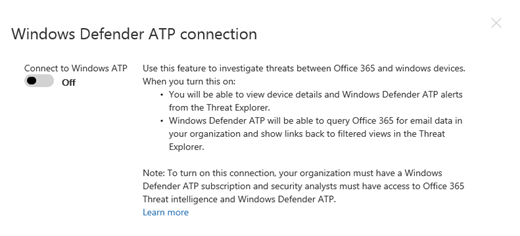

# Integrar a proteção avançada contra ameaças do Office 365 com a proteção avançada contra ameaças do Microsoft defender

Se você fizer parte da equipe de segurança da sua organização, poderá integrar a [proteção avançada contra ameaças do Office 365](office-365-atp.md) e os recursos de investigação e resposta relacionados à [proteção avançada contra ameaças do Microsoft defender](https://docs.microsoft.com/windows/security/threat-protection/microsoft-defender-atp/microsoft-defender-advanced-threat-protection). Isso pode ajudá-lo a entender rapidamente se as máquinas dos usuários estão em risco quando você está investigando ameaças no Office 365. Por exemplo, depois que a integração estiver habilitada, você poderá ver uma lista de máquinas que são usadas pelos destinatários de uma mensagem de email detectada, bem como os alertas recentes que essas máquinas têm na proteção avançada contra ameaças do Microsoft defender.
  
A imagem a seguir mostra a guia **dispositivos** que você verá quando tiver a integração do Microsoft defender ATP habilitada:
  

  
Neste exemplo, você pode ver que os destinatários da mensagem de email têm quatro dispositivos e um tem um alerta. Clicar no link de um dispositivo abre sua página na central de segurança do Microsoft defender.
  
## Requisitos

- Sua organização deve ter o Office 365 ATP Plan 2 (ou o Office 365 E5) e o Microsoft defender ATP.
    
- Você deve ser um administrador global do Office 365 ou ter uma função de administrador de segurança (como administrador de segurança) atribuída no [centro de conformidade de segurança &amp; ](https://protection.office.com). (Consulte [permissões no centro de conformidade de &amp; segurança do Office 365](permissions-in-the-security-and-compliance-center.md))
    
- Você deve ter acesso ao [Explorer (ou às detecções em tempo real)](threat-explorer.md) no centro de segurança & conformidade e no centro de segurança do Microsoft defender.
    
## Para integrar o Office 365 ATP com o Microsoft defender ATP

A integração do Office 365 ATP com o Microsoft defender ATP é configurada usando o centro de conformidade & segurança e o centro de segurança do Microsoft defender.
  
1. Como um administrador global do Office 365 ou um administrador de segurança, [https://protection.office.com](https://protection.office.com) acesse e entre com sua conta corporativa ou de estudante para o Office 365.
    
2. Escolha **** \> **Gerenciador**de gerenciamento de ameaças.  
    
3. No canto superior direito da tela, escolha configurações de **WDATP**.
    
4. Na caixa de diálogo conexão ATP do Windows Defender, ative conectar ao Windows ATP.  
    
5. Habilite a conexão na central de segurança do Microsoft defender.

  
## Tópicos relacionados

[Investigação e resposta contra ameaças do Office 365](office-365-ti.md)
  
[Proteção Avançada contra Ameaças do Office 365](office-365-atp.md)
  

